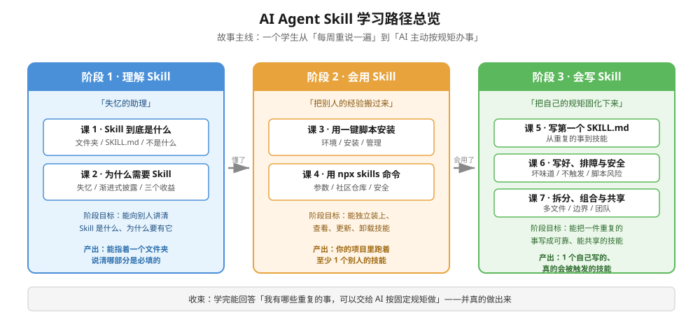

# 01-学习路径总览

## 学习目标

学完这门课，你应该能够：

1. **讲清楚** Skill 是什么、为什么需要它（能向别人解释，而不只是会用）
2. **独立操作** 技能的安装、查看、更新、卸载（两条路线都会）
3. **自己写出** 一个可靠、能真正被 AI 触发的 SKILL.md
4. **判断** 一个技能写得好不好、能不能装、有没有风险
5. **把重复的活** 从"每次重说一遍"变成"AI 主动按规矩办"

**学习者画像**：无开发经验、AI 使用较少的学生。全程只需复制粘贴命令，不需要编程基础。

**实测环境**（文中所有命令都在下面这台机器上真跑过）：

| 项目 | 值 |
|------|-----|
| 系统 | Windows（PowerShell） |
| Node.js | v22.14.0 |
| npm / npx | 10.9.2 |
| skills CLI | 1.5.24 |
| 核查时间 | 2026-09 |

---

## 故事主线

> **一个学生从「每周重说一遍」到「AI 主动按规矩办事」**

- **主角**：你（一个每周都要跟 AI 重复解释同一套要求的学生）
- **冲突**：AI 每次新对话都从零开始，你每周重说一遍，还会漏说
- **转折 1**：发现 Skill 能把这些规矩"存"下来（阶段 1）
- **转折 2**：发现别人已经写好了大量技能，装来就能用（阶段 2）
- **转折 3**：发现自己的规矩也可以写成技能，而且比装别人的更贴合（阶段 3）
- **收束**：你能回答"我有哪些重复的事可以交给 AI 按固定规矩做"，并真的做出来

---

## 全阶段总览

| 阶段 | 名称 | 章节定位 | 核心目标 | 课数 |
|------|------|---------|---------|------|
| 1 | 理解 Skill | 「失忆的助理」——为什么会有这个东西 | 能讲清是什么、为什么 | 2 |
| 2 | 会用 Skill | 「把别人的经验搬过来」 | 能独立装、看、更新、卸载 | 2 |
| 3 | 会写 Skill | 「把自己的规矩固化下来」 | 能写出可靠且能触发的技能 | 3 |

**阶段依赖**：阶段 1 → 阶段 2 → 阶段 3（严格前置，不可跳）

- 阶段 2 依赖阶段 1：不懂 `SKILL.md` 结构，装完了也不知道去哪看
- 阶段 3 依赖阶段 2：没用过别人的技能，直接写容易写成"自嗨文档"

### 阶段依赖图

---

## 各阶段重点一览

### 阶段 1：理解 Skill（2 课）

| 课 | 名称 | 知识点 | 一句话 |
|----|------|--------|--------|
| 1 | Skill 到底是什么 | Skill 的物理形态、SKILL.md 结构、Skill 不是什么 | 一个文件夹 + 一个 `SKILL.md` |
| 2 | 为什么需要 Skill | AI 的失忆特性、渐进式披露、三个实际收益 | 解决"每次重说、每次不一样" |

**必须掌握**：`SKILL.md` 的两个必填字段（`name` / `description`）、渐进式披露三步、Skill 与提示词/MCP 的区别。

### 阶段 2：会用 Skill（2 课）

| 课 | 名称 | 知识点 | 一句话 | 状态 |
|----|------|--------|--------|------|
| 3 | [用一键脚本安装](./stages/2-会用Skill/lessons/lesson-03-用一键脚本安装.md) | 环境准备、安装、查看、更新、卸载 | 新手首选，一条命令搞定 | ✅ |
| 4 | [用 npx skills 命令](./stages/2-会用Skill/lessons/lesson-04-用npx-skills命令.md) | 参数详解、社区仓库、安全边界 | 进阶路线，能装任何仓库 | ✅ |

**必须掌握**：`install` / `list` / `update` / `remove` 四个子命令、`.ps1` 与 `.sh` 参数差异、`-l` 与 `use` 两个零风险探索命令、安全三条原则。

**阶段 2 已完结（2026-09-08）**。核心认知：**脚本 = `npx skills` + 记账本**；技能是纯文本指令，杀毒软件不拦，所以**先看后装**（`-l` 列、`use` 读）是必须养成的习惯。

### 阶段 3：会写 Skill（3 课）

| 课 | 名称 | 知识点 | 一句话 |
|----|------|--------|--------|
| 5 | [写第一个 SKILL.md](./stages/3-会写Skill/lessons/lesson-05-写第一个SKILL.md.md) | 从重复的事到技能、六段式写法、让 AI 帮你写 | 把"每周重说"变成一次写完 | ✅ |
| 6 | [写好、排障与安全](./stages/3-会写Skill/lessons/lesson-06-写好、排障与安全.md) | 坏味道识别、不触发排查、脚本风险 | 让它真的能用、不出事 | ✅ |
| 7 | [拆分、组合与共享](./stages/3-会写Skill/lessons/lesson-07-拆分、组合与共享.md) | 多文件拆分、技能边界、团队共享 | 从"能用"到"好用、可复用" | ✅ |

**必须掌握**：`description` 的写法（决定能否触发）、五类坏味道、不触发的四步排查、脚本类技能的安全边界。

---

### 收尾件（学完 7 课后）

| 文件 | 用途 |
|------|------|
| [07-结课实战项目](./07-结课实战项目.md) | 五步流程 + 验收清单，把知识变成能力 |
| [08-实战经验](./08-实战经验.md) | 六条评审教训 + 六条开发原则（讲原理） |
| [09-排障速查手册](./09-排障速查手册.md) | 按症状查（8 类症状 + 一键诊断） |
| [10-场景解法库](./10-场景解法库.md) | 6 个可复用模板，照着改就能用 |

## 给你的建议

1. **别跳阶段**。阶段 1 看着"只是概念"，但跳过它，阶段 3 写技能会写成流水账。
2. **每课都动手**。这门课的价值不在"看懂"，在于你电脑上真的多了一个能跑的技能。
3. **遇到黄色警告别慌**。文中会标注哪些是正常的（比如卸载时的"状态漂移"提示）。

---

## 相关文档

- [02-课程目录.md](./02-课程目录.md) —— 完整课程目录
- [00-学习档案.md](./00-学习档案.md) —— 你的进度与断点信息
- [overview.md](./overview.md) —— 速览版（一篇讲透，已交付）
