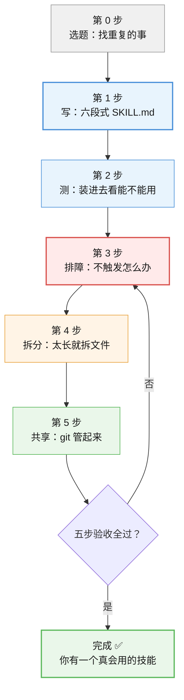

# 结课实战项目 · 把你的重复工作做成技能

> **定位**：学完 7 课之后的动手项目。走完"写 → 测 → 排障 → 拆分 → 共享"完整流程。
> **预计耗时**：60–90 分钟（第一次做可能更久，正常）
> **产出**：一个**你自己真的会用**的技能，以及一份可复制的验收清单

---

## 这个项目在做什么

7 课学完，你的知识还是"知道"，这个项目让它变成"做到"。

**核心原则**（请先看这条）：

> ⚠️ **选一件你每周真的要做 2 次以上的事**。不要为了"完成项目"随便编一个——编出来的技能你不会用，验收也验不出真实感受。

**如果你一时想不出来**，这里有 6 个候选（都是课程里出现过的真实场景）：

| # | 场景 | 适合谁 |
|---|------|--------|
| 1 | 论文/报告格式检查 | 学生、研究者 |
| 2 | 每周周报生成 | 上班族 |
| 3 | Git 提交信息规范 | 开发者 |
| 4 | 会议纪要整理成固定模板 | 常开会的人 |
| 5 | 代码审查清单 | 开发者 |
| 6 | 简历/文档润色成固定风格 | 求职者 |

**选一个，或者用你自己的。**

---

## 五步流程总览



---

## 第 0 步：选题（10 分钟）

### 判断标准

你的候选任务要**同时满足三条**：

| # | 标准 | 怎么判断 |
|---|------|---------|
| 1 | **重复**：每周至少 2 次 | 回想上周，你做过几次？ |
| 2 | **有固定规矩**：能说清"该怎么做" | 你能写出 3 条以上的明确要求吗？ |
| 3 | **AI 容易做错**：不加规矩就会跑偏 | 你是不是经常要纠正它？ |

> 💡 **第 3 条最关键**。如果 AI 本来就能做对，做成技能收益很小——**技能的价值在于"它本来会做错，现在不会了"**。

### 填这张卡

```
我的任务：______________________
每周做几次：____ 次
我要立的规矩（至少 3 条）：
  1. ______________________
  2. ______________________
  3. ______________________
AI 不加规矩时会怎么错：______________________
```

**写不出来？** 说明这个任务还不够具体，换一个。

---

## 第 1 步：写（20 分钟）

### 用六段式写 SKILL.md

课 5 学过的结构，这里回顾一下：

| 段 | 写什么 |
|----|--------|
| 1 | **角色/目标**：这个技能是干什么的 |
| 2 | **触发场景**：什么时候用（写进 `description`） |
| 3 | **输入**：用户会给什么 |
| 4 | **步骤**：具体怎么做（编号，别用大段散文） |
| 5 | **输出格式**：长什么样 |
| 6 | **边界/例外**：什么情况不用、遇到异常怎么办 |

### ⚠️ description 是第一优先级

课 6 讲过：**"不触发"是最致命的坏味道**，而原因 90% 在 `description` 太泛。

| ❌ 太泛（会不触发） | ✅ 具体（会触发） |
|-------------------|------------------|
| `处理文档` | `Use when checking a paper draft for formatting issues before submission...` |
| `帮我写周报` | `Use when turning bullet notes into a weekly report with fixed sections...` |

**公式**：`Use when <具体场景>. <具体做什么>. Examples: "<用户可能说的话>"`

### 命名规矩（别在这翻车）

| 规则 | 说明 |
|------|------|
| 只能用小写字母、数字、连字符 | `paper-format-check` ✅ / `Paper_Format` ❌ |
| **必须和文件夹名完全一致** | 课 6 实测：`remove` 按**文件夹名**匹配，不一致会删不掉 |
| 最长 64 字符 | 超了会被拒 |

### 参考模板（可直接改）

```markdown
---
name: paper-format-check
description: "Use when checking a paper or thesis draft for formatting issues before submission. Checks heading levels, figure/table numbering, and reference style. Examples: \"check my paper format\", \"帮我校对论文格式\""
---

# 论文格式检查

## 你要做的事
1. 通读全文，先看整体结构（标题层级是否连续）
2. 检查图表编号是否连续、正文是否引用了每个图表
3. 检查参考文献格式是否统一

## 输出要求
按「问题 → 位置 → 建议改法」三列输出，最后给一个总数。
```

### ⚠️ Windows 用户：必须用无 BOM 写法

课 6 的最大坑。如果用 `Set-Content -Encoding UTF8`，文件会带上 BOM，**技能静默失效且无任何报错**。

```powershell
# ✅ 正确（无 BOM）
[System.IO.File]::WriteAllText(
    "D:\skill-practice\my-skill\SKILL.md",
    $content,
    [System.Text.UTF8Encoding]::new($false)
)

# ❌ 错误（会加 BOM，技能静默失效）
Set-Content -Path "..." -Value $content -Encoding UTF8
```

> 💡 **省事做法**：让 AI 帮你写文件（它默认无 BOM），或者用 VS Code 新建文件。

### ✅ 第 1 步验收

- [ ] `name` 只用小写字母、数字、连字符
- [ ] `name` 和文件夹名**完全一致**
- [ ] `description` 写清了"什么场景用"，不是笼统的"处理 XX"
- [ ] `description` 里带了用户可能说的话（Examples）
- [ ] 正文用编号步骤，不是大段散文
- [ ] **文件开头首三字节不是 `239 187 191`**

---

## 第 2 步：测（15 分钟）

### 装进去

```powershell
# 复制到技能目录（Windows，Claude Code）
$dst = "$env:USERPROFILE\.claude\skills\你的技能名"
New-Item -ItemType Directory $dst -Force | Out-Null
Copy-Item "D:\skill-practice\你的技能名\*" $dst -Recurse -Force

# 确认它在列表里 ★ 这一步不能省 ★
npx skills list -g
```

> ⚠️ **`list -g` 必须跑**。课 6 教训：**失效是静默的**——文件看起来完全正常，但不出现在列表里。只有这条命令能告诉你真相。

### 实测是否会被触发

**这是最关键的一步，很多人跳过。**

新开一个对话，说一句**你日常会说的话**（比如"帮我看看这篇论文格式"），看 AI **会不会自动用上**你的技能。

| 结果 | 说明 | 下一步 |
|------|------|--------|
| ✅ 自动用上了 | 完美 | 进第 4 步 |
| ⚠️ 要你点名才用 | description 还不够准 | 回第 1 步改 description |
| ❌ 完全不理 | 有问题 | 进第 3 步排障 |

### 换个说法再测一次

**重要**：只测一句话不够。用 **3 种不同说法**测，因为你要覆盖真实使用中的各种表达：

```
说法 1（直接）："帮我检查论文格式"
说法 2（间接）："这篇能交了吗"
说法 3（带上下文）："我刚写完第三章，你帮我看看"
```

> 💡 **为什么测 3 种？** AI 靠 `description` 做语义匹配。说法 2、3 里可能**根本没出现**你写进 description 的关键词——这时候测的就是真正的语义匹配能力。

### ✅ 第 2 步验收

- [ ] `npx skills list -g` 里能看到它
- [ ] 用**日常说法**（不点名技能）AI 会**自动**用上
- [ ] 至少 **2 种不同说法**都能触发
- [ ] 输出符合你要求的格式

---

## 第 3 步：排障（遇到问题再看）

### 症状 → 排查表

课 6 实测证实的排查顺序，**按这个顺序走**：

| 症状 | 排查项 | 命令/动作 |
|------|--------|----------|
| **list 里根本看不到** | ① **BOM**（头号嫌疑） | 查首三字节是否 `239 187 191` |
| | ② YAML 语法错误 | 检查 `---` 是否成对、`name:` 后是否有空格 |
| | ③ 放错目录 | 确认在 `.claude\skills\` 下 |
| **list 能看到，但不触发** | ① **description 太泛** | 加具体场景词 + Examples |
| | ② description 没覆盖用户说法 | 多测几种表达 |
| **触发了但做得不对** | ① 正文步骤太笼统 | 改成编号步骤，加输出格式示例 |
| | ② 缺少边界说明 | 补"什么情况不做" |

### 查 BOM（第一条必做）

```powershell
$p = "$env:USERPROFILE\.claude\skills\你的技能\SKILL.md"
[System.IO.File]::ReadAllBytes($p)[0..2]
```

| 看到 | 判定 | 处理 |
|------|------|------|
| `239 187 191` | **有 BOM，技能已失效** | 用无 BOM 写法重写 |
| `45 45 45`（`---`） | 正常 | 继续查下一项 |

> 💡 **顺带一提**：git 报的 `LF will be replaced by CRLF` **是无害的**（课 7 实测：带 CRLF 的技能识别完全正常）。**别把它和 BOM 搞混**——BOM 是开头多三个字节（致命），CRLF 只是换行符风格（无害）。

### 用 AI 自查（省事办法）

直接问 AI：

```
这是我的 SKILL.md，帮我检查：
1. description 会不会太泛导致不触发？
2. 有没有"该拆不拆"的坏味道？
3. name 和文件夹名一致吗？
```

> 💡 课 5 讲过：**写技能这件事本身不用你亲自动手**，AI 会帮你生成。你要做的是**检查它写得对不对**。

### ✅ 第 3 步验收

- [ ] 用上面的表逐项排查过
- [ ] 确认不是 BOM 问题
- [ ] 问题已定位并修复

---

## 第 4 步：拆分（10 分钟，可跳过）

### 什么时候需要拆

**先看数据**：本机 7 个技能最长 122 行，多数在 50–120 行。

| 主文件行数 | 处理 |
|-----------|------|
| < 150 行 | ✅ **不用拆**，直接进第 5 步 |
| 150–500 行 | 考虑拆（有详细规则表、长示例时） |
| **> 500 行** | **必须拆**（硬上限） |

> ⚠️ **别为了拆而拆**。多数人这一步可以直接跳过。

### 两种"拆"，别搞混

课 7 的核心辨析：

| 问题 | 表现 | 动作 |
|------|------|------|
| **太长** | 主文件超 500 行 | **拆文件** → `reference.md` + `scripts/` |
| **太宽** | 一个技能管多件事、description 写不具体 | **拆技能** → 拆成多个独立技能 |

**怎么判断"太宽"**：你的 `description` **写不出具体场景** → 十有八九是太宽了。

### 拆文件的三条规则

| 内容 | 放哪儿 |
|------|--------|
| 核心流程（每次都要做） | `SKILL.md` |
| 详细规则、长示例 | `reference.md` |
| 可执行脚本 | `scripts/` |

**🔴 最容易踩的坑**：拆出去了，**却忘了在 `SKILL.md` 里点名**。

```markdown
# ❌ 错：附件成了摆设
（reference.md 存在，但正文从头到尾没提过它）

# ✅ 对：明确点名
1. 先读 [reference.md](reference.md) 核对完整规则
2. 再执行 scripts/check.ps1
```

> 💡 课 7 实测：附件**只在被点名时才加载**（渐进式披露）。不点名 = 永远不读。

### ✅ 第 4 步验收

- [ ] 主文件 < 500 行（< 150 行则不必拆）
- [ ] 如果拆了：**`SKILL.md` 里明确点名了每个附件**
- [ ] 不是"太宽"（一个技能只管一件事）
- [ ] 重新跑 `list -g` 确认还能用

---

## 第 5 步：共享（15 分钟）

### 用 git 管起来

技能是**纯文本**，git 天生就能管（课 7 实测：多文件技能提交显示 `3 files changed`，附件全被管住）。

```powershell
cd D:\skill-practice\你的技能
git init
git add .
git commit -m "chore: init my skill"
```

**放哪儿？**

| 场景 | 放法 |
|------|------|
| 只服务当前项目 | 项目仓库的 `skills/` 目录 |
| 要给多个项目/别人用 | 独立仓库 |

### 更新与同步

```powershell
# 你改了技能
git add .
git commit -m "fix: 修正参考文献规则"
git push

# 对方拿更新
git pull
```

### 分享给别人的三种方式

| 方式 | 适用 |
|------|------|
| 直接拷文件夹 | 一对一，最快 |
| `git clone` | 团队、长期维护 |
| `npx skills add <仓库>` | 装别人发布的技能 |

**🔴 分享时必说的一句话**：

> **"收到后先跑 `npx skills list -g`，确认它在列表里。"**

**为什么？** 课 6/7 的教训：**BOM 会让技能静默失效**——对方拿到文件，看着完全正常，但 AI 不理它，**且不报任何错**。对方会以为"这技能没用"，你会以为"我发错版本了"，**两边都查不出原因**。

**最省事的对策**：让对方用 `npx skills add` 安装，别手改文件。

### ✅ 第 5 步验收

- [ ] 技能已纳入 git（有至少一次 commit）
- [ ] 如果分享了：**对方跑过 `list -g` 并确认在列表里**
- [ ] commit message 写清了改了什么

---

## 总验收清单

**全过 = 项目完成** ✅

| 阶段 | 验收项 | ✓ |
|------|--------|---|
| **选题** | 每周至少做 2 次的真实任务 | ☐ |
| **选题** | 能写出 3 条以上明确规矩 | ☐ |
| **写** | `name` 合规且与文件夹名一致 | ☐ |
| **写** | `description` 具体（有场景 + Examples） | ☐ |
| **写** | 文件无 BOM（首三字节非 239 187 191） | ☐ |
| **测** | `list -g` 里能看到 | ☐ |
| **测** | **不点名**也能被自动触发 | ☐ |
| **测** | 至少 2 种说法能触发 | ☐ |
| **排障** | 若失败，已按排查表定位并修复 | ☐ |
| **拆分** | 主文件 < 500 行（<150 行可不拆） | ☐ |
| **拆分** | 若拆了，附件在正文里被点名 | ☐ |
| **共享** | 已纳入 git | ☐ |
| **共享** | 若分享，对方已确认能用 | ☐ |

---

## 🐞 新手最常见的 5 个失败

| # | 失败 | 为什么 | 怎么救 |
|---|------|--------|--------|
| 1 | **选了个编出来的任务** | 不是真需求 → 做完就吃灰 | 回到第 0 步，选真会做的 |
| 2 | **description 太泛** | 最常见的不触发原因 | 加场景词 + Examples |
| 3 | **BOM 导致静默失效** | Windows 专属坑，无任何报错 | 查首三字节，用无 BOM 写法 |
| 4 | **只测了一种说法** | 真实使用说法千变万化 | 至少测 3 种 |
| 5 | **拆了却没点名** | 附件永远不被读 | 在 `SKILL.md` 里明确引用 |

---

## 完成后

**你已经具备**：

- 把一个重复任务固化成技能的能力
- 一套可复用的验收清单（下次做新技能直接照抄）
- 排查"不触发"问题的能力

**下一步**：

| 想做什么 | 去哪儿 |
|---------|--------|
| 查具体问题怎么解决 | [09-排障速查手册.md](./09-排障速查手册.md) |
| 看别人怎么做（场景参考） | [10-场景解法库.md](./10-场景解法库.md) |
| 看踩坑经验总结 | [08-实战经验.md](./08-实战经验.md) |

> 💡 **给 AI 的接力提示词**（做完后想让 AI 帮你优化技能时复制这段）：
>
> ```
> 我按 agent-skills-basics/07-结课实战项目.md 做完了一个技能，
> 在 [你的技能路径]。请按文档最后的「总验收清单」逐条帮我检查，
> 重点看 description 是否会不触发、有没有 BOM、有没有该拆不拆的坏味道。
> ```

---

📚 **返回**：[课程目录](./02-课程目录.md) ｜ [学习路径总览](./01-学习路径总览.md)
