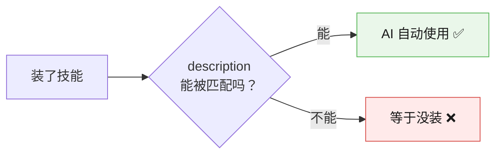

# 08-实战经验 · 从七课踩坑里长出来的教训

> **这份文档讲什么**：课程开发过程中**真实踩过的坑**，以及从中提炼出的可复用教训。
> **和速查手册的区别**：[09-排障速查手册](./09-排障速查手册.md) 是"出问题了怎么查"（按症状查）；本文档是"为什么会出问题"（讲原理和教训）。
> **所有条目均来自本机实测**（Windows + Node v22.14.0 + skills CLI 1.5.24，2026-09）

---

## 第一部分：六条评审教训

这六条是逐课固化下来的，**每一条都源于一次真实翻车**。它们不只适用于写技能——**任何"先产出结论再动手"的工作都适用**。


### 教训 ①：凭直觉判断 API，差点改坏正确的代码

**发生了什么**：评审时判断"代码参数名 `explicit_bucket_boundaries_advisory` 写错了，应为 `explicit_bucket_boundaries`"。

**实测推翻**：用 `inspect.signature` 检查——**原参数名是对的，改了反而 TypeError**。真正错的只是注释。

**教训**：

> **每一条"缺失/错误/遗漏"判定，动手改之前必须先核验。**

**若直接照改的后果**：把对的代码改坏，真正的错误反而留着。

---

### 教训 ②：不能跳步——每个代码块是独立会话

**发生了什么**：讲义原按"步骤 2/3/4"分块写命令，**变量带不过去**。

**实测发现**：PowerShell 里每个代码块是**独立会话**，上一段定义的 `$path` 到下一段就没了。读者照抄会报"变量未定义"。

**教训**：

> **写给别人的命令，必须假设读者一段一段复制粘贴。** 变量在每段内自包含。

---

### 教训 ③：外链至少测 3 次，308 ≠ 死链

**发生了什么**：`https://skills.sh/` 用 PowerShell 请求返回 **308**，一度判定为死链。

**实际**：换浏览器确认**页面正常可达**。

**另一面**：同一 Gitee raw 链接**首次下载成功，之后连试 3 次全部 404**。

**教训**：

> **单独一次网络结果不能定性。** 308 要换手段复核；而"曾经成功"也不代表稳定——**下载源要测多次**。

---

### 教训 ④：带可选参数的命令，要测"只给可选参数"的边界

**发生了什么**：讲义原写 `npx skills find --owner vercel`，实测该命令**只打印 Usage 说明**（不能单独用）。

**另一例**：`npx skills init --help` **不显示帮助**，而是**真的创建了一个名叫 `--help` 的目录**。

**教训**：

> **命令的每个参数组合都要单独跑一遍。** 尤其是"看起来人畜无害"的 `--help`——它可能真的去执行了。

---

### 教训 ⑤：一次实验不足以支撑因果结论

**发生了什么**（本课最重要的一条）：

最初实测发现"手动把技能拷进目录后 `list` 认不出"，一度得出结论"技能还需要某个注册步骤"。

**后来发现**：那次实验用的正是会加 BOM 的 `Set-Content`，**真因是 BOM**，不是"缺注册步骤"。

**教训**：

> **看到"不识别"就想当然归因，差点把一个错误结论教给学员。**
>
> **污染的实验环境会持续误导后续所有判断**——第一次实验的隐藏变量，会让后面 N 次验证都在错误前提下进行。

**配套规则**：下结论前问自己三个问题：

1. 我做的是**双向验证**吗？（无 X → 正常；有 X → 异常。缺一不可）
2. 实验环境里有没有**我没意识到的变量**？
3. 有没有**别的解释**也能导致这个现象？

---

### 教训 ⑥：写作工具本身会引入不可见变量 🔴

**发生了什么**（**Windows 用户头号杀手**）：

PowerShell 的 `Set-Content -Encoding UTF8` 会在文件头**悄悄加上三个字节**（`EF BB BF`，即 `239 187 191`）。

**后果**：技能**静默失效**——文件肉眼看完全正常，一个字没错，但 AI **根本不理它，且不报任何错**。

**双向验证**（课 6 实测）：

| 写法 | 结果 |
|------|------|
| `UTF8Encoding::new($false)`（无 BOM） | ✅ 技能正常出现在列表 |
| `Set-Content -Encoding UTF8`（有 BOM） | ❌ **技能凭空消失，无报错** |

**教训**：

> **你用来写文件的工具，本身可能改变文件。** 而这种改变是**不可见**的。

**这条为什么排最后但最重要**：前五条是"我判断错了"，这一条是"**工具骗了我**"——你根本不知道有变量存在。

**衍生**：这也解释了课 5 那次"技能拷进去认不出"——**真因可能是 BOM，而非当时归的"少冒号"**。

---

## 第二部分：技能开发的实战原则

### 原则 1：description 决定生死

**实测观察**：`npx skills remove` 扫描到 **66 个**已装技能，而 `list -g` 只显示 7 个（claude）+ 若干 codebuddy。

**这说明**：技能**散落在多处**。但对用户来说，**只有 description 能被 AI 匹配到的那些才"存在"**。



**公式**：`Use when <场景>. <做什么>. Examples: "<用户原话>"`

---

### 原则 2：删除用 `remove`，别手动删

**实测**：`remove` 扫描到 66 个技能，**手动删文件夹删不干净**（总仓库和目标目录会"状态漂移"）。

**配套发现**：

| 现象 | 说明 |
|------|------|
| `remove` 按**文件夹名**匹配，不是 `name` | name 叫 A、文件夹叫 B → 要用 B 删除 |
| **失效的技能 `remove` 也删不掉** | 先改回无 BOM 让它重新被识别，再删 |
| 看到黄色警告 `[WARN] npx 未删除 lock 条目` | **不是失败**，是脚本在兜底清理 |

> ⚠️ **绝对不要用 `--all`**。

---

### 原则 3：技能是纯文本，git 天生能管

**实测**：多文件技能提交显示 `3 files changed` + 三行 `create mode`，**附件一个不漏**。

**红利**：

- 改坏了能回退
- `git diff` 一眼看出这次动了什么（比凭记忆回想可靠得多）
- 团队共享就是 `push` / `pull`

---

### 原则 4：BOM 致命，CRLF 无害（最易混淆的一对）

课 6 刚建立"BOM 会让技能静默失效"的认知，课 7 紧接着 git 就报 `LF will be replaced by CRLF`。**这两个极易被当成同一类问题。**

**课 7 专门验证**：带 CRLF 的技能 → **识别完全正常**。

| | BOM | CRLF |
|---|-----|------|
| 本质 | 文件开头**多出三个字节** | 换行符**风格**不同 |
| 后果 | **静默失效** ❌ | **无影响** ✅ |
| 来源 | `Set-Content -Encoding UTF8` | git 自动统一 |

**记住**：

> **见到 CRLF 警告 → 明确告知无害**（否则读者被吓到）
> **见到首三字节 `239 187 191` → 立即判定 BOM**（否则忽略真杀手）

---

### 原则 5：太长拆文件，太宽拆技能

课 7 的核心辨析，**混用会让问题得不到解决**。

| 问题 | 信号 | 动作 |
|------|------|------|
| **太长** | 主文件 > 500 行（硬上限） | **拆文件** → `reference.md` + `scripts/` |
| **太宽** | description 写不出具体场景 | **拆技能** → 拆成多个独立技能 |

**实测数据**：本机 7 个技能最长 **122 行**，多数 50–120 行。

> 💡 **500 行是硬上限，不是目标。** 超过 150 行就该考虑，但**别为了拆而拆**。

---

### 原则 6：安全——技能会真的运行脚本

**Skill 不是"纯文本"**，它可以带脚本，**AI 会真的运行**。装陌生人写的技能 = 让陌生程序在你电脑上跑。

**三条原则**：

1. **只装信得过来源的**（大公司官方、知名开发者）
2. **装之前扫一眼内容**——用 `--list` 看有什么，或直接打开 `SKILL.md` 读
3. **AI 行为异常，立刻 `remove`**

---

## 第三部分：给未来的自己

### 写新技能时的检查顺序

```
1. 这事我每周真做 2 次以上吗？        ← 不过就别做
2. description 能写出具体场景吗？      ← 写不出说明太宽
3. 用无 BOM 写法写文件了吗？           ← Windows 必查
4. list -g 里能看到吗？                ← 看不到 = 已失效
5. 不点名会被自动触发吗？              ← 测 3 种说法
6. 主文件超 500 行了吗？               ← 超了拆文件
7. 附件在正文里点名了吗？              ← 没点名 = 摆设
```

### 一句话总结

> **技能开发的坑，90% 是"看不见"的**：看不见的 BOM、看不见的匹配失败、看不见的环境污染。
>
> **所以核心方法只有一个——实测，而且要有对照地实测。**

---

📚 **相关**：[09-排障速查手册](./09-排障速查手册.md) ｜ [10-场景解法库](./10-场景解法库.md) ｜ [课程目录](./02-课程目录.md)
