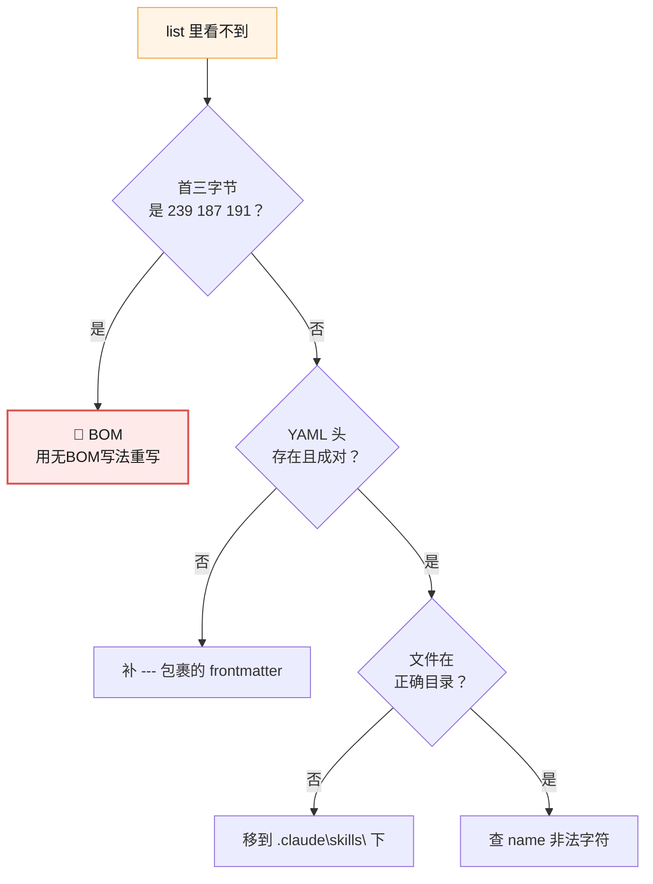
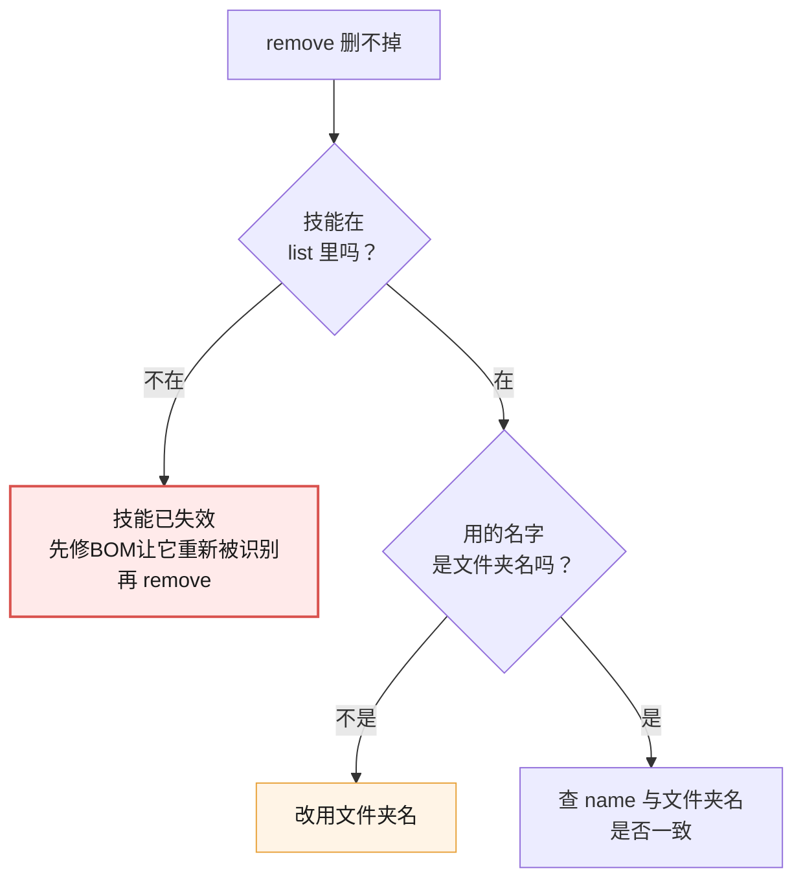
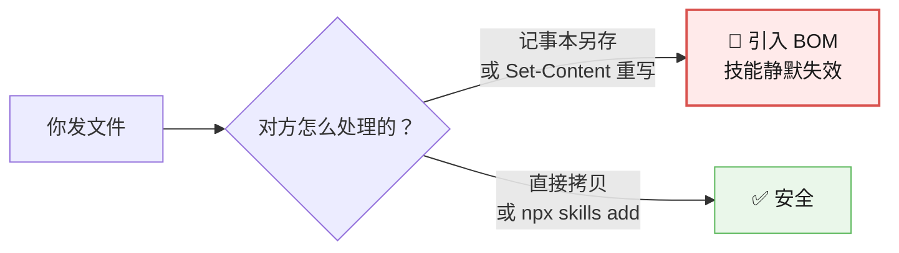

# 09-排障速查手册 · 按症状查

> **怎么用**：找到你的症状 → 按顺序执行排查命令 → 定位后修复。
> **所有命令均在 Windows + Node v22.14.0 + skills CLI 1.5.24 实测通过**（2026-09）
> **想了解"为什么会这样"**：见 [08-实战经验.md](./08-实战经验.md)

---

## 🚀 先看这个：一键诊断

**遇到任何"技能不对劲"，先跑这一段**（把 `你的技能名` 换成实际名字）：

```powershell
$skill = "你的技能名"
$p = "$env:USERPROFILE\.claude\skills\$skill\SKILL.md"

# 1. 文件在吗？
"文件存在: $(Test-Path $p)"

# 2. 有 BOM 吗？（头号嫌疑）
$b = [System.IO.File]::ReadAllBytes($p)[0..2]
"BOM 检查: $b  $(if($b[0] -eq 239){'❌ 有BOM！技能已失效'} else {'✅ 正常'})"

# 3. YAML 头能解析吗？
$c = Get-Content $p -Raw -Encoding UTF8
if ($c -match '(?s)^---\r?\n(.*?)\r?\n---') {
    $fm = $Matches[1]
    "YAML: ✅ 存在"
    if ($fm -match '(?m)^name:\s*(\S+)') { "name: $($Matches[1])  一致: $($Matches[1] -eq $skill)" }
    if ($fm -match '(?m)^description:\s*(.+)$') { "description 长度: $($Matches[1].Length)" }
} else { "YAML: ❌ 缺失或格式错误" }
```

**实测输出**（对正常技能）：

```
文件存在: True
BOM 检查: 45 45 45  ✅ 正常
YAML: ✅ 存在
name: gitnexus-guide  一致: True
description 长度: 87
```

> 💡 **`45 45 45` 就是 `---`**，说明文件开头正常。**看到 `239 187 191` 就是中招了。**

---

## 症状 ①：`list -g` 里根本看不到我的技能

**这是最严重的情况——技能已失效。**



### 排查 1：BOM（头号嫌疑，Windows 专属）

```powershell
[System.IO.File]::ReadAllBytes("$env:USERPROFILE\.claude\skills\你的技能\SKILL.md")[0..2]
```

| 看到 | 判定 | 修复 |
|------|------|------|
| `239 187 191` | **有 BOM** ❌ | 见下方"修复 BOM" |
| `45 45 45` | 正常 ✅ | 继续排查 2 |

**修复 BOM**（两种办法）：

```powershell
# 办法 A：无 BOM 重写（推荐）
$path = "$env:USERPROFILE\.claude\skills\你的技能\SKILL.md"
$t = Get-Content $path -Raw
[System.IO.File]::WriteAllText($path, $t, [System.Text.UTF8Encoding]::new($false))

# 办法 B：用 VS Code 打开 → 右下角点 UTF-8 → 选"通过编码保存" → UTF-8
```

> ⚠️ **千万别用** `Set-Content -Encoding UTF8`——**它就是 BOM 的来源**。

### 排查 2：YAML 头格式

| 检查项 | 常见错误 |
|--------|---------|
| `---` 是否成对 | 只有开头没有结尾 |
| `name:` 后是否有空格 | `name:foo` ❌ / `name: foo` ✅ |
| 冒号后是否缺空格 | `description:帮我` ❌ |
| 是否用了中文冒号 | `name：foo` ❌ |

### 排查 3：文件位置

| 工具 | 路径 |
|------|------|
| Claude Code（全局） | `C:\Users\你的用户名\.claude\skills\` |
| 项目级 | `你的项目\skills\` |

**不确定在哪？** 用 `npx skills list -g` 看已装技能显示的路径。

### 排查 4：name 非法字符

| 规则 | 示例 |
|------|------|
| 只能小写字母、数字、连字符 | `paper-format-check` ✅ |
| 不能有大写、下划线、空格 | `Paper_Format` ❌ |
| 最长 64 字符 | 超了会被拒 |

---

## 症状 ②：能看到，但 AI 不自动用

**这是最常见的情况——description 没写好。**

### 排查 1：description 是不是太泛了

| ❌ 太泛（不触发） | ✅ 具体（会触发） |
|------------------|------------------|
| `处理文档` | `Use when checking a paper draft for formatting issues...` |
| `帮我写周报` | `Use when turning bullet notes into a weekly report...` |
| `代码助手` | `Use when reviewing a git diff for bugs and security issues...` |

**公式**：`Use when <具体场景>. <做什么>. Examples: "<用户原话>"`

### 排查 2：description 没覆盖用户的说法

**测试方法**：用 **3 种不同说法**测，因为真实表达千变万化：

```
说法 1（直接）："帮我检查论文格式"      ← 通常能触发
说法 2（间接）："这篇能交了吗"          ← 可能出现不了关键词
说法 3（带上下文）："我刚写完第三章"    ← 最容易被漏掉
```

**怎么办**：把说法 2、3 里的关键词也加进 `description`。

### 排查 3：装太多了

**实测**：`remove` 扫描到 **66 个**技能，而 `list -g` 只显示 7 个 + 若干 codebuddy。

**说明**：技能散落多处，开场扫描的"名字+简介"仍占注意力。

> 💡 **装 5 个常用的，比装 55 个吃灰的强。**

---

## 症状 ③：触发了，但做得不对

**这是技能内容的问题，不是配置问题。**

| 现象 | 原因 | 修复 |
|------|------|------|
| 输出格式不对 | 正文没写清输出要求 | 加"输出格式"段，给示例 |
| 步骤漏做 | 步骤写成大段散文 | 改编号步骤 |
| 该拒绝时没拒绝 | 缺边界说明 | 加"什么情况不做" |
| 每次结果不一样 | 描述有歧义 | 用具体词，去掉"适当""合理"这类模糊表达 |

**自查话术**（直接问 AI）：

```
这是我的 SKILL.md，帮我检查：
1. description 会不会太泛？
2. 有没有"该拆不拆"的坏味道？
3. 步骤写得够明确吗？
```

---

## 症状 ④：删不掉



### 实测发现的三条

| # | 发现 | 对策 |
|---|------|------|
| 1 | **`remove` 按文件夹名匹配，不是 `name`** | 用文件夹名删 |
| 2 | **失效的技能 `remove` 也删不掉** | 先修 BOM 让它重新被识别，再删 |
| 3 | 黄色警告 `[WARN] npx 未删除 lock 条目` | **不是失败**，是脚本兜底清理 |

**正确顺序**：

```powershell
# 1. 先确认它在列表里
npx skills list -g | Select-String "你的技能"

# 2. 用文件夹名删除
npx skills remove 文件夹名 -g -y

# 3. 确认删干净
Test-Path "$env:USERPROFILE\.claude\skills\文件夹名"   # 应为 False
```

> ⚠️ **绝对不要用 `--all`**——会删掉所有技能。

---

## 症状 ⑤：多文件技能，附件没被读取

**最常见原因：拆出去了，却没在 `SKILL.md` 里点名。**

```markdown
# ❌ 错：附件成了摆设
（reference.md 存在，但正文从头到尾没提过它）

# ✅ 对：明确点名
1. 先读 [reference.md](reference.md) 核对完整规则
2. 再执行 scripts/check.ps1
```

**原理**：课 7 实测——附件**只在被点名时才加载**（渐进式披露）。**不点名 = 永远不读**。

---

## 症状 ⑥：分享给别人后，对方说"AI 不理它"

**答案 90% 是 BOM**（课 6/7 的坑）。



**给对方的排查命令**：

```powershell
[System.IO.File]::ReadAllBytes("路径\SKILL.md")[0..2]
# 239 187 191 = 中招
# 45 45 45   = 正常
```

**对策（按推荐度排序）**：

| 方式 | 说明 |
|------|------|
| ⭐ `npx skills add <仓库>` | 最省事，完全不碰文件编码 |
| ⭐ 用 git 传 | 不改内容就不会引入 BOM |
| ⚠️ 直接发文件 | 提醒对方**别用记事本另存** |

**🔴 分享时必说的一句话**：

> **"收到后先跑 `npx skills list -g`，确认它在列表里。"**

---

## 症状 ⑦：git 相关

| 现象 | 判定 | 处理 |
|------|------|------|
| `warning: LF will be replaced by CRLF` | ✅ **无害** | 忽略（课 7 实测：带 CRLF 技能识别正常） |
| 提交后附件没进去 | 检查 `.gitignore` | 确认没忽略 `scripts/` 或 `*.md` |
| 两人同时改，冲突 | git 会保留双方内容 | 打开看 `<<<<<<<`，手动选一个再提交 |
| 忘了自己配置过 git 身份 | 用 `-c` 临时指定 | `git -c user.email=a@b -c user.name=c commit -m "..."` |

> 💡 **BOM vs CRLF**（最易混淆）：**BOM = 开头多三个字节（致命）；CRLF = 换行符风格（无害）。**

---

## 症状 ⑧：命令本身跑不通

| 现象 | 说明 |
|------|------|
| `npx skills init --help` **创建了 `--help` 目录** | 它真的执行了，不是显示帮助 |
| `npx skills find --owner vercel` 只打印 Usage | 该参数不能单独用 |
| `npm warn EBADENGINE ... required: node '>=22.20.0'` | **警告不是错误**，命令能跑完 |
| `irm` 报 404 但 `Invoke-WebRequest` 正常 | 用完整写法 `Invoke-WebRequest` |
| 下载链接首次成功、之后全 404 | **下载源不稳定**，换源或重试 |

---

## 📋 速查卡（打印版）

| 想查什么 | 命令 |
|---------|------|
| 技能在不在 | `npx skills list -g` |
| 有 BOM 吗 | `[System.IO.File]::ReadAllBytes("路径\SKILL.md")[0..2]` |
| 批量查 BOM | 见下方 |
| 删技能 | `npx skills remove 文件夹名 -g -y` |
| 无 BOM 写文件 | `[System.IO.File]::WriteAllText($p,$t,[Text.UTF8Encoding]::new($false))` |
| 看别人仓库 | `npx -y skills@latest add 仓库 --list` |
| 装一个 | `npx -y skills@latest add 仓库 --skill 名字 -a claude-code -y` |

**批量扫描所有技能的 BOM**：

```powershell
Get-ChildItem "$env:USERPROFILE\.claude\skills" -Directory | ForEach-Object {
    $sp = Join-Path $_.FullName "SKILL.md"
    if (Test-Path $sp) {
        $b = [System.IO.File]::ReadAllBytes($sp)[0]
        "{0,-35} {1}" -f $_.Name, $(if($b -eq 239){"❌ BOM!"} else {"✅"})
    }
}
```

**实测输出**（本机 7 个技能全部正常）：

```
gitnexus-cli                         ✅
gitnexus-debugging                   ✅
gitnexus-exploring                   ✅
gitnexus-guide                       ✅
gitnexus-impact-analysis             ✅
gitnexus-pr-review                   ✅
gitnexus-refactoring                 ✅
```

---

📚 **相关**：[08-实战经验](./08-实战经验.md) ｜ [10-场景解法库](./10-场景解法库.md) ｜ [课程目录](./02-课程目录.md)
