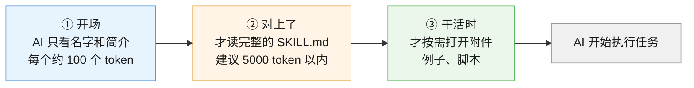
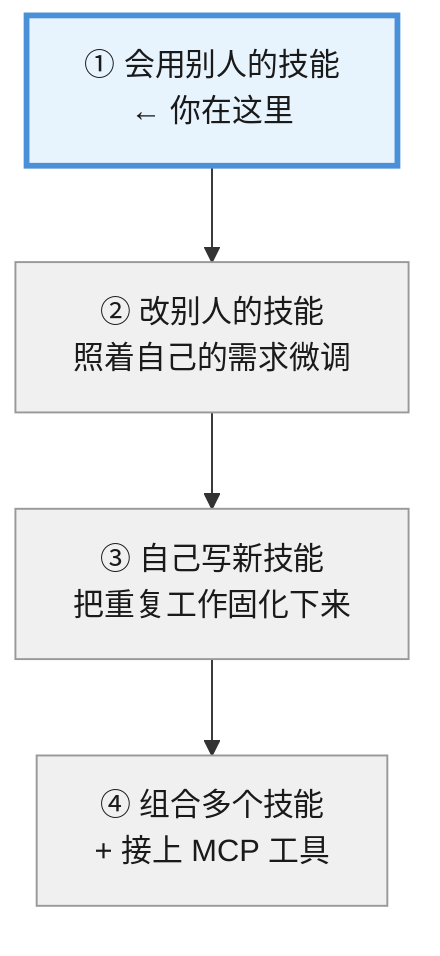

# AI Agent 的 Skill 基础使用速览

> **本速览讲什么**
>
> 1. Skill 是什么——一个文件夹，让 AI 记住"这件事该怎么做"
> 2. 为什么需要它——告别每次都重贴一大段要求
> 3. 怎么装——两条路：一键脚本（推荐新手）和 `npx skills` 命令
> 4. 怎么查看、更新、卸载
>
> **延伸方向**：① 自己动手写一个 SKILL.md；② 搞懂 Skill 与 MCP 的配合关系

**适合谁**：没写过代码、平时很少用 AI 的同学。全程只需要复制粘贴命令，不需要懂编程。

**实测环境**（本文所有命令都在下面这台机器上真跑过）：

| 项目 | 值 |
|------|-----|
| 系统 | Windows（PowerShell） |
| Node.js | v22.14.0 |
| npm / npx | 10.9.2 |
| skills CLI | 1.5.24 |
| 核查时间 | 2026-09 |

---

## 第一幕：你和 AI 之间，缺一本"说明书"

### 这个小东西，一年之内火遍了整个 AI 圈

Skill（技能）不是什么新发明的复杂技术。它的来历很朴素：

2025 年 10 月 16 日，做 Claude 的公司 Anthropic 发布了一个功能——**让 AI 把常用的工作方法存成一个文件夹，需要时自己翻出来看**。官方打的比方是"给新同事准备入职手册"：新人很聪明，但你还是得给他一本手册，告诉他这里的事情怎么做。（核查于 2026-09，来源 [Anthropic 官方公告](https://www.anthropic.com/news/skills)）

两个月后的 2025 年 12 月 18 日，Anthropic 把这个格式**开放成了行业标准**——就像当年 PDF 一样，谁都可以用。

开放后的速度很惊人：**48 小时内**，微软把它接进了 VS Code，OpenAI 也让它同时支持 ChatGPT 和 Codex 命令行工具。到 **2026 年 3 月**，已经有 **32 个**互相竞争的产品在读取同样格式的文件——包括 Claude Code、OpenAI Codex、Cursor、GitHub Copilot、谷歌 Gemini CLI、JetBrains Junie、AWS Kiro 等。（核查于 2026-09，来源 [AI Wiki](https://aiwiki.ai/wiki/agent_skills) 与 [Agent Skills 开放标准](https://agentskills.io/home)）

**这件事的意义**：你为一个 AI 写的说明书，换一个 AI 也能用。

### 先看一个你可能遇到过的场景

假设你是一个学生，正在用 AI 帮你改论文。每周你都要说一遍：

> "帮我看看这段，语气要学术一点，不要口语化，引用格式用 APA，字数控制在 800 字以内，不要改我的观点，只改表达……"

说完一次，AI 照做了。下次开新对话，你**又得从头说一遍**。

更烦的是：第七次说的时候你漏了一句"引用格式用 APA"，AI 就给你换成了别的格式。你还得再纠正一次。

**这就是我们要解决的问题。**

---

## 第二幕：为什么每次都要重说一遍？

你可能会想：**AI 这么聪明，就不能记住吗？**

答案是——它能记住，但记的方式不对。

AI 的"记忆"有个特点：**每次新对话，它都是从零开始的**。你在上一个对话里说的所有要求，它一个字都不记得。就像一个每天失忆的助理，每天早上你都得重新培训一遍。

那有人会说：我把要求写在备忘录里，每次复制粘贴不就行了？

行，但有三个坑：

1. **累**。要求越来越长，每次复制一大段。
2. **乱**。你存了 5 个版本，自己也分不清哪个是最新的。
3. **贵**。你贴的每一个字，AI 都要"读"一遍——读得越多，越慢、越费钱，而且贴太多它反而会顾此失彼，漏掉中间某条要求。

> 💡 **关键矛盾**：我们希望 AI 懂很多规矩，但又不能一次性把所有规矩都塞给它。

Skill 就是为了解决这个矛盾而生的。

---

## 第三幕：Skill 到底是什么？

### 感知层：它就是一个文件夹

先别想复杂了。一个 Skill，**本质上就是一个文件夹**，里面有一个必须叫 `SKILL.md` 的文件。

```
code-review/          ← 文件夹名就是技能名
├── SKILL.md          ← 必须有：写给 AI 看的操作说明
├── examples.md       ← 可选：举几个例子
└── scripts/          ← 可选：一些小程序
```

`SKILL.md` 长什么样？打开看就两部分：

```markdown
---
name: code-review
description: 审查代码变更。当用户说"review 这个提交""检查这段代码"时使用。
---

# 代码审查

## 你要做的事
1. 先看改动的整体目的是什么
2. 再逐条检查：有没有 bug、有没有安全问题
3. 最后给出结论，按严重程度分级
```

前面 `---` 包起来的部分叫**文件头**（YAML frontmatter），只有两个必填项：

| 字段 | 作用 | 规矩 |
|------|------|------|
| `name` | 技能的名字 | 只能用小写字母、数字、连字符，最长 64 个字符，**必须和文件夹名一样** |
| `description` | 什么时候用它 | 最长 1024 个字符，要写清"干什么"和"什么时候用" |

> 💡 **token 是什么？** 你可以粗略理解成 AI 读东西的"字数单位"——中文大概一个字一个 token。不用记精确定义，知道它是"计量 AI 一次能读多少"的尺子就行。

下面是正文，就是普通的中文说明——**你想让 AI 怎么做，就怎么写**。

### 概念层：给 AI 的"入职手册"

Anthropic 的说法是：做一个 Skill，就像给新同事准备入职手册。

这个类比很准，但要知道它的**边界**：

- 相同点：都是"把做事的方法写下来，让人照着做"，写一次可以多人用。
- **不同点**：新同事读完手册就真的会了；**AI 每次都是重新读一遍**，它不会因为读了 10 次就"记住"。手册的价值在于——**每次读到的都是同一份最新版手册**，所以每次表现都一致。

所以 Skill 解决的不是"AI 记不住"，而是**"你不用每次重说，而且每次说的都一样"**。

### 机制层：渐进式披露——AI 不是一次全读

这是 Skill 最巧的设计，叫**渐进式披露**（Progressive Disclosure，意思是"一点点展开，不全塞给你"）。

AI 分三步读一个技能：



**为什么要这么麻烦？** 举个数：如果你装了 55 个技能，全部读一遍要好几万字，AI 的"脑子"（上下文窗口）会被塞满，反而变笨。

而渐进式披露下，AI 开场只读 55 个"名字 + 一句话简介"，**真正读全文的只有当前用到的那一两个**。这就是为什么你可以放心装很多技能。

> 💡 **一句话记住**：Skill 像一本带目录的工具书——AI 先看目录，觉得哪章有用才翻到哪章，而不是每次从第一页读到最后一页。

### 实操层：两条路把技能装进来

明白了原理，怎么装？有两条路。

| 路线 | 难度 | 适合谁 |
|------|------|--------|
| **路线 A：一键脚本** | ⭐ 简单 | **新手走这条**。下载一个脚本，一条命令搞定 |
| **路线 B：`npx skills` 命令** | ⭐⭐⭐ 稍难 | 想精细控制、想装别人仓库里的技能 |

两条路**底层是同一套东西**——脚本其实就是帮你把 `npx skills` 命令打包好了，还额外做了"装一次、同步到多个目录"的活。

### 定位层：Skill、MCP、提示词，别搞混

新手最容易晕的就是这三个词。一张表说清：

| 是什么 | 回答什么问题 | 打个比方 |
|--------|-------------|---------|
| **提示词**（Prompt） | "这次帮我做什么" | 你**口头**跟助理说的一句话 |
| **Skill** | "这类事该怎么做" | 助理**抽屉里的操作手册** |
| **MCP** | "你能连接到哪些外部工具" | 助理**手里的工具**（能查数据库、能发邮件） |

**它们不冲突，是配套的**：MCP 给 AI 一双手，Skill 告诉它这双手该怎么用。

> ⚠️ **新手不用管 MCP**。刚开始学 Skill 就够了，MCP 是后面的事。

---

## 第四幕：亲手装一个（照抄就能跑）

回到第一幕的场景：你想让 AI 记住"改论文的规矩"。现在不自己写，先学会**装别人写好的技能**。

### 准备：确认电脑里有 Node.js

脚本底层依赖 `npx`，而 `npx` 是 Node.js 自带的。**需要 Node.js 22 或更高版本**。

打开 PowerShell，输入：

```powershell
node -v
```

看到 `v22.x.x` 或更高就可以继续。如果提示"不是内部或外部命令"，先去 [Node.js 官网](https://nodejs.org/) 下载 LTS 版本装上。

### 步骤 1：下载安装脚本

脚本有两个版本，Windows 用 `.ps1`，苹果电脑（Mac）和 Linux 用 `.sh`。

**Windows（PowerShell 里执行）**：

```powershell
Invoke-WebRequest -Uri "https://gitee.com/hack-wu/skills/raw/master/scripts/skill-install.ps1" -OutFile "skill-install.ps1"
```

**Mac / Linux（终端里执行）**：

```bash
curl -O https://gitee.com/hack-wu/skills/raw/master/scripts/skill-install.sh
```

> 💡 为什么用 gitee.com？这是国内的镜像站，GitHub 有时候连不上。脚本原作者在 [GitHub](https://github.com/HACK-WU/skills) 和 [Gitee](https://gitee.com/hack-wu/skills) 都放了一份，内容一样（实测两边 HEAD 提交号都是 `f09afe3`，核查于 2026-09）。

> ⚠️ **Mac / Linux 同学注意两件事**（Windows 同学可以跳过）：
> 1. **参数不一样**：`.sh` 版用**短选项** `-t` 和 `-n`，而 Windows 的 `.ps1` 版用 `-Target` 和 `-NameFilter`。照抄会报错，对照下面的表改。
> 2. **要加执行权限**：直接 `./skill-install.sh` 会提示"Permission denied"。要么前面加 `bash`，要么先跑一次 `chmod +x skill-install.sh`。

| 你想做的事 | Windows（`.ps1`） | Mac / Linux（`.sh`） |
|-----------|------------------|---------------------|
| 指定目标目录 | `-Target "D:\my-project"` | `-t ~/projects/my-app` |
| 只装某几个 | `-NameFilter code-review` | `-n code-review` |
| 查看 / 更新 / 卸载 | `list` / `update` / `remove 名字` | 完全一样 |

### 步骤 2：装技能

假设你想把技能装到 `D:\my-project` 这个文件夹（换成你自己的路径）。

**全部装上**（这个仓库有 55 个技能）：

```powershell
powershell -ExecutionPolicy Bypass -File .\skill-install.ps1 install -Target "D:\my-project"
```

**只装其中几个**（推荐新手这么干，比如只装 `code-review`）：

```powershell
powershell -ExecutionPolicy Bypass -File .\skill-install.ps1 install -NameFilter code-review -Target "D:\my-project"
```

> ⚠️ **`powershell -ExecutionPolicy Bypass` 是什么？** Windows 默认禁止运行下载的脚本，加这一段是"临时放行这一次"。**这是正常操作，不是绕过安全**——但前提是脚本来源可信（见下方"安全提醒"）。

你会看到类似这样的输出：

```
[INFO] 通过 npx skills 安装到管理源...
[INFO]   安装源: HACK-WU/skills
o  Installation complete
|  ✓ code-review (copied)
|    → ~\.hackwu-skills\skills\code-review
[INFO] 同步到目标目录...
  [SYNC] D:/my-project
[INFO] 已安装并同步到 1 个目标
✅ 完成
```

**装到哪里了？** 两个地方，别搞混：

| 位置 | 作用 |
|------|------|
| `C:\Users\你的用户名\.hackwu-skills\skills\` | **管理源**（总仓库）。所有技能先下到这里 |
| `D:\my-project\skills\` | **目标目录**（你指定的）。AI 实际读这里 |

脚本采用"装一次、多处同步"的设计：你以后再指定别的目标目录，直接从总仓库复制过去，不用重新下载。

### 步骤 3：看看装了什么

```powershell
powershell -ExecutionPolicy Bypass -File .\skill-install.ps1 list
```

输出会按来源仓库分组，最后告诉你总数（实测该仓库共 55 个技能）：

```
HACK-WU/skills:
  api-design
  code-review
  design-craft
  ...

  共 55 个 skill

[INFO] 已记录 N 个目标目录（remove 时自动同步）
```

最后那行的 `N` 是你**累计**指定过的目标目录数量（脚本会记住，卸载时同步清理所有目标）。第一次装通常是 `1`。

### 步骤 4：不用了就删掉

```powershell
powershell -ExecutionPolicy Bypass -File .\skill-install.ps1 remove code-review
```

> 🐞 **实测避坑**：删除时你**可能**会看到一行黄字警告：
> ```
> [WARN] npx 未删除 lock 条目（状态漂移），手动兜底清理: code-review
> ```
> **别慌，这不是失败**。这是脚本自己发现底层工具没删干净、主动接管善后的提示。只要最后出现 `✅ 完成`，并且 `list` 里已经查不到这个技能，就是删成功了。作者特意写了这段兜底逻辑，就是为了防止"删了但还在"的情况。

删除是**同步的**：总仓库和目标目录里的这个技能会一起消失，你不用手动去删两遍。

### 步骤 5：更新到最新版

技能作者会修 bug、改内容。想更新：

```powershell
powershell -ExecutionPolicy Bypass -File .\skill-install.ps1 update
```

### 路线 B：直接用 `npx skills` 命令

如果你不想用脚本，或者想装**别人仓库里的技能**，就用这个。

**先看看某个仓库里有什么**（只读，不安装，很安全）：

```powershell
npx -y skills@latest add anthropics/skills --list
```

**装其中一个**（比如 Anthropic 官方的 PDF 处理技能）：

```powershell
npx -y skills@latest add anthropics/skills --skill pdf -a claude-code -y
```

**看看装了啥 / 删掉**：

```powershell
npx -y skills@latest list
npx -y skills@latest remove pdf
```

常用参数速记：

| 参数 | 作用 |
|------|------|
| `--skill 名字` | 只装指定的技能（不写就装全部） |
| `-a 工具名` | 装给哪个 AI 工具（如 `claude-code`、`codex`） |
| `-g` | 装到全局（所有项目都能用），不写则只装当前文件夹 |
| `-y` | 一路默认，不问你 |

> ⚠️ **本机实测提醒**：我这台机器是 Node v22.14.0，跑的时候会看到一行 `npm warn EBADENGINE ... required: { node: '>=22.20.0' }`。这是**警告不是错误**，命令能正常跑完。遇到的话不用管，但条件允许还是把 Node 升到最新版更稳妥。

### 🔒 安全提醒（重要）

Skill 不是"纯文本"，它**可以带脚本，AI 会真的去运行它**。装陌生人写的技能，等于让一个陌生程序在你的电脑上跑。

三条原则：

1. **只装信得过来源的**（大公司官方仓库、知名开发者）。
2. **装之前扫一眼内容**——用 `--list` 看看有什么，或者下载后直接打开 `SKILL.md` 读一遍。它是普通文本文件，看得懂。
3. **发现 AI 行为异常，立刻删掉那个技能**（`remove`）。

### 别人写好的技能去哪找？

这些是社区里比较有名的仓库（均已实测可访问，核查于 2026-09）：

| 仓库 | 是什么 |
|------|--------|
| [anthropics/skills](https://github.com/anthropics/skills) | Anthropic 官方示例集，**入门先看这个**，附带 Skill 规范说明 |
| [mattpocock/skills](https://github.com/mattpocock/skills) | 面向真实工程的技能集，涵盖 TDD（先写测试再写代码）、调试、架构改进、需求对齐 |
| [obra/superpowers](https://github.com/obra/superpowers) | Claude Code 增强技能集，把"先规划再动手"变成强制流程 |
| [Leonxlnx/taste-skill](https://github.com/Leonxlnx/taste-skill) | 专为 AI 设计的前端框架技能集合，提升 AI 生成界面的设计质量 |
| [QoderAI/better-harness](https://github.com/QoderAI/better-harness) | 审查与改进 AI 编码工作流的工具 |
| [K-Dense-AI/scientific-agent-skills](https://github.com/K-Dense-AI/scientific-agent-skills) | 面向科研的即用型技能库（163+ 个），覆盖生物信息、化学、蛋白质组、神经科学、数据分析可视化等 |
| [zhaoxuya520/reverse-skill](https://github.com/zhaoxuya520/reverse-skill) | 网络安全技能路由包，覆盖 APK/二进制/前端 JS/CTF 等约 25 种逆向与安全场景，**内置授权范围确认机制，仅用于授权渗透测试与安全研究** |

> ⚠️ 最后一个仓库涉及网络安全，**只可用于自己拥有、或已明确获得书面授权的系统**。未经授权对他人系统做渗透测试是违法行为。

### 回扣场景：现在那个"改论文"的问题解决了吗？

解决了。流程变成：

1. **写一次**：把"改论文的规矩"写成一个 `SKILL.md`，放进你的项目文件夹。
2. **以后只说一句**："帮我改这段论文"——AI 读到这个技能，自动按规矩办。
3. **想改规矩**：改 `SKILL.md` 那一个文件，以后每次都生效。不用再到处复制。

这就是第一幕那个"每周重说一遍"的答案。

---

## 第五幕：现在你会了什么

**你已经掌握的**：

- Skill 是一个文件夹 + `SKILL.md`，是给 AI 的"入职手册"
- 渐进式披露：AI 先看目录、用到了才翻正文，所以装很多也不卡
- 用一键脚本（新手）或 `npx skills`（进阶）安装、查看、更新、卸载
- Skill 和 MCP 不冲突：MCP 给 AI 手，Skill 教它怎么用手

**你现在在整张地图的位置**：



**下一步**：把一件你每周都要跟 AI 重复说的事，写成第一个 `SKILL.md`。

> 💡 写技能这件事本身不用你亲自动手——装了技能之后，直接跟 AI 说"帮我把这件事写成一个 skill"，它会帮你生成。你要做的只是**检查它写得对不对**。

---

## 🐞 常见误区

**误区 1：装了技能，AI 就会自动用**
不一定。AI 靠 `description` 判断"这个技能跟当前任务有关吗"。如果你的描述写得含糊（比如只写"处理文档"），AI 可能想不起来用它。**描述要写清"什么场景下用"**。另外，很多工具里你也可以直接输入技能名主动调用。

**误区 2：技能装得越多越好**
不是。虽然渐进式披露让"多装"的成本很低，但开场那 55 条"名字 + 简介"仍然要占 AI 的注意力。装 5 个常用的，比装 55 个吃灰的强。

**误区 3：`SKILL.md` 写得越长越好**
官方建议正文控制在 500 行以内，详细资料拆到单独文件里。写太长，AI 反而抓不住重点。

**误区 4：`name` 字段随便取**
不行。`name` 必须和文件夹名**完全一致**，且只能用小写字母、数字、连字符。不一致的话，AI 可能找不到这个技能。

**误区 5：删掉技能文件就算卸载了**
如果你用脚本装的，直接手动删文件夹会导致"总仓库和记录对不上"（状态漂移）。**用 `remove` 命令删**，它会同步清理总仓库和目标目录。

---

## 一图总结

```
┌─────────────────────────────────────────────────────────────┐
│                    Skill 是什么？                            │
│         一个文件夹 + SKILL.md = 给 AI 的入职手册              │
└─────────────────────────────────────────────────────────────┘
                              │
        ┌─────────────────────┼─────────────────────┐
        ▼                     ▼                     ▼
   【渐进式披露】         【怎么装】            【注意什么】
                         
   ① 只看名字+简介        路线A: 一键脚本       只装可信来源
   ② 用到了读全文              ↓              装前扫一眼内容
   ③ 干活时开附件         install/list/remove   异常立刻 remove
                        路线B: npx skills
                         
   效果: 装 55 个也不卡     目标目录/skills/      它可以执行脚本
```

---

## 📚 官方文档

- [Agent Skills 开放标准规范](https://agentskills.io/home) —— 格式的最权威定义
- [Anthropic 官方公告：Introducing Agent Skills](https://www.anthropic.com/news/skills) —— 概念的由来
- [Anthropic 工程博客：Equipping agents for the real world](https://www.anthropic.com/engineering/equipping-agents-for-the-real-world-with-agent-skills) —— 设计思路详解
- [skills CLI 文档](https://www.skills.sh/docs/cli) —— 命令行参数速查
- [skills.sh](https://www.skills.sh/) —— 技能目录，可以按关键词搜别人写好的技能
- [Node.js 官网](https://nodejs.org/) —— 装技能前需要先有它（22 以上版本）

---

## 🚀 想深入？复制发给 AI

**升级为系统课程**（从"会用"到"会写"，含实战项目与排障手册）：

```
我刚看了 agent-skills-basics/overview.md 关于 AI Agent Skill 的速览，
想进一步学习，请按我的情况（无开发经验的学生 / 目标：把自己的重复工作固化成 skill）
把"如何编写一个高质量的 SKILL.md"展开成一个课程。
```

**直接要实战 / 避坑**：

```
我刚看了 agent-skills-basics/overview.md 关于 AI Agent Skill 的速览，
请给我一个练手项目（比如把"论文润色"流程写成一个完整 skill），
或讲讲 skill 安装使用的实战经验、排障速查手册与场景解法库。
```

---

## 📋 命令速查卡

| 想做什么 | 命令 |
|---------|------|
| 检查 Node 版本 | `node -v`（需 ≥ 22） |
| 下载脚本（Windows） | `Invoke-WebRequest -Uri "https://gitee.com/hack-wu/skills/raw/master/scripts/skill-install.ps1" -OutFile "skill-install.ps1"` |
| 装全部技能 | `powershell -ExecutionPolicy Bypass -File .\skill-install.ps1 install -Target "D:\my-project"` |
| 只装某几个 | `powershell -ExecutionPolicy Bypass -File .\skill-install.ps1 install -NameFilter code-review -Target "D:\my-project"` |
| 查看已装 | `powershell -ExecutionPolicy Bypass -File .\skill-install.ps1 list` |
| 更新 | `powershell -ExecutionPolicy Bypass -File .\skill-install.ps1 update` |
| 卸载 | `powershell -ExecutionPolicy Bypass -File .\skill-install.ps1 remove code-review` |
| 看别人仓库有啥 | `npx -y skills@latest add anthropics/skills --list` |
| 用 npx 装一个 | `npx -y skills@latest add anthropics/skills --skill pdf -a claude-code -y` |
| npx 查看 / 卸载 | `npx -y skills@latest list` / `npx -y skills@latest remove pdf` |
| 下载脚本（Mac/Linux） | `curl -O https://gitee.com/hack-wu/skills/raw/master/scripts/skill-install.sh` |
| Mac/Linux 装全部 | `bash skill-install.sh -t ~/projects/my-app` |
| Mac/Linux 只装某几个 | `bash skill-install.sh install -n code-review -t ~/projects/my-app` |

> ⚠️ Mac / Linux 同学注意：命令里的 `skill-install.sh` 要**先下载到你当前所在的文件夹**再执行，参数用短选项 `-t` / `-n`。脚本下载后默认没有执行权限，所以前面加 `bash`（或先跑一次 `chmod +x skill-install.sh`）。

---

**📅 本文命令与链接核查于 2026-09，实测环境 Windows + Node v22.14.0 + skills CLI 1.5.24。**
