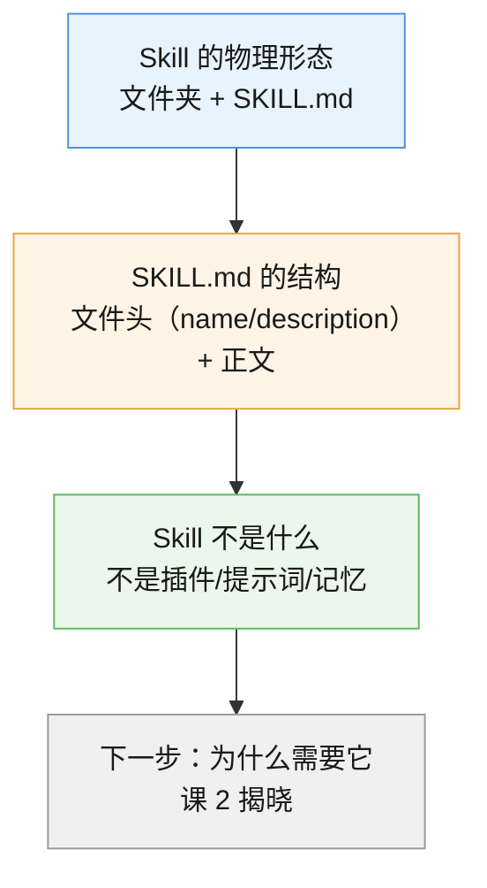
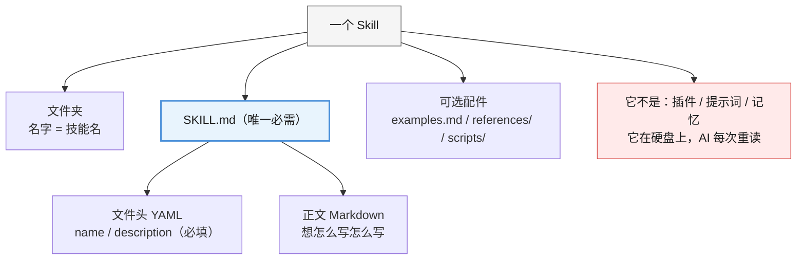

# 第 1 课：Skill 到底是什么

> 所属阶段：阶段 1《理解 Skill》｜ 水平：零基础 ｜ 本课知识点：Skill 的物理形态、SKILL.md 的结构、Skill 不是什么
> 故事情节：主角第一次打开一个技能的"外壳"，发现它朴素得让人意外——原来不是什么高深技术，就是一个文件夹。

## 🎯 本课目标

- 指着一个文件夹说清：哪部分是 Skill、哪部分是普通文件
- 说出 `SKILL.md` 里哪两个字段是必填的、各有什么规矩
- 分清 Skill 不是什么（不是插件、不是提示词模板、不是记忆）

---

## 第一幕：起源与场景引入

### 这个小东西，一年之内火遍了整个 AI 圈

Skill（技能）不是什么新发明的复杂技术。它的来历很朴素：

2025 年 10 月 16 日，做 Claude 的公司 Anthropic 发布了一个功能——**让 AI 把常用的工作方法存成一个文件夹，需要时自己翻出来看**。官方打的比方是"给新同事准备入职手册"：新人很聪明，但你还是得给他一本手册，告诉他这里的事情怎么做。

两个月后的 2025 年 12 月 18 日，Anthropic 把这个格式**开放成了行业标准**——就像当年 PDF 一样，谁都可以用。开放后速度很惊人：**48 小时内**，微软把它接进了 VS Code，OpenAI 也让它同时支持 ChatGPT 和 Codex 命令行工具。到 **2026 年 3 月**，已经有 **32 个**互相竞争的产品在读取同样格式的文件。（核查于 2026-09，来源 [Anthropic 官方公告](https://www.anthropic.com/news/skills) 与 [Agent Skills 开放标准](https://agentskills.io/home)）

**这件事对你的意义**：你为一个 AI 写的说明书，换一个 AI 也能用。

### 你可能遇到过的场景

假设你是一个学生，正在用 AI 帮你改论文。每周你都要说一遍：

> "帮我看看这段，语气要学术一点，不要口语化，引用格式用 APA，字数控制在 800 字以内，不要改我的观点，只改表达……"

说完一次，AI 照做了。下次开新对话，你**又得从头说一遍**。

更烦的是：第七次说的时候你漏了一句"引用格式用 APA"，AI 就给你换成了别的格式。

> 🎬 **场景**：一个学生每周要跟 AI 重说一遍改论文的要求，说漏一句，结果就变了。

---

## 第二幕：认知冲突

你想过没有：**如果我把这些要求存成一个文件呢？**

听起来很自然——存成 Word、存成备忘录、存成 txt，下次直接让 AI 读。但真这么做，你会撞上三个问题：

1. **AI 怎么知道该读哪个文件？** 你存了 5 个文件，AI 凭什么知道"改论文"该读这一个？
2. **文件该写成什么样？** 你写一大段自然语言的"要求"，和你写给同学看的操作步骤，AI 读起来效果一样吗？
3. **凭什么换个 AI 还能用？** 你为 A 工具写的说明，换到 B 工具上就得重写一遍吗？

这三个问题，正是"Skill"这个格式要回答的。它不是"随便存个文件"，而是**一套约定**：

- 文件必须叫什么名字 → 回答"AI 怎么找到它"
- 文件开头必须写哪两行 → 回答"AI 怎么判断该不该用"
- 这套约定是公开的、谁都能实现的 → 回答"换个 AI 还能不能用"

> ❓ **问题**：如果 Skill 只是"一个文件夹"，那它跟我自己写个 txt 存要求有什么本质区别？凭什么它能被 32 个产品同时认识？

---

## 第三幕：层层揭示

### 知识点 1：Skill 的物理形态（文件夹 + SKILL.md）

> 本知识点关键点：文件夹即技能、`SKILL.md` 必须存在、其他文件都是可选的

#### 一句话定义

一个 Skill 就是一个文件夹，里面必须有一个叫 `SKILL.md` 的文件——**文件夹是身体，`SKILL.md` 是心脏**。

#### 直觉建立（类比）

想象你去宜家买了一个书柜，箱子里有一张安装说明书。

- **箱子**（文件夹）= 这个技能的全部家当
- **说明书**（`SKILL.md`）= 核心，告诉组装的人每一步怎么做
- **螺丝刀、备用螺丝**（`scripts/`、`examples.md` 等）= 可选配件，说明书里会告诉你什么时候用它们

**关键点是**：没有说明书的那箱零件，就只是"一堆木板和螺丝"，不是"一个书柜"。同理，**没有 `SKILL.md` 的文件夹，就只是个普通文件夹，不是技能**。

#### 核心原理

官方规范的原话是：一个技能是一个**至少包含 `SKILL.md` 文件的目录**（a skill is a directory containing, at minimum, a `SKILL.md` file）。（核查于 2026-09，来源 [Agent Skills 规范](https://agentskills.io/specification)）

```
essay-polish/            ← 文件夹名，就是技能名
├── SKILL.md             ← 必须有：写给 AI 看的操作说明
├── examples.md          ← 可选：举几个例子
├── references/          ← 可选：详细资料，用到时才读
└── scripts/             ← 可选：小程序，AI 可以运行
```

这里有个**反直觉但重要**的点：`SKILL.md` 是**唯一必需**的文件。也就是说，下面这个"只有一个文件"的样子，也是一个**完全合格的技能**：

```
essay-polish/
└── SKILL.md             ← 就这一个文件，够了
```

**这在你电脑上真实存在**。我扫了一下本机的 55 个已装技能，其中 **32 个是单文件技能**（一个文件夹、一个 `SKILL.md`，没别的），占了一半以上——`api-design`、`artifact-optimizer`、`auto-review` 都是这类。

而 `api-testing`、`challenger`、`code-review` 这类是多文件技能，比如 `api-testing` 长这样：

```
api-testing/
├── SKILL.md
├── examples.md
└── reference.md
```

> 💡 **类比的边界**：书柜说明书的类比有个地方不成立——**AI 不会因为读了很多次就"背下来"**。说明书给人类读，人读完就真的会了；`SKILL.md` 给 AI 读，AI 每次都是重新读一遍。所以技能的价值不是"让 AI 学会"，而是"**每次读到的都是同一份最新版**"——这点在课 2 会详细展开。

#### 示例演示

打开你电脑上的技能管理目录（如果你跟着速览篇装过技能，就在 `C:\Users\你的用户名\.hackwu-skills\skills\`），看一眼就明白了：

```powershell
# 看一个技能里有什么（技术域：可运行）
# $env:USERPROFILE 会自动指向你的用户目录，不用手改用户名
Get-ChildItem -Recurse "$env:USERPROFILE\.hackwu-skills\skills\api-testing" |
  ForEach-Object { $_.FullName.Replace("$env:USERPROFILE\.hackwu-skills\skills\","") }

# 预期输出（本机实测）：
# api-testing\examples.md
# api-testing\reference.md
# api-testing\SKILL.md
```

> ⚠️ **别手打 `C:\Users\你的用户名\...`**——`你的用户名` 是占位符，照抄会报"路径不存在"。用 `$env:USERPROFILE` 让电脑自己填。

最后一行出现了 `SKILL.md`。如果换成某个普通文件夹，就不会有它。

#### 常见误区

1. **"技能是个软件/插件，要安装到 AI 程序里"**：不是。技能就是你放在硬盘上的**普通文件夹和普通文本文件**，AI 只是去"读"它，不需要把它装进自己的程序。这也是为什么你可以直接用记事本打开 `SKILL.md` 看内容。
2. **"文件越多，技能越高级"**：不是。单文件技能完全合格。很多技能一辈子只有一个 `SKILL.md`。

#### 一句话记住

Skill = 一个文件夹 + 一个必须叫 `SKILL.md` 的文件，其他都是可选配件。

#### 官方文档

- [Agent Skills 规范 - 目录结构](https://agentskills.io/specification)：定义了"至少包含 SKILL.md"这条硬规则

---

### 知识点 2：SKILL.md 的结构（文件头 + 正文）

> 本知识点关键点：文件头（YAML frontmatter）的两个必填字段、`name` 的命名规矩、`description` 决定能否被触发、正文随便写

#### 一句话定义

`SKILL.md` 分上下两截：上面是**文件头**（给机器看的标签），下面是**正文**（给 AI 看的操作说明）。

#### 直觉建立（类比）

想象一份简历：

- **顶部的基本信息栏**（姓名、求职意向）= 文件头。格式是固定的，HR 一眼扫过去就能判断"这份简历该不该往下看"。
- **下面的工作经历正文** = 正文。你想怎么写就怎么写，但写得清不清楚，决定了对方能不能照着做。

`SKILL.md` 完全一样：文件头的 `name` 和 `description` 就是"姓名 + 求职意向"，AI 靠它**判断这个技能跟当前任务有没有关系**；正文就是"你到底要 AI 怎么做"。

#### 核心原理

打开一个真实的技能看看。下面是本机 `api-design` 技能的 `SKILL.md` 开头（实测读取）：

```markdown
---
name: api-design
description: 基于需求文档和设计文档，生成包含接口契约、关键代码设计、错误码定义的 API 设计文档。适用于"设计 API"、"接口设计"、"api design"等场景，或 design-craft 完成后需补充 API 设计细节时。
---

# API Design（API 接口设计）
...正文从这里开始
```

上下两截的分界线，就是那对 `---`：

| 部分 | 位置 | 写给谁看 | 格式 |
|------|------|---------|------|
| **文件头**（YAML frontmatter） | 文件最开头，用 `---` 包起来 | 机器（AI 用来判断要不要用） | **严格**，字段名固定 |
| **正文** | `---` 之后的所有内容 | AI（用来干活） | **自由**，想怎么写怎么写 |

**文件头里只有两个字段是必填的**：

| 字段 | 作用 | 硬规矩（核查于 2026-09，来源 [Agent Skills 规范](https://agentskills.io/specification)） |
|------|------|------|
| `name` | 技能的名字 | 最长 64 字符；只能用**小写字母、数字、连字符**；**不能以连字符开头或结尾**；**不能有连续连字符**（`--`）；**必须和文件夹名完全一致** |
| `description` | 干什么 + 什么时候用 | 最长 1024 字符；不能为空；最好写清"做什么"和"什么场景下用"，并带上能帮助 AI 识别任务的关键词 |

**为什么 `description` 特别重要？** 因为 AI 判断"这个技能要不要用"，靠的就是读它。写"帮用户处理 PDF"这种含糊描述，AI 很可能想不起来用；写成"从 PDF 提取文字和表格、填写表单、合并文件。当用户提到 PDF、表单、文档提取时使用"，它就清楚地知道何时该激活。

规范里还给了三个可选字段，你现在知道就行，不用急着用：`license`（许可证）、`compatibility`（环境要求，最长 500 字符）、`metadata`（作者、版本等自定义信息）。

#### 示例演示

一个合格的"改论文"技能，`SKILL.md` 完整内容可以是这样（这是本课第四幕要动手创建的版本）：

```markdown
---
name: essay-polish
description: 润色学术论文段落。当用户要求改论文、润色学术文字、调整语气为学术风格时使用。
---

# 论文润色

## 你要做的事
1. 只改表达，不改观点
2. 语气改为学术风格，去掉口语化表达
3. 引用格式统一为 APA
```

数一数：文件头 4 行（两行 `---` + `name` + `description`），正文 7 行。**总共 11 行，这就是一个能用的技能**。

对比一下不合格的写法：

```markdown
---
name: 论文润色              ← ❌ 中文、有空格，不合规
description: 帮我改论文      ← ⚠️ 太含糊，AI 不知道什么时候用
---
```

#### 常见误区

1. **"`name` 写成中文更清楚"**：不行。`name` 只能用小写字母、数字和连字符，**中文、大写字母、空格、下划线都不合规**。想表达中文意思，写在正文标题里。
2. **"文件名写成 `README.md` 或 `说明.md` 也行"**：不行。**必须叫 `SKILL.md`**，拼写和大小写都不能变。这是规范里唯一强制的文件名。
3. **"`description` 随便写一句就行"**：这是新手最常踩、也最致命的坑。`description` 写不好，技能就**永远不会被触发**——你写了等于白写。课 5、课 6 会专门讲怎么写。

#### 一句话记住

文件头是给机器看的门牌号（`name` 是门牌、`description` 是营业范围），正文是给 AI 看的操作手册。

#### 官方文档

- [Agent Skills 规范 - SKILL.md 格式](https://agentskills.io/specification)：`name` / `description` 的完整约束与正反例

---

### 知识点 3：Skill 不是什么

> 本知识点关键点：不是插件、不是提示词模板、不是记忆

#### 一句话定义

Skill 是**放在硬盘上的一份标准化说明书**，AI 需要时去读它；它不是装进 AI 身体的零件，也不是 AI 脑子里的记忆。

#### 直觉建立（类比）

想象你带一个实习生：

- **插件** = 给他**装个新器官**（比如给他一双能看红外线的眼睛）。装了就长在身上，能力是永久的。
- **提示词** = 你**当面口头交代**一句"把这个表格整理一下"。说完就完，下次得再说。
- **Skill** = 你**递给他一本操作手册**，说"以后遇到这类事就照这个办"。手册在他手边，但他每次都要翻开看。
- **记忆** = 他**自己记住了**你的习惯。不用你给手册，他下次直接照做。

Skill 是那本**手册**——在手上，不在脑子里。

#### 核心原理

一张表把四者分清：

| 是什么 | 回答什么问题 | 存在哪里 | 用的时候 |
|--------|-------------|---------|---------|
| **插件 / MCP** | "你能连接到哪些外部工具" | 装进 AI 的运行环境 | 长在身上，随时可用 |
| **提示词**（Prompt） | "这次帮我做什么" | 你当场说的那句话 | 说完就走，下次重说 |
| **Skill** | "这类事该怎么做" | 硬盘上的文件夹 | **AI 每次重新读一遍** |
| **记忆**（Memory） | "你记得我什么习惯" | AI 的存储里 | 自动生效，不用你给 |

最容易搞混的是 **Skill 和记忆**，因为两者都涉及"上次说过的东西"。区别很关键：

- **记忆**是 AI **自己积累**的——它从对话里提炼出你的偏好，下次自动应用。你不用管。
- **Skill** 是**你主动写**的——你明确告诉它"这类事按这个流程办"。你不写就没有。

而且 Skill 有个记忆没有的巨大优势：**它是个文件，可以复制给别人、可以用 git 管理、可以改一个字就让所有 AI 工具同步生效**。记忆只属于那一个 AI。

> ⚠️ **新手不用管 MCP**。刚开始学 Skill 就够了，MCP 是后面的事。你只要记住一句话：**MCP 给 AI 一双手，Skill 告诉它这双手该怎么用**——它们不冲突，是配套的。

#### 示例演示

同一件事，三种做法的对比：

```
场景：你想让 AI 按 APA 格式润色论文

① 用提示词（每次重说）
   你：帮我润色这段，语气学术一点，引用用 APA，不要改观点……
   你：……下周新对话，再说一遍

② 用记忆（AI 自己记）
   你：我以后所有论文都用 APA（说一次）
   AI：好的，我记住了
   ⚠️ 但换个 AI 工具，它不记得；换个对话，可能也不记得

③ 用 Skill（你写一次）
   你：[创建 essay-polish/SKILL.md]
   你：帮我润色这段        ← 以后每次只说这一句
   AI：读到技能，自动按规矩办
   ✅ 换个 AI 工具照样能用，因为格式是公开标准
```

#### 常见误区

1. **"装了技能，AI 就学会这个本事了"**：没有。AI 只是**多了一本可以随时翻的手册**，它本身没有任何变化。删掉技能文件夹，AI 立刻回到原来的样子。
2. **"Skill 和提示词差不多，就是把提示词存起来"**：差很多。提示词要你**手动贴**；技能是 AI **自己判断该不该用、自己去读**。而且技能有标准格式，能跨 32 个产品通用——你存的一段提示词换工具就得重写。

#### 一句话记住

Skill 不在 AI 身体里（不是插件）、不在 AI 脑子里（不是记忆），而在硬盘上——它是一本 AI 每次都要重新翻的标准化操作手册。

---

## 第四幕：实操验证

现在亲手做出那个"改论文"的技能。你会在自己电脑上创建出一个**真实可用**的技能文件夹。

> 💡 **为什么现在就动手？** 因为 Skill 这个概念，看懂和做出来是两回事。做完这 3 步，你再回头看前三幕，会踏实很多。

### 步骤 1：建文件夹

打开 PowerShell，复制粘贴（**整段一起复制**）：

```powershell
New-Item -ItemType Directory -Force -Path "D:\skill-practice\essay-polish"
```

**预期输出**（本机实测）：

```

    目录: D:\skill-practice


Mode                 LastWriteTime         Length Name
----                 -------------         ------ ----
d-----          2026/9/8     12:54                essay-polish

```

> 💡 你看到的**时间戳和盘符会跟我不一样**——这很正常，只要最后一行是 `essay-polish` 就成功了。如果 `D:` 盘不存在（比如你只有 C 盘），把路径改成 `C:\skill-practice\essay-polish`。

> 💡 路径 `D:\skill-practice` 是**练习用的地方**，你可以改成任意位置。文件夹名 `essay-polish` 就是技能名，注意**全小写 + 连字符**。

### 步骤 2：写 SKILL.md

继续粘贴（**整段一起复制，从 `@'` 到 `'@`**）：

```powershell
Set-Content -Path "D:\skill-practice\essay-polish\SKILL.md" -Encoding UTF8 -Value @'
---
name: essay-polish
description: 润色学术论文段落。当用户要求改论文、润色学术文字、调整语气为学术风格时使用。
---

# 论文润色

## 你要做的事
1. 只改表达，不改观点
2. 语气改为学术风格，去掉口语化表达
3. 引用格式统一为 APA
'@
```

没有输出就是成功了（PowerShell 的惯例：不报错即成功）。

### 步骤 3：验证它是不是一个合格技能

```powershell
Get-ChildItem -Recurse "D:\skill-practice" | ForEach-Object { $_.FullName.Replace("D:\skill-practice\","") }
```

**预期输出**：

```
essay-polish
essay-polish\SKILL.md
```

**看到 `SKILL.md` 出现了吗？出现了，恭喜——你刚刚做出了一个真实、合规的技能。**

再确认文件头没写错：

```powershell
Get-Content "D:\skill-practice\essay-polish\SKILL.md" -TotalCount 4 -Encoding UTF8
```

**预期输出**：

```
---
name: essay-polish
description: 润色学术论文段落。当用户要求改论文、润色学术文字、调整语气为学术风格时使用。
---
```

### 步骤 4：做一个"体检"

`name` 和文件夹名一致吗？跑这段自查（**接在步骤 2 之后跑**，如果还没写 `SKILL.md` 就跑，会报"路径不存在"）：

```powershell
$f = "D:\skill-practice\essay-polish\SKILL.md"
$n = (Get-Content $f -TotalCount 5 -Encoding UTF8 | Select-String -Pattern '^name:\s*(.+)$' | Select-Object -First 1).Matches.Groups[1].Value.Trim()
$d = (Get-Item (Split-Path $f)).Name
Write-Output "name字段: $n"
Write-Output "文件夹名: $d"
if ($n -eq $d) { Write-Output "✅ 一致，AI 能找到它" } else { Write-Output "❌ 不一致，AI 可能找不到" }
```

**预期输出**：

```
name字段: essay-polish
文件夹名: essay-polish
✅ 一致，AI 能找到它
```

> ✅ **回扣场景**：回到第一幕——那个每周重说一遍的学生。现在这个文件夹里，就躺着**写一次的规矩**：只改表达、语气学术、引用 APA。以后他只要说"帮我润色这段"，AI 就会读到这个技能，自动按规矩办。**他不用再重说第七遍了。**
>
> ⚠️ 严格说，要让 AI 真的读到它，还得把文件夹放到 AI 会去找的位置（比如项目的 `.claude/skills/` 目录）。**这一步在课 3 讲安装时做**——本课先把"技能长什么样"这件事搞扎实。

> 🧹 **练完可以删掉**：`Remove-Item -Recurse "D:\skill-practice"`。这只是练习目录，删了不影响任何东西。想留着也行，课 3 会用到。

---

## 第五幕：体系收束

### 现在你会了什么



三个知识点串起来就是一句话：**Skill 是一个装着标准化说明书（`SKILL.md`）的文件夹，这份说明书放在硬盘上等 AI 来读，而不是长在 AI 身上。**

> 📍 **全局定位**：你在"会用 Skill"这条路上刚走完第一步——**认得它了**。整门课的路径是：认得（阶段 1）→ 会用（阶段 2）→ 会写（阶段 3）。本课是阶段 1 的地基。

> 🔗 **下一步**：课 2《为什么需要 Skill》。你已经知道它"长什么样"了，但可能还有个疑问——**"存成文件"和"我自己写个 txt"到底差在哪？为什么非得是这套格式？** 课 2 会讲透两件事：AI 为什么会"失忆"，以及 Skill 最巧的设计"渐进式披露"（AI 不是一次全读）。那才是这套格式真正聪明的地方。

---

## 🐞 常见误区

1. **"技能是个软件，得安装到 AI 里"**：不是。技能是硬盘上的普通文件夹和文本文件，AI 只是去读它。你可以用记事本打开 `SKILL.md` 看内容。
2. **"`SKILL.md` 里两个必填字段记住了就行，`description` 随便写"**：`description` 是新手最常踩的致命坑——它决定 AI 会不会用这个技能。写含糊了，技能永远不触发，写了等于白写。
3. **"`name` 写成中文更清楚"**：不行。只能是小写字母、数字、连字符，且必须和文件夹名完全一致。
4. **"文件越多技能越高级，我得多放点东西"**：不是。单文件技能完全合格。本机 55 个技能里，**32 个**都只有一个 `SKILL.md`。
5. **"装了技能 AI 就学会了"**：没有。AI 每次都是重新读一遍，删掉文件夹它就恢复原样。技能的价值是"每次读到的都是同一份最新版"。

## 一图总结



## 课后小测

**Q1**：判断一个文件夹是不是 Skill，最关键的依据是？

- A. 文件夹里有说明文档
- B. 文件夹里有且必须有 `SKILL.md`
- C. 文件夹里有很多文件
- D. 文件夹名字是英文的

<details><summary>答案与解析</summary>

**答案：B**。规范原文是"一个技能是一个**至少包含 `SKILL.md`** 的目录"。有 `README.md` 或任何别的说明文档都不算——文件名必须是 `SKILL.md`，拼写和大小写都不能变。这是唯一强制的文件名。

</details>

**Q2**：下面哪个 `name` 是合规的？（文件夹名为 `essay-polish`）

- A. `name: 论文润色`
- B. `name: Essay-Polish`
- C. `name: essay-polish`
- D. `name: essay_polish`

<details><summary>答案与解析</summary>

**答案：C**。`name` 只能用小写字母、数字、连字符，且必须与文件夹名完全一致。A 是中文（不合规），B 有大写字母（不合规），D 用了下划线（不合规）。

</details>

**Q3**：关于 `description`，下列说法正确的是？

- A. 随便写一句就行，反正 AI 会读全文
- B. 它决定 AI 判断"这个技能跟当前任务有关吗"，要写清"做什么"和"什么时候用"
- C. 它是可填可不填的
- D. 写得越短越好，方便 AI 快速读完

<details><summary>答案与解析</summary>

**答案：B**。`description` 是**必填**字段，且是 AI 判断要不要激活这个技能的第一依据。写成"帮我改论文"这种含糊描述，AI 很可能想不起来用它。C 错（是必填）；D 错（不是越短越好，是要写清场景和关键词，最长 1024 字符）。

</details>

**Q4**：Skill 和"记忆（Memory）"最大的区别是？

- A. 记忆更持久
- B. Skill 是你主动写在硬盘上的文件，可以复制给别人、可以 git 管理；记忆是 AI 自己积累的、只属于那一个 AI
- C. 两者其实是一回事
- D. Skill 只能存文字，记忆能存图片

<details><summary>答案与解析</summary>

**答案：B**。Skill 是**你主动写**的文件，是标准化的、可复制、可版本管理、能跨 32 个产品通用；记忆是 AI **自己从对话里提炼**的偏好，换个 AI 工具就没了。而且两者都涉及"上次说过的东西"，所以最容易混。

</details>

**Q5**：一个"只有 `SKILL.md` 一个文件"的文件夹，算不算一个合格的 Skill？

- A. 不算，太简陋了
- B. 算，`SKILL.md` 是唯一必需的文件
- C. 不算，至少得有 `examples.md`
- D. 不算，除非它的内容超过 500 行

<details><summary>答案与解析</summary>

**答案：B**。`SKILL.md` 是规范里**唯一必需**的文件，其他目录（`scripts/`、`references/`、`assets/`）全是可选的。本机 55 个已装技能里，**32 个**都是单文件技能。A 和 C 的"必须多放点东西"是典型误解；D 也错——**内容长短只影响好不好用，不影响是不是合格技能**，合格与否只看有没有 `SKILL.md` 和文件头两个必填字段。

</details>

## 🚀 下一批接力提示词

> 学完本课后，**复制下面这段文字发给 AI**，即可无缝进入下一课（无需重新描述上下文）：

```
继续学 AI Agent Skill。我的学习档案在 agent-skills-basics/00-学习档案.md，
刚学完阶段 1《理解 Skill》的课 1《Skill 到底是什么》（知识点：Skill 的物理形态、SKILL.md 的结构、Skill 不是什么），
请按大纲继续讲解课 2《为什么需要 Skill》。
```

## 🧭 课程导航

⬅️ **上一课**：无（本课为第一课，速览篇见 [overview.md](../../../overview.md)）

➡️ **下一课**：[课 2：为什么需要 Skill](lesson-02-为什么需要Skill.md)

📚 **返回目录**：[课程目录](../../../02-课程目录.md)
