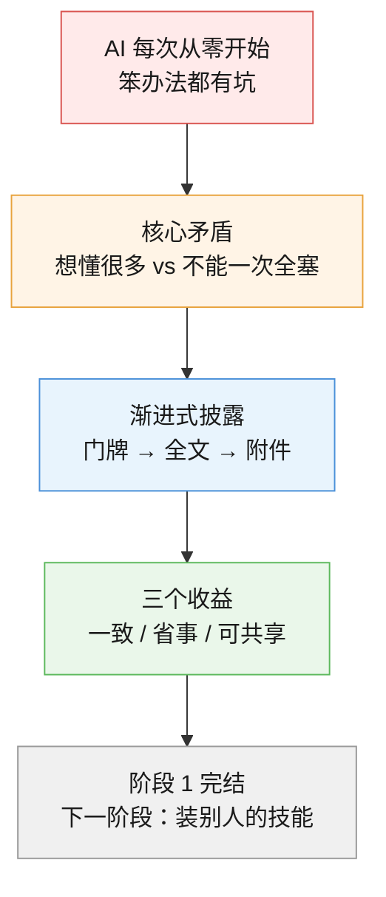
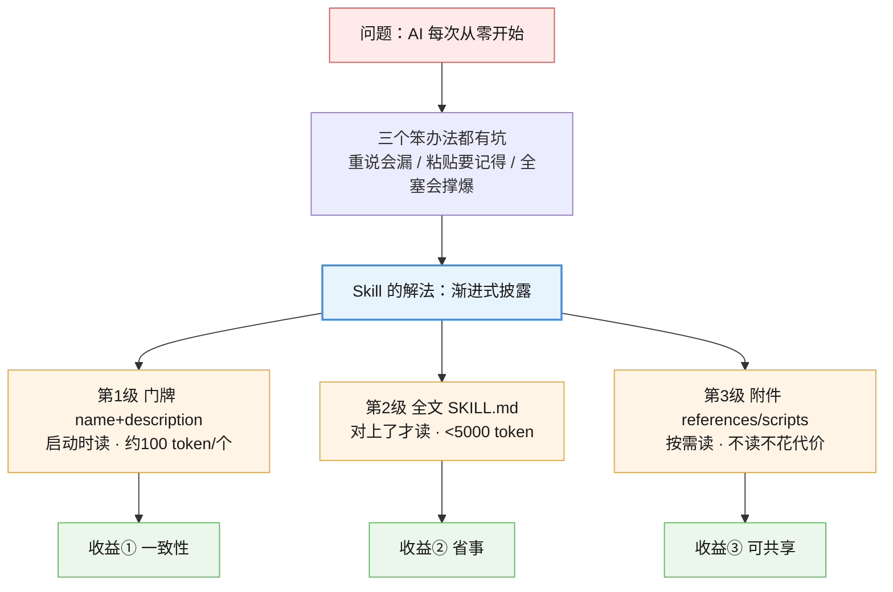

# 第 2 课：为什么需要 Skill

> 所属阶段：阶段 1《理解 Skill》｜ 水平：零基础 ｜ 本课知识点：AI 的失忆特性与三个笨办法、渐进式披露、Skill 的三个实际收益
> 故事情节：主角明白"问题不在 AI 笨"，而在每次对话都从零开始。三个笨办法都试过了，都有坑——Skill 是唯一同时解决"省事"和"一致"的那一个。

## 🎯 本课目标

学完这课，你能**用自己的话解释**：AI 为什么会"失忆"、渐进式披露是什么、Skill 到底带来哪三个收益。

---

## 第一幕：起源与场景引入

### 回到那个学生

课 1 结束时，你已经亲手做出了一个技能文件夹 `essay-polish`，里面写着三条规矩：只改表达、语气学术、引用 APA。

但你可能还有个疑问没解决：**"我为什么不直接把这些要求存成一个 txt，要用的时候复制粘贴给 AI？"**

这个问题问得非常好。要回答它，得先看清楚——**我们到底在解决什么问题？**

### 问题的真正来源：AI 每次都从零开始

回到那个每周改论文的学生。他发现了第一个笨办法：

> **笨办法一：每次重说一遍。**
> "帮我润色这段，语气学术一点，引用用 APA，不要改观点，只改表达，字数 800 以内……"

这办法**能用**，但有三个毛病：

1. **累**——每周说一遍，一学期说十几次。
2. **会漏**——第七次说的时候漏了"引用用 APA"，AI 就换了格式，你还得再改。
3. **会走样**——你这次说"语气学术一点"，下次说"写得正式点"。你自己用词都不一样，AI 的理解自然也不一样。

于是他想到第二个办法：

> **笨办法二：存成备忘录，用的时候复制粘贴。**

把那套要求写在手机备忘录里，每次打开、全选、复制、粘贴。

这解决了"会漏"的问题——因为每次贴的都是同一段话。**但新毛病来了**：

- 备忘录越存越多（论文一套、实验报告一套、邮件一套……），找起来很麻烦
- 那段话很长，每次粘贴都占一大块，AI 读起来也慢
- 最要命的是：**你得自己记得去粘贴**。忘了，就又回到"重说"的老路

> 🎬 **场景**：学生试了"每次重说"（漏了 APA），又试了"存备忘录复制粘贴"（忘了贴、越长越乱）。三个办法，没有一个同时解决"省事"和"一致"。

### 那 Skill 呢？

Skill 做的事，表面看就是"把备忘录变成一个固定格式的文件"。但它加了**两个关键设计**，直接把上面两个毛病都解决了：

1. **AI 自己判断该不该用**（不用你记得去粘贴）
2. **AI 不是一次全读，而是分三步读**（不占地方、不拖慢）

第二点，就是本课最核心的概念——**渐进式披露**。

---

## 第二幕：认知冲突

### 一个看起来无解的矛盾

设想你要装 55 个技能（就像我电脑上的实际情况）。现在有个绕不开的问题：

> AI 的"脑子"是有限的。它一次能读的文字量有上限（叫**上下文窗口**，可以粗略理解成"AI 的短期记忆容量"）。

那么矛盾就来了：

- 你希望 AI **懂很多规矩**（装 55 个技能）
- 但你又**不能一次把 55 个技能的全文全塞给它**（塞不下，而且会把它"撑爆"——读太多会变慢、变贵、甚至变笨）

我实测了一下我电脑上这 55 个技能：

| 项目 | 实测结果 |
|------|---------|
| 55 个技能的 `SKILL.md` 全文 | **575,978 个字符** |
| 55 个技能的"名字 + 简介" | **11,035 个字符** |
| **相差** | **52.2 倍** |

也就是说：**如果 AI 每次启动都要把 55 个技能的全文全读一遍，它得先啃下 57 万字。**

> ❓ **问题**：又要 AI 懂 55 个技能，又不能让它一次读 57 万字——这个矛盾怎么破？

### 顺带回答第一幕的那个问题

还记得"为什么不直接存个 txt"吗？现在可以给出**第一个答案**了：

**你存个 txt，要么不用（等于没存），要么用就得整段贴进去（占地方、得自己记得贴）。** Skill 的设计让 AI **先只花极小的代价"知道有这个东西"**，等真的用上了才去读全文——这就是渐进式披露。

---

## 第三幕：层层揭示

### 知识点 1：AI 的失忆特性与三个笨办法

> 本知识点关键点：每次新对话都从零开始、笨办法各有各的坑、核心矛盾是"想让它懂很多又不能一次全塞"

#### 一句话定义

AI 的每次新对话都是**从零开始**的——上一个对话里你说过什么，它一个字都不记得。

#### 直觉建立（类比）

想象一个**每天早上失忆的助理**。

他能力很强，但每天早上醒来，他不记得你是谁、不记得你昨天交代过什么、不记得你喜欢 APA 格式。你得重新介绍一遍自己、重新交代一遍要求。

**这就是 AI 的真实情况**。不是它笨，是它"每天醒来都是新的一天"。

> ⚠️ 有的 AI 产品有"记忆"功能，能记住一些你的偏好。但那和"每次对话自动遵守一套工作流程"是两回事——课 1 知识点 3 已经讲过这个区别，这里不再重复。

#### 核心原理

面对"每天早上失忆的助理"，你只有三个笨办法：

| 笨办法 | 怎么做 | 解决了什么 | 新毛病 |
|--------|--------|-----------|--------|
| **① 每次重说** | 每次开新对话，把要求打一遍 | 不用任何准备 | 累、会漏、会走样 |
| **② 存备忘录复制粘贴** | 要求存在别处，用时粘贴 | 解决了"会漏" | 得自己记得贴；越长越乱；每次贴一大段很占地方 |
| **③ 一次性全塞给它** | 把所有规矩一口气贴在对话开头 | 一次说完，后面都不用管 | **直接撞上"脑子装不下"**——规矩越多越撑爆 |

三个办法，没有一个同时解决**"省事"**和**"一致"**。

**核心矛盾**就出来了：

> 我们希望 AI 懂很多规矩，但**不能一次全塞给它**；
> 我们希望 AI 每次都按同一套规矩办，但**不能指望它自己记得**。

这个矛盾，正是 Skill 存在的理由。

#### 示例演示

笨办法 ③ 为什么不行？看个真实例子。假设你有 5 套规矩（论文、实验报告、邮件、简历、读书笔记），每套 200 字，一次性贴给 AI：

```
你：以后我让你做事，都按下面 5 套规矩来：
    【论文规矩】……200字……
    【实验报告规矩】……200字……
    【邮件规矩】……200字……
    【简历规矩】……200字……
    【读书笔记规矩】……200字……
    现在，帮我润色这段论文。
```

这看起来很省事，但问题是：

- 你其实只要用**论文**那 200 字，却把 1000 字全塞进去了——**浪费了 80%**
- 规矩涨到 20 套呢？4000 字，**每次对话开头都得先背一遍**
- 更糟的是：AI 读的东西越多，越容易"看漏"中间的细节

**这就是为什么"一次性全塞"行不通。**

#### 常见误区

1. **"AI 应该记住我上次说过的话"**：那是"记忆"功能，不是 Skill。而且记忆不可控、不可共享、换个 AI 就没了。Skill 是**你主动固化下来的文件**。
2. **"我把要求写成一段话存着，不就是 Skill 了吗"**：差在两点——**谁来判断该不该用**（Skill 是 AI 自己判断），以及**占多少地方**（Skill 分三步读，不是整段塞）。
3. **"规矩越多，AI 越厉害"**：恰恰相反。一股脑全塞进去，AI 反而更容易看漏、更慢、更贵。

#### 一句话记住

AI 每次对话都从零开始，三个笨办法（重说、粘贴、全塞）各有各的坑——Skill 是唯一同时解决"省事"和"一致"的那一个。

---

### 知识点 2：渐进式披露（三步读取）

> 本知识点关键点：第一步只看名字+简介（约 100 token）、第二步对上了才读全文、第三步干活时才按需打开附件

#### 一句话定义

AI 不一次性读完所有技能，而是**分三步、按需读取**——先看门牌，对上了才进门，进门后才按需翻抽屉。

#### 直觉建立（类比）

想象你去一家超大的图书馆找资料：

1. **第一步：看索引卡片**。你站在大厅，扫一眼所有书的**书名和一句话简介**。很快——每张卡片就一两行。
2. **第二步：对上了才去拿书**。你发现有一本的简介跟你要找的对上了，才走过去把那本书从架上取下来读。
3. **第三步：需要时才翻附录**。书里提到"详细数据见附录 C"，你这时才去翻附录 C。其他附录一直待在书里，**你根本没碰过**。

**关键点是**：你不需要为了找一本书，先把图书馆里所有书都读一遍。

AI 读技能完全一样。

#### 核心原理

官方把这三步叫 **渐进式披露（progressive disclosure）**，分成三级（核查于 2026-09，来源 [Claude 官方文档](https://platform.claude.com/docs/zh-CN/agents-and-tools/agent-skills/overview)）：

| 级别 | 什么时候读 | 读什么 | 花多少代价 |
|------|-----------|--------|-----------|
| **第 1 级：元数据** | **启动时，永远读** | 每个技能的 `name` + `description`（就是课 1 讲的文件头那两行） | 每个技能约 **100 token** |
| **第 2 级：指令** | **判断对上了才读** | 那个技能的 `SKILL.md` 正文 | 建议 **5000 token 以内** |
| **第 3 级：资源** | **干活时才按需读** | `references/`、`scripts/` 等附件 | 不读就不花代价 |

**token 是什么？** 简单理解就是 AI 计数的单位——你给 AI 的文字，会被切成一小块一小块来数，一块大约就是一个 token。中文里**一个字大约 1～2 个 token**。所以"每个技能约 100 token"，大约相当于**每个技能 50～100 个汉字**。

**这三步串起来是什么样？** 用课 1 那个 `essay-polish` 技能走一遍：

```
【启动时】AI 只看到这一行（第 1 级）：
  essay-polish - 润色学术论文段落。当用户要求改论文、润色学术文字、
                 调整语气为学术风格时使用。
  → 花了约 100 token。AI 现在只知道"有这个技能，是干这个的"。

【你说】"帮我润色这段论文。"

【AI 判断】"改论文"对上了 → 读取 SKILL.md 全文（第 2 级）
  → 读到：只改表达、语气学术、引用 APA

【干活时】如果正文里写了"详细规则见 references/rules.md"，
          这时才去读那个文件（第 3 级）
  → 没提到就不读，附件一直躺在硬盘上，不花任何代价
```

**为什么这样就能解决第二幕那个矛盾？** 因为：

- 装 55 个技能，启动时只花 **55 × 100 ≈ 5500 token**（相当于四五千个汉字）
- 但你实际用到的，可能只有其中 **1 个**技能的全文

**我电脑上的实测对比**（55 个技能）：

| 读法 | 字符数 | 相对开销 |
|------|--------|---------|
| 只看门牌（第 1 级） | 11,035 | **1 倍** |
| 全文全读（假设） | 575,978 | **52.2 倍** |

> 💡 我这儿最长的一个门牌是 435 个字符（约两三百个汉字），**但它自己那个技能的全文有好几万字**——门牌和全文的差距，就是这么悬殊。

#### 示例演示

下面这段命令，能让你亲眼看见"AI 启动时看到的门牌"长什么样。**步骤 1**：

```powershell
# 模拟 AI 启动时看到的"门牌"（技术域：可运行）
$base = "$env:USERPROFILE\.hackwu-skills\skills"
foreach ($d in Get-ChildItem -Directory $base | Select-Object -First 5) {
  $f = Join-Path $d.FullName "SKILL.md"
  if (Test-Path $f) {
    $c = Get-Content $f -TotalCount 12 -Encoding UTF8
    $desc = ($c | Select-String -Pattern '^description:\s*(.+)$' | Select-Object -First 1).Matches.Groups[1].Value.Trim()
    if ($desc.Length -gt 60) { $desc = $desc.Substring(0,60) + "..." }
    Write-Output "$($d.Name) - $desc"
  }
}
```

**预期输出**（本机实测，你的技能列表可能不同）：

```
api-design - 基于需求文档和设计文档，生成包含接口契约、关键代码设计、错误码定义的 API 设计文档。适用于"设计 API"、"接口设...
api-testing - 基于 httpflex-py 库指导 AI 自主完成 HTTP API 测试的技能。将用户用自然语言描述的接口（或文字说...
artifact-optimizer - 对代码、设计文档、Skill 文件进行系统化优化分析，发现可优化点并按优先级给出具体改进建议。不关注"有没有 bug"，...
auto-review - AI 生成 Markdown 文件或代码文件后，自动触发质量审查与修复闭环。审查完成后自动判断是否属于复杂场景，若属于则...
bug-impact-analysis - Bug 修复影响分析。分析修复的根因是否被真正解决、修复是否引入副作用、影响范围和回归风险。触发短语：'分析这个bug的...
```

**看清了吗？** 这五行，就是 AI 启动时对这 5 个技能知道的**全部**。它不知道这些技能里写了什么步骤、有什么例子——它只知道"有这 5 个东西，分别是干这个的"。

#### 常见误区

1. **"渐进式披露是 AI 自动做的，我不用管"**：部分是，但**你的写法直接影响效果**。如果把所有细节都堆在 `SKILL.md` 正文里（不拆到 `references/`），那第 2 级就会很重——**每次触发都要读一大坨**。这就是课 7 要讲的"拆分"。
2. **"第 1 级每个技能约 100 token，那我 description 写长点没关系"**：有关系。`description` 越长，55 个技能累加起来的启动开销就越大。而且它是**每次启动都要付**的固定成本。写清楚就行，别啰嗦。
3. **"附件放在技能里，也算占地方"**：**不读就不算**。这是第 3 级最大的好处——你可以往技能里塞几十个参考文件，用不上的那些**一个 token 都不花**。

#### 一句话记住

渐进式披露 = 先看门牌（约 100 token）→ 对上了才进门（读全文）→ 需要时才翻抽屉（读附件），所以装 55 个也撑不爆。

#### 官方文档

- [Claude 官方 · Agent Skills 工作原理](https://platform.claude.com/docs/zh-CN/agents-and-tools/agent-skills/overview)：三级加载的权威定义与 token 成本表
- [Microsoft 学习 · Agent Skills](https://learn.microsoft.com/en-us/agent-framework/agents/skills)：同样描述了这套分级加载模式

---

### 知识点 3：Skill 的三个实际收益

> 本知识点关键点：一致性、省事、可共享

#### 一句话定义

Skill 带来三个收益：**一致性**（每次读到的都是同一份最新版）、**省事**（写一次，以后只说一句）、**可共享**（换个人、换个 AI 也能用）。

#### 直觉建立（类比）

还是那个每天失忆的助理。你给了他一本**活页夹**：

- **一致性**：活页夹里那一页是唯一的版本。他每天早上翻到的都是同一页，**不会像你口头交代那样每次走样**。你改了活页夹，他明天翻到的就是新版。
- **省事**：你不用每天早上口头交代一遍，只要说"按活页夹办"。
- **可共享**：这本活页夹是**实物**，你可以复印给同学、可以给下一个助理、可以放进档案柜。不像"口头交代"只存在于你和这个助理之间。

#### 核心原理

三个收益，逐个说清楚：

**① 一致性——每次读到的都是同一份最新版**

这是最被低估的一个收益。

回想笨办法一（每次重说）：你第七次说漏了 APA，结果就变了。**口头表达天生不稳定**。

而 Skill 是**一个文件**——AI 每次读的都是**同一份、同一个字**。不会漏、不会走样。

更妙的是**更新**：你把 `SKILL.md` 里"引用用 APA"改成"引用用 MLA"，**所有**用到它的对话立刻生效。不需要你通知任何人、不需要改十处备忘录。

还有个笨办法二做不到的点：你粘贴的那段话，**每次都是你自己想起来才贴**。Skill 是 AI 自己判断，你甚至不用记得有它。

**② 省事——写一次，以后只说一句**

成本对比（以"改论文"为例）：

| 方式 | 每次你要做什么 |
|------|--------------|
| 每次重说 | 打 60 个字，且要打对 |
| 复制粘贴 | 找到备忘录 → 全选 → 复制 → 粘贴（4 步，还得记得） |
| **用 Skill** | **说"帮我润色这段"**（7 个字） |

而且 Skill 是**一次写好，无限次用**。写那 11 行 `SKILL.md` 花你 5 分钟，之后一学期都省了。

**③ 可共享——换个人、换个 AI 也能用**

这是"存 txt"永远做不到的事：

- **换个 AI 工具**：因为 Agent Skills 是**开放标准**（课 1 第一幕讲过，已有 32 个产品支持），同一份 `SKILL.md` 换个工具照样能用。
- **给别人**：直接把文件夹发过去，或者传到 GitHub 上。别人放到自己电脑里就能用。
- **团队共用**：放进项目目录、用 git 管理，全组用同一套规矩，还能看到谁改了什么。
- **版本管理**：发现改坏了？git 回退一下就回到上一版。

#### 示例演示

三个收益落到同一个场景里看：

```
场景：你和同学都在写论文，都要 APA 格式

【不用 Skill】
你：帮我润色这段，语气学术，引用 APA，不要改观点……
同学：（他的 AI 不知道 APA，出来的是别的格式）
结果：你俩格式不一样，被老师说

【用 Skill】
你：写出 essay-polish/SKILL.md（5 分钟）
你：把文件夹发给同学
你：帮我润色这段        ← 以后每次只说这句
同学：帮我润色这段      ← 他的 AI 读到同一份规矩
结果：你俩格式完全一样  ← 一致性 + 可共享
而你俩都只打了 7 个字    ← 省事
```

#### 常见误区

1. **"Skill 主要是省时间"**：省时间是**结果**，最核心的收益其实是**一致性**。重复劳动用复制粘贴也能省点事，但只有 Skill 能保证"每次都一样"。
2. **"我的规矩很简单，不用写成技能"**：正因为简单，**才更容易被你说漏**。漏一次 APA，返工的时间够你写好几个技能了。
3. **"技能写出来就固定了"**：不是。它是个文件，随时能改，改完立刻对所有新对话生效。

#### 一句话记住

Skill 的三个收益：一致（每次同一份最新版）、省事（写一次说一句）、可共享（换人换 AI 都能用）。

---

## 第四幕：实操验证

现在亲手验证"渐进式披露到底省了多少"。**全程只读，不会改动你电脑上任何技能。**

> 💡 你不需要装 55 个技能也能跑——只要 `Get-ChildItem -Directory` 找得到技能，`$env:USERPROFILE\.hackwu-skills\skills` 里有几个就算几个。**一个技能也能看到效果。**

### 步骤 1：看看 AI 启动时看到的"门牌"

```powershell
$base = "$env:USERPROFILE\.hackwu-skills\skills"
foreach ($d in Get-ChildItem -Directory $base | Select-Object -First 5) {
  $f = Join-Path $d.FullName "SKILL.md"
  if (Test-Path $f) {
    $c = Get-Content $f -TotalCount 12 -Encoding UTF8
    $desc = ($c | Select-String -Pattern '^description:\s*(.+)$' | Select-Object -First 1).Matches.Groups[1].Value.Trim()
    if ($desc.Length -gt 60) { $desc = $desc.Substring(0,60) + "..." }
    Write-Output "$($d.Name) - $desc"
  }
}
```

**预期输出**（本机实测，截取前 5 个）：

```
api-design - 基于需求文档和设计文档，生成包含接口契约、关键代码设计、错误码定义的 API 设计文档。适用于"设计 API"、"接口设...
api-testing - 基于 httpflex-py 库指导 AI 自主完成 HTTP API 测试的技能。将用户用自然语言描述的接口（或文字说...
artifact-optimizer - 对代码、设计文档、Skill 文件进行系统化优化分析，发现可优化点并按优先级给出具体改进建议。不关注"有没有 bug"，...
auto-review - AI 生成 Markdown 文件或代码文件后，自动触发质量审查与修复闭环。审查完成后自动判断是否属于复杂场景，若属于则...
bug-impact-analysis - Bug 修复影响分析。分析修复的根因是否被真正解决、修复是否引入副作用、影响范围和回归风险。触发短语：'分析这个bug的...
```

> 💡 如果你的输出是**空的**，说明这个目录下还没有装技能——没关系，**步骤 2 的统计会显示 0**，你可以跳到步骤 5 看原理，或者直接进课 3 学怎么装技能。

### 步骤 2～4：数出"省了多少"（**请整段一起复制**）

> ⚠️ **这三步必须一起复制运行**。步骤 3、4 要用到步骤 2 算出来的 `$meta` `$full` `$n`，**分开运行会报"除以零"错误**（因为每个代码块是独立的，变量带不过去）。

```powershell
$base = "$env:USERPROFILE\.hackwu-skills\skills"
$meta = 0; $full = 0; $n = 0
foreach ($d in Get-ChildItem -Directory $base) {
  $f = Join-Path $d.FullName "SKILL.md"
  if (Test-Path $f) {
    $n++
    $full += (Get-Content $f -Raw -Encoding UTF8).Length
    $c = Get-Content $f -Encoding UTF8
    $desc = ($c | Select-String -Pattern '^description:\s*(.+)$' | Select-Object -First 1).Matches.Groups[1].Value.Trim()
    $meta += ("$($d.Name) $desc").Length
  }
}
Write-Output "=== 步骤2 ==="
Write-Output "技能数: $n"
Write-Output "门牌总字符: $meta"
Write-Output "全文总字符: $full"
Write-Output "=== 步骤3 ==="
Write-Output "倍差: $([math]::Round($full / $meta, 1)) 倍"
Write-Output "=== 步骤4 ==="
Write-Output "装 $n 个技能，AI 启动时只花: $($n * 100) token（按官方每个约 100 token 估）"
Write-Output "如果全读，要花约: $([math]::Round($n * 100 * $full / $meta)) token"
```

**预期输出**（本机实测）：

```
=== 步骤2 ===
技能数: 55
门牌总字符: 11035
全文总字符: 575978
=== 步骤3 ===
倍差: 52.2 倍
=== 步骤4 ===
装 55 个技能，AI 启动时只花: 5500 token（按官方每个约 100 token 估）
如果全读，要花约: 287076 token
```

**5500 vs 28.7 万。** 这就是为什么装 55 个技能也不会把 AI 撑爆。

> 💡 如果你的技能数不是 55，输出的数字会不一样——**这很正常**。只要"倍差"是个两位数以上，你就亲眼看到渐进式披露的威力了。

### 步骤 5：亲手感受"对上了才读全文"

挑一个你认识的单词（比如 `design`、`review`、`PDF`），看看 AI 会怎么匹配：

```powershell
$base = "$env:USERPROFILE\.hackwu-skills\skills"
$kw = "design"
foreach ($d in Get-ChildItem -Directory $base) {
  $f = Join-Path $d.FullName "SKILL.md"
  if (Test-Path $f) {
    $c = Get-Content $f -TotalCount 12 -Encoding UTF8
    $desc = ($c | Select-String -Pattern '^description:\s*(.+)$' | Select-Object -First 1).Matches.Groups[1].Value.Trim()
    if ($d.Name -match $kw -or $desc -match $kw) {
      Write-Output "✅ 命中: $($d.Name)"
    }
  }
}
```

**预期输出**（本机实测，关键词 `design`）：

```
✅ 命中: api-design
✅ 命中: code-implement
✅ 命中: design-craft
✅ 命中: design-review
✅ 命中: design-to-code
✅ 命中: frontend-api-guide
✅ 命中: interaction-design
✅ 命中: scenario-rehearsal
✅ 命中: ui-designer
```

**注意**：`code-implement`、`frontend-api-guide`、`scenario-rehearsal` 这三个**名字里没有 design，是 `description` 里提到了它**——这正好说明：AI 匹配时看的是 `name` **和** `description` 两处，所以 `description` 写得好不好，直接决定能不能被命中。

**这就是第 1 级到第 2 级的那道门**——AI 拿着你的请求，在这些门牌里扫一遍，只有命中的那几个，才会被真正打开读全文。

> ✅ **回扣第二幕的冲突**：装 55 个技能，启动时只花 5500 token（约四五千个汉字），但你随时能用上其中任何一个的全文。**"想让它懂很多"和"不能一次全塞"——这个矛盾就这么破了。**

---

## 第五幕：体系收束

### 现在你会了什么



**课 1 讲了 Skill 长什么样，课 2 讲了为什么需要它。** 一句话串起来：

> AI 每次对话都从零开始 → 三个笨办法都有坑 → Skill 用"渐进式披露"（先看门牌、对上才读全文、按需翻附件）解决了"想懂很多又不能一次全塞"的矛盾 → 带来一致、省事、可共享三个收益。

### 阶段 1 的两课，回答了什么

| 课 | 回答的问题 | 一句话答案 |
|----|-----------|-----------|
| 课 1 | Skill **是什么**？ | 一个文件夹 + 一个必须叫 `SKILL.md` 的文件 |
| 课 2 | **为什么**需要它？ | 让"每次重说、每次不一样"变成"写一次、永远一致" |

> 📍 **全局定位**：阶段 1《理解 Skill》到此结束。你已经**认得它、也懂它为什么存在**了。

> 🔗 **下一步**：进入阶段 2《会用 Skill》——**课 3《用一键脚本安装》**。你已经知道技能长什么样了，接下来是真正把它**装到你电脑上、让它开始为你干活**。课 3 会走"一键脚本"这条新手路线：准备环境、安装、查看、更新、卸载，一条命令搞定。

---

## 🐞 常见误区

1. **"AI 应该记得我上次说过的话"**：那是"记忆"功能，不是 Skill。记忆不可控、不可共享、换个 AI 就没了；Skill 是你主动固化下来的文件。
2. **"存个 txt 复制粘贴，跟 Skill 差不多"**：差在两点——谁来判断该不该用（Skill 是 AI 自己判断，你不用记得贴），以及占多少地方（Skill 分三步读，不是整段塞进去）。
3. **"规矩塞得越多 AI 越厉害"**：恰恰相反。一股脑全塞，AI 更容易看漏、更慢、更贵。渐进式披露就是为了让你"能装很多"但"不用付全款"。
4. **"渐进式披露是 AI 自动的，我不用管"**：你的写法直接影响效果。把所有细节堆在 `SKILL.md` 正文里，第 2 级就会很重，每次触发都要读一大坨。
5. **"Skill 主要就是省时间"**：省时间是结果，核心收益是**一致性**。复制粘贴也能省点事，但只有 Skill 能保证每次都一样。
6. **"技能写出来就固定了"**：不是。它是个文件，随时能改，改完立刻对所有新对话生效。

## 一图总结



## 课后小测

**Q1**：AI"失忆"指的是什么？

- A. AI 记性变差了，老了
- B. 每次新对话都从零开始，上一个对话说过的一个字都不记得
- C. AI 把你的要求存丢了
- D. 只有免费版 AI 才失忆，付费版不会

<details><summary>答案与解析</summary>

**答案：B**。这是 AI 的固有特性，不是故障，也不是版本差异。每次开新对话，它就像"每天早上失忆的助理"，需要你重新交代。Skill 正是为了对抗这一点而存在的。

</details>

**Q2**：下面哪个不是"笨办法一（每次重说）"的毛病？

- A. 累，每周说一遍
- B. 会漏，漏了规则结果就变
- C. 会走样，你自己用词每次都不一样
- D. 需要联网才能说

<details><summary>答案与解析</summary>

**答案：D**。"重说"的三个毛病是累、会漏、会走样（讲义表格里列得很清楚）。需不需要联网跟这个办法本身没关系——ABC 才是它的固有毛病。

</details>

**Q3**：渐进式披露的第 1 级，AI 读的是什么？

- A. 技能的完整 `SKILL.md` 全文
- B. 技能的所有附件
- C. 每个技能的 `name` + `description`，约 100 token
- D. 什么都不读，等你叫它

<details><summary>答案与解析</summary>

**答案：C**。第 1 级是"元数据"，启动时**永远读**，内容是文件头里的 `name` 和 `description`，每个约 100 token。A 是第 2 级（对上了才读），B 是第 3 级（按需读）。D 错——第 1 级是每次启动都要读的，这正是 AI 能"知道有哪些技能"的原因。

</details>

**Q4**：我电脑实测的 55 个技能，"门牌"和"全文"相差多少倍？

- A. 约 2 倍
- B. 约 10 倍
- C. 约 52 倍
- D. 约 500 倍

<details><summary>答案与解析</summary>

**答案：C**。实测数据：门牌（name+description）共 11,035 字符，`SKILL.md` 全文共 575,978 字符，**相差 52.2 倍**。这个数字就是"渐进式披露到底省了多少"的直接证据——也是为什么装 55 个技能也撑不爆。

</details>

**Q5**：关于 Skill 的三个收益，下列说法正确的是？

- A. 最核心的收益是"省时间"
- B. 一致性是最被低估的收益——AI 每次读到的是同一份最新版，不会像口头表达那样走样
- C. 技能写出来就固定了，改起来很麻烦
- D. 可共享只限于同一个 AI 工具内

<details><summary>答案与解析</summary>

**答案：B**。三个收益是一致、省事、可共享，其中**一致性最被低估**——它解决的是"漏一次 APA 就得返工"这个真正的痛点。A 错（省时间是结果，核心是一致性）；C 错（技能是文件，随时能改，改完立刻生效）；D 错（可共享正是因为它跨工具、跨人——Agent Skills 是开放标准，已有 32 个产品支持）。

</details>

## 🚀 下一批接力提示词

> 学完本课后，**复制下面这段文字发给 AI**，即可无缝进入下一课（无需重新描述上下文）：

```
继续学 AI Agent Skill。我的学习档案在 agent-skills-basics/00-学习档案.md，
刚学完阶段 1《理解 Skill》全部 2 课（课 1 Skill 是什么、课 2 为什么需要它），
现在进入阶段 2《会用 Skill》，请按大纲继续讲解课 3《用一键脚本安装》。
```

## 🧭 课程导航

⬅️ **上一课**：[课 1 · Skill 到底是什么](lesson-01-Skill到底是什么.md)

➡️ **下一课**：课 3 · 用一键脚本安装（阶段 2）

📚 **返回目录**：[课程目录](../../../02-课程目录.md)
