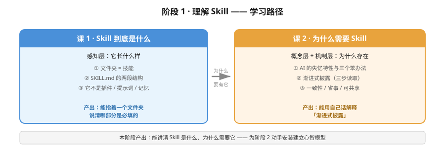

# 阶段 1：理解 Skill

## 章节定位

**故事主线中的章节**：「失忆的助理」——为什么会有这个东西

主角（一个每周重说一遍的学生）第一次意识到：问题不在 AI 不够聪明，而在**它每次都从零开始**。

## 阶段目标

学完本阶段，你能：

1. 指出一个文件夹里哪部分是 Skill、哪部分是普通文件
2. 说出 `SKILL.md` 里哪两个字段是必填的
3. 向别人解释"渐进式披露"是什么（用你自己的话）
4. 分清 Skill、提示词、MCP 三者各管什么

## 学习重点

- **物理形态优先**：先搞清楚"它长什么样"，再谈"它有什么用"。零基础最容易卡在"Skill 到底是个软件还是段文字"。
- **类比要给出边界**：会用"入职手册"类比，但必须讲清它失效的地方（AI 不会因为读了 10 次就记住）。
- **不碰安装**：本阶段不动手装，避免概念没建立就被命令输出淹没。

## 必须掌握的知识点

| 课 | 知识点 | 关键点 |
|----|--------|--------|
| 1 | Skill 的物理形态 | 文件夹即技能 / `SKILL.md` 必须存在 / 可选附件 |
| 1 | SKILL.md 的结构 | 文件头 YAML / `name` 与 `description` / 正文随便写 |
| 1 | Skill 不是什么 | 不是插件 / 不是提示词模板 / 不是记忆 |
| 2 | AI 的失忆特性 | 每次对话从零 / 三个笨办法的坑 / 矛盾在哪 |
| 2 | 渐进式披露 | 三步读取 / 为什么不全读 / 装很多也不卡 |
| 2 | 三个实际收益 | 一致性 / 省事 / 可共享 |

## 本阶段路径图

## 课清单

1. [课 1 · Skill 到底是什么](./lessons/lesson-01-Skill到底是什么.md) —— ✅ 已完成（2026-09-08）
2. [课 2 · 为什么需要 Skill](./lessons/lesson-02-为什么需要Skill.md) —— ✅ 已完成（2026-09-08）

---

## 阶段状态

**✅ 阶段 1 已完结**：2 课全部交付（6/6 知识点）。

**已确立的核心结论**：
- Skill = 一个文件夹 + 一个必须叫 `SKILL.md` 的文件；`SKILL.md` 是规范里**唯一必需**的文件，其余全是可选配件。
- `SKILL.md` 分文件头（YAML，两个必填字段 `name` / `description`）和正文（自由 Markdown）两截。
- `name` 必须小写字母/数字/连字符，且与文件夹名完全一致；`description` 决定 AI 会不会触发这个技能，是新手最致命的坑。
- Skill 不是插件（不装进 AI）、不是提示词模板（AI 自己判断去读）、不是记忆（不自动生效）——它在硬盘上，AI 每次重读。
- 实测数据：本机 55 个已装技能中 32 个是单文件技能。
- **AI 每次新对话都从零开始**；三个笨办法（每次重说会漏、复制粘贴要记得、一次性全塞会撑爆）都有坑。
- **渐进式披露**分三级：L1 门牌（name+description，约 100 token/个，启动必读）→ L2 全文（对上了才读，建议 <5000 token）→ L3 附件（按需读，不读不花代价）。
- **本机实测**：55 个技能，门牌共 11,035 字符 vs 全文共 575,978 字符 = **52.2 倍**；启动 5,500 token vs 全读 287,076 token。这就是"装很多也不撑爆"的原因。
- 三个收益：**一致性**（最被低估，每次同一份最新版）、省事（写一次说一句）、可共享（跨人、跨 AI，因为是开放标准）。

**下一步**：阶段 2《会用 Skill》——把别人的技能装到电脑上。
- Skill = 一个文件夹 + 一个必须叫 `SKILL.md` 的文件；`SKILL.md` 是规范里**唯一必需**的文件，其余全是可选配件。
- `SKILL.md` 分文件头（YAML，两个必填字段 `name` / `description`）和正文（自由 Markdown）两截。
- `name` 必须小写字母/数字/连字符，且与文件夹名完全一致；`description` 决定 AI 会不会触发这个技能，是新手最致命的坑。
- Skill 不是插件（不装进 AI）、不是提示词模板（AI 自己判断去读）、不是记忆（不自动生效）——它在硬盘上，AI 每次重读。
- 实测数据：本机 55 个已装技能中 32 个是单文件技能。

---

**上一阶段**：无（本阶段为起点）
**下一阶段**：[阶段 2 · 会用 Skill](../2-会用Skill/overview.md)
