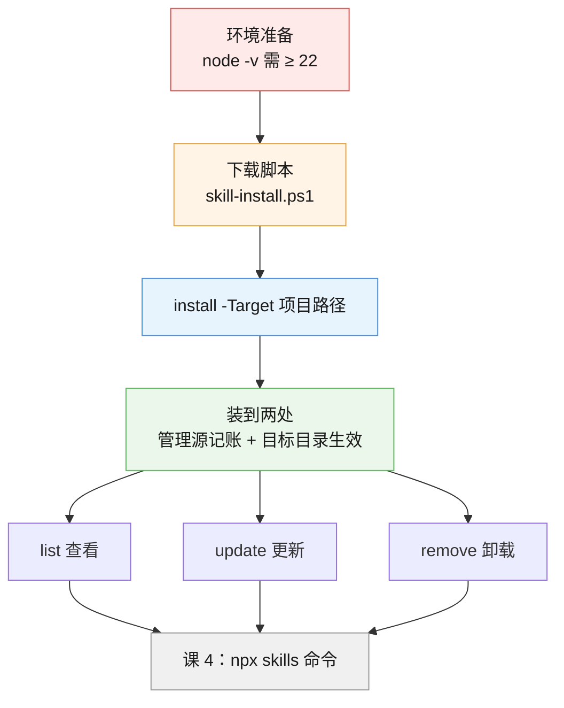
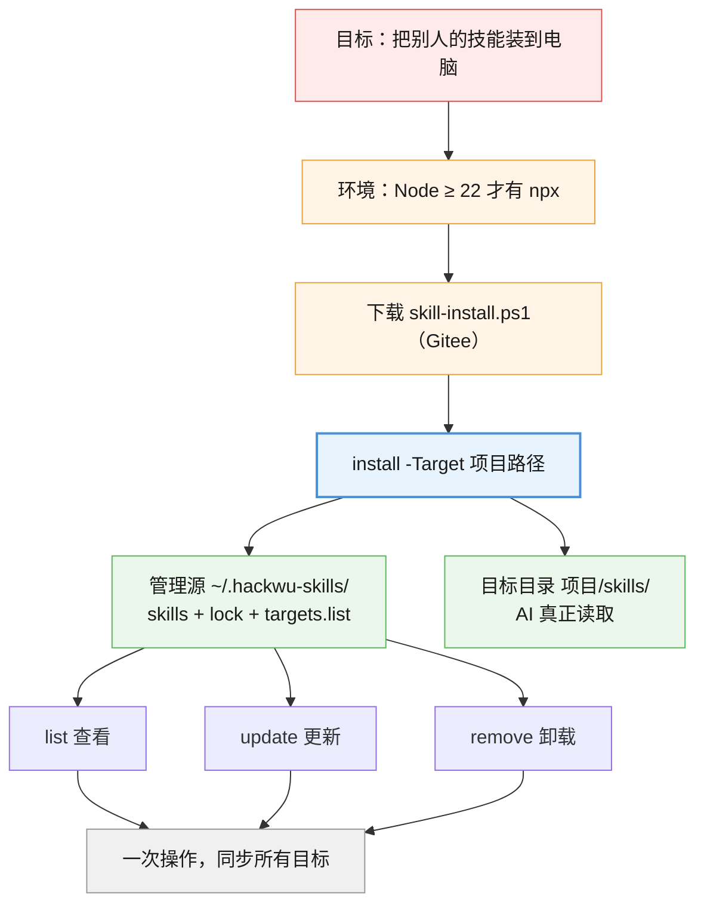

# 第 3 课：用一键脚本安装

> 所属阶段：阶段 2《会用 Skill》｜ 水平：零基础 ｜ 本课知识点：环境准备、用一键脚本安装、查看更新与卸载
> 故事情节：主角终于动手了。这一课把"装技能"从一件听起来很程序员的事，变成复制粘贴几条命令。

## 🎯 本课目标

学完这课，你能**独立完成**：检查环境 → 下载脚本 → 安装 → 查看 → 更新 → 卸载，并知道技能装到了哪两个地方。

---

## 第一幕：起源与场景引入

### 前两课你学到了什么

课 1 你知道了：Skill 就是一个文件夹，里面必须有个 `SKILL.md`。

课 2 你知道了：AI 不管你装了多少技能，启动时**只看门牌**（名字 + 简介），对上了才读全文——所以装 55 个也撑不爆。

但到现在为止，**你电脑上还没真正装过一个能用的技能**。

### 这一课要解决的问题

理论上，装技能很简单：把别人的技能文件夹复制到你电脑上某个目录就行。

但实际操作有三个麻烦：

1. **复制到哪儿？** 不同 AI 工具认的目录不一样——有的认 `~/.claude/skills/`，有的认项目里的 `skills/`。放错地方，AI 根本看不见。
2. **装完怎么更新？** 作者改了技能，你得知道、得重新下载、得覆盖。装了 20 个技能，手工更新 20 次？
3. **装完怎么卸载？** 你装的时候可能同时放进了三个目录，卸载时漏掉一个，就等于没卸干净。

**一键脚本就是来解决这三个麻烦的。**

> 🎬 **场景**：你从 Gitee 上看到一个技能仓库，里面有 55 个技能。你要做的不是一个个下载，而是**复制粘贴两条命令**——剩下的，脚本替你干。

### 本课的两条路线

这门课有两条装技能的路线：

| 路线 | 适合谁 | 本课/下一课 |
|------|--------|------------|
| **一键脚本** | 新手，想省事，还要能后续统一管理 | **本课（课 3）** |
| `npx skills` 命令 | 想装任何仓库、想精细控制 | 下一课（课 4） |

**本课走一键脚本路线**。原因很简单：它不只帮你"装进去"，还帮你**记了一笔账**——装了什么、装到哪儿了。有了这笔账，后面的更新和卸载才是自动的。

---

## 第二幕：认知冲突

### 一个反直觉的设计：技能要装到**两个**地方

你可能以为：装技能 = 复制到某个文件夹，完事。

但一键脚本装完一个技能后，它会出现在**两个地方**：

| 位置 | 是什么 | 作用 |
|------|--------|------|
| **管理源** `~/.hackwu-skills/` | 脚本的"仓库" | 记账用：记住装了哪些、从哪个仓库来的、要同步到哪儿 |
| **目标目录** `你的项目/skills/` | AI 真正去读的地方 | 生效用：AI 只认这里 |

**为什么要分两处？** 因为这样你可以：

- 一个技能**装一次**，同步到**多个**项目（比如你的三个 AI 工具目录）
- `update` 时：从管理源拉最新版 → 自动同步到所有目标
- `remove` 时：管理源删掉 → 所有目标一起删，不会漏

如果直接复制到目标目录，脚本就不知道你装过什么、装到哪儿了——**更新和卸载全都得手工来**。

### 那"目标目录"到底在哪？

这就是第二个反直觉的地方：**目标目录是你自己指定的，脚本不替你猜。**

你必须明确告诉它："装到 `C:\projects\my-app`"。

脚本收到后，会做一件聪明的事：

- 如果这个路径**最后一级叫 `skills`** → 直接装进去
- 如果**不叫** → 在下面**新建一个 `skills` 子目录**再装进去

所以你只需要记住项目路径，不用纠结要不要自己建 `skills` 文件夹。

### 顺带认识一下底层

脚本本身不下载技能——它的底层调用的是 `npx skills`（也就是下一课要讲的官方命令）。

脚本做的事，是**给这条命令套了个壳**：帮你记账、帮你同步多个目录、帮你记目标列表。

> 💡 所以：**脚本 = `npx skills` + 记账本**。课 4 你会看到，不用脚本直接跑 `npx skills` 也行，但那就没有这本账，后续没法统一管理。

---

## 第三幕：层层揭示

### 知识点 1：环境准备（Node / npx 检查）

> 本知识点关键点：npx 是 Node.js 自带的小工具、需要 Node 22+、怎么检查和装

#### 一句话定义

`npx` 是 **Node.js 自带的一个小工具**，用来"临时下载并运行"网上的命令行程序；一键脚本底层就靠它去下载技能。

#### 直觉建立（类比）

把 Node.js 想成一个**工具箱**，里面除了主工具，还附带了一堆小工具——`npx` 就是其中一个。

`npx` 的作用有点像**"免安装运行"**：你跟它说"我要用某某工具"，它就临时从网上把工具取下来跑一遍，跑完不用你管。

所以：

- 你**不需要**单独装 `npx`——装了 Node.js，它就在里面了
- 但脚本**需要** `npx` 存在，所以得先确认 Node.js 装好了

#### 核心原理

**版本要求**：脚本要求 **Node.js 22 或更高版本**。

这不是随便定的——脚本源码里写死了检查逻辑（我下载了脚本看过的）：

```powershell
$nodeVer = (& node -v) -replace '^v', ''
$nodeMajor = [int]($nodeVer -split '\.')[0]
if ($nodeMajor -lt 22) {
    Write-Err "Node.js 版本过低（当前 v$nodeVer，需 >= 22）..."
}
```

也就是说：**版本低于 22，脚本会直接报错退出**，不会装。

**怎么检查？** 两条命令（第四幕会带你跑）：

```powershell
node -v    # 看 Node.js 版本，应该是 v22.x.x 或更高
npx -v     # 看 npx 版本，能出数字就说明在
```

**没有 Node.js 怎么办？**

脚本报错时自己会给出安装建议，两条路：

```powershell
# 方式一：winget（Windows 自带的应用商店命令行）
winget install OpenJS.NodeJS.LTS

# 方式二：去官网下载安装包
# https://nodejs.org/  → 下载 LTS（长期支持版）
```

> 💡 **LTS** 是"长期支持版"的意思，比最新版稳定，新手选它准没错。

装完 Node.js 后，**必须关掉当前 PowerShell 窗口、重开一个**，再跑 `node -v`——新装的程序要重新打开终端才能被认出来。

#### 示例演示

一台**合格**的电脑，跑出来是这样（这就是第四幕步骤 1 的实测结果）：

```
PS C:\Users\你> node -v
v22.14.0

PS C:\Users\你> npx -v
10.9.2
```

`v22.14.0` → 主版本号是 **22**，✓ 达标。

一台**不合格**的电脑，脚本会直接拦下：

```
[ERROR] Node.js 版本过低（当前 v18.20.4，需 >= 22）。

   npx skills 依赖 Node >= 22，请升级 Node.js：
    1. winget: winget install OpenJS.NodeJS.LTS
    2. 官网:   https://nodejs.org/
```

#### 常见误区

1. **"npx 要单独安装"**：不用。它是 Node.js 自带的，装了 Node.js 就有。
2. **"版本号 v22.14.0，那个 .14.0 也要 ≥ 某个数"**：不用管。脚本只看第一个数字（主版本号），**22 就达标**。
3. **"装完 Node.js 立刻能跑"**：不行。要**关掉 PowerShell 重开**，否则命令找不到。
4. **"我是 Mac/Linux 就没有这个问题"**：也要装 Node.js，只是安装方式不同（Mac 常用 `brew install node`）。检查命令完全一样。

#### 一句话记住

脚本底层靠 `npx`，`npx` 跟着 Node.js 来，Node 得 **22 以上**；`node -v` 一查就知道。

---

### 知识点 2：用一键脚本安装

> 本知识点关键点：下载脚本、`.ps1` 用 `-Target`/`-NameFilter`、装到两处、为什么要两处

#### 一句话定义

一键脚本就是一个**别人写好的下载安装程序**——你下载它、运行它、告诉它装到哪儿，剩下的它全包了。

#### 直觉建立（类比）

想象你要往手机里装 55 个 App：

- **手工装**：一个个搜索、下载、安装，装完还得自己记着哪些要更新
- **用应用商店**：选好要装的，点一次"全部安装"，商店还帮你记着"已安装列表"，以后一键更新全部

**一键脚本就是这个"应用商店"**。它多做的那件事——**记账**——才是关键。

#### 核心原理

**第一步：下载脚本**

脚本有两个版本，按你的系统选：

| 系统 | 文件名 | 下载命令 |
|------|--------|---------|
| **Windows** | `skill-install.ps1` | `irm <链接> -OutFile skill-install.ps1` |
| Mac / Linux | `skill-install.sh` | `curl -fsSL <链接> -o skill-install.sh` |

Windows 的下载命令（我已实测可稳定下载）：

```powershell
Invoke-WebRequest -Uri "https://raw.githubusercontent.com/HACK-WU/skills/master/scripts/skill-install.ps1" -OutFile "$env:USERPROFILE\skill-install.ps1"
```

> ⚠️ **这是本课最容易踩的坑**：网上很多教程写的是 `install.ps1` 或 `skills.ps1`，**都不对**。真实文件名是 **`skill-install.ps1`**，而且在 **`scripts/` 子目录**下、分支是 **`master`**（不是 `main`）。我实测过：写错名字一律 404。

> 💡 **下载源的选择**：作者同时在 GitHub 和 Gitee 放了这个脚本。我实测时 Gitee 源出现间歇性 404（3 次连试全失败），GitHub 源 3 次全成功——所以**推荐用上面的 GitHub 链接**。如果你的网络访问 GitHub 困难，把域名换成 `gitee.com/hack-wu/skills/raw/master/scripts/skill-install.ps1` 多试几次即可（详见第四幕步骤 2）。
>
> ⚠️ **用户名容易写错**：Gitee 上的用户名是 **`hack-wu`（中间有连字符）**，不是 `hackwu`。写错会固定 404，且和"间歇性抽风"的 404 长得一模一样——**先核对拼写，再判断是不是网络问题**。

**第二步：运行脚本安装**

```powershell
.\skill-install.ps1 install -Target C:\projects\my-app
```

这行命令的意思是：**"安装，装到 `C:\projects\my-app` 这个项目里"**。

**第三步：理解装到了哪儿**

跑完之后，技能会同时出现在两处（第二幕讲过）：

```
管理源（记账）：C:\Users\你\.hackwu-skills\
  ├── skills\            ← 技能本体都存在这
  ├── skills-lock.json   ← 记账本：装了哪些、从哪来
  └── targets.list       ← 目标清单：要同步到哪几个目录

目标目录（生效）：C:\projects\my-app\skills\   ← AI 真正去读的地方
```

**关于 `-Target` 的聪明之处**：脚本会自动判断——

- 你给 `C:\projects\my-app` → 它建 `my-app\skills\` 再装
- 你给 `C:\projects\my-app\skills` → 直接装进去，不再套一层

这个逻辑在脚本源码里就一行：

```powershell
$leaf = Split-Path $target.TrimEnd('\').TrimEnd('/') -Leaf
$dest = if ($leaf -eq "skills") { $target } else { Join-Path $target "skills" }
```

#### 参数对照表（**高频坑**）

这是本课**最容易出错**的地方——两个脚本的参数名**不一样**：

| 你想干什么 | Windows `.ps1` | Mac/Linux `.sh` |
|-----------|---------------|-----------------|
| 指定装到哪儿 | `-Target` | `-t` |
| 只装某几个技能 | `-NameFilter` | `-n` |
| 指定从哪个仓库装 | `-Repo` | `--repo` |

> ⚠️ **实测高频坑**：在 Windows 上照抄 Mac 教程写 `-t`，PowerShell 会直接报错。**Windows 一律用完整的 `-Target` / `-NameFilter` / `-Repo`。**

**为什么 `-t` 一定会失败？**（我实测复现了，报错原文如下）

```powershell
# 实测：用 -t 传值
.\skill-install.ps1 install -t C:\projects\my-app
```

```
Parameter cannot be processed because the parameter name 't' is ambiguous.
Possible matches include: -TargetPath -Target.
```

原因不是"PowerShell 不认短参数"，而是**这个脚本里同时存在 `-TargetPath` 和 `-Target` 两个参数**。你打 `-t`，PowerShell 猜不出你想用哪个，于是**拒绝执行并列出候选**——这属于**歧义（ambiguous）错误**，和"找不到参数"是两回事。

**顺带一个反直觉的发现**：`-n` 其实是**能用**的。脚本里只有 `$NameFilter` 一个以 N 开头的参数，没有歧义，所以 PowerShell 允许你缩写：

```powershell
# 实测：下面两条完全等价，都成功
.\skill-install.ps1 install -n code-review -Target C:\projects\my-app
.\skill-install.ps1 install -NameFilter code-review -Target C:\projects\my-app
```

**但别因此就去用 `-n`**：它能用纯属"碰巧没撞名"，作者随时可能新增一个以 N 开头的参数，你的命令就会突然失效。而 `-t` 连碰巧都用不了。**初学阶段照抄完整写法最稳。**

#### 常用命令一览

脚本支持 5 个操作（我跑了 `-Help` 拿到的官方原文）：

| 操作 | 作用 |
|------|------|
| `install` | 安装 skill 到目标目录（**默认操作，可省略**） |
| `update` | 更新管理源中已装的 skill，并同步到目标 |
| `remove` | 从管理源删除指定 skill，并同步删除所有目标 |
| `list` | 列出管理源中已装的 skill（含来源仓库） |
| `-Help` | 显示帮助 |

**只装某几个技能**（而不是全部 55 个）：

```powershell
.\skill-install.ps1 install -NameFilter code-review,design-craft -Target C:\projects\my-app
```

**一次装到多个目录**：

```powershell
.\skill-install.ps1 install -Target C:\projects\app1,C:\projects\app2
```

#### 示例演示

一个完整的安装过程，输出大致是这样：

```
PS C:\Users\你> .\skill-install.ps1 install -Target D:\projects\my-app

   安装源: HACK-WU/skills
   目标数量: 1

[INFO] 通过 npx skills 安装到管理源...
[INFO] 安装源: HACK-WU/skills
（npx 下载中…）
[INFO]   同步到目标: D:\projects\my-app
[INFO] 已安装并同步到 1 个目标

✅ 完成
```

**怎么确认装成功了？** 看目标目录里有没有东西：

```powershell
Get-ChildItem D:\projects\my-app\skills
```

能看到一个个技能文件夹（每个里面都有 `SKILL.md`），就说明成了。

#### 常见误区

1. **"脚本要装到 C 盘根目录"**：不用。`-Target` 指向你的**项目目录**就行，脚本会自己建 `skills` 子目录。
2. **"下载完脚本就能直接运行"**：Windows 上可能报"禁止运行脚本"。这是 PowerShell 的安全策略，需要先执行：
   ```powershell
   Set-ExecutionPolicy -Scope CurrentUser RemoteSigned
   ```
   （第四幕步骤 2 会讲）
3. **"装一次就只能用一个项目"**：不是。用 `update` 可以把已装的技能同步到新目录，或者一次 `-Target` 指定多个。
4. **"`.ps1` 和 `.sh` 参数通用"**：**不通用**！这是跨系统复制命令最高频的报错来源。

#### 一句话记住

下载 `skill-install.ps1` → `.\skill-install.ps1 install -Target 你的项目路径` → 技能同时进管理源（记账）和目标目录（生效）。

---

### 知识点 3：查看、更新与卸载

> 本知识点关键点：list 按来源分组给总数、update 拉最新版、remove 同步删除、黄色警告是正常

#### 一句话定义

装完之后，用 `list` 看装了什么、`update` 拉最新版、`remove` 卸干净——三个命令都自动覆盖管理源和所有目标目录。

#### 直觉建立（类比）

还是那个"应用商店"的类比：

- `list` = 打开"**我的应用**"，看装了哪些
- `update` = 点"**全部更新**"
- `remove` = 点"**卸载**"

关键区别在于：**这个商店记得你装到过哪些目录**，所以更新和卸载会**自动同步到所有地方**，不会漏。

#### 核心原理

**① `list` —— 查看装了什么**

```powershell
.\skill-install.ps1 list
```

输出分三段（这是我本机的实测结果）：

1. **仓库来源**：先告诉你这些技能来自哪个仓库、多少个
2. **按仓库分组的技能列表**：一个个列出来
3. **最后给总数**

```
管理源已安装的 skill:

仓库来源:
  <- HACK-WU/skills  (55 个)

HACK-WU/skills:
  api-design
  api-testing
  artifact-optimizer
  ...（中间省略）...
  work-breakdown

  共 55 个 skill

[INFO] 已记录 3 个目标目录（remove 时自动同步）

✅ 完成
```

还可以按仓库过滤：

```powershell
.\skill-install.ps1 list -Repo HACK-WU/skills
```

**② `update` —— 拉最新版**

```powershell
.\skill-install.ps1 update
```

它做的是：**只更新你已经装过的**，不会偷偷给你加新的。

想只更新某几个：

```powershell
.\skill-install.ps1 update -NameFilter code-review -Repo HACK-WU/skills
```

**③ `remove` —— 卸载**

```powershell
.\skill-install.ps1 remove code-review
```

技能名也可以从 `-NameFilter` 给：

```powershell
.\skill-install.ps1 remove -NameFilter code-review,design-craft
```

> ⚠️ **`remove` 必须带技能名**，否则脚本会报错：`remove 需要指定 skill 名称（如 remove code-review 或 -NameFilter code-review）`。

#### 关于那个黄色警告（**重要**）

卸载时，你**可能**看到这样的输出：

```
[WARN] npx 未删除 lock 条目（状态漂移），手动兜底清理: code-review
```

**别慌，这是成功，不是失败。**

原因是这样的（我读过脚本源码，第 438 行附近有注释）：`npx skills remove` 在"记账本"和内部状态不一致时，**可能表面上没删干净、但退出码仍然是 0**（即"静默失败"）。脚本的作者早就知道这个问题，所以加了一段**兜底清理**代码，发现没删干净就自己动手删，并打个黄色警告告诉你"我兜底了"。

**判断标准**：最后出现 `✅ 完成` 就是成功了。黄色的 `[WARN]` 只是告诉你"这里我多做了点事"。

#### 示例演示

一次典型的"查看 → 更新"：

```
PS C:\Users\你> .\skill-install.ps1 list
（列出 55 个技能）
  共 55 个 skill

PS C:\Users\你> .\skill-install.ps1 update
[INFO] 通过 npx skills 重新拉取最新版本...
[INFO]   更新源: HACK-WU/skills → api-design api-testing ...
（npx 更新中…）
[INFO] 已同步到 3 个目标
✅ 完成
```

**"已同步到 3 个目标"** —— 这就是管理源的价值：你跑一次，三个目录一起更新完。

#### 常见误区

1. **"update 会把仓库里新增的技能也装上"**：不会。`update` **只更新已装的**，要装新的请用 `install`。
2. **"黄色警告说明卸载失败了"**：恰恰相反，那是脚本**兜底成功**的提示。看最后有没有 `✅ 完成`。
3. **"remove 不写名字会卸载全部"**：不会卸载，而是**直接报错**并告诉你正确用法——这个设计是安全的。
4. **"卸载了目标目录就没了，管理源不用管"**：管理源才是账本，`remove` 会两边一起清。手工删目标目录而不清管理源，下次 `update` 会把技能**又同步回来**。

#### 一句话记住

`list` 看（按来源分组给总数）、`update` 更新（只更新已装的）、`remove` 卸载（两边同步删，黄色警告是兜底成功）。

---

## 第四幕：实操验证

这一课**不要求你真的装 55 个技能**——第四幕带你做的是：**检查环境 + 下载脚本 + 看一眼已有的样子**。真正的大规模安装你在课 4 之后再决定。

> ⚠️ **全程只读为主**。唯一会动你电脑的动作是**下载一个脚本文件**到你自己的目录（步骤 2），随时可以删掉。

### 步骤 1：检查你的环境

```powershell
node -v
npx -v
```

**预期输出**（本机实测）：

```
v22.14.0
10.9.2
```

**怎么算通过**：
- `node -v` 出来的是 **v22 或更高**（看第一个数字）：✓ 通过
- `npx -v` 能出个数字：✓ 通过

**如果报"不是内部或外部命令"**：说明没装 Node.js。装完 **一定要关掉 PowerShell 重开**再检查。

### 步骤 2：下载安装脚本

```powershell
Invoke-WebRequest -Uri "https://raw.githubusercontent.com/HACK-WU/skills/master/scripts/skill-install.ps1" -OutFile "$env:USERPROFILE\skill-install.ps1"
```

> 💡 这条命令用 `$env:USERPROFILE` 自动定位到你的用户目录（比如 `C:\Users\你`），**不要照抄别人的用户名**。

**验证下载成功**：

```powershell
Get-Item "$env:USERPROFILE\skill-install.ps1" | Select-Object Name, Length
```

**预期输出**（本机实测）：

```
Name               Length
----               ------
skill-install.ps1   21210
```

> 💡 文件大小会随作者更新而变，**只要不是 0 或几 KB 就说明下到了**。

**下不下来怎么办？**（我实测时真的遇到了，见下方"实测提醒"）

```powershell
# 备选源一：Gitee（国内镜像，时好时坏，多试几次）
# 注意用户名是 hack-wu（带连字符），不是 hackwu
Invoke-WebRequest -Uri "https://gitee.com/hack-wu/skills/raw/master/scripts/skill-install.ps1" -OutFile "$env:USERPROFILE\skill-install.ps1"

# 备选源二：换个网络（手机热点）再试
# 备选源三：浏览器打开下面的网址，手动保存为 skill-install.ps1
#   https://gitee.com/hack-wu/skills/blob/master/scripts/skill-install.ps1
#   （GitHub 版：https://github.com/HACK-WU/skills/blob/master/scripts/skill-install.ps1）
```

> ⚠️ **实测提醒（重要）**：我写这课的时候，同一个 Gitee 链接**第一次下载成功了，之后连试 3 次全部 404**；换成 GitHub 源后**连试 3 次全部成功**。（2026-09-08 复测：GitHub 源 3/3 成功，Gitee 源 10/10 失败，但中间也曾成功过一次——**结论是间歇性抽风，不是永久失效**。）所以：
> - **首选 GitHub 源**（上面的主命令），它更稳
> - 如果你在 Gitee 源上遇到 404，**先核对用户名是不是 `hack-wu`**（带连字符），拼错和抽风的报错一模一样
> - 确认没拼错还是 404，**不是你命令写错了**，换个源或过会儿重试即可
> - 另外：**别用 `irm` 下载**（`irm` 是 `Invoke-RestMethod` 的缩写，我实测它在同一个链接上报 404，而 `Invoke-WebRequest` 正常）——**照抄上面的 `Invoke-WebRequest` 写法**
> - 404 也有可能是文件名写错：正确名字是 **`skill-install.ps1`**（不是 `install.ps1`），在 **`scripts/`** 目录下、分支 **`master`**

**如果跑脚本时报"禁止运行脚本"**，先执行这一条（只影响当前用户，安全）：

```powershell
Set-ExecutionPolicy -Scope CurrentUser RemoteSigned
```

### 步骤 3：看一眼"装好的样子"

先看管理源（记账本）：

```powershell
$m = "$env:USERPROFILE\.hackwu-skills"
Write-Output "存在: $(Test-Path $m)"
if (Test-Path $m) { Get-ChildItem $m -Force | ForEach-Object { "  " + $_.Name } }
```

**预期输出**（本机实测，已装过技能）：

```
存在: True
  skills
  skills-lock.json
  targets.list
```

再看目标清单（脚本要同步到哪几个目录）：

```powershell
Get-Content "$env:USERPROFILE\.hackwu-skills\targets.list" -Encoding UTF8 | Where-Object { $_.Trim() -ne "" }
```

**预期输出**（本机实测）：

```
C:\Users\你\.codebuddy\skills
C:\Users\你\.bg-agent\config-with-app\skills
C:\Users\你\.workbuddy\skills
```

> 💡 **看明白了吗？** 这三个都是不同 AI 工具的技能目录。脚本**记着**它们，所以以后 `update` 一次，三个工具里的技能**一起更新**——这就是管理源的价值。
>
> 如果你的输出是空的，说明还没装过技能——没关系，看下一步。

### 步骤 4：用 `list` 看看装了什么（只读，安全）

```powershell
& "$env:USERPROFILE\skill-install.ps1" list
```

**预期输出**（本机实测，截取头尾）：

```
管理源已安装的 skill:

仓库来源:
  <- HACK-WU/skills  (55 个)

HACK-WU/skills:
  api-design
  api-testing
  artifact-optimizer
  ...（中间省略）...
  work-breakdown

  共 55 个 skill

[INFO] 已记录 3 个目标目录（remove 时自动同步）

✅ 完成
```

> 💡 如果提示"管理源中未找到"，说明你还没装过——完全正常，直接进入课 4 学另一种装法。

### 步骤 5：看一眼帮助，确认脚本能用

```powershell
& "$env:USERPROFILE\skill-install.ps1" -Help
```

**预期输出**（本机实测，官方原文）：

```
Skills 安装器 — 基于 npx skills 管理 AI Skills

用法:
  .\skill-install.ps1 <操作> [选项]
  操作:
    install   安装 skill 到目标目录（默认操作，可省略）
    update    更新管理源中已安装的 skill 并同步到目标目录
    remove    从管理源删除指定 skill 并同步删除所有目标
    list      列出管理源中已安装的 skill（含来源仓库）
    -h, --help  显示此帮助
...
```

看到这段帮助，说明**脚本、Node、npx 三样都通了**——你已经具备自己装技能的全部条件。

> ✅ **回扣第二幕的反直觉设计**：`list` 的输出里那句"已记录 3 个目标目录"，就是"装两处"的证据——管理源记着账，所以 `update`/`remove` 才能一次同步三个目录。

---

## 第五幕：体系收束

### 现在你会了什么



**一句话串起来**：

> 先确认 Node ≥ 22 → 下载 `skill-install.ps1` → `install -Target 你的项目` → 技能同时进管理源（记账）和目标目录（AI 读的地方）→ 之后 `list` / `update` / `remove` 一条命令管所有目录。

### 阶段 2 的两课，分工是什么

| 课 | 路线 | 特点 | 适合 |
|----|------|------|------|
| **课 3（本课）** | 一键脚本 | 帮你**记账**、能统一管理、自动同步多目录 | **新手首选** |
| 课 4 | `npx skills` 命令 | 灵活、能装**任何仓库**、无记账 | 想精细控制 |

**两者的关系**：脚本底层就是调 `npx skills`——**脚本 = `npx skills` + 记账本**。

> 📍 **全局定位**：阶段 2《会用 Skill》第 1 课完成。你已经**会装、会看、会更新、会卸载**了。

> 🔗 **下一步**：**课 4《用 npx skills 命令》**——进阶路线。你会看到脚本背后那条原始命令长什么样、怎么用它装**任意**仓库的技能（包括那 7 个社区仓库），以及最重要的：**安装别人的技能前，要注意哪三条安全边界**。

---

## 🐞 常见误区

1. **"npx 要单独装"**：不用，它是 Node.js 自带的。装了 Node.js 就有。
2. **"Node 版本要精确到 22.14"**：不用，脚本只看主版本号，**≥ 22 就达标**。
3. **"装完 Node.js 立刻能跑"**：要**关掉 PowerShell 重开**。
4. **"脚本文件名是 install.ps1"**：**错**，是 **`skill-install.ps1`**，在 `scripts/` 目录下、分支 `master`。写错一律 404。
5. **"Windows 上可以用 `-t` / `-n`"**：**不行**！Windows 用完整写法 `-Target` / `-NameFilter` / `-Repo`，短写法是 Mac/Linux 的。
6. **"技能只装到一个地方"**：装两处——管理源（记账）+ 目标目录（生效），这样更新卸载才能自动同步。
7. **"update 会装上仓库里新增的技能"**：不会，`update` 只更新**已装的**。装新的用 `install`。
8. **"卸载时的黄色警告是失败"**：**恰恰相反**，那是脚本兜底清理成功的提示。看最后有没有 `✅ 完成`。
9. **"手工删掉目标目录就算卸载了"**：不算。管理源里还记着，下次 `update` 会**又同步回来**。要用 `remove`。

## 一图总结



## 课后小测

**Q1**：为什么一键脚本要求 Node.js 版本 ≥ 22？

- A. 因为脚本作者喜欢这个数字
- B. 因为脚本底层用 `npx skills`，而它依赖 Node ≥ 22；脚本源码里有硬检查，低于 22 直接报错退出
- C. 因为 Windows 11 自带 Node 22
- D. 因为技能文件太大，低版本读不动

<details><summary>答案与解析</summary>

**答案：B**。脚本源码里写死了版本检查（`$nodeMajor -lt 22` 就 `Write-Err` 退出）。底层 `npx skills` 确实要求 Node ≥ 22。A 是玩笑，C 错（Windows 不自带 Node），D 无关。

</details>

**Q2**：在 Windows 上，下面哪条命令**写法正确**？

- A. `.\skill-install.ps1 install -t C:\projects\app`
- B. `.\skill-install.ps1 install -Target C:\projects\app`
- C. `.\skill-install.ps1 install --target C:\projects\app`
- D. `.\skill-install.ps1 install /target C:\projects\app`

<details><summary>答案与解析</summary>

**答案：B**。Windows 的 `.ps1` 用**完整参数名** `-Target`（只装某几个用 `-NameFilter`，指定仓库用 `-Repo`）。A 的 `-t` 是 Mac/Linux 的 `.sh` 写法——**这是跨系统复制命令最高频的报错来源**。C、D 都不是 PowerShell 的参数写法。

</details>

**Q3**：脚本把技能装到了"两处"，这两处分别是什么？

- A. C 盘和 D 盘
- B. 管理源 `~/.hackwu-skills/`（记账）+ 目标目录 `项目/skills/`（AI 读取）
- C. 下载文件夹和桌面
- D. Node.js 目录和 PowerShell 目录

<details><summary>答案与解析</summary>

**答案：B**。管理源存技能本体 + `skills-lock.json`（记账本）+ `targets.list`（目标清单）；目标目录才是 AI 真正去读的地方。分两处的意义是：装一次、同步多处，`update`/`remove` 才能自动覆盖所有目录。

</details>

**Q4**：卸载时看到 `[WARN] npx 未删除 lock 条目（状态漂移），手动兜底清理`，说明什么？

- A. 卸载失败了，要重新卸载
- B. 脚本发现没删干净，已自动兜底清理——这是**成功**提示，看到最后 `✅ 完成` 即可
- C. 电脑中毒了
- D. 技能被装到了错误的位置

<details><summary>答案与解析</summary>

**答案：B**。脚本源码注释写明：`npx skills remove` 在 lock 与内部集合"漂移"时可能静默失败（退出码仍为 0）。作者加了兜底清理代码，发现没删干净就自己删，并打黄色警告。**判断标准是最后有没有 `✅ 完成`**，而不是有没有黄色字。

</details>

**Q5**：关于 `update`，下列说法正确的是？

- A. `update` 会把仓库里新增的技能也一起装上
- B. `update` 只更新**已经装过的**技能，不会追加新的；要装新的请用 `install`
- C. `update` 和 `install` 完全一样
- D. `update` 只在第一次安装后能用一次

<details><summary>答案与解析</summary>

**答案：B**。这是官方 README 明确写的："更新：只更新已装的，不追加新 skill"。A 错（那是 `install` 的活），C 错（`install` 装新的、`update` 更新旧的），D 没有这个限制。

</details>

## 🚀 下一批接力提示词

> 学完本课后，**复制下面这段文字发给 AI**，即可无缝进入下一课（无需重新描述上下文）：

```
继续学 AI Agent Skill。我的学习档案在 agent-skills-basics/00-学习档案.md，
刚学完阶段 2《会用 Skill》课 3《用一键脚本安装》（环境准备、一键脚本安装、查看更新卸载），
现在请按大纲继续讲解课 4《用 npx skills 命令》。
```

## 🧭 课程导航

⬅️ **上一课**：[课 2 · 为什么需要 Skill](../../../stages/1-理解Skill/lessons/lesson-02-为什么需要Skill.md)

➡️ **下一课**：[课 4 · 用 npx skills 命令](./lesson-04-用npx-skills命令.md)

📚 **返回目录**：[课程目录](../../../02-课程目录.md)
