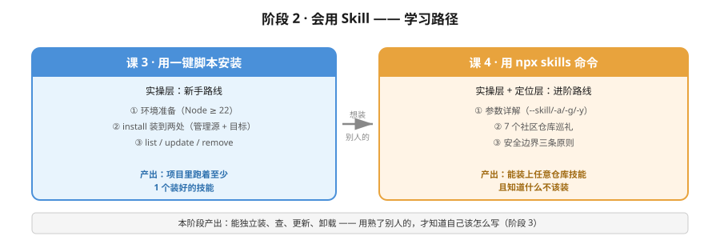

# 阶段 2：会用 Skill

## 章节定位

**故事主线中的章节**：「把别人的经验搬过来」

主角发现：不用自己写，社区里已经有大量现成技能。这一章的冲突从"要不要写"变成"怎么装、装谁的、安不安全"。

## 阶段目标

学完本阶段，你能：

1. 检查自己的电脑环境是否具备条件（Node / npx）
2. 用一键脚本完成安装、查看、更新、卸载
3. 用 `npx skills` 命令装任意社区仓库里的技能
4. 判断一个技能该不该装（安全三条原则）

## 学习重点

- **一键脚本为主线**：用户明确反馈 `npx skills` 直接教难度偏大，故课 3 先讲脚本，课 4 再讲命令。
- **`.ps1` 与 `.sh` 参数不通用**：这是实测发现的高频坑，必须讲清。
- **安全前置**：技能可以带脚本且 AI 会真的执行，安全不是选修课。

## 必须掌握的知识点

| 课 | 知识点 | 关键点 |
|----|--------|--------|
| 3 | 环境准备 | Node 版本检查 / npx 是什么 / 为什么要它 |
| 3 | 用一键脚本安装 | 下载脚本 / install 参数 / 装到哪两个地方 |
| 3 | 查看、更新与卸载 | list / update / remove / 状态漂移警告 |
| 4 | npx skills 命令与参数 | `--skill` / `-a` / `-g` / `-y` / `--list` |
| 4 | 社区技能仓库巡礼 | 7 个仓库的定位与适用场景 |
| 4 | 安全边界三条原则 | 可信来源 / 装前扫一眼 / 异常立刻删 |

## 本阶段路径图

## 课清单

1. [课 3 · 用一键脚本安装](./lessons/lesson-03-用一键脚本安装.md) —— ✅ 已完成（2026-09-08）
2. [课 4 · 用 npx skills 命令](./lessons/lesson-04-用npx-skills命令.md) —— ✅ 已完成（2026-09-08）

---

## 阶段状态

**进度**：2 课全部完成（6/6 知识点）。**阶段 2 已完结。**

**已确立的核心结论**：
- **两条路线的关系**：**脚本 = `npx skills` + 记账本**。脚本能装的主要是作者的仓库；`npx skills` 能装**任何** GitHub 仓库。真实用法常是混着来：`-l`/`use` 探索 → 确认安全 → 装 → 用脚本统一更新卸载。
- **安全本质（本课最重要）**：技能是**纯文本指令**，不是程序——**杀毒软件不拦**，但它让 AI 做的事，AI 的权限就有多大。
- **安全三原则**：认来源 → **装之前用 `use` 读一遍** → 见"要密码/要密钥/上传文件/执行陌生命令/别告诉用户"就别装 → 发现异常立刻删并改密码。
- **零风险探索两件套**：`add <仓库> -l`（只列不装）+ `use <仓库>@<技能>`（打印内容不装）。**先看后装**把"赌运气"变成"可判断"。
- **五个常用参数**：`-s`（挑技能）/ `-a`（装给谁）/ `-g`（全局）/ `-y`（一路默认）/ `-l`（只看不装）。`-a '*'` 的引号不能省。
- **"装了却看不见"的根因**：`-g` 装到**用户级**，而 AI 工具可能去**项目目录**找——拿不准就加 `-a` 明确指定。
- **社区仓库实测技能数**：官方 `anthropics/skills` **20** 个、科研类 **163** 个、安全类 **81** 个（7 个仓库链接各测 2 次全部 200）。安全类**仅授权环境可用**。
- **别贪多**：163 个整个装会严重稀释 AI 注意力，**只装用得上的**。
- **边界坑**：`find --owner` **不能单独用**，必须带搜索词（否则只打印 Usage 就退出）。

**下一步**：阶段 3《会写 Skill》课 5《写第一个 SKILL.md》——从"用别人的"转向"写自己的"。

**已确立的核心结论**：
- 底层关系：**脚本 = `npx skills` + 记账本**。脚本本身不下载技能，底层调 `npx skills`，多做的价值是记账（记住装了什么、装到哪儿）。
- **环境**：`npx` 是 Node.js 自带工具，不用单独装；脚本要求 **Node ≥ 22**（源码硬检查主版本号，低于 22 直接报错退出）。装完 Node 要**重开终端**。
- **装两处**：管理源 `~/.hackwu-skills/`（技能本体 + `skills-lock.json` 记账本 + `targets.list` 目标清单）+ 目标目录 `项目/skills/`（AI 真正读的地方）。分两处才能"装一次、同步多处"。
- **脚本真名**：`skill-install.ps1`，在 **`scripts/`** 下、分支 **`master`**（不是 `install.ps1`，也不是 `main` 分支）。
- **参数不通用（高频坑）**：Windows `.ps1` 用 `-Target` / `-NameFilter` / `-Repo`；Mac/Linux `.sh` 用 `-t` / `-n` / `--repo`。
- **五个操作**：`install`（默认，可省略）/ `update`（只更新已装的，不追加新的）/ `remove`（必须带名字）/ `list`（按来源分组给总数）/ `-Help`。
- **黄色警告是成功**：`remove` 时出现 `[WARN] npx 未删除 lock 条目（状态漂移）` 是脚本兜底清理成功，看最后 `✅ 完成` 即可。
- **实测坑**：Gitee raw 源间歇性 404（3 连败），GitHub raw 源 3 连成功；`irm` 报 404 而 `Invoke-WebRequest` 正常。

**下一步**：课 4《用 npx skills 命令》——进阶路线与安全边界。

---

**上一阶段**：[阶段 1 · 理解 Skill](../1-理解Skill/overview.md)
**下一阶段**：[阶段 3 · 会写 Skill](../3-会写Skill/overview.md)
