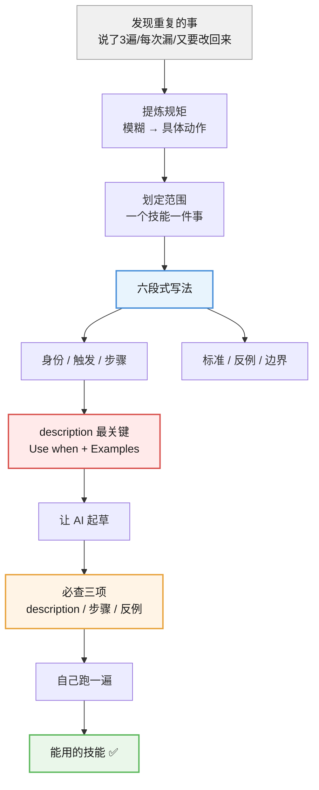
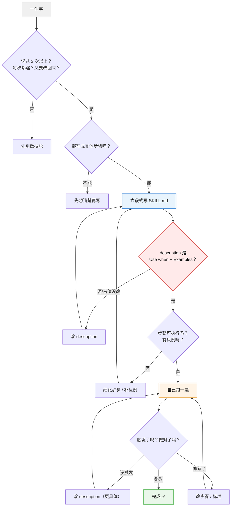

# 课 5 · 写第一个 SKILL.md

> 所属阶段：阶段 3《会写 Skill》｜ 水平：零基础 ｜ 本课知识点：从重复的事到技能、六段式写法、让 AI 帮你写 + 你在旁边审
> 故事情节：主角从"用别人的"转向"产出自己的"——第一幕那个"每周重说一遍改论文要求"的场景，在这一课真正被解决。

## 本课目标

学完这课，你能**把一件每周重复的事写成一个 SKILL.md**，并且知道让 AI 帮你写时该检查什么。

## 本课在故事主线中的情节定位

课 1–4，你一直在**用别人的技能**。

但别人的技能再好，也不如自己写的贴合——因为**只有你知道自己每周在重复什么**。

这一课是故事的转折：你第一次**产出自己的技能**。

> 🎬 **场景**：你每周都要跟合作者说一遍"论文要怎么改"——格式、引用、用词、哪些话不能说。说到第三遍的时候你意识到：**这件事该写成一个技能。**

---

## 第一幕：起源与场景引入

### 从"每周重说一遍"开始

想想你自己的事，有没有这样的：

- 每周都要写一份差不多格式的周报
- 每次收作业/材料，都要重复说明格式要求
- 每次看别人的文档，都在检查同样的几件事
- 每次让 AI 干活，都要先贴一段"你要遵守这些规矩"

**如果有，那就是技能的原材料。**

技能不是什么高大上的东西——**它就是"你本来要口述一遍的规矩，现在写成文件"**。

### 写成技能有什么好处

| 以前（口述） | 以后（写成技能） |
|-------------|-----------------|
| 每次都要重说 | **说一次，以后自动生效** |
| 说的时候会漏 | 写下来不会漏 |
| 换个 AI 对话又要重说 | **跟着文件走，换对话也在** |
| 别人不知道你的规矩 | 可以发给别人 |

> 💡 最实在的一点：**你不用再重复自己了**。

### 本课要交付什么

学完这一课，你会有一个**真正能用的 `SKILL.md`**，内容是你自己的一件重复的事。

我们会走三步：

1. **从重复的事到技能**（知识点 1）——识别什么该做成技能
2. **六段式写法**（知识点 2）——把规矩写清楚
3. **让 AI 帮你写 + 你在旁边审**（知识点 3）——最省力的路径，但你要会审

---

## 第二幕：认知冲突

### 反直觉一：写技能不难，**难在"把模糊变明确"**

很多人以为写技能难在"格式""语法"。

**不是。** 格式只有几行（本课会给你模板）。真正难的是：

> 你以为自己知道规矩，但真要写下来时，发现**说不清楚**。

比如"论文要好好改"——什么叫"好好改"？

- 格式怎么算对？
- 哪些话不能说？
- 改到什么程度算完成？

**写不下来，通常不是文笔问题，是你自己还没想清楚。**

> 💡 所以写技能有个意外收获：**它逼你把模糊的要求想清楚**。很多人写完技能后发现，自己对这件事的理解变清晰了。

### 反直觉二：`description` 比正文更重要

新手最容易犯的错：**花 90% 的精力写正文，随便写一句 description。**

但真相是：

**`description` 决定了技能会不会被触发。正文写得再好，触发不了就是零。**

为什么？回到课 2 学过的"门牌"原理：AI 扫所有技能时，**只看门牌（description）**，不看屋子里的东西。**门牌没写对，AI 根本不会进来。**

看看我电脑上一个真实技能的 description（这是实测读到的原文）：

```yaml
description: "Use when the user needs to run GitNexus CLI commands like analyze/index
  a repo, check status, clean the index, generate a wiki, or list indexed repos.
  Examples: \"Index this repo\", \"Reanalyze the codebase\", \"Generate a wiki\""
```

注意它做了什么：**不仅说了"我是干什么的"，还举了三个用户会怎么说的例子**。

而官方模板给的默认 description 是这样的：

```yaml
description: A brief description of what this skill does
```

**"A brief description of what this skill does"——这是一句空话，等于没写。**

> ⚠️ **如果你照抄官方模板的默认值，你的技能永远不会触发。**

### 反直觉三：一个字符写错，技能会**静默消失**

你可能以为：就算 `SKILL.md` 里写错点什么，顶多不太好用。

**我实测发现：错一个字符，技能会整个消失——而且完全不报错。**

课上我做了对照实验（第四幕会带你复现）。两个技能，文件都在、位置都对：

| 实验 | `SKILL.md` 第一行 | 结果 |
|------|------------------|------|
| A | `name: totally-different`（**和文件夹名不一样**） | ✅ **能识别**（列表按 `name` 显示） |
| B | `name totally-different-name`（**少了冒号**） | ❌ **完全消失**，列表里找不到，**且不报任何错** |

**看出来了吗？** 文件夹名不一致**没关系**，但 **YAML 语法写错（少了冒号）就会让整个技能被悄悄跳过**。

你不会看到红色报错，只会觉得"我明明装了，AI 怎么没反应"——**这是最难查的一类问题**。

> ⚠️ **这也是为什么"自己跑一遍"不能省**：很多错误不会报错，只会让技能静默失效。你只有实际用一次，才知道它到底在不在。

---

## 第三幕：层层揭示

### 知识点 1：从重复的事到技能

> 本知识点关键点：识别重复模式、提炼规矩、划定范围

#### 一句话定义

判断一件重复的事该不该做成技能，看三个信号；做成之前先**提炼规矩**（把模糊要求变成明确步骤）并**划定范围**（一个技能只管一件事）。

#### 直觉建立（类比）

想象你带一个新人。

你不会跟他说"你看着办"——你会给他一份**操作手册**：什么情况做什么、按什么步骤、做成什么样算合格、什么情况别这么做。

**技能就是给 AI 的操作手册。**

所以判断标准很简单：**这件事你会不会想给新人写一份手册？** 会，就适合做成技能。

#### 核心原理

**信号一：三个"又"**

出现下面任何一种，就该考虑做成技能了：

| 信号 | 具体表现 |
|------|---------|
| **又说了一遍** | 同一段要求，你对 AI（或对别人）说过 **3 次以上** |
| **又漏了一项** | 每次说都会漏掉某一条，事后才想起来 |
| **又要改回来** | AI 做完了，你还得按老规矩逐条改回去 |

> 💡 最强信号是第三个：**"又要改回来"** 说明规矩明确存在、且 AI 每次都没拿到——这正是技能要解决的事。

**相反，这些情况别做技能**：

- 只做过一次、以后不会再做的事
- 每次要求都不一样、没有固定规矩的事
- 你自己也说不清规矩是什么的事（先想清楚，再写）

**提炼规矩：把"好好做"变成"做这几步"**

这是最核心的一步。方法是对每个模糊词连续追问 **"具体是什么？"** 直到能写成动作。

举个真实例子（就是本课的"改论文"场景）：

| 模糊要求 | 追问 | 变成明确步骤 |
|---------|------|-------------|
| "格式要对" | 具体是什么？ | ① 行距 1.5 ② 字号小四 ③ 参考文献用 GB/T 7714 |
| "语言要学术" | 具体是什么？ | ① 不出现"我觉得" ② 不出现感叹号 ③ 不用缩写 |
| "引用要规范" | 具体是什么？ | ① 正文引用用 `[1]` ② 参考文献不少于 10 篇 ③ 不引百科类来源 |

**判断标准**：写完之后，让一个**完全不懂的人**照着做，能不能做出差不多的结果？

**能** → 规矩提炼到位了。
**不能** → 还有模糊的地方，继续追问。

**划定范围：一个技能只管一件事**

新手最容易犯的第二个错：**把一堆事塞进一个技能**。

| 太宽（❌） | 合适（✅） |
|-----------|-----------|
| "帮我处理文档" | "按 GB/T 7714 规范论文的参考文献" |
| "帮我写代码" | "给 Python 函数补 doctest 格式的注释" |
| "帮我改论文" | "检查论文的语言是否学术化" |

**判断标准**：这个技能的名字，能不能用**一个动词 + 一个明确对象**说清楚？

- ✅ "检查参考文献格式"
- ❌ "处理文档相关的事"

**太宽有什么坏处？** 两个：

1. **AI 不知道什么时候该用**——范围太广，description 写不清楚，触发就不准
2. **正文会变得又长又乱**——一件事的规矩讲得清，十件事的规矩讲不清

> 💡 拿不准就**先写窄一点**。宁可一开始范围小、以后再加，也别一开始就贪大。

#### 示例演示

来看一个完整的"从重复到技能"的提炼过程：

**原始状态**（你脑子里/每次口述的）：

> "帮我看看这份报告，格式要对，语言要正式，数据要核对一下。"

**第一步：识别信号** —— 每周都要说，"又要改回来" → **该做成技能**。

**第二步：提炼规矩**：

| 模糊 | 明确 |
|------|------|
| 格式要对 | 标题用二级、正文宋体小四、页码在底部居中 |
| 语言要正式 | 不用口语词、不用缩写、不出现第一人称 |
| 数据要核对 | 每个数字都要能追溯到原始表格 |

**第三步：划定范围** —— 这三件事其实是**三类检查**，可以合成一个"报告交付前检查"技能，但**不该**再往里塞"帮我写报告"。

**结果**：一个叫 `report-final-check`（报告交付前检查）的技能，范围清晰。

#### 常见误区

1. **"事情太小，不值得做成技能"**：**错**。越小越具体，技能越好用、越容易触发。"把日期统一改成 YYYY-MM-DD"这种，做成技能很合适。
2. **"我得先学会编程才能写技能"**：**不需要**。技能就是 Markdown 文本（课 1 学过），你现在就能写。
3. **"规矩写不下来，是我文笔不好"**：**不是，是还没想清楚**。继续追问"具体是什么"，直到能写成动作。
4. **"一个技能解决所有相关问题最省事"**：**错**。太宽会导致触发不准、正文臃肿。**一个技能一件事**。
5. **"我做过一次的事也能做成技能"**：除非你确定它会重复。**只做过一次的事别做**，那是浪费。

#### 一句话记住

**说了 3 遍以上 / 每次都漏 / 又要改回来 → 该做成技能**；写之前把"好好做"追问成"做这几步"；**一个技能只管一件事**。

---

### 知识点 2：SKILL.md 六段式写法

> 本知识点关键点：身份、触发、步骤、标准、反例、边界

#### 一句话定义

一个好用的 `SKILL.md` 由六段组成：**身份**（你是谁）、**触发**（什么情况用）、**步骤**（怎么做）、**标准**（什么样算合格）、**反例**（什么不该做）、**边界**（什么情况别用）。

#### 直觉建立（类比）

回到"给新人的操作手册"这个比喻，六段式就是手册的六个必备部分：

| 手册 | 六段式 |
|------|--------|
| 这个岗位是干什么的 | **身份** |
| 什么情况下启动这个流程 | **触发** |
| 具体操作步骤 | **步骤** |
| 完成标准 | **标准** |
| 常见错误 | **反例** |
| 什么情况不走这个流程 | **边界** |

**少了任何一段，手册都会出问题**：没写触发 → 新人不知道什么时候用；没写反例 → 新人踩你踩过的坑。

#### 核心原理

**先看你电脑上真实技能的完整结构**（我实测读到的官方模板，`npx skills init` 生成的原文）：

```markdown
---
name: my-first-skill
description: A brief description of what this skill does
---

# my-first-skill

Instructions for the agent to follow when this skill is activated.

## When to use

Describe when this skill should be used.

## Instructions

1. First step
2. Second step
3. Additional steps as needed
```

**注意两点**：

1. **开头 `---` 包起来的是 frontmatter**（元数据），里面有 `name` 和 `description`——这两个是**给工具看的**，不是给人看的。
2. **官方模板只有三段**（When to use / Instructions），而且 description 是**占位空话**。

**所以六段式是在官方模板基础上的加强版**——官方给你骨架，六段式让你把它填成能用的东西。

**六段完整清单**：

| 段 | 写在哪 | 写什么 | 为什么重要 |
|----|--------|--------|-----------|
| **1. 身份** | frontmatter 的 `name` + 正文标题 | 这个技能叫什么、是给谁用的 | 让人和工具都能认出它 |
| **2. 触发** | frontmatter 的 `description` | **什么情况下用 + 用户会怎么说** | **决定能不能被触发，优先级最高** |
| **3. 步骤** | 正文 | 具体怎么做，一步一步 | AI 照着执行的动作清单 |
| **4. 标准** | 正文 | 做成什么样算合格 | 让结果可检验，不含糊 |
| **5. 反例** | 正文 | 什么是不该做的 | **避免 AI 踩你已经踩过的坑** |
| **6. 边界** | 正文 | 什么情况**别用**这个技能 | 防止 AI 在不该用的场景乱用 |

**`description` 怎么写（最重要）**

记住一个公式：

> **"Use when ..." + 具体场景 + "Examples: 用户可能怎么说"**

看真实技能的写法（实测原文，注意它举了三个例子）：

```yaml
description: "Use when the user needs to run GitNexus CLI commands like analyze/index
  a repo, check status, or generate a wiki. Examples: \"Index this repo\",
  \"Reanalyze the codebase\", \"Generate a wiki\""
```

**为什么举例子这么重要？** 因为用户说的话五花八门。你写"用于索引代码库"，用户说"分析一下这个仓库"——**词对不上，就可能不触发**。

**多列几种说法，就多几种触发机会。**

**`name` 的规则**：

- 用小写字母、数字、连字符（如 `report-final-check`）
- 别用空格和中文
- **建议和文件夹名保持一致**

> ⚠️ 关于"一致"这点，如实告诉你实测结果：**不一致性不影响识别**——我实测把 `name` 写成 `totally-different`、文件夹叫 `test-name-mismatch`，它照样出现在列表里，只是**列表按 `name` 显示**。
>
> 那为什么还建议一致？因为**不一致会让你自己混乱**：文件夹叫 A、列表显示 B，以后你想删它、找它，都会对不上。**这是给人看的规矩，不是给工具的。**

**一个填满的六段式模板**（你可以直接抄这个）：

````markdown
---
name: report-final-check
description: "Use when checking a report before delivery — formatting, formal
  language, and data traceability. Examples: \"check this report\",
  \"is this report ready to send\", \"review the formatting\""
---

# 报告交付前检查

## 身份
你是报告交付前的质检员，负责在报告发出前做最后检查。

## 触发条件
当用户要求检查、审阅一份即将交付的报告时使用。

## 步骤
1. 检查格式：标题是否为二级、正文是否宋体小四、页码是否在底部居中
2. 检查语言：是否有口语词、缩写、第一人称
3. 检查数据：每个数字是否都能追溯到原始表格

## 标准
- 三项检查全部完成，且每项都给出明确的"通过/不通过"
- 不通过的要指出**具体位置**和**具体问题**

## 反例
- ❌ 只说"格式有问题"，不说具体哪里
- ❌ 顺手帮用户改写内容（这是检查，不是修改）
- ❌ 漏掉数据追溯这一项

## 边界
- 用户明确要求"帮我写报告"时**不要用**——本技能只做检查
- 报告是草稿阶段时不要用，先等用户写完
````

> 💡 模板用了四重反引号（`````）包裹，是为了让你能直接整段复制。**你实际写文件时用普通的三反引号就行**，或者干脆不用代码块——`SKILL.md` 本身就是 Markdown，直接写内容即可。

#### 示例演示

**对比：同一个技能，写得差 vs 写得好**

| ❌ 差（触发不了 + 执行不了） | ✅ 好（六段齐全） |
|------------------------------|------------------|
| `description: 帮我检查报告` | `description: "Use when checking a report before delivery... Examples: ..."` |
| 步骤："仔细检查格式和语言" | 步骤：1. 标题二级 2. 正文宋体小四 3. 页码居中 |
| 没有标准 | 标准：三项全查，每项给通过/不通过 |
| 没有反例 | 反例：❌ 只说"有问题"不指出位置 |
| 没有边界 | 边界：草稿阶段不要用 |

**差的那个有什么后果？** description 太泛 → **大概率不触发**；步骤太含糊 → 就算触发了，AI 也不知道具体查什么，结果跟没装一样。

#### 常见误区

1. **"description 随便写写，正文写好就行"**：**最致命的误区**。description 决定触发，正文决定执行——**触发不了，正文再好也是零**。
2. **"照抄官方模板的 description 就行"**：**不行**。官方模板写的是 `A brief description of what this skill does`——**这是占位空话，照抄等于没写**。
3. **"name 和文件夹名字不一样没关系"**：**有关系**，会导致识别异常。**保持一致**。
4. **"反例和边界可以省略"**：省了短期能跑，长期会出问题——AI 会在不该用的时候用、会重复你踩过的坑。**这两段是本课最容易被省、也最不该省的部分**。
5. **"步骤写得越详细越好"**：不是。**写到"能照着执行"就够**，太长会占用 AI 的注意力（课 2 学过）。详细内容可以拆到子文件（课 7 会讲）。

#### 一句话记住

六段：**身份 / 触发 / 步骤 / 标准 / 反例 / 边界**；**`description` 写 "Use when + 场景 + Examples"，优先级最高**；`name` 要和文件夹同名。

---

### 知识点 3：让 AI 帮你写 + 你在旁边审

> 本知识点关键点：提示词模板、必查三项、自己跑一遍

#### 一句话定义

最省力的路径是**让 AI 按模板起草、你负责审核**——审核盯死三项：`description` 是否具体、步骤是否可执行、有没有反例，最后**自己跑一遍**才算数。

#### 直觉建立（类比）

这就像**你口述、助理帮你整理成文档**：

- 你脑子里有规矩（只有你知道）
- 助理擅长组织语言、写成规范格式
- 但助理**不知道你的实际细节**，可能写得漂亮但不实用

**所以分工是：AI 出草稿，你负责把关。**

> 💡 这是给你量身定做的路径（你没写过代码也能做）：**你提供内容，AI 提供格式**。

#### 核心原理

**第一步：给 AI 一个好提示词**

直接说"帮我写个技能"，AI 会写出一堆空话。**要给足够的信息**：

```
我要写一个 Skill，帮我起草 SKILL.md，要求如下：

【技能名】report-final-check

【用途】报告交付前的最后检查

【规矩】（这是我口述的，帮我整理成明确步骤）
- 格式要对：标题用二级、正文宋体小四、页码底部居中
- 语言要正式：不要口语词、不要缩写、不要第一人称
- 数据要核对：每个数字都要能追溯到原始表格

【用户会怎么说】
"检查一下这份报告"、"这报告能发了吗"、"看看格式对不对"

【要求】
1. description 用 "Use when..." 开头，把上面"用户会怎么说"列成 Examples
2. 正文按六段式：身份 / 触发条件 / 步骤 / 标准 / 反例 / 边界
3. 步骤要具体到能照着执行
4. 反例至少 3 条

请输出完整的 SKILL.md 内容。
```

**这个提示词的关键**：**你把"规矩"和"用户会怎么说"这两件事提供了**——这两样 AI 猜不出来，只有你知道。

**第二步：必查三项（AI 写完，你逐项核对）**

| 必查项 | 看什么 | 不合格的样子 | 合格的样子 |
|--------|--------|-------------|-----------|
| **1. description 是否具体** | 有没有 "Use when" + 场景 + Examples | `A brief description of what this skill does`（占位没改） | `Use when checking a report... Examples: "check this report"` |
| **2. 步骤是否可执行** | 每一步是不是**具体动作** | "仔细检查格式和语言" | "检查标题是否为二级" |
| **3. 有没有反例** | 有没有"❌ 不要…"这类条目 | 完全没有 | 至少 3 条具体反例 |

> ⚠️ **第 1 项是最常见的翻车点**：AI 经常把模板里的占位 description 原样留着。**看到 "A brief description" 这种字样，直接判定不合格。**

**再加两个次级检查**（前三项过了再看）：

- **`name` 和文件夹名是否一致**
- **边界段有没有写**（防止 AI 在不该用的场景乱用）

**第三步：自己跑一遍（最关键）**

**AI 写的不算数，你试过才算。**

具体操作：

1. 把技能放进技能目录（用 `npx skills init` 创建，见第四幕）
2. **用你日常的说法**跟 AI 说一句话（比如"检查一下这份报告"）
3. 看 AI 有没有用上这个技能

**判断标准**：

- ✅ AI 的行为明显按你的规矩来了 → 成了
- ❌ AI 完全没反应 → 大概率是 description 不够具体，回去改
- ⚠️ AI 用了，但做得不对 → 步骤或标准写得不够明确

> 💡 **这一步不能省。** 我实测发现过一个坑：**`SKILL.md` 里错一个字符（YAML 少个冒号），技能会整个消失，而且不报任何错**（见第二幕反直觉三）。所以"跑一遍"不只是验证内容，也是验证**它到底有没有被装上**。

#### 示例演示

一次完整的"AI 写 + 你审"流程：

```
第 1 步：你给 AI 上面的提示词模板（填好你的规矩）

第 2 步：AI 输出 SKILL.md 草稿

第 3 步：你核对三项
  ☑ description —— 检查是不是 "Use when..." + Examples
     看到 "A brief description..." → 打回重写
  ☑ 步骤 —— 每一步是不是具体动作
     看到"仔细检查"这种词 → 打回细化
  ☑ 反例 —— 有没有至少 3 条
     没有 → 让 AI 补上

第 4 步：自己跑一遍
  - 用日常说法跟 AI 说一句
  - 看有没有触发、做得对不对

第 5 步：不对就改，回到第 3 步
```

**一个真实的审核案例**（我自己跑技能时遇到的）：

我让 AI 起草后，看到 description 是：

```yaml
description: A brief description of what this skill does
```

**这是官方模板的占位文字——AI 原样留着没改。**

如果就这么装上，**这个技能永远不会触发**，而且你完全看不出哪里错了。

**所以"必查三项"的第一项，就是专门抓这个的。**

#### 常见误区

1. **"AI 写的肯定比我好，直接用"**：**不行**。AI 不知道你的实际细节，还经常**原样保留占位文字**。必须审。
2. **"审一遍就够了"**：不够。**必须自己跑一遍**——"看起来对"和"真的能用"是两回事。
3. **"我描述得很清楚了，AI 应该能写对"**：AI 会用**听起来很专业但实际很空**的话填满模板。所以必查项要看**具体性**，不是看"写得多不多"。
4. **"跑一遍不触发，说明技能没用，删了"**：先别删。大概率是 description 不够具体（回到知识点 2），改改可能就好了。课 6 会专门讲"不触发的四步排查"。
5. **"让 AI 写就不用自己想了"**：**核心规矩必须你自己提供**。AI 能帮你组织语言，但**猜不出你每周在重复的到底是什么**。

#### 一句话记住

**AI 起草（你提供规矩和用户说法）→ 必查三项（description 具体 / 步骤可执行 / 有反例）→ 自己跑一遍才算数**。

---

## 第四幕：实操验证

这一课**要动手**——你会真的创建一个技能文件。

> ⚠️ **重要前提**：`npx skills init` 会在**你当前的命令行目录**下创建文件夹（我实测确认）。所以在跑之前，**先 `cd` 到你想要的位置**。
>
> 如果你不 `cd`，文件就会建在你当前所在的目录（比如 `C:\Users\你的用户名`），之后你会找不到它——**这是新手最常见的困惑**。

### 步骤 0：先找一个合适的位置

建议专门建一个放技能的文件夹：

```powershell
mkdir D:\my-skills
cd D:\my-skills
```

> 💡 这一步**不能省**。不 `cd` 的话，文件会建在你不知道的地方。

### 步骤 1：用 init 创建骨架

```powershell
npx skills init report-final-check
```

**预期输出**（本机实测，去掉了开头的 ASCII 大字 logo）：

```
Initialized skill: report-final-check

Created:
  report-final-check/SKILL.md

Next steps:
  1. Edit report-final-check/SKILL.md to define your skill instructions
  2. Update the name and description in the frontmatter

Publishing:
  GitHub:  Push to a repo, then npx skills add <owner>/<repo>
  URL:     Host the file, then npx skills add https://example.com/report-final-check/SKILL.md
Browse existing skills for inspiration at https://skills.sh/
```

> 💡 最后那行 `Browse existing skills for inspiration at https://skills.sh/` 是个官方技能浏览站——想看看别人怎么写的时候可以去逛逛。

**怎么算通过**：看到 `Created: report-final-check/SKILL.md` 就成了。

### 步骤 2：看看生成了什么

```powershell
Get-Content report-final-check\SKILL.md
```

**预期输出**（官方模板原文，实测）：

```markdown
---
name: report-final-check
description: A brief description of what this skill does
---

# report-final-check

Instructions for the agent to follow when this skill is activated.

## When to use

Describe when this skill should be used.

## Instructions

1. First step
2. Second step
3. Additional steps as needed
```

**重点看 `description` 那一行**——它是 `A brief description of what this skill does`。

**这就是官方模板的占位文字，你必须改掉它**（知识点 2 讲过：照抄 = 永不触发）。

### 步骤 3：把它改成六段式

用记事本或任何编辑器打开 `report-final-check\SKILL.md`，把内容**整个替换**成你的六段式版本（用知识点 2 的模板，或你让 AI 起草的版本）。

改完之后再读一遍确认：

```powershell
Get-Content report-final-check\SKILL.md
```

**必查三项自检**：

- [ ] `description` 是 `Use when...` + 具体场景 + Examples（**不是** "A brief description..."）
- [ ] 步骤具体到了"能照着执行"
- [ ] 有至少 3 条反例

### 步骤 4：确认文件在哪（很多人会卡在这里）

```powershell
Get-Location
Get-ChildItem report-final-check
```

**预期输出**（本机实测）：

```
Path
----
D:\my-skills

---

Mode   LastWriteTime     Length Name
----   -------------     ------ ----
-a---- 2026/9/8 14:45:42    315 SKILL.md
```

**怎么算通过**：`Get-Location` 显示的是你 `cd` 过去的目录（这里是 `D:\my-skills`），且能看到 `SKILL.md`。

> 💡 `Mode` 那列显示 `-a----` 表示它是**文件**（不是文件夹），`315` 是文件字节数——**数字和你的不一样很正常**（取决于你写的内容多少）。

**顺带验证一个知识点**：用下面的命令看 `name` 和文件夹名是否一致：

```powershell
Select-String report-final-check\SKILL.md -Pattern "^name:"
```

预期输出 `name: report-final-check`——**和文件夹名一模一样**，这就对了。

> ⚠️ **如果你忘了 `cd`**：文件会建在你当时的目录。用 `Get-Location` 看一下就知道它在哪了，**不用慌，找到它移到 `D:\my-skills` 即可**。

### 步骤 5：（强烈建议做）亲眼看看"静默失效"有多坑

这一步会复现第二幕"反直觉三"的那个实验。**只要两分钟，但能帮你避开一个极难排查的坑。**

先准备好两个测试技能（直接复制粘贴整段）：

```powershell
# A 组：name 和文件夹名不一样，但语法正确
$d="$env:USERPROFILE\.claude\skills\test-name-mismatch"
New-Item -ItemType Directory $d -Force | Out-Null
@"
---
name: totally-different
description: A brief description of what this skill does
---

# test

Instructions.
"@ | Set-Content "$d\SKILL.md" -Encoding UTF8

# B 组：少了冒号，语法写坏
$d2="$env:USERPROFILE\.claude\skills\test-broken-yaml"
New-Item -ItemType Directory $d2 -Force | Out-Null
@"
---
name totally-different-name
description: A brief description of what this skill does
---

# test

Instructions.
"@ | Set-Content "$d2\SKILL.md" -Encoding UTF8

# 看看谁在列表里
npx skills list -g
```

**预期输出**（本机实测，节选）：

```
totally-different        ~\.claude\skills\test-name-mismatch          Agents: Claude Code
```

**关键观察点**：

- **A 组出现了** —— 虽然 `name: totally-different` 和文件夹名 `test-name-mismatch` 完全不一样，**照样能识别**（列表里显示的是 `name`，不是文件夹名）
- **B 组没出现** —— 只是少了个冒号，**整个技能凭空消失，而且没有任何报错**

**这就是"静默失效"**：文件在、位置对、语法错 —— 工具不会告诉你，只会假装没看见。

> 💡 **所以写完 `SKILL.md` 一定要跑 `npx skills list -g` 看一眼**——你的技能在不在列表里，一目了然。这比"等 AI 用一次才发现没触发"快得多。

**做完记得清理**（别把测试技能留在电脑里）：

```powershell
Remove-Item "$env:USERPROFILE\.claude\skills\test-name-mismatch" -Recurse
Remove-Item "$env:USERPROFILE\.claude\skills\test-broken-yaml" -Recurse
```

---

## 第五幕：体系收束

### 现在你会了什么



**一句话串起来**：

> **说了 3 遍以上的事 → 提炼成明确步骤 → 一个技能一件事 → 用六段式写 → `description` 写 "Use when + Examples"（最关键）→ 让 AI 起草、你审三项 → 自己跑一遍才算数。**

### 三条最容易忘的

| # | 要点 | 忘了会怎样 |
|---|------|-----------|
| 1 | **`description` 决定触发** | 正文再好，触发不了就是零 |
| 2 | **别照抄官方模板的 description** | `A brief description of what this skill does` = 永不触发 |
| 3 | **AI 写的必须自己跑一遍** | "看起来对"和"真的能用"是两回事 |

> 📍 **全局定位**：阶段 3《会写 Skill》**第 1 课完成**（13/21 知识点）。你已经能写出第一个自己的技能了。

> 🔗 **下一步**：**课 6《写好、排障与安全》**——你会学五种"坏味道"（怎么判断技能写得好不好）、"装了却不触发"的四步排查，以及脚本类技能的安全边界。

---

## 🐞 常见误区

1. **"事情太小不值得做成技能"**：错。**越小越具体，越好用、越易触发**。
2. **"要先学会编程才能写"**：不需要。技能就是 Markdown 文本。
3. **"description 随便写，正文写好就行"**：**最致命**。description 决定触发，触发不了正文就是零。
4. **"照抄官方模板的 description 就行"**：**不行**，那是占位空话（`A brief description of what this skill does`）。
5. **"name 和文件夹名不一致没关系"**：有关系，会导致识别异常。**保持一致**。
6. **"反例和边界可以省略"**：最常被省、也最不该省。省了 AI 会重复你踩过的坑、在不该用时乱用。
7. **"AI 写的直接用"**：不行。AI 常**原样保留占位文字**，且不知道你的实际细节。
8. **"文件放进技能目录就能用"**：**实测发现——`SKILL.md` 里 YAML 写错一个字符（比如 `name` 少个冒号），技能会整个消失且不报错**。写完跑 `npx skills list -g` 确认它在不在。
9. **"忘了 cd 也没事"**：有事。文件会建在你当前目录，**之后找不到**。先 `cd` 再 `init`。
10. **"跑一遍不触发就删掉"**：先别删，大概率是 description 不够具体。课 6 会讲四步排查。

## 一图总结



## 课后小测

**Q1**：下列哪项**最**说明"这件事该做成技能"？

- A. 你只做过一次，但做得很顺利
- B. 每次都做，且每次要求都不一样
- C. **AI 做完了你还得按老规矩逐条改回来**
- D. 你自己也说不清规矩是什么

<details><summary>答案与解析</summary>

**答案：C**。"又要改回来"是最强信号——说明规矩明确存在、且每次都没传给 AI，正是技能要解决的事。A 错（只做一次不值得），B 错（没有固定规矩做不了技能），D 错（先想清楚再写）。

</details>

**Q2**：官方模板（`npx skills init` 生成的）默认 description 是哪一句？照抄它会怎样？

- A. `Use when checking a report...` —— 正常触发
- B. **`A brief description of what this skill does` —— 是占位空话，照抄等于没写，技能不会触发**
- C. 空的 —— 工具会自动帮你生成
- D. 和 `name` 一样

<details><summary>答案与解析</summary>

**答案：B**。这是实测读到的官方模板原文。`A brief description of what this skill does`（"这个技能作用的简短描述"）**是给人类看的占位提示，不是给 AI 看的触发条件**。照抄它，AI 扫门牌时看到一句空话，不知道什么时候该进来——**技能永远不会触发**。这也是本课"必查三项"第一项专门要抓的问题。

</details>

**Q3**：关于 `name` 和文件夹名，正确的做法是？

- A. `name` 用中文更清楚
- B. **`name` 要和文件夹名保持一致**（如都叫 `report-final-check`）
- C. 两者必须**不同**，否则会冲突
- D. 随便写，工具会自动纠正

<details><summary>答案与解析</summary>

**答案：B**。不一致会导致识别异常。另外 `name` 要用小写字母、数字、连字符，**别用空格和中文**。A 错（不建议中文），C 错（正好说反了），D 错（工具不会纠正，会直接识别异常）。

</details>

**Q4**：让 AI 帮你起草 `SKILL.md` 之后，下列做法**最恰当**的是？

- A. AI 写的比我好，直接用
- B. 大致看一眼格式对不对就行
- C. **核对 description 是否具体、步骤是否可执行、有没有反例，然后自己跑一遍**
- D. 先装上用一周，不好再改

<details><summary>答案与解析</summary>

**答案：C**。这就是"必查三项 + 自己跑一遍"。AI 起草时经常**原样保留官方模板的占位 description**，看着像模像样，实际永不触发——必须逐项核对。A 错（必须审），B 错（要看具体性，不是看格式），D 错（装了不触发也是白装）。

</details>

**Q5**：你写好了 `SKILL.md`、放进技能目录，但 `npx skills list -g` 里**找不到它，也没有任何报错**。最可能的原因是？

- A. 没重启电脑
- B. **`SKILL.md` 的 YAML 写错了（比如 `name` 那行少了冒号），导致技能被静默跳过**
- C. 技能必须用 `npx skills init` 才能装，手动写的文件一律无效
- D. 只有全局目录（`-g`）里放的才会生效

<details><summary>答案与解析</summary>

**答案：B**。课上做了对照实验：文件夹名和 `name` 不一致**照样能识别**（列表按 `name` 显示），但 **YAML 语法写错（少个冒号）会让整个技能凭空消失，且不报任何错**。这就是"静默失效"——**文件在、位置对、语法错，工具假装没看见**。

C 是错的：实测把手动写的文件放进目录**能**被识别（A 组就是手动建的）。A、D 也都不对。

**排查手法**：写完就跑 `npx skills list -g` 看一眼在不在列表里——比"等 AI 不触发了才发现"快得多。

</details>

## 🚀 下一批接力提示词

> 学完本课后，**复制下面这段文字发给 AI**，即可无缝进入下一课（无需重新描述上下文）：

```
继续学 AI Agent Skill。我的学习档案在 agent-skills-basics/00-学习档案.md，
刚学完阶段 3《会写 Skill》课 5《写第一个 SKILL.md》（识别重复、六段式、让AI起草+必查三项+自己跑一遍），
13/21 知识点。现在请讲解课 6《写好、排障与安全》（五种坏味道、不触发的四步排查、脚本类技能的安全边界）。
```

## 🧭 课程导航

⬅️ **上一课**：[课 4 · 用 npx skills 命令](../../2-会用Skill/lessons/lesson-04-用npx-skills命令.md)

➡️ **下一课**：课 6 · 写好、排障与安全（阶段 3）

📚 **返回目录**：[课程目录](../../../02-课程目录.md)
