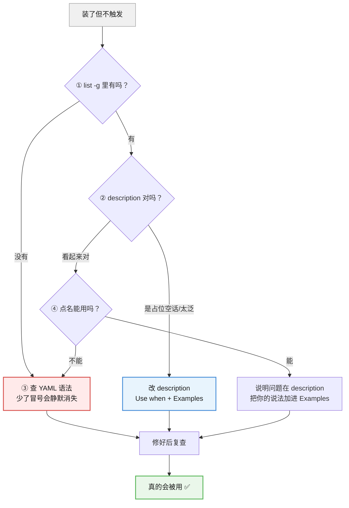
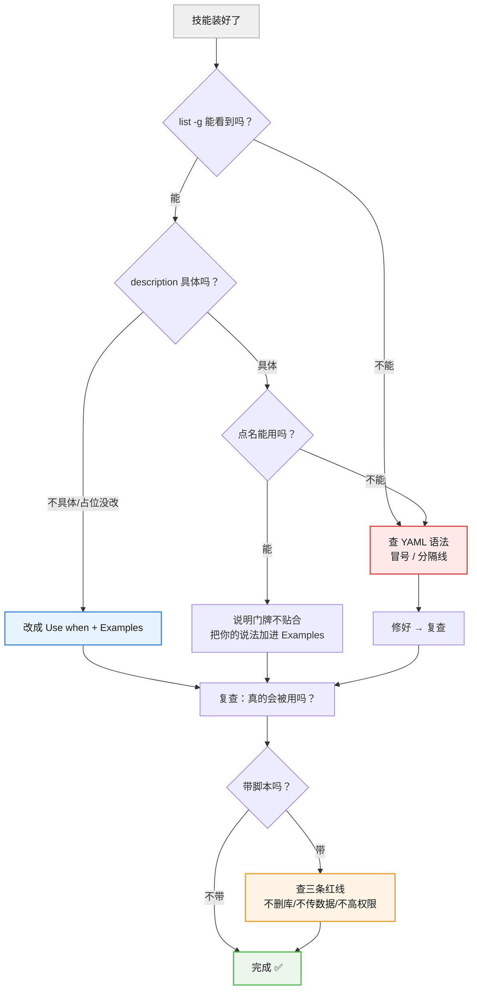

# 课 6 · 写好、排障与安全

> 所属阶段：阶段 3《会写 Skill》｜ 水平：零基础 ｜ 本课知识点：五种坏味道、不触发的四步排查、脚本类技能的安全边界
> 故事情节：主角写完了第一个技能，却发现"AI 根本没用它"。这一课解决从"写了"到"真的会被用"之间的落差。

## 本课目标

学完这课，你能**判断一个技能写得好不好**、**排查"装了但不触发"**，以及**识别脚本类技能的风险**。

## 本课在故事主线中的情节定位

课 5，你写出了第一个技能。

然后你发现一件诡异的事：**文件在、位置对、`list` 里也能看到它，但 AI 就是不用。**

这一课解决的就是这个落差——**从"写了"到"真的会被用"**。

> 🎬 **场景**：你把 `report-final-check` 装好了，兴冲冲跟 AI 说"检查一下这份报告"。AI 回了一通通用建议，**完全没提你的三条规矩**。你打开列表一看——技能**明明在那儿**。

---

## 第一幕：起源与场景引入

### "装了"和"会被用"是两件事

这是本课要建立的第一个认知：

| 状态 | 表现 | 谁来判定 |
|------|------|---------|
| **装上了** | `npx skills list -g` 里能看到它 | 工具（扫描文件） |
| **会被用** | 你说一句话，AI 真的按你的规矩来 | AI（读 description 判断） |

**装上了 ≠ 会被用。**

中间隔着一个东西：**AI 要不要"进门"**——回到课 2 学过的门牌原理，AI 扫到你的技能时**只看 description**。**门牌写得像空话，AI 就路过不进。**

### 我实测到的一个诡异现象

课上我建了个测试技能，故意把 `description` 留成官方模板的占位空话：

```yaml
description: A brief description of what this skill does
```

然后跑 `npx skills list -g`——**它照样出现在列表里**。

```
smells-demo-name         ~\.claude\skills\smell-mismatch-demo         Agents: Claude Code
```

**看明白了吗？** 一个 description 完全是空话的技能，**照样能"装上"、照样出现在列表里**。

但它**永远不会被触发**——因为 AI 扫门牌时看到一句废话，不知道该不该进。

> 💡 这就是为什么"装了但不触发"这么难查：**列表不会告诉你它有问题**。列表只管"文件在不在"，不管"门牌写没写对"。

### 本课要交付什么

1. **五种坏味道**（知识点 1）——怎么判断一个技能写得好不好
2. **不触发的四步排查**（知识点 2）——装了不用，按什么顺序查
3. **脚本类技能的安全边界**（知识点 3）——技能里的脚本 AI 会真的跑

---

## 第二幕：认知冲突

### 反直觉一：技能"看起来没问题"，不代表能触发

新手的判断逻辑通常是：

> 文件在 ✓ → 列表里有 ✓ → **那应该能用吧？**

**错。** 列表里有，只能证明**文件被扫描到了**，不能证明**门牌写对了**。

这两件事由**完全不同的机制**决定：

| 检查项 | 谁负责 | 失败时表现 |
|--------|--------|-----------|
| 文件在不在、YAML 对不对 | **工具扫描** | **列表里直接没有**（课 5 的"静默失效"） |
| description 写没写对 | **AI 判断** | **列表里有，但 AI 从不理它** |

> ⚠️ **所以要分两步查**：先确认它在列表里（工具层），再确认它会被触发（AI 层）。**本课的四步排查就是按这个顺序来的。**

### 反直觉二：`name` 和文件夹名不一致，**不是**不触发的原因

很多教程（包括本课最初的大纲）会告诉你：

> "排查第二步：检查 `name` 与文件夹名是否完全一致。"

**我实测发现：这不是原因。**

课上我做了三步对照实验（第四幕会带你完整复现）：

| 实验 | 只改了什么 | 结果 |
|------|-----------|------|
| 步骤 3 | 无 BOM + `name` 与目录名一致 | ✅ 在列表里 |
| 步骤 4 | 无 BOM + **`name` 改成完全不相干的值** | ✅ **照样在列表里**（显示的是 `name`） |
| 步骤 5 | **文件写成带 BOM 的** | ❌ **凭空消失，不报错** |

**看清楚因果**：`name` 乱写**不影响识别**；真正让技能消失的是**文件格式问题**（BOM / YAML 语法错误）。

**所以大纲里那条"必须完全一致"是错的。** 不一致的实际后果是**你自己会混乱**（文件夹叫 A、列表显示 B，以后想删它找不到），而不是"AI 认不出来"。

> 💡 **真正会让技能消失的是 YAML 语法错误和文件编码问题**（课 5 实测：`name` 少个冒号 → 静默消失；本课实测：**BOM** → 静默消失）。**这才是排查时该盯的地方。**

### 反直觉三：技能里的脚本，AI 会**真的执行**

到课 5 为止，我们写的技能都是"**文字指令**"——告诉 AI 该怎么做。

但技能还可以带**脚本文件**，而脚本是**会被真实运行的代码**。

这意味着：

> 一个技能可以做**任何你的账号权限允许做的事**——删文件、发请求、装软件。

**技能不是文档，是"AI 会照做的操作手册"**，如果手册里写了"运行 `rm -rf`"，AI 就真的会去问你要不要运行。

> ⚠️ 这就是为什么课 4 讲过"技能是纯文本，杀毒软件不拦它"——**它不靠漏洞，靠的是你主动授权**。

---

## 第三幕：层层揭示

### 知识点 1：五种坏味道

> 本知识点关键点：太泛、太长、无反例、自相矛盾、该拆不拆

#### 一句话定义

"坏味道"是**一眼就能看出技能写得不好的五个信号**：太泛、太长、无反例、自相矛盾、该拆不拆——闻到任何一种，技能都会变得难用或干脆不触发。

#### 直觉建立（类比）

想象你给新人一份手册，出现下面任何一种情况，新人都干不好活：

| 坏味道 | 手册的样子 |
|--------|-----------|
| 太泛 | "好好做"——等于没说 |
| 太长 | 写了 300 页，新人找不到重点 |
| 无反例 | 只说该做什么，新人不知道哪些是坑 |
| 自相矛盾 | 第 3 页说"要详细"，第 20 页说"要简洁" |
| 该拆不拆 | 一份手册塞了"做饭+修车+报税"三件事 |

**技能也一样**——它本质上就是给 AI 的手册。

#### 核心原理

**坏味道 1：太泛**（最致命）

`description` 写了，但说了等于没说。

| ❌ 太泛 | ✅ 具体 |
|---------|--------|
| `description: 帮我检查报告` | `description: "Use when checking a report before delivery. Examples: \"check this report\""` |
| `description: A brief description...`（**模板占位没改**） | 同左 |
| `description: 处理文档相关的事` | `description: "Use when formatting references per GB/T 7714..."` |

**怎么判断太泛？** 问一句：**"看到这句话，AI 能知道什么情况该用吗？"** 不能，就是太泛。

**这是五坏味道里最致命的**——因为它直接导致**不触发**（其余四个是"触发了但做得不好"）。

**坏味道 2：太长**

正文塞了太多东西，AI 抓不住重点。

**参考标准**（本机 7 个真实技能的实测数据）：

| 技能 | 行数 |
|------|------|
| gitnexus-pr-review | 122 行 |
| gitnexus-refactoring | 92 行 |
| gitnexus-impact-analysis | 73 行 |
| gitnexus-debugging | 67 行 |
| gitnexus-exploring | 61 行 |
| gitnexus-cli | 57 行 |
| gitnexus-guide | 48 行 |

**大多数在 50–120 行之间。** 如果你的技能超过 200 行，就该考虑拆了（课 7 会讲怎么拆）。

> 💡 为什么不能太长？回到课 2 的**注意力预算**：技能内容会占用 AI 的"工作记忆"，太长会挤掉别的信息，AI 反而抓不住重点。

**坏味道 3：无反例**

只说"该做什么"，没说"不该做什么"。

**后果**：AI 会重复你已经踩过的坑。比如你没写"❌ 不要只说格式有问题而不指出位置"，AI 就真的会这么干。

**标准**：**至少 3 条具体的反例**（课 5 六段式要求过）。

**坏味道 4：自相矛盾**

前后要求打架。比如：

- 步骤里写"逐条详细检查"，标准里写"简洁输出"
- 反例里写"不要修改内容"，边界里又写"发现问题直接改掉"

**后果**：AI 会**随机挑一个执行**，你永远不知道它会按哪条来。

**怎么自查**：把技能当作整体读一遍，问"如果我完全照做，会不会有两处要求冲突？"

**坏味道 5：该拆不拆**

一个技能塞了三件事。

| ❌ 该拆不拆 | ✅ 拆开 |
|------------|--------|
| "处理文档"（格式+语言+数据） | 各写一个，或限定成一个明确流程 |
| "帮我写代码"（风格+测试+文档） | 拆成三个 |

**判断标准**（课 5 讲过）：名字能不能用**一个动词 + 一个明确对象**说清楚？不能，就该拆。

#### 示例演示

**一份"五种坏味道齐全"的反面教材**：

```markdown
---
name: doc-helper
description: 帮我处理文档
---

# 文档助手

处理各种文档相关的事情。

## 步骤
（此处省略 300 行，涵盖格式、语言、数据、排版、引用……）

## 标准
- 要详细检查每一个细节
- 输出要简洁
```

**逐条对照**：

| 坏味道 | 这份教材的表现 |
|--------|--------------|
| **1. 太泛** | `description: 帮我处理文档` —— AI 完全不知道什么情况用 |
| **2. 太长** | 300 行，远超 50–120 行的常见区间 |
| **3. 无反例** | 一条"❌ 不要…"都没有 |
| **4. 自相矛盾** | "详细检查每个细节" vs "输出要简洁" |
| **5. 该拆不拆** | 格式+语言+数据+排版+引用 五件事塞一起 |

**这份技能的结果**：大概率**根本不触发**（坏味道 1），就算触发了也做不好（坏味道 2–5）。

#### 常见误区

1. **"五种坏味道里，'太长'最严重"**：**错，'太泛'最严重**。太长是"做得不好"，太泛是"**根本不触发**"——不触发的话，后面四个都无从谈起。
2. **"description 写成一句话就行，不用太长"**：**关键不是长短，是有没有"场景"和"例子"**。课 5 那个真实样本（231 字符）写得很好，因为它列了用户会怎么说。
3. **"技能写得越详细越好"**：不是。本机实测的技能**大多 50–120 行**。太长会挤占注意力预算。
4. **"反例可有可无"**：**最常被省、也最不该省**（课 5 强调过）。没反例，AI 就会踩你踩过的坑。
5. **"自相矛盾一眼就能看出来"**：**在长文档里看不出来**。所以要专门读一遍整体来查，而不是写完就交。
6. **"技能数量少比较整齐，能合并就合并"**：错。**一个技能一件事**，该拆就拆。

#### 一句话记住

五坏味道：**太泛（最致命→不触发）/ 太长 / 无反例 / 自相矛盾 / 该拆不拆**；闻到"太泛"先改 description，其余四个影响的是"做得好不好"。

---

### 知识点 2：不触发的四步排查

> 本知识点关键点：先确认在列表、再查 description、查 YAML、主动调用

#### 一句话定义

"装了但不触发"按**从工具层到 AI 层**的顺序查四步：**① 它在列表里吗 → ② description 写对了吗 → ③ YAML 语法对吗 → ④ 能不能主动调用**。

#### 直觉建立（类比）

这就像"给朋友寄了快递，对方说没收到"：

| 排查 | 对应快递 |
|------|---------|
| ① 在列表里吗 | **快递单号存在吗**（发出去了没） |
| ② description 对吗 | **地址写对了吗**（能送到门口吗） |
| ③ YAML 对吗 | **包裹本身有问题吗**（破损被退回） |
| ④ 主动调用 | **直接打电话问**（绕过地址判断） |

**顺序很重要**：先确认"发出去了"，再查"地址对不对"。**跳步会查错方向。**

#### 核心原理

**第一步：先确认它在列表里（工具层）**

```powershell
npx skills list -g
```

| 结果 | 说明 | 下一步 |
|------|------|--------|
| **列表里没有** | 工具层就没认出来 | → **跳到第三步**（查 YAML） |
| **列表里有** | 文件没问题，是 AI 没"进门" | → **第二步** |

> ⚠️ **这一步必须先做**。列表里没有，就说明问题在文件/YAML，改 description 毫无意义。

**第二步：description 写对了吗（最常见的原因）**

对照下面三项自查：

| 自查项 | 不合格的样子 | 合格的样子 |
|--------|-------------|-----------|
| 是不是模板占位没改？ | `A brief description of what this skill does` | 具体的场景描述 |
| 有没有说"什么场景用"？ | `帮我检查报告` | `Use when checking a report before delivery` |
| 有没有举"用户会怎么说"的例子？ | 没有 | `Examples: "check this report"` |

> 💡 **这一步能解决大部分"装了不触发"**。课上实测：一个 description 是占位空话的技能**照样出现在列表里**——所以列表正常不代表 description 没问题。

**第三步：YAML 语法 / 文件编码对吗（会"静默消失"）**

课 5 和本课都实测过的坑：**一点点格式错误，技能整个消失且不报错**。

常见错误：

| ❌ 错误 | 为什么 | ✅ 正确 |
|---------|--------|--------|
| `name report-final-check`（**少冒号**） | YAML 解析失败 | `name: report-final-check` |
| **文件带 BOM**（`Set-Content -Encoding UTF8`） | **解析器看不懂开头三个隐藏字节** | 用无 BOM 写法（见第四幕步骤 2） |
| `description: Use when: checking...`（**冒号后再冒号**） | YAML 解析失败 | `description: "Use when checking..."`（**加引号**） |
| 开头/结尾少 `---` 分隔线 | 认不出 frontmatter 区块 | 三行 `---` 齐全 |

> ⚠️ **BOM 这一条是 Windows 上最隐蔽的坑**：文件**肉眼看完全正常**，内容一个字没错，但技能就是消失。**本课第四幕步骤 5 会带你亲眼复现。**

> ⚠️ 关于 `name` 与文件夹名：**实测不一致也能识别**（列表按 `name` 显示），**不是不触发的原因**。不一致的后果是**你自己找它时会混乱**，建议保持一致，但**排查时别在这儿浪费时间**。

**第四步：能不能主动调用（绕过判断）**

如果前三步都过了还是不触发，试试**直接点名**：在对话里明确说"用 `你的技能名` 来做这件事"。

| 结果 | 说明 |
|------|------|
| **点名就能用** | 说明技能是好的，只是 **description 还不够贴合你的说法** → 回去把你的说法加进 Examples |
| **点名也不行** | 技能本身有问题，回到第三步细查 |

> 💡 **第四步的真正价值是"定位"**：点名能用，就证明**问题 100% 在 description**——这就把排查范围缩小到一处了。

#### 示例演示

一次完整的四步排查：

```
现象：说了"检查一下这份报告"，AI 完全没用我的技能。

第 ① 步：npx skills list -g
   → 列表里有 report-final-check
   → 文件层没问题，进第 ② 步

第 ② 步：看 description
   → 发现是 "A brief description of what this skill does"
   → 找到了！官方模板的占位文字没改
   → 改成 "Use when checking a report... Examples: ..."

第 ③ 步：（如果第①步列表里没有才查）
   → 检查 name/description 有没有少冒号
   → 检查 --- 分隔线是否齐全

第 ④ 步：（如果改完还不触发）
   → 对话里点名："用 report-final-check 检查这份报告"
   → 能用 → 说明 description 还要再贴合你的说法
   → 不能用 → 技能本身有问题
```

**排查口诀**：**先在不在（列表）→ 再对不对（description）→ 语法有没有坏（YAML）→ 最后点个名（主动调用）。**

#### 常见误区

1. **"不触发就先改 description"**：**跳步了**。先跑 `list -g` 确认它在不在——**不在的话，改 description 完全没用**。
2. **"列表里有 = 没问题"**：**错**。实测证明 description 是空话的技能**照样在列表里**。列表只管文件在不在。
3. **"name 必须和文件夹名完全一致，不一致就不触发"**：**已被实测证伪**。不一致照样识别。**别在这儿浪费时间**，真正会让它消失的是 YAML 语法错误。
4. **"YAML 写错会有红色报错"**：**不会**。课 5 实测：**静默消失，不报任何错**。所以必须自己跑 `list -g` 确认。
5. **"主动调用成功了就完事了"**：**不是**。点名能用恰恰说明 **description 还不够贴合你的说法**——把那句话加进 Examples 才算修好。
6. **"四步要按顺序"**：**是的**。这个顺序是"从工具层到 AI 层"，跳步会查错方向。

#### 一句话记住

**先在不在（list）→ 再对不对（description）→ 语法有没有坏（YAML，会静默消失）→ 最后点个名（点名能用＝问题在 description）**。

---

### 知识点 3：脚本类技能的安全边界

> 本知识点关键点：能执行≠该执行、三条红线、删了是否干净

#### 一句话定义

技能里的**脚本会被 AI 真实运行**，所以要守住三条红线（**不删库 / 不传数据 / 不需要时不高权限**），并且删除时**用 `remove` 而不是手动删**。

#### 直觉建立（类比）

到课 5 为止，你写的技能是**"给 AI 的手册"**——AI 读了照着做，动作还是 AI 自己做的。

**带脚本的技能不一样**：它像是**给 AI 一把工具**。AI 不只是读手册，它会**真的拿起工具干活**。

| 类型 | 包含什么 | AI 会做什么 |
|------|---------|------------|
| **纯指令技能** | 只有 `SKILL.md` 文字 | 读文字，自己执行 |
| **带脚本技能** | `SKILL.md` + `scripts/*.py` 等 | **真实运行脚本文件** |

> 💡 课 1 讲过"技能就是个文件夹"——**那个文件夹里除了文字，还可以放脚本**。放了的，就会被运行。

**这里的风险是**：你把工具递出去的时候，**不一定知道 AI 会拿它做什么**。

#### 核心原理

**能执行 ≠ 该执行**

一个脚本技能可以做**任何你账号权限允许的事**：

- 删文件、删目录
- 访问网络、上传数据
- 安装软件、修改系统配置

**关键认知**：这些操作**不需要什么高深技术**——脚本就是普通代码，AI 有权限就能跑。

> ⚠️ 回顾课 4 的安全原则：**技能是纯文本，杀毒软件不拦它**。它不靠漏洞，**靠的是你主动授权**。所以判断权在你手上。

**三条红线**

拿到一个带脚本的技能，**先检查它有没有碰这三条**：

| # | 红线 | 具体表现（看到就警惕） | 为什么危险 |
|---|------|---------------------|-----------|
| 1 | **不删库** | `rm -rf`、`del /f /s`、`Remove-Item -Recurse -Force` | **不可逆**，删了就没了 |
| 2 | **不传数据** | `curl -d`、`Invoke-WebRequest -Method POST`、往陌生域名发东西 | **你的文件可能外泄** |
| 3 | **不需要时不高权限** | `sudo`、要求管理员运行、改系统目录 | 影响范围超出这个技能本身 |

**怎么检查？** 技能是个文件夹，**打开它的脚本文件搜关键词**：

```powershell
# 在技能目录里搜危险操作（以 gitnexus-cli 为例，这是个安全示范）
Select-String -Path "$env:USERPROFILE\.claude\skills\*\scripts\*" -Pattern "rm -rf|sudo|curl -d|Invoke-WebRequest -Method POST" -ErrorAction SilentlyContinue
```

**没输出 = 没发现危险操作**（本机实测：7 个 gitnexus 系列技能**均无匹配**，可以放心）。

> ⚠️ **搜不到不代表绝对安全**——脚本可能变形写法。但这一招能过滤掉绝大多数明目张胆的危险操作。

**"能执行 ≠ 该执行" 的另一面**：就算脚本安全，也要问一句——**这个操作有必要让 AI 做吗？** 比如一个"整理文件"的技能要删重复文件：**能执行，但你可能不该让它直接删**，而应该先让它列出来给你看。

**删了就干净了吗：手动删 vs `remove`**

这是最容易被忽略的一点。

| 方式 | 做了什么 | 风险 |
|------|---------|------|
| **手动删文件夹** | 只删了 `.claude\skills\你的技能` | **可能删不干净**——装的时候可能往多个 agent 目录写了副本 |
| **`npx skills remove`** | 官方卸载，**会清理所有相关位置** | 干净 |

**实测证据**：我用 `remove` 删一个手动放进去的技能：

```
Found 66 unique installed skill(s)
Removal process complete
Successfully removed 1 skill(s)
Done!
```

删完检查：目录**确实没了**。

**注意第一行**：`Found 66 unique installed skill(s)`——**而 `list -g` 只显示 7 个**。

> 💡 **这说明：技能装完后，可能散落在多个位置/多个 agent 目录下，数量远超你在列表里看到的。** 手动删一个文件夹，很可能只是删了其中一处。

**正确做法**：

```powershell
npx skills remove 你的技能名 -g -y
```

- `-g`：全局范围
- `-y`：跳过确认提示

> ⚠️ **"你的技能名"指的是文件夹名，不是 `name`**。实测：技能 `name` 是 `totally-unrelated-name`、文件夹叫 `smell-demo`，用 `remove totally-unrelated-name` 会报 `No matching skills found`，**必须用 `remove smell-demo`**。
>
> **这恰好印证了前面的建议**：`name` 和文件夹名**保持一致**，否则列表显示 A、删除要用 B，你自己会混乱。

> ⚠️ **别用 `npx skills remove --all`**——那是**删除所有技能**（`--all` = `--skill '*' --agent '*' -y`）。**只删一个就写名字。**

#### 示例演示

**拿到一个陌生脚本技能，完整的检查流程**：

```
第 1 步：看看它有没有脚本文件
   → 打开技能文件夹，看有没有 scripts\ 目录
   → 没有 → 纯指令技能，风险低
   → 有 → 继续第 2 步

第 2 步：搜三条红线的关键词
   → rm -rf / sudo / curl -d / POST 上传
   → 有命中 → 别装（或先看懂它在干什么）

第 3 步：问一句"有必要让 AI 做吗"
   → 能执行 ≠ 该执行
   → 删除类操作，优先让它"先列出来给你看"

第 4 步：（要删的时候）用 remove，不要手动删
   → npx skills remove 技能名 -g -y
   → 别用 --all
```

#### 常见误区

1. **"技能只是文字，不会真跑代码"**：**错**。带 `scripts\` 的技能**会真实运行脚本**。纯指令技能才是"只有文字"。
2. **"装了没反应 = 没执行 = 安全"**：**错**。"没反应"可能只是**没触发**（知识点 2）。**风险取决于内容，不取决于你有没有看到反应。**
3. **"搜不到危险关键词就绝对安全"**：**不绝对**。脚本可能用变形写法。但这一招能过滤掉**绝大多数明目张胆**的危险操作。
4. **"手动删掉文件夹就干净了"**：**可能不干净**。实测 `remove` 扫描到 **66 个**已装技能，而 `list -g` 只显示 7 个——**技能可能散落在多处**，手动只删了一处。
5. **"`remove --all` 是删全部，很方便"**：**危险**。`--all` = 删所有技能 + 所有 agent。**只删一个就写技能名。**
6. **"官方/热门技能就一定安全"**：**不能这么假设**。检查的是**脚本内容**，不是作者名气。

#### 一句话记住

脚本技能**会真实运行**：**不删库 / 不传数据 / 不需要时不高权限**；**能执行 ≠ 该执行**；删除用 `npx skills remove 技能名 -g -y`，**别手动删、别用 `--all`**。

---

## 第四幕：实操验证

这一课**全程只读 + 可清理**——你会建一个临时技能做排查演练，最后删掉它。

> ⚠️ **重要**：本课所有操作都在**新建的临时目录**里做，最后会清理干净，**不会影响你已有的技能**。

### 步骤 1：先看看你现在的技能列表

```powershell
npx skills list -g
```

**预期输出**（本机实测，节选）：

```
Found 7 global skill(s)

Skill                            Source                              Agents
────────────────────────────────────────────────────────────────────────────
gitnexus-cli                     ~\.claude\skills\gitnexus-cli        Agents: Claude Code
gitnexus-guide                   ~\.claude\skills\gitnexus-guide      Agents: Claude Code
gitnexus-exploring               ~\.claude\skills\gitnexus-exploring  Agents: Claude Code
gitnexus-debugging               ~\.claude\skills\gitnexus-debugging  Agents: Claude Code
gitnexus-impact-analysis         ~\.claude\skills\gitnexus-impact-analysis  Agents: Claude Code
gitnexus-refactoring             ~\.claude\skills\gitnexus-refactoring      Agents: Claude Code
gitnexus-pr-review               ~\.claude\skills\gitnexus-pr-review        Agents: Claude Code
```

> 💡 **你的列表会不一样**——技能数量取决于你装过什么。关键是**记住这个列表长什么样**，后面要对比。

### 步骤 2：建一个"坏味道齐全"的临时技能

> ⚠️ **这一步有个大坑，先说清楚**：PowerShell 的 `Set-Content -Encoding UTF8` 会在文件开头加一个**看不见的 BOM 标记**（三个字节 `EF BB BF`）。**YAML 解析器遇到它就会失败，技能会静默消失**（下面步骤 5 会复现）。
>
> 所以这里刻意用**不带 BOM** 的写法：

```powershell
$d = "$env:USERPROFILE\.claude\skills\smell-demo"
New-Item -ItemType Directory $d -Force | Out-Null

# 注意：用 UTF8Encoding($false) 写，不带 BOM
$text = @"
---
name: smell-demo
description: A brief description of what this skill does
---

# 文档助手

处理各种文档相关的事情。
"@
[System.IO.File]::WriteAllText("$d\SKILL.md", $text, [System.Text.UTF8Encoding]::new($false))
```

**确认文件写好了**：

```powershell
Get-Content "$d\SKILL.md"
```

**预期输出**（本机实测）：

```
---
name: smell-demo
description: A brief description of what this skill does
---

# 文档助手

处理各种文档相关的事情。
```

### 步骤 3：验证反直觉一——"坏技能照样在列表里"

```powershell
npx skills list -g
```

**预期输出**（本机实测，节选）：

```
smell-demo                       ~\.claude\skills\smell-demo          Agents: Claude Code
```

**关键观察**：

- 这个技能的 `description` 是**官方模板的占位空话**
- 正文只有一句话，**毫无用处**
- **但它照样出现在列表里**

> 💡 **这就是"装了 ≠ 会被用"的铁证**：列表只管文件在不在，**不管门牌写没写对**。

### 步骤 4：验证反直觉二——`name` 不一致照样识别

把 `name` 改成一个和文件夹名完全不相干的值（**仍然用无 BOM 写法**）：

```powershell
$d = "$env:USERPROFILE\.claude\skills\smell-demo"
$text = @"
---
name: totally-unrelated-name
description: A brief description of what this skill does
---

# 文档助手

处理各种文档相关的事情。
"@
[System.IO.File]::WriteAllText("$d\SKILL.md", $text, [System.Text.UTF8Encoding]::new($false))

npx skills list -g
```

**预期输出**（本机实测，节选）：

```
totally-unrelated-name           ~\.claude\skills\smell-demo          Agents: Claude Code
```

**关键观察**：

- 文件夹叫 `smell-demo`，`name` 叫 `totally-unrelated-name`
- **照样识别**，而且**列表显示的是 `name`**（左边那列）

> ⚠️ **所以"name 必须和文件夹名一致"是错的排查方向。** 不一致的后果只是**你自己找它会混乱**，不影响识别。

### 步骤 5：验证"看不见的字符也能让技能消失"（本课最反直觉）

前面两步都是**无 BOM** 写法，技能都在。现在做个"**只改一个看不见的东西**"的实验：**把文件写成带 BOM 的**。

```powershell
$d = "$env:USERPROFILE\.claude\skills\smell-demo"
$text = @"
---
name: totally-unrelated-name
description: A brief description of what this skill does
---

# 文档助手

处理各种文档相关的事情。
"@

# 这次用 $true —— 写出带 BOM 的 UTF-8
[System.IO.File]::WriteAllText("$d\SKILL.md", $text, [System.Text.UTF8Encoding]::new($true))

# 确认 BOM 确实写进去了（前 3 字节应为 239 187 191）
[System.IO.File]::ReadAllBytes("$d\SKILL.md")[0..2]

npx skills list -g
```

**预期输出**（本机实测）：

```
239
187
191
```

然后 **`npx skills list -g` 里找不到 `totally-unrelated-name` 了**——**而且没有任何报错**。

**关键观察**：

- 文件内容**一个字都没变**，肉眼完全看不出差别
- 只是开头多了三个看不见的字节（`239 187 191`，即 BOM）
- **技能就凭空消失了，不报任何错**

> 💡 **对照一下三步实验**：
>
> | 步骤 | 改动 | 结果 |
> |------|------|------|
> | 步骤 3 | 无 BOM + name 一致 | ✅ 在列表里 |
> | 步骤 4 | 无 BOM + name 乱写 | ✅ **照样在**（说明 name 不是原因） |
> | 步骤 5 | **有 BOM** + 其他不变 | ❌ **凭空消失** |
>
> **所以排查时要盯的是"文件编码/YAML 能不能解析"，不是 name 和文件夹名一不一致。**

**怎么避免这个坑**（三种写法，任选其一）：

| 写法 | 是否带 BOM | 说明 |
|------|-----------|------|
| `[System.IO.File]::WriteAllText($p, $t, [Text.UTF8Encoding]::new($false))` | ✅ **不带** | **推荐**（本讲义用的就是这个） |
| `Set-Content $p -Encoding UTF8` | ❌ **带** | **PowerShell 5.1 会加 BOM，别用** |
| 用记事本 / VS Code 手动保存 | 看编辑器 | 多数现代编辑器默认无 BOM |

> ⚠️ **这也是为什么本课推荐用 `npx skills init` 创建技能**：官方工具生成的文件**不会有 BOM 问题**。手动写文件时才需要留意编码。

### 步骤 6：用 `remove` 清理干净

> ⚠️ **这里有个坑，先说清楚**：`remove` 是按照**文件夹名**匹配的，**不是** `name`。
>
> 我们这个技能 `name` 是 `totally-unrelated-name`，但文件夹叫 `smell-demo`——所以要删的是 **`smell-demo`**。如果你按列表里显示的名字去删，会看到：
>
> ```
> No matching skills found for: totally-unrelated-name
> ```
>
> **这正是"name 和文件夹名不一致会让你自己混乱"的实证**：列表显示 A，删除要用 B。
>
> 另外注意：步骤 5 之后技能因 BOM 已失效，`remove` 也找不到它。所以下面先把它改回无 BOM（让它重新"活"过来），再删除。

```powershell
$d = "$env:USERPROFILE\.claude\skills\smell-demo"

# 先改回无 BOM，让技能重新被识别
$text = @"
---
name: totally-unrelated-name
description: A brief description of what this skill does
---

# doc

x
"@
[System.IO.File]::WriteAllText("$d\SKILL.md", $text, [System.Text.UTF8Encoding]::new($false))

# 用【文件夹名】删除，不是 name
npx skills remove smell-demo -g -y
```

**预期输出**（本机实测）：

```
Found 66 unique installed skill(s)
Successfully removed 1 skill(s)

Done!
```

**确认清理干净**：

```powershell
Test-Path "$env:USERPROFILE\.claude\skills\smell-demo"
```

**预期输出**：`False`

> 💡 **注意 `Found 66 unique installed skill(s)`** —— 而步骤 1 的 `list -g` 只显示 **7 个**。
>
> **这说明技能可能散落在多处**，这就是为什么**删除要用 `remove`（它扫全部 66 个），而不是手动删一个文件夹**。

### 步骤 7：（可选）检查你现有技能有没有踩三条红线

```powershell
Select-String -Path "$env:USERPROFILE\.claude\skills\*\scripts\*" -Pattern "rm -rf|sudo|curl -d" -ErrorAction SilentlyContinue
```

**预期输出**：**没有输出**（本机实测）——说明这些技能**没有发现明显的危险操作**。

> 💡 如果你的技能里**有** `scripts\` 目录且有命中，**别急着运行**，先打开看看它在干什么。

---

## 第五幕：体系收束

### 现在你会了什么



**一句话串起来**：

> **装了 ≠ 会被用**：先在不在（list）→ 再对不对（description，**最常见原因**）→ 语法有没有坏（YAML，会**静默消失**）→ 最后点个名（能用＝问题在 description）。
>
> **写得好不好**看五坏味道：**太泛（最致命）/ 太长 / 无反例 / 自相矛盾 / 该拆不拆**。
>
> **带脚本的技能会真实运行**：守住**不删库 / 不传数据 / 不需要时不高权限**；删除用 `remove`，**别手动删、别用 `--all`**。

### 三条最容易忘的

| # | 要点 | 忘了会怎样 |
|---|------|-----------|
| 1 | **列表里有 ≠ 会被触发** | 以为装好就完事，AI 从不理它 |
| 2 | **`name` 不一致不是原因，YAML/编码问题才是** | 排查方向跑偏，浪费时间 |
| 3 | **Windows 上 `Set-Content -Encoding UTF8` 会加 BOM，技能静默消失** | 文件看着完全正常，却死活不出现 |
| 4 | **删除用 `remove`，别手动删** | 技能散落多处（实测 66 个 vs 列表 7 个），删不干净 |

> 📍 **全局定位**：阶段 3《会写 Skill》**第 2 课完成**（18/21 知识点）。你现在能判断技能好坏、能排查不触发、能识别脚本风险了。

> 🔗 **下一步**：**课 7《拆分、组合与共享》**——把大技能拆小、多个技能组合使用、以及分享给别人。

---

## 🐞 常见误区

1. **"装上了 = 会被用"**：**错**。列表只管文件在不在，**触发由 description 决定**。
2. **"列表里有就说明没问题"**：**错**。实测：description 是占位空话的技能**照样在列表里**。
3. **"name 必须和文件夹名一致，不一致就不触发"**：**已证伪**。不一致照样识别，只是你自己找它会混乱。
4. **"YAML 写错会报错"**：**不会**，是**静默消失**。必须自己跑 `list -g` 确认。
5. **"用 `Set-Content` 写文件没问题"**：**有问题**。它会加 BOM，导致技能静默消失。用无 BOM 写法，或用 `npx skills init` 生成。
5. **"用 `Set-Content` 写文件没问题"**：**有问题**。它会加 BOM，导致技能静默消失。用无 BOM 写法，或用 `npx skills init` 生成。
6. **"五种坏味道里'太长'最严重"**：**错，"太泛"最严重**——它导致不触发，其余只是做得不好。
7. **"技能只是文字，不会跑代码"**：**错**。带 `scripts\` 的**会真实运行**。
8. **"搜不到危险关键词就绝对安全"**：**不绝对**，但能过滤掉绝大多数明目张胆的危险操作。
9. **"手动删掉文件夹就干净了"**：**可能不干净**。用 `npx skills remove 技能名 -g -y`。
10. **"`remove --all` 删全部很方便"**：**危险**。只删一个就写技能名。
11. **"点名能用就完事了"**：不是。**点名能用恰恰说明 description 还不够贴合你的说法**，要把那句话加进 Examples。

## 一图总结



## 课后小测

**Q1**：你的技能在 `npx skills list -g` 里**能看到**，但 AI 从来不用它。最可能的原因是？

- A. 文件位置不对
- B. **`description` 写得太泛或是模板占位没改，AI 扫门牌时觉得"用不上"**
- C. `name` 和文件夹名不一致
- D. YAML 语法错误

<details><summary>答案与解析</summary>

**答案：B**。列表里能看到，说明**文件层没问题**（排除 A 和 D——那两个会导致列表里**根本没有**）。剩下就是 AI 层：门牌（description）写得太泛，AI 路过不进。**这是最常见的"装了不触发"原因。**

C 已被课 5、课 6 两次实测证伪——**name 与目录名不一致照样识别**，不是原因。

</details>

**Q2**：关于 `name` 与文件夹名不一致，下列说法正确的是？

- A. 会导致技能无法被识别
- B. **照样能被识别，列表按 `name` 显示；后果只是你自己找它会混乱**
- C. 工具会自动把文件夹名改成和 `name` 一致
- D. 只在 Windows 上有影响

<details><summary>答案与解析</summary>

**答案：B**。课上实测：文件夹 `smell-demo` + `name: totally-unrelated-name` → 列表照样显示，且显示的是 `name`。

**真正会让技能消失的是 YAML 语法错误**（课 5 实测：`name` 少个冒号 → 静默消失且不报错）。**排查时该盯的是语法，不是一致性。**

</details>

**Q3**：五种坏味道里，**最致命**的是哪一个？

- A. 太长
- B. **太泛**
- C. 无反例
- D. 该拆不拆

<details><summary>答案与解析</summary>

**答案：B**。因为**太泛直接导致"不触发"**——description 写得像空话，AI 根本不会进门。

其余四个（太长/无反例/自相矛盾/该拆不拆）影响的是"**触发了但做得不好**"。**不触发的话，后面四个都无从谈起。**

</details>

**Q4**：你用 `Set-Content -Encoding UTF8` 写了 `SKILL.md`，内容**一个字都没错**，`Get-Content` 看着也完全正常。但 `npx skills list -g` 里**找不到它**，也不报错。最可能的原因是？

- A. 工具会提示"语法错误第 2 行"
- B. 技能能装上，但执行时会报错
- C. **`Set-Content -Encoding UTF8` 在文件开头加了看不见的 BOM（239 187 191），导致解析失败、技能被静默跳过**
- D. `name` 和文件夹名不一致

<details><summary>答案与解析</summary>

**答案：C**。这是本课步骤 5 实测复现的坑：文件内容**肉眼完全正常**，只是开头多了三个不可见字节（BOM），YAML 解析器就读不懂了 → **技能凭空消失，且不报任何错**。

**写法对比**：`[System.IO.File]::WriteAllText($p,$t,[Text.UTF8Encoding]::new($false))` **不带 BOM（推荐）**；`Set-Content -Encoding UTF8` **带 BOM（别用）**。

A、B 都错——**不会有报错**，"静默"正是它难查的原因。D 也错：**name 与目录名不一致照样识别**（课 5、课 6 两次实测证伪）。

</details>

**Q5**：关于删除技能，下列做法**正确**的是？

- A. 手动删掉 `.claude\skills\你的技能` 文件夹即可
- B. **`npx skills remove 技能名 -g -y`**
- C. `npx skills remove --all`（删全部最干净）
- D. 删掉 `SKILL.md` 文件，保留文件夹

<details><summary>答案与解析</summary>

**答案：B**。实测 `remove` 会扫描 **66 个**已装技能位置并清理干净，而 `list -g` 只显示 7 个——**说明技能可能散落多处，手动删一个文件夹删不干净**。

C **危险**：`--all` = `--skill '*' --agent '*' -y`，是**删除所有技能**。只删一个就写技能名。

**还要注意**：`remove` 匹配的是**文件夹名**，不是 `name`。如果你的 `name` 和文件夹名不一致，要按**文件夹名**删（这也是"建议保持一致"的实际理由）。

</details>

## 🚀 下一批接力提示词

> 学完本课后，**复制下面这段文字发给 AI**，即可无缝进入下一课（无需重新描述上下文）：

```
继续学 AI Agent Skill。我的学习档案在 agent-skills-basics/00-学习档案.md，
刚学完阶段 3《会写 Skill》课 6《写好、排障与安全》（五种坏味道、不触发的四步排查、脚本类技能安全边界），
18/21 知识点。现在请讲解课 7《拆分、组合与共享》（把大技能拆小、多技能组合、分享给别人）。
```

## 🧭 课程导航

⬅️ **上一课**：[课 5 · 写第一个 SKILL.md](./lesson-05-写第一个SKILL.md.md)

➡️ **下一课**：课 7 · 拆分、组合与共享（阶段 3，本课为阶段最后一课）

📚 **返回目录**：[课程目录](../../../02-课程目录.md)
