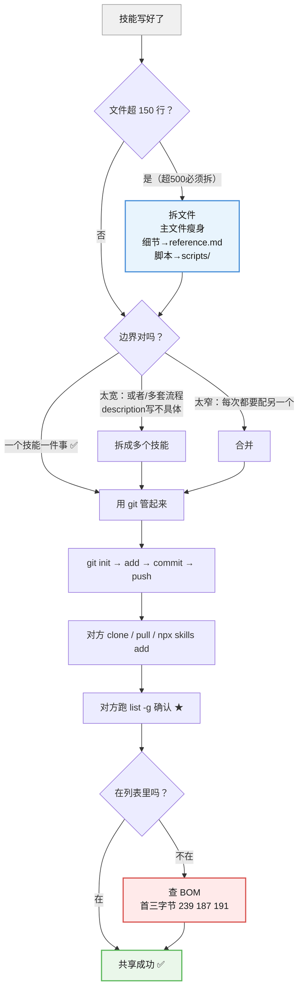
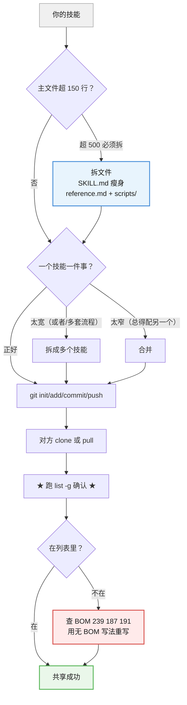

# 课 7 · 拆分、组合与共享

> 所属阶段：阶段 3《会写 Skill》｜ 水平：零基础 ｜ 本课知识点：多文件拆分、技能边界划分、团队共享与版本管理
> 故事情节：故事收束——主角的技能从"自己能用"变成"别人也能用"。

## 本课目标

学完这课，你能**把一个臃肿的技能拆成合理的多文件结构**，并**给同学/同事用上你的技能**。

## 本课在故事主线中的情节定位

课 5 你写出了第一个技能，课 6 让它真的会被用。

但还有一个问题没解决：**这个技能只有你自己能用。**

这一课是阶段 3 的收官——回答最后一问：**我做的东西，怎么流传下去？**

> 🎬 **场景**：你写的"论文格式检查"技能帮了自己大忙。室友听说了也想用，你把文件夹发给他。**结果他说："我照着做了，但 AI 还是不理它。"**
>
> 你明明在自己电脑上跑得好好的。为什么到他那儿就不行了？

这个场景会在本课最后一幕解开——而且答案正好是课 6 挖出来的那个坑。

---

## 第一幕：起源与场景引入

### 单文件技能的天花板

课 5 你写的技能是**单文件**的：一个 `SKILL.md` 装下所有内容。

我统计了本机已装的 7 个技能，**全是单文件**：

| 技能 | 文件数 | SKILL.md 行数 |
|------|-------|--------------|
| gitnexus-pr-review | 1 | 122 行 |
| gitnexus-refactoring | 1 | 92 行 |
| gitnexus-impact-analysis | 1 | 73 行 |
| gitnexus-debugging | 1 | 67 行 |
| gitnexus-exploring | 1 | 61 行 |
| gitnexus-cli | 1 | 57 行 |
| gitnexus-guide | 1 | 48 行 |

**单文件完全够用**——最长的也才 122 行，远没到需要拆的程度。

**那什么时候需要拆？** 当你想把**详细规则、参考表格、可执行脚本**都塞进去，文件开始变得又长又杂的时候。

### 这一课要交付什么

1. **多文件拆分**（知识点 1）——文件长大了怎么拆、附件怎么被读取
2. **技能边界划分**（知识点 2）——一个技能该管多大的事
3. **团队共享与版本管理**（知识点 3）——用 git 管起来、别人怎么拿到

### 先记住这三课的关系


---

## 第二幕：认知冲突

### 反直觉一：拆出去的内容，AI **不会**一开始就读

新手的担心通常是：

> "我把内容拆到 `reference.md`，AI 还会看吗？会不会就当它不存在了？"

**答案是：AI 一开始确实不读它——这正是设计目的。**

回到课 2 学过的**渐进式披露**：

| 阶段 | AI 读到什么 | 什么时候读 |
|------|-----------|-----------|
| **第 1 层** | 只读取 `SKILL.md` 的 name + description | **总是**（扫描门牌） |
| **第 2 层** | 读取 `SKILL.md` 正文 | **决定进门后** |
| **第 3 层** | 读取 `reference.md`、运行 `scripts/` | **正文里点名要它才读** |

**关键点**：附件**只在需要时才被读**。

> 💡 这就是为什么拆分能省注意力预算（课 2 讲过）：**不拆的话，所有内容每次都要占着 AI 的"工作记忆"；拆开后，只有真正用到的部分才被加载。**

**课上实测**：我建了一个带 `reference.md` 和 `scripts/check.ps1` 的多文件技能，装好后检查——**附件全都完整保留了**，技能也正常被识别。

```
multi-demo\reference.md
multi-demo\SKILL.md
multi-demo\scripts\check.ps1
```

**所以"拆分"在实践中是成立的**：附件会跟着技能一起走，不会丢。

### 反直觉二：技能不是越"全"越好

很多人写技能时想的是：

> "我把格式、语言、数据、排版全写进去，一个技能解决所有问题，多省事。"

**这恰恰是课 6 讲的"该拆不拆"坏味道。**

问题在于：**技能越"全"，description 就越难写具体**。而 description 不具体 → AI 不知道什么时候该用它 → **不触发**（课 6 知识点 1：太泛是最致命的坏味道）。

| 做法 | description | 结果 |
|------|-------------|------|
| ❌ 一个"全能文档助手" | `帮我处理文档` | AI 不知道什么情况用 → **不触发** |
| ✅ 拆成多个专项技能 | `Use when formatting references per GB/T 7714...` | 场景明确 → **该用就用** |

> 💡 **反直觉的地方**：拆得越细，**单个技能反而越容易被用上**。因为每个技能的"门牌"都能写得很具体。

### 反直觉三：技能发给别人，可能"看着正常但已经坏了"

这是本课开场那个场景的答案，也是课 6 挖出的坑的延续。

**技能本质是纯文本文件**（课 1 讲过），分享方式就是**把文件夹发出去**。但：

> **如果对方在 Windows 上用记事本另存、或用 PowerShell `Set-Content` 重写了这个文件，很可能就带上了 BOM——技能会静默失效。**

**"静默失效"的意思是**：文件看起来完全正常，内容一个字没错，但 AI **根本不理它**，而且**不报任何错**。

对方会以为"这个技能没用"，而你会以为"我发错版本了"。**两边都查不出原因。**

> ⚠️ 这个坑课 6 已经详细讲过（第四幕步骤 5 有完整复现）。本课第四幕会给出**分享场景下的专门对策**。

---

## 第三幕：层层揭示

### 知识点 1：多文件拆分

> 本知识点关键点：主文件瘦身（500 行以内）、详细资料拆到 reference.md、脚本放 scripts/、渐进式披露兑现

#### 一句话定义

多文件拆分是**把臃肿的 `SKILL.md` 拆成"主文件 + 附件"的结构**：主文件控制在 500 行以内只留核心流程，详细资料放 `reference.md`，可执行脚本放 `scripts/`，**附件只在需要时才被读取**。

#### 直觉建立（类比）

想象一本产品说明书：

| 说明书的做法 | 技能的做法 |
|-------------|-----------|
| **首页**：一页纸的快速上手 | **`SKILL.md`**：核心流程，短 |
| **附录**：完整的参数表格、疑难解答 | **`reference.md`**：详细资料，长 |
| **附赠光盘**：工具软件 | **`scripts/`**：可执行脚本 |

**你会把"快速上手"和"完整参数表"印在同一页吗？** 不会——那样没人看得下去。

**技能也一样**：主文件要短，细节放附件。

#### 核心原理

**拆成什么样**

```
你的技能/
├── SKILL.md          ← 主文件（核心流程，控制在 500 行以内）
├── reference.md      ← 详细规则、参考表格、完整示例
└── scripts/          ← 可执行脚本
    └── check.ps1
```

**三条规则**：

| 内容类型 | 放哪儿 | 为什么 |
|---------|--------|--------|
| **核心流程**（AI 每次都要照做的步骤） | `SKILL.md` | 进门就加载，必须精简 |
| **详细资料**（规则细则、参考表、长示例） | `reference.md` | 用到才读，不占常驻预算 |
| **可执行脚本**（PowerShell/Python 等） | `scripts/` | 代码和说明分开，课 6 讲过会真实运行 |

**为什么主文件要控制在 500 行以内？**

这是官方规范给出的上限。但看本机实测数据——**7 个技能最长 122 行，多数在 50–120 行**：

```
pr-review 122 / refactoring 92 / impact-analysis 73
debugging 67 / exploring 61 / cli 57 / guide 48
```

> 💡 **500 行是"硬上限"，不是"目标"。** 超过 500 行**必须**拆；但**超过 150 行就该考虑**了——因为那已经比绝大多数实际技能长了。

**怎么让 AI 去读附件？**

**关键**：在 `SKILL.md` 里**明确点名**。

```markdown
## 详细规则
完整的格式规范见 [reference.md](reference.md)。
检查前先读它。
```

| 写法 | 效果 |
|------|------|
| ❌ 附件存在但正文从不提 | AI **不会**主动去读它 |
| ✅ 正文写明"检查前先读 reference.md" | AI 在**需要时**才加载它 |

> ⚠️ **这是最容易踩的坑**：拆出去了，却忘了在主文件里点名。结果附件成了摆设。

**渐进式披露在这儿兑现**

课 2 学过"渐进式披露"这个概念，课 7 是它真正落地的地方：

| 层 | 加载什么 | 何时加载 | 占用预算 |
|----|---------|---------|---------|
| 第 1 层 | name + description | 每次扫描 | 极少 |
| 第 2 层 | `SKILL.md` 正文 | 决定启用后 | 取决于主文件长度 |
| 第 3 层 | `reference.md` / `scripts/` | **被点名时** | 用到才占 |

**不拆分的话**，所有内容都在第 2 层，**每次启用都要全加载**。拆分后，只有真正用到的才进第 3 层。

#### 示例演示

**假设你的"论文格式检查"技能膨胀到 400 行**，里面塞了：核心检查流程（60 行）、GB/T 7714 完整规则表（200 行）、各类型文献示例（140 行）。

**拆分后**：

```
paper-format-check/
├── SKILL.md          ← 只留核心流程（约 70 行）
├── reference.md      ← GB/T 7714 规则表 + 示例（约 330 行）
└── scripts/
    └── check_refs.ps1  ← 自动扫描参考文献的脚本
```

**`SKILL.md` 里要点名**：

```markdown
## 检查步骤

1. 先运行 `scripts/check_refs.ps1` 扫描全文参考文献
2. **读 [reference.md](reference.md)** 核对 GB/T 7714 细则
3. 逐条输出问题及位置
```

**对比效果**：

| | 拆分前 | 拆分后 |
|---|-------|-------|
| 每次启用加载 | 400 行全加载 | 仅 70 行 |
| 规则表 | 常驻占预算 | **只在核对时才读** |
| 脚本 | 混在正文里 | 独立可维护 |

#### 常见误区

1. **"拆出去的内容 AI 就不会看了"**：**错，只要在主文件里点名就会看**，而且是**需要时才看**——这正是拆分的目的。
2. **"拆得越碎越好"**：**错**。拆分的目的是"主文件瘦身"，不是制造一堆碎片。**核心流程必须留在主文件**。
3. **"附件不用在正文里提，AI 自己会找"**：**错，最容易踩**。附件**必须在 `SKILL.md` 里明确点名**，否则就是摆设。
4. **"500 行是我要达到的目标"**：**不是，那是硬上限**。本机 7 个技能最长 122 行，**多数 50–120 行**就够用。
5. **"脚本也可以写在 SKILL.md 里"**：技术上可以，但**放 `scripts/` 更好维护**，也符合规范。而且课 6 讲过——脚本会被真实运行，独立出来便于你审查它安不安全。
6. **"多文件技能装的时候附件会丢"**：**不会**。课上实测：`reference.md` 和 `scripts/check.ps1` **都完整保留了**。

#### 一句话记住

多文件拆分：**主文件瘦身（500 行是上限，150 行就该考虑），细节进 `reference.md`，脚本进 `scripts/`，且必须在主文件里点名附件**——渐进式披露在此兑现。

---

### 知识点 2：技能边界划分

> 本知识点关键点：一个技能一件事、太宽的信号、太窄的信号、该拆 vs 该合

#### 一句话定义

技能边界划分是**判断一个技能该管多大的事**：**一个技能一件事**；太宽（正文出现"或者""如果…则跳到另一套流程"）要拆，太窄（每次用都得配另一个技能）要合。

#### 直觉建立（类比）

想象公司里的岗位设置：

| 岗位设计 | 对应技能 |
|---------|---------|
| 一个人兼"财务+法务+行政" | **太宽**：什么都管，什么都不精 |
| 拆成三个专员 | **合理**：各管一件事 |
| 拆成"贴发票的"和"订凭证的" | **太窄**：办一件事要找两个人 |

**好的岗位划分标准**：**一件事能从头到尾由一个人完成。**

**技能也一样**：**用户的一个完整意图，能由一个技能独立完成。**

#### 核心原理

**总原则：一个技能一件事**

课 5 讲过的判断标准：**名字能不能用"一个动词 + 一个明确对象"说清楚？**

| ✅ 边界清晰 | ❌ 边界模糊 |
|------------|------------|
| `paper-format-check`（检查论文格式） | `doc-helper`（处理文档） |
| `git-commit-msg`（生成提交信息） | `code-assistant`（代码助手） |

**太宽的信号**（出现就该拆）

课 5、课 6 都提过，这里给具体信号——**打开你的 `SKILL.md`，搜这些词**：

| 信号 | 例子 | 说明 |
|------|------|------|
| **"或者"** | "如果是期刊论文，**或者**是学位论文……" | 两套流程塞一起 |
| **"如果…则跳到另一套流程"** | "如果是 A 类则走步骤 1–3，**否则跳到步骤 7**" | 典型的多技能混装 |
| **description 说不清场景** | "帮我处理文档" | 直接导致不触发（课 6） |

> 💡 **最实用的自查**：你的 description **写不出具体场景** → 十有八九是太宽了。

**太窄的信号**（出现就该合）

| 信号 | 例子 | 问题 |
|------|------|------|
| **每次用都得配另一个技能** | 用了 `A` 必须再用 `B` 才能完成 | 用户要记两个名字 |
| **单独用毫无意义** | `pdf-page-count`（只数页数） | 除非它真的是独立需求 |
| **一个意图要连开两次** | "先跑 check，再跑 report" | 应该合成一个流程 |

**该拆 vs 该合的判断表**

| 现象 | 判断 | 动作 |
|------|------|------|
| description 写不出具体场景 | **太宽** | 拆 |
| 正文出现"或者"、多套分支流程 | **太宽** | 拆 |
| 每次用都得配另一个技能 | **太窄** | 合 |
| 能用一个动词+一个对象说清 | ✅ 正好 | 不动 |
| 主文件超 500 行 | 太长（**不是边界问题**） | 用知识点 1 拆文件 |

> ⚠️ **注意最后一行**：**"文件太长"和"边界太宽"是两个不同的问题**。太长 → 拆**文件**（知识点 1）；太宽 → 拆**技能**（本知识点）。别搞混。

#### 示例演示

**案例：一个"论文助手"技能**

```markdown
---
name: paper-helper
description: 帮我校对论文
---

# 论文助手

如果是期刊论文，走 A 流程；或者如果是学位论文，走 B 流程……
另外还能检查参考文献格式、翻译摘要、生成答辩 PPT……
```

**诊断**：

| 检查项 | 发现 |
|--------|------|
| 太宽？ | ✅ **是**——"或者"、多套流程、四种功能 |
| description 具体吗？ | ❌ `帮我校对论文` ——太泛，会不触发 |
| 该拆成什么？ | 格式检查 / 摘要翻译 / 答辩 PPT |

**拆后**：

| 技能 | description（都能写具体了） |
|------|---------------------------|
| `paper-format-check` | `Use when checking a paper's formatting before submission...` |
| `abstract-translate` | `Use when translating a paper abstract to academic English...` |
| `defense-slides` | `Use when generating defense slides from a paper...` |

**对比效果**：拆之前**一个技能可能不触发**；拆之后**三个技能各司其职，都能被准确触发**。

#### 常见误区

1. **"技能越多越难管理，能合就合"**：**错**。合过头 → description 写不具体 → **不触发**（课 6 最致命的坏味道）。
2. **"太宽和太长是一回事"**：**不是**。太长拆**文件**（知识点 1，超 500 行），太宽拆**技能**（本知识点）。
3. **"只要 description 写得具体，宽一点也没关系"**：**写不出来才是症状**。太宽的技能，description **必然**写不具体——这是因果，不是巧合。
4. **"拆得越细越好"**：**过度拆分会导致"太窄"**——每次用都得配另一个技能。判断标准是**一个完整意图能否独立完成**。
5. **"边界划错了也没关系，能跑就行"**：**会有代价**。太宽 → 不触发；太窄 → 用户体验碎裂。
6. **"看一眼就知道宽不宽"**：**长文档里看不出来**。用信号词搜索（"或者"、"跳到另一套流程"）比通读更可靠。

#### 一句话记住

**一个技能一件事**：太宽（"或者"/多套流程/description 写不具体）→ **拆技能**；太窄（每次用都得配另一个）→ **合并**；文件太长（超 500 行）→ **拆文件**，别搞混。

---

### 知识点 3：团队共享与版本管理

> 本知识点关键点：用 git 管理技能、别人怎么拿到、更新了怎么同步、冲突怎么办

#### 一句话定义

团队共享是**用 git 把技能管起来并同步给别人**：技能放进 git 仓库（独立仓库或代码仓库的 `skills/` 目录），别人**克隆或拷贝**即可使用，**更新靠 `git pull`**，**冲突时手动合并**。

#### 直觉建立（类比）

技能是纯文本文件（课 1），所以它的共享和版本管理**跟管理文档完全一样**：

| 管理文档 | 管理技能 |
|---------|---------|
| 用 git 记录每次改动 | 同样用 git |
| 发给同事 = 发文件 | 发给同事 = 发文件夹 |
| 改多了想回退 = 看历史 | 同样能回退 |
| 两人同时改 = 合并冲突 | 同样会冲突 |

> 💡 **这正是"技能是纯文本"的最大好处**（课 1 讲过）：**不需要任何特殊工具，git 天生就能管。**

#### 核心原理

**第一步：用 git 管起来**

两种方式，按场景选：

| 方式 | 适用 | 结构 |
|------|------|------|
| **独立仓库** | 技能要分享给多个项目/外部 | `my-skills/` 一个仓库装多个技能 |
| **跟代码同仓库** | 技能只服务于当前项目 | 项目根目录下 `skills/你的技能/` |

**基本操作**（课上实测完整跑通）：

```powershell
# 进入技能目录
cd D:\skill-practice\multi-demo

# 初始化仓库
git init

# 把所有文件加入暂存区
git add .

# 提交（第一次提交）
git commit -m "chore: init multi-demo skill"
```

**实测输出**（本课第四幕步骤 4 的真实输出，你跑出来的会略有不同）：

```
Initialized empty Git repository in D:/skill-practice/multi-demo/.git/

[master (root-commit) 16ab1e0] chore: init multi-demo skill
 3 files changed, 13 insertions(+)
 create mode 100644 SKILL.md
 create mode 100644 reference.md
 create mode 100644 scripts/check.ps1
```

**注意 `3 files changed`**——说明**多文件技能的所有文件都会被 git 管起来**，不会漏掉附件。

> 💡 提交编号 `16ab1e0` 每次都不同，你看到的会跟我不一样，这是正常的。

**查看历史、看改动**：

```powershell
git log --oneline    # 看提交历史
git diff             # 看这次改了什么
```

**实测输出**：

```
16ab1e0 chore: init multi-demo skill

 reference.md | 2 +-
 1 file changed, 1 insertion(+), 1 deletion(-)
```

> 💡 **`git diff` 的价值**：技能改坏了想不通哪里出问题时，`git diff` **一眼就能看出这次动了什么**。这比"凭记忆回想改了啥"可靠得多。

**第二步：别人怎么拿到你的技能**

| 方式 | 操作 | 适用 |
|------|------|------|
| **A. 直接拷文件夹** | 把整个技能文件夹发给对方 | 最快，适合一对一 |
| **B. 从 git 仓库克隆** | 对方 `git clone <仓库地址>` | 团队、长期维护 |
| **C. 用 `npx skills add`** | 课 4 学过，从仓库安装 | 装别人发布的技能 |

**对方拿到后要做的**：把技能放到**他自己的 skills 目录**（课 3 讲过路径），然后**跑一次 `npx skills list -g` 确认它在列表里**。

> ⚠️ **这一步不能省！** 因为课 6 的教训：**技能可能"装着但失效"**，而失效时**不会有任何报错**——只有 `list -g` 能告诉你真相。

**第三步：更新了怎么同步**

| 角色 | 操作 |
|------|------|
| **你（改了技能）** | `git add .` → `git commit -m "说明改了什么"` → `git push` |
| **对方（要拿到更新）** | `git pull` |

**第四步：冲突怎么办**

两人同时改了同一个技能的同一处 → git 会提示 **CONFLICT**。

**处理原则**（不展开讲 git 合并的技术细节，记住三条就够）：

| 原则 | 说明 |
|------|------|
| **别慌，冲突不会丢东西** | git 会把双方内容都保留在文件里 |
| **打开看 `<<<<<<<` 标记** | 中间是两人各自的版本，手动选一个 |
| **改完再提交一次** | `git add .` → `git commit` |

> 💡 **减少冲突的实用办法**：**技能拆得越细，冲突越少**。这也是"一个技能一件事"的又一个好处——两个人改不同技能，就不会撞车。

**🔴 分享时最容易翻车的地方：BOM**

这是本课开场那个场景的答案。

**课 6 实测过**：Windows 上用 `Set-Content -Encoding UTF8` 写文件会加 **BOM**（首三字节 `239 187 191`），导致技能**静默失效**——文件看着完全正常，但 AI 根本不理它，且不报错。

**分享场景下这个坑特别容易踩**，因为对方可能会：

| 对方的动作 | 风险 |
|-----------|------|
| 用**记事本**打开另存 | 可能加 BOM |
| 用 PowerShell `Set-Content` 重写 | **会加 BOM** |
| 直接拷贝你的原文件 | ✅ 安全（不改就不会引入） |

**对策（三种，任选）**：

```powershell
# 1）检查：看首三字节是不是 239 187 191（是 = 有 BOM）
[System.IO.File]::ReadAllBytes("$env:USERPROFILE\.claude\skills\你的技能\SKILL.md")[0..2]

# 2）用无 BOM 的方式写文件（推荐）
[System.IO.File]::WriteAllText($path, $text, [System.Text.UTF8Encoding]::new($false))

# 3）最省事：让对方用 npx skills 安装，别手改
npx skills add <你的仓库地址>
```

> ⚠️ **给对方的交待**：收到技能后，**第一件事就是跑 `npx skills list -g` 看它在不在列表里**。**不在 = 已经坏了**，用上面的命令查 BOM。

**另一个 Git 提示（不会导致失效）**

`git add` 时你可能看到这个警告：

```
warning: LF will be replaced by CRLF the next time Git touches it
```

**这是 git 在说"我要统一换行符格式"，是正常提示，不是错误。**

课上我专门测过：**已装的技能带 CRLF 换行符，识别完全正常**。

> 💡 **它和 BOM 的区别**：BOM 是文件**开头多出三个字节** → **会失效**；CRLF 只是换行符风格不同 → **不影响**。别把两者混为一谈。

#### 示例演示

**完整的一次共享流程**：

```
第 1 步（你）：把技能放进 git
   cd 你的技能目录
   git init
   git add .
   git commit -m "chore: init skill"
   → 看到 "3 files changed" （多文件全被管住）

第 2 步（你）：推送到远程仓库
   git remote add origin <仓库地址>
   git push -u origin master

第 3 步（对方）：拿到技能
   方式 A：git clone <仓库地址>
   方式 B：你把文件夹发给他，他拷到自己的 skills 目录
   方式 C：npx skills add <仓库地址>

第 4 步（对方）：★ 必做 ★
   npx skills list -g
   → 确认技能在列表里
   → 不在 = 检查 BOM（课 6 的坑）

第 5 步（日后）：同步更新
   你：git add . && git commit -m "..." && git push
   对方：git pull
```

#### 常见误区

1. **"技能是特殊格式，git 管不了"**：**错**。技能是**纯文本**（课 1），git 天生就能管。实测 `3 files changed` 说明多文件也全被管住。
2. **"发给对方就完事了"**：**不够**。要让对方**跑一次 `list -g` 确认**——因为失效是**静默**的，对方不说你永远不知道。
3. **"文件换行符警告（LF/CRLF）会导致技能失效"**：**不会**。课上实测：带 CRLF 的技能**识别正常**。**会导致失效的是 BOM**（首三字节 239 187 191）。
4. **"git 冲突会丢我的改动"**：**不会**。git 会把双方内容都保留在文件里，手动选一个再提交即可。
5. **"技能必须放独立仓库"**：**不一定**。只服务当前项目的话，放项目仓库的 `skills/` 目录更方便。
6. **"用 git 太重了，我直接发文件就行"**：一对一可以，但**没有版本历史**——改坏了没法回退。团队场景还是建议用 git。

#### 一句话记住

技能是纯文本，**git 天生能管**：`git init` → `add` → `commit` → `push`，对方 `clone`/`pull`；**分享后对方必须跑 `list -g` 确认**（失效是静默的）；**真正的杀手是 BOM，不是 CRLF 换行符**。

---

## 第四幕：实操验证

这一课你会**亲手建一个多文件技能、用 git 管起来、再清理干净**。

> ⚠️ **重要**：所有操作都在 `D:\skill-practice` 这个**新建的练习目录**里做，最后会清理，**不会影响你已有的技能**。
>
> **如果只有 C 盘**，把路径改成 `C:\skill-practice` 即可，其余命令不变。

### 步骤 1：建一个多文件技能（无 BOM 写法）

> ⚠️ **沿用课 6 的教训**：用无 BOM 写法。**别用 `Set-Content -Encoding UTF8`**（会加 BOM 让技能静默消失）。

```powershell
$base = "D:\skill-practice\multi-demo"
New-Item -ItemType Directory "$base\scripts" -Force | Out-Null

$skill = @'
---
name: multi-demo
description: "Use when testing multi-file skill structure. Examples: \"test multi-file skill\""
---

# Multi-file demo

## Steps
1. Read reference.md for full details.
2. Run scripts/check.ps1 to verify.
'@
[System.IO.File]::WriteAllText("$base\SKILL.md", $skill, [System.Text.UTF8Encoding]::new($false))

[System.IO.File]::WriteAllText("$base\reference.md", "# Reference`nDetailed rules go here.`n", [System.Text.UTF8Encoding]::new($false))
[System.IO.File]::WriteAllText("$base\scripts\check.ps1", "Write-Output 'checked'`n", [System.Text.UTF8Encoding]::new($false))

Get-ChildItem $base -Recurse -File | ForEach-Object { $_.FullName }
```

**预期输出**（本机实测，节选）：

```
D:\skill-practice\multi-demo\reference.md
D:\skill-practice\multi-demo\SKILL.md
D:\skill-practice\multi-demo\scripts\check.ps1
```

### 步骤 2：确认没有 BOM（课 6 的坑）

```powershell
Get-ChildItem "D:\skill-practice\multi-demo" -Recurse -File | ForEach-Object {
    $b = [System.IO.File]::ReadAllBytes($_.FullName)[0]
    "{0}: 首字节={1}" -f $_.Name, $b
}
```

**预期输出**（本机实测）：

```
reference.md: 首字节=35
SKILL.md: 首字节=45
check.ps1: 首字节=87
```

**怎么读**：`45` 是 `-`（SKILL.md 开头的 `---`），`35` 是 `#`，`87` 是 `W`（Write-Output）。

> ✅ **都不是 239，说明无 BOM** —— 技能能正常工作。
>
> ❌ **如果看到 239** → 有 BOM，技能会静默失效（课 6 第四幕步骤 5 有完整复现）。

### 步骤 3：装进去，验证附件没丢

```powershell
$src = "D:\skill-practice\multi-demo"
$dst = "$env:USERPROFILE\.claude\skills\multi-demo"
New-Item -ItemType Directory $dst -Force | Out-Null
Copy-Item "$src\*" $dst -Recurse -Force

Get-ChildItem $dst -Recurse -File | ForEach-Object { $_.FullName.Replace("$env:USERPROFILE\.claude\skills\", "") }

npx skills list -g
```

**预期输出**（本机实测）：

```
multi-demo\reference.md
multi-demo\SKILL.md
multi-demo\scripts\check.ps1

multi-demo               ~\.claude\skills\multi-demo                  Agents: Claude Code
```

**关键观察**：

1. **三个文件都在**——`reference.md` 和 `scripts/check.ps1` **没有丢**
2. **技能被正常识别**——`multi-demo` 出现在列表里

> 💡 **这证明"多文件拆分"在实践中成立**：附件会跟着技能一起走。

### 步骤 4：用 git 管起来

```powershell
cd D:\skill-practice\multi-demo
git init
git add .
git -c user.email=demo@local -c user.name=demo commit -m "chore: init multi-demo skill"
```

**预期输出**（本机实测）：

```
Initialized empty Git repository in D:/skill-practice/multi-demo/.git/

[master (root-commit) 16ab1e0] chore: init multi-demo skill
 3 files changed, 13 insertions(+)
 create mode 100644 SKILL.md
 create mode 100644 reference.md
 create mode 100644 scripts/check.ps1
```

> 💡 **`3 files changed`** —— 三个文件**全部**被 git 管起来了，下面三行 `create mode` 一一对应，**附件不会漏掉**。
>
> **你看到的 `16ab1e0` 会和我不一样**——这是提交编号（哈希值），每次提交都不同，这是正常的。
>
> **关于 `-c user.email=... -c user.name=...`**：这是**临时**指定提交身份，**不会改动你的全局 git 配置**。如果你之前配置过 git，直接 `git commit -m "..."` 就行。

**你可能会看到这个警告**（正常）：

```
warning: LF will be replaced by CRLF the next time Git touches it
```

> ✅ **这是 git 在统一换行符格式，不是错误。** 课上实测：**带 CRLF 的技能识别完全正常**。真正会导致失效的是 **BOM**，别把两者搞混。

### 步骤 5：看历史、看改动

```powershell
git log --oneline

# 改一行再看看 diff
[System.IO.File]::WriteAllText("$PWD\reference.md", "# Reference`nDetailed rules v2 go here.`n", [System.Text.UTF8Encoding]::new($false))
git diff --stat
```

**预期输出**（本机实测）：

```
16ab1e0 chore: init multi-demo skill

 reference.md | 2 +-
 1 file changed, 1 insertion(+), 1 deletion(-)
```

> 💡 **`git diff` 的实用价值**：技能改坏了想不通哪里出问题时，**一眼看出这次动了什么**——比凭记忆回想可靠得多。

### 步骤 6：清理干净

```powershell
cd D:\
npx skills remove multi-demo -g -y
Remove-Item "D:\skill-practice\multi-demo" -Recurse -Force
```

**预期输出**（本机实测）：

```
*  Successfully removed 1 skill(s)
```

**确认环境恢复**：

```powershell
Test-Path "$env:USERPROFILE\.claude\skills\multi-demo"
Test-Path "D:\skill-practice\multi-demo"
(Get-ChildItem "$env:USERPROFILE\.claude\skills" -Directory).Count
```

**预期输出**：前两个 `False`，最后一个是你原本的技能数量（本机 7 个）。

---

## 第五幕：体系收束

### 现在你会了什么



**一句话串起来**：

> **写好了** → 文件太长**拆文件**（500 行上限）→ 边界太宽**拆技能**（一个技能一件事）→ **用 git 管起来**（技能是纯文本，git 天生能管）→ 对方 `clone`/`pull` → **对方必须跑 `list -g` 确认**（失效是静默的，杀手是 BOM）。

### 四条最容易忘的

| # | 要点 | 忘了会怎样 |
|---|------|-----------|
| 1 | **附件必须在 `SKILL.md` 里点名** | 拆了等于白拆，附件成摆设 |
| 2 | **太长拆文件、太宽拆技能** | 搞混了会拆错对象，问题没解决 |
| 3 | **分享后对方必须跑 `list -g`** | 失效是静默的，对方不说你永远不知道 |
| 4 | **BOM 会致命，CRLF 不会** | 要么被无害警告吓到，要么忽略真杀手 |

> 📍 **阶段 3 收官**：《会写 Skill》**3 课全部完成**（21/21 知识点）。**整门课程全部完结**。

> 🔗 **下一步**：三个阶段的收官项目，或者直接用接力提示词让 AI 帮你规划。

---

## 🐞 常见误区

1. **"拆出去的内容 AI 就不会看了"**：**错**，在主文件里点名就会看，而且是**需要时才看**（渐进式披露）。
2. **"附件不用提，AI 自己会找"**：**错，最容易踩**。必须在 `SKILL.md` 里明确点名。
3. **"500 行是目标"**：不是，是**硬上限**。本机 7 个技能最长 122 行，多数 50–120 行。
4. **"太宽和太长是一回事"**：不是。**太长拆文件，太宽拆技能**。
5. **"技能合起来更方便管理"**：错。合过头 → description 写不具体 → **不触发**。
6. **"技能是特殊格式，git 管不了"**：错。技能是**纯文本**，实测 `3 files changed` 全被管住。
7. **"发给对方就完事了"**：不够。对方**必须跑 `list -g` 确认**——失效是静默的。
8. **"LF/CRLF 警告会导致技能失效"**：**不会**。实测带 CRLF 的技能识别正常。**会致命的是 BOM。**
9. **"git 冲突会丢改动"**：不会。git 保留双方内容，手动选一个再提交。
10. **"技能必须放独立仓库"**：不一定。只服务当前项目的，放项目仓库 `skills/` 目录更方便。

## 一图总结



## 课后小测

**Q1**：你把详细规则拆到了 `reference.md`，但没有在 `SKILL.md` 里提到它。会怎样？

- A. AI 会自动发现并读取
- B. **AI 不会读它——附件必须在主文件里点名才会被加载**
- C. 技能会失效
- D. `reference.md` 会被自动删除

<details><summary>答案与解析</summary>

**答案：B**。这是多文件拆分**最容易踩的坑**：附件必须在 `SKILL.md` 里明确点名（如"检查前先读 reference.md"），否则 AI **不知道它存在**。

**这正是渐进式披露的设计**：第 3 层内容**只在被点名时才加载**——不点名，就永远不加载。

C 不对：附件没被点名**不会**让技能失效，只是附件成了摆设。

</details>

**Q2**：你的技能 `SKILL.md` 有 480 行，内容涵盖"检查格式 + 翻译摘要 + 生成 PPT"三件事。该怎么处理？

- A. 只拆文件：把内容拆到 `reference.md`
- B. 只拆技能：拆成三个独立技能，每个仍是单文件
- C. **两件事都要做——但先拆技能（边界太宽），再看每个是否还需要拆文件**
- D. 不用改，480 行还没超 500 行上限

<details><summary>答案与解析</summary>

**答案：C**。这里**两个问题同时存在**，但要分清先后：

1. **边界太宽**（三件事）→ **拆技能**。这是首要问题，因为太宽会导致 description 写不具体 → **不触发**（课 6 最致命的坏味道）。
2. **文件太长**（480 行，接近 500 上限）→ 拆完技能后，如果某个技能的主文件仍然很长，**再拆文件**。

**千万别搞混**：**太长拆文件，太宽拆技能**。A 只解决了长度没解决边界；B 方向对但漏了长度检查；D 错——480 行虽未超硬上限，但**边界问题才是致命的**。

</details>

**Q3**：关于 git 和技能，下列说法正确的是？

- A. 技能是特殊格式，git 管不了
- B. **技能是纯文本，git 天生就能管；多文件技能的所有文件都会被纳入管理**
- C. 用 git 管理技能必须放独立仓库
- D. git 冲突会丢失一方的改动

<details><summary>答案与解析</summary>

**答案：B**。技能本质是**纯文本文件**（课 1），git 管理起来跟管理文档没区别。课上实测提交多文件技能显示 `3 files changed`——**附件全被管住**。

C 错：只服务当前项目时，放项目仓库的 `skills/` 目录更方便。D 错：git 会把双方内容都保留在文件里（用 `<<<<<<<` 标记），手动选一个再提交即可，**不会丢**。

</details>

**Q4**：你把技能发给同事，他说"AI 根本不理它"。你让他跑 `npx skills list -g`，**列表里没有这个技能**。最可能的原因是？

- A. 技能内容写得不好
- B. **文件带 BOM（首三字节 239 187 191）——内容看着完全正常，但技能已静默失效**
- C. git 没推送成功
- D. 换行符是 CRLF

<details><summary>答案与解析</summary>

**答案：B**。课 6 实测发现：**BOM 会让技能静默消失**——文件内容**肉眼看完全正常**，一个字没错，只是开头多了三个不可见字节，AI 就不理它了，**且不报任何错**。

**D 是干扰项**：CRLF 换行符**不会**导致失效（课上实测带 CRLF 的技能识别正常）。git 那个 `LF will be replaced by CRLF` 警告是正常提示，**别把它和 BOM 搞混**。

**检查命令**：`[System.IO.File]::ReadAllBytes("路径\SKILL.md")[0..2]` → 看到 `239 187 191` 就是中招了。

</details>

**Q5**：本课讲的"渐进式披露"，在多文件技能中是怎么体现的？

- A. AI 一次性读取所有文件，但只显示主文件内容
- B. **主文件进门就加载，附件只在被点名时才读取——不用的不占注意力预算**
- C. 附件永远不会被读取，只是给人看的
- D. 只加载 description，正文和附件都不读

<details><summary>答案与解析</summary>

**答案：B**。这正是课 2 讲的"渐进式披露"在课 7 的**落地**：

| 层 | 内容 | 何时加载 |
|----|------|---------|
| 1 | name + description | 每次扫描 |
| 2 | `SKILL.md` 正文 | 决定启用后 |
| 3 | `reference.md` / `scripts/` | **被点名时** |

**这也是拆分的意义**：不拆的话，所有内容每次都要占着 AI 的工作记忆；拆开后，**只有真正用到的才被加载**。

</details>

## 🚀 下一批接力提示词

> 学完本课后，**复制下面这段文字发给 AI**，即可无缝进入收官项目（无需重新描述上下文）：

```
继续学 AI Agent Skill。我的学习档案在 agent-skills-basics/00-学习档案.md，
刚学完阶段 3《会写 Skill》课 7《拆分、组合与共享》（多文件拆分、技能边界划分、团队共享与版本管理），
21/21 知识点，整门课程全部完结。
现在请给我一个收官项目：把我自己的一个真实重复任务做成技能，
要求走完"写→测→排障→拆分→共享"完整流程，并在每一步给出验收标准。
```

## 🧭 课程导航

⬅️ **上一课**：[课 6 · 写好、排障与安全](./lesson-06-写好、排障与安全.md)

➡️ **下一课**：[07-结课实战项目](../../../07-结课实战项目.md)（把你的真实重复任务做成技能，走完整流程）

📚 **返回目录**：[课程目录](../../../02-课程目录.md)
