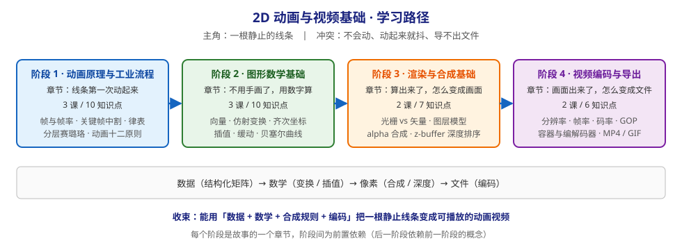

# 2D 动画与视频基础 · 学习路径总览

> 本文件是活文档，随学习进度动态调整。阶段依赖图统一用 SVG。

## 🎯 学习目标

- **目标类型**：动手实操
- **目标说明**：学完后能独立回答"一段 2D 动画在物理、生理、数学、渲染、编码五个层面分别发生了什么"，并能用 Python 把结构化数据变成可播放的视频文件；最终目标是为自研「AI 辅助 2D 动画自动化引擎」补齐领域基础，能看懂并校验需求文档里的每一个术语。

> 学习目标是全局基准，决定各阶段/课的取舍与实操比重。目标变更时更新此处，并同步调整相关课。

## 故事主线

- **主角**：一根静止的线条（就是需求文档里 AI 生成的那份矩阵数据）
- **冲突**：它不会动；就算动起来也在抖；抖完还导不出文件
- **收束**：如何用「数据 + 数学 + 合成规则 + 编码」，把一根静止线条变成一段可播放的动画视频

> 整个课程是这条故事线的展开，每个阶段是故事的一个"章节"。

## 学习路径图

## 阶段总览

### 阶段 1：动画原理与工业流程（章节：线条第一次动起来）

- **目标**：理解"动画"在生理、物理、工业流程三个层面分别是什么；能看懂并手写一个律表；能解释为什么每秒 24 帧就够用。
- **学习重点**：
  - 动画成立的前提是人的视觉特性，不是技术参数
  - 帧 / 帧率 / 时间轴是"时间被离散化"的表达
  - 传统工业用"关键帧 + 中割 + 分层"把工作量压下来
  - 十二原则是"动作好看"的经验总结，其中一部分可以算法化
- **必须掌握**：说清一拍二与一拍三的区别与取舍；看懂律表并解释每一列；说出哪几条动画原则能用缓动函数/插值路径实现
- **对应课**：课 1 眼睛是怎么被骗的、课 2 手绘工厂：关键帧、中割与律表、课 3 让动作有分量：动画十二原则

### 阶段 2：图形数学基础（章节：不用手画了，用数字算）

- **目标**：能用 3×3 矩阵描述平移 / 旋转 / 缩放并复合；能用插值与缓动函数算出任意时刻的中间状态；理解贝塞尔为什么能把锯齿折线变成平滑线条。
- **学习重点**：
  - 屏幕坐标系与数学坐标系的差异是所有"图像上下颠倒"bug 的根源
  - 齐次坐标是"用一个矩阵统一所有变换"的关键技巧
  - 变换顺序不可交换，层级变换靠矩阵连乘
  - 缓动函数与传统动画"间距"是同一件事的两种表达
- **必须掌握**：手写旋转矩阵并解释每个元素；用齐次坐标把"绕任意点旋转"拆成三步；用 lerp 与缓动函数算出第 t 帧的状态
- **对应课**：课 4 点与向量、课 5 变换的矩阵表示、课 6 插值、缓动与贝塞尔

### 阶段 3：渲染与合成基础（章节：算出来了，怎么变成画面）

- **目标**：说清矢量与光栅的差异及各自适用场景；能手算 alpha 合成结果；理解 z 值与 z-buffer 如何解决跨图层遮挡。
- **学习重点**：
  - 矢量是"数据即图形"，光栅是"像素即图形"，二者在引擎里分工不同
  - alpha 合成是一个确定的公式，不是"半透明叠加"的模糊说法
  - 深度排序把"跨图层穿帮"变成算法问题而非美术问题
  - 极端颜色标签之所以有效，是因为它是机器可判定的通道约定
- **必须掌握**：手算 over 运算符的合成结果；解释画家算法与 z-buffer 的区别及各自代价；说清极端颜色标签为什么比"让软件去猜"更可靠
- **对应课**：课 7 光栅与矢量、课 8 图层、alpha 与深度排序

### 阶段 4：视频编码与导出（章节：画面出来了，怎么变成文件）

- **目标**：能解释分辨率 / 帧率 / 码率 / GOP 的取舍关系；能用工具把帧序列导出为 MP4 与 GIF，并说明各自限制。
- **学习重点**：
  - 分辨率 × 帧率 × 码率是互相挤压的三角关系
  - 容器与编解码器不是一回事，这是最常见的概念混淆
  - 帧间压缩奖励"画面稳定"，惩罚"画面闪烁"——正好解释了需求文档为什么强调帧间一致性
  - GIF 的 256 色限制决定了它不适合线稿动画之外的内容
- **必须掌握**：给定时长与帧率算出总帧数；解释为什么闪烁画面体积暴涨；用 ffprobe 校验导出结果的帧率与帧数
- **对应课**：课 9 视频参数与压缩原理、课 10 动手导出与工具链

## 当前进度

- [ ] 阶段 1：动画原理与工业流程（未开始）
- [ ] 阶段 2：图形数学基础（未开始）
- [ ] 阶段 3：渲染与合成基础（未开始）
- [ ] 阶段 4：视频编码与导出（未开始）

> 知识点级进度以 [00-学习档案.md](./00-学习档案.md) 为准。
