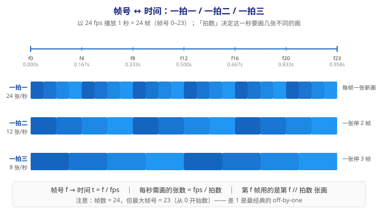
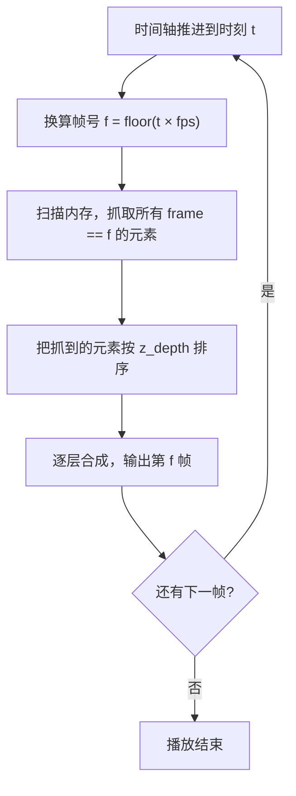
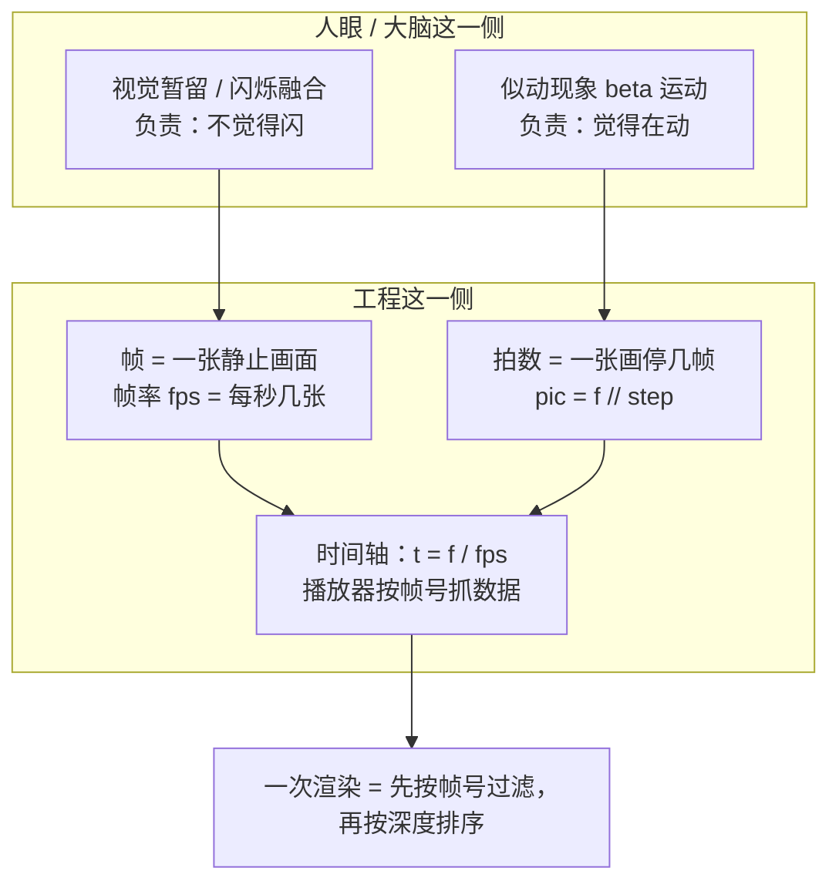

# 第 1 课：眼睛是怎么被骗的

> 所属阶段：阶段 1《动画原理与工业流程》｜ 水平：零基础
> 本课知识点：视觉暂留与似动现象、帧与帧率、时间轴与播放模型
> 故事情节：主角（一根静止的线条）遇到第一个问题——它明明是静止的，凭什么人眼会觉得它在动？

## 🎯 本课目标

- 说清动画成立依赖的视觉特性是什么，以及"动画靠视觉暂留"这个流行说法错在哪
- 给定时长与帧率算出总帧数，解释一拍一 / 一拍二 / 一拍三的取舍
- 解释帧号与时间的换算关系，说明需求文档里 `frame` 字段到底在解决什么问题

---

## 第一幕：起源与场景引入

> 🏛️ **起源**：1824 年，英国学者 Peter Mark Roget 向皇家学会提交了一篇论文，描述"透过竖直缝隙看滚动车轮"时辐条出现的错觉——这是"视觉暂留（persistence of vision）"现象最早的系统描述。此后一百多年，它被写进无数教材，当作"电影为什么会动"的标准答案。（核查于 2026-09）
>
> ⚠️ 但这个标准答案**有一半是错的**，而且这一半恰好是最关键的一半。本课第三幕会把它掰开。

**场景**：你要让 AI 生成的那根线条动起来。

最朴素的办法：让它每隔一小段时间吐一张图，把图按顺序快速播放。于是你做了两版——

- **A 版**：1 秒出 8 张。播放出来一卡一卡的，像坏的 GIF。
- **B 版**：1 秒出 60 张。顺滑了，但文件体积翻了好几倍，而且慢动作镜头里还是能看出"一顿一顿"。

你开始怀疑：**"多少张才够"这个问题，答案到底由谁说了算？**

> 🎬 **场景**：AI 每秒吐几张图才够用？——这个看似是技术参数的问题，其实要问人的眼睛和大脑。

---

## 第二幕：认知冲突

直觉上你会去查技术标准：电影 24 fps、电视 25/30 fps、游戏 60 fps。但这些数字是**结果**，不是**原因**。

真正的问题在这里：

**就算你把帧率拉到 60fps，如果相邻两张图里的小球位置差了半个屏幕，你看到的也不是"一个球飞过去"，而是"一个球在左边闪一下、又在右边闪一下"。**

反过来，如果位置只差几个像素，哪怕只有 12 fps，你也会清清楚楚地看到"它在动"。

这说明什么？说明**"不觉得卡"**和**"觉得在动"是两件不同的事**，由两套不同的机制负责。而绝大多数科普把这两件事混成了一个词：视觉暂留。

> ❓ **问题**：为什么"画面够密"（不闪）不等于"看起来在动"？决定"动"的到底是什么？

---

## 第三幕：层层揭示

### 知识点 1：视觉暂留与似动现象

> 本知识点关键点：视觉暂留 / beta 运动（似动）/ 闪烁融合频率 / 常见误解与边界

#### 一句话定义

**视觉暂留**是"光刺激停止后，视觉印象仍短暂保留"的生理现象（约 0.1–0.4 秒）；**似动现象**（apparent motion，其中与电影最相关的是 **beta 运动**）是"位置不同的静止画面先后出现时，大脑自动补出运动过程"的知觉现象。

#### 直觉建立（类比）

想象一本**翻页动画书（flipbook）**：每一页上画着一个小人，姿势略微不同。

- 你快速翻页时，不会觉得"页与页之间黑掉了"——这一半是**视觉暂留**（余晖把断口糊上了）。
- 你看到小人在跑——这一半是**似动**（每页位置差一点点，大脑自动把它们连成一段连续的运动）。

现在做一次思想实验：**把每页小人的位置差拉大**，让他从第 1 页在页面最左边，第 2 页直接跳到最右边。

你会发现：不管翻多快，你看到的都不是"一个跑得飞快的小人"，而是**两个静止的小人在交替闪现**。似动消失了。

> 💡 **类比的边界**：翻页书页与页之间是真的有"黑场"，而电影放映时靠遮光板遮住换片瞬间，观众并不会看到黑场——所以翻页书反而**低估**了大脑的补全能力：即便真有黑场，大脑照样能把运动补出来。这恰恰证明"补运动"是大脑的**主动加工**，而不是视网膜余晖的**被动残留**。

#### 核心原理

三件事分工不同，别再混为一谈：

| 机制 | 是什么 | 它解决什么问题 | 不解决什么 |
|------|--------|---------------|-----------|
| **视觉暂留** | 光刺激停止后印象保留约 0.1–0.4 秒（1824 年 Roget 描述） | 画面交替时的"断口"被糊上 | 解释不了为什么会"移动" |
| **闪烁融合**（临界闪烁频率 CFF） | 闪烁频率高过某阈值后人眼不再察觉闪烁，视为连续光 | **多少帧才"不闪"** | 与"动不动"无关 |
| **似动现象 / beta 运动** | 位置不同的画面先后出现，大脑补出中间过程 | **为什么"看起来在动"** | 位置差过大时失效 |

> ⏳ **置信度提示**：phi 现象由格式塔心理学家 Wertheimer 于 1912 年提出，而与电影/动画直接相关的是 **beta 运动**；不同教材对 phi 与 beta 的区分口径不完全一致，此处只取与工程相关的部分。（核查于 2026-09）


**这张图只想让你记住一件事**：动画是两套机制叠加的结果——**视觉暂留/闪烁融合负责"不闪"，似动负责"动"**。

所以"A 版 8 张/秒卡"和"位置差太大会闪现"，是两个**不同层面**的问题，要用不同的办法解决。

#### 示例演示

跑一遍实操脚本的对比实验（脚本见第四幕），它会生成两组各 24 帧的序列——**帧数完全相同，唯一变量是每帧小球移动多少像素**：

```text
spacing_small/  每帧移动 12px  -> 逐张看：小球平滑移动
spacing_big/    每帧移动 100px -> 逐张看：位置跳变，运动感崩塌
```

**怎么看**：用 Windows 照片应用打开 `frame_000.png`，然后按住 **→ 方向键**逐张往后翻。两个目录各翻一遍，对比感受。

> 📌 **两点说明，免得你以为程序写错了**：
> 1. 小球跑到画布右边界后会**绕回左边继续跑**（脚本里用取模实现），这是为了让 24 帧都落在可见范围内，不是 bug。
> 2. 一定要**逐张连贯地翻**，不要挑几张看——似动是大脑对"连续序列"的加工，跳着看是看不出来的。

你会直观感受到：同样是 24 帧，一组"在动"，一组"在闪"。

> 这就是似动的空间窗口：**相邻帧的位移必须落在某个范围内，大脑才会把它解释成运动**。

#### 常见误区

1. **"动画靠视觉暂留"**——流行但简化。视觉暂留/闪烁融合只解决"不闪"；让你觉得"在动"的是似动。这句话错了半个世纪，却仍在流传。
2. **"视觉暂留 0.1–0.4 秒，所以每秒十几帧就够了"**——偷换概念。余晖时长与"闪烁融合阈值"不是同一个量；实际上电影胶片 24fps 仍需靠放映机的遮光板把闪烁频率提到约 48Hz 以上，观众才不觉得闪。（⏳ 置信度：中，具体数值与机型相关）

#### 一句话记住

> **视觉暂留让你"不觉得闪"，似动让你"觉得在动"——动画是两件事叠加，不是一个原因。**

#### 延伸阅读

- [Persistence of vision · Wikipedia](https://en.wikipedia.org/wiki/Persistence_of_vision)
- [Apparent motion · Wikipedia](https://en.wikipedia.org/wiki/Apparent_motion)（beta 运动的相关讨论）
- [Flicker fusion threshold · Wikipedia](https://en.wikipedia.org/wiki/Flicker_fusion_threshold)
- [Critical Flicker Fusion Frequency: A Narrative Review](https://pmc.ncbi.nlm.nih.gov/articles/PMC8537539/)（综述，核查于 2026-09）

---

### 知识点 2：帧与帧率

> 本知识点关键点：帧即静止快照 / fps 与时长换算 / 24·30·60 的由来 / 一拍二与一拍三

#### 一句话定义

**帧（frame）**是时间被切开后的一张静止画面；**帧率（fps, frames per second）**是每秒播放多少张；**拍数**是一张画连续停留几帧。

#### 直觉建立（类比）

把一段动画想成一本 **240 页的书**，你用 2 秒翻完 → 每秒 120 页。

- 书的**页数** = 帧数（内容总量，固定不变）
- 你的**翻页速度** = 帧率（播放快慢）
- **页码** = 帧号

翻得越快越顺滑，但书还是那 240 页——**帧数不因播放快慢而改变**。这一点在写代码时极易搞混。

> 💡 **类比的边界**：书可以往回翻、可以跳读；视频帧在时间轴上单向推进，且相邻帧的时间间隔严格相等。另外书页是"翻过去就看不见了"，而视频的帧可以被随机访问（拖动进度条）。

#### 核心原理

**三个量的换算**（这是引擎里每天都要写的三行代码）：

```
帧数  N = 时长 T × 帧率 fps
帧号  f → 时刻 t = f / fps
时刻  t → 帧号 f = floor(t × fps)
```

**⚠️ off-by-one 陷阱**：N 帧的帧号是 `0 ~ N-1`，最后一帧在 `(N-1)/fps`，**不等于** T。
以 24fps 播 1 秒为例：24 帧，帧号 0–23，最后一帧在 **0.958s** 而不是 1.000s。
这个"差 1"是动画引擎里最常见的越界 bug 来源——需求文档里凡是写 `frame: 120` 的地方，都得先问清楚**是从 0 还是从 1 开始数**。

**常见帧率从哪来**（⏳ 置信度：中高；核查于 2026-09）：

| 帧率 | 常见场景 | 来历 |
|------|---------|------|
| **24** | 电影 | 无声片时代速率不统一（手摇摄影机，大致 16–24 格/秒，放映还常被放快）；1920 年代后期有声片出现后，需要**稳定且足够高**的速率保证声音不失真，同时胶片昂贵——24 格/秒成为"声音能听 + 胶片最省"的折中，沿用至今 |
| **25** | PAL / SECAM 制式地区（含中国） | 与 50Hz 电网同频，早年为避免电源干扰 |
| **29.97 / 30** | NTSC 制式地区（美日等） | 黑白电视 60Hz 场频 → 30 帧；彩电化后为避开伴音与色副载波干扰，帧率被压低千分之一，变成 29.97 |
| **60** | 游戏、高帧率视频 | 交互场景对延迟敏感，越高越跟手 |

**拍数——"画得少"才是这门手艺的核心**：

24 fps 下：

- 一拍一（每张画停 1 帧）= **24 张/秒**（全动画，成本最高）
- 一拍二（每张画停 2 帧）= **12 张/秒**
- 一拍三（每张画停 3 帧）= **8 张/秒**（日本 TV 动画最常用）

第 f 帧用的是第几张画？就一行代码：`pic = f // step`。



> ⏳ 行业 nuance：实际制作中"一拍二 / 一拍三"常被当作**表演基调**而非机械固定——同一个镜头里可能快速动作用一拍一、静止对话用一拍三。（置信度：中）

#### 示例演示

跑一次换算（这是脚本的真实输出）：

```text
帧率 24 fps，时长 1.0 秒
  -> 总帧数 = 24 帧，帧号范围 0 ~ 23
  -> 最后一帧的时间 = 0.958s（注意不等于 1.000s）
  -> t=0.5s 落在第 12 帧

一拍1：24 帧只需要 24 张画（24 张/秒） -> frames_ones/
一拍2：24 帧只需要 12 张画（12 张/秒） -> frames_twos/
一拍3：24 帧只需要 8 张画（8 张/秒）   -> frames_threes/

帧号 -> 用第几张画（一拍三）：
  f0:pic0  f1:pic0  f2:pic0  f3:pic1  f4:pic1  f5:pic1  f6:pic2  f7:pic2  f8:pic2
```

打开 `frames_ones/` 与 `frames_threes/` 逐张对比：**帧数都是 24，但前者的不同画面是后者的 3 倍。**

#### 常见误区

1. **"帧率越高越流畅"**——不一定。把一拍三画的素材用 60fps 播放，每秒仍然只有 8 个不同位置，不会更顺。**帧率管"采样密度"，内容管"信息量"，流畅度由更小的那个决定。**
2. **"24 帧就是 24 张不同的画"**——错，取决于拍数。
3. **把帧号当时间用**——30fps 与 60fps 项目混用时，同一个帧号代表不同时刻，时间轴会整体错位。

#### 一句话记住

> **帧率是"每秒采样几张"，拍数是"每张画停留几帧"；流畅度由更小的那个决定，而且帧号从 0 开始数。**

#### 延伸阅读

- [Frame rate · Wikipedia](https://en.wikipedia.org/wiki/Frame_rate)
- [NumPy 官方文档](https://numpy.org/doc/stable/)
- [Pillow 官方文档](https://pillow.readthedocs.io/en/stable/)

---

### 知识点 3：时间轴与播放模型

> 本知识点关键点：帧号 ↔ 时间换算 / 时间轴即调度表 / 掉帧与卡顿的感知 / 对应需求文档的 `frame` 字段

#### 一句话定义

**时间轴**是把"帧号"映射到"时刻"的一维坐标系；**播放模型**规定了：在任意时刻 t，系统该取哪些数据来渲染第 `f(t)` 帧。

#### 直觉建立（类比）

把播放过程想成**乐队看谱演奏**：

- 每个音符（数据）写在谱子上，**自带**"第几拍"的标记；
- 指挥（播放器）数到第几拍，所有乐器就一起演奏**标记为该拍的音符**——不管它是小提琴的还是定音鼓的；
- 指挥不负责"创造"音符，只负责"到点抓取"。

> 💡 **类比的边界**：乐谱的"拍"是相对时长（演奏速度可变），视频的帧号是**绝对索引**——播放速度变化不改变"第 120 帧是什么内容"。这一点很关键：变速播放改的是映射关系，不是数据本身。

#### 核心原理

播放模型是**两层结构**：

1. **数据层**：每个元素自带时间标记。需求文档里的写法是 `{matrix_data, z_depth, frame: 120}`。
2. **调度层**：播放器推进到第 f 帧时，从内存里抓取**所有** `frame == f` 的元素。



**这个模型和"图层"是什么关系？** 两条正交的轴：

- **横轴 = 时间轴**（帧号），管"什么时候出现"
- **纵轴/深度轴 = z_depth**，管"谁遮住谁"

**一次渲染 = 在某一帧上，把该帧所有元素按 z 排序后合成**。需求文档第七节说"到了第 120 帧，软件瞬间从内存中抓取所有标记为 frame:120 的矩阵，按 Z 轴深度排序，一次性渲染到屏幕上"——描述的正是这个模型的两次查找：**先按帧号过滤，再按深度排序**。课 8 会讲排序那一半，本课只解决"按帧号过滤"。

**掉帧与卡顿**：如果渲染一帧的耗时 > 1/fps，播放器就来不及出下一帧，只能跳过——感知上是**"卡"**（时间轴被拉长），而不是**"慢"**（动作变慢）。这是两类完全不同的故障，排障时先看是哪种。

#### 示例演示

用本课脚本里的两个函数验证映射关系：

```python
time_to_frame(0.5, 24)   # -> 12   （0.5 秒落在第 12 帧）
frame_to_time(23, 24)    # -> 0.958（最后一帧不是 1.000s）
```

再对照需求文档的调度描述，用伪代码写一遍"第 120 帧该显示什么"：

```python
def render_frame(elements, frame_index, fps):
    """elements: 形如 {'data': ..., 'z_depth': ..., 'frame': 120} 的列表"""
    # 第一步：按帧号过滤（本课知识点）
    current = [e for e in elements if e["frame"] == frame_index]
    # 第二步：按深度排序（阶段 3 课 8 的内容）
    current.sort(key=lambda e: e["z_depth"])
    # 第三步：从后往前合成（阶段 3 课 8 的内容）
    return current
```

#### 常见误区

1. **以为播放器会自动补帧**——不会。播放器只"按帧号取现成数据"，**中间帧必须由生成器或插值算法产出**。这正是需求文档第九节需要"动画插值"、第六节需要"分部位独立生成"的根本原因。
2. **用浮点数当帧号**——帧号必须是整数索引。需要"第 12.5 帧"时，正确做法是**插值出一份新数据**，而不是让播放器去取一个不存在的帧。
3. **把帧号硬编码成时间**——项目一改帧率，所有硬编码帧号的意义全变。正确做法是处处用 `t = f / fps` 换算。

#### 一句话记住

> **数据自带时间标记，播放器只做"按帧号抓数据"这一件事——中间帧谁来生成，是另一回事。**

---

## 第四幕：实操验证

### 运行方式

在 PowerShell 中（先切到课程目录）：

```powershell
cd d:\projects\learning\animation-engine\00-动画与视频基础
.\playground\.venv\Scripts\python.exe .\playground\lesson-01\frames_demo.py
```

第一次跑会看到这样的输出（脚本已在 Python 3.12.13 + numpy 2.5.2 + pillow 12.3.0 上验证通过）：

```text
帧率 24 fps，时长 1.0 秒
  -> 总帧数 = 24 帧，帧号范围 0 ~ 23
  -> 最后一帧的时间 = 0.958s（注意不等于 1.000s）
  -> t=0.5s 落在第 12 帧

一拍1：24 帧只需要 24 张画（24 张/秒） -> frames_ones/
一拍2：24 帧只需要 12 张画（12 张/秒） -> frames_twos/
一拍3：24 帧只需要 8 张画（8 张/秒） -> frames_threes/

帧号 -> 用第几张画（一拍三）：
  f0:pic0  f1:pic0  f2:pic0  f3:pic1  f4:pic1  f5:pic1  f6:pic2  f7:pic2  f8:pic2

知识点 1 对比：帧数完全相同（都是 24 帧），只改每帧位移
  spacing_small/  每帧移动 12px  -> 逐张看：小球平滑移动
  spacing_big/    每帧移动 100px -> 逐张看：位置跳变，运动感崩塌
```

### 动手改一改（建议都试一遍）

| 改什么 | 预期看到 | 对应知识点 |
|--------|---------|-----------|
| `FPS = 24` → `FPS = 8` | 总帧数变 8，一拍三只需 3 张画 | 帧率与拍数 |
| `DURATION = 1.0` → `DURATION = 2.5` | 总帧数变 60，帧号 0–59 | 帧数换算 |
| `render_spacing_demo` 里 `100` → `40` | 跳变感减弱，运动感恢复 | 似动的空间窗口 |
| 把 `drawing_index` 的 `//` 改成 `/` | 报错（`float` 不能当索引用）→ 体会"帧号必须整除出整数" | 拍数与整数索引 |

> ✅ **回扣场景**：现在可以定量回答开头的问题了。
> - **A 版 8 张/秒卡**：因为低于闪烁融合与流畅感的经验阈值——帧率不够。
> - **B 版 60 张/秒仍不完美**：因为帧率只管"不闪"，"动得自不自然"取决于**相邻帧的位移量（间距）**——那是课 3 的主题。
> - **正确做法**：先用拍数把"要画几张"压到最低（一拍三 = 8 张/秒），再把省下来的预算用在"让每张画的位置更准确"上。这正是传统动画工业的思路，也正是需求文档"分部位独立生成 + 中间帧插值"想要自动化的部分。

---

## 第五幕：体系收束


> 📍 **全局定位**：本课是整条链路的**最底层**——它回答"动画为什么成立"以及"时间怎么被切成帧"。你后面学到的变换矩阵、插值、合成、编码，**全都跑在这条时间轴上**。没有帧号与时间的映射，需求文档里 `frame: 120` 这个字段就没有任何意义。
>
> 🔗 **下一步**：本课只解决了"一秒要切几张"，**完全没解决"每一帧画什么"**。
> 让 AI 一秒吐 24 张不同的画，成本爆炸且必然抖动；传统工业的答案是——**只画关键的那几张，中间的让别人去补**。这就是下一课《手绘工厂：关键帧、中割与律表》的主题，也是需求文档"关键帧变换矩阵 + 软件自动补全中间帧"的直接来源。

---

## 🐞 常见误区

1. **"动画靠视觉暂留"**——流行但只说对了一半。视觉暂留/闪烁融合负责"不闪"，似动负责"动"。
2. **"帧率越高越流畅"**——帧率管采样密度，拍数管信息量，流畅度由更小的那个决定。
3. **帧数 = 最大帧号**——N 帧的帧号是 0 到 N-1，最后一件帧不在 t=T。差 1 是最经典的越界 bug。
4. **"播放器会补帧"**——不会。播放器只按帧号取现成数据，中间帧必须由生成器或插值算法产出。
5. **帧号当时间用**——换帧率就全错。处处用 `t = f / fps` 换算。

## 一图总结



## 课后小测

**Q1**：把一段一拍三（每张画停 3 帧）画的素材，用 60 fps 播放，实际每秒会出现几个不同的画面？

- A. 60 个
- B. 20 个
- C. 8 个
- D. 3 个

<details><summary>答案与解析</summary>

**答案：C**。拍数决定"每秒有几张不同的画"：24 fps ÷ 3 = 8 张/秒。播放帧率从 24 提到 60，只是把每张画的停留帧数从 3 帧变成 7.5 帧，**不同画面的数量不变**。这就是"帧率管采样密度，拍数管信息量，流畅度由更小的那个决定"。

</details>

**Q2**：24 fps、时长 2 秒的片段，下列说法正确的是？

- A. 共 48 帧，最后一帧在 t = 2.000s
- B. 共 48 帧，最后一帧在 t = 1.958s
- C. 共 49 帧，帧号 0–48
- D. 共 48 帧，帧号 1–48

<details><summary>答案与解析</summary>

**答案：B**。帧数 N = 2 × 24 = 48，帧号范围是 **0–47**，最后一帧的时刻 = 47 / 24 ≈ **1.958s**，而不是 2.000s。A 错在把最大帧号当成了帧数，C 多算一帧，D 错在从 1 开始数。

</details>

## 🚀 下一批接力提示词

> 学完本课后，**复制下面这段文字发给 AI**，即可无缝进入下一批（无需重新描述上下文）：

```
继续学 2D 动画与视频基础。我的学习档案在 animation-engine/00-动画与视频基础/00-学习档案.md，
刚学完阶段 1《动画原理与工业流程》的课《眼睛是怎么被骗的》知识点
（视觉暂留与似动现象、帧与帧率、时间轴与播放模型），
请按大纲继续讲解下一批知识点：课 2《手绘工厂：关键帧、中割与律表》的第一批
（关键帧与原画中割、律表 Exposure Sheet）。
```

## 🧭 课程导航

➡️ **下一课**：[课 2：手绘工厂：关键帧、中割与律表](lesson-02-手绘工厂关键帧中割与律表.md)

📚 **返回目录**：[课程目录](../../02-课程目录.md)
