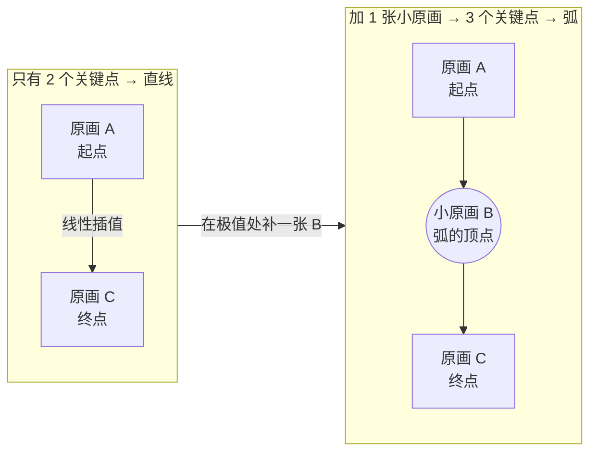
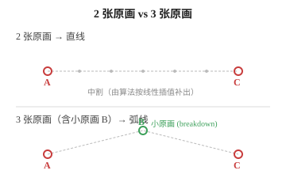
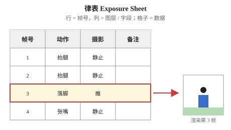
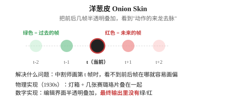
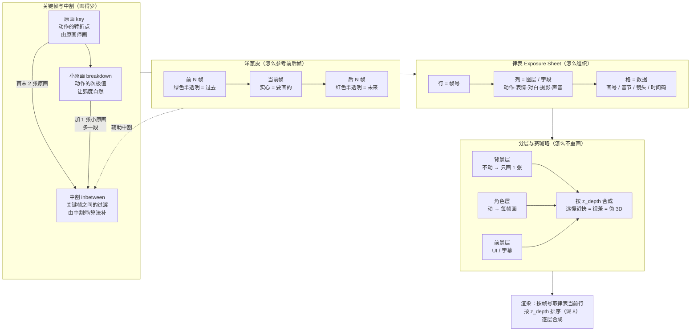

# 第 2 课：手绘工厂：关键帧、中割与律表

> 所属阶段：阶段 1《动画原理与工业流程》｜ 水平：零基础
> 本课知识点：关键帧与原画中割、律表 Exposure Sheet、分层与赛璐珞、洋葱皮与时间参考
> 故事情节：线条动起来了，但一秒要画 24 张——动画师发现"画得少、不重画、能参考"才是这门手艺的核心
> **本课分 2 批讲解**：第一批「画得少 + 怎么组织」、第二批「怎么不重画 + 怎么参考」，现已完结

## 🎯 本课目标

学完本课后，你应该能：

- 区分原画 / 中割 / 小原画，说明一个动作该画"几张原画（含几张小原画）"各自适用于什么
- 看懂并填写一份律表，说出每个栏位等价于什么代码字段
- 解释分层如何减少重绘，以及它与"伪 3D"的关系
- 说明洋葱皮解决什么问题，以及它在数字工具里的等价实现

---

## 第一幕：起源与场景引入

> 🏛️ **起源**：1930 年代，迪士尼为《白雪公主》设计了一条**分工流水线**——**原画师**（Key Animator）只画关键的几张，**中割师**（Inbetweener）按原画之间的中间位置补出剩余的画。这条流水线让 1937 年那部 83 分钟的动画电影得以在预算内完成，也奠定了此后近百年 2D 动画的工业基础。律表（Exposure Sheet, X-sheet）则是配套的"**总账本**"——每帧每个图层用什么画，都登记在这张表上。（核查于 2026-09）

**场景**：课 1 的线条终于动起来了——但等等。

你让 AI 跑了一段 30 秒、24 fps 的输出，得到了 **720 张图**。问题来了：

- 每张图都是 AI 独立生成，**抖动严重**——同一只手在第 100 帧和第 101 帧之间会突然变个姿势；
- 你想让主角在第 5 秒抬手，结果发现"抬手"这个动作**散在 100 多帧里**——回头改太麻烦；
- 临时改剧情，把"挥手"改成"点头"——又得重新生成 720 张。

你开始怀疑：**"一秒切 24 张"是必须的，但"一秒画 24 张"是必须的吗？**

> 🎬 **场景**：传统动画师一辈子只画几千张图，但能做出 90 分钟的电影——因为他不是"每张都画"，而是"**只画关键的那几张**"。

---

## 第二幕：认知冲突

直觉上会想："少画几张，那中间那几张是哪来的？"

- 让 AI 一帧一帧算？AI 也能跑，但**没有任何"锚点"**——你没法说"这里必须是这个姿势"；
- 让"会画的人"画？那又回到了"一秒画 24 张"，成本没降。

**更深的冲突在这里**：

**就算你只画 2 张（起点 + 终点），让算法"匀速补全"，你会得到一条**直线**运动**——但现实里几乎没有直线运动。人抬手是弧线，球弹跳是抛物线，头发飘动是波浪线。**只有 2 张关键帧 = 注定只能做出直线感。**

这意味着"画得少"不是"少画到 2 张"就好——**要"少而准"**。而"准"的关键，就是**在动作的转折点上多塞一张关键画**。

> ❓ **问题**：同样是"少画几张"，为什么"3 张"比"2 张"自然？多出来的那张，画在哪里、怎么决定？

---

## 第三幕：层层揭示

### 知识点 1：关键帧与原画中割

> 本知识点关键点：原画 key / 中间帧 inbetween / 小原画 breakdown / 一个动作画几张的取舍 / 「1原·2原」是工序不是张数

#### 一句话定义

**原画（key animation / genga）**是一个动作的**第一张与最后一张**——动作的转折点、姿态的极值，由原画师画；**中间帧（inbetween, 中割 / 動画）**是原画之间的过渡，由中割师或算法补出，**只起补足空白的作用**；**小原画（breakdown）**是首末之间插入的"次级关键"，决定动作的**时间（Timing）与空间（Spacing）**。

#### 直觉建立（类比）

把 24 张动画想成一篇 24 句话的短文。原画师是**作者**，他只写"开头—高潮—结尾"三句话；中割师是**改写助手**，把每两句话之间补出 5–6 个过渡句。

但如果作者只写"开头"和"结尾"两句话呢？助手只能写"从开头慢慢走到结尾"——出来的故事是**直叙**的，平淡、没有起伏。要让故事有弧度，**作者必须在中间再加一两个关键句**——这就是"小原画"的作用。

> 💡 **类比的边界**：文章的"关键句"是叙事意义上的，动画的"关键帧"是**空间位置**意义上的——它锁定的是某一瞬间的"姿势"，不是故事节奏。

#### 核心原理

**三个角色，分工不同**：

| 角色 | 谁画 | 画什么 | 数量级（24 fps 一秒） |
|------|------|--------|----------------------|
| **原画师** Key Animator | 资深动画师（或高级 AI） | 一个动作的**第一张与最后一张**——动作的转折点、姿态的极值 | 2 张起（首 + 末） |
| **小原画** Breakdown | 原画师本人 | 首末之间插入的"次级关键"，决定**时间（Timing）与空间（Spacing）** | 0–3 张 |
| **中割师** Inbetweener | 初级动画师（或基础算法） | 原画与小原画之间的过渡，只起**补足空白**的作用 | 几十张 |

**一个动作画几张原画（含几张小原画）？** 这是工业决策，不是越多越好：

- **只画首末 2 张，不加小原画**（2 个关键点）= **直线感**。适用：纯机械位移、UI 移动、匀速循环
- **首末 2 张 + 1 张小原画**（3 个关键点）= **一道弧**。适用：抛物线、挥手、点头、弹性回弹
- **首末 2 张 + 2 张小原画**（4 个关键点）= **带预备与回弹的复杂动作**。适用：起跳、挥拳、惊讶反应

> ⚠️ **三个名字很像、含义完全不同的概念，别搞混**：
>
> | 说法 | 真实含义 | 别理解成 |
> |------|---------|---------|
> | **一拍一 / 一拍二 / 一拍三**（课 1） | 一张画**停留几帧**——播放密度，24fps 下分别要画 24 / 12 / 8 张/秒 | ❌ 不是"画几张原画" |
> | **一个动作画几张原画**（本知识点） | 关键姿态的**数量**（首末 2 张 + 几张小原画） | ❌ 不是"每张画停几帧" |
> | **1原 / 2原**（第一原画 / 第二原画） | 原画**工序的两个阶段**：1原画动作草稿（layout 之后定动作与轮廓），2原在 1原 基础上清稿细化 | ❌ 不是"画几张关键帧" |
>
> **三者可以同时成立**：一段"一拍三"（课 1 的播放密度）的动画，某个动作可以只画"首末 2 张 + 1 张小原画"（本课的关键点数量），而这些原画由 1原 画草稿、2原 清稿（工序分工）。**它们描述的是三个不同维度。**
>
> （核查于 2026-09；来源：豆瓣《动画术语（中日对应）》、百度百科「一人原画」）
>
> ⏳ **置信度提示**：上表"几个关键点"的分档是教学用的粗略归纳，用于建立"动作越复杂、小原画越多"的直觉；实际工业分档更细（高成本剧场版可能用 4–6 个小原画）。**先有概念，再根据动作复杂度上探。**

**为什么"2 张"做不出弧？** 数学上，2 个点决定一条直线。要做弧，**至少要 3 个点**——而且中间那个点必须在**运动的极值位置上**（弧的顶点）。





> 💡 **对小原画最常见的误解**："小原画就是 AC 的中点位置"——**错**。AC 中点是抛物线 y=0 处的"中线"，不是弧的最高点。小原画是"动作的次极值"（弧的顶点、转折点），它的 x 坐标常在 A 和 C 的中点附近（对称时），但 y 坐标要按"看起来像自然弧"来定，没有唯一数学答案。

#### 示例演示

跑一次本课脚本，对比两组实验（脚本见第四幕）：

```text
inbetween_linear/      2 个关键点：首末 2 张原画（A 左 + C 右），22 帧线性插值
inbetween_breakdown/   3 个关键点：2 张原画 + 1 张小原画（A 左 + B 顶点 + C 右），22 帧分段线性插值
```

打开两个目录逐帧翻看（用 Windows 照片应用 + → 方向键）：

- **linear** 序列：球沿水平线匀速移动
- **breakdown** 序列：球先向上爬到顶点 B，再落到右端 C——**形成一道弧**

> 📌 **怎么看出"加 B 的价值"**：
> 1. 同样 24 帧，两个序列的总时长相同；
> 2. 但 breakdown 序列的**空间轨迹是弯曲的**——A→B 是上升段，B→C 是下降段；
> 3. 想象一下没有 B 的情况：球从 A 直奔 C，没有"上升"这个动作——这就不是"抛物线"了。

**底层代码长这样**（用课 1 的 lerp）：

```python
def pos_breakdown(f, total=24, b_split=12):
    """3 个关键点（2 张原画 + 1 张小原画）的轨迹：A→B 段 + B→C 段"""
    A, B, C = (30, 70), (160, 20), (290, 70)
    if f <= b_split:
        t = f / b_split
        return lerp(A[0], B[0], t), lerp(A[1], B[1], t)
    else:
        t = (f - b_split) / (total - 1 - b_split)
        return lerp(B[0], C[0], t), lerp(B[1], C[1], t)
```

注意：这段代码**和"加一张 B 关键帧"是同构的**——你加多少张关键帧，就多几个 `if/else` 分支或用循环代替。这就是"关键帧 + 插值"思想的全部秘密。

#### 常见误区

1. **"原画越多越好"**——错。**原画越密，浪费越严重**（中割可由算法补出，但原画每一张都贵）。工业原则是"原画尽量少、中割尽量准"。
2. **"小原画就是 AC 中点"**——错。小原画是**动作的次极值**（弧顶/转折点），不是平均值。位置画错了，弧度就垮。
3. **"关键帧之间用线性插值就够了"**——对直线动作够，对弧线动作就**显得折**。课 6 会讲怎么用缓动函数 + 贝塞尔曲线把分段线性变成平滑曲线。
4. **"AI 自动补帧不需要关键帧"**——错。AI 补帧的**质量完全取决于关键帧**——关键帧给得准，补出来才稳；关键帧给得乱，补出来会**左右横跳**。

#### 一句话记住

> **原画锁定"姿势"，中割补出"过渡"，小原画决定"弧度"——画得少的关键是"少而准"，不是"少就完事"。**

#### 延伸阅读

- [Key frame · Wikipedia](https://en.wikipedia.org/wiki/Key_frame)
- [Animation: The Twelve Basic Principles — Wikipedia](https://en.wikipedia.org/wiki/12_basic_principles_of_animation)（"Slow in and slow out" 与关键帧的密度直接相关）
- 《动画师生存手册》（The Animator's Survival Kit，Richard Williams 著）——工业实操经典

---

### 知识点 2：律表 Exposure Sheet

> 本知识点关键点：律表结构 / 帧号行与图层列 / 摄影指示与口型 / 律表是"动画界的 JSON"

#### 一句话定义

**律表（Exposure Sheet, X-sheet, 摄影表）**是一张二维表，**行是帧号，列是图层/字段**；每个格子记录"这一帧这一图层用什么画/什么指示"。它是动画师几十年来"用手写的数据结构"，今天它的本质就是 `dict[frame][layer] = data`。

#### 直觉建立（类比）

把律表想成**乐队的总谱**：

- **行 = 小节号**（= 帧号）
- **列 = 乐器**（= 图层）
- **格子里的音符**（= 该帧该层用哪张画）

指挥（播放器）走到哪一小节，所有乐器就演奏自己那一列对应的音符。

> 💡 **类比的边界**：总谱是"演奏顺序"，律表是"用什么素材"——前者强调时间，后者强调**数据本身**。但它们的"行-列-格"结构是一样的。

#### 核心原理

**典型律表的列**（每个动画工作室略有不同，常见 6–10 列）：

| 帧号 | 动作 | 表情 | 对白 | 口型 | 摄影 | 声音 | 备注 |
|------|------|------|------|------|------|------|------|

**格子里的内容因列而异**：

- 动作/表情层：**画号**（"1"、"2"、"3"——表示该帧用哪张原画）
- 对白/口型层：**音节或音标**（"a"、"o"、"m"——嘴部动作）
- 摄影层：**镜头运动**（"静止"、"推"、"拉"、"摇"、"移"）
- 声音层：**音轨编号 / 时间码**
- 备注：**导演指示**

**律表 vs 时间轴（课 1 知识点 3）**：
- 律表 = **数据**（手写/录入的"原始档案"）
- 时间轴 = **索引**（播放器跑起来时，按帧号去律表里抓数据）

关系：律表写好以后是**静态数据**；渲染时按 `f = frame_index`，取出 `xsheet[f]` 这一整行——然后逐层合成。

**律表 vs 关键帧（知识点 1）**：
- 关键帧 = "某一帧某一层用哪张画"的**单点记录**
- 律表 = 关键帧的**全集**（所有帧 × 所有层的记录）

> ⏳ **置信度提示**：早期律表真的是**纸质**——一格一格手画。现在几乎全是数字表格（Excel、Google Sheets、甚至 JSON/YAML），但结构完全一样。**律表在数字化后没有消失，只是换了载体。**



#### 示例演示

跑一次本课脚本的律表演示（脚本见第四幕）：

```text
xsheet_frames/   24 帧，每帧顶部 4 行 = 律表当前帧的 4 列数据，底部 = 按律表渲染的场景
```

打开 `xsheet_frames/frame_000.png` 看律表的第一帧：

```text
角色:1
道具:1
背景:1
摄影:静止
```

打开 `xsheet_frames/frame_012.png` 看中点帧：

```text
角色:3
道具:1
背景:1
摄影:静止
```

**关键观察**：
- "角色"层的画号从 `1` 变成 `3`——**这是律表驱动渲染的直接证据**；
- 其它三列完全不变——所以**场景里只有角色在变**（黑色球的位置），道具/背景/摄影完全静止；
- 翻看 24 帧，**黑色球会"动"**（按画号决定的姿势变化），而**蓝方块和绿草地完全不动**——这正是"按律表数据驱动渲染"的视觉效果。

**律表翻译成 Python**：

```python
# 律表 = 嵌套字典：xsheet[layer][frame] = value
XSHEET = {
    "角色": {0: "1", 1: "1", ..., 12: "3", ...},
    "道具": {f: "1" for f in range(24)},
    "背景": {f: "1" for f in range(24)},
    "摄影": {f: "静止" for f in range(24)},
}

def render_xsheet_frame(f):
    row = {layer: data[f] for layer, data in XSHEET.items()}
    char_y = {"1": 66, "2": 58, "3": 50}[row["角色"]]
    return char_y  # 这一帧角色层的 y 位置
```

> 💡 **这就是需求文档第七节描述的"到了第 120 帧，软件瞬间从内存中抓取所有标记为 frame:120 的矩阵，按 Z 轴深度排序，一次性渲染"——它抓的"矩阵"就是律表里那一行。** 律表不是"过去的废纸"，**它是引擎的数据结构**。

#### 常见误区

1. **"律表 = Excel 表格"**——律表**是**一种表格形式，但它的**本质是数据模型**（行-列-格的二维表），载体可以是 Excel/JSON/数据库甚至手写。
2. **"摄影指示是后期加的"**——错。**摄影指示写在律表里**（"推"、"拉"、"摇"），与画号同步规划；否则会出"嘴型在动但镜头不跟"的脱节。
3. **"律表只是给动画师看的"**——错。律表是**整个制作团队的沟通工具**：原画师看画号、动画导演看摄影、配音演员看口型、合成师看时间码——**一表多用**。
4. **"律表和数据库是一回事"**——律表的"行-列"和数据库的"表-字段"在结构上同构，但律表**特别强调"时间"作为第一维**（行=帧），这是它和普通数据库的本质差异。

#### 一句话记住

> **律表是"动画界的 JSON"——行是帧、列是图层、格是数据；写好律表，整个动画就已经"存在"了，剩下的只是渲染。**

#### 延伸阅读

- [Exposure sheet · Wikipedia](https://en.wikipedia.org/wiki/Exposure_sheet)
- 《动画师生存手册》扩展版（The Animator's Survival Kit — Expanded Edition, Richard Williams）——"The X-sheet" 章节是工业标准
- 需求文档第七节（"按 frame 字段过滤 + 按 z_depth 排序"——律表的代码化版本）

---

### 知识点 3：分层与赛璐珞

> 本知识点关键点：cel 片 / 背景与前景分离 / 复用与不重复绘制 / 分层是伪 3D 的起点

#### 一句话定义

**赛璐珞（celluloid / cel）**是 1914 年由美国人 Earl Hurd 取得专利的透明塑料薄片工艺——把角色画在透明片上、叠在单独绘制的背景上拍摄；**分层**是把画面拆成多个独立图层（背景 / 角色 / 前景），**每层只画自己会动的部分**。

#### 直觉建立（类比）

把动画想成 **PPT 的图层**：

- 底层 = 背景（PPT 母版/底图）
- 中层 = 角色（在角色层上独立操作）
- 顶层 = 前景（字幕、光效、UI）

你在 PPT 里改一个角色，**背景不会动**——因为它们是独立的图层。动画的分层就是这个思路，只不过是"按帧分"。

> 💡 **类比的边界**：PPT 的图层通常**只显示在屏幕上**；动画的图层会被**实际合成到一帧画面**里（不是分开看）。所以"分层"既是组织方式（编辑时），也是合成方式（渲染时）。

#### 核心原理

**为什么"分层"是省力的关键？**

直接看数字（本课脚本的实测）：

| 方案 | 计算 | 总张数 |
|------|------|--------|
| **不分层**（每帧重画整个画面） | 24 帧 × 2 个对象（背景 + 角色） | 48 张 |
| **分层**（背景静态、角色动态） | 1 张背景 + 24 张角色 | **25 张** |
| **节省** | —— | **省 23 张，减少 47.9%** |

实际工业里 24 帧一秒的"背景 + 角色 + 前景 + 特效"通常有 4–8 层，每多一层都是这个量级的节省。

**赛璐珞的历史意义**：

- 1914 年之前，动画**每帧都要把背景和角色一起重画**——画师要疯了；
- 1914 年，美国人 **Earl Hurd（埃尔·赫德）**将**赛璐珞**（Celluloid，一种透明合成塑料薄片）应用到动画制作并取得专利：背景**只画 1 次**，**角色画在透明片上**，每帧只需换角色片、叠在背景上拍 1 张；
- **这才是动画工业能上 24fps 的根本原因**——不是技术凑巧，是工艺创新。（核查于 2026-09）


**分层与"伪 3D"的关系**：

- 当你给**每一层独立的移动速度**（远层慢、近层快），人眼会把这种**视差**（parallax）解读为"纵深"；
- 这就是**伪 3D**（2.5D）——画面还是 2D 的，但有 3D 的感觉；
- 迪士尼 1937 年《老磨坊》（The Old Mill）首次应用的**多平面摄影机**（multiplane camera）就是物理实现：把多层赛璐珞片放在不同距离的玻璃上往下拍，**真实地产生视差**。本课脚本的 `layers_parallax/` 就是这个原理的 2D 模拟。（核查于 2026-09）

**分层与律表（知识点 2）的对应**：

- 律表 = **数据模型**（行=帧，列=图层）
- 分层 = **渲染模型**（每个图层独立合成）

律表的"列"就是分层的"层"——**律表告诉你这一帧这一层用什么画，分层告诉你怎么把多层画叠起来**。

> 💡 **需求文档对应**：第七节说"到了第 120 帧，软件瞬间从内存中抓取所有标记为 frame:120 的矩阵，**按 Z 轴深度排序**，一次性渲染"——"按 Z 轴排序"就是"按图层先后合成"的工程化版本。**Z 值 = 图层顺序**。（课 8 会讲排序的具体规则）

#### 示例演示

跑一次本课脚本的 5 组演示（脚本见第四幕）：

```text
layer_bg/           24 帧内容完全相同（证明"只画 1 张"）
layer_char/         24 帧各不相同（角色每帧要画）
layers_composite/   背景层 + 角色层 = 最终画面
layers_parallax/    远层慢移 30px / 中景 120px / 近景 260px → 纵深感
onion_skin/         洋葱皮：当前帧实心 + 前 2 帧绿 + 后 2 帧红
```

> 📌 **怎么验证"背景只画了 1 张"**：
> 1. 打开 `layer_bg/frame_000.png` 和 `layer_bg/frame_023.png`——**肉眼看不出任何区别**（连帧号标签都故意没写）；
> 2. 脚本输出里有一行**自动验证**："背景层 24 帧的文件大小完全相同 → 证明「只画 1 张，复用 24 次」"；
> 3. 这是分层最直接的证据：**没有变化 = 没必要重画**。

打开 `layers_parallax/frame_000.png` 到 `frame_023.png` 逐帧翻看：山几乎不动、树走得中等、角色走得最快——**三层用不同速度移动，你的眼睛会告诉你"这是 3D 的"**，但其实全是 2D 叠加。

**分层 + 律表 + 关键帧的协同工作流**（伪代码）：

```python
# 1. 律表定义"这一帧这一层用什么画"
XSHEET = {
    "背景": {f: "bg_01" for f in range(24)},          # 全程 1 张
    "角色": {f: f"char_{f:02d}" for f in range(24)},  # 24 张（每帧不同）
    "前景": {f: "fg_01" for f in range(24)},          # 全程 1 张
}

# 2. 分层渲染：按 z_depth 从下往上合成
def render_frame(f):
    canvas = new_canvas()
    for layer in ["背景", "角色", "前景"]:            # z_depth 从小到大
        draw_id = XSHEET[layer][f]                    # 查律表
        canvas = composite(canvas, LAYERS[layer][draw_id])
    return canvas
```

#### 常见误区

1. **"分层越多越好"**——错。**层数越多合成开销越大**（每层都是一次 alpha 合成 + 内存占用）。**按"会不会动"分，不是按"好不好看"分。**
2. **"分层就是图层面板"**——分层是**工业概念**（背景/角色/前景的独立绘制与合成），图层面板是**软件实现**（Photoshop 的 Layers、AE 的 Comp）。**概念早于软件。**
3. **"伪 3D 就是 3D"**——伪 3D 是**分层的视差模拟**，不是真 3D。真 3D 有 z 缓冲和真实几何；伪 3D 是"假装有 3D 感"的 2D 技巧。
4. **"分层只是为了省力"**——分层还**便于修改**（改角色不动背景）、**便于复用**（同一套背景在多个镜头里用）、**便于协作**（背景师只管背景层，角色师只管角色层）。

#### 一句话记住

> **分层 = 按"会不会动"拆图层；背景不动就只画 1 张，角色动就每帧画——分层既是省力手段，也是"伪 3D"的起点。**

#### 延伸阅读

- [Cel · Wikipedia](https://en.wikipedia.org/wiki/Cel)（含 Earl Hurd 1914 专利的历史）
- [Multiplane camera · Wikipedia](https://en.wikipedia.org/wiki/Multiplane_camera)（迪士尼的物理视差实现）
- [Parallax scrolling · Wikipedia](https://en.wikipedia.org/wiki/Parallax_scrolling)（现代游戏常用的视差技巧）

---

### 知识点 4：洋葱皮与时间参考

> 本知识点关键点：onion skin / 前后帧半透明叠加 / 解决中割的"位置盲" / 数字工具的等价实现

#### 一句话定义

**洋葱皮（onion skin）**是把当前帧**前后若干帧**以**半透明叠加**的方式显示在同一画面上，让中割师看到"动作的来龙去脉"——过去的帧显示"刚刚在哪"、未来的帧显示"接下来要去哪"。

#### 直觉建立（类比）

把洋葱皮想成 **描红本**：

- 你在学写字时，下面会垫一张半透明的字帖；
- 你的笔在白纸上写，但要**看到底下的字**才能写得像；
- 洋葱皮就是动画的"描红字帖"——当前帧是"白纸"，前后帧是"底下那层字"。

> 💡 **类比的边界**：描红是静态参考（同一张字帖一直垫着）；洋葱皮是**动态参考**——你画第 12 帧时参考的是第 11/13 帧，画第 13 帧时参考的是第 12/14 帧，"字帖"随时在变。

#### 核心原理

**洋葱皮解决什么问题？**

回到第一批"中割"的概念：中割师画第 12 帧时，**必须知道第 11 帧的小球在哪、第 13 帧要在哪**，才能算出第 12 帧的位置。

- 没有参考 = "中割盲"——只能凭感觉瞎画，**画完发现跳帧**；
- 有洋葱皮 = 前后几帧同时显示 = 看到"动作的来龙去脉" = 中割位置**几乎不可能画错**。

**历史 → 数字实现**：

| 时代 | 实现方式 | 特点 |
|------|---------|------|
| 1930s 赛璐珞时代 | **灯箱**（light table）——把几张赛璐珞片叠在玻璃灯箱上，下面打光，几张画同时可见 | 真实（看到的是"画"），但要物理搬动胶片 |
| 1980s 至今的数字工具 | **屏幕上的半透明叠加**——前后帧用低 alpha + 区分色（绿/红）显示 | 灵活（onion skin range 可调），但只是"参考" |

**关键参数**：

- **Onion skin range**：向前/向后看几帧（2–3 帧最常用）
- **颜色约定**：过去 = 绿色，未来 = 红色（视觉上区分"已经发生的"和"将要发生的"）
- **不透明度**：参考帧通常 30–50% alpha，**不能盖过当前帧**



**洋葱皮 vs 律表（知识点 2）**：

- 律表告诉你**这一帧该在哪**（数据/答案）
- 洋葱皮让你**看到**前后帧在哪（视觉参考/辅助）

**两者配合**：律表是"对不对"的依据，洋葱皮是"画得准不准"的辅助。

> ⏳ **置信度提示**：Onion skin 是大多数 2D 动画软件的内置功能（Animate、Clip Studio Paint、Procreate、Toon Boom），但**不是渲染管线的一部分**——它只在编辑时出现，**最终导出的视频里没有绿/红半透明**。

#### 示例演示

跑一次本课脚本的洋葱皮演示：

```text
onion_skin/   24 帧，每帧显示：当前帧实心黑球 + 前 2 帧绿色半透明 + 后 2 帧红色半透明
```

打开 `onion_skin/frame_012.png` 看中点帧（球的轨迹是抛物线）：

- **黑色实心球**：当前帧（第 12 帧）的位置 = 抛物线顶点 `(160, 44)`
- **绿色半透明球**：第 10、11 帧的位置 = **上升段**（在当前帧的左下方）
- **红色半透明球**：第 13、14 帧的位置 = **下降段**（在当前帧的右下方）

> 📌 **第一帧 / 最后一帧的边界情况**（免得你以为程序写错了）：
> - `frame_000.png` 只有 1 个黑色球 + 2 个红色（未来）；**没有绿色**（前面没有过去帧）。
> - `frame_023.png` 只有 1 个黑色球 + 2 个绿色（过去）；**没有红色**（后面没有未来帧）。
> - 这是**符合实际的**——序列的开头不可能"参考过去"、结尾不可能"参考未来"。

**数字工具中的等价实现**（伪代码）：

```python
def render_with_onion_skin(current_frame, before=2, after=2):
    canvas = new_layer()
    canvas = composite(canvas, BACKGROUND)              # 1. 铺背景
    for k in range(before, 0, -1):                      # 2. 过去的帧（绿）
        f = current_frame - k
        if 0 <= f < total:
            canvas = alpha_composite(canvas, tinted(ROLE[f], "green", alpha=80))
    for k in range(after, 0, -1):                       # 3. 未来的帧（红）
        f = current_frame + k
        if 0 <= f < total:
            canvas = alpha_composite(canvas, tinted(ROLE[f], "red", alpha=80))
    canvas = alpha_composite(canvas, ROLE[current_frame])  # 4. 当前帧（实心，最上层）
    return canvas
```

#### 常见误区

1. **"洋葱皮是渲染的一部分"**——错。**洋葱皮只显示在编辑界面，最终导出的视频里没有**绿/红半透明。**它是辅助工具，不是渲染管线。**
2. **"洋葱皮越多越好"**——错。**太多参考帧会盖住当前帧**。通常前后 2–3 帧就够了；多到 5 帧基本看不清。
3. **"洋葱皮 = 运动模糊"**——完全不同的东西。**运动模糊**是渲染时把多帧"按速度方向涂抹"，**模拟相机追拍的效果**（是**输出效果**）；**洋葱皮**是编辑时把多帧"按颜色叠加"，**让人定位当前帧**（是**输入辅助**）。
4. **"有了洋葱皮就不需要律表"**——错。**洋葱皮是"画得准"的辅助，律表是"画得对"的依据**。没有律表你不知道这一帧"应该"在哪；没有洋葱皮你画不出"准确"的位置。

#### 一句话记住

> **洋葱皮是"中割师的描红本"——把前后几帧半透明叠在当前帧上，让动作的来龙去脉一眼可见；它只活在编辑界面，不出现在最终输出。**

#### 延伸阅读

- [Onion skinning · Wikipedia](https://en.wikipedia.org/wiki/Onion_skinning)
- [Light table · Wikipedia](https://en.wikipedia.org/wiki/Light_table)（赛璐珞时代的物理洋葱皮）
- 大多数 2D 动画软件的文档（Animate / Clip Studio Paint / Procreate）——搜 "onion skin" 都能找到

---

## 第四幕：实操验证

### 运行方式

本课有 **2 个脚本**（第一批 1 个、第二批 1 个）。在 PowerShell 中（先切到课程目录）分别运行：

```powershell
cd d:\projects\learning\animation-engine\00-动画与视频基础
# 第一批：关键帧与中割、律表
.\playground\.venv\Scripts\python.exe .\playground\lesson-02\xsheet_demo.py
# 第二批：分层与赛璐珞、洋葱皮
.\playground\.venv\Scripts\python.exe .\playground\lesson-02\layers_demo.py
```

**`xsheet_demo.py` 的预期输出**（脚本在 Python 3.12.13 + numpy 2.5.2 + pillow 12.3.0 上验证通过）：

```text
=== 知识点 1：关键帧与中割 ===
关键帧 A=(30, 70)   C=(290, 70)                            -> inbetween_linear/    (2 个关键点：首末 2 张原画)
关键帧 A=(30, 70)   B=(160, 20)   C=(290, 70)                -> inbetween_breakdown/ (3 个关键点：2 张原画 + 1 张小原画 B)

共生成 24 帧 × 2 个序列

=== 知识点 2：律表驱动渲染 ===
律表 4 列: 角色 / 道具 / 背景 / 摄影
律表驱动渲染了 24 帧 -> xsheet_frames/

f000  角色:1  道具:1  背景:1  摄影:静止
f012  角色:3  道具:1  背景:1  摄影:静止
f023  角色:2  道具:1  背景:1  摄影:静止
```

**`layers_demo.py` 的预期输出**：

```text
=== 知识点 3：分层与赛璐珞 ===

  [验证] 背景层 24 帧的文件大小完全相同（4056 字节） → 证明「只画 1 张，复用 24 次」
分层前（每帧都要重画整个画面 = 背景 + 角色）：24 帧 × 2 = 48 张画
分层后（背景静态只画 1 张，角色动态画 24 张）：1 + 24 = 25 张画
  -> 省了 23 张，减少 47.9%
  -> layer_bg/（24 帧相同） layer_char/（24 帧不同） layers_composite/（合成结果）

视差演示（远层慢移 30px / 中景 120px / 近景 260px）-> layers_parallax/
  -> 同样的位移差 = 纵深感，这就是「伪 3D」的原理

=== 知识点 4：洋葱皮与时间参考 ===
洋葱皮：当前帧实心黑 + 前 2 帧绿 + 后 2 帧红 -> onion_skin/

f000  角色位置 (40,62)
f012  角色位置 (160,44)
f023  角色位置 (280,62)
```

### 怎么翻看

| 文件夹 | 翻看要点 | 对应知识点 |
|--------|----------|------------|
| `inbetween_linear/frame_000.png` 到 `frame_023.png` | 球沿水平线匀速移动，**轨迹是直线** | 关键帧只有 2 张 → 直线感 |
| `inbetween_breakdown/frame_000.png` 到 `frame_023.png` | 球从 A 上升到顶点 B，再降到 C，**轨迹是 V 形/弧形** | 加 1 张小原画 B → 弧度感 |
| `xsheet_frames/frame_000.png` 到 `frame_023.png` | 顶部 4 行 = 律表当前帧数据；底部场景中只有"角色"在变 | 律表 → 渲染 的直接证据 |
| `layer_bg/frame_000.png` 对比 `frame_023.png` | **肉眼看不出任何区别**（连帧号都故意没写） | 分层：背景只画 1 张 |
| `layer_char/frame_000.png` 到 `frame_023.png` | 黑球沿抛物线移动，**每帧都不同** | 分层：角色每帧都要画 |
| `layers_composite/frame_000.png` 到 `frame_023.png` | 背景 + 角色 合成后的最终画面 | 分层：合成结果 |
| `layers_parallax/frame_000.png` 到 `frame_023.png` | 山几乎不动、树走得中等、角色走得最快 → **纵深感** | 分层 → 伪 3D（视差） |
| `onion_skin/frame_012.png` | 黑球（当前）+ 2 个绿球（过去，左下）+ 2 个红球（未来，右下） | 洋葱皮：前后帧半透明叠加 |

**翻看方式**：用 Windows 照片应用打开 `frame_000.png`，然后按住 **→ 方向键**逐张往后翻。

> 📌 **四点说明，免得你以为程序写错了**：
> 1. `inbetween_breakdown/` 里的关键帧标记 A/B/C 是**空心彩色圆**，球的**当前位置是实心蓝球**——同一帧上 A 和 C 都是空心圆 + 字母标签，只有球在的位置才被实心蓝球覆盖。
> 2. `xsheet_frames/` 顶部的 4 行是律表当前帧的数据，**不是装饰**。逐帧翻看时注意"角色:1 → 角色:3 → 角色:2"的循环，黑色球的 y 位置**严格跟着律表的"角色"画号变**。
> 3. `layer_bg/` 的 24 帧**看起来一模一样是有意为之**——背景静止，本来就该只画 1 张。脚本输出里的"文件大小完全相同"就是自动验证。
> 4. `onion_skin/frame_000.png` **没有绿色球**、`frame_023.png` **没有红色球**——序列开头没有"过去"可参考、结尾没有"未来"可参考，这是符合实际的。

### 动手改一改（建议都试一遍）

| 改什么 | 预期看到 | 对应知识点 |
|--------|---------|-----------|
| 把 `KEY_B = (160, 20)` 改成 `KEY_B = (160, 60)` | 弧变得很浅，几乎是直线 | 小原画位置决定弧度 |
| 在脚本里加 `KEY_D = (200, 80)` 并扩展 `pos_breakdown` 为 4 段插值 | 弧变成"多段折线"，运动更精细 | 多张小原画 |
| 在 `XSHEET["角色"]` 里把第 12 帧改成 `"4"` | 第 12 帧的角色姿势变成 4 号（脚本暂未实现 4 号会变 "-"） | 律表驱动渲染 |
| 在 `XSHEET["摄影"]` 里把第 12 帧改成 `"推"` | 顶部"摄影:推"出现，但场景不变（脚本未实现镜头推拉的视觉） | 律表的列是"数据通道"——文字会变，渲染需要引擎实现 |
| `layers_demo.py` 里 `ONION_BEFORE = 2` 改成 `6` | 6 个绿色残影几乎连成一片，**当前帧被盖住看不清** | 洋葱皮不是越多越好 |
| `layers_demo.py` 里 `ONION_BEFORE = 2` 改成 `0` | 只剩红球（未来）和黑球（当前），看不到"来路" | 洋葱皮的"过去/未来"分工 |
| `render_parallax` 里把三层速度改成**一样**（都 120px） | 纵深感消失，看起来像"整张图在平移" | 视差 = 速度差，不是移动本身 |
| `render_layers` 里给背景也加上逐帧变化的帧号 | 背景层 24 帧不再相同，"省 47.9%" 的结论失效 | 分层省力的前提是"背景不变" |

> ✅ **回扣场景**：现在可以回答开头的问题了。
> - **"一秒画 24 张"是必须的吗**——不是。**只画 1–5 张关键帧**，其余 19–22 张由中割师或算法补出。（知识点 1）
> - **AI 抖动严重怎么解决**——给 AI **更准的关键帧**（特别是动作的极值和转折点）。关键帧稳定，AI 补出来才稳。（知识点 1）
> - **"挥手"改成"点头"怎么改最便宜**——**只改 1–3 张关键帧**（抬手的极值 → 点头的极值），其他帧全部由引擎自动重算。这就是"关键帧 + 中割"的工业化威力。（知识点 1）
> - **多角色多图层怎么同步**——**用律表**。把所有图层、声音、对白、摄影都登记在同一张律表上，渲染时按帧号取整行——一帧一帧的内容从此是"查表"而不是"创作"。（知识点 2）
> - **角色不动、背景却要动 24 帧，背景也要重画 24 张吗**——**不用，用分层**。背景只画 1 张复用 24 次，24 帧一秒能省掉约 **47.9%** 的绘制量。（知识点 3）
> - **想让 2D 画面有 3D 纵深感**——**用视差**。给每层不同的移动速度（远慢近快），眼睛会自动把它读成"纵深"——这就是"伪 3D"，也是迪士尼多平面摄影机的原理。（知识点 3）
> - **中割师怎么知道第 12 帧该画在哪**——**用洋葱皮**看到第 10/11 帧（过去）和第 13/14 帧（未来）的位置，动作来龙去脉一目了然。（知识点 4）

---

## 第五幕：体系收束


> 📍 **全局定位**：本课（课 2）回答了**四个问题**，合起来就是传统动画工业的完整流水线：
>
> | 知识点 | 回答的问题 | 本质 |
> |--------|-----------|------|
> | 关键帧与原画中割 | **画多少** | 省力（只画关键姿态） |
> | 律表 Exposure Sheet | **怎么组织** | 协作（一表登记所有图层） |
> | 分层与赛璐珞 | **怎么不重画** | 复用（背景只画 1 次） |
> | 洋葱皮与时间参考 | **怎么参考前后帧** | 精准（看到动作来龙去脉） |
>
> 串起来看：**原画师定关键姿态 → 律表登记每帧每层 → 分层复用背景 → 中割师借洋葱皮补中间帧 → 合成输出**。你的 AI 动画引擎要自动化的，正是这条流水线。
>
> 🔗 **下一步**：本课解决了"**怎么把动画画出来**"（工艺层面），但**完全没解决"怎么让动作好看"**。同样是一个球从 A 滚到 C，为什么迪士尼的看起来有重量感、你的看起来像在飘？**动画十二原则**就是答案——其中"慢入慢出"对应缓动函数、"弧线运动"对应插值路径。下一课讲这个。

---

## 🐞 常见误区

1. **"原画越多越好"**——原画贵，关键帧**少而准**才是工业原则
2. **"小原画就是 AC 中点"**——小原画是动作的**次极值**（弧顶/转折），不是平均值
3. **"律表 = Excel 表格"**——律表的**本质是数据模型**（行-列-格），载体不重要
4. **"律表和数据库一样"**——律表**特别强调时间作为第一维**（行=帧），与普通数据库不同
5. **"AI 自动补帧不需要关键帧"**——AI 补帧的质量**完全取决于关键帧**；关键帧乱，补出来会左右横跳
6. **"分层越多越好"**——层数越多合成开销越大；**按"会不会动"分，不是按"好不好看"分**
7. **"伪 3D 就是 3D"**——伪 3D 是**分层的视差模拟**，没有真实几何与 z 缓冲
8. **"洋葱皮是渲染的一部分"**——**只活在编辑界面**，最终导出的视频里没有绿/红半透明
9. **"洋葱皮 = 运动模糊"**——前者是**输入辅助**（编辑时看前后帧），后者是**输出效果**（渲染时按速度涂抹）

## 一图总结



## 课后小测

**Q1**：一个球从 A 点弹到 C 点，想做出"先上升后下降"的抛物线感，至少需要几张关键帧？分别放在哪里？

- A. 2 张：A 和 C
- B. 2 张：A 和弧的顶点
- C. 3 张：A、弧的顶点、C
- D. 4 张：起点、上升段中点、顶点、下降段中点

<details><summary>答案与解析</summary>

**答案：C**。2 个点决定一条直线（A 选项是直线感，B 选项缺少终点）。3 个点（A、顶点、C）才能定义一条"先升后降"的弧，且顶点必须放在**弧的最高处**（不是 AC 中点——中点是抛物线 y=0 处，不是最高点）。D 是过度画——多一张就贵一张，工业上"3 张"已经够。
</details>

**Q2**：律表的一行通常对应什么？

- A. 一个动画图层
- B. 一个时间点（帧号）
- C. 一个原画师
- D. 一张关键帧

<details><summary>答案与解析</summary>

**答案：B**。律表是"行=帧、列=图层"的二维表，一行就是"某一帧所有图层的数据"——这是它和数据库/Excel 的本质差异。**律表的第一维永远是时间**。
</details>

**Q3**：需求文档说"到了第 120 帧，软件瞬间从内存中抓取所有标记为 frame:120 的矩阵"——这个 `frame:120` 字段，在传统动画工业里对应什么？

- A. 关键帧的画号
- B. 律表里的行号
- C. 动画师的工号
- D. 摄影机的镜头号

<details><summary>答案与解析</summary>

**答案：B**。需求文档的 `frame: 120` 就是律表里"第 120 行"的代码化表达。**整张律表 = 整部动画的全部数据**，`frame` 字段 = 行号。
</details>

**Q4**：某动画有 4 个图层（背景 / 角色 / 前景 / 特效），24 帧一秒。如果**不做分层**（每帧都要重画所有图层），一秒共需画多少张？改用分层后（背景、前景全程各 1 张；角色、特效每帧各 1 张），需要多少张？

- A. 分层前 24 张，分层后 50 张
- B. 分层前 96 张，分层后 50 张
- C. 分层前 96 张，分层后 4 张
- D. 分层前 50 张，分层后 96 张

<details><summary>答案与解析</summary>

**答案：B**。分层前每帧都要画 4 个图层：24 帧 × 4 层 = **96 张**。分层后，静态层（背景、前景）各只画 1 张，动态层（角色、特效）各画 24 张：1 + 1 + 24 + 24 = **50 张**，省了约 48%。**关键前提：分层省力的前提始终是"该层不动"**——动了的层照样每帧都得画。
</details>

**Q5**：关于洋葱皮（onion skin），下列说法正确的是？

- A. 洋葱皮会出现在最终导出的视频里，让动作看起来更柔和
- B. 洋葱皮是编辑界面的辅助显示，用来看到前后帧的位置
- C. 洋葱皮和运动模糊是同一件事的两种叫法
- D. 有了洋葱皮就不需要律表了

<details><summary>答案与解析</summary>

**答案：B**。洋葱皮**只在编辑界面出现**，最终导出的视频里没有绿/红半透明（A 错）。它与运动模糊完全不同——运动模糊是渲染时按速度方向涂抹的**输出效果**，洋葱皮是编辑时按颜色叠加的**输入辅助**（C 错）。律表告诉你这一帧"应该"在哪，洋葱皮让你"画得准"，两者是配合关系而非替代关系（D 错）。
</details>

## 🚀 下一课接力提示词

> 学完本课后，**复制下面这段文字发给 AI**，即可无缝进入下一课（无需重新描述上下文）：

```
继续学 2D 动画与视频基础。我的学习档案在 animation-engine/00-动画与视频基础/00-学习档案.md，
刚学完阶段 1《动画原理与工业流程》的课《手绘工厂：关键帧、中割与律表》全部两批
（关键帧与原画中割、律表 Exposure Sheet、分层与赛璐珞、洋葱皮与时间参考），
请按大纲继续讲解下一课：课 3《让动作有分量：动画十二原则》
（时间与间距、挤压拉伸·预备·跟随与重叠、十二原则中哪些能变成算法）。
```

## 🧭 课程导航

⬅️ **上一课**：[课 1：眼睛是怎么被骗的](lesson-01-眼睛是怎么被骗的.md)
➡️ **下一课**：[课 3：让动作有分量：动画十二原则](lesson-03-让动作有分量动画十二原则.md)
📚 **返回目录**：[课程目录](../../02-课程目录.md)
