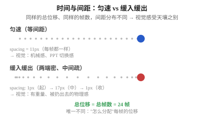
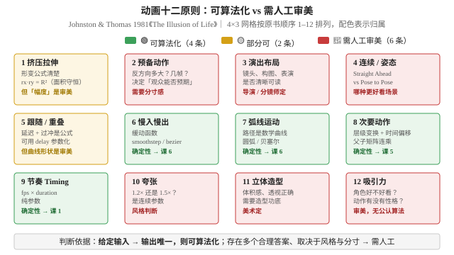
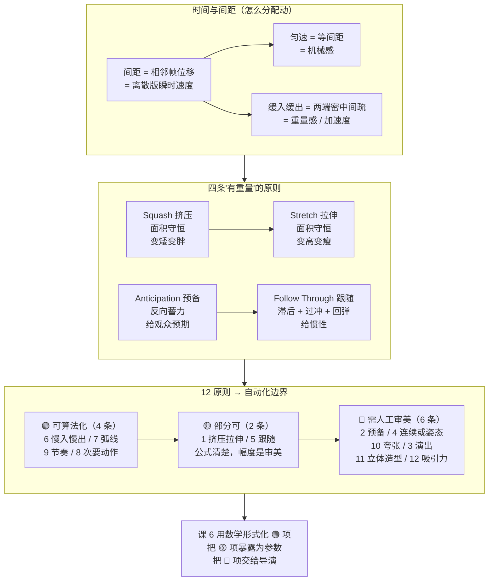

# 第 3 课：让动作有分量：动画十二原则

> 所属阶段：阶段 1《动画原理与工业流程》｜ 水平：零基础
> 本课知识点：时间与间距、挤压拉伸·预备·跟随与重叠、十二原则中哪些能变成算法
> 故事情节：线条的动作在技术上"能播"了，但看着像纸片在飘——动画师用十二原则给它加上了重量

## 🎯 本课目标

- 用"间距"解释速度感，画出匀速与缓入缓出的间距对比
- 各举一例说明挤压拉伸、预备动作、跟随与重叠四条原则
- 划清"可自动化"与"需人工审美"的边界，并给出判断依据

---

## 第一幕：起源与场景引入

> 🏛️ **起源**：1981 年，迪士尼两位资深动画师 **Frank Thomas** 和 **Ollie Johnston** 在合著《The Illusion of Life: Disney Animation》中，把迪士尼数十年积累的"动作好看"经验总结为 **12 条基本原则**——这就是后来所有 2D/3D 动画教学的基础。（核查于 2026-09）

**场景**：课 2 把动画的"工艺流水线"搭好了——关键帧、律表、分层、洋葱皮全有。你让 AI 生成了一段"角色挥拳"的动画，**技术上能播**（24 帧，1 秒），但视觉上：

- 拳头从 A 移到 B 是"匀速飘过去"的——**没有重量感**；
- 拳头打到了目标，但**没有"冲击"的瞬间**——看起来像撞到空气；
- 头发动也不动——**像贴上去的贴纸**；
- 观众看完不知道"这一拳很用力还是轻轻碰一下"。

技术对了，**审美没对**。这是迪士尼九十二年前就解决过的问题——答案就是十二原则。

> 🎬 **场景**：AI 能画"动起来"，但要让动作"有分量、有冲击、有预期"，需要把十二原则编码进去——**有些能自动化，有些必须留给人**。

---

## 第二幕：认知冲突

直觉上，"动"就够了——只要相邻帧位置不同，看起来就在动。

但请想象两个完全相同的"球从 A 移到 B，100 像素，24 帧"：

- **版本 1**：每帧移动 4.17 像素，恒定 → 看着像 PPT 切换 / 幻灯片
- **版本 2**：前 6 帧移动 0–1 像素（蓄力慢起），中间 12 帧移动 5–8 像素（加速），最后 6 帧回到 0–1 像素（惯性收尾） → 看着像"被扔出去的球"或者"挥拳"

**两个版本的总位移、总帧数、律表都完全一样**——唯一不同是"**怎么分配每帧的位移**"。

这就是**间距（spacing）**和**缓入缓出（slow in & slow out）**在做的事。

> ❓ **问题**：同样画 24 帧，**为什么"怎么动"比"动了多远"重要得多**？哪些"动的方式"是可以写公式的、哪些必须靠人判断？

---

## 第三幕：层层揭示

### 知识点 1：时间与间距

> 本知识点关键点：间距决定速度 / 匀速 vs 缓入缓出 / 间距表 ↔ 速度曲线 / 课 6 缓动函数的物理直觉

#### 一句话定义

**间距（spacing）**是相邻两帧之间物体移动的距离（在固定帧率下 = 瞬时速度）；**时间（timing）**是这个动作"用多少帧完成"；**缓入缓出**是"两端间距小、中间间距大"的非线性间距分布。

#### 直觉建立（类比）

把动画想成 **开车**：

- 间距 = 每秒走了多少米（瞬时速度）
- 时间 = 这段路一共开了几秒
- 匀速 = 油门踩死一直匀速跑（机械感）
- 缓入缓出 = 起步踩油门、加速、中段巡航、临近目的地收油门、停车（**这才是真实开车**）

> 💡 **类比的边界**：汽车的"加减速"是油门控制的真实物理；动画的"加减速"是**画师故意安排**的——人眼会自动脑补物理，所以"画得符合物理"才会"看着真"。

#### 核心原理

**间距 = 速度的离散版**。24 fps 下，**速度 = 间距 × fps**——间距 5 像素/帧 = 120 像素/秒。

**两种典型间距分布**：

| 分布 | 间距变化 | 物理含义 | 视觉感受 |
|------|----------|----------|----------|
| **匀速** | 全程恒定（如 11.3px/帧） | 无加速度（牛顿第一定律） | 机械感、PPT 感、幽灵穿墙 |
| **缓入缓出** | 两端小（如 1px）→ 中间大（如 17px）→ 两端小 | 有加速度（被推 / 撞 / 抛） | 重量感、自然感、"真在动" |

**间距表 ↔ 速度曲线**：

把每帧的间距作为 y 值、帧号作为 x 值画出来，就是**速度曲线**。匀速是水平线，缓入缓出是"两端低、中间高"的山丘形。


**为什么"缓入缓出"看起来有重量？**

物理上：一个物体从静止到运动必须有加速度（F=ma），从运动到停止也必须有减速度。**缓入缓出 = 模拟这两个过程**。匀速 = 直接忽略了所有加速度，**所以看起来"不像物理世界里的东西"**。

**缓入缓出在 24 帧里的实测间距**（本课脚本的输出）：

| 帧 | 匀速 spacing | 缓入缓出 spacing | 说明 |
|----|------------|----------------|------|
| f0 | -- | -- | 起点（速度 = 0） |
| f3 | 11px | 7px | 起步阶段 |
| f6 | 11px | 12px | 加速中 |
| **f12** | **11px** | **17px** | **中点（速度最大）** |
| f18 | 11px | 12px | 减速中 |
| f21 | 11px | 7px | 收尾 |
| f23 | 11px | 1px | 终点（速度 = 0） |

> 同一个 24 帧、同一个总位移——**只是"间距分布"不同**——视觉感受天差地别。



#### 示例演示

跑一次本课脚本的对比：

```text
spacing_uniform/    24 帧，球等间距移动（11px/帧）
spacing_ease/       24 帧，球缓入缓出（1px → 17px → 1px）
```

打开 `spacing_ease/frame_012.png` 看中点帧：球在中点（x=168），spacing=17px（**最大**），灰点轨迹**两头密、中间疏**——这就是"中点最快、两端慢"的视觉证据。

对比打开 `spacing_uniform/frame_012.png`：球也在中点，spacing=11px（**和全程一样**），灰点轨迹**均匀分布**——这就是"全程一样快"的视觉证据。

> 📌 **怎么看出"缓入缓出有重量"**：
> 1. 打开 `spacing_ease/frame_000.png` 看起点——**灰点很密**（球几乎没动），画面"迟疑了一下"；
> 2. 翻到 `spacing_ease/frame_012.png` 看中点——**灰点很疏**（球冲过去了），画面"飞快"；
> 3. 再翻到 `spacing_ease/frame_023.png` 看终点——**灰点又变密**（球减速停下）；
> 4. 整个过程是"迟疑 → 加速 → 减速 → 收住"——**人眼会脑补"这个球是被扔出去的，落地后停了"**。

**底层代码**（就是课 1 的 `lerp`，但 t 用缓动函数变换）：

```python
def pos_uniform(f, total=24, x0=30, x1=290):
    """匀速：t = f/(total-1)，进度线性增长"""
    t = f / (total - 1)
    return lerp(x0, x1, t)

def pos_ease(f, total=24, x0=30, x1=290):
    """缓入缓出：t = f/(total-1)，进度用 smoothstep 变换"""
    t = f / (total - 1)
    eased = t * t * (3 - 2 * t)   # smoothstep = ease-in-out
    return lerp(x0, x1, eased)
```

注意：**总位移一样、帧数一样**——唯一的区别是 `pos_ease` 把 `t` 用 `smoothstep` 变换了一下。这就是"缓动"的全部秘密。

#### 常见误区

1. **"动得快 = 多画几帧"**——错。**动得快是把同样的几帧排得更密**。帧数是节奏（timing），间距才是速度（spacing）。两者独立。
2. **"缓动函数就是变慢"**——错。缓动函数管的是**加速度**（间距如何随时间变化），不是绝对速度。**缓动后整段动画的总时长不变**，只是分配变了。
3. **"匀速就是等间距"**——对，但**只对匀速成立**。所有缓动函数都不是等间距的。
4. **"有了缓动函数就不需要关键帧了"**——错。**缓动函数只决定"关键帧之间怎么动"，不决定"关键帧本身在哪"**。关键帧 = 姿势，缓动 = 怎么到下一个姿势。

#### 一句话记住

> **间距决定速度感，缓动函数改写间距分布——同样的位移，"怎么分配"比"动了多远"重要得多。**

#### 延伸阅读

- [12 basic principles of animation · Wikipedia](https://en.wikipedia.org/wiki/12_basic_principles_of_animation)（第 6 条 Slow In and Slow Out 与第 9 条 Timing 的关系）
- 《The Illusion of Life: Disney Animation》Frank Thomas & Ollie Johnston 1981（"Timing" 章节是工业圣经）
- 课 6《插值、缓动与贝塞尔》——本知识点的数学深化（缓动函数参数化）

---

### 知识点 2：挤压拉伸·预备·跟随与重叠

> 本知识点关键点：Squash & Stretch / Anticipation / Follow through & Overlapping / 共同点：都是"模拟物理"

#### 一句话定义

**挤压拉伸（Squash & Stretch）**是物体受力时变形（挤/拉）但保持体积恒定；**预备动作（Anticipation）**是主动作前先做反向运动，让观众预期；**跟随与重叠（Follow Through & Overlapping）**是主体停止后附属物继续运动（过冲再回弹），让动作有层次。

#### 直觉建立（类比）

把这四条原则想成**真实世界的物理常识**：

- **挤压拉伸**：篮球砸地会**先压扁**再弹起（变形但没消失）；
- **预备动作**：你打拳前会**先收拳到身后**（反向蓄力），再打出去——没有预备的拳观众反应不过来；
- **跟随**：狗急刹车时**身体停了但耳朵还在飘**（附属物惯性滞后）；
- **重叠**：头发比身体**晚一点动**（部位差时 = 层次）。

> 💡 **类比的边界**：现实物理里这些是**真物理**（牛顿、惯性、弹性）；动画里是**画师模拟物理**——为了让大脑"以为真"而主动加上去的。所以画师必须"知道物理"才能"骗过大脑"。

#### 核心原理

**原则 1：挤压拉伸（Squash & Stretch）**

物体受力（撞地、被挤压、被拉伸）时**会变形**。动画里的关键是：

- **面积/体积守恒**：压扁时变宽变矮（面积不变），拉长时变高变瘦（面积不变）；
- **表达"重量"**：重的物体变形小、轻的变形大（同样撞地，铅球几乎不变形，橡皮球大幅变形）；
- **表达"弹性"**：变形后**会回弹**（挤压 → 拉伸 → 恢复）。

```python
def deform(r, d):
    """d>0 拉伸（变高变瘦），d<0 挤压（变矮变胖）；保持面积恒定 rx*ry = r²"""
    ry = r * (1 + d)
    rx = r * r / ry
    return rx, ry
```

**原则 2：预备动作（Anticipation）**

- 主动作前先做**反向**的小动作（向后蓄力）；
- 让观众**预期"接下来要发生什么"**——没有预备的动画观众会**看不明白**；
- 物理对应：动量不能瞬变（牛顿第一定律），要加速必须先有反向力。

经典例子：跳跃 = 先蹲下（预备）→ 跳起（主动作）→ 落地缓冲（收尾）。

**原则 3：跟随（Follow Through）**

- 主体停止后，**附属物（尾巴/头发/衣服）继续运动一段**——然后过冲 + 回弹；
- 物理对应：惯性。轻的、软的附属物惯性小但**滞后于主体**。

**原则 4：重叠动作（Overlapping Action）**

- 不同身体部位**起止时间错开**——比如人跑步时，胳膊比腿**早半拍**开始摆动；
- 物理对应：连接点有弹性、转动惯量不同。

> 💡 **跟随和重叠的差别**：**跟随**关注"主体停后附属物的余波"（时间维度），**重叠**关注"不同部位起止的错开"（空间维度）。两者常一起出现，但出发点不同。

#### 示例演示

跑一次本课脚本的三个 demo：

```text
squash_stretch/   24 帧，球从空中落下 → 触地挤压 → 弹起拉伸 → 顶点正常
anticipation/     24 帧，上行无预备 / 下行有预备（上下行对比）
follow_through/   24 帧，身体 f0-f12 移动后停住，尾巴 3 节继续跟随过冲回弹
```

打开 `squash_stretch/frame_010.png` 看最大挤压瞬间：球**宽而扁**，但**面积守恒**（rx*ry = r²）。

打开 `anticipation/frame_003.png` 看预备动作：上行（红，无预备）已经冲到右边，下行（绿，有预备）**还在左边后退蓄力**——预备 = **反向动作**，不是慢。

打开 `follow_through/frame_016.png` 看跟随：身体（深蓝大球）已停在右侧，尾巴（浅蓝小球）**还在左侧摆荡**——这就是"身体停了但惯性还在"。

> 📌 **三组对比**：
> 1. `squash_stretch/frame_005.png`（下落中拉伸）vs `frame_010.png`（触地挤压）vs `frame_018.png`（弹起拉伸）vs `frame_023.png`（顶点正常）—— **同一个球在 24 帧里经历了 4 种状态**。
> 2. `anticipation/frame_003.png` 上行 vs 下行——同样的总位移，**有预备的那一版让观众知道"接下来要冲"**。
> 3. `follow_through/frame_011.png`（身体将停，尾巴未停）vs `frame_016.png`（身体停了，尾巴过冲）vs `frame_023.png`（尾巴慢慢回到平衡）—— **一条尾巴的完整"余波"**。

#### 常见误区

1. **"挤压就是压扁"**——错。挤压是**变矮变胖**，但**面积守恒**（矮了就要胖）。不守恒的挤压 = 物体被"消失"了。
2. **"预备就是慢一点"**——错。预备是**反向运动**（往后蓄力），不是慢。**没有预备的慢动作**观众会以为整个动作在减速。
3. **"跟随 = 延迟"**——部分对，但**还有过冲（overshoot）再回弹**才是真的跟随。一个过冲都没有的"延迟"看起来像"还没反应过来"，不像"惯性"。
4. **"挤压拉伸会让动画变卡通"**——错。**挤压拉伸的幅度决定风格**：幅度小 = 写实，幅度大 = 卡通。**皮克斯的球也用挤压拉伸**，只是幅度小。

#### 一句话记住

> **挤压拉伸给"重量"，预备动作给"预期"，跟随与重叠给"层次"——三条原则合起来让动画从"会动"变成"动得像真的"。**

#### 延伸阅读

- [Squash and stretch · Wikipedia](https://en.wikipedia.org/wiki/Squash_and_stretch)
- [Anticipation (animation) · Wikipedia](https://en.wikipedia.org/wiki/Anticipation_(animation))
- [Follow through and overlapping action · Wikipedia](https://en.wikipedia.org/wiki/Follow_through_and_overlapping_action)
- 《The Illusion of Life》第 2/5/6 章——Thomas & Johnston 1981

---

### 知识点 3：十二原则中哪些能变成算法

> 本知识点关键点：完整 12 原则清单 / 可算法化 vs 需人工审美的边界 / 判断依据 / 课 6 衔接

#### 一句话定义

**1981 年 Johnston & Thomas 在《The Illusion of Life》中总结的 12 条原则**，按"能否用确定性公式/规则描述"可分为两类——**可算法化**（你的引擎能自动做）和**需人工审美**（现在还做不好，做了会变味）。

#### 直觉建立（类比）

把这 12 条原则想成 **"自动驾驶的可行性"**：

- **车道保持**（= 缓动函数）→ 算法能做，规则清晰
- **变道**（= 弧线运动）→ 算法能做，路径用贝塞尔
- **判断"该不该变道"**（= 预备动作的幅度）→ 难，这是驾驶判断
- **判断"开得稳不稳"**（= 吸引力的角色气质）→ 极难，这是审美

> 💡 **类比的边界**：自动驾驶的"难"主要是**安全**问题；动画的"难"主要是**审美**问题。但分类逻辑类似：**规则清晰 → 可算法化；需要"分寸感" → 留给人**。

#### 核心原理

**完整 12 原则清单**（Johnston & Thomas 1981）：

| # | 原则（英文） | 中文 | 一句话 |
|---|------------|------|--------|
| 1 | Squash and Stretch | 挤压拉伸 | 形变但体积守恒 |
| 2 | Anticipation | 预备动作 | 主动作前的反向蓄力 |
| 3 | Staging | 演出布局 | 镜头、构图、表演清晰可读 |
| 4 | Straight Ahead & Pose to Pose | 连续/姿态对应 | 两种作画方式 |
| 5 | Follow Through & Overlapping | 跟随与重叠 | 附属物惯性滞后 |
| 6 | Slow In and Slow Out | 慢入慢出 | 两端慢、中间快 |
| 7 | Arcs | 弧线运动 | 几乎所有动作用弧线 |
| 8 | Secondary Action | 次要动作 | 主体之外的辅助动作 |
| 9 | Timing | 节奏 | 多少帧完成动作 |
| 10 | Exaggeration | 夸张 | 比现实更"过"一点 |
| 11 | Solid Drawing | 立体造型 | 体积感、透视正确 |
| 12 | Appeal | 吸引力 | 角色让人想看 |

**按"能否用公式/规则描述"分类**：

| 类型 | 原则 | 为什么可/不可算法化 | 你的引擎怎么处理 |
|------|------|--------------------|------------------|
| 🟢 **可算法化** | **6 慢入慢出** | 间距分布是数学函数 | 课 6 缓动函数（ease-in/out/in-out） |
| 🟢 可算法化 | **7 弧线运动** | 路径是数学曲线 | 课 6 贝塞尔曲线 |
| 🟢 可算法化 | **9 节奏** | 帧数/时长是参数 | 直接用 fps × duration |
| 🟢 可算法化 | **8 次要动作** | 层级变换 + 时间偏移 | 课 5 层级变换 |
| 🟡 部分可 | **1 挤压拉伸** | 形变公式清楚，但**幅度**是审美 | 引擎提供 `deform(r, d)` 但 d 让人定 |
| 🟡 部分可 | **5 跟随/重叠** | 延迟+过冲是公式，但**曲线形状**是审美 | 提供框架，调参让人定 |
| 🔴 **需人工审美** | **2 预备动作** | 反方向多大？几帧？**分寸感** | 让动画师关键帧定 |
| 🔴 需人工审美 | **10 夸张** | 夸张到 1.2× 还是 1.5×？**风格判断** | 让导演/动画师定 |
| 🔴 需人工审美 | **3 演出布局** | 镜头、构图、表演清晰可读 | **导演/分镜师**定 |
| 🔴 需人工审美 | **11 立体造型** | 体积感、透视正确 | **美术**定 |
| 🔴 需人工审美 | **12 吸引力** | 角色好不好看、动作有没有性格 | **审美**，无解 |
| 🔴 需人工审美 | **4 连续/姿态对应** | 哪种方式更好？**看场景** | 两种都提供，让动画师选 |

**判断依据（怎么划这条线）**：

- ✅ **可算法化** = 这个问题有**确定性答案**——给定输入，输出唯一（"用 smoothstep 缓动" → 唯一的间距序列）
- ❌ **需人工** = 这个问题有**多个合理答案**，选哪个取决于**风格/分寸/审美**（"夸张到 1.2 还是 1.5" → 没标准答案，取决于导演想要什么感觉）

> 💡 **给需求文档的启示**：你说的"AI 自动补全中间帧"——能自动补的是**缓动函数 + 弧线路径 + 节奏**（🟢），但**预备动作的幅度 + 挤压拉伸的程度 + 夸张的比例**（🟡🔴）不能完全自动。**你的引擎要做的：把🟢做到位、把🟡的参数暴露给导演、把🔴交给人类。**



#### 示例演示

跑一次本课脚本的缓动曲线对比：

```text
easing_compare.png  一张图对比 linear / ease-in / ease-out / ease-in-out 四条曲线
```

打开 `easing_compare.png` 看四条曲线：

- **灰线（linear）**：对角线——匀速
- **蓝线（ease-in）**：起步很平、收尾很陡——**缓入**（慢起快收）
- **绿线（ease-out）**：起步很陡、收尾很平——**缓出**（快起慢收）
- **红线（ease-in-out）**：两端平、中间陡——**慢入慢出**（对应十二原则第 6 条）

> 📌 **关键观察**：
> 1. **红色曲线的两端"很平"**——这意味着间距在两端很小 = 慢；中间"很陡"——间距大 = 快。这正是缓入缓出的"加速度"特征。
> 2. **曲线的"陡峭程度" = 瞬时速度**——陡的地方快，平的地方慢。把曲线上某点的切线斜率作为 y 值画出来，就是**速度曲线**（= 间距图）。
> 3. **课 6 会用贝塞尔曲线把这些函数参数化**——你可以拖两个控制点，调成任何想要的"缓动形状"。

**对应的代码**（课 6 会展开，这里只列 4 个核心函数）：

```python
def ease_linear(t): return t                    # 匀速
def ease_in(t):     return t * t                # 缓入
def ease_out(t):    return 1 - (1 - t) ** 2     # 缓出
def ease_in_out(t): return t * t * (3 - 2 * t)  # 慢入慢出（smoothstep）
```

四个函数都满足 `ease(0) = 0` 和 `ease(1) = 1`（起点/终点固定），但中间的"形状"完全不同。

#### 常见误区

1. **"AI 动画引擎应该做全 12 条原则"**——错。**AI 应该做"可算法化"那部分（6/7/8/9），把"需人工审美"那部分（2/3/10/11/12）暴露给导演**。做全 = 做不好。
2. **"缓动函数能解决所有'动作难看'问题"**——错。缓动函数只解决**第 6 条慢入慢出**。**没有预备动作（第 2 条）的挥拳照样难看**。
3. **"挤压拉伸就是卡通风格"**——错。**幅度决定风格**——迪士尼写实向动画也用挤压拉伸，只是幅度小（球几乎不变形）。**完全不用 = 动作像纸片**。
4. **"吸引力（appeal）能用算法衡量"**——目前**没有公认算法**。这是为什么"好看的角色"很难自动生成——它涉及文化、情感、个性这些 AI 难以量化的东西。

#### 一句话记住

> **十二原则里 🟢4 条可算法化（6 慢入慢出 / 7 弧线 / 9 节奏 / 8 次要动作）、🟡2 条部分可（1 挤压拉伸 / 5 跟随重叠，公式清楚但幅度是审美）、🔴6 条需人工审美（2 预备 / 4 连续或姿态 / 10 夸张 / 3 演出 / 11 立体造型 / 12 吸引力）——你的引擎要做的是"把 🟢 做对、把 🟡 的幅度暴露成参数"，不是"替导演做审美决策"。**

#### 延伸阅读

- [12 basic principles of animation · Wikipedia](https://en.wikipedia.org/wiki/12_basic_principles_of_animation)（完整 12 原则）
- 《The Illusion of Life》第 7-12 章——Thomas & Johnston 1981
- 课 6《插值、缓动与贝塞尔》——本知识点的数学深化

---

## 第四幕：实操验证

### 运行方式

在 PowerShell 中（先切到课程目录）：

```powershell
cd d:\projects\learning\animation-engine\00-动画与视频基础
.\playground\.venv\Scripts\python.exe .\playground\lesson-03\principles_demo.py
```

预期输出（脚本在 Python 3.12.13 + numpy 2.5.2 + pillow 12.3.0 上验证通过）：

```text
=== 知识点 1：时间与间距 ===
匀速（等间距）：每帧都移动 11.3px
缓入缓出（两端密、中间疏）：

帧     匀速 spacing      缓入缓出 spacing
f0    --              --                <- 起步
f3    11px            7px
f6    11px            12px
f12   11px            17px              <- 中点（最快）
f18   11px            12px
f21   11px            7px
f23   11px            1px               <- 收尾

-> 匀速：spacing 全程恒定 = 没有加速度 = 机械感
-> 缓入缓出：spacing 两端小、中间大 = 有加速度 = 重量感

=== 知识点 2：挤压拉伸 / 预备动作 / 跟随与重叠 ===
挤压拉伸 -> squash_stretch/  （面积守恒：rx*ry = R²）
预备动作 -> anticipation/    （上行无预备 / 下行有预备）
跟随重叠 -> follow_through/  （身体 f12 停止，尾巴继续过冲回弹）

=== 知识点 3：慢入慢出 = 缓动函数 ===
四种缓动曲线对比 -> easing_compare.png

t     linear    ease-in   ease-out  ease-in-out
0.00  0.000     0.000     0.000     0.000
0.25  0.250     0.062     0.438     0.156
0.50  0.500     0.250     0.750     0.500
0.75  0.750     0.562     0.938     0.844
1.00  1.000     1.000     1.000     1.000

-> ease-in-out 就是十二原则第 6 条「慢入慢出」的数学形式
-> 课 6 会用贝塞尔曲线把这些函数参数化，做成可调的缓动
```

### 怎么翻看

| 文件夹 | 翻看要点 | 对应知识点 |
|--------|----------|------------|
| `spacing_uniform/frame_000.png` 到 `frame_023.png` | 灰点**均匀分布**，spacing 全程 11px | 匀速 = 等间距 = 机械感 |
| `spacing_ease/frame_000.png` 到 `frame_023.png` | 灰点**两头密、中间疏**，spacing 从 1px → 17px → 1px | 缓入缓出 = 间距分布 = 重量感 |
| `squash_stretch/frame_000.png` 到 `frame_023.png` | 球经历"拉伸下落 → 挤压触地 → 拉伸弹起 → 顶点正常"4 个状态 | 挤压拉伸 + 面积守恒 |
| `anticipation/frame_000.png` 到 `frame_023.png` | **上行（无预备）直接冲、下行（有预备）先后退再冲** | 预备动作 = 反向运动，不是慢 |
| `follow_through/frame_000.png` 到 `frame_023.png` | 身体 f12 停住，**尾巴 3 节继续过冲再回弹** | 跟随 = 滞后 + 过冲 |
| `easing_compare.png` | 4 条曲线对比，**红色 S 形就是慢入慢出** | 缓动函数 = 间距分布的数学形式 |

**翻看方式**：用 Windows 照片应用打开 `frame_000.png`，然后按住 **→ 方向键**逐张往后翻。建议重点对比 `spacing_uniform/` 和 `spacing_ease/` —— **同样 24 帧的灰点密度对比**，一眼看出"匀速"和"缓入缓出"的天壤之别。

> 📌 **三点说明，免得你以为程序写错了**：
> 1. `squash_stretch/` 里的球**形状会变**（拉伸、挤压、正常），这是物理仿真而不是 bug。**面积守恒 = rx*ry = R²** 是关键约束。
> 2. `anticipation/` 上下两行的**起点和终点参考线**是同一条竖线——直接对比两行的水平位置就能看出"有预备"那一版**先向后退**。
> 3. `follow_through/` 身体 f12 之后**完全不动**，但尾巴 3 节继续动——这是**惯性**的物理表现，不是渲染 bug。

### 动手改一改（建议都试一遍）

| 改什么 | 预期看到 | 对应知识点 |
|--------|---------|-----------|
| `ease_in_out` 改成 `ease_in` | 间距从"两端小、中间大"变成"起步小、收尾大"——**只有收尾慢** | 缓入 vs 缓入缓出 |
| `ease_in_out` 改成 `ease_out` | 间距变成"起步大、收尾小"——**只有起步慢的反面** | 缓出 vs 缓入缓出 |
| `deform(BALL_R, 0.30 * t)` 的 0.30 改成 0.60 | 拉伸/挤压的幅度翻倍，**更卡通** | 挤压拉伸幅度 = 风格 |
| `anti_yes` 里 `ANTI_X0 - 22` 改成 `ANTI_X0 - 50` | 预备动作退得**更深** | 预备幅度是审美决策 |
| `ft_tail` 里 `delay = 2 * (i + 1)` 改成 `4 * (i + 1)` | 尾巴**更滞后**地跟上身体 | 跟随延迟 = 软硬程度 |
| `render_easing_compare` 里加一条 `ease_elastic`（弹性）曲线 | 红色 S 形旁边多一条**过冲回弹**曲线 | 缓动函数库（课 6 展开） |

> ✅ **回扣场景**：现在可以回答开头的问题了。
> - **AI 生成的动作像纸片飘**——**少了缓入缓出**。把缓动函数从 linear 改成 ease-in-out 即可，**这是引擎能自动做的**。
> - **挥拳没有冲击**——**少了预备动作 + 挤压拉伸**。预备 = 关键帧层级（需要动画师定），挤压 = deform(r, d) 函数（幅度让人定）。
> - **头发像贴上去的**——**少了跟随**。给头发/尾巴加 follow_through 函数，物理上自动产生。
> - **风格太"平"**——**少了夸张**。在 deform、anticipation、ease 三个地方**加大参数**，整个动作就会"卡通化"。
> - **怎么让引擎有"分寸感"**——**让导演调参数**。引擎把可算法化做对，把"分寸"作为参数暴露给导演（amplitude、anticipation_depth、exaggeration_ratio 等）。

---

## 第五幕：体系收束


> 📍 **全局定位**：本课（课 3）回答了**一个根本问题**——"动得**好看**"和"动得**对**"是**两件不同的事**。
>
> 课 1 解决了"动得对"（帧/帧率/时间轴正确）；
> 课 2 解决了"画得对"（关键帧/律表/分层/洋葱皮都是**数据正确**）；
> 课 3 解决的是"动得**好看**"——**12 条原则里，🟢可算法化的（缓动/弧线/节奏/层级）由引擎做，🟡🔴需人工审美的（预备/夸张/造型/吸引力）由导演定**。
>
> 🔗 **下一步**：课 1-3 全是"概念和工艺"，**没动过真正的数学**。为什么球能从 A 缓动到 C（缓入缓出的曲线）？为什么角色的手能"绕过头顶"（弧线运动）？——这些**看似神秘的"动"背后都是数学**。**阶段 2** 进入"图形数学基础"：先学**点与向量**（课 4），再用**矩阵**统一平移/旋转/缩放（课 5），最后把**缓动函数 + 贝塞尔曲线**展开成可调的数学（课 6）——把 12 原则里所有 🟢 项彻底形式化。

---

## 🐞 常见误区

1. **"动得快 = 多画几帧"**——动得快是把同样的几帧排得更密；帧数是节奏，间距才是速度
2. **"缓动函数就是变慢"**——缓动改的是**加速度**（间距分布），不是绝对速度；整段时长不变
3. **"挤压就是压扁"**——挤压是**变矮变胖但面积守恒**，矮了就要胖
4. **"预备就是慢一点"**——预备是**反向运动**（往后蓄力），不是慢
5. **"AI 应该做全 12 条原则"**——AI 做 🟢 可算法化（缓动/弧线/节奏/层级），🟡🔴 需人工审美（预备/夸张/造型/吸引力）要留给导演

## 一图总结



## 课后小测

**Q1**：一段动画是 24 帧、24 fps、起点到终点位移 100 像素。**下列哪种 spacing 分布会看起来"有重量感"**？

- A. 每帧都移动 4.17 像素（恒定）
- B. 前 6 帧移动 1 像素/帧、中间 12 帧移动 5 像素/帧、最后 6 帧移动 1 像素/帧
- C. 前 6 帧移动 8 像素/帧、中间 12 帧移动 2 像素/帧、最后 6 帧移动 4 像素/帧
- D. 前 12 帧移动 6 像素/帧、最后 12 帧移动 2 像素/帧

<details><summary>答案与解析</summary>

**答案：B**。B 是"两端密、中间疏"的缓入缓出（1→5→1 的加速度分布），符合"被扔/被推"的物理感。A 是匀速 = 机械感；C 是反过来的（先快后慢但中间反而最慢）——这是不规则运动，不符合直觉；D 是先快后慢 = 缓出，但没有"起步慢"的预备感。
</details>

**Q2**：关于"挤压拉伸"，下列说法**错误**的是？

- A. 挤压拉伸时面积/体积应该守恒
- B. 挤压拉伸的幅度决定风格——幅度大=卡通，幅度小=写实
- C. 挤压拉伸只用于卡通动画，写实动画（如皮克斯）不用
- D. 物体撞地瞬间应该挤压，弹起时应该拉伸

<details><summary>答案与解析</summary>

**答案：C**。挤压拉伸的幅度决定风格，不是"卡通/写实"的二元区分。皮克斯的球也用挤压拉伸，只是幅度很小（球几乎不变形）——所以看起来写实。完全不用挤压拉伸 = 动作像纸片。A 正确（面积守恒是约束）；B 正确（幅度是连续参数）；D 正确（撞地挤压 + 弹起拉伸是经典模式）。
</details>

**Q3**：十二原则里**你的 AI 动画引擎**最应该自动做的是哪些？

- A. 全部 12 条
- B. 第 6 条（慢入缓出）和第 7 条（弧线运动）——这两个是"确定性数学"
- C. 第 12 条（吸引力）——这是 AI 最擅长的事
- D. 第 2 条（预备动作）——所有动作都需要它

<details><summary>答案与解析</summary>

**答案：B**。可算法化的核心是"**给定输入，输出唯一**"——第 6 条（缓动函数 = smoothstep/bezier）和第 7 条（弧线 = 贝塞尔/圆弧）满足这个标准，所以引擎能自动做。A 错（"做全" = 做不好审美部分）；C 错（吸引力是主观审美，目前没有公认算法）；D 错（预备动作的**幅度**是分寸感，需要导演判断）。
</details>

**Q4**：需求文档说"软件自动补全中间帧"——这句话**对应**十二原则里的哪一条？

- A. 第 4 条（连续动作 vs 姿态对应）
- B. 第 6 条（慢入缓出）
- C. 第 9 条（节奏 / Timing）
- D. 第 8 条（次要动作）

<details><summary>答案与解析</summary>

**答案：A**。"自动补全中间帧"= 给定关键帧（姿态）由软件生成中间帧——这正是 Pose to Pose 模式（姿态对应），与"连续动作"模式（每帧手动画）相对。第 6 条是缓动函数（第 2 课的展开），第 9 条是节奏（fps × duration），第 8 条是次要动作（附属物独立时间）——都不直接对应"补中间帧"。
</details>

## 🚀 下一课接力提示词

> 学完本课后，**复制下面这段文字发给 AI**，即可无缝进入下一课（无需重新描述上下文）：

```
继续学 2D 动画与视频基础。我的学习档案在 animation-engine/00-动画与视频基础/00-学习档案.md，
刚学完阶段 1《动画原理与工业流程》的课《让动作有分量：动画十二原则》
（时间与间距、挤压拉伸·预备·跟随与重叠、十二原则中哪些能变成算法），
阶段 1 已完结，请按大纲继续讲解下一阶段：阶段 2《图形数学基础》课 4《点与向量》
（画布与坐标系、向量与位移）。
```

## 🧭 课程导航

⬅️ **上一课**：[课 2：手绘工厂：关键帧、中割与律表](lesson-02-手绘工厂关键帧中割与律表.md)
➡️ **下一课**：[阶段 2 · 课 4：点与向量](../2-图形数学基础/lessons/lesson-04-点与向量.md)
📚 **返回目录**：[课程目录](../../02-课程目录.md)
