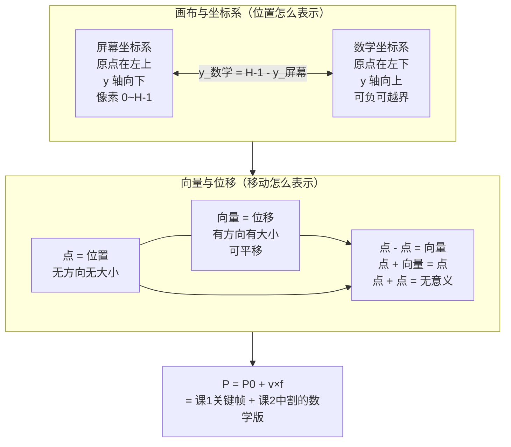

# 第 4 课：点与向量

> 所属阶段：阶段 2《图形数学基础》｜ 水平：零基础
> 本课知识点：画布与坐标系、向量与位移
> 故事情节：手绘工厂（阶段 1）搭完了工艺流水线，但"每一帧画在哪"还是要人来定——阶段 2 工程师开始用数字把位置和移动**算**出来，而不是**画**出来

## 🎯 本课目标

- 说出屏幕坐标系与数学坐标系的差异，并写出二者互转公式
- 区分点（位置）与向量（位移），用向量加法算出平移后的新坐标

---

## 第一幕：起源与场景引入

> 🏛️ **起源**：1963 年，MIT 的 Ivan Sutherland 在博士论文《Sketchpad: A Man-Machine Graphical Communication System》中做出了**第一个交互式绘图程序**——**用户用光笔在屏幕上画图，计算机算出每条线的端点（坐标）并存下来**。这是"图形 = 计算"的起点。（核查于 2026-09；清华 CAD 中心、WPI 计算机图形学史料均记为 MIT 1963）

**场景**：阶段 1 的关键帧 + 律表 + 分层让工艺跑通了，但你做 1 秒 24 帧、3 个图层的动画，意味着每帧要"在正确的位置画正确的东西"——720 张图，每张图的位置都要确定。**手工计算"第 5 帧的右脚应该在 (120, 88)"既慢又错**。

阶段 2 的故事是**用数字把位置和移动算出来**。要做到这一点，第一步必须搞清两件最基础的事：

1. **"位置"在屏幕上怎么表示**（坐标系）
2. **"移动"怎么表示**（向量）

搞不清这两件事，后面所有变换（旋转/缩放/层级）、所有插值（缓动/贝塞尔）都会建立在一个"从一开始就歪了"的地基上。

> 🎬 **场景**：本课是阶段 2 的"认字"课——不教数学，只教"位置"和"移动"在数学里叫什么、怎么写、怎么算。

---

## 第二幕：认知冲突

直觉上，"位置"和"移动"都很简单：
- 位置 = 在哪 → `(x, y)` 两个数
- 移动 = 往哪走多远 → 也是 `(x, y)` 两个数

但等一下：

**冲突 1：同一组数字 (100, 50)，在不同"位置"指不同像素**

你在 Photoshop 里说"在 (100, 50) 画个点"——它在图像里是从**左**边 100 像素、从**上**边 50 像素。
但你写数学代码 `np.array([100, 50])` 然后调 `plt.plot()`——它在数学里是从**左**边 100、从**下**边 50。

**同一个数字 (100, 50)，两个完全不同的位置。**

**冲突 2：旋转方向也反了**

你说"绕中心逆时针旋转 90°"——在数学里逆时针是正方向。
但你看屏幕，角色是顺时针转过去的（因为屏幕 y 向下，旋转看起来"上下颠倒了"）。

> ❓ **问题**：**`点 (x, y)` 和 `向量 (x, y)` 长得一模一样**——它们真的是同一种东西吗？如果是，凭什么点 + 点"没意义"？如果不是，它们有什么区别？

---

## 第三幕：层层揭示

### 知识点 1：画布与坐标系

> 本知识点关键点：屏幕坐标系 y 轴向下 / 数学坐标系 y 轴向上 / 互转公式 / 上下颠倒 bug 的总根源

#### 一句话定义

**画布**是像素网格（每格 = 1 个像素），**坐标系**是给每个像素编址的规则。**屏幕坐标系**原点在左上角、y 轴向下；**数学坐标系**原点在左下角、y 轴向上——两组坐标系互转的公式是 `y_数学 = (H - 1) - y_屏幕`。

#### 直觉建立（类比）

把坐标系想成**地图的方向约定**：

- 屏幕坐标系 = **酒店楼层图**：1 楼在最下，越往上数字越大
- 数学坐标系 = **楼层物理高度**：1 楼在最下，越往上高度数字越大

等等——这两个看起来一样？再想：
- 酒店楼层图是**俯视图**还是**剖面图**？**剖面图**是"楼层数字越大 = 越靠近天花板"（y 向上）。
- 屏幕坐标系是**俯视图**（从上方往下看屏幕）：**第 1 行在最上**（y=0），行数越大 = 越靠近屏幕底部（y 向下）。

所以区别是：**屏幕是"从上往下数"**（行号 0 在顶，y 向下增大），**数学是"从下往上数"**（y=0 在底，向上增大）。

> 💡 **类比的边界**：酒店楼层图是剖面图（向上 = 楼层高），和数学坐标系一致；屏幕坐标是俯视的"行号"系统（行号 0 在顶），和数学相反。

#### 核心原理

**两组坐标系的对照**：

| 特性 | 屏幕坐标系 | 数学坐标系（笛卡尔） |
|------|------------|--------------------|
| 原点位置 | 左上角 | 左下角（或中心） |
| x 轴方向 | 向右 | 向右 |
| **y 轴方向** | **向下** | **向上** |
| 像素/坐标范围 | `(0, 0)` 到 `(W-1, H-1)` | 无范围限制（可负、可越界） |
| 单位 | 像素（整数） | 任意（通常浮点） |
| 主要用途 | 渲染、图像、屏幕 | 数学、变换、物理 |

**互转公式**（画布高 `H` 像素，像素下标 0~H-1）：

```python
def screen_to_math(y_screen, H):
    """屏幕 y（向下）→ 数学 y（向上）"""
    return (H - 1) - y_screen

def math_to_screen(y_math, H):
    """数学 y → 屏幕 y（屏幕 y 从 0 开始，所以也要 -1）"""
    return (H - 1) - y_math
```

> ⚠️ **那个 -1 是 off-by-one 的总源头**：像素下标从 **0** 开始，不是 1；所以"画布顶"是 y=0（数学 y=H-1），"画布底"是 y=H-1（数学 y=0）。**漏掉 -1 = 整幅图偏移 1 像素**——这类 bug 在图形代码里属于"必踩一次"型。

**为什么屏幕 y 向下？历史原因**

1960s 电视和早期 CRT 显示器，**电子束从屏幕左上角开始、一行一行向下扫描**。把坐标系原点放在左上角、y 向下，**就完全匹配电子束的物理扫描路径**——`memory[0]` 直接对应屏幕左上角，零额外换算。后来所有图像格式（位图、PNG、JPEG、帧缓冲）都继承了这个约定。

**为什么数学 y 向上？历史原因**

笛卡尔（17 世纪）画坐标系时，**类比的是地图**——地图上"北"（向上）= 数值更大。**数学 y 向上 = 模拟"越高 = y 越大"**。

两组约定都对，**只是选的方向相反**。问题在于：**你不显式标坐标系时，混用必然出错**。

#### 示例演示

跑一次本课脚本：

```text
coords_compare.png   同一组数字 (100, 50) 在两种坐标系里指向不同像素
y_flip_bug.png       "图片上下颠倒"这个经典 bug 的成因
```

打开 `coords_compare.png`：

- **左半（红，屏幕系）**：点 (100, 50) 出现在画布**上方**——因为 y=50 是从顶往下 50 像素
- **右半（蓝，数学系）**：点 (100, 50) 出现在画布**下方**——因为 y=50 是从底往上 50 像素

**完全一样的数字，两边指向不同位置**——这就是本课最重要的视觉证据。

打开 `y_flip_bug.png`：

- **左半（绿，✅ 正确）**：一个正常的"房子"形状（底在下、顶在上）
- **右半（红，❌ 错误）**：同样的房子数据，**没做 y 翻转** → 上下颠倒

**成因**：两组坐标系"看起来都是 `(x, y)`"，但 y 轴方向相反——数据没标坐标系，渲染时一翻转就全错了。

**工程对策**（避免这类 bug）：

1. 在数据结构里**显式标注坐标系**（"这段数据是屏幕系/数学系"）
2. **只在 I/O 边界做一次转换**（数据进引擎时统一成一种、出去时再转回去）
3. 课 8 实战约定：**所有像素坐标运算用屏幕系；只有与三角函数/角度打交道时才用数学系**

#### 常见误区

1. **"`(x, y)` 就是点，存哪儿都通用"**——错。**`(x, y)` 只是个二元组，它在哪种坐标系里必须有上下文**。`p = (100, 50)` 不知道坐标系 = 不知道指向屏幕哪里。
2. **"屏幕坐标系是'错的'，应该用数学系"**——错。屏幕系是为了匹配硬件（电子束扫描）设计的"对"的坐标系，**只是和数学约定相反**。选哪个用取决于语境（像素操作 vs 数学推导）。
3. **"y 翻转就是 `y = -y`"**——**不一定**。在画布是 `(0,0)` 到 `(W-1, H-1)` 的范围里，翻转是 `y' = (H-1) - y`（**反转 + 平移**），不是单纯的 `y' = -y`（那样会跑到画布外面）。**坐标系翻转 = 反转 + 偏移**，永远别忘偏移。
4. **"画完了才发现上下颠倒，调一下就行"**——**调一下 = 数据全要重做**。坐标系问题要在**写数据之前**就决定，事后切换代价巨大。

#### 一句话记住

> **屏幕 y 向下、数学 y 向上，转换公式 `y_数学 = (H-1) - y_屏幕`，那个 -1 是 off-by-one bug 的总开关——写代码前先把坐标系钉死。**

#### 延伸阅读

- [Coordinate system · Wikipedia](https://en.wikipedia.org/wiki/Coordinate_system)
- [Image coordinate system · Wikipedia](https://en.wikipedia.org/wiki/Image_coordinate_system)
- [CRT 扫描原理 · Wikipedia](https://en.wikipedia.org/wiki/Cathode_ray_tube#Video_display_principle)（了解 y 向下的物理根源）
- 课 5《变换的矩阵表示》——本知识点的数学深化（绕任意点旋转会大量涉及坐标系转换）

---

### 知识点 2：向量与位移

> 本知识点关键点：向量定义与几何含义 / 加法 / 数乘 / 长度与归一化 / 点 + 向量 = 新的点

#### 一句话定义

**点（point）**是空间中的一个**位置**，写作 `(x, y)`，无大小无方向；**向量（vector）**是空间中的一个**位移**（"从这儿到那儿的差"），也写作 `(x, y)`，有大小有方向。**长得一模一样，含义完全不同**——代数规则是区分它们的关键。

#### 直觉建立（类比）

把点和向量想成**地图上的两种符号**：

- **点** = **大头针** ——钉在地图上表示"这里是北京"。无方向，无大小。
- **向量** = **箭头** ——从一个地方指向另一个地方，"从北京到上海 1000 公里向东"。有方向（朝东）、有大小（1000 公里）。

> 💡 **类比的边界**：现实里向量还隐含"力""速度"等含义，数学里向量**只是位移**——可平移（在任何位置画都等价），不绑定起点。本课只用"位移"这一层含义。

#### 核心原理

**代数规则**（这是点和向量的本质区别）：

| 运算 | 结果 | 含义 |
|------|------|------|
| **点 − 点** | **向量** | 两个位置之差 = "从这里到那里" = 位移 |
| **点 + 向量** | **点** | 把点沿着向量方向平移 = 新位置 |
| **向量 + 向量** | **向量** | 位移叠加 = 新的总位移 |
| **向量 − 向量** | **向量** | 位移之差 = 相对位移 |
| **点 + 点** | **无意义** | 两个位置相加没有几何含义 |
| **k × 向量** | **向量** | 数乘 = 缩放长度（k>1 变长、0<k<1 变短、k<0 反向） |

> 💡 **为什么"点 + 点"无意义？** 数学上点没有平移不变性（点 (1,2) 和点 (1,2) 加起来是 (2,4)，**这个 (2,4) 在哪个坐标系里？** 哪个原点？——没法回答）。而向量"只看方向和大小、不看位置"（你可以把箭头从原点搬到任何地方，含义不变）。**课 5 齐次坐标会用一个第 3 个分量（第 3 个数）来强制区分点和向量**——这是工程上的"打补丁"。

**基本运算**：

```python
def vec_add(a, b):     return (a[0] + b[0], a[1] + b[1])     # 加法
def vec_sub(a, b):     return (a[0] - b[0], a[1] - b[1])     # 减法
def vec_scale(v, k):   return (v[0] * k, v[1] * k)           # 数乘
def vec_length(v):     return math.hypot(v[0], v[1])         # 长度
def vec_normalize(v):
    """归一化：得到方向相同、长度为 1 的单位向量"""
    L = vec_length(v)
    return (v[0] / L, v[1] / L) if L > 0 else (0.0, 0.0)
```

**长度（模）**：

`|v| = √(vx² + vy²)` ——勾股定理的二维版。

**归一化**：

`v̂ = v / |v|` ——得到**只保留方向、长度恒为 1**的单位向量。归一化后，向量表示的是"往哪儿走"，不关心"走多远"。

**几何意义速查**：

- **点 + 向量 = 点**：**平移**。这是本课最常用的运算——"已知当前位置 + 位移向量 = 下一位置"。
- **点 - 点 = 向量**：**求位移**。两帧间的位移 = 后一帧位置 − 前一帧位置（这就是 课 1 的间距计算）。
- **数乘**：**缩放长度**。**不缩放位置**——(3, 2) 缩放 2 倍是 (6, 4)，不是某个点被推到 (6, 4)。

#### 示例演示

跑一次本课脚本：

```text
vector_translate/    24 帧，一个方块沿向量 (10.0, 2.5) 匀速平移
vector_ops.png       向量运算总览：加法 / 数乘 / 长度 / 归一化
```

打开 `vector_translate/frame_000.png` 看起点：方块在 (30, 42)，箭头从 P0 指向自己（长度为 0）。
打开 `vector_translate/frame_023.png` 看终点：

- 方块在 **(260, 100)** = `P0 + v×23` = `(30 + 10×23, 42 + 2.5×23)` = `(260, 99.5)`
- 累计位移 **(230, 58)**（= `v × 23`）
- 文字直接给出公式：`P = P0 + v×23 = (260,100)  位移=(230,58)`

**这就是 课 1 关键帧 + 课 2 中割 的数学版本**：已知起点 + 位移向量 = 任意中间帧的位置。

打开 `vector_ops.png` 看四块运算：

1. **① 加法（三角形法则）**：`a + b` 把 a 的终点当 b 的起点，结果是直接连到 a+b 的向量
2. **② 数乘**：`1v`、`0.5v`、`2v` 三条向量同方向，长度比 1:0.5:2
3. **③ 长度与归一化**：紫色 v 长度 150（`|v| = √(120²+90²) = 150`），绿色 v̂ 长度 50 = 单位长度 × 50
4. **④ 点 vs 向量代数规则**：4 条文字规则

#### 常见误区

1. **"`(x, y)` 就是坐标"**——错。**`(x, y)` 是二元组**——可能是点（位置）也可能是向量（位移）。区分要靠**语境**（或课 5 的第 3 个分量）。
2. **"向量就是带方向的点"**——错。**向量没有"位置"概念**——"从原点到 (3, 2) 的向量"和"从 (100, 100) 到 (103, 102) 的向量"是**同一个向量**（平移不变性）。点才有"在哪"的概念。
3. **"归一化 = 把坐标变小"**——错。归一化是让**长度变 1**，不是让**每个分量变 1**。`(3, 4)` 归一化是 `(0.6, 0.8)`（**长度**是 1，`3²+4²=25` → `√25=5` → `3/5, 4/5`）。
4. **"点 + 点 = 点"**——错。**(1, 2) + (3, 4) = (4, 6) 这个结果没有几何含义**——它不是任何位置，也不是任何位移。两个位置相加在物理/几何上不可解释。

#### 一句话记住

> **点 = 位置（在哪），向量 = 位移（怎么走），长得一样、代数不同；点 + 向量 = 新的点，**这是本课唯一必记的公式**。**

#### 延伸阅读

- [Euclidean vector · Wikipedia](https://en.wikipedia.org/wiki/Euclidean_vector)
- [Vector (mathematics and physics) · Wikipedia](https://en.wikipedia.org/wiki/Vector_(mathematics_and_physics))
- [Affine space · Wikipedia](https://en.wikipedia.org/wiki/Affine_space)（解释"为什么点+点无意义"的更严格数学背景）
- 课 5《变换的矩阵表示》——本知识点的数学深化（齐次坐标用第 3 分量区分点和向量）

---

## 第四幕：实操验证

### 运行方式

在 PowerShell 中（先切到课程目录）：

```powershell
cd d:\projects\learning\animation-engine\00-动画与视频基础
.\playground\.venv\Scripts\python.exe .\playground\lesson-04\point_vector_demo.py
```

预期输出（脚本在 Python 3.12.13 + numpy 2.5.2 + pillow 12.3.0 上验证通过）：

```text
=== 知识点 1：画布与坐标系 ===
坐标对比 -> coords_compare.png
  画布高 H=240，像素下标 0~239
  屏幕 y=0   -> 数学 y=239  （公式：y_数学 = (H-1) - y_屏幕）
  屏幕 y=50  -> 数学 y=189  （公式：y_数学 = (H-1) - y_屏幕）
  屏幕 y=239 -> 数学 y=0    （公式：y_数学 = (H-1) - y_屏幕）
上下颠倒 bug -> y_flip_bug.png

=== 知识点 2：向量与位移 ===
平移演示 -> vector_translate/ （24 帧，v=(10.0, 2.5)）
  |v| = √(10.0² + 2.5²) = 10.308
  v̂   = (0.970, 0.243)   |v̂| = 1.000

  P0 + v×f：
    f0  -> (  30.0,  42.0)   累计位移 (  0.0,   0.0)
    f6  -> (  90.0,  57.0)   累计位移 ( 60.0,  15.0)
    f12 -> ( 150.0,  72.0)   累计位移 (120.0,  30.0)
    f23 -> ( 260.0,  99.5)   累计位移 (230.0,  57.5)

向量运算总览 -> vector_ops.png
```

### 怎么翻看

| 文件 | 翻看要点 | 对应知识点 |
|------|----------|------------|
| `coords_compare.png` | 左红（屏幕）vs 右蓝（数学），**同一组 (100,50) 指向不同位置** | 两种坐标系的差异 |
| `y_flip_bug.png` | 左绿（✅ 正确）vs 右红（❌ 颠倒）——同一个房子数据，y 翻不翻结果完全不同 | 上下颠倒 bug 的成因 |
| `vector_translate/frame_000.png` → `frame_023.png` | 方块沿向量 (10, 2.5) 匀速右下移动，**箭头长度 = 累计位移** | 点 + 向量 = 新点（平移） |
| `vector_ops.png` | ① 加法 ② 数乘 ③ 长度+归一化 ④ 代数规则 | 向量四块运算 |

**翻看方式**：
- 3 张图用图片查看器直接打开对比
- 24 帧用 Windows 照片应用 + → 方向键逐张翻（**注意从 f0 到 f23，箭头越来越长，方块越走越远**——这就是"点 + 向量"的几何可视化）

> 📌 **一点说明，免得你以为程序写错了**：
> `vector_translate/` 里**P0 标记（灰色小圆 + "P0" 文字）始终留在起点**——向量箭头从 P0 出发，指向当前方块。**向量本身没有"位置"**——你看到的箭头是"在 P0 位置画的向量 v"，它的几何意义和"在任何其他位置画的 v"是同一个。

### 动手改一改（建议都试一遍）

| 改什么 | 预期看到 | 对应知识点 |
|--------|---------|-----------|
| `VEC = (10.0, 2.5)` 改成 `VEC = (10.0, -2.5)` | 方块**向**上**右移动**（y 减） | 屏幕系 y 向下的直接证据 |
| `START = (30.0, 42.0)` 改成 `START = (160.0, 60.0)` | 方块从画布**中央**出发，对称移动 | 点 = 位置（无方向） |
| `VEC = (10.0, 2.5)` 改成 `VEC = (0.0, 2.5)` | 方块**只**向下移动（x 不变）——向量可以只朝一个方向 | 向量只有大小+方向 |
| 在 `pos_at` 里加 `mod FW` 让 x 越界绕回 | 看超过 320 后"跳回"——和课 1 一样的取模 | 向量加法和 课 1 间距的关系 |
| 把 `render_vector_translate` 复制一份叫 `render_falling`，`VEC` 用 `(0, 5)` 模拟重力 | 演示"恒定向量" = 匀速运动 | 向量 = 速度 |

> ✅ **回扣场景**：现在可以回答开头的问题了。
> - **"第 5 帧的右脚应该在 (120, 88) 怎么算"**——`P_第5帧 = P_第0帧 + v×5`，其中 `v = (P_第5帧 − P_第0帧) / 5`（关键帧之间总位移除以帧数）。**这就是 课 1 关键帧 + 课 2 中割 的纯数学版本**。
> - **"图片上下颠倒"怎么改**——找到写数据时和渲染时用的坐标系，**在 I/O 边界补一个 y 翻转**（要么数据改成屏幕系，要么渲染时把 y 翻成屏幕系）。改完后**画布尺寸变了 -1 也要跟着改**，否则再偏移 1 像素。
> - **"AI 给的位置数据是 (100, 200) 怎么知道是哪一种坐标系"**——**看上下文**（来自哪个工具/谁生成/哪一步产出），或**看数据范围**（屏幕系一般 0..W 或 0..H，数学系可能为负）。**不知道时不要假设**——这就是为什么工程上要在数据结构里**显式标注坐标系**。

---

## 第五幕：体系收束


> 📍 **全局定位**：本课（课 4）是阶段 2 的"**认字**"课——**不教任何新的数学能力，只把"位置"和"移动"在数学里叫什么、怎么写、怎么算讲清楚**。它的全部价值是把后续课（课 5 的矩阵、课 6 的插值）的**地基钉平**。
>
> 关键 insight：
> 1. **坐标系不钉死，后面所有坐标计算都可能是错的**——`y_数学 = (H-1) - y_屏幕` 这一行公式会反复出现。
> 2. **点 vs 向量的代数规则**是后续所有变换的基石——`点 + 向量 = 点` 就是平移，`点 - 点 = 向量` 就是求位移。
> 3. **数学不是凭空复杂**——`P = P0 + v×f` 这行代码就是 课 1 关键帧 + 课 2 中割的纯数学版本（没有"中割师"了）。
>
> 🔗 **下一步**：本课讲了"位置"和"移动"怎么表示，**还没讲"旋转"和"缩放"怎么表示**。课 5 会用**矩阵**统一表达这三种变换——`点 + 向量 = 点` 在矩阵形式下变成 `P' = T·P`（T = 平移矩阵）。而"**平移不是线性变换"这个反直觉的发现**，就是齐次坐标的入口。

---

## 🐞 常见误区

1. **`(x, y)` 就是坐标，存哪儿都通用**——`(x, y)` 是个二元组，在哪种坐标系里必须有上下文；漏标 = 不知道指向哪
2. **屏幕坐标系是'错的'**——屏幕系是为了匹配硬件（电子束扫描）设计的"对"的坐标系，只是和数学约定相反
3. **`y = -y` 就是 y 翻转**——在 (0..H-1) 范围内是 `y' = (H-1) - y`（反转+平移），不能只反转
4. **`(x, y)` 是点，带方向的是向量**——`(x, y)` 可能是点也可能是向量，区分要靠语境
5. **"点 + 点 = 点"**——**(1,2) + (3,4) = (4,6) 这个结果没有几何含义**，既不是位置也不是位移

## 一图总结



## 课后小测

**Q1**：一段 320×240 的图像，你要在屏幕坐标系下"在 (100, 50) 画一个点"。这个点在数学坐标系下（原点左下、y 向上）应该写什么坐标？

- A. (100, 50)
- B. (100, 240-50) = (100, 190)
- C. (100, 240-1-50) = (100, 189)
- D. (100, -(240-1-50)) = (100, -189)

<details><summary>答案与解析</summary>

**答案：C**。屏幕 y=50 在画布高 H=240 的图中，对应数学 y = (H-1) - 50 = 240-1-50 = **189**。**A 错在没转换**；B 错在**漏了 -1**（off-by-one，像素从 0 开始数）；D 错在符号反了（屏幕 y 向下 → 数学 y 向上，**数值更大**才对）。
</details>

**Q2**：已知点 `P1 = (1, 2)`、点 `P2 = (4, 6)`。`P2 - P1` 的值是什么？它的几何意义是？

- A. `(3, 4)`，是从 P1 到 P2 的位移向量
- B. `(5, 8)`，是 P1 + P2 的位置和
- C. `(-3, -4)`，是从 P2 到 P1 的位移向量
- D. `(3, 4)`，是两点之间的欧氏距离

<details><summary>答案与解析</summary>

**答案：A**。`(4-1, 6-2) = (3, 4)` 是从 P1 指向 P2 的位移向量。**B 错在"点+点"无意义**（课 4 知识点 2 的核心规则）；C 符号反了（那是 `P1 - P2`，从 P2 指向 P1）；D 错——`(3, 4)` 是位移向量的分量，欧氏距离是 `|v| = √(3²+4²) = 5`（一个数，不是向量）。
</details>

**Q3**：关于"归一化"（normalize），下列说法正确的是？

- A. 把向量的每个分量都除以 1
- B. 把向量的长度变成 1，但方向保持不变
- C. 归一化后 `(3, 4)` 变成 `(1, 1)`
- D. 归一化只能用于单位向量

<details><summary>答案与解析</summary>

**答案：B**。归一化是 `v̂ = v / |v|`，结果长度 `|v̂| = 1`，方向与 v 相同。**A 错（除以 1 等于没变）**；C 错——`(3, 4)` 归一化是 `(3/5, 4/5) = (0.6, 0.8)`（不是 (1,1)，因为 (1,1) 的方向是 45° 而 (3,4) 是 arctan(4/3)≈53°）；D 错——归一化正是"把任意向量变成单位向量"。
</details>

## 🚀 下一课接力提示词

> 学完本课后，**复制下面这段文字发给 AI**，即可无缝进入下一课（无需重新描述上下文）：

```
继续学 2D 动画与视频基础。我的学习档案在 animation-engine/00-动画与视频基础/00-学习档案.md，
刚学完阶段 2《图形数学基础》的课《点与向量》
（画布与坐标系、向量与位移），
请按大纲继续讲解下一课：课 5《变换的矩阵表示》第一批
（仿射变换的直觉、2D 变换矩阵）。
```

## 🧭 课程导航

⬅️ **上一课**：[课 3：让动作有分量：动画十二原则](../1-动画原理与工业流程/lessons/lesson-03-让动作有分量动画十二原则.md)
➡️ **下一课**：[课 5：变换的矩阵表示](lesson-05-变换的矩阵表示.md)
📚 **返回目录**：[课程目录](../../02-课程目录.md)
