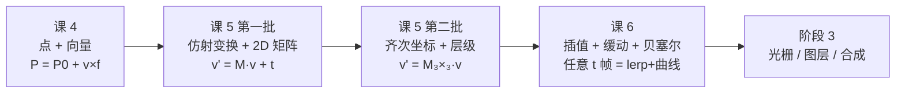

# 第 5 课：变换的矩阵表示

> 所属阶段：阶段 2《图形数学基础》｜ 水平：零基础
> 本课知识点：仿射变换的直觉、2D 变换矩阵、齐次坐标、绕任意点与层级变换
> 故事情节：课 4 把"位置"和"移动"学会了——但引擎还要让角色**旋转、缩放再摆到指定位置**，一个一个改坐标太笨。工程师发现所有变换都能塞进**一个矩阵**里，连乘就是连续变换
> **本课分 2 批讲解**：第一批「为什么矩阵能表示变换 + 基本矩阵形式」、第二批「齐次坐标 + 绕任意点与层级变换」，现已完结

## 🎯 本课目标

- 说清平移为何不是线性变换，以及仿射 = 线性 + 平移
- 手写旋转 / 缩放 / 错切矩阵，解释每个元素的几何含义
- 证明变换顺序不可交换（用脚本实测）
- 用 3×3 齐次矩阵统一表达平移（并区分点 w=1 与向量 w=0）
- 把"绕点 P 旋转"拆成三步矩阵连乘，说明骨骼层级的数学本质

---

## 第一幕：起源与场景引入

> 🏛️ **起源**：1858 年，英国数学家 Arthur Cayley 在《A Memoir on the Theory of Matrices》（发表于 *Philosophical Transactions of the Royal Society*）中**第一次系统地建立了矩阵代数**；20 世纪计算机图形学把它从抽象代数带进工程领域——1963 年 Ivan Sutherland 的 Sketchpad（课 4 已讲）就用矩阵描述图形的旋转和缩放。**"用矩阵 = 用一行代码算一整个变换"**——这是矩阵进入图形学的关键一步。（核查于 2026-09；Cayley 原文见 Phil. Trans. 148, 1858, 17–37）

**场景**：课 4 学会 `P = P0 + v×f`——能算"位置"和"移动"了。但引擎还要做的事是：

> "让角色在第 5 秒**绕中心**逆时针旋转 90°，然后**缩小**到 0.8 倍，再**平移**到 (200, 150)。"

三种变换怎么做？

- 笨办法：旋转用三角函数算新坐标，缩放逐分量乘系数，平移用加法 —— 一次变换一个函数，**每次都得把旧位置读出来、改写回去**
- 聪明办法：**把每种变换都写成一个矩阵**（2×2 或 3×3），连续变换 = **矩阵连乘**。整条链路 `P' = M_n · ... · M_2 · M_1 · P` 一行代码搞定

矩阵的发明不是为了"炫数学"——是为了让**"一连串变换"和"单独一个变换"用同一种语法**表达。理解这一点是阶段 2 数学的钥匙。

> 🎬 **场景**：本课讲"为什么矩阵能表示变换"和"基本矩阵长什么样"。**有一个反直觉点会撞上**——"平移不是线性变换"，这会直接引出知识点 3 的齐次坐标。

---

## 第二幕：认知冲突

直觉上，"变换"就是"改坐标"——旋转就是 (x,y) → (-y, x) 之类，缩放就是 (x,y) → (sx·x, sy·y) 之类，**三种变换各写一个函数就行**。

但等一下，**为什么变换一定要能"用矩阵"统一表达**？

**反直觉 1：平移不是线性变换**

数学上，"线性变换"必须满足两个条件：
- `T(u + v) = T(u) + T(v)`（可加性）
- `T(k·v) = k·T(v)`（齐次性）

两条结合起来有个**必然推论**：`T(0) = 0`（**原点必须映到原点**）。

但**平移** `T(v) = v + t`，代入 v=0 得到 `T(0) = t ≠ 0`（除非 t=0）——**平移把原点挪走了**。所以**平移不是线性变换**。

**这意味着**：旋转/缩放能写成一个 2×2 矩阵乘法（因为它们保持原点不动），**平移不能直接这样写**。

> ❓ **问题 1**：如果平移不能写成矩阵乘法，那"连续旋转 + 缩放 + 平移 = 一个总操作"该用什么公式？

**反直觉 2：变换顺序不可交换**

`先旋转后平移 ≠ 先平移后旋转`。

直觉上"两件事做了"，结果应该一样。但数学上：
- 先旋转后平移：`P' = R·P + t`（**先转 R，转完加 t**）
- 先平移后旋转：`P' = R·(P + t) = R·P + R·t`（**平移向量 t 也被转了！**）

只有当 R·t = t 时两者才相等（即 θ=0 或 t=0）——大多数时候**结果不同**。

> ❓ **问题 2**：凭什么"两件事做了"的顺序会改变结果？我们平时 `f(g(x)) = g(f(x))` 不一定相等吗？

---

## 第三幕：层层揭示

### 知识点 1：仿射变换的直觉

> 本知识点关键点：线性变换的两个条件 / 平移为什么不是线性 / 仿射 = 线性 + 平移 / 几何直觉：网格怎么变形

#### 一句话定义

**仿射变换 = 线性变换 + 平移**。线性变换（旋转/缩放/错切）保持"原点不动、网格线仍直、平行仍平行"；加上平移 t 后，原点可以移动。**"线性"管"形状怎么歪"，"平移"管"挪到哪"**。

#### 直觉建立（类比）

把仿射变换想成**网格变形 + 移动**：

- **线性变换** = 把方格纸拉成平行四边形（格子变歪但还平行、还直）
- **平移** = 把整张变形的方格纸**平移**到新位置

"线性"管"格子怎么歪"，"平移"管"纸去哪"。**两者一前一后组合 = 仿射**。

> 💡 **类比的边界**：所有线性变换都能用 2×2 矩阵表示，但**加上平移后** 2×2 矩阵不够——必须升级到 3×3 矩阵（齐次坐标，见知识点 3）。

#### 核心原理

**线性变换的两个条件**：

| 条件 | 数学表示 | 几何含义 |
|------|---------|----------|
| 可加性 | `T(u + v) = T(u) + T(v)` | 平行四边形的对角线 = 两条边拼起来 |
| 齐次性 | `T(k·v) = k·T(v)` | 直线放大 k 倍 = 每个点放大 k 倍 |

两条结合 → **必然推论 `T(0) = 0`**（原点必须映到原点）。

**为什么平移不是线性**：

```python
T(v) = v + t        # 平移公式
T(0) = 0 + t = t    # 原点被挪到 t，t≠0 时 T(0) ≠ 0  ✗
```

> ⚠️ **关键反直觉**：直觉上"平移也是变换"——但数学定义下"变换 = 线性变换"是狭义概念，**平移属于另一类（仿射）**。这不是文字游戏——这决定了**平移不能直接塞进 2×2 矩阵**。

**仿射 = 线性 + 平移**：

```
仿射变换:  v' = M·v + t
                  ↑       ↑
              线性部分  平移部分
```

**几何直觉：网格怎么变形**：

想象一张方格纸：

- **缩放 1.6×**：方格**变大**，但仍方、仍平行、原点（纸的左下角）不动
- **旋转 30°**：方格**转了**，但仍方、仍平行、原点不动
- **错切 0.5**：方格**歪成平行四边形**（左直右斜），但仍平行、面积不变、原点不动
- **加平移 (45, 25)**：上面变形后的方格**整张挪到新位置**——**原点可以动了**

仿射变换**保持**：
- ✅ 共线性（直线 → 直线）
- ✅ 平行性（平行线 → 平行线）
- ✅ 同一直线上的比例（中点还是中点）
- ❌ 长度（除非是刚体/等比缩放）
- ❌ 角度（旋转除外）
- ❌ 原点位置（平移可以挪）

#### 示例演示

跑一次本课脚本：

```text
linear_vs_affine.png   线性变换（原点不动）vs 仿射变换（原点可动）
```

打开 `linear_vs_affine.png`：

- **左半（红，线性）**：三角形被缩放 1.6× 后，原点（灰色圆）**还在原来的位置**——`T(0) = (0, 0)`
- **右半（蓝，仿射）**：同样缩放 1.6× + 平移 (45, 25) 后，原点（红圆，标着"✗ 原点跑了"）**被挪到了新位置**——`T(0) = (45, 25)`

**控制台实测**（本课脚本的输出）：

```
线性：v' = M·v      → T(0) = (0.0, 0.0)    原点还在原点 ✓
仿射：v' = M·v + t  → T(0) = (45.0, 25.0)  原点被挪走 → 不是线性 ✗
```

**这就是"为什么齐次坐标会出现"的根源**：要把平移塞进矩阵，必须**加一维**（让矩阵从 2×2 升到 3×3）——这正是**知识点 3** 的主题。

#### 常见误区

1. **"平移也是'线性'变换"**——数学定义下不是。日常语言里"线性"指"成直线"，数学里"线性"是"满足可加+齐次"——**平移满足前者但不满足后者**。这导致**平移不能直接写 2×2 矩阵乘法**。
2. **"仿射 = 矩阵 = 一定能用 2×2"**——错。**仿射包含平移，所以必须 3×3 矩阵（齐次坐标）**。**2×2 只能管线性部分**。
3. **"仿射保持距离"**——错。仿射**只保持**共线性、平行性、比例。**长度和角度一般会变**（除非是纯旋转或等比缩放）。
4. **"把变换都当成 v' = M·v 写就行"**——平移那部分写成 v' = M·v + t 才对。**少写 +t 就会让所有图都"卡在原点附近"**。

#### 一句话记住

> **仿射 = 线性 + 平移；线性保持原点不动，平移把原点挪走；"平移不是线性"是齐次坐标的入口。**

#### 延伸阅读

- [Affine transformation · Wikipedia](https://en.wikipedia.org/wiki/Affine_transformation)
- [Linear map · Wikipedia](https://en.wikipedia.org/wiki/Linear_map)（可加性 + 齐次性的严格定义）
- 课 5 第二批《齐次坐标》——本知识点的数学深化（用 3×3 矩阵统一仿射）

---

### 知识点 2：2D 变换矩阵

> 本知识点关键点：2×2 矩阵列的含义 / 缩放·旋转·错切矩阵 / 矩阵乘法 = 变换复合 / 顺序不可交换

#### 一句话定义

**2×2 矩阵能表示所有 2D 线性变换**。**矩阵的列 = 基向量变换后去了哪里**：第 1 列 = `(1,0)` 变换后去哪，第 2 列 = `(0,1)` 变换后去哪。**知道两列就知道整个变换**。连续多个变换 = 多个矩阵**连乘**（顺序敏感，**不能交换**）。

#### 直觉建立（类比）

把矩阵想成**"工厂设备"**——`M · v` 是一次加工，输入原料 v，输出成品 M·v：

- `v = (x, y)` 拆成"x 份基向量 î + y 份基向量 ĵ"
- 矩阵 M 决定 î 和 ĵ **各自去哪儿**（变成 c₁ 和 c₂）
- 成品 = `x · c₁ + y · c₂`

> 💡 **类比的边界**：矩阵不止"搬运基向量"——它会把基向量**重新组合**。但对线性变换，"重新组合"就是"两份原料按系数加"——所以**矩阵列 = 基向量变换后去哪**这个等式是线性代数的核心。

#### 核心原理

**矩阵列 = 基向量变换后去哪**：

```
2×2 矩阵 M = [ c₁  c₂ ]   （c₁, c₂ 是列向量）
M · (1, 0) = c₁          （î 去哪了）
M · (0, 1) = c₂          （ĵ 去哪了）
```

**三种基本 2×2 矩阵**：

| 名称 | 形式 | 几何效果 |
|------|------|----------|
| **缩放** | `M = ⎡ sx  0 ⎤` <br> `   ⎣ 0  sy ⎦` | î → (sx, 0)，ĵ → (0, sy) —— **沿 x/y 轴分别拉/压** |
| **旋转** | `M = ⎡ cosθ  -sinθ ⎤` <br> `   ⎣ sinθ   cosθ ⎦` | î → (cosθ, sinθ)，ĵ → (-sinθ, cosθ) —— **绕原点转 θ** |
| **错切** | `M = ⎡ 1  k ⎤` <br> `   ⎣ 0  1 ⎦` | î → (1, 0) 不变，ĵ → (k, 1) —— **x 方向歪切，y 不变** |

**旋转矩阵的推导**（把"列的含义"用到底）：

"绕原点逆时针转 θ"要求：
- `M · (1, 0) = (cosθ, sinθ)`（x 轴转到 (cosθ, sinθ)）
- `M · (0, 1) = (-sinθ, cosθ)`（y 轴转到 (-sinθ, cosθ)）

所以：

```
旋转矩阵 = [ (cosθ, sinθ)ᵀ , (-sinθ, cosθ)ᵀ ] = ⎡ cosθ  -sinθ ⎤
                                                   ⎣ sinθ   cosθ ⎦
```

> ⚠️ **关于"逆时针"的混淆**：数学系里 θ 逆时针为正。但**屏幕上 y 向下**，所以屏幕上看起来"θ 逆时针"其实是**顺时针方向在视觉上**。课 4 的 y 翻转公式 `y_屏幕 = (H-1) - y_数学` 在这里生效——你在数学上写 `R(30°)`，屏幕上看到的是**顺时针偏 30°**。**这是 90% 旋转 bug 的来源**。

**矩阵乘法 = 变换复合**：

`M₂ · M₁ · v` 的含义是**先应用 M₁，再应用 M₂**（从右往左读）：

- `M₁` 把 v 变成 `M₁·v`
- `M₂` 把 `M₁·v` 变成 `M₂·(M₁·v) = (M₂·M₁)·v`

所以"先缩放再旋转" = `R · S · v`（**先 S 后 R**），写成代码：

```python
S = mat_scale(1.5, 1.5)   # 缩放
R = mat_rotate(theta)      # 旋转
P_final = R @ S @ P        # 先缩放再旋转 = R·S·P
```

**顺序不可交换（重要！）**：

`R · S ≠ S · R`（**一般情况**）：

- `R · S · P = R · (S·P)` = 先缩放后旋转
- `S · R · P = S · (R·P)` = 先旋转后缩放

特例：
- 两个**相同中心**的旋转可交换（因为 R(a)·R(b) = R(a+b) = R(b)·R(a)）
- 两个**均匀缩放**可交换（标量相乘）
- 旋转 + 非均匀缩放一般**不可交换**——缩放后旋转 vs 旋转后缩放"形状"会不同

#### 示例演示

跑一次本课脚本：

```text
basis_vectors.png    2×2 矩阵列的含义 + 缩放/旋转/错切的三种效果
rotation_demo/       24 帧，三角形绕原点旋转一整圈
order_matters/       24 帧，先旋转后平移 vs 先平移后旋转
```

打开 `basis_vectors.png`：

- **左（红，缩放 sx=sy=1.7）**：原方格**等比放大**成更大的方格，两列同方向拉长
- **中（蓝，旋转 35° 数学系逆时针）**：方格**转 35°**（视觉上顺时针）
- **右（绿，错切 k=0.9）**：方格**歪成平行四边形**——只推 î 的 y 分量，格子歪但面积不变

`rotation_demo/frame_012.png` 看旋转中点帧（θ=180°）：三角形完全翻转，原来的右下角变成左上角。

`order_matters/frame_023.png` 看最终帧（θ=90°）：

- **上行（蓝，先旋转后平移 T·R）**：三角形旋转后**平移向量 t 不被旋转** → 位置 = (62, 68)
- **下行（红，先平移后旋转 R·T）**：三角形**先平移到 t，然后整体旋转** → 位置 = (-34, 96)
- **两行相距 100px** —— 顺序不同，**结果就不同**

控制台实测（关键数据）：

```
顺序对比（θ 从 0° 到 90°，t = (62, 34)）：
  f0  θ=  0.0°  T·R→( 96.0, 34.0)  R·T→( 96.0, 34.0)  相距  0.0px
  f8  θ= 31.3°  T·R→( 91.1, 51.7)  R·T→( 64.4, 78.9)  相距 38.2px
  f16 θ= 62.6°  T·R→( 77.6, 64.2)  R·T→( 14.0,100.9)  相距 73.5px
  f23 θ= 90.0°  T·R→( 62.0, 68.0)  R·T→( -34.0, 96.0)  相距 100.0px
```

> 📌 **三个细节，免得你以为程序写错了**：
> 1. `rotation_demo/` 里**视觉上的旋转方向是顺时针**——因为屏幕 y 向下（课 4 的 y 翻转）。数学上 θ 是逆时针为正。
> 2. `order_matters/` 上行蓝色三角形和下行红色三角形**起点都标在原点**——但**变换后的位置**完全不同。两条灰色小"参考线"是原形状（未变换），看的是"被挪到哪"。
> 3. θ=0 时两行**完全重合**——还没转，顺序无影响；**θ>0 后差距越来越大**，到 90° 时 100px。

#### 常见误区

1. **"矩阵的元素就是 (x, y) 坐标"**——错。**矩阵的元素是"基向量变换后去哪"**——是**两列矢量**，不是点的坐标。点的坐标是 M·v 的**结果**。
2. **"旋转 90° 在屏幕上看到的是逆时针"**——错（如果你用 2D 库且不翻 y）。屏幕 y 向下，**逆时针方向在视觉上是顺时针**。
3. **"先旋转后平移 = 先平移后旋转，结果一样"**——错。本课脚本实测：θ=90° 时两者差 100px。
4. **"两个旋转可以交换顺序"**——**绕同一中心**时可交换（因为 R(a)·R(b) = R(a+b)），但**绕不同中心**的两个旋转**不可交换**——这是知识点 4"绕任意点"的入口。
5. **"变换复合就是矩阵连乘"**——对，但**顺序是从右往左**（先写的后执行）。`R·S·v` 是"先 S 后 R"，不是"先 R 后 S"。

#### 一句话记住

> **矩阵的列 = 基向量去哪了；矩阵乘法 = 变换复合（从右往左读）；顺序不同结果不同——本课就是这三句话。**

#### 延伸阅读

- [Transformation matrix · Wikipedia](https://en.wikipedia.org/wiki/Transformation_matrix)
- [Rotation matrix · Wikipedia](https://en.wikipedia.org/wiki/Rotation_matrix)
- [Matrix multiplication · Wikipedia](https://en.wikipedia.org/wiki/Matrix_multiplication)
- 3Blue1Brown《线性代数的本质》—— 01–04 集（B 站 / YouTube 都有，视觉化讲矩阵列的含义）
- 课 5 第二批《齐次坐标 + 绕任意点》——本知识点的数学深化（3×3 统一 + 父子层级）

---

### 知识点 3：齐次坐标

> 本知识点关键点：为什么要加一维 / 3×3 统一平移 / 点 vs 向量（w 的含义）/ 列向量约定

#### 一句话定义

**齐次坐标** = 给 2D 点加一维变成 `(x, y, 1)`，**用 3×3 矩阵统一表达平移/旋转/缩放**。`w=1` 标记**点**（会被平移影响），`w=0` 标记**向量**（平移不变性）——课 4「点+点无意义」在这里有了**代数解释**。

#### 直觉建立（类比）

把齐次坐标想成**"在 2D 平面里加了一个隐藏的第三维"**：

- 你的 2D 点 `(x, y)` 其实生活在 3D 空间里的 `z=1` 平面上
- "平移" 在这个 3D 空间里 = **沿 z=1 平面的切变**（shear）——这**是线性变换**
- 切变是 3D 空间的线性变换 → **能用 3×3 矩阵表示** → 投影回 2D 平面后 = 2D 平移

> 💡 **类比的边界**：齐次坐标的第三维不是真的 z 轴（你看不见），它只是**让平移变得能用矩阵表示**的"打补丁"。点和向量的 w=1/w=0 区别，是这个补丁的关键。

#### 核心原理

**为什么 2×2 装不下平移**（重复第一批的发现）：

```python
T(v) = v + t    # 平移公式
T(0) = t        # 原点被挪走
```

线性变换必须满足 `T(0) = 0`，平移违反。**2×2 矩阵 M 只能管 `M·v` 这类运算**（线性部分），平移的 `+t` 永远游离在外。

**升一维：2D 点 → 3D 齐次点**：

```
(x, y) 点     →  (x, y, 1)  齐次点    （w=1 = 点）
(x, y) 向量   →  (x, y, 0)  齐次向量  （w=0 = 向量）
```

**3×3 矩阵的标准形式**（3D 空间里的线性变换投影回 2D）：

| 名称 | 3×3 矩阵 | 第 3 列含义 |
|------|----------|-------------|
| **平移** | `⎡ 1  0  tx ⎤` <br> `⎢ 0  1  ty ⎥` <br> `⎣ 0  0   1 ⎦` | `tx, ty, 1`ᵀ = **平移向量**（在 w=1 的点上生效）|
| **缩放** | `⎡ sx  0   0 ⎤` <br> `⎢ 0  sy   0 ⎥` <br> `⎣ 0   0   1 ⎦` | `0, 0, 1`ᵀ |
| **旋转** | `⎡ cos -sin  0 ⎤` <br> `⎢ sin  cos  0 ⎥` <br> `⎣  0    0   1 ⎦` | `0, 0, 1`ᵀ |

**仿射的通用形式**（左上 2×2 = 线性，右上 2×1 = 平移）：

```
M = ⎡ a  b  tx ⎤
    ⎢ c  d  ty ⎥
    ⎣ 0  0   1 ⎦
```

**点和向量的代数区分**（课 4 的延续）：

- 点 `(x, y, 1)` 乘以平移矩阵 → 位置**真的改变**（第 3 列 × 1 = 第 3 列 = `tx, ty, 1`）
- 向量 `(x, y, 0)` 乘以平移矩阵 → **纹丝不动**（第 3 列 × 0 = `0, 0, 0`）

这就是课 4「向量有平移不变性」的**几何来源**——w=0 让平移矩阵的"平移贡献"被屏蔽为 0。

> 💡 **课 4「点+点无意义」的代数解释**：两个点 `(x₁, y₁, 1) + (x₂, y₂, 1) = (x₁+x₂, y₁+y₂, 2)` ——**结果不是标准齐次形式**（w≠1）。要变成标准点还得除以 2 = `(x̄, ȳ, 1)`（**仿射组合**），这说明"两个点相加"在齐次坐标下"无意义"（除非除以 w 让它变成点的中点）。**齐次坐标解释了为什么"点+点"的几何意义需要慎重**。

**列向量约定**：

```
P' = M · P   （3×3 矩阵 左乘 3×1 列向量）
```

读法：P 是个 3×1 列向量（x, y, 1）ᵀ，M 是 3×3，结果是新的 3×1 列向量。

#### 示例演示

跑一次本课脚本：

```text
homogeneous_compare.png    2×2 装不下平移 vs 3×3 统一三种变换
point_vs_vector_homo.png   齐次坐标下点(w=1) 与 向量(w=0) 在平移下的区别
```

打开 `point_vs_vector_homo.png` 看核心对比：

- **点 (30, 40, 1)** 被 T(60, -20) 平移后变 **(90, 20, 1)** —— 位置真变了
- **向量 (30, 40, 0)** 被 T(60, -20) 平移后 **仍 (30, 40, 0)** —— 纹丝不动

控制台实测（关键验证）：

```
点   (10,10,1) --T(40,20)--> (50, 30, 1)    被平移了 ✓
向量 (10,10,0) --T(40,20)--> (10, 10, 0)     纹丝不动 ✓  ← w=0 让平移第 3 列乘 0
```

这就是"**一个数字 w 就能区分点和向量**"的代数证据——同时也是课 4"向量有平移不变性"的几何来源。

#### 常见误区

1. **"齐次坐标是 3D 坐标"**——错。齐次坐标只是**数学技巧**，把 2D 操作嵌入 3D 表达。**点的物理意义仍 2D**，第三维是"形式上的维度"。
2. **"w 必须永远是 1"**——错。`w=1` 是**点**，`w=0` 是**向量**（平移不变性）。w 也可以是其他值（透视投影里就是 w≠1）。
3. **"3×3 矩阵 = 3D 变换"**——不一定。3×3 齐次矩阵投影回 2D 后**仍是 2D 仿射变换**——只是表达方式升级了。
4. **"齐次坐标能解决所有问题"**——**不能解决透视**（那需要 4×4 矩阵 + w 透视除法）。3×3 齐次坐标只能管**仿射变换**（直线 → 直线、平行 → 平行）；**透视变换需要 4×4**。
5. **"点+点=点"在齐次坐标下有意义**——错。除以 w 后变成中点，**不是简单的"位置相加"**。

#### 一句话记住

> **齐次坐标加一维，让平移也能进矩阵；w=1 标记点（被平移影响）、w=0 标记向量（平移不变性）——这是 2D 仿射变换的完整表达。**

#### 延伸阅读

- [Homogeneous coordinates · Wikipedia](https://en.wikipedia.org/wiki/Homogeneous_coordinates)
- [Affine transformation · Wikipedia](https://en.wikipedia.org/wiki/Affine_transformation)（看"In matrix form"小节的标准 3×3 形式）
- 《Mathematics for 3D Game Programming and Computer Graphics》Eric Lengyel（齐次坐标 + 仿射的工程视角）
- 课 6《插值·缓动·贝塞尔》——本知识点的应用（用 3×3 矩阵驱动关键帧补间）

---

### 知识点 4：绕任意点与层级变换

> 本知识点关键点：T(P)·R(θ)·T(-P) 三步连乘 / 父子层级的矩阵连乘 / 矩阵栈 / 骨骼动画的雏形

#### 一句话定义

**绕任意点 P 旋转 θ = 三步矩阵连乘** `M = T(P) · R(θ) · T(-P)`（从右往左：先把 P 移到原点、转 θ、再移回去）。**父子层级变换 = 子的世界变换 = 父的世界变换 × 子的局部变换**——这就是骨骼动画的数学基础（"父动带动子动"）。

#### 直觉建立（类比）

把"绕任意点旋转"想成**"假装该点是原点"**：

1. 把"自定义原点"P **平移到世界原点**（T(-P)）—— 假装 P 就是原点
2. 绕世界原点旋转 θ（R(θ)）—— 用 2×2 旋转矩阵
3. **平移回原位**（T(P)）—— 把"假装"撤销

**层级变换**想成**俄罗斯套娃**：
- 每个关节有"自己的小坐标系"（局部）
- 父关节的世界变换 = 父的父 × 父的局部
- **子关节的世界变换 = 父的世界变换 × 子的局部变换**
- 父动了 → 整条链上的子都跟着动（"父动 → 子跟" = 骨骼动画的核心）

> 💡 **类比的边界**：层级链是**单向**的（父影响子），子不动不影响父。这与"对象组合"（双向引用）不同。

#### 核心原理

**绕任意点 P 旋转 θ 的三步**：

```
M = T(P) · R(θ) · T(-P)
   ①平移到原点  ②绕原点转   ③平移回去
   (从右往左执行)
```

为什么是三步（而不是更多）？
- 第 1 步 `T(-P)`：把 P 移到原点 —— 这样才能用 2D 旋转矩阵（默认绕原点转）
- 第 2 步 `R(θ)`：标准的 2D 旋转
- 第 3 步 `T(P)`：把"假装"撤销，让结果在原 P 的位置

**⚠ 顺序敏感**：`T(-P)·R(θ)·T(P)`（顺序反了）会得到完全不同的结果。这是课 5 第一批"顺序不可交换"在 P 旋转上的具体体现。

**父子层级的矩阵连乘**：

```python
# 例：肩 → 肘 → 腕 → 指尖（3 段手臂）
M_shoulder = mat3_translate(shoulder_x, shoulder_y)    # 根：肩在世界的位置
M_upper    = M_shoulder @ mat3_rotate(θ₁)                # 上臂（肩下 θ₁ 角）
M_forearm  = M_upper    @ mat3_translate(L_upper, 0) @ mat3_rotate(θ₂)   # 前臂
M_hand     = M_forearm  @ mat3_translate(L_fore, 0) @ mat3_rotate(θ₃)   # 手
```

每一级的"世界变换" = **父的世界变换 × 自己的局部变换**（局部 = 长度 + 自己的旋转）。

**矩阵栈（Matrix Stack）**：

绘制引擎（如 OpenGL、Canvas2D）里通常有一个"当前变换矩阵"的栈：

- `push()`：把当前矩阵压栈（保存现场）
- 绘制子物体：乘以子物体的局部变换
- `pop()`：弹出栈（恢复现场，继续画别的物体）

> 这是**递归绘制**的基础：每层 push/pop 一对，层级多深都不乱。

**骨骼动画的雏形**：

层级连乘 = 骨骼的数学本质。真实骨骼动画（如 Spine、Live2D）做的事情是：
1. 为每个骨骼节点设置**局部变换**（长度 + 关节角）
2. 每帧重算**世界变换链** = 父的世界 × 自己的局部
3. 用最终的世界变换**驱动顶点位置**

> 本课脚本的 `hierarchy_demo/` 就是这个的最小可运行演示——3 段连乘链（肩→肘→腕→指尖）随时间摆动。

#### 示例演示

跑一次本课脚本：

```text
rotate_around_point/    24 帧，上行 ❌ 只用 R(θ) → 形状被甩出去 vs 下行 ✅ T(P)·R·T(-P) 绕 P 自转
hierarchy_demo/         24 帧，肩→肘→腕→指尖 的父子层级矩阵连乘（摆动）
```

打开 `rotate_around_point/frame_012.png` 看 θ=180° 时的对比：

- **上行（红）**：形状**绕原点转** —— 三角形的中心（旋转中心）固定在画布原点附近，**形状被甩到画布上方**
- **下行（绿）**：形状**绕 P 转** —— 三角形的中心（黑点 P）**始终钉在 P 的位置**，形状绕 P 自转

控制台实测（关键数据）：

```
θ=90° 时顶点 (34, 0)：
  只用 R(θ)         → ( 0.0,  34.0)   ← 被甩出去了
  T(P)·R·T(-P)      → (97.0, -19.0)   ← 绕 P 自转，中心不动
```

打开 `hierarchy_demo/frame_012.png` 看层级摆动：肩/肘/腕颜色渐变（深→浅），**整条手臂随时间摆动**——这就是"父动 → 子跟"的视觉效果。

控制台实测（层级链几何关系，θ 全为 0 时）：

```
层级链（θ 全为 0 时，验证父子关系）：
  肘    局部(30,0) → 世界 ( 70.0,  52.0)
  腕    局部(24,0) → 世界 ( 94.0,  52.0)
  指尖  局部(14,0) → 世界 (108.0,  52.0)
```

> 📌 **两点说明，免得你以为程序写错了**：
> 1. `rotate_around_point/` 上下两行的**原形状**都是同一个（只画一次，灰色），**变换后的位置**完全不同。
> 2. `hierarchy_demo/` 三个骨段**粗细递减**（肩→肘最粗，腕→指尖最细）——这是引擎里画骨骼的常用技巧，便于**看出层级关系**。

#### 常见误区

1. **"绕任意点旋转 = R(θ) 就行"**——错。**必须三步** `T(P)·R(θ)·T(-P)`。否则形状会绕原点转，**离 P 越来越远**。
2. **"M_parent · M_child 与 M_child · M_parent 一样"**——错（第一批已证）。**`M_父 × M_子局部` ≠ `M_子局部 × M_父`**。层级关系靠顺序定义。
3. **"矩阵栈 = 栈内存"**——不是。**矩阵栈 = 变换状态的保存/恢复**。绘制一个子物体前 push，绘制后 pop，**让别的子物体不受影响**。
4. **"骨骼动画 = 3D 才有"**——错。**2D 骨骼（Spine、Live2D）**完全是同样的数学：父的世界变换 × 子的局部变换。本课脚本的 `hierarchy_demo/` 就是 2D 骨骼的最小演示。
5. **"层级 = 父的变换"**——错。**层级是父子关系的复合**（连乘），不是"父的东西"。子有自己的局部变换（关节角），叠加在父之上。

#### 一句话记住

> **绕任意点 = T(P)·R(θ)·T(-P) 三步连乘；父子层级 = M_父 × M_子局部**——两件事合起来就是骨骼动画的数学骨架。

#### 延伸阅读

- [Transformation matrix · Wikipedia](https://en.wikipedia.org/wiki/Transformation_matrix)（"Composition of transformations" 一节是 3×3 矩阵连乘的标准参考）
- [Skeleton (computer graphics) · Wikipedia](https://en.wikipedia.org/wiki/Skeleton_(computer_graphics))（2D/3D 骨骼动画的统一数学）
- 《Real-Time Rendering》Möller / Haines / Hoffman（矩阵栈 + 场景图）
- 需求文档第七节（"按 Z 轴深度排序"）——本知识点的应用（深度 = 变换后 z 分量）

---

## 第四幕：实操验证

### 运行方式

本批有 **2 个脚本**（第一批 1 个 + 第二批 1 个）。在 PowerShell 中分别运行：

```powershell
cd d:\projects\learning\animation-engine\00-动画与视频基础
# 第一批：仿射变换的直觉、2D 变换矩阵
.\playground\.venv\Scripts\python.exe .\playground\lesson-05\transform_demo.py
# 第二批：齐次坐标、绕任意点与层级变换
.\playground\.venv\Scripts\python.exe .\playground\lesson-05\homogeneous_demo.py
```

**`transform_demo.py`（第一批）的预期输出**（脚本在 Python 3.12.13 + numpy 2.5.2 + pillow 12.3.0 上验证通过）：

```text
=== 知识点 1：仿射变换的直觉 ===
线性 vs 仿射 -> linear_vs_affine.png
  线性：v' = M·v      → T(0) = (0.0, 0.0)    原点还在原点 ✓
  仿射：v' = M·v + t  → T(0) = (45.0, 25.0)  原点被挪走 → 不是线性 ✗

=== 知识点 2：2D 变换矩阵 ===
矩阵列的含义 -> basis_vectors.png
  旋转 90°：î=(1,0) → (0, 1)    ĵ=(0,1) → (-1, 0)
  （第 1 列就是 î 去哪、第 2 列就是 ĵ 去哪 —— 这就是矩阵列的几何含义）

旋转动画 -> rotation_demo/ （24 帧，绕原点转一整圈）
顺序不可交换 -> order_matters/ （24 帧，上行 T·R / 下行 R·T）

  顺序对比（θ 从 0° 到 90°，t = (62, 34)）：
    f0  θ=  0.0°  T·R→(  96.0, 34.0)  R·T→(  96.0, 34.0)  相距   0.0px
    f8  θ= 31.3°  T·R→(  91.1, 51.7)  R·T→(  64.4, 78.9)  相距  38.2px
    f16 θ= 62.6°  T·R→(  77.6, 64.2)  R·T→(  14.0,100.9)  相距  73.5px
    f23 θ= 90.0°  T·R→( 62.0, 68.0)  R·T→( -34.0, 96.0)  相距 100.0px

  -> θ=0 时两者相同（还没转）；θ>0 后越差越远
```

**`homogeneous_demo.py`（第二批）的预期输出**：

```text
=== 知识点 3：齐次坐标 ===
2×2 vs 3×3 -> homogeneous_compare.png
  点   (10,10,1) --T(40,20)--> (50, 30, 1)   被平移了 ✓
  向量 (10,10,0) --T(40,20)--> (10, 10, 0)     纹丝不动 ✓  ← w=0 让平移第 3 列乘 0

点 vs 向量（齐次）-> point_vs_vector_homo.png

=== 知识点 4：绕任意点 + 层级变换 ===
绕任意点 -> rotate_around_point/ （24 帧，上行绕原点 vs 下行绕 P）
  θ=90° 时顶点 (34,0)：
    只用 R(θ)      → (   0.0,   34.0)   ← 被甩出去了
    T(P)·R·T(-P)  → (  97.0,  -19.0)   ← 绕 P 自转，中心不动

层级变换 -> hierarchy_demo/ （24 帧，肩→肘→腕→指尖）

  层级链（θ 全为 0 时，验证父子关系）：
    肘  局部(30,0) → 世界 (  70.0,  52.0)
    腕  局部(24,0) → 世界 (  94.0,  52.0)
    指尖 局部(14,0) → 世界 ( 108.0,  52.0)

  -> 子的世界坐标 = 父的世界变换 × 子局部变换（矩阵连乘，顺序敏感）
```

### 怎么翻看

| 文件 | 翻看要点 | 对应知识点 |
|------|----------|------------|
| `linear_vs_affine.png` | 左红（线性）原点不动 vs 右蓝（仿射）原点被挪 | 仿射 = 线性 + 平移 |
| `basis_vectors.png` | 缩放 / 旋转 / 错切 三种矩阵的列变化和网格变形 | 2×2 矩阵的列 = 基向量去哪 |
| `rotation_demo/frame_000.png` → `frame_023.png` | 三角形绕原点转一整圈（视觉上顺时针，因为屏幕 y 向下） | 旋转矩阵 M = [cos -sin; sin cos] |
| `order_matters/frame_000.png` → `frame_023.png` | 上行（蓝，T·R）vs 下行（红，R·T）**θ=0 时重合，θ=90° 时差 100px** | 顺序不可交换 |
| `homogeneous_compare.png` | 左：2×2 装不下平移；右：3×3 三种矩阵形式 + 仿射通用形式 | 齐次坐标的动机 |
| `point_vs_vector_homo.png` | **点（灰→蓝）被平移挪走，向量（灰→绿箭头）纹丝不动** | w=1 点 / w=0 向量 |
| `rotate_around_point/frame_012.png` | 上行（红）绕原点转被甩走 vs 下行（绿）绕 P 自转 | T(P)·R(θ)·T(-P) |
| `hierarchy_demo/frame_012.png` | 肩→肘→腕→指尖 三段粗细递减，**整条链一起摆** | 父子层级矩阵连乘 |

**翻看方式**：
- 4 张图用图片查看器直接打开对比
- 24 帧用 Windows 照片应用 + → 方向键逐张翻
- `order_matters/` 重点对比 `frame_000.png`（两行重合）和 `frame_023.png`（两行差 100px）
- `rotate_around_point/` 重点对比 `frame_012.png`（θ=180°，两行彻底分开）

> 📌 **四点说明，免得你以为程序写错了**：
> 1. `rotation_demo/` 里 θ 是**数学系逆时针**，但**屏幕上看到的是顺时针**——这是课 4 y 翻转的必然结果（不是 bug）。
> 2. `order_matters/` 的两行**起点都标在原点**（同一个灰色圆点），但**变换后的三角形位置完全不同**——这是"顺序决定位置"的直接证据。
> 3. `point_vs_vector_homo.png` 里向量画了**一个起点**（灰色箭头起点），但**向量的几何意义与起点无关**——画在某处只是为了可视化。
> 4. `hierarchy_demo/` 三个骨段**粗细递减**（肩最粗、指尖最细），这是引擎里画骨骼的常用技巧，便于看出层级。

### 动手改一改（建议都试一遍）

| 改什么 | 预期看到 | 对应知识点 |
|--------|---------|-----------|
| `mat_scale(1.7, 1.7)` 改成 `mat_scale(1.7, 0.5)` | basis_vectors 左图从"放大方格"变成"横向拉、纵向压"的扁格 | 缩放矩阵的对角元素 |
| `mat_rotate(th)` 改成 `mat_shear(0.9)` | basis_vectors 中图从"旋转方格"变成"错切平行四边形" | 错切矩阵 |
| `theta = 2 * math.pi * f / TOTAL` 改成 `theta = -2 * math.pi * f / TOTAL` | 旋转方向**反过来**（视觉上从顺时针变逆时针） | 屏幕 y 翻转对旋转方向的影响 |
| 在 `order_matters` 里把 `TVEC = np.array([62.0, 34.0])` 改成 `[0, 0]` | 两行**永远完全重合**——平移向量为 0 时顺序无影响 | 顺序影响的来源是 t |
| 把 `order_matters` 的 `theta = math.radians(90) * f / (TOTAL - 1)` 改成 `math.radians(180) * f / (TOTAL - 1)` | θ 到 180°，**两行相距 0**——180° 的 R 把 t 转到了 -t 方向但长度一样，**距离恰好抵消** | 旋转角度对距离的影响 |
| 把 `rotation_demo` 里旋转中心 `(cx, cy) = (70, 78)` 改成 `(70, 28)` | 三角形绕"靠近画布顶部"的点转，会**部分飞出画布** | 旋转中心的重要性（引出绕任意点） |
| `homo_point(10, 10)` 改成 `homo_vector(10, 10)` 再乘平移矩阵 | 结果**不变**——w=0 屏蔽了平移贡献 | 向量平移不变性 |
| `rotate_around` 里把 `T(P)·R·T(-P)` 顺序改成 `T(-P)·R·T(P)` | 三角形**跑到完全不同的位置** | 三步连乘的顺序不可交换 |
| `rotate_around` 里把 `T(P)` 那一步删掉（只留 `R(θ)·T(-P)`） | 三角形**绕原点转并偏移** | 三步缺一不可 |
| `hierarchy_demo` 里把 `th2`（前臂角）改成 `0` | 前臂**永远伸直**，不再相对上臂弯曲 | 子关节角是"相对父的" |
| `hierarchy_demo` 里把 `M_fore = M_upper @ ...` 改成 `M_fore = mat3_translate(LEN_UPPER, 0) @ mat3_rotate(th2) @ M_upper` | 前臂**脱离上臂**独立运动（层级关系被破坏） | 层级靠"父在前、子在后"的乘法顺序定义 |

> ✅ **回扣场景**：现在可以回答开头的问题了。
> - **"让角色在第 5 秒绕中心逆时针 90°，再缩放 0.8，再平移到 (200, 150)"**——整条链用 3×3 连乘即可：`M = T(200,150) · S(0.8) · T(P) · R(90°) · T(-P)`（**从右往左执行**：先把中心 P 移到原点 → 转 90° → 移回 → 缩放 0.8 → 平移到目标）。绕"中心"P 就是 `T(P)·R(θ)·T(-P)` 三步。
> - **"为什么旋转了但方向反了"**——90% 是**没考虑屏幕 y 向下**。解决：要么翻转 y 再算数学旋转，要么用"屏幕系的旋转矩阵"（sin 符号反过来）。
> - **"为什么多个角色一起动就乱"**——每个角色有独立的"基位置"和"变换链"，混在一起会互相干扰。**层级变换**就是答案：父子矩阵连乘 + 矩阵栈 push/pop，**父动 → 子跟着动**。
> - **"AI 给了我 P₀=(10, 20)，θ=30°，P 怎么算"**——`P = mat3_rotate(π/6) @ homo_point(10, 20)`。**注意第 3 分量必须是 1（点）**——若误写成 `homo_vector`（w=0），平移部分会被屏蔽。
> - **"骨骼动画怎么让手跟着肩膀动"**——父子层级连乘：`M_手 = M_肩 · T(臂长) · R(θ₁) · T(前臂长) · R(θ₂) · T(手长) · R(θ₃)`。肩一转，整条链上的子都跟着转——本课 `hierarchy_demo/` 就是这个的最小演示。

---

## 第五幕：体系收束



> 📍 **全局定位**：本课（课 5）回答了**四个问题**，构成"用矩阵统一所有变换"的完整链条：
>
> | 知识点 | 回答的问题 | 本质 |
> |--------|-----------|------|
> | 仿射变换的直觉 | **线性 vs 平移** | 仿射 = 线性 + 平移；平移不是线性（T(0)=t≠0） |
> | 2D 变换矩阵 | **变换怎么写成矩阵** | 矩阵的列 = 基向量去哪；乘法 = 复合（顺序敏感） |
> | 齐次坐标 | **平移怎么进矩阵** | 加一维 (x, y, 1)；点 w=1、向量 w=0 |
> | 绕任意点与层级变换 | **复杂变换怎么组合** | `T(P)·R·T(-P)`；父子连乘 = 骨骼动画的数学基础 |
>
> 四步串起来：**"平移不是线性" → 升一维让它线性 → 3×3 统一三种变换 → 连乘处理层级**。这就是引擎里"一个角色完整变换"的实现路径。
>
> 🔗 **下一步**：本课解决了"**单个变换和变换链怎么算**"（静态几何）。但**还没有"时间"**——关键帧之间的中间状态怎么算？为什么迪士尼的球"有重量感"、你的像在飘？**课 6《插值、缓动与贝塞尔》**就是答案：`lerp` 算出中间位置、**缓动函数**对应"慢入慢出"、**贝塞尔曲线**把锯齿折线变成平滑弧线。

---

## 🐞 常见误区

1. **"平移也是线性变换"**——数学定义下不是；T(0)=t≠0 违反可加+齐次
2. **"仿射 = 矩阵 = 2×2 就够"**——错；**仿射含平移，必须 3×3 矩阵**（齐次坐标）
3. **"矩阵的元素就是 (x, y) 坐标"**——错；**矩阵的列 = 基向量变换后去哪**，点的坐标是 M·v 的**结果**
4. **"屏幕 y 向下时，逆时针旋转在屏幕上是逆时针"**——错；**视觉上变成顺时针**（课 4 的 y 翻转）
5. **"先旋转后平移 = 先平移后旋转"**——错；本课脚本实测 θ=90° 时两者差 100px
6. **"齐次坐标是 3D 坐标"**——错；只是数学技巧，物理意义仍是 2D，第三维是形式维度
7. **"w 必须永远是 1"**——错；**w=1 是点、w=0 是向量**（平移不变性），透视里 w 还可以是别的值
8. **"绕任意点旋转 = R(θ) 就行"**——错；**必须三步** `T(P)·R(θ)·T(-P)`，否则形状绕原点被甩走
9. **"M_父 × M_子局部 = M_子局部 × M_父"**——错；**顺序定义层级关系**，反了层级就断了
10. **"骨骼动画是 3D 才有的"**——错；**2D 骨骼（Spine、Live2D）**是同样的数学：父的世界变换 × 子局部

## 一图总结

```mermaid
flowchart TD
    subgraph L["仿射变换 = 线性 + 平移"]
        L1[线性变换<br/>T(u+v) = T(u)+T(v)<br/>T(k·v) = k·T(v)<br/>→ T(0) = 0 原点不动]
        L2[平移<br/>T(v) = v + t<br/>T(0) = t ≠ 0 → 不是线性]
        L1 --> L3[仿射 = 线性 + 平移<br/>v' = M·v + t]
        L2 --> L3
    end
    
    subgraph M["2D 变换矩阵"]
        M1[矩阵的列 = 基向量去哪<br/>第1列 = M·(1,0)<br/>第2列 = M·(0,1)]
        M2[缩放 ⎡sx  0⎤<br/>       ⎣0  sy⎦]
        M3[旋转 ⎡cos -sin⎤<br/>       ⎣sin  cos⎦]
        M4[错切 ⎡1  k⎤<br/>       ⎣0  1⎦]
        M1 --> M2
        M1 --> M3
        M1 --> M4
    end
    
    subgraph O["变换复合"]
        O1["矩阵乘法 M₂·M₁·v<br/>= 先 M₁ 后 M₂（从右往左）"]
        O2["顺序不可交换<br/>R·S ≠ S·R<br/>（一般情况）"]
        O1 --> O2
    end
    
    subgraph H["齐次坐标：加一维"]
        H1[2×2 装不下平移<br/>+t 游离在矩阵外]
        H2[升到 3×3<br/>点 (x,y,1) / 向量 (x,y,0)]
        H3[w=1 点：被平移影响<br/>w=0 向量：平移不变性]
        H1 --> H2 --> H3
    end
    
    subgraph T["复合与层级"]
        T1["绕任意点 P：<br/>T(P)·R(θ)·T(-P)"]
        T2["父子层级：<br/>M_子世界 = M_父世界 × M_子局部"]
        T3["矩阵栈 push/pop<br/>= 骨骼动画雏形"]
        T1 --> T2 --> T3
    end
    
    L --> M
    M --> H
    H --> T
    T --> O
    O --> N["本课四句话：<br/>① 仿射 = 线性 + 平移<br/>② 矩阵列 = 基向量去哪<br/>③ 齐次坐标 w 区分点/向量<br/>④ 顺序不可交换（层级靠顺序）"]
```

## 课后小测

**Q1**：关于"平移"和"线性变换"的关系，下列说法正确的是？

- A. 平移满足可加性 `T(u+v) = T(u)+T(v)`，所以是线性变换
- B. 平移不满足 `T(0) = 0`，所以不是线性变换
- C. 平移可以用 2×2 矩阵表示
- D. 平移和旋转合起来才能写 2×2 矩阵

<details><summary>答案与解析</summary>

**答案：B**。平移 `T(v) = v + t` 代入 v=0 得 `T(0) = t ≠ 0`（除非 t=0），违反线性变换的必要条件 `T(0) = 0`，所以不是线性变换。**A 错**：平移确实满足可加性（`T(u+v) = u+v+t = T(u)+T(v)`），但**只满足可加性不够**，必须**可加+齐次同时**才叫线性；**C 错**：平移不能直接写 2×2 矩阵（需要齐次坐标升到 3×3）；**D 错**：单个平移和单个旋转**各自不能**用 2×2 矩阵写，但 2×2 矩阵**可以**管"旋转"和"缩放"——平移是 2×2 装不下的那个。
</details>

**Q2**：2×2 矩阵 `M = [[0, -1], [1, 0]]` 表示什么变换？

- A. 顺时针旋转 90°
- B. 逆时针旋转 90°
- C. 沿 y 轴翻转
- D. 缩放 (1, -1)

<details><summary>答案与解析</summary>

**答案：B**。矩阵列 = 基向量去哪：`M·(1,0) = (0, 1)`、`M·(0,1) = (-1, 0)`。这正是逆时针旋转 90° 的旋转矩阵 `[[cos90°, -sin90°], [sin90°, cos90°]] = [[0, -1], [1, 0]]`。**A 错**（顺时针 = θ=-90° = `[[0, 1], [-1, 0]]`）；**C 错**（沿 y 翻转 = `[[-1, 0], [0, 1]]` 之类的，不是这个）；**D 错**（缩放矩阵对角线是缩放系数）。
</details>

**Q3**：先平移后旋转 (`R·T·v`) 和先旋转后平移 (`T·R·v`)，结果的关系是？

- A. 完全相同
- B. `R·T·v = T·R·v + t`（差一个 t）
- C. `R·T·v = T·R·v + R·t`（平移向量也被旋转了）
- D. 取决于矩阵是否对称

<details><summary>答案与解析</summary>

**答案：C**。`R·T·v = R·(v + t) = R·v + R·t`，而 `T·R·v = R·v + t`。两者差 `R·t - t`。**只有当 R·t = t（即 θ=0 或 t=0）时才相等**。A 错（一般不等）；B 错的（差不是 t 而是 R·t - t）；D 错（旋转矩阵本身不对称，但与对称无关）。
</details>

**Q4**：关于齐次坐标中第 3 个分量 `w` 的含义，下列说法正确的是？

- A. w=1 表示向量，w=0 表示点
- B. w=1 表示点（会被平移影响），w=0 表示向量（平移不变性）
- C. w 只能是 1，没有其他取值
- D. w 表示 z 轴坐标（3D 深度）

<details><summary>答案与解析</summary>

**答案：B**。平移矩阵第 3 列是 `(tx, ty, 1)ᵀ`：乘在 `w=1` 的点上 → 位置真的 `+t`；乘在 `w=0` 的向量上 → 第 3 列 × 0 = 0，**平移贡献被屏蔽**（这就是课 4「向量有平移不变性」的几何来源）。**A 说反了**；**C 错**（w 可取 0/1，透视投影里还可以是别的值）；**D 错**（w 不是 3D 深度，只是让平移能写进矩阵的形式维度）。
</details>

**Q5**：要"绕任意点 P 旋转 θ"，正确的矩阵是？

- A. `R(θ)`
- B. `T(P)·R(θ)`
- C. `T(P)·R(θ)·T(-P)`
- D. `R(θ)·T(P)·T(-P)`

<details><summary>答案与解析</summary>

**答案：C**。三步（**从右往左**执行）：① `T(-P)` 把 P 移到原点 → ② `R(θ)` 绕原点转 → ③ `T(P)` 移回去。**A 错**（只绕原点转，形状会被甩走，本课脚本上行红三角就是反例）；**B 错**（缺第①步，P 没被移到原点就转）；**D 错**（顺序反了——`R(θ)` 先执行，但此时 P 还没归位）。
</details>

**Q6**：在父子层级变换（如肩 → 肘 → 腕）中，子物体的**世界变换**等于？

- A. 子的局部变换 × 父的世界变换
- B. 父的世界变换 × 子的局部变换
- C. 父的世界变换 + 子的局部变换
- D. 子的局部变换（与父无关）

<details><summary>答案与解析</summary>

**答案：B**。`M_子世界 = M_父世界 × M_子局部`（如 `M_前臂 = M_上臂 · T(臂长) · R(θ₂)`）。**顺序决定层级**：父在前、子在后。**A 错**（顺序反了，层级关系就断了——子会反过来"带不动"父，位置也完全不同）；**C 错**（变换是**矩阵乘法**不是加法，这是本课的核心）；**D 错**（那就没有"父动 → 子跟着动"了，不是层级）。
</details>

## 🚀 下一课接力提示词

> 学完本课后，**复制下面这段文字发给 AI**，即可无缝进入下一课（无需重新描述上下文）：

```
继续学 2D 动画与视频基础。我的学习档案在 animation-engine/00-动画与视频基础/00-学习档案.md，
刚学完阶段 2《图形数学基础》的课《变换的矩阵表示》全部两批
（仿射变换的直觉、2D 变换矩阵、齐次坐标、绕任意点与层级变换），
请按大纲继续讲解下一课：课 6《插值、缓动与贝塞尔》第一批
（插值与关键帧补间、缓动函数）。
```

## 🧭 课程导航

⬅️ **上一课**：[课 4：点与向量](lesson-04-点与向量.md)
➡️ **下一课**：[课 6：插值、缓动与贝塞尔](lesson-06-插值缓动与贝塞尔.md)
📚 **返回目录**：[课程目录](../../02-课程目录.md)
