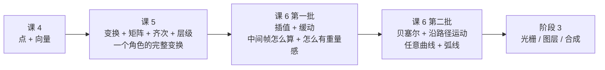
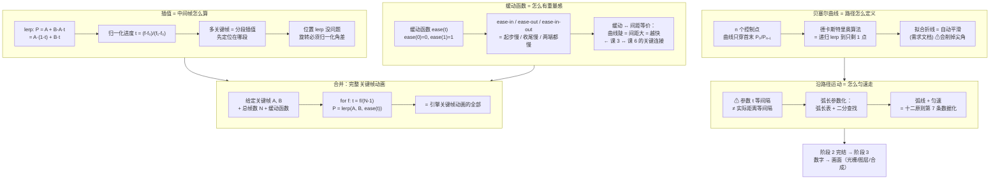

# 第 6 课：插值、缓动与贝塞尔

> 所属阶段：阶段 2《图形数学基础》｜ 水平：零基础
> 本课知识点：插值与关键帧补间、缓动函数、贝塞尔曲线、沿路径运动与弧线
> 故事情节：课 5 解决了"单个变换和变换链怎么算"（静态几何），但引擎还要做"中间帧怎么算"——给定两个关键帧，自动补出中间任意一帧。这是动画"中割"的纯数学版本
> **本课分 2 批讲解**：第一批「插值 = 中间帧怎么算 + 缓动函数 = 怎么有重量感」、第二批「贝塞尔曲线 = 折线变平滑 + 沿路径运动 = 弧线怎么走匀速」，现已完结

## 🎯 本课目标

- 用 `lerp` 计算第 t 帧位置，说明位置插值 vs 旋转插值的区别
- 给出 ease-in / ease-out 的数学形式，对应到课 3 的"间距"
- 说出缓动 ↔ 间距 的等价关系（这是阶段 2 的关键连接点）
- 用德卡斯特里奥算法求贝塞尔曲线上的点，说明贝塞尔拟合折线 = 自动平滑
- 区分匀速参数 t 与弧长 s，把"弧线运动"原则数据化

---

## 第一幕：起源与场景引入

> 🏛️ **起源**：课 2 讲过，传统动画里有专门的**中割师**（inbetweener）负责画关键帧之间的中间帧。计算机做动画时，这一步交给**插值（interpolation）**自动完成——软件里叫 **tweening**（源自 in-betweening，即「在……之间」）。**给两个关键姿势，中间所有帧由函数算出**——这就是本课的主题。（"tween" 是 in-between 的缩写，为行业通用术语，核查于 2026-09）

**场景**：课 5 解决了"角色位置 `(x, y) = R·P₀` 怎么算"——给定变换和起点，**瞬间**算出终点。但引擎还要做：

> "让角色从 (0, 0) 走到 (200, 150)，**24 帧内**到达。第 12 帧的 (x, y) 是多少？"

这就是**插值（interpolation）**——已知两个端点，算中间任意点。**这就是动画"中割"的纯数学版本**（课 2 介绍过：传统动画里有专门的"中割师"画中间帧；现在让程序算）。

但**光插值还不够**。课 3 我们学过：匀速插值看起来"机械"，缓入缓出看起来"有重量感"。**为什么缓动函数能让动作变有重量感？** 课 3 留了一个数学尾巴没解开——这批的"缓动函数"就是答案。

> 🎬 **场景**：本批讲两件事——**怎么算中间帧**（插值）、**怎么让中间帧"像真的"**（缓动函数）。这两件事加在一起，就是引擎里"关键帧动画"的全部数学。

---

## 第二幕：认知冲突

直觉上，插值就是"取两个值的中间"嘛——比如 10 和 20 的中间是 15。这没什么花头。

**冲突 1：旋转插值不能直接"取中间"**

你说"让一个角度从 350° 转到 10°，中间值是多少？"——直觉是 180°。**错。**

- 直接算：(350 + 10) / 2 = **180°** —— 看起来是"中间"，但球要**倒着转 340°**
- 实际"中间"应该是 **0°**（或 360°）—— 球**正着转 20°** 就能到

`350°` 和 `10°` 在圆周上距离 **20°**，不是 340°。**插值旋转前必须先归一化角差**到 `[-180°, 180°]`。

**冲突 2：匀速插值看起来"机械"**

同样的"从 A 到 B"，24 帧匀速插值 vs 缓入缓出插值，结果看起来完全不同：

- 匀速：每个 1/24 秒移动同样的距离 → 看起来像 PPT 切换 / 幻灯片
- 缓入缓出：起步慢、加速、中段快、收尾慢 → 看起来"有重量"

**为什么"分布不同"会让"看起来"不同？**——这又回到课 3 的"间距 = 速度感"。本批的最后会给出答案：**缓动函数 = 间距分布的数学形式**。

> ❓ **问题 1**：旋转插值为什么不能直接取平均？角速度有"周期性"，怎么处理？
> ❓ **问题 2**：缓动函数为什么能让"间距"看起来"自然"？它和传统动画的"画师手工安排间距"是什么关系？

---

## 第三幕：层层揭示

### 知识点 1：插值与关键帧补间

> 本知识点关键点：lerp 公式 / 归一化进度 t / 多关键帧分段 / 位置插值 vs 旋转插值

#### 一句话定义

**插值 = 在两个已知值之间"算出"中间值**。**关键帧补间** = 用插值自动补出关键帧之间的所有帧（已知 A, B, 帧数 N → 自动生成第 f 帧位置）。**位置**可直接 lerp x 和 y；**旋转**必须先归一化角差到 `[-180°, 180°]` 再插值（否则走长路）。

#### 直觉建立（类比）

把插值想成**GPS 显示当前位置**：

- 起点 A = (0, 0)，终点 B = (200, 0)
- 进度 t = "你走了全程的百分之几"
- 当前位置 = A + (B - A) × t = (200t, 0)
- t=0 → A；t=0.5 → (100, 0)（一半）；t=1 → B

> 💡 **类比的边界**：GPS 是"物理距离的线性插值"。动画里的插值是"时间 t 的函数 f(t) = 位置"——曲线可以非线性（缓动函数会改这点）。但**只要知道 f(t) 怎么算，中间的帧就能算**。

#### 核心原理

**lerp 公式（基础中的基础）**：

```python
def lerp(a, b, t):
    """线性插值：t ∈ [0, 1]"""
    return a + (b - a) * t        # = a*(1-t) + b*t
```

- t=0 → 返回 a
- t=0.5 → 返回 a 和 b 的中点
- t=1 → 返回 b

**对点插值**：分别对 x, y 做 lerp

```python
def lerp_point(p0, p1, t):
    return lerp(p0[0], p1[0], t), lerp(p0[1], p1[1], t)
```

**归一化进度 t**：

```python
t = (f - f0) / (f1 - f0)   # f 在关键帧 f0 和 f1 之间的"段内位置"
```

t ∈ [0, 1]，t=0 表示到了 f0，t=1 表示到了 f1。

**多关键帧分段插值**：

24 帧 / 3 关键帧（A 在 f0、B 在 f12、C 在 f23）：
- f=0~12 → 在 A→B 段内做 lerp
- f=12~23 → 在 B→C 段内做 lerp

**关键实现**：先定位当前帧在哪一对关键帧之间，再在该段内归一化、插值。

**位置插值 vs 旋转插值（重要！）**：

| 类型 | 公式 | 注意事项 |
|------|------|----------|
| **位置** | `P(f) = lerp(P₀, P₁, t)` | 直接插值即可，没坑 |
| **旋转**（角度） | `θ(f) = θ₀ + shortestΔ·t` | **必须先归一化角差** |

旋转插值的关键公式（**角度有周期性**）：

```python
def shortest_angle_delta(a0, a1):
    """把 a1 - a0 归一化到 [-180°, 180°]"""
    return ((a1 - a0 + 180.0) % 360.0) - 180.0
```

例子：`shortest_angle_delta(350, 10) = ((10-350+180) % 360) - 180 = ((-160) % 360) - 180 = 200 - 180 = +20°`

> ⚠️ **2D 旋转插值的经典坑**：从 350° 到 10°，**直观**是 340° 倒着转（错误），**实际**是 20° 正着转（正确）。**不归一化角差，旋转就会绕远路**。3D 还要考虑"万向锁"——需要四元数 `slerp`，但原理相同（归一化到最短路径）。

#### 示例演示

跑一次本课脚本：

```text
lerp_basic/      24 帧，A(30, 62) → B(290, 62) 线性插值（匀速），实时显示 t
multi_keyframe/  24 帧，3 关键帧分段插值（关键帧在 f0 / f12 / f23）
rotation_interp/ 24 帧，旋转插值：上行直接 lerp 走长路 vs 下行走短路
```

打开 `lerp_basic/frame_000.png` 看起点：球在 A (30, 62)，t=0，spacing=--。
打开 `lerp_basic/frame_012.png` 看中点：球在 (165, 62)，t=0.522，spacing=11.3px。
打开 `lerp_basic/frame_023.png` 看终点：球在 B (290, 62)，t=1，spacing=11.3px。

控制台实测（关键数据）：

```
lerp: P = A·(1-t) + B·t   （t = f/(N-1) 归一化进度）
  f6   t=0.261  P=( 97.8, 62.0)  spacing=11.3px
  f12  t=0.522  P=(165.7, 62.0)  spacing=11.3px
  f18  t=0.783  P=(233.5, 62.0)  spacing=11.3px
  -> 匀速：spacing 恒定 11.3px（与课 3 的 spacing_uniform 完全一致）
```

**这就是"位置插值"——一行 `lerp` 就能算任意中间帧**。

打开 `multi_keyframe/frame_018.png` 看 f=18 帧：关键帧 B (f12, 小原画) 之后，**段 B→C 段内 t=0.545**，P=(231, 54)——**先定位在哪一段，再在段内做 lerp**。

打开 `rotation_interp/frame_012.png` 看旋转插值中点：

- **上（红，错误）**：指针在 **172.6°**——**倒着走了 340° 的长路**
- **下（绿，正确）**：指针在 **0.4°**——**正着走了 20° 的短路**（经过 0°）

控制台实测（关键的 +20°）：

```
直接 lerp 角度     : Δ = 10 - 350 = -340°   → 倒着走 340°（长路，错误）
最短角差后再插值   : Δ = +20°               → 只走 20°（短路，正确）
公式：Δ = ((a₁ - a₀ + 180) mod 360) - 180
```

#### 常见误区

1. **"插值就是取中点"**——错。是**按 t 比例**算，不一定是中点。t=0.7 → 偏向终点 70%。
2. **"旋转也能直接 lerp"**——错。**必须先归一化角差到 [-180°, 180°]**。否则 350°→10° 会被走成 340° 长路。
3. **"多关键帧 = 把所有关键帧连成一条线"**——错。是**分段插值**——先定位 f 落在哪一段，再在段内 lerp。不是"全局插值"。
4. **"插值只用于位置"**——错。**颜色、透明度、大小、旋转角、z_depth 都能插**——只要能加减乘的量就能插。
5. **"lerp 就够用"**——对**位置**够用，对**旋转**有坑（必须归一化），对**曲线路径**不够（见知识点 3）。

#### 一句话记住

> **插值 = `lerp(a, b, t) = a + (b-a)·t`**；位置可直接用，旋转必须先归一化角差——这是 2D 动画引擎里最常见的"看起来对其实错"的坑。

#### 延伸阅读

- [Linear interpolation · Wikipedia](https://en.wikipedia.org/wiki/Linear_interpolation)
- [Slerp · Wikipedia](https://en.wikipedia.org/wiki/Slerp)（3D 旋转插值的基础）
- 《Real-Time Rendering》（任意方向的"插值"参考）
- 知识点 3《贝塞尔曲线》——本知识点的扩展（贝塞尔也是一种插值）

---

### 知识点 2：缓动函数

> 本知识点关键点：ease-in / ease-out 数学形式 / 三次缓动与 cubic-bezier / **间距与缓动的等价关系** / 常见缓动族

#### 一句话定义

**缓动函数（easing function）** = 把"线性进度 `t`"映射成"缓动后的进度 `t' = f(t)`"的函数。**它决定关键帧之间的"间距分布"**——**缓动 ↔ 间距**是阶段 2 最关键的连接点：**传统动画里"画师手工安排间距"** = 课 3 间距概念，**缓动函数 = 间距分布的数学形式**。

#### 直觉建立（类比）

把缓动函数想成**真实开车**：

- 起步踩油门（**缓入**）：速度从 0 慢慢增加
- 中段巡航：**匀速**或略快
- 临近目的地收油门（**缓出**）：速度慢慢减到 0

**不是匀速开车**——动画也一样：真实物体的运动几乎都不是匀速。缓动函数就是"把匀速 t 改写成有加速度的 t"的工具。

> 💡 **类比的边界**：汽车油门是"真实物理的加减速"，缓动函数是"画师/引擎设计者**人为加上去的加减速**"。两者都让动作"有重量感"，但一个是"被物理推着走"，一个是"被设计者故意这么画"。

#### 核心原理

**缓动函数的形式约束**：

- `ease(0) = 0`（起点）
- `ease(1) = 1`（终点）
- 任意 `ease(t) ∈ [0, 1]`（不越界，否则位置会"超出端点"）

**三种基础缓动**：

| 名称 | 公式 | 效果 |
|------|------|------|
| `ease-in`（缓入） | `t²` 或 `t³` | **起步慢**、收尾快（被"推"出去）|
| `ease-out`（缓出） | `1 - (1-t)²` 或 `1 - (1-t)³` | **起步快**、收尾慢（"惯性"停下来）|
| `ease-in-out`（缓入缓出） | smoothstep: `3t²-2t³` 或 cubic: `t<0.5 ? 4t³ : 1-(-2t+2)³/2` | **两端慢、中间快**（"扔出去再接住"）|

**三次缓动（cubic）与 cubic-bezier**：

CSS 的 `cubic-bezier(x1, y1, x2, y2)` 是一种**通用参数化**缓动：

- 控制点 `(x1, y1)` 决定**前半段**的曲线形状
- 控制点 `(x2, y2)` 决定**后半段**的曲线形状
- `(0, 0)` 和 `(1, 1)` 是固定的起止点

| 常见缓动 | cubic-bezier 参数 |
|---------|-------------------|
| linear | `cubic-bezier(0, 0, 1, 1)` |
| ease-in | `cubic-bezier(0.42, 0, 1, 1)` |
| ease-out | `cubic-bezier(0, 0, 0.58, 1)` |
| ease-in-out | `cubic-bezier(0.42, 0, 0.58, 1)` |

> 💡 **CSS `cubic-bezier()` 函数**就是这套数学的工程化：把"曲线形状"打包成 4 个参数，让设计师能拖两个控制点调任何缓动。**知识点 3 的贝塞尔曲线**就是它的几何含义。

**缓动 ↔ 间距 的等价关系**（阶段 2 关键连接点）：

| 视角 | 表达方式 | 怎么产生间距 |
|------|---------|--------------|
| **传统动画**（课 3） | 画师**手工画**每帧的位置 | 间距是"画师决定的" |
| **数字动画**（课 6） | 缓动函数 `f(t)` + `lerp(A, B, f(t))` | 间距是"函数算出来的" |

> **两者是同一件事的两种表达**——`f(t)` 的"陡峭度" = 间距的"大小"。**曲线越陡 → 该处间距越大 → 越快**。这就是课 3 那句"动画不匀速 = 有重量感"的数学形式。

**常见缓动族**（按"是不是会越界"分类）：

| 类型 | 是否越界 | 用途 |
|------|---------|------|
| linear / quad / cubic / sine / expo | **否**（值在 [0,1]） | UI 过渡、常规动画 |
| back | **是**（超过 1 再回来） | "回弹"效果（按钮按下抬起） |
| elastic | **是**（多次振荡） | "弹簧"效果 |
| bounce | **是**（多次反弹） | 球落地弹跳 |

> ⚠️ **越界类缓动的注意点**：值会超出 [0, 1] 区间——如果直接用 `lerp(A, B, f(t))` 算位置，**会插出超过端点的位置**（按钮会"被按到底再弹起"）。这是**视觉上想要的效果**，但**数学上要允许越界**。如果只想在 [0, 1] 范围内移动，用"非越界类"缓动。

#### 示例演示

跑一次本课脚本：

```text
easing_family.png  6 种缓动曲线 + 缓动↔间距等价关系
```

打开 `easing_family.png` 看 6 条曲线叠在一起：

- **灰（linear）**：对角线——匀速
- **蓝（in-quad）**：起步很平、收尾陡——**缓入**（慢起快收）
- **绿（out-quad）**：起步陡、收尾平——**缓出**（快起慢收）
- **红（in-out-cubic）**：S 形——**慢入慢出**（两端慢、中间快）
- **紫（out-back）**：**冲过 1 再回来**——回弹
- **橙（out-elastic）**：**振荡衰减**——弹性

控制台实测——`ease-in-out-cubic` 套用到 `A(30)→B(290)` 看**间距怎么变**：

```
缓动 → 间距：
  f3    t=0.130   eased=0.009   x= 32.3   spacing=1.6px
  f6    t=0.261   eased=0.071   x= 48.5   spacing=7.8px
  f12   t=0.522   eased=0.562   x=176.2   spacing=32.5px     <- 最快
  f18   t=0.783   eased=0.959   x=279.3   spacing=7.8px
  f21   t=0.913   eased=0.997   x=289.3   spacing=1.6px
  f23   t=1.000   eased=1.000   x=290.0   spacing=0.1px     <- 最慢

  -> 间距：起点 0.1px（最慢）→ 中间 32.5px（最快）→ 终点 0.1px（最慢）
     最值比 = 380×  ← 这就是课 3 说的「缓入缓出 = 有重量感」
```

**注意最值比 380×**——缓入缓出比匀速"不均匀"了 380 倍。**这巨大差异 = 视觉上的"重量感"**。

#### 常见误区

1. **"缓动函数 = 变慢"**——错。**缓动函数改的是加速度**（间距怎么分布），不是绝对速度。**整段动画总时长不变**。
2. **"缓入 = 起步慢、缓出 = 收尾慢、缓入缓出 = 两端都慢"**——对，**但只对中点对称时才这样**。如果缓动函数不对称（CSS 的 `cubic-bezier` 可以不对称），效果会偏一边。
3. **"弹性 = 振荡"**——对，但**只在缓出**才有意义。`ease-in-elastic` 看起来"起步就抽风"，**不是想要的动画效果**。
4. **"缓动函数可以任意写"**——错。要满足 `ease(0)=0` 且 `ease(1)=1`，且**一般** `ease(t) ∈ [0, 1]`（除非你想要"越界"效果）。
5. **"有了缓动函数就不用 lerp 了"**——错。**缓动函数 = 改 t，lerp = 算位置**，两者配合：`P = lerp(A, B, ease(t))`。

#### 一句话记住

> **缓动函数 = 间距分布的数学形式；`ease(0)=0`、`ease(1)=1`；曲线陡 = 间距大 = 快——这是课 3 间距概念和课 6 数学形式之间的桥梁。**

#### 延伸阅读

- [Easing functions · easings.net](https://easings.net/)（29 种缓动函数的可视化参考）
- [CSS cubic-bezier() · MDN](https://developer.mozilla.org/en-US/docs/Web/CSS/easing-function/cubic-bezier)
- [Robert Penner's easing equations](http://robertpenner.com/easing/)（工业标准缓动函数的开源代码，Flash/游戏引擎广泛使用）
- 知识点 3《贝塞尔曲线》——cubic-bezier 的几何含义 + 任意曲线插值

---

### 知识点 3：贝塞尔曲线

> 本知识点关键点：控制点与 Bernstein / 二次与三次贝塞尔 / 德卡斯特里奥算法 / 用贝塞尔拟合折线 = 自动平滑

#### 一句话定义

**贝塞尔曲线（Bézier curve）** = 用若干**控制点**定义的参数曲线 `B(t)`，**曲线穿过首末控制点、被中间控制点"拉"成想要的形状**。**德卡斯特里奥算法（de Casteljau）**用递归线性插值求值。**用贝塞尔拟合折线 = 把锯齿线段自动变成平滑曲线**（需求文档的"自动平滑"）。

#### 直觉建立（类比）

把贝塞尔曲线想成**橡皮筋被钉子"拉"成的形状**：

- 起点 P₀ 和终点 Pₙ = 两端的钉子（**橡皮筋一定穿过它们**）
- 中间的 P₁, P₂, ..., Pₙ₋₁ = 路上的钉子（**橡皮筋不穿过它们，只被它们"拉"**）
- 拉得越用力 = 控制点离端点越远 = 曲线越"贴"那个控制点

> 💡 **类比的边界**：橡皮筋的形状是"最短路径"（物理极值），贝塞尔曲线是"参数的 Bernstein 加权和"（数学定义）。两者**形状不同**（橡皮筋走直线段、贝塞尔走平滑曲线），但**视觉上都受控制点"吸引"**。

#### 核心原理

**德卡斯特里奥算法**（de Casteljau）—— 求贝塞尔曲线上一点的递推公式：

```
n 个控制点 P₀, P₁, ..., Pₙ₋₁
对每对相邻点做 lerp，得到 n-1 个点
重复此过程，直到只剩 1 个点 = B(t)
```

**三次贝塞尔**（n=4，最常用）的显式公式（Bernstein 基函数）：

```
B(t) = (1-t)³P₀ + 3(1-t)²t·P₁ + 3(1-t)t²·P₂ + t³P₃
```

**Bernstein 基函数**（n=3 的 4 个）：

```
b₀ = (1-t)³    ← P₀ 的权重
b₁ = 3(1-t)²t  ← P₁ 的权重
b₂ = 3(1-t)t²  ← P₂ 的权重
b₃ = t³        ← P₃ 的权重
```

四个权重和恒为 1，所以 `B(t)` 是控制点的**加权平均**——这就是"凸包性"的来源。

> 💡 **CSS `cubic-bezier(x1, y1, x2, y2)`** 就是这套数学的工程化：`(x1, y1)` 和 `(x2, y2)` 是首末控制点**之间**的两个虚拟控制点（不是首末端点），控制曲线的**前半段和后半段的形状**。**第一批课里 CSS 的 cubic-bezier 现在有了几何含义**。

**贝塞尔曲线的三条关键性质**：

1. **端点插值**：`B(0) = P₀`，`B(1) = Pₙ₋₁`——一定穿过首末控制点
2. **凸包性**：曲线永远在所有控制点的**凸包**（最小外接多边形）内——不会跑飞
3. **切线**：起点切线方向 = `P₀→P₁`，终点切线方向 = `Pₙ₋₂→Pₙ₋₁`——便于多段贝塞尔平滑拼接

> ⚠️ **常见误解**：**曲线不穿过中间控制点 P₁/P₂**——它们只提供"拉力"。把 P₁ 拉得离 P₀ 越远，曲线起点附近的"弯"就越大。

**用贝塞尔拟合折线 = 自动平滑**（需求文档的直接对应）：

1. 把折线上的每个折点当作贝塞尔的**端点**
2. 用**相邻折点的方向**推算**切线控制点**（如 `c₁ = P₀ + (P₃ - P₋₁) × k`，k≈0.28 是经验值）
3. 用三次贝塞尔连接相邻端点

这样折线段之间的"尖角"就被**抹平**成平滑曲线。**这是需求文档"自动平滑"的数学实现**。

> ⚠️ **何时不该平滑**：**真实尖角**（如文字笔画的端点、地图的拐角）需要保留——这些折点要标记为 `corner`，**不参与平滑**。这是"贝塞尔拟合"的工程化细节。

#### 示例演示

跑一次本课脚本：

```text
bezier_de_casteljau/    24 帧，三次贝塞尔 + 德卡斯特里奥递归插值可视化
bezier_basics.png       二次/三次贝塞尔对比 + Bernstein 基函数
bezier_smoothing.png    折线 → 贝塞尔拟合 = 自动平滑
```

打开 `bezier_de_casteljau/frame_012.png` 看 t=0.52 的中点帧：

- **4 个红色空心圆** = 4 个控制点 P₀/P₁/P₂/P₃
- **3 条蓝色线段** = 第一层插值（3 个点，每两个 P 之间 lerp）
- **2 个绿点** + 1 条绿线 = 第二层插值（2 个点）
- **1 个蓝色实心圆** = 最终点 B(t=0.52)
- **浅灰曲线** = 完整三次贝塞尔（101 个点采样）
- 文字说明"曲线不穿过中间控制点 P1/P2"

**控制多边形**（P₀-P₁-P₂-P₃ 之间的虚线）被红色拉得"扁"——P₁/P₂ 拉得越远，曲线越"鼓"。

控制台实测（端点验证）：

```
t=0.0 → 点 ( 20.0,  20.0)   B(0) = P₀ ✓
t=0.5 → 点 (137.5,  80.0)   ← 不在任何控制点上
t=1.0 → 点 (270.0,  20.0)   B(1) = P₃ ✓
```

打开 `bezier_smoothing.png` 看自动平滑：

- **上（红色）**：10 个折点的原始锯齿折线
- **下（绿色）**：同样 10 个折点，用贝塞尔拟合后的平滑曲线
- 折点位置完全相同（灰色圆点标出），但**绿色曲线把"尖角"抹平了**

> 📌 **一点说明**：**贝塞尔拟合会"削掉"真实尖角**——这是"自动平滑"的代价。需要保留的尖角必须用 `corner` 标记。

#### 常见误区

1. **"贝塞尔曲线穿过中间控制点"**——错。**只穿过首末 P₀/Pₙ₋₁**，中间控制点只提供"拉力"。
2. **"控制点越多曲线越复杂"**——对，但**阶数 = 控制点数 - 1**（4 个点 = 三次贝塞尔）。控制点太多时**高阶贝塞尔难以控制**，实际工程中常用**多段三次贝塞尔拼接**（B-spline 就是这种思路）。
3. **"贝塞尔 = 圆弧"**——错。**圆弧需要用近似贝塞尔**（多段拼接）才能逼近，单段三次贝塞尔画不出精确圆弧。这是 NURBS（非均匀有理 B 样条）出现的原因。
4. **"贝塞尔拟合 = 平滑折线"**——对，但**会丢失尖角**。真实尖角需要保留，不能"无脑平滑"。
5. **"CSS 的 cubic-bezier 就是贝塞尔"**——对。`cubic-bezier(0.42, 0, 0.58, 1)` 就是 4 个控制点的三次贝塞尔。

#### 一句话记住

> **贝塞尔曲线用控制点定义任意曲线**；**德卡斯特里奥 = 递归 lerp**；**只穿首末控制点**；**用贝塞尔拟合折线 = 需求文档的"自动平滑"**。

#### 延伸阅读

- [Bézier curve · Wikipedia](https://en.wikipedia.org/wiki/B%C3%A9zier_curve)
- [De Casteljau's algorithm · Wikipedia](https://en.wikipedia.org/wiki/De_Casteljau%27s_algorithm)
- [CSS cubic-bezier() · MDN](https://developer.mozilla.org/en-US/docs/Web/CSS/easing-function/cubic-bezier)
- 《A Primer on Bézier Curves》(freely available online)——贝塞尔曲线的免费电子书
- 需求文档的"自动平滑"——本知识点的直接应用

---

### 知识点 4：沿路径运动与弧线

> 本知识点关键点：沿曲线取点 / 参数 t 匀速 ≠ 弧长 s 匀速 / 弧长参数化 / 弧线运动原则的数据化

#### 一句话定义

**沿路径运动** = 让物体沿曲线（贝塞尔或其他）移动。**关键陷阱**：**直接用参数 t 均匀采样 ≠ 物体在曲线上匀速**——因为曲线各处"拉伸"不同，`t` 等步进时**弧长不等**。**真正匀速需要弧长参数化（arc-length parameterization）**：按"实际走过的距离"等分 `s ∈ [0, 1]`。

#### 直觉建立（类比）

把沿路径运动想成**开车走山路**：

- **参数 t 匀速** = 按"地图距离"等分时间（地图上每 1 公里一个时刻）——但山路上 1 公里 = 上坡 5 分钟、下坡 2 分钟，**速度忽快忽慢**
- **弧长 s 匀速** = 按"实际走过的路程"等分时间（每走 10 公里一个时刻）——**速度恒定**

> 💡 **类比的边界**：山路是 2D 空间，曲线是参数空间。但**"匀速"的定义都是"单位时间走过的实际距离"**——这在两条空间里是一致的。

#### 核心原理

**为什么 `t` 匀速 ≠ 速度匀速**：

贝塞尔曲线的"速度" = `dB/dt`（导数）。但**这个导数在曲线各处不同**：

- 曲线"拉伸"的地方（凸出处）→ 同样 `dt` 走过的距离更大
- 曲线"压缩"的地方（凹进处）→ 同样 `dt` 走过的距离更小

> 用"沿曲线走过的弧长 `s`"作参数就解决了这个问题——`ds/dt`（速度）自动恒定。

**弧长参数化（arc-length parameterization）的实现**：

```python
# 1. 预计算弧长表：(t, 累计弧长) —— 把曲线分成 N 段，累加每段距离
ts, cum, total = build_arc_table(ctrl, N=400)

# 2. 给定归一化弧长 s_frac ∈ [0, 1]，用二分查找 + 线性插值找到对应的 t
def point_at_arclength(ctrl, table, s_frac):
    target = s_frac * total
    idx = bisect.bisect_left(cum, target)
    # 在 cum[idx-1] ~ cum[idx] 区间内线性插值出 t
    ...
    return bezier_point(ctrl, t)
```

**为什么这对应十二原则第 7 条"弧线运动（Arcs）"**：

> "几乎所有动作用弧线画都比直线自然"——但**"用弧线"≠"用弧线匀速"**。如果只在路径选择上"用弧线"但参数采样不匀速，**弧线的好处就被"忽快忽慢"抵消了**。**正确的做法 = 弧线路径 + 弧长匀速采样**。

> 💡 **需求文档的对应**：你提到的 AI 引擎需要"自动平滑"（知识点 3）和"沿路径运动"（本知识点）。两者合起来就是**"用贝塞尔定义任意路径 + 按弧长匀速沿路径运动"**——这就是"高级动画系统"的核心数学。

#### 示例演示

跑一次本课脚本：

```text
arc_length_vs_param/    24 帧，上行 ❌ 参数 t 匀速 vs 下行 ✅ 弧长 s 匀速
```

打开 `arc_length_vs_param/frame_012.png` 看 t/s=0.52 的中点帧：

- **上行（红色）**：参数 t = 0.52，**球在曲线的"拉伸"段**（曲线中段）。`spacing` 显示**当前帧到上一帧的实际距离**
- **下行（绿色）**：弧长 s = 0.52，**球在曲线的对应位置**（按总长 × 0.52）。`spacing` 应该恒定

控制台实测（关键的对比数据，曲线总长 270px）：

```
帧     参数t spacing     弧长s spacing
f4    10.4px          11.7px
f8    12.3px          11.7px
f12   13.2px          11.7px
f16   13.0px          11.7px
f20   11.7px          11.7px
f23   10.1px          11.7px

参数 t：spacing 8.4 ~ 13.3px  （最值比 1.6×  ← 忽快忽慢）
弧长 s：spacing 11.7 ~ 11.7px  （最值比 1.00×  ← 恒定）
```

> **最值比 1.6×**——参数 t 采样下，球走过的"距离"在最慢和最快时相差 1.6 倍。**这种不均匀人眼能感觉到**（"忽快忽慢"），**消除它就要用弧长采样**。

#### 常见误区

1. **"参数 t 匀速 = 弧长匀速"**——错。**曲线"拉伸"不均匀**，`t` 等步进 ≠ 距离等步进。**这是 2D 引擎里"沿路径运动看起来抖"的最常见原因**。
2. **"弧长参数化很复杂"**——其实不难。**预计算弧长表 + 二分查找**两步就够，N=200~400 的表就够平滑。
3. **"弧长参数化 = 真实物理匀速"**——不完全。弧长匀速 = **沿曲线速度恒定**，**但曲线方向变化时法向加速度仍存在**（过弯还是要"甩"的）。要完全真实还需要弹簧-阻尼系统。
4. **"所有路径都需要弧长参数化"**——不是。**直线/折线**不需要（参数 t 和弧长 s 线性相关）。**曲线才需要**。
5. **"用 cubic-bezier 就能做弧线运动"**——对了一半。**CSS 的 cubic-bezier 是缓动函数**（本课第一批），**不是"沿贝塞尔路径运动"**。两者数学相同但用途不同：**前者改 t 分布、后者定义路径**。

#### 一句话记住

> **沿贝塞尔路径运动 ≠ `t` 匀速**；**按弧长 s 等分**才能真正匀速；**弧线路径 + 弧长采样 = 十二原则第 7 条"弧线运动"的完整数据化**。

#### 延伸阅读

- [Arc length parameterization · Wikipedia](https://en.wikipedia.org/wiki/Arc_length)（含沿任意参数曲线弧长参数化的标准方法）
- [Path animation · SVG spec](https://www.w3.org/TR/SVG/paths.html)（SVG `<animateMotion>` 的 `keyTimes`/`keyPoints` 就是弧长参数化的工程实现）
- 需求文档的"自动平滑"+"沿路径运动"——本课两个知识点的直接应用
- 阶段 3 课 8《图层、alpha 与深度排序》——本课输出会被合成到最终图像

---

## 第四幕：实操验证

### 运行方式

本课有 **2 个脚本**（第一批 1 个 + 第二批 1 个）。在 PowerShell 中（先切到课程目录）分别运行：

```powershell
cd d:\projects\learning\animation-engine\00-动画与视频基础
# 第一批：插值与关键帧补间、缓动函数
.\playground\.venv\Scripts\python.exe .\playground\lesson-06\interpolation_demo.py
# 第二批：贝塞尔曲线、沿路径运动与弧线
.\playground\.venv\Scripts\python.exe .\playground\lesson-06\bezier_demo.py
```

**`interpolation_demo.py`（第一批）的预期输出**（脚本在 Python 3.12.13 + numpy 2.5.2 + pillow 12.3.0 上验证通过）：

```text
=== 知识点 1：插值与关键帧补间 ===
线性插值 -> lerp_basic/ （24 帧，A(30,62) → B(290,62) 匀速）
多关键帧 -> multi_keyframe/ （24 帧，关键帧在 f0 / f12 / f23）
旋转插值 -> rotation_interp/ （24 帧，350° → 10°）
  直接 lerp 角度     : Δ = 10 - 350 = -340°   → 倒着走 340°（长路，错误）
  最短角差后再插值   : Δ = +20°                → 只走 20°（短路，正确）

=== 知识点 2：缓动函数 ===
缓动曲线总览 -> easing_family.png （6 种）

  缓动 → 间距（ease-in-out-cubic 套用到 A→B）：
    起点 0.1px（最慢）→ 中间 32.5px（最快）→ 终点 0.1px（最慢）
    最值比 = 380×  ← 这就是课 3 说的「缓入缓出 = 有重量感」
```

**`bezier_demo.py`（第二批）的预期输出**：

```text
=== 知识点 3：贝塞尔曲线 ===
德卡斯特里奥 -> bezier_de_casteljau/ （24 帧，三次贝塞尔 4 控制点）
    t=0.0  → 点 (  20.0,  20.0)   （层级：4→3→2→1）
    t=0.5  → 点 ( 137.5,  80.0)   （层级：4→3→2→1）
    t=1.0  → 点 ( 270.0,  20.0)   （层级：4→3→2→1）

  端点验证：B(0) = P0 = (20.0, 20.0)，B(1) = P3 = (270.0, 20.0)
  t=0.5 处的点 = (137.5, 80.0)
  → 注意：它不等于任何控制点，也不在 P1/P2 上（曲线不穿过中间控制点）

贝塞尔基础 -> bezier_basics.png
折线→平滑 -> bezier_smoothing.png （需求文档的「自动平滑」）

=== 知识点 4：沿路径运动与弧线 ===
参数 vs 弧长 -> arc_length_vs_param/ （24 帧）
  曲线总长 = 270.0px

    帧     参数t spacing     弧长s spacing
    f0    --              --
    f4    10.4px          11.7px
    f8    12.3px          11.7px
    f12   13.2px          11.7px
    f16   13.0px          11.7px
    f20   11.7px          11.7px
    f23   10.1px          11.7px

  参数 t：spacing 8.4 ~ 13.3px  （最值比 1.6×  ← 忽快忽慢）
  弧长 s：spacing 11.7 ~ 11.7px  （最值比 1.00×  ← 恒定）
```

### 怎么翻看

| 文件 | 翻看要点 | 对应知识点 |
|------|----------|------------|
| `lerp_basic/frame_000.png` → `frame_023.png` | 球匀速从 A 到 B，**spacing 全程 11.3px** | `lerp` 基础 |
| `multi_keyframe/frame_000.png` → `frame_023.png` | 3 关键帧分段插值，**段内 t 从 0→1 重新归一化** | 多关键帧 |
| `multi_keyframe/frame_012.png` | 第 12 帧正好是**关键帧 B**（小原画） | 关键帧 = lerp 端点 |
| `rotation_interp/frame_000.png` | t=0，上下行都从 350° 出发 | 起点相同 |
| `rotation_interp/frame_012.png` | t=0.52，**上行（红）到 172.6° 走长路**，**下行（绿）到 0.4° 走短路** | 旋转插值的坑 |
| `rotation_interp/frame_023.png` | t=1，上行到达 10°（走完 340°），下行也到达 10°（走完 20°） | 端点相同但路径不同 |
| `easing_family.png` | 6 条缓动曲线 + 缓动↔间距等价关系 | 缓动函数 |
| `bezier_de_casteljau/frame_012.png` | 4 控制点 + 3 层递归插值（蓝→绿→球），**曲线不穿中间控制点** | 德卡斯特里奥算法 |
| `bezier_basics.png` | 二次/三次贝塞尔对比 + Bernstein 基函数 + 三条关键性质 | 贝塞尔基础 |
| `bezier_smoothing.png` | 上（红）锯齿折线 vs 下（绿）贝塞尔拟合后的平滑曲线 | 自动平滑 |
| `arc_length_vs_param/frame_012.png` | 上行（红）参数 t vs 下行（绿）弧长 s，**看 spacing 数字** | 弧长参数化 |

**翻看方式**：
- 6 组 24 帧用 Windows 照片应用 + → 方向键逐张翻
- 4 张 PNG 图直接打开看对比
- `rotation_interp/` 重点对比 `frame_000.png`（上下同起点）和 `frame_012.png`（**已分离 172°**）
- `arc_length_vs_param/` 重点看**每帧的 spacing 数字**：上行忽大忽小（10.1~13.2），下行恒定 11.7

> 📌 **四点说明，免得你以为程序写错了**：
> 1. `multi_keyframe/` 里的灰色轨迹**经过所有关键帧**（包括中间的 B），不是只画"当前段"的轨迹——这是为了看完整的分段插值效果。
> 2. `rotation_interp/` 上行（红）走了**340°** 到达 10°，下行（绿）只走了**20°**——**两条路径都到达 10°，但过程完全不同**。这正是"路径对 vs 路径错"的视觉证据。
> 3. `bezier_de_casteljau/` 里的**中间控制点 P₁/P₂ 是空心红圈**，曲线（浅灰）**不穿过它们**——它们只提供"拉力"。这是贝塞尔曲线最反直觉的一点。
> 4. `arc_length_vs_param/` 上下两行的球**都在同一条曲线上移动**，但**位置不同**（因为采样方式不同）。看球的位置和 spacing 数字都能看出差异。

### 动手改一改（建议都试一遍）

| 改什么 | 预期看到 | 对应知识点 |
|--------|---------|-----------|
| `lerp_basic` 里把 `B_POINT = (290.0, 62.0)` 改成 `(290.0, 30.0)` | 球从 A 沿对角线匀速到 B（直线匀速） | 位置插值的多维用法 |
| `multi_keyframe` 里把 KEYFRAMES 加到 4 个：`(0,A), (8,B), (16,C), (23,D)` | 分 3 段插值，**关键帧越多越平滑**（但仍然有"折点"） | 多关键帧分段 |
| `multi_keyframe` 里加 `ease_in_out_cubic` 替换 `lerp_point`（**段内 t 用缓动函数**） | **段与段的连接处出现"加速度突变"** —— 缓动会暴露段边界的非平滑 | 缓动在多段插值中的局限 |
| `rotation_interp` 里把 `ANGLE_TO = 10.0` 改成 `200.0` | Δ = 150°（仍在 180° 范围内），**直接 lerp 也走短路** | 短路只在 Δ ≤ 180° 时"最"短；>180° 才是长路 |
| `rotation_interp` 里把 `ANGLE_FROM = 10.0`、`ANGLE_TO = 350.0` | Δ = -20°，**两条路径都走 20° 短路**（但方向反了） | 插值的方向选择 |
| `easing_family` 里加一条 `ease_in_sine(t) = 1 - cos(t·π/2)` | 平滑起手，比 `ease_in_quad` 更"优雅" | 缓动函数族的选择 |
| `ease_in_out_cubic(t)` 改成 `ease_out_back(t)` 应用到 A→B | 球**冲过 290 再弹回来** | 越界缓动的视觉表现 |
| `bezier_de_casteljau` 里把 `CTRL` 的 P₁ 从 `(70, 100)` 改成 `(70, 20)` | 中间控制点"拉"的力变小 → 曲线**变得更平**（接近直线） | 控制点的"拉力" |
| `bezier_de_casteljau` 里把 `CTRL` 改成 3 个控制点 | 变成**二次贝塞尔**（层级 3→2→1） | 阶数 = 控制点数 - 1 |
| `bezier_smoothing` 里把平滑系数 `k = 0.28` 改成 `0.05` | 平滑效果**几乎消失**（曲线贴近原始折线） | 切线控制点的偏移量 |
| `bezier_smoothing` 里把 `k = 0.28` 改成 `0.5` | **过度平滑**——曲线"鼓"出原始折线的范围 | 平滑是"有代价"的 |
| `arc_length_vs_param` 里把 `ARC_N = 400` 改成 `20` | 弧长表太粗 → **下行也不匀速了**（采样误差） | 弧长表的精度 |
| `arc_length_vs_param` 里把下行也改成 `bezier_point(PATH_CTRL, frac)` | 上下两行**完全重合**——失去对比意义 | 弧长参数化的作用 |

> ✅ **回扣场景**：现在可以回答开头的问题了。
> - **"让角色从 (0, 0) 走到 (200, 150)，24 帧"**——`for f in range(24): t = f/23; P = lerp((0,0), (200,150), t)`。**位置直接 lerp 即可**。
> - **"让角色从 350° 转到 10°"**——**不能**直接 `lerp(350, 10, t)`（会走 340° 长路）。用 `Δ = ((10-350+180) mod 360) - 180 = +20°`，`θ = 350 + 20·t`。
> - **"AI 给了我 (P0, P1, f0, f1, f) 怎么算中间帧"**——`t = (f - f0) / (f1 - f0)`，`P = lerp(P0, P1, t)`。**如果 P 是位置**：直接用。**如果 P 是角度**：用归一化角差。
> - **"为什么我的关键帧动画看起来'机械'"**——**没用缓动函数**。所有 `t` 都是线性的。改成 `lerp(P0, P1, ease(t))`，**用 ease-in-out-cubic 或 ease-in-out-quad**——就能"有重量感"。
> - **"AI 生成的线条歪歪扭扭（锯齿）怎么变平滑"**——**用贝塞尔拟合**（知识点 3）。把折点当端点，用相邻点方向推算切线控制点，段与段平滑衔接。这就是**需求文档"自动平滑"的数学实现**。⚠ 真实尖角要标记 `corner` 不参与平滑。
> - **"让角色沿一条曲线匀速走"**——**不能直接用 `t` 等分**（会忽快忽慢，最值比 1.6×）。要**按弧长等分**：预计算弧长表 + 二分查找，得到真正匀速的运动。这对应**十二原则第 7 条"弧线运动"**的完整数据化。

---

## 第五幕：体系收束



> 📍 **全局定位**：本课（课 6）回答了**四个问题**，构成"中间帧怎么算"的完整数学：
>
> | 知识点 | 回答的问题 | 本质 |
> |--------|-----------|------|
> | 插值与关键帧补间 | **中间帧怎么算** | `lerp(A, B, t)`；位置直接用，旋转先归一化角差 |
> | 缓动函数 | **怎么让动作有重量感** | `ease(t)` 改 t 的分布 → 间距自动产生 |
> | 贝塞尔曲线 | **曲线路径怎么定义** | 控制点 + 德卡斯特里奥算法；拟合折线 = 自动平滑 |
> | 沿路径运动与弧线 | **沿曲线怎么匀速走** | 参数 t ≠ 弧长 s；按弧长等分才真正匀速 |
>
> **两条关键 insight**（把阶段 1 和阶段 2 接起来）：
> 1. **间距 = 速度感 = 缓动函数**——课 3 的"画师手工安排间距"和课 6 的"缓动函数 f(t)"是**同一件事的两种表达**。前者是经验画法，后者是数学形式。
> 2. **弧线 + 匀速 = 自然的运动轨迹**——课 3 的"十二原则第 7 条弧线运动"在课 6 有了完整实现：**贝塞尔定义弧线路径 + 弧长参数化保证匀速**。
>
> 四步串起来：**`lerp` 算中间位置 → `ease(t)` 改进度分布 → 贝塞尔定义任意曲线路径 → 弧长参数化沿路径匀速运动**。这就是引擎"关键帧动画 + 路径动画 + 自动平滑"的全部数学。
>
> 🔗 **下一步**：阶段 2 到这里**全部完结**——从课 4 的"位置怎么表示"（点/向量/坐标系），到课 5 的"变换怎么算"（矩阵/齐次/层级），到课 6 的"中间帧怎么算"（插值/缓动/贝塞尔/路径）。**但这些都还是"数学"——算出来的是坐标和数字，不是画面**。
>
> **阶段 3《渲染与合成基础》**要解决"数字 → 画面"：课 7 讲**光栅图像 vs 矢量图形**（两种表示方式的分工），课 8 讲**图层、alpha 合成、深度排序**（把多个元素合成一帧图像）。这是需求文档"分层矩阵 → 按 z_depth 排序 → 渲染到屏幕"的最后一段。

---

## 🐞 常见误区

1. **"插值就是取中点"**——错；是按 t 比例算，不一定是中点
2. **"旋转也能直接 lerp"**——错；**必须先归一化角差到 [-180°, 180°]**，否则走长路
3. **"多关键帧 = 把所有关键帧连成一条线"**——错；是**分段插值**——先定位在哪一段
4. **"缓动函数 = 变慢"**——错；改的是**加速度**（间距分布），不是绝对速度
5. **"缓动函数可以任意写"**——错；要满足 `ease(0)=0` 和 `ease(1)=1`
6. **"有了缓动函数就不用 lerp 了"**——错；**缓动改 t、lerp 算位置**：`P = lerp(A, B, ease(t))`
7. **"贝塞尔曲线穿过中间控制点"**——错；**只穿过首末 P₀/Pₙ₋₁**，中间控制点只提供"拉力"
8. **"参数 t 匀速 = 弧长匀速"**——错；**曲线"拉伸"不均匀**，`t` 等步进 ≠ 距离等步进（实测最值比 1.6×）
9. **"用贝塞尔拟合折线 = 无脑平滑"**——错；**会削掉真实尖角**，需要保留的尖角要标记 `corner`
10. **"CSS cubic-bezier 就是沿路径运动"**——错；**cubic-bezier 是缓动函数**（改 t 分布），**不是"沿贝塞尔路径运动"**（定义路径）。数学相同但用途不同

## 一图总结



## 课后小测

**Q1**：已知 `A = (0, 0)`、`B = (200, 100)`，用 `lerp` 计算 `t=0.4` 时的位置。

- A. (40, 20)
- B. (80, 40)
- C. (120, 60)
- D. (40, 200)

<details><summary>答案与解析</summary>

**答案：B**。`lerp(A, B, 0.4) = A + (B - A)·0.4 = (0,0) + (200, 100)·0.4 = (80, 40)`。**A 错**（0.4 × (200, 100) = (80, 40) 不是 (40, 20)）；**C 错**（那是 t=0.6）；**D 错**（y 也按比例 100·0.4 = 40，不是 200）。
</details>

**Q2**：从 350° 旋转到 10°，**直接用 `lerp(350, 10, 0.5)` 会得到多少度**？

- A. 0°（走的是最短路）
- B. 180°（"中间"角度）
- C. 170°（走的是最长路的一半）
- D. 350°（不变）

<details><summary>答案与解析</summary>

**答案：B**。`lerp(350, 10, 0.5) = 350 + (10 - 350)·0.5 = 350 - 170 = 180°`。**但这是错的**——180° 走的是 340° 长路的"中点"，实际最短路只要走 20°。**正确做法**：先归一化 `Δ = ((10-350+180) mod 360) - 180 = +20°`，再 `θ = 350 + 20·0.5 = 360° = 0°`。**旋转插值必须先归一化角差**，否则走远路。
</details>

**Q3**：下列关于缓动函数和"间距"的关系，说法正确的是？

- A. 缓动函数把匀速 t 改成非线性 t'，位置 = `lerp(A, B, t')`
- B. 缓动函数 t' 的陡峭度 = 该处间距的大小
- C. 缓入缓出 = t' 两端平（间距小 = 慢）中间陡（间距大 = 快）
- D. 以上都是

<details><summary>答案与解析</summary>

**答案：D**（以上都对）。**A 对**：缓动函数把线性进度 t 映射成 `t' = ease(t)`，位置 = `lerp(A, B, t')`。**B 对**：`dt'/dt` 是 t' 曲线的斜率，斜率大 = 该处间距大 = 快。**C 对**：缓入缓出的 t' 曲线两端斜率小（间距小 = 慢）、中间斜率大（间距大 = 快）。三者合起来就是"缓动 ↔ 间距"的等价关系。
</details>

**Q4**：关于贝塞尔曲线，下列说法**错误**的是？

- A. 曲线一定穿过首末控制点 P₀ 和 Pₙ₋₁
- B. 曲线穿过所有控制点（包括中间的 P₁、P₂）
- C. 曲线永远在所有控制点的凸包内
- D. 中间控制点只提供"拉力"，不决定曲线是否穿过

<details><summary>答案与解析</summary>

**答案：B**。贝塞尔曲线**只穿过首末控制点**，**不穿过中间控制点**——中间控制点只提供"拉力"（把曲线往自己那边拽）。**A 对**（端点插值：`B(0)=P₀`、`B(1)=Pₙ₋₁`）；**C 对**（凸包性：曲线不会跑出控制点围成的凸包）；**D 对**（这正是 B 错的原因）。**"曲线穿过所有控制点"是新手最常误解的一点**——实际上穿过所有控制点的是**样条插值（spline）**，不是贝塞尔。
</details>

**Q5**：让物体沿一条贝塞尔曲线**匀速**运动，正确的做法是？

- A. 让参数 t 从 0 到 1 等间隔采样
- B. 按弧长 s 等分（预计算弧长表，再按 s 反查对应的 t）
- C. 让 t 按缓动函数分布
- D. 以上都可以，效果一样

<details><summary>答案与解析</summary>

**答案：B**。**曲线各处"拉伸"不均匀**，直接用 `t` 等间隔采样时，物体走过的**实际距离忽大忽小**（本课实测最值比 1.6×，人眼能看出"忽快忽慢"）。**正确做法**：先预计算弧长表 `(t, 累计弧长)`，再按归一化弧长 `s ∈ [0,1]` 等分，用二分查找反查出对应的 `t`，最后用 `bezier(t)` 取点。**A 错**（这就是"看起来抖"的根源）；**C 错**（缓动函数改的是"速度分布"，不是"匀速"——用缓动就不叫匀速了）；**D 错**（三者效果不同）。
</details>

**Q6**：需求文档说"AI 生成的线条歪歪扭扭，需要自动平滑"——最贴近的数学实现是？

- A. 用缓动函数重新采样
- B. 把折点当作贝塞尔端点，用相邻点方向推算切线控制点，用贝塞尔重建曲线
- C. 提高帧率
- D. 用弧长参数化

<details><summary>答案与解析</summary>

**答案：B**。这正是本课知识点 3 的"用贝塞尔拟合折线"：把每个折点当作贝塞尔的**端点**，用**相邻折点的方向**推算**切线控制点**（如 `c₁ = P₀ + (P₃ − P₋₁) × k`），用三次贝塞尔连接相邻端点 → 折角被抹平成平滑曲线。**A 错**（缓动函数改的是时间进度，不是形状）；**C 错**（帧率不影响线条平滑度）；**D 错**（弧长参数化解决的是"沿路径匀速"，不是"形状平滑"）。⚠ **补充**：真实尖角（文字端点、地图拐角）要标记 `corner` 不参与平滑，否则会被误削掉。
</details>

## 🚀 下一课接力提示词

> 学完本课后，**复制下面这段文字发给 AI**，即可无缝进入下一课（无需重新描述上下文）：

```
继续学 2D 动画与视频基础。我的学习档案在 animation-engine/00-动画与视频基础/00-学习档案.md，
刚学完阶段 2《图形数学基础》的课《插值、缓动与贝塞尔》全部两批
（插值与关键帧补间、缓动函数、贝塞尔曲线、沿路径运动与弧线），
阶段 2 已完结，请按大纲继续讲解下一阶段：阶段 3《渲染与合成基础》课 7《光栅与矢量》
（光栅图像、矢量图形、两种表示在引擎中的分工）。
```

## 🧭 课程导航

⬅️ **上一课**：[课 5：变换的矩阵表示](lesson-05-变换的矩阵表示.md)
➡️ **下一课**：[阶段 3 · 课 7：光栅与矢量](../3-渲染与合成基础/lessons/lesson-07-光栅与矢量.md)
📚 **返回目录**：[课程目录](../../02-课程目录.md)
