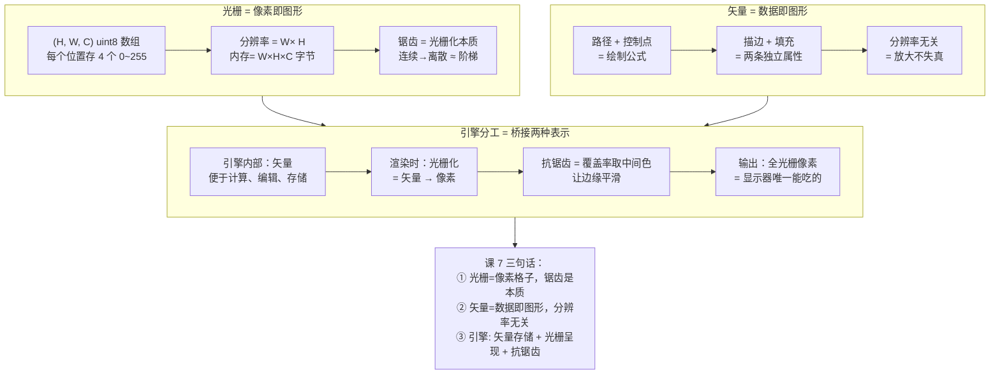

# 第 7 课：光栅与矢量

> 所属阶段：阶段 3《渲染与合成基础》｜ 水平：零基础
> 本课知识点：光栅图像、矢量图形、两种表示在引擎中的分工
> 故事情节：阶段 1-2 把动画的"数学状态"全算好了——位置、变换、关键帧、缓动、贝塞尔。可显示器只认"像素"——**工程师必须在"便于计算的矢量表示"和"便于显示的光栅表示"之间搭一座桥**
****

## 🎯 本课目标

- 用 NumPy 表示一个 RGBA 画布，解释锯齿产生的根本原因
- 说清路径 / 控制点 / 描边与填充，解释"分辨率无关"意味着什么
- 说明引擎中何阶段用矢量、何阶段必须光栅化，以及抗锯齿处于哪一步

---

## 第一幕：起源与场景引入

> 🏛️ **起源**：1963 年，Ivan Sutherland 的 Sketchpad（课 4 已讲）用**矢量**方式描述图形。同期计算机显示器是**光栅**的——电子束一行一行扫。两种表示从一开始就有"缝隙"，1970s 起的图形硬件和软件都在解决**"矢量怎么变成光栅"**的问题。（核查于 2026-09）

**场景**：阶段 1-2 算完了"动画该怎么动"——每帧角色应该在哪、是什么姿态。但**显示器不会读方程**。它只认**像素格子**里每个格子是什么颜色。

这就有个根本问题：

> **引擎内部存什么？** 存像素（光栅）→ 简单，但放大就糊、改色困难；存方程（矢量）→ 灵活，但最终显示仍要变回像素。

这不是"哪个更好"的问题——**两者各司其职**：

- **矢量**（数据层）：存路径、控制点、变换矩阵——便于**编辑、计算、变换**（课 5 的矩阵直接直接用）
- **光栅**（显示层）：存 W×H 个像素——便于**屏幕显示、跨设备通用**

> 🎬 **场景**：本课讲"两种世界观"——**光栅是「像素即图形」、矢量是「数据即图形」**。最后的桥梁是**抗锯齿**——把矢量"画"成光栅时不能让边缘出现锯齿。

---

## 第二幕：认知冲突

直觉上，"显示"只是把画好的东西显示出来，没什么花头。

**冲突 1：放大一张图片会模糊，矢量图不会**

- 把手机拍的照片放大 5 倍 → 模糊（每个像素被拉大）
- 把 PDF/SVG 放大 5 倍 → 依旧清晰

**为什么？** 因为前者存的是**像素结果**（结果被放大了），后者存的是**绘制公式**（重新求值）。

**冲突 2：即使矢量看起来完美，最终还是要变成像素**

显示器、电子屏幕、打印设备——**没有一种是矢量的**。矢量必须经过**光栅化（rasterization）**才能显示。**光栅化的瞬间，矢量再清晰也要"近似"成离散像素**。

**冲突 3：近似就有锯齿**

一根斜线"理论上"是直线，但**像素格子是离散的**——只能在每个格子里"近似"。结果：**阶梯状的边缘**（锯齿，aliasing）。

> ❓ **问题**：**AI 给矢量数据 → 引擎怎么变成屏幕能显示的像素？** 这中间的"桥梁"是什么？怎么让边缘不平滑？

---

## 第三幕：层层揭示

### 知识点 1：光栅图像

> 本知识点关键点：像素网格 / 分辨率 / 通道与位深 / **锯齿与光栅化的本质**

#### 一句话定义

**光栅图像（raster image）** = **像素网格**——每个像素存一个颜色值。**位置即索引（y, x, c）**。图像是"已经算好的结果"，便于显示但**分辨率固定、放大模糊**。

#### 直觉建立（类比）

把光栅图像想成**马赛克拼图**：

- 画布 = 一块 W × H 的马赛克
- 每个小方块 = 1 像素
- 每个方块只能填**一种颜色**（4 个数值：R、G、B、A）
- 显示 = 把方块按格子排列好给观众看

> 💡 **类比的边界**：马赛克每个小块是**不可再分**的；光栅像素在概念上也是——**一个像素只能是一个颜色**。这就是"光栅图像不能无限放大"的根本原因。

#### 核心原理

**NumPy 表示**：

```python
canvas = np.zeros((H, W, 4), dtype=np.uint8)
# .shape = (H, W, 4)   # 行 / 列 / 通道
# .dtype = uint8       # 每通道 8 bit，取值 0~255
# .nbytes = H × W × 4 字节

canvas[10, 20] = [220, 60, 60, 255]   # 第 10 行、第 20 列 = (R, G, B, A)
```

> ⚠ **常见坑**：数组索引是 `[y, x]`（**先行后列**），但几何坐标常写成 `(x, y)`（**先横后纵**）。两者相反！PIL/Pillow 用 `(x, y)`，NumPy 用 `[y, x]`——**写错就把整张图翻转 90°**。

**通道与位深**：

| 格式 | 位深 | 字节数 | 用途 |
|------|------|--------|------|
| 灰度 | 8 bit | W×H×1 | 黑白照片、UI 蒙版 |
| RGB | 24 bit | W×H×3 | 一般图像 |
| RGBA | 32 bit | W×H×4 | 需要透明度的图层 |

**内存与分辨率的关系**：

| 分辨率 | RGBA 内存 |
|--------|-----------|
| 480×320 | 614 KB |
| 1280×720 | 3.5 MB |
| 1920×1080 | **7.9 MB** |
| 3840×2160 | 31.6 MB |

**未经压缩的 RGBA 全在内存里**。这就是为什么视频要压缩（课 9 主题）。

**锯齿与光栅化的本质**（**最重要的概念**）：

**连续的数学形状 → 离散的像素格子 = "近似"**。

| 概念 | 含义 |
|------|------|
| **光栅化（rasterization）** | 把连续的矢量描述转成离散像素的过程 |
| **锯齿（aliasing / jaggies）** | 光栅化时边缘的阶梯状瑕疵 |
| **走样（alias）** | 采样率不足导致的高频信息"折叠"成低频（信号的"别名"）|

> 一根 45° 斜线"理论上"无限光滑，但**每个像素只能取一个颜色**——所以边缘必然是**阶梯**。**锯齿不是 bug，是光栅化的本质产物**。

#### 示例演示

跑一次本课脚本：

```text
raster_basics.png        RGBA 画布结构 + 通道 + 字节数
resolution_ramp/         24 帧，同一个圆在递增分辨率下渲染
```

打开 `raster_basics.png` 看 6×4 的小画布：

- **白色**：完全不透
白
- **红色**：RGB=(220,60,60)，A=255
- **蓝色**：RGB=(60,140,220)，A=128（半透明）
- **绿色**：RGB=(60,180,90)，A=255
- **空白**（A=0）：完全透明

控制台实测：

```
canvas = np.zeros((240, 320, 4), dtype=np.uint8)
  .shape  = (240, 320, 4)      # (H, W, C)
  .dtype  = uint8
  .nbytes = 307,200 字节  = 300.0 KB
  canvas[10, 20] = [220, 60, 60, 255]   # 第 10 行、第 20 列
```

打开 `resolution_ramp/frame_000.png` 看最低分辨率（12×12），圆边**明显锯齿**；翻到 `frame_023.png` 看 240×240，圆边**接近平滑**。

#### 常见误区

1. **"分辨率越高越好"**——不一定。**分辨率越高 = 内存越大 + 渲染越慢 + 文件越大**，要按用途选
2. **"光栅就是 JPEG/PNG"**——错。**PNG 是无损光栅**，JPEG 是有损光栅。光栅是表示方式，PNG/JPEG 是文件格式
3. **"NumPy 数组用 [x, y] 索引"**——错。**NumPy 用 [y, x]**（先行后列）；**PIL 用 (x, y)**。两者相反是新手最常踩的坑
4. **"放大光栅图 = 提升画质"**——错。放大是**把每个像素格子拉大**（+插值猜测新像素），画质不会变好；**矢量重新求值**画质才会变好
5. **"显示器只显示光栅"**——对。**没有矢量显示器**

#### 一句话记住

> **光栅图像 = 像素网格**，位置即索引 `(y, x, c)`；锯齿是光栅化的本质产物，不是 bug。

#### 延伸阅读

- [Raster graphics · Wikipedia](https://en.wikipedia.org/wiki/Raster_graphics)
- [Aliasing · Wikipedia](https://en.wikipedia.org/wiki/Aliasing)
- [RGBA color model · Wikipedia](https://en.wikipedia.org/wiki/RGBA_color_model)
- 课 8《图层、alpha 与深度排序》——多个 RGBA画布怎么合成
- 课 9《视频参数与压缩原理》——RGBA 全在内存里，所以视频要压缩

---

### 知识点 2：矢量图形

> 本知识点关键点：路径 / 控制点 / 分辨率无关 / 描边与填充 / **数据即图形**

#### 一句话定义

**矢量图形（vector graphics）** = 用**数学公式**描述图形——**路径 + 控制点 + 描边/填充**。**数据即图形**——存的是"画法"不是"结果"，**分辨率无关**（放大重新求值，不失真）。

#### 直觉建立（类比）

把矢量图形想成**建筑师的施工图纸**：

- 不是房子本身，而是**怎么盖这栋房子的指令**（线条、尺寸、坐标）
- 同一份图纸可以**用不同比例盖出**不同的房子（小别墅、高楼大厦）——**形状完全一致，只是大小不同**
- 工人（**渲染器**）按图纸施工——**多大的画布都能画**

> 💡 **类比的边界**：建筑师图纸只是线条，矢量图可以有填充、阴影、渐变——**比纯线条更丰富**。但**核心思想不变**：存的是"描述"，不是"成品"。

#### 核心原理

**矢量图形的三要素**：

| 元素 | 含义 | 例子 |
|------|------|------|
| **路径（path）** | 一系列点 + 连接方式（直线 / 贝塞尔） | `M 10,10 L 100,100 C ...` |
| **控制点（control点）** | 路径的贝塞尔控制点（课 6） | `P₀=(10,10) P₁=(30,80) ...` |
| **描边与填充** | 两条独立的视觉属性 | `stroke="#000" fill="#f00"` |

**SVG 实例**（最简单的矢量文件）：

```xml
<svg width="100"  height="100">
  <circle cx="50" cy="50" r="40"  stroke="black"  fill="red" />
</svg>
```

这就是一个完整的"圆"——存的是**公式**，不是像素。

**分辨率无关的根源**：

```
存：P₀=(10,10)  P₁=(50,80)  P₂=(90,10)   ← 路径 + 控制点
渲染时：给定画布尺寸 W×H，重新求值每个像素 → 永远是连续的
```

> 放大 = 重新求值 = 永远连续。**像素格子被"重新填充"，每个格子都重新算一次"这里该是什么颜色"**。

**描边 vs 填充**：

| 属性 | 控制什么 | 例子 |
|------|---------|------|
| **stroke（描边）** | 路径**轮廓**的线条 | 粗细、颜色、虚线 |
| **fill（填充）** | 路径**内部**的颜色 | 单色、渐变、纹理 |

两条属性**独立**——同一个圆可以有"红色填充 + 黑色 2px 描边"。

#### 示例演示

跑一次本课脚本：

```text
vector_scaling.png    同一矢量图形渲染到多种分辨率
```

打开 `vector_scaling.png` 看 4 个瓦片：

- **左 32×32**：1024 px 的星形，明显**锯齿**
- **64×64**：4096 px，少量锯齿
- **128×128**：16384 px，几乎平滑
- **右 256×256**：65536 px，**完全平滑**

**关键点**：4 个星形由**同一份路径 + 控制点**生成——只是渲染到不同分辨率。

控制台实测（与光栅对比）：

```
矢量 → 多分辨率：32² / 64² / 128² / 256²
  -> 同一份路径数据（10 个顶点的星形）
  -> 存公式而非结果；放大时重新求值
  -> 分辨率无关 = 缩放不模糊

光栅 → 放大：W×H → (kW)×(kH)
  -> 每个像素格子被拉大 k 倍（+插值猜测新像素）
  -> 必然模糊
```

#### 常见误区

1. **"矢量就是 SVG"**——错。**PDF、PostScript、AI、CDR、字体（TrueType/OpenType）都是矢量**。SVG 只是其中一种格式。
2. **"矢量永远比光栅好"**——错。**照片不适合矢量**（细节太多，矢量描述会更大）。矢量适合**图标、插画、文字、UI**——边缘清晰、几何为主的内容。
3. **"矢量放大永远不模糊"**——对，但**有代价**：放大时**重新计算**所有像素（CPU/GPU 耗时）。256² → 4096² 是 256× 工作量。
4. **"矢量文件比光栅小"**——不一定。**简单图标矢量更小**（几十字节），**复杂场景矢量反而大**（上百万字节）。**照片永远用光栅**（JPEG 几 MB，矢量描述会几十 GB）。
5. **"AI 输出像素就够了"**——错。**AI 输出矢量更灵活**——用户可以改色、改形、改比例，**不影响画质**。需求文档的"分层矩阵（矢量）"就是这个原因。

#### 一句话记住

> **矢量图形 = 数据即图形**——存路径/控制点/填充/描边，**分辨率无关**（放大时重新求值）。

#### 延伸阅读

- [Vector graphics · Wikipedia](https://en.wikipedia.org/wiki/Vector_graphics)
- [SVG specification · W3C](https://www.w3.org/TR/SVG/)（矢量图形的标准格式）
- 课 6《插值、缓动与贝塞尔》——**贝塞尔曲线就是矢量路径的核心**（数学基础）
- 需求文档的"分层矩阵"——就是矢量描述

---

### 知识点 3：两种表示在引擎中的分工

> 本知识点关键点：**矢量存储 + 光栅呈现** / 抗锯齿 / **与需求文档节点矩阵的对应** / 何时必须光栅化

#### 一句话定义

**矢量 + 光栅 各司其职**——引擎内部用**矢量**（数据即图形、便于变换），最终输出**必须光栅化**（显示器只认像素）。**抗锯齿是光栅化阶段的技术**——把矢量的"近似"变得"自然"。

#### 直觉建立（类比）

把矢量→光栅的过程想成**雕塑**：

- **矢量 = 雕塑的图纸**（精确、数学描述、随时可改）
- **光栅 = = 雕好的石像**（实物、不能"放大"看清细节）
- **抗锯齿 = 雕塑后的打磨**——让边缘圆润、不过于生硬

最终给观众看的**永远是雕塑（光栅）**，但**修改一直是在图纸（矢量）上进行的**。

> 💡 **类比的边界**：雕塑是物理过程，光栅化是数学计算。但**"内部可改、最终定型"**的逻辑一致。

#### 核心原理

**矢量 + 光栅 各司其职**：

| 表示 | 用在哪 | 为什么 |
|------|--------|--------|
| **矢量** | 引擎**内部**（数据层） | 便于**计算**（课 5 矩阵）、**编辑**（改色/改形/改比例）、**存储**（公式比像素紧凑） |
| | **数据传输**（需求文档的节点矩阵） | 同一份数据可用于任意分辨率、不同用途 |
| **光栅** | **最终显示**（屏幕、显示器） | 显示器**只认像素**；颜色直接用整数 0~255 |
| | **视频编码**（阶段 4） | 视频文件存的是像素序列（帧间压缩） |

**抗锯齿（anti-aliasing）**——光栅化的关键技术：

**问题**：一根 45° 斜线"理论上"是直线，但**像素格子是离散的**——边缘必然阶梯状（锯齿）。

**解决**：边缘像素**按"覆盖率"取中间色**，而非"二选一"：

```
        覆盖率 30% → 30% 前景色 + 70% 背景色
        覆盖率 50% → 中间色
        覆盖率 70% → 70% 前景色 + 30% 背景色
```

这样**锯齿从"二值"变成"连续"**——视觉上变平滑。

**超采样（supersampling）做法**：

1. 按 4× 分辨率画（即 W×4, H×4 的内部画布）
2. 每个边缘像素被"细分"，能更精确地估算覆盖率
3. 用 LANCZOS 等高斯降采样算法缩回 W×H

> 这就是 PIL 渲染圆、字体时"看起来平滑"的背后原理——超采样抗锯齿。

**引擎流水线**（与需求文档对应）：

```
矢量数据（路径 / 控制点 / 变换矩阵）
  ↓ 几何变换（课 5 矩阵：旋转、缩放、平移、齐次、绕任意点）
光栅化 + 抗锯齿   ← 本课的关键一步
  ↓ 图层合成（课 8：alpha 合成、深度排序、极端颜色标签）
输出像素（W×H×C）
  ↓ 视频编码（阶段 4：H.264/H.265、PNG/GIF）
最终文件
```

**何时必须光栅化**——**只有"最终显示/导出"那一刻**：

- 编辑时（用户改色、改大小）：**始终用矢量**（光栅化每改一次就重新画，浪费）
- 渲染时（最终合成）：**矢量 + 光栅**混合（矢量先光栅化到中间画布，再合成）
- 导出时（保存成 PNG/MP4）：**全纯化为像素**（PNG 存像素是、MP4 编码帧是）

> 💡 **需求文档的对应**：需求文档第七节说要「按 Z 轴排序」输出像素——这个"像素"就是**本课说的"最终光栅化结果"**。**前期 AI 输出矢量节点，后期渲染时再光栅化**——这就是两种表示的分工。

#### 示例演示

跑一次本课脚本：

```text
antialiasing_compare.png    锯齿 vs 抗锯齿（超采样原理）
```

打开 `antialiasing_compare.png` 看两组对比：

- **左 ❌ 无抗锯齿**：120×120 的红圆，**最近邻放大**到 240×240 → **边缘锯齿明显**（每个像素非红即白）
- **右 ✅ 抗锯齿**：480×480 的绿圆（4× 超采样），**LANCZOS 缩回**到 240×240 → **边缘平滑**（覆盖率取中间色）

控制台输出（引擎流水线总结）：

```
引擎流水线：
  矢量数据（路径/控制点/变换矩阵）
    → 几何变换（课 5 矩阵）
    → 光栅化 + 抗锯齿   ← 本课的关键一步
    → 图层合成（课 8 alpha / z 排序）
    → 编码导出（阶段 4）
```

#### 常见误区

1. **"引擎内部也用像素"**——错。**引擎内部用矢量**（数据即图形），**渲染前才光栅化**。**全程像素会丢失所有灵活性**（改色、改形都要重画）。
2. **"抗锯齿 = 模糊"**——错。抗锯齿**让边缘自然过渡**，**不是整体模糊**。结果看起来更清晰（边缘不锯齿），不是"糊"。
3. **"只要分辨率够高就不需要抗锯齿"**——理论对，**工程上几乎 always用**。因为分辨率够高 → 内存/计算量爆炸，得不偿失。
4. **"AI 输出像素就够了"**——错。**AI 输出矢量更灵活**——用户改色/改形/改比例都不影响画质。需求文档的"分层矩阵（矢量）"就是这个原因。
5. **"抗锯齿只能用于曲线"**——错。**任何边缘**都能抗锯齿（曲线、直线、文字、矩形边）。

#### 一句话记住

> **矢量存储 + 光栅呈现**——引擎内部**始终用矢量**便于计算；**最终显示才光栅化**（抗锯齿 = 让光栅化后的边缘不平）。

#### 延伸阅读

- [Anti-aliasing · Wikipedia](https://en.wikipedia.org/wiki/Anti-aliasing)
- [Supersampling · Wikipedia](https://en.wikipedia.org/wiki/Supersampling)
- [Scanline rendering · Wikipedia](https://en.wikipedia.org/wiki/Scanline_rendering)（另一种抗锯齿思路）
- 需求文档第七节（"按 frame 字段过滤 + 按 z_depth 排序"）——本课输出的像素会在那里合成，课 8 讲排序规则
- 课 8《图层、alpha 与深度排序》——抗锯齿之后的下一步：合成

---

## 第四幕：实操验证

### 运行方式

在 PowerShell 中（先切到课程目录）：

```powershell
cd d:\projects\learning\animation-engine\00-动画与视频基础
.\playground\.venv\Scripts\python.exe .\playground\lesson-07\raster_vector_demo.py
```

预期输出（脚本在 Python 3.12.13 + numpy 2.5.2 + pillow 12.3.0 上验证通过）：

```text
=== 知识点 1：光栅图像 ===
RGBA 画布结构 -> raster_basics.png
  canvas = np.zeros((240, 320, 4), dtype=np.uint8)
    .shape  = (240, 320, 4)      # (H, W, C) 行 / 列 / 通道
    .dtype  = uint8            # 每通道 8 bit，取值 0~255
    .nbytes = 307,200 字节  = 300.0 KB

  ⚠ 常见坑：数组索引是 [y, x]（先行后列），但坐标常写成 (x, y) —— 两者顺序相反

=== 知识点 2：矢量图形 ===
矢量渲染到多分辨率 -> vector_scaling.png
  -> 同一份路径数据（10 个顶点的星形）→ 32/64/128/256 都成立

=== 知识点 3：两种表示的分工 ===
抗锯齿对比 -> antialiasing_compare.png
  -> 超采样：按 4× 画 → LANCZOS 缩回 → 边缘按覆盖率取中间色
```

### 怎么翻看

| 文件 | 翻看要点 | 对应知识点 |
|------|----------|------------|
| `raster_basics.png` | 6×4 像素网格 + RGBA 通道可视化 + 内存计算 | 光栅图像 |
| `resolution_ramp/frame_000.png` | **最低分辨率**（12×12）—— 圆边明显锯齿 | 锯齿是光栅化的本质 |
| `resolution_ramp/frame_012.png` | 中分辨率（131×131）—— 锯齿可见但不严重 | 锯齿随分辨率下降 |
| `resolution_ramp/frame_023.png` | 高分辨率（240×240）—— 圆边接近平滑 | 够高的分辨率也能消除锯齿 |
| `vector_scaling.png` | 4 个分辨率下的同一星形（32² / 64² / 128² / 256²） | 分辨率无关 = 矢量特性 |
| `antialiasing_compare.png` | 左 ❌ 锯齿红圆 vs 右 ✅ 抗锯齿绿圆 | 抗锯齿 = 覆盖率采样 |

**翻看方式**：
- 4 张图直接打开看对比
- `resolution_ramp/` 24 帧用 Windows 照片应用 + → 方向键逐张翻——**看圆边锯齿从有到无的渐变**

> 📌 **一点说明，免得你以为程序写错了**：
> `resolution_ramp/` 左边的圆看起来"模糊"是**最近邻放大**的结果（**故意暴露**低分辨率光栅的锯齿）。右边的"参照"圆是**全分辨率 + 抗锯齿**——这才是矢量 → 高质量光栅化应有的样子。

### 动手改一改（建议都试一遍）

| 改什么 | 预期看到 | 对应知识点 |
|--------|---------|-----------|
| `raster_basics.png` 里的 `demo[2, 4] = [0, 0, 0, 0]` 改成 `[0, 0, 0, 64]` | 那个格子从"完全透明"变成"几乎透明黑"（64/255） | alpha 通道语义 |
| `raster_basics.png` 里把 `H, W = 320, 240` 改成 `H, W = 3840, 2160` | 内存从 300KB → 31.6MB，**全部在内存里** | 光栅的代价 |
| `resolution_ramp` 里的 `inner` 起始值从 `12` 改成 `4` | 圆边**极端锯齿**（4×4 只能画 16 个像素） | 锯齿与分辨率的关系 |
| `vector_scaling` 里的 `star_points(...)` 改成画一个**圆**（多顶点多边形逼近圆） | 同一原理，但圆比星形更"规则" | 路径数据的形式 |
| `vector_scaling` 里再加一个尺寸 `512` | 更大尺寸的星形仍清晰 | 分辨率无关 |
| `antialiasing_compare.png` 里的 `ss = 4` 改成 `ss = 1` | 抗锯齿几乎失效（边缘出现锯齿）——验证超采样是抗锯齿的**关键** | 超采样抗锯齿原理 |
| `antialiasing_compare.png` 里的 `ss = 4` 改成 `ss = 8` | 抗锯齿更精细（边缘几乎看不出）——但**计算量变成 64×** | 抗锯齿的代价 |

> ✅ **回扣场景**：现在可以回答开头的问题了。
> - **"AI 给矢量数据 → 引擎怎么变成屏幕能显示的像素？"**——**光栅化**（超采样抗锯齿）。引擎内部存矢量（路径/控制点/变换），渲染时按目标分辨率光栅化到像素画布，再合成到最终图像。
> - **"为什么放大照片会模糊，PDF 不会？"**——照片存**像素**（拉大像素格子），PDF 存**公式**（重新求值）。**这就是两种表示的根本差异**。
> - **"锯齿是什么？"**——**光栅化的本质产物**，不是 bug。连续数学形状 → 离散像素格子 → 边缘只能"近似" → 锯齿。**抗锯齿**用覆盖率取中间色让边缘平滑。
> - **"需求文档的'按 Z 轴排序'是哪一步"**——**在光栅化之后、合成时**（课 8 主题）。光栅化给每层生成 RGBA 像素画布，合成时按 z 值排序决定遮挡关系。

---

## 第五幕：体系收束

```mermaid
flowchart LR
    A[阶段 1-2<br/>位置/变换/缓动/贝塞尔<br/>算出"每个像素该是什么颜色"] --> B["课 7 知识点 1<br/>光栅图像<br/>= 像素格子 (H,W,C)"]
    A --> C["课 7 知识点 2<br/>矢量图形<br/>= 路径 + 控制点"]
    C --> D["课 7 知识点 3<br/>引擎分工：<br/>矢量存储 + 光栅呈现"]
    B --> D
    D --> E["课 8<br/>图层 + alpha + 深度排序<br/>把多层合成最终图像"]
    E --> F["阶段 4<br/>视频编码 + 压缩 + 导出"]
```

> 📍 **全局定位**：本课（课 7）回答了**一个根本问题**——**「算出来的数学怎么变成屏幕能显示的像素」**。三件事合起来：
>
> | 知识点 | 回答的问题 | 本质 |
> |--------|-----------|------|
> | 光栅图像 | **像素格子存颜色** | `(H, W, C) uint8` 数组；锯齿是光栅化的本质产物 |
> | 矢量图形 | **公式描述图形** | 路径 + 控制点；分辨率无关；放大重新求值 |
> | 引擎分工 | **两种表示怎么协作** | 内部矢量便于计算，输出必须光栅化；抗锯齿让边缘平滑 |
>
> **关键 insight**：**矢量 + 光栅各司其职**——**引擎内部矢量（编辑/计算/存储灵活），最终输出光栅（显示器只认像素）**。中间的桥梁是**光栅化 + 抗锯齿**——这是本课的核心。
>
> 🔗 **下一步**：本课把"单层图怎么从公式变成像素"解决了。**但需求文档要「分层渲染 + 按 Z 轴排序」**——多个图层怎么合成？哪层在上、哪层在下？透明度怎么算？这就需要**alpha 合成 + 深度排序**——这就是**课 8**的内容。课 8 后，**从 AI 输出矢量 → 屏幕显示完整图像**的全链路就通了。

---

## 🐞 常见误区

1. **"分辨率越高越好"**——不一定；**内存和计算量都增加**，要按用途选
2. **"NumPy 数组用 [x, y] 索引"**——错；**用 [y, x]**（先行后列）；PIL 才用 (x, y)
3. **"光栅就是 JPEG/PNG"**——错；**PNG 无损光栅、JPEG 有损光栅**；光栅是表示方式
4. **"矢量永远比光栅好"**——错；**照片只能用光栅**（细节太多，矢量太大）
5. **"矢量文件一定比光栅小"**——不一定；**简单图标矢量更小，但复杂场景矢量反而更大**
6. **"引擎内部也用像素"**——错；**引擎内部用矢量**（便于编辑和变换）
7. **"抗锯齿 = 模糊"**——错；**让边缘自然过渡**，不是整体模糊
8. **"只要分辨率够高就不需要抗锯齿"**——理论对；工程上几乎 always 用

## 一图总结



## 课后小测

**Q1**：一个 1280×720 的 RGBA 画布（每通道 8 bit），未压缩需要多少内存？

- A. 2.6 MB
- B. 3.5 MB
- C. 7.9 MB
- D. 29.5 MB

<details><summary>答案与解析</summary>

**答案：B**。1280 × 720 × 4 = 3,686,400 字节；除以 1024² （1,048,576）≈ **3.5 MB**。
**A 错**（2.6 MB 是 **RGB 24 bit** 的结果：1280×720×3 ÷ 1024² ≈ 2.6 MB，不是 RGBA）；
**C 错**（7.9 MB 是 **1920×1080** 的 RGBA，不是 1280×720）；
**D 错**（29,491,200 是 **bit** 数而非字节数：1280×720×4 字节 × 8 = 29,491,200 bit；问的是字节，要再 ÷ 8）。
> 💡 换算提醒：1 MB = 1024² = 1,048,576 字节；**bit（位）和 byte（字节）差 8 倍**，这是最易错的地方。
</details>

**Q2**：关于矢量图形的"分辨率无关"，下列说法正确的是？

- A. 矢量放大不失真，因为存的是像素结果
- B. 矢量放大不失真，因为放大时重新求值（公式不变，像素重新算）
- C. 矢量文件一定比光栅小
- D. 矢量图形只能用于几何形状，不能画照片

<details><summary>答案与解析</summary>

**答案：B**。矢量存的是**公式**（路径 + 控制点），放大 = 重新求值 = 永远连续。**A 错**（A 描述的是**光栅**的特性，不是矢量；矢量**不存像素结果**）；**C 错**（简单图标矢量更小，但**复杂场景矢量反而更大**，照片只能光栅）；**D 错**（矢量可以画**任意几何**——圆、矩形、贝塞尔曲线、复杂路径，但**不能画"像素细节"如照片纹理**）。
</details>

**Q3**：抗锯齿的本质是什么？

- A. 把整张图变模糊
- B. 边缘像素按"覆盖率"取中间色，而非"二选一"
- C. 把分辨率提高 4 倍再画
- D. 用 LANCZOS 算法替代所有其他渲染算法

<details><summary>答案与解析</summary>

**答案：B**。抗锯齿 = **边缘像素按"覆盖率"取中间色**——从"二值"（0 或 1）变成"连续"（部分前景 + 部分背景）。**A 错**（抗锯齿**不是整体模糊**，是让边缘自然过渡，主体部分仍然清晰）；**C 错**（超采样是**一种实现方式**——按高分辨率画再缩回——但**抗锯齿的本质**是覆盖率采样，不是"提高分辨率"本身）；**D 错**（LANCZOS 是**实现抗锯齿时用的降采样算法**，不是抗锯齿的本质）。
</details>

**Q4**：AI 输出矢量数据 vs 直接输出像素数据，哪种更适合引擎？

- A. 像素数据，引擎直接显示就行
- B. 矢量数据，便于编辑、计算和按需光栅化
- C. 一样，没区别
- D. 都不适合，引擎只能接受视频文件

<details><summary>答案与解析</summary>

**答案：B**。**矢量更灵活**——用户可以**改色、改形、改比例**而不影响画质；引擎可以**按需光栅化**到任意分辨率。**A 错**（像素数据放大就糊，且无法编辑）；**C 错**（两者差很多——矢量存公式、像素存结果）；**D 错**（引擎接受数据 + 自行渲染，不是视频文件）。
</details>

## 🚀 下一课接力提示词

> 学完本课后，**复制下面这段文字发给 AI**，即可无缝进入下一课（无需重新描述上下文上下文））：

```
继续学 2D 动画与视频基础。我的学习档案在 animation-engine/00-动画与视频基础/00-学习档案.md，
刚学完阶段 3《渲染与合成基础》的课《光栅与矢量》
（光栅图像、矢量图形、两种表示在引擎中的分工），
请按大纲继续讲解下一课：课 8《图层、alpha 与深度排序》第一批
（图层模型、alpha 与颜色合成）。
```

## 🧭 课程导航

⬅️ **上一课**：[课 6：插值、缓动与贝塞尔](../2-图形数学基础/lessons/lesson-06-插值缓动与贝塞尔.md)
➡️ **下一课**：[课 8：图层、alpha 与深度排序](lesson-08-图层alpha与深度排序.md)
📚 **返回目录**：[课程目录](../../02-课程目录.md)