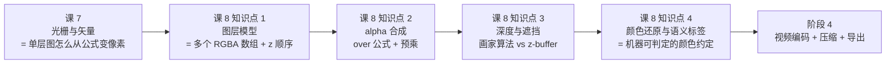
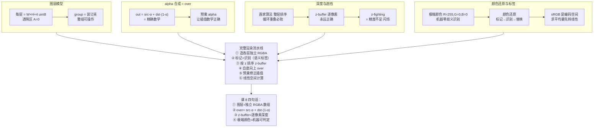

# 第 8 课：图层、alpha 与深度排序

> 所属阶段：阶段 3《渲染与合成基础》｜ 水平：零基础
> 本课知识点：图层模型、alpha 与颜色合成、深度与遮挡、颜色还原与语义标签
> 故事情节：手臂转到身体后面时穿帮了——工程师没有去改美术，而是给每个图层加了一个 z 值，让遮挡变成渲染时自动处理的事
>
> 本课拆 **2 批**：
> - **第一批**（本文件前半）：图层模型、alpha 与颜色合成
> - **第二批**（本文件后半）：深度与遮挡、颜色还原与语义标签

## 🎯 本课目标

- 说明图层与赛璐珞的对应关系，解释图层树与 group 的作用
- 手算 over 运算符的合成结果，解释预乘 alpha 解决什么问题
- 对比画家算法与 z-buffer，解释 z-fighting 的成因与规避
- 说明极端颜色标签为何可被机器判定，解释颜色还原发生在哪一步

---

# 第一批：图层 + alpha 合成

## 第一批目标

- 说明图层与赛璐珞的对应关系，解释图层树与 group 的作用
- 手算 over 运算符的合成结果，解释预乘 alpha 解决什么问题

## 第一幕：起源与场景引入

> 🏛️ **起源**：1914 年 Earl Hurd 申请**赛璐珞（cel）**专利——把角色画在透明塑料薄片上，叠在背景上拍（课 2 已讲）。这层「透明薄片」就是数字时代的**图层（layer）**的直接祖先。**分层不是软件的发明，是百年动画工业的工程结晶**。

**场景**：课 7 把"单层图怎么从公式变成像素"解决了。但需求文档**第七节**说：

> "到了第 120 帧，软件瞬间从内存中抓取所有标记为 `frame: 120` 的矩阵，**按 Z 轴深度排序**，一次性渲染到屏幕上"

——"矩阵" = 多个图层的矢量数据；"按 Z 轴排序" = 图层顺序；"渲染" = **本课要讲的多层合成**。

第一批解决两件事：
1. **图层模型**：每层 = 一张独立 RGBA 画布，多张按 z 顺序合成 = 最终画面
2. **alpha 合成**：over 运算符的精确公式 `out = src·α + dst·(1-α)`，不是模糊的"半透明效果"

## 第二幕：认知冲突

**冲突 1**：半透明不是模糊效果，是精确公式——红 (220,40,40) 叠蓝 (40,90,200)，α=0.5 得到精确 (130,65,120)
**冲突 2**：合成顺序有强制规定——over **不满足交换律**，颠倒顺序结果完全不同
**冲突 3**：缩放透明图出现"脏边"——透明像素的 RGB "没有意义"但被插值算进去

> ❓ 图层怎么在代码里表示？半透明的数学公式是什么？为什么缩放会出脏边？

## 知识点 1：图层模型

> 关键点：**图层即独立 RGBA 画布** / 叠加顺序 / **与赛璐珞的对应** / **图层树与 group**

### 一句话定义

**图层（layer）** = 一张**独立的 RGBA 画布**（课 7 的 W×H×4 uint8 数组）。**多层按 z 顺序自底向上合成** = 最终画面。**图层是赛璐珞的代码化版本**。

### 直觉建立（赛璐珞）

每张图都是**透明的赛璐珞薄片**，上面只画自己的角色；**背景画** = 最底层（不透明）；**摄影师** = 合成器，把所有薄片从底向上叠在一起拍；**group（组）** = **装订夹**，把几张薄片装在一起，可以**整组移动/显隐/调不透明度**。

> 💡 赛璐珞是物理薄片（每张只能画一次），数字图层是**任意可改的 RGBA 数组**。**赛璐珞贵，图层便宜**——这正是数字动画成本结构的核心变化。

### 核心原理

```python
layer_bg     = np.zeros((H, W, 4), dtype=np.uint8)   # 背景
layer_mtn    = np.zeros((H, W, 4), dtype=np.uint8)   # 远山
layer_actor  = np.zeros((H, W, 4), dtype=np.uint8)   # 角色
layer_fg     = np.zeros((H, W, 4), dtype=np.uint8)   # 前景
# 各自只画自己，透明区域 A=0
```

**图层属性**：可见性 / 不透明度 / 变换（课 5 矩阵）/ 混合模式 / **z 值**（合成顺序，越小越在下）

**图层树与 group**：

```
scene (根)
├─ background (group)
│   └─ ground (z=0)
├─ midground (group)
│   └─ mountain (z=1)
├─ actors (group)
│   └─ character (z=2)
└─ foreground (group)
    └─ grass (z=3)
```

**group 的作用**：整组操作（移动/显隐/改不透明度）、z 顺序保留、复用（森林 100 棵树 = 1 group × 100）。

**合成 = 自底向上反复套用 over**：

```python
final = layers[0].rgb
for layer in layers[1:]:
    final = over(final, layer.rgb, layer.alpha)   # 新层在上 = src
```

**与赛璐珞对应**（核心 insight）：

| 赛璐珞 | 数字图层 |
|--------|---------|
| 透明塑料薄片 | RGBA 数组 |
| 装订夹 | group |
| 摄影师从上往下拍 | 渲染器自底向上 over |
| 整套染色 | group.opacity = 0.5 |

> 💡 需求文档的"分层矩阵"= 多个独立 RGBA 数组 + 各自 z 值。**渲染时按 z 排序、自底向上 over**——这就是赛璐珞工艺的代码化版本。

### 示例演示

跑 `layer_alpha_demo.py` 看 `layer_stack.png`：四张缩略图（棋盘底 = 透明区域）+ 合成结果 + 图层树。

### 常见误区

1. **"图层就是 PS 里的层"**——**对**；但**用 z 值排序更可靠**（z 是显式语义）
2. **"图层顺序就是数组顺序"**——**对**，但 **z 值更可靠**
3. **"group 就是文件夹"**——类似，但 **group 有自己的属性**（整组操作）
4. **"图层越多越慢"**——**不严格对**；每层多一次 over，总开销可控
5. **"背景层一定要不透明"**——**通常对**，但**渐变背景也可以半透明**
6. **"赛璐珞 = 图层"**——**不完全对**；核心思想一致，表示方式进化

### 一句话记住

> **图层 = 独立 RGBA 数组 + z 顺序**；合成 = 自底向上反复 over；group = 装订夹。

### 延伸阅读

- [Layer (digital imaging) · Wikipedia](https://en.wikipedia.org/wiki/Layer_(digital_imaging))
- [Cel animation · Wikipedia](https://en.wikipedia.org/wiki/Cel_animation)
- 课 2《手绘工厂：关键帧、中割与律表》——赛璐珞分层来源
- 课 8 第二批——图层有了 z 顺序的判定规则

---

## 知识点 2：alpha 与颜色合成

> 关键点：**alpha 通道** / **over 运算符公式** / **预乘 alpha** / **边缘伪影**

### 一句话定义

**alpha 合成** = 用 **over 运算符** 把多层 RGBA 合成成一层的精确过程。**`out = src·α + dst·(1-α)`**。**预乘 alpha** 解决插值时的"脏边"问题。

### 直觉建立（调色板）

不是把红色稀释，而是**用 α 比例的红色 + (1-α) 比例的背景色**调出第三种颜色。**α 就是"用多少前景 + 多少背景"的混合比例**。

### 核心原理

**over 公式**（**整堂课最核心的公式**）：

```
out_rgb = src · α + dst · (1 - α)
```

**手算**（一定要自己算一遍）：

src=(220, 40, 40)（红），dst=(40, 90, 200)（蓝），α=0.5：

| 通道 | 计算 | 结果 |
|------|------|------|
| R | 220×0.5 + 40×0.5 = 110 + 20 | **130** |
| G | 40×0.5 + 90×0.5 = 20 + 45 | **65** |
| B | 40×0.5 + 200×0.5 = 20 + 100 | **120** |

→ **out = (130, 65, 120)**（**精确的紫红色**，不是"大概紫色"）

**边界检查**：

| α | 结果 | 含义 |
|---|------|------|
| 0 | 完全 = dst | 前景不存在 |
| 1 | 完全 = src | 前景盖住背景 |

> ⚠ **over 不满足交换律**：`over(a, b) ≠ over(b, a)`——**后画的层一定在上**。这就是"自底向上"是唯一约定的原因。

**预乘 alpha（premultiplied）——解决"脏边"**：

| 表示 | 透明像素的 RGB | 插值时 |
|------|---------------|--------|
| **非预乘** | 通常 (0,0,0,0) | 边缘被 (0,0,0) **拉向黑色** |
| **预乘** | 必为 (0,0,0,0)（rgb = 原色 × α）| 边缘**纯色插值**，无污染 |

**预乘公式**：存储 `rgb_premult = rgb·α` → 插值 → 反算 `rgb = rgb_premult / α`（α=0 跳过）

> 💡 预乘不是"更清晰的画质"，是"**让插值数学正确**"——透明像素的 RGB 本无意义，非预乘却让它参与了平均。

### 示例演示

跑 `layer_alpha_demo.py`：
- `over_ramp/frame_012.png`（α≈0.522）：红 + 蓝 → **紫红 (134,64,117)**，**手算精确**
- `premultiplied_compare.png`：左 ❌ 暗色光晕（脏边）vs 右 ✅ 边缘干净

控制台验证：

```
手算  src=(220,40,40)  dst=(40,90,200)：
  alpha=0.50  →  (130, 65, 120)
  alpha=0.00  →  ( 40, 90, 200)   ← 完全 dst
  alpha=1.00  →  (220, 40,  40)   ← 完全 src
```

### 常见误区

1. **"半透明是模糊效果"**——**错**；半透明 = 精确公式；模糊 = 邻域平均
2. **"over 满足交换律"**——**错**；顺序颠倒结果完全不同
3. **"alpha 越大越亮"**——**错**；alpha 只控制前景占比
4. **"预乘 = 更清晰画质"**——**错**；预乘让插值数学正确
5. **"透明像素 RGB 不重要"**——**对**（屏幕不显示），**但非预乘会把它算进插值**——脏边根源
6. **"PIL `paste(im, mask=im)` 就是 alpha 合成"**——**对**，但**默认非预乘**

### 一句话记住

> **`out = src·α + dst·(1-α)`** = over 公式（精确数学）；**预乘 alpha** = 让插值数学正确。

### 延伸阅读

- [Alpha compositing · Wikipedia](https://en.wikipedia.org/wiki/Alpha_compositing)
- [Premultiplied alpha · Wikipedia](https://en.wikipedia.org/wiki/Alpha_compositivity)
- [Porter–Duff compositing · Wikipedia](https://en.wikipedia.org/wiki/Porter%E2%80%93Duff_compositing)
- PIL `Image.alpha_composite()` 文档

---

# 第二批：深度 + 颜色还原

## 第二批目标

- 对比画家算法与 z-buffer，解释 z-fighting 的成因与规避
- 说明极端颜色标签为何可被机器判定，解释颜色还原发生在哪一步

## 第一幕：起源与场景引入

> 🏛️ **起源**：1968-1973 年 Edwin Catmull 在犹他大学发明 **z-buffer** 概念（《A Subdivision Algorithm for Computer Display of Curved Surfaces》），解决了"哪个面在前"的根本问题。**z-buffer 让遮挡判断从"美术问题"变成"算法问题"**——这是需求文档"AI 不用管遮挡"主张的工程基础。

**场景**：第一批解决了"图层"和"半透明"。但**z 顺序怎么判定**？角色在山前 vs 山在角色前——**深度（z 值）谁说了算**？需求文档的"AI 不用管遮挡"听起来很美，工程上怎么实现？

第二批解决：
1. **深度与遮挡**：画家算法（整层排序）vs z-buffer（逐像素比较）；z-fighting 的成因与规避
2. **颜色还原与语义标签**：为什么 `R=255,G=0,B=0` 是个机器可判定的约定；颜色还原发生在哪一步

## 第二幕：认知冲突

**冲突 1**：z 顺序看起来很简单——"远的先画，近的后画"就行。但当两个图层**循环重叠**（A 压 B、B 压 C、C 压 A）时，无法排出一个全局顺序——**整层排序必败**。

**冲突 2**：z-buffer 听起来完美，但当两个面**几乎共面**时，深度缓冲精度有限，比较结果在"大于/小于"之间抖动 → 屏幕出现**斑块闪烁**（z-fighting）。

**冲突 3**：颜色还原看起来"多此一举"——"图片显示什么颜色就是什么颜色"。但**sRGB 是 gamma 编码的"显示值"，不是"物理量"**——直接对显示值求平均，物理上不正确。

> ❓ z 顺序怎么判定？什么是 z-fighting？为什么「纯红 (255,0,0)」是个特别聪明的选择？

## 知识点 3：深度与遮挡

> 关键点：z 值 / **画家算法** / **z-buffer 逐像素比较** / **z-fighting 深度冲突**

### 一句话定义

**z 值** = 像素到观察者的距离度量（**z 大 = 越近** 或 **z 大 = 越远**，需约定）。**画家算法**整层排序（简单但循环重叠时必败）；**z-buffer** 逐像素比较（永远正确但要额外内存）。**z-fighting** = 两个面 z 值几乎相同时，比较结果随扰动翻转产生的斑块闪烁。

### 直觉建立（盖章与逐点比）

**画家算法**像**盖章**——拿起一整张图层"啪"地盖上去，按 z 排好的顺序依次盖，最后盖的压住之前的。问题：图层**内部有深度变化**时（一端近一端远），整张图层只能有一个 z——必然出错。

**z-buffer** 像**每个像素单独裁判**——每个像素记下"我目前看到的最浅深度"，新来的像素如果更近就替换。**永远正确**，代价是**多一份 W×H 的深度内存**。

### 核心原理

**画家算法 (Painter's Algorithm)**：

```python
# 按 z 排序（远的先画）
layers_sorted = sorted(layers, key=lambda l: l.z)
# 依次绘制（后画的盖住先画的）
for layer in layers_sorted:
    draw(layer)   # 整张盖上去
```

**致命缺陷**：当图层**内部有深度变化**（如倾斜长条，一端近一端远），整张只能用一个 z。**循环重叠**时（远→近→远→近）无法排出有效顺序。

**z-buffer**：

```python
# 每个像素独立的深度寄存器
depth_buffer = np.full((H, W), +inf)    # 深度缓冲
color_buffer = np.zeros((H, W, 3))      # 颜色缓冲

for layer in layers:
    for pixel in layer:
        if pixel.z < depth_buffer[y, x]:   # 更近才更新
            depth_buffer[y, x] = pixel.z
            color_buffer[y, x] = pixel.color
```

**本质差异**：

| | 画家算法 | z-buffer |
|---|---------|----------|
| **比较粒度** | 整层 | 逐像素 |
| **深度变化** | 不支持（整层一个 z）| 支持（每像素一个 z）|
| **内存** | 零额外 | 多 W×H |
| **复杂度** | 简单 | 简单 |
| **正确性** | 循环重叠时**必败** | **永远正确** |

> 💡 **需求文档的对应**：需求文档说"按 Z 轴深度排序，一次性渲染"——这话**对了一半**。简单场景（整层一个 z）画家算法足够；**复杂场景**（图层内部有深度变化、或循环重叠）**必须 z-buffer**。现代渲染管线都用 z-buffer。

**z-fighting**：

**成因**（三个条件同时满足）：
1. 两个面**几乎共面**（z 差极小）
2. 深度缓冲**精度有限**（8/16/24 bit 量化）
3. 微小扰动（插值误差、相机移动）使比较结果**在不同像素上翻转**

**表现**：两平面"打架"——斑块状的闪烁图案。

**规避**：
- ① 拉开 z 间距（**别让两面共面**）
- ② 提高深度缓冲位数（24 bit 比 8 bit 稳得多）
- ③ 用整数/定点深度（避免浮点累积误差）

### 示例演示

跑 `depth_color_demo.py`：

- `painters_vs_zbuffer.png`：两交叉长条，**z 沿 x 线性变化**（左蓝在前、右橙在前）
  - 画家算法：398 像素画错（48.2%）
  - z-buffer：两侧都正确
- `zfighting/frame_012.png`：两平面 z≈0.5，深度 8 bit（256 级），低频扰动 → **斑块闪烁**

控制台：

```
画错像素：398 / 重叠区 826 = 48.2%   ← 约一半，与"平手任意排"一致
```

### 常见误区

1. **"画家算法 = 简单场景够用"**——**对**，但工程上**几乎 always 用 z-buffer**（代价小，正确性绝对）
2. **"z-buffer 一定比画家算法慢"**——**不一定**；现代 GPU 的 z-buffer 是**硬件支持**的，几乎零开销
3. **"z 大 = 越近"**——**约定**，需明确；OpenGL 用 `glDepthFunc(GL_LESS)` 表示"更小的 z 通过"
4. **"z-fighting = 渲染 bug"**——**错**；z-fighting 是**数学本质**（有限精度）——**算法正确，效果不可避**
5. **"z-buffer 越深越好"**——**对**，但**多 bit = 多内存**；24 bit 已是工业标准
6. **"循环重叠只发生在 3D"**——**错**；2D 里**图层内深度变化**也会触发

### 一句话记住

> **画家算法** = 整层排序（简单、循环重叠必败）；**z-buffer** = 逐像素比较（永远正确、需额外内存）；**z-fighting** = 深度精度不足时的斑块闪烁。

### 延伸阅读

- [Z-buffering · Wikipedia](https://en.wikipedia.org/wiki/Z-buffering)
- [Painter's algorithm · Wikipedia](https://en.wikipedia.org/wiki/Painter%27s_algorithm)
- [Z-fighting · Wikipedia](https://en.wikipedia.org/wiki/Z-fighting)
- [Catmull & Subdivision · 犹他大学](https://www.cs.utah.edu/~cassidy/papers/catmull-subdivision.pdf)

---

## 知识点 4：颜色还原与语义标签

> 关键点：通道与 RGB / **极端颜色标签为何可机器判定** / 颜色还原 / **sRGB 与线性空间的坑**

### 一句话定义

**极端颜色标签** = 用 `R=255,G=0,B=0`（纯红）等**几乎不可能出现在自然画面**的颜色标记某个区域——机器用**整数通道阈值**即可零歧义识别。**颜色还原** = 把标记区域换回目标内容（图像/渐变/视频）。**sRGB 是 gamma 编码**，**凡「求平均」的操作（合成/插值/模糊/渐变）必须在线性空间做**。

### 直觉建立（粉笔标记与物理亮度）

**极端颜色标签**像**粉笔标记**——工地上工人用荧光粉笔画个圈，意思是"这里要拆"。**为什么不用浅黄色？**因为浅黄色可能和墙漆混淆；**为什么用粉红/纯红？**因为它在墙面上几乎不出现，**零歧义**。

**sRGB vs 线性**像**地图海拔与实际气压**——地图上 200 米是 200，但气压按高度不是线性变化的（指数衰减）。**直接对地图数字求平均**得到 100 米，但**实际平均气压**需要按指数换算。

### 核心原理

**极端颜色标签为什么可机器判定**：

**有效性来自「机器可判定」**——**不是因为红色好看**，而是因为 `R=255,G=0,B=0` 在自然画面里**几乎不可能出现**。

判定只是整数比较：
```python
mask = (R >= 250) & (G <= 5) & (B <= 5)    # 零歧义、零成本、确定可复现
```

**反例**：用 `(200, 30, 30)` 接近红——阈值放宽后**会误伤真实内容**（如暗棕红 `(180, 60, 50)`）→ 不可靠。

> 💡 **需求文档的对应**：需求文档的"语义标签"就是极端颜色标签。**AI 标记 → 渲染前识别 → 还原成目标内容**——**零歧义、零 AI 推理、可批处理**。

**颜色还原发生在哪一步**：

```
① AI 标记：把目标区域填 (255, 0, 0)
② 渲染前：扫描 mask = (R>=250)&(G<=5)&(B<=5)
③ 还原：把 mask 区域换回目标内容（图像/渐变/视频）
④ 合成：自底向上 over，最终输出
```

**颜色还原是"标记 → 识别 → 替换"三步**，发生在**合成前**（保证还原后的内容能正确参与后续 over）。

**sRGB 与线性空间**：

**sRGB** 是**显示设备**用的 gamma 编码空间（让暗部有更多 bit 分配）。**不是物理量**——直接对 sRGB 值求平均，物理上不正确。

**经典例子**：黑白 50/50 混合
- sRGB 直接混合：`(0+255)/2 = 128`
- 线性空间混合：linear((0)+linear(255))/2 = linear(127.5) → sRGB = **188**

→ **差 60 个灰阶**——sRGB 混合**明显偏暗**。

**转换公式**：
```
sRGB → linear：linear = ((c+0.055)/1.055)^2.4          （c > 0.04045）
linear → sRGB：sRGB = 1.055 * c^(1/2.4) - 0.055       （c > 0.0031308）
```

**影响范围**：**凡"求平均"的操作都该在线性空间做**：
- alpha 合成（over）
- 缩放/旋转/插值
- 模糊、抗锯齿
- 渐变、混合

### 示例演示

跑 `depth_color_demo.py`：

- `extreme_color_tag.png`：① 标记图 ② mask ③ 还原图，**右上角暗棕红不被误判**
- `srgb_vs_linear.png`：黑白渐变条 + 中点色块，**128 vs 188 肉眼可辨**

控制台：

```
命中 5,420 像素，零误判
反例：阈值放宽到 (R>150)&(G<80)&(B<80) → 多命中 1,978 像素（误伤）

sRGB 混合 = 128
线性混合 = 188
差 60 个灰阶 —— 直接混会明显偏暗
```

### 常见误区

1. **"用任何红色都行"**——**错**；必须是**自然画面几乎不可能出现**的极端值
2. **"机器判定 = AI 识别"**——**错**；只是**整数通道阈值**，不调用任何 AI
3. **"sRGB 和 RGB 是一回事"**——**错**；sRGB 是**gamma 编码**的特定 RGB 空间（最常见）
4. **"sRGB 直接平均只是偏一点"**——**错**；黑白中点 128 vs 188，**差 60 灰阶**——视觉上明显偏暗
5. **"只有 3D 渲染才需要线性空间"**——**错**；2D 合成/插值/模糊也**应该**在线性空间做（工程上常被忽视）
6. **"PIL 转 numpy 就是线性"**——**错**；PIL/屏幕都是 sRGB，需要**手动转换**才到线性

### 一句话记住

> **极端颜色标签** = `R=255,G=0,B=0`（机器零歧义识别）；**sRGB** = 编码空间，**凡"求平均"都该先转线性**。

### 延伸阅读

- [Chroma key · Wikipedia](https://en.wikipedia.org/wiki/Chroma_key)（影视业的极端颜色——色键）
- [sRGB · Wikipedia](https://en.wikipedia.org/wiki/SRGB)
- [Gamma correction · Wikipedia](https://en.wikipedia.org/wiki/Gamma_correction)
- [Premultiplied alpha · Wikipedia](https://en.wikipedia.org/wiki/Alpha_compositing)

---

# 第四幕：实操验证（两批合计）

## 运行方式

```powershell
cd d:\projects\learning\animation-engine\00-动画与视频基础
.\playground\.venv\Scripts\python.exe .\playground\lesson-08\layer_alpha_demo.py
.\playground\.venv\Scripts\python.exe .\playground\lesson-08\depth_color_demo.py
```

`layer_alpha_demo.py` 产出（第一批）：`layer_stack.png`、`over_ramp/`（24 帧）、`premultiplied_compare.png`

`depth_color_demo.py` 产出（第二批）：`painters_vs_zbuffer.png`、`zfighting/`（24 帧）、`extreme_color_tag.png`、`srgb_vs_linear.png`

## 怎么翻看

| 文件 | 翻看要点 | 对应知识点 |
|------|----------|------------|
| `layer_stack.png` | 四张缩略图（棋盘底 = 透明）+ 合成结果 + 图层树 | 知识点 1 图层 |
| `over_ramp/frame_000.png` | α=0 → **完全蓝色** | 知识点 2 over 边界 |
| `over_ramp/frame_012.png` | α=0.522 → 紫红 (134,64,117) | 知识点 2 over 核心 |
| `over_ramp/frame_023.png` | α=1 → **完全红色** | 知识点 2 over 边界 |
| `premultiplied_compare.png` | 左 ❌ 暗色光晕 vs 右 ✅ 边缘干净 | 知识点 2 预乘 |
| `painters_vs_zbuffer.png` | 画家算法错 48.2%（黄色高亮）vs z-buffer 正确 | 知识点 3 深度 |
| `zfighting/frame_012.png` | **斑块闪烁**（红/蓝/灰）| 知识点 3 z-fighting |
| `extreme_color_tag.png` | 标记 → mask → 还原（右上角棕色**不被误判**）| 知识点 4 极端颜色 |
| `srgb_vs_linear.png` | 128 vs 188，**肉眼可辨的偏暗** | 知识点 4 sRGB |

**翻看方式**：
- `over_ramp/` 和 `zfighting/` 24 帧用 → 方向键逐张翻——**看颜色渐变 / 看斑块移动**
- 4 张对比图直接打开看差异

## 动手改一改（建议都试一遍）

| 改什么 | 预期看到 | 对应知识点 |
|--------|---------|-----------|
| `layer_stack.png` 里图层顺序 `[bg, mt, ch, fg]` 改成 `[ch, mt, bg, fg]` | 角色**被完全盖住** | 知识点 1 over 非交换性 |
| `premultiplied_compare.png` 里 `edge_w` 从 6 改成 2 | 圆边**更硬**，脏边**几乎不可见** | 知识点 2 预乘的必要条件 |
| `premultiplied_compare.png` 里 `scale` 从 4 改成 2 | 放大倍数小，**脏边带更窄** | 知识点 2 插值带规律 |
| `painters_vs_zbuffer.png` 里 `dx, dy` 改小（让长条更水平） | 重叠区**变小**，画错像素**变少** | 知识点 3 画家算法的失败条件 |
| `zfighting/frame_012.png` 里 `depth_bits` 从 8 改成 14 | 斑块**几乎消失**——精度提升 | 知识点 3 z-fighting 规避 |
| `extreme_color_tag.png` 里把 `(180, 60, 50)` 改成 `(255, 0, 0)` | 严格阈值也会误判（命中变成 7000+） | 知识点 4 极端 vs 接近的差别 |
| `srgb_vs_linear.png` 把 `t = np.linspace(0, 1, W)` 改成 `np.linspace(0, 0.5, W)` | 只显示暗半段，**两种混合差异更大** | 知识点 4 sRGB 暗部偏暗更多 |

> ✅ **回扣场景**：现在 4 个核心问题都解决了。
> - **"图层怎么表示？"** ——每层 = 独立 RGBA 数组 + z 顺序；group = 装订夹
> - **"半透明怎么算？"** ——over 公式 `out = src·α + dst·(1-α)`；预乘 alpha 解决插值脏边
> - **"z 顺序怎么判定？"** ——简单场景画家算法，复杂场景 **z-buffer**；z-fighting 需拉开 z 间距 / 提高精度
> - **"纯红 (255,0,0) 为什么聪明？"** ——**自然画面几乎不会出现** → 整数阈值零歧义识别；颜色还原发生在**合成前**

---

# 第五幕：体系收束



> 📍 **全局定位**：本课回答了**四个核心问题**：
>
> | 知识点 | 回答的问题 | 本质 |
> |--------|-----------|------|
> | **图层模型** | 多张图怎么叠成一张 | 每层 = 独立 RGBA 数组 + z 顺序；合成 = 自底向上 over |
> | **alpha 合成** | 半透明怎么算 | over 公式 `out = src·α + dst·(1-α)` 是精确数学；预乘 = 让插值数学正确 |
> | **深度与遮挡** | 谁在上谁在下 | 画家算法（整层，循环重叠必败）vs z-buffer（逐像素，永远正确）；z-fighting 需拉开 z 间距 |
> | **颜色还原与语义标签** | 颜色怎么标记和还原 | 极端颜色 `R=255,G=0,B=0` 机器零歧义识别；sRGB 是编码空间，**凡"求平均"都该先转线性** |
>
> **关键 insight**：**图层 + alpha + 深度 + 颜色标签** = 数字时代的"赛璐珞工艺 + 摄影机 + 标记笔"——百年工业的透明薄片变成可任意改的 RGBA 数组，**按 z 顺序自底向上 over**，**用极端颜色做机器可判定的标记**。
>
> 🔗 **下一步**：本课把"单帧怎么渲染"完整解决了——**从 AI 输出的矢量节点 → 屏幕显示完整图像**的全链路已通。但**单帧**只占视频的 1/24，**帧与帧之间怎么压缩**？为什么"画面闪烁"会让压缩率崩掉？这就是**阶段 4 课 9 视频参数与压缩原理**的内容。

---

# 🐞 常见误区（课级汇总）

1. **"半透明是模糊效果"**——**错**；半透明 = 精确公式；模糊 = 邻域平均
2. **"over 满足交换律"**——**错**；`over(a,b) ≠ over(b,a)`，顺序颠倒结果完全不同
3. **"group 就是文件夹"**——类似；但 **group 有自己的属性**（整组操作）
4. **"预乘 alpha = 更清晰的画质"**——**错**；**预乘让插值数学正确**
5. **"画家算法简单场景够用"**——**对**；但工程上**几乎 always 用 z-buffer**（代价小，正确性绝对）
6. **"z-buffer 一定比画家算法慢"**——**不一定**；现代 GPU **硬件支持** z-buffer
7. **"z-fighting 是渲染 bug"**——**错**；z-fighting 是**数学本质**（有限精度），算法正确效果不可避
8. **"用任何红色做标签都行"**——**错**；必须是**自然画面几乎不可能出现**的极端值
9. **"sRGB 和 RGB 是一回事"**——**错**；sRGB 是**gamma 编码**的特定 RGB 空间
10. **"sRGB 直接平均只是偏一点"**——**错**；黑白中点 128 vs 188，**差 60 灰阶**

---

# 一图总结



---

# 课后小测

**Q1**：src=(200, 0, 0)（红），dst=(0, 0, 200)（蓝），alpha=0.5，over 运算后 out_rgb 是？

- A. (100, 0, 100)
- B. (200, 0, 200)
- C. (50, 0, 150)
- D. (150, 0, 50)

<details><summary>答案与解析</summary>

**答案：A**。手算：
- R = 200×0.5 + 0×0.5 = 100
- G = 0×0.5 + 0×0.5 = 0
- B = 0×0.5 + 200×0.5 = 100
→ **(100, 0, 100)** 紫色。**B 错**（200,0,200 没有用 alpha 系数）；**C 错**（权重写反）；**D 错**（alpha 0.5 时两个分量应相等）。
> 💡 三通道**独立计算**——不会"跨通道"。
</details>

**Q2**：关于 over 运算符，下列说法**错误**的是？

- A. `out = src·α + dst·(1-α)`
- B. over 满足交换律：`over(a, b) = over(b, a)`
- C. α=0 时 out 完全等于 dst
- D. α=1 时 out 完全等于 src

<details><summary>答案与解析</summary>

**答案：B**。over **不满足交换律**——后画的层 = 上层 = 前景 = src，**顺序颠倒结果完全不同**。**A 对**（公式正确）；**C 对**（α=0 → dst）；**D 对**（α=1 → src）。
> 💡 "先画角色再画山" 和 "先画山再画角色" 结果显然不同。
</details>

**Q3**：非预乘 alpha 缩放时为什么出现"脏边"？

- A. 缩放算法本身有 bug
- B. 透明像素的 RGB（通常 0,0,0）被插值算进平均，导致边缘被污染
- C. 抗锯齿没启用
- D. 文件格式不支持 alpha

<details><summary>答案与解析</summary>

**答案：B**。**透明像素的 RGB 在屏幕上不显示（α=0），但非预乘时它仍有 RGB 值（通常 0,0,0）**——插值时它被算进平均 → 边缘被 (0,0,0) 拉向黑色 = 暗色光晕。**预乘 alpha** 让透明像素的 `rgb_premult = 原色 × α = 0`（数学上必为 0），插值时不会被污染。
</details>

**Q4**：图层模型中 group 的主要作用是？

- A. 节省内存
- B. 把几张图层装在一起，可以整组操作（移动/显隐/改不透明度）
- C. 提高渲染速度
- D. 增加图层数

<details><summary>答案与解析</summary>

**答案：B**。**group = 装订夹**——整组操作（一次性移动、显隐、改不透明度），组内仍保各自 z 顺序。**A 错**（每层仍是独立数组）；**C 错**（多一次遍历）；**D 错**（不增加层数）。
</details>

**Q5**：两个交叉长条的 z 分别沿 x 方向变化（A: 0.15→0.85，B: 0.85→0.15），用画家算法（整层一个 z）会怎样？

- A. 完全正确，与 z-buffer 一样
- B. 大约一半区域画错（左侧该 B 在前却显示 A 在前）
- C. 完全画错（与 z-buffer 完全相反）
- D. 随机出错（每次渲染结果不同）

<details><summary>答案与解析</summary>

**答案：B**。两长条**平均 z 都是 0.5**——画家算法把它们当作 z 相等处理（通常平手时后画的在上，比如 A 全画在最上层）。**A 错**（画家算法在图层内深度变化时**必败**，因为整层只有一个 z，无法表达"左 B 前 / 右 A 前"）；**C 错**（不是完全相反，只是约一半错——脚本验证：398/826 = 48.2%）；**D 错**（结果确定，依赖排序规则，不随机）。
> 💡 这就是为什么**现代渲染都用 z-buffer**——硬件支持，代价小，**永远正确**。
</details>

**Q6**：z-fighting 的根本原因是？

- A. 显卡坏了
- B. 两个面几乎共面 + 深度缓冲精度有限 → 微小扰动使比较结果在不同像素翻转
- C. 代码写错了
- D. 渲染顺序错了

<details><summary>答案与解析</summary>

**答案：B**。z-fighting 的**三个必要条件同时满足**才会发生：① 两面几乎共面、② 深度缓冲精度有限（如 8/16/24 bit 量化）、③ 微小扰动（插值误差、相机移动）。**A 错**（不是硬件问题）；**C 错**（不是 bug，是数学本质）；**D 错**（和渲染顺序无关）。
> 💡 规避：拉开 z 间距 / 提高深度位数 / 用定点深度。
</details>

**Q7**：为什么用 `R=255,G=0,B=0`（纯红）做语义标签是「机器可判定」的？

- A. 因为红色显眼
- B. 因为自然画面里 R满 G=B=0 几乎不可能出现，整数阈值零歧义
- C. 因为 PIL 默认用红色做 mask
- D. 因为 RGB 通道里红色最重要

<details><summary>答案与解析</summary>

**答案：B**。**有效性来自「机器可判定」**——`R=255,G=0,B=0` 在自然画面里**几乎不可能出现**，所以 `(R>=250) & (G<=5) & (B<=5)` 这个整数阈值判定**零歧义、零成本、确定可复现**。**A 错**（不是因为好看）；**C 错**（PIL 没有这个默认）；**D 错**（RGB 三通道平等，无"重要性"之分）。
> 💡 反例：放宽阈值到 `(R>150)&(G<80)&(B<80)` 会**误伤**真实内容（如暗棕红 `(180,60,50)`）——**非极端颜色就不可靠**。
</details>

**Q8**：黑白 sRGB 50/50 混合，结果是 128；用线性空间混合，结果是？

- A. 仍然是 128
- B. 约 188
- C. 约 64
- D. 255（纯白）

<details><summary>答案与解析</summary>

**答案：B**。手算：
- sRGB 0 和 255 → linear: linear(0) = 0，linear(255) = 1
- 线性空间混合：(0+1)/2 = 0.5
- 转回 sRGB：1.055 × 0.5^(1/2.4) - 0.055 ≈ **0.735** → **188**

→ sRGB 混合 (128) **偏暗 60 灰阶**。**A 错**（不是 128）；**C 错**（不是更暗，而是更亮——直接混偏暗，线性混更接近"物理中点"）；**D 错**（中点不是纯白）。
> 💡 影响范围：alpha 合成、模糊、缩放插值、渐变 —— **凡"求平均"都该在线性空间做**。
</details>

---

# 🚀 下一课接力提示词

> 学完本课后，**复制下面这段文字发给 AI**，即可无缝进入下一课：

```
继续学 2D 动画与视频基础。我的学习档案在 animation-engine/00-动画与视频基础/00-学习档案.md，
刚学完阶段 3《渲染与合成基础》的课《图层、alpha 与深度排序》
（图层模型、alpha 与颜色合成、深度与遮挡、颜色还原与语义标签），
请按大纲继续讲解下一课：阶段 4 课 9《视频参数与压缩原理》
（四个基本参数、容器与编解码器、帧间压缩与画面一致性）。
```

---

# 🧭 课程导航

⬅️ **上一课**：[课 7：光栅与矢量](lesson-07-光栅与矢量.md)
➡️ **下一课**：[阶段 4 · 课 9：视频参数与压缩原理](../4-视频编码与导出/lessons/lesson-09-视频参数与压缩原理.md)
📚 **返回目录**：[课程目录](../../02-课程目录.md)
