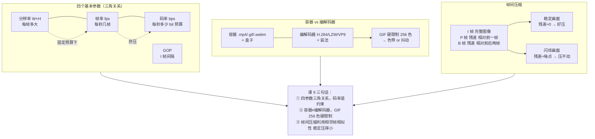

# 第 9 课：视频参数与压缩原理

> 所属阶段：阶段 4《视频编码与导出》｜ 水平：零基础
> 本课知识点：四个基本参数、容器与编解码器、帧间压缩与画面一致性
> 故事情节：一千张 PNG 堆在硬盘里，几百 MB 却只有几秒——工程师必须搞清"文件变大"到底由什么决定

## 🎯 本课目标

- 给定时长与帧率算出总帧数，解释 GOP 大小对体积与拖拽的影响
- 区分容器与编解码器，说明 MP4+H.264 与 GIF 各自的适用边界与限制
- 用 I/P/B 帧解释为什么闪烁画面压不动，联系需求文档的帧一致性主张

---

## 第一幕：起源与场景引入

> 🏛️ **起源**：1984 年 **CCITT 推荐 H.120**，首个实用数字视频编码标准。1988 年 **Motion JPEG** 进入消费市场。**1993 年 ISO/IEC MPEG-1** 标准化了**帧间预测**——这正是"为什么 P/B 帧能让文件变小"的工程起点。**H.264/AVC 在 2003 年定稿**，至今仍是互联网视频的主流。（核查于 2026-09）

**场景**：课 7、课 8 把"单帧怎么从公式变成画面"完整解决了——**单帧 = 一张 1920×1080 的 RGBA 像素**。但**单帧只占视频的 1/24**。

- 一段 10 秒的 24fps 视频 = **240 帧**
- 每帧 RGBA = 1920×1080×4 = **8.29 MB**
- 总共 = **1.85 GB**（**未压缩**）

而实际你下载的电影，10 秒 1080p 大约 6 MB。**压缩比 300×**——这背后就是本课要讲的所有事：

1. **四个基本参数**：分辨率、帧率、码率、GOP——决定文件大小和画质
2. **容器与编解码器**：`.mp4` 是盒子，H.264 是装东西的方法——最常见的概念混淆
3. **帧间压缩**：I/P/B 帧、帧内/帧间预测——为什么闪烁画面**压不动**

> 🎬 **场景**：本课讲"怎么让 1.85 GB 变成 6 MB"——是阶段 3 渲染结果的**下一站**。`课 7` 算出"画面"，`课 9` 算出"文件"，`课 10` 跑通命令行导出。

---

## 第二幕：认知冲突

直觉上："视频文件大 = 视频长 × 视频大"——再压缩一下就好了。

**冲突 1：算一下原始数据量，就知道"压缩一下"根本不简单**

- 1080p × 24fps × 10s = 1.85 GB
- 一张 64 GB 内存卡，**只够装 350 秒原始视频**
- 你**必须**压缩，而且必须压得很狠

**冲突 2：把"mp4"和"H.264"混为一谈，导致"文件打不开"排查走偏**

- ".mp4 打不开" 可能是**容器损坏**（moov 头错位）
- 也可能是**H.264 编码格式问题**（profile 不兼容）
- 还可能是**播放器不支持**（缺 codec）
- 三个原因需要三种排查路径

**冲突 3：AI 生成的视频"画面闪烁"——不只是难看**

- 闪烁画面 → 帧间差很大 → P/B 帧残差大 → **压缩率崩掉**
- 同一段时长，闪烁版文件可能大 3-5 倍
- 需求文档"帧间一致性"主张的工程意义就在这里

> ❓ **问题**：**文件体积由什么决定？MP4 和 H.264 是什么关系？为什么"稳定画面"压得小、"闪烁画面"压不动？**

---

## 第三幕：层层揭示

### 知识点 1：四个基本参数

> 关键点：分辨率 / 帧率 / **码率与画质三角** / GOP 与关键帧间隔

#### 一句话定义

**四个基本参数** = 视频文件体积的四个控制旋钮：**分辨率**（每帧多大）、**帧率**（每秒几帧）、**码率**（每秒多少 bit 的预算）、**GOP**（关键帧间隔）。**前三者构成三角关系**——**给定码率预算，提高一项必然挤压另两项**。

#### 直觉建立（厨房预算）

把视频文件想成**厨房预算**：

- **总预算** = 码率（每秒多少 bit）
- **份数** = 帧率（每秒几帧 = 几份菜）
- **每份大小** = 分辨率（每帧多大）
- **菜的质量** = 画质

预算固定时，**份数多 → 每份就小**（糊）；**每份大 → 份数就少**（卡）；**质量高 → 份数就少或每份就小**。

> 💡 厨房里"加量不加价"是不可能的。**码率是根本约束**，分辨率/帧率/画质在它之下互相挤压。

#### 核心原理

**总帧数公式**（**第一行**）：

```
总帧数 = 帧率 (fps) × 时长 (s)
```

**原始数据量公式**（**第二行**）：

```
原始字节 = 分辨率 (W × H) × 每帧字节 (4 for RGBA) × 总帧数
```

**手算**（一定要自己算一遍）：

- 1920×1080 × 4 (RGBA) = **8,294,400 字节/帧**
- 24 fps × 10 s = **240 帧**
- 原始 = 8,294,400 × 240 = **1,990,656,000 字节 ≈ 1.85 GB**

**码率公式**（**第三行**）：

```
文件大小 = 码率 (bps) × 时长 (s) / 8
```

- 目标 5 Mbps × 10 s / 8 = **6.25 MB**
- **压缩比 = 1.85 GB / 6.0 MB ≈ 319×**

→ **视频编码的绝大部分工作**，就是在**不明显损失观感的前提下做到 300× 左右的压缩**。

**三角关系**（**这是这批最核心的图**）：

| 提高 | 代价 | 码率不够时 |
|------|------|-----------|
| **↑ 分辨率** | 画面更清晰，但每帧数据更多 | 变糊（macro-blocking 严重）|
| **↑ 帧率** | 动作更顺滑，但帧数更多 | 变卡/掉帧 |
| **↑ 码率** | 画质更好，但文件更大 | —（码率本身是预算）|

> ⚠ "视频很糊"往往**不是分辨率问题**，**是码率不够**。同一部电影 4K 480p 看着都比 1080p 360p 清楚——因为**码率对画质的决定权 > 分辨率**。

**GOP（Group of Pictures）**：

**GOP = 两个 I 帧之间的间隔**。

- **I 帧**（Intra-coded frame）= 完整图像，**可独立解码**
- **P 帧**（Predicted frame）= 只存与前一帧的差异（运动补偿残差）
- **B 帧**（Bi-predicted frame）= 存与前后两帧的差异（双向预测，压缩率最高但最慢）

示意：

```
I  P  P  P  B  B  P  P  P  B  B  I | P  P  P  B  B  P  P  P  B  B  I | ...
|<- 一个 GOP = 12 帧 ->|
```

**GOP 权衡**：

| GOP 大小 | 体积 | 压缩率 | 拖拽定位 | 容错 |
|---------|------|--------|----------|------|
| **大** | 小 | 高 | **慢**（要往前找最近的 I 帧）| 差（丢一帧影响大）|
| **小** | 大 | 低 | **快**（I 帧密）| 好（丢一帧影响小）|

#### 示例演示

跑 `video_params_demo.py` 看 `params_calculator.png`：

- ① 原始数据量：1.85 GB
- ② 码率与压缩比：5 Mbps → 6.0 MB = **319× 压缩**
- ③ 三角关系
- ④ GOP 示意（I/P/B 帧序列）+ 权衡

再看 `quality_vs_size/`（24 帧，JPEG quality 5→95）：

- 同一张图，**质量 5 = 1,555 B，质量 95 = 7,654 B**（**4.9× 差距**）
- 低质量时出现 **block 状伪影**，渐变区出现 **banding**
- 体积增长**远快于观感提升**——这正是码率-画质曲线的形状

控制台验证：

```
1920×1080 @ 24fps × 10s = 240 帧
原始 RGBA = 1,990,656,000 B ≈ 1.85 GB
目标 5 Mbps → 文件 ≈ 6.0 MB
压缩比 ≈ 319 ×
```

#### 常见误区

1. **"分辨率越高越好"**——**不一定**；**码率不够时 1080p 比 480p 还糊**
2. **"帧率越高越顺滑"**——**不一定**；**人眼 30 fps 就够**；电影 24 fps 是艺术选择不是技术限制
3. **"码率越高画质越好"**——**前面部分对**；**过了某个点再加码率观感几乎不变**，但体积线性增长
4. **"GOP = 帧组"**——**对**，但 GOP 的核心是**I 帧间隔**，不是 B 帧
5. **"码率固定画质就固定"**——**不一定**；**画面越复杂**（草地、噪点）需要**更多 bit** 才能保持同画质

#### 一句话记住

> **分辨率 × 帧率 × 码率 = 三角关系**（给定预算，挤压其他）；**GOP** = I 帧间隔（影响体积、定位、容错）。

#### 延伸阅读

- [Video coding · Wikipedia](https://en.wikipedia.org/wiki/Video_coding)
- [Display resolution · Wikipedia](https://en.wikipedia.org/wiki/Display_resolution)
- [Frame rate · Wikipedia](https://en.wikipedia.org/wiki/Frame_rate)
- [Bitrate · Wikipedia](https://en.wikipedia.org/wiki/Bitrate)
- 课 10《动手导出与工具链》——ffmpeg / ffprobe 实操

---

### 知识点 2：容器与编解码器

> 关键点：**容器 ≠ 编解码器** / MP4 + H.264 / **GIF 的 256 色与调色板** / **带 alpha 的视频为何麻烦**

#### 一句话定义

**容器（container）** = **盒子**——把视频流、音频流、字幕流打包成一个文件的格式（`.mp4`、`.mov`、`.webm`、`.gif`）。**编解码器（codec）** = **装东西的方法**——把原始像素压缩成 bit 流（`H.264`/`H.265`/`VP9`/`LZW`）。**同一盒子可装不同方法**——`.mp4` 可以装 H.264、H.265、AV1。

#### 直觉建立（快递盒与压缩方法）

把容器想成**快递盒**：

- **盒子** = `.mp4` 文件（容器，存所有流：视频、音频、字幕、章节）
- **压缩方法** = H.264（决定视频流怎么编码）
- **里面装什么** = 视频流 + 音频流 + 字幕

> 一个盒子可以装**不同压缩方法**的货物（MP4 可以装 H.264、HEVC、AV1）——这就是为什么"打不开"可能是**盒子坏**（moov 头错位），也可能是**压缩方法不识别**（profile 不兼容）。

#### 核心原理

**常见容器与编解码器组合**：

| 容器 | 常见编解码器 | 适用场景 |
|------|------------|----------|
| **.mp4** | H.264 / H.265 / AV1 | 通用首选，浏览器/移动端/OTT 全支持 |
| **.mov** | ProRes / H.264 | Apple 生态、剪辑工程 |
| **.webm** | VP8 / VP9 / AV1 | 开源、Web 友好、**支持 alpha** |
| **.mkv** | 任意 | 灵活、字幕/多音轨 |
| **.gif** | LZW | 简单动画、**256 色硬限制** |

**为什么"MP4 打不开"有三种原因**：

```
"mp4 打不开" 排查路径：
① 容器问题：moov 头错位、文件截断 → 用 ffmpeg -c copy 重新封装
② 编解码器问题：H.265 main10 播放器只支持 main → 重新编码为兼容 profile
③ 播放器问题：缺 codec 解码器 → 安装对应解码器
```

> **需求文档的对应**：需求文档要"导出 MP4+H.264"——这里**两个东西**（容器 + 编解码器）。如果只说"导出 MP4"而**不指定 codec**，则 MP4 里装什么**完全不确定**。

**GIF 的 256 色硬限制**：

GIF 用 **LZW + 调色板**（palette）：

- 调色板最多 **256 种颜色**
- 每帧/全局的每个像素 → 调色板里的一个索引
- 平滑渐变（1600 万色）→ **必须用 256 种颜色近似** → 出现**色带**（banding）

**色带 vs 抖动**：

| 方法 | 表现 | 代价 |
|------|------|------|
| **无抖动** | 渐变被切成**一圈圈整齐的色带** | 画面干净但色带明显 |
| **Floyd-Steinberg 抖动** | 用**噪点打散色带** | 视觉更连续但引入**颗粒感** |

> ⚠ **没有完美的解决方案**——**256 色就是不够表达所有渐变**。GIF 用**调色板近似 + 抖动妥协**。

**带 alpha 的视频为何麻烦**：

- **H.264 / H.265** 主流配置**不支持 alpha 通道**（只支持 YUV 420 三通道）
- **HEVC + alpha**（H.265 RExt）支持但**播放器兼容性差**
- **WebM / VP9** 完整支持 alpha，但**浏览器/移动端覆盖不如 H.264**
- **序列帧 + PNG** 是最稳的方案，但**不是真正的视频文件**

> 💡 需求文档如果需要"带透明的动画视频"，WebM/VP9 是当前最现实的选择；**真正的"MP4 + alpha"几乎不存在**。

#### 示例演示

跑 `video_params_demo.py` 看 `gif_palette.png`：

- ① 原始（约 1600 万色）：平滑渐变
- ② GIF 量化，无抖动：**整齐的同心色带**（banding 明显）
- ③ GIF 量化，Floyd-Steinberg 抖动：**噪点打散色带**（更连续但有颗粒）

#### 常见误区

1. **"mp4 = H.264"**——**错**；mp4 是**容器**（盒子），H.264 是**编解码器**（方法），**两者独立**
2. **"gif 是视频"**——**部分对**；技术上 GIF 是**动图**，**编码方式**（LZW）和**功能**（256 色、无音频）与真正的视频不同
3. **"GIF 256 色够用"**——**对简单图形够用**；**渐变/照片直接糊**
4. **"MP4 支持 alpha"**——**错**；**主流 H.264/HEVC MP4 不支持 alpha**；需要 WebM/VP9 或 PNG 序列
5. **"容器相同 = 兼容性相同"**——**不一定**；同一 .mp4 容器，H.265 比 H.264 兼容性差

#### 一句话记住

> **容器 = 盒子（.mp4/.gif/.webm）**；**编解码器 = 装法（H.264/LZW/VP9）**；**GIF 硬限制 256 色** → 渐变必须靠**色带或抖动妥协**。

#### 延伸阅读

- [Container format · Wikipedia](https://en.wikipedia.org/wiki/Container_format)
- [Video codec · Wikipedia](https://en.wikipedia.org/wiki/Video_codec)
- [GIF · Wikipedia](https://en.wikipedia.org/wiki/GIF)（历史 + LZW + 调色板）
- [WebM · Wikipedia](https://en.wikipedia.org/wiki/WebM)
- 课 10《动手导出与工具链》——ffmpeg 命令行转容器/转码

---

### 知识点 3：帧间压缩与画面一致性

> 关键点：**I/P/B 帧** / **帧内预测与帧间预测** / **为什么闪烁画面压不动** / 与"帧间一致性"的关系

#### 一句话定义

**I 帧** = **完整图像**，**可独立解码**（帧内压缩，类似 JPEG）。**P 帧** = 只存与**前一帧的差异**（帧间预测 + 运动补偿残差）。**B 帧** = 存与**前后两帧的差异**（双向预测，压缩率最高）。**帧间压缩 = 利用相邻帧的相似性**——**稳定画面压得小，闪烁画面压不动**。

#### 直觉建立（版本管理 + 逐帧残差）

把 I/P/B 帧想成**版本管理**：

- **I 帧** = **完整提交**（自包含，可随时 checkout）
- **P 帧** = **差分提交**（"只改了第 23-47 行"）
- **B 帧** = **双向差分**（"基于 v10 和 v12 做的中间版本"）

**好处**：改的越少，diff 越小，文件越小。

**限制**：要 checkout 到中间版本，必须先把前面所有版本 apply 完。

> 💡 **稳定画面 = 改动小 = diff 小 = 文件小**；**闪烁画面 = 每帧都改 = diff 大 = 压不动**。

#### 核心原理

**三种帧的核心差异**：

| 帧类型 | 编码内容 | 大小 | 独立解码？ |
|--------|---------|------|-----------|
| **I 帧** | 完整图像（帧内压缩 = 类似 JPEG）| 大 | **是** |
| **P 帧** | 运动矢量 + 与前一帧的残差 | 中 | 否 |
| **B 帧** | 运动矢量 + 与前后两帧的残差 | 小 | 否 |

**为什么闪烁压不动**：

**关键 insight**：P/B 帧只存**残差**（与参考帧的差异）。**稳定画面**残差 ≈ 0 → 残差极易压缩（连续相同的像素只需要几个 bit）→ **整体文件小**。**闪烁画面**残差 ≈ 随机噪点 → 残差**压不动**（噪点的高频信息量最高）→ **文件大 3-5 倍**。

**手算**（**这批的关键 demo**）：

| 画面类型 | 帧差 \|Δ\| (0-255) | 残差可压缩性 | 文件大小 |
|---------|-------------------|-------------|---------|
| **稳定**（物体平滑移动）| 2.4 | 极易（≈全 0）| 小 |
| **闪烁**（每帧像素跳变）| 43.2 | 极难（≈随机噪点）| **大 18×** |

> 💡 **需求文档的对应**：需求文档的"帧间一致性"主张——**不只是为了好看**，**更是为了压缩率**。AI 生成 24 fps 视频若每帧像素都跳变，**文件会爆炸**；若同一角色跨帧的同一像素**值稳定**，文件能压 18 倍以上。

**为什么帧间预测能压那么多**：

现实视频的统计特性：
- **时间冗余**：相邻帧**大部分像素相同**（背景不变，角色只是平移）
- **空间冗余**：同一帧内**相邻像素相关**（天空就是连续的蓝色）

**帧内预测**（I 帧内）：同一帧内，从已编码块**预测当前块**——比如"右边的色块通常和左边相似"。
**帧间预测**（P/B 帧）：从已编码帧**预测当前块**——比如"这一帧的圆就是上一帧的圆向右平移了 5 像素"。

**残差 = 实际 - 预测**。**残差越小 → 残差越接近全 0 → 残差越容易压**。

#### 示例演示

跑 `video_params_demo.py` 看 `temporal_difference/`（24 帧）：

- **左**：稳定画面（红色圆平滑向右移动，背景不变）
- **右**：同场景 + 每帧随机噪点（模拟 AI 画面抖动）
- **底部条**对比帧差：稳定 = 2.4（绿），闪烁 = 43.2（红）
- **结论**：**闪烁的帧差是稳定的 18 倍** → 残差压不动 → 文件爆炸

控制台：

```
稳定画面平均帧差 |Δ| = 2.37
闪烁画面平均帧差 |Δ| = 43.21
闪烁的帧差是稳定的 18.2 倍

-> P/B 帧只存残差：稳定 → 残差≈0 → 好压缩；闪烁 → 残差≈噪点 → 压不动
-> 需求文档的「帧间一致性」不只是好看，更是压缩率的前提
```

#### 常见误区

1. **"I 帧越大越好"**——**不一定**；I 帧是 P/B 帧的参考，**太大拉低整体压缩率**；I 帧密集 = 拖拽快但体积大
2. **"B 帧一定比 P 帧好"**——**B 帧压缩率最高但计算量最大**；低性能设备上常**禁用 B 帧**
3. **"AI 抖动是细节"**——**错**；**是压缩率杀手**；一帧随机噪点 ≈ 一帧 I 帧大小
4. **"码率固定 = 文件大小固定"**——**不一定**；VBR（动态码率）下，**画面复杂帧分配更多 bit**
5. **"帧间预测是无损的"**——**错**；运动补偿是**有损近似**（通常误差 < 1 像素）

#### 一句话记住

> **I 帧 = 完整图像**；**P/B 帧 = 只存与参考帧的残差**。**稳定画面残差≈0 → 好压**；**闪烁画面残差≈噪点 → 压不动**。

#### 延伸阅读

- [Inter frame · Wikipedia](https://en.wikipedia.org/wiki/Inter_frame)
- [I/P/B frame · FFmpeg Wiki](https://trac.ffmpeg.org/wiki/Encode/H.264)
- [Temporal redundancy · Wikipedia](https://en.wikipedia.org/wiki/Temporal_redundancy)
- 课 10《动手导出与工具链》——ffmpeg 设置 GOP、B 帧、码率

---

## 第四幕：实操验证

### 运行方式

```powershell
cd d:\projects\learning\animation-engine\00-动画与视频基础
.\playground\.venv\Scripts\python.exe .\playground\lesson-09\video_params_demo.py
```

预期输出：

```text
=== 知识点 1：四个基本参数 ===
参数计算 -> params_calculator.png
  -> 1920×1080 @ 24fps × 10s = 240 帧
  -> 原始 RGBA = 1,990,656,000 B ≈ 1.85 GB
  -> 目标 5 Mbps → 文件 ≈ 6.0 MB
  -> 压缩比 ≈ 319 ×

画质/体积权衡 -> quality_vs_size/ （24 帧，JPEG q=5→95）
  -> 体积从 1,555 B（q=5）到 7,654 B（q=95），差 4.9 倍

=== 知识点 2：容器与编解码器 ===
GIF 256 色 -> gif_palette.png
  -> 容器（.mp4/.gif）≠ 编解码器（H.264/LZW）
  -> GIF 硬限制：最多 256 色 → 渐变必须靠色带或抖动妥协

=== 知识点 3：帧间压缩与画面一致性 ===
帧差对比 -> temporal_difference/ （24 帧）
  -> 稳定画面平均帧差 |Δ| = 2.37
  -> 闪烁画面平均帧差 |Δ| = 43.21
  -> 闪烁的帧差是稳定的 18.2 倍
```

### 怎么翻看

| 文件 | 翻看要点 | 对应知识点 |
|------|----------|------------|
| `params_calculator.png` | 四节呈现：原始量 / 码率 / 三角 / GOP | 知识点 1 四参数 |
| `quality_vs_size/frame_000.png` | JPEG q=5 → 1.5 KB，**明显 block 伪影** | 知识点 1 码率-画质权衡 |
| `quality_vs_size/frame_012.png` | JPEG q=52 → 2.8 KB，伪影缓解 | 知识点 1 码率-画质权衡 |
| `quality_vs_size/frame_023.png` | JPEG q=95 → 7.5 KB，**几乎无伪影** | 知识点 1 码率-画质权衡 |
| `gif_palette.png` | ① 原始 ② 无抖动色带 ③ 有抖动噪点 | 知识点 2 GIF 256 色 |
| `temporal_difference/frame_012.png` | 左稳定 2.4 / 右闪烁 43.2 = **18× 帧差** | 知识点 3 帧间压缩 |

**翻看方式**：
- `quality_vs_size/` 和 `temporal_difference/` 24 帧用 → 方向键翻——**看质量档位提升 / 看闪烁效果**
- 3 张对比图直接打开看差异

### 动手改一改（建议都试一遍）

| 改什么 | 预期看到 | 对应知识点 |
|--------|---------|-----------|
| `params_calculator.png` 里 `W, H = 1920, 1080` 改成 `1280, 720` | 原始数据**减半**（~930 MB），压缩比**不变** | 知识点 1 数据量公式 |
| `params_calculator.png` 里 `bitrate_mbps = 5.0` 改成 `2.0` | 文件大小**变为 2.4 MB**，压缩比变 **800×** | 知识点 1 码率的影响 |
| `params_calculator.png` 里 `gop = 12` 改成 `gop = 2` | I 帧**变密**——10 帧多 5 个 I 帧 | 知识点 1 GOP 含义 |
| `quality_vs_size/` 里 `q = 5` 改成 `q = 1` | 块状伪影**极端严重**，体积**进一步缩小** | 知识点 1 极端压缩 |
| `gif_palette.png` 里 `colors=256` 改成 `colors=16` | **更严重的色带**——16 色比 256 色更粗 | 知识点 2 调色板限制 |
| `temporal_difference/` 里 `noise = rng.integers(0, 256, ...)` 改成 `rng.integers(0, 32, ...)` | 闪烁**更弱**（噪点幅度小），帧差**更小** | 知识点 3 残差与帧差的关系 |
| `temporal_difference/` 里移动圆的 `cx` 速度调快（`(W-60) * f / (TOTAL-1)` 改成 `*2`）| 稳定画面**帧差变大**（移动越快残差越大）| 知识点 3 运动补偿的代价 |

> ✅ **回扣场景**：现在 3 个核心问题都解决了。
> - **"文件体积由什么决定？"** ——**分辨率 × 帧率 × 码率 × GOP** 四旋钮；前三者构成**三角关系**
> - **"MP4 和 H.264 是什么关系？"** ——**盒子 vs 装法**；`mp4` 是容器，H.264 是编解码器，两者独立
> - **"为什么闪烁压不动？"** ——**P/B 帧只存残差**；稳定 → 残差≈0 → 好压；闪烁 → 残差≈噪点 → 压不动

---

## 第五幕：体系收束


> 📍 **全局定位**：本课回答了**三个核心问题**：
>
> | 知识点 | 回答的问题 | 本质 |
> |--------|-----------|------|
> | **四个基本参数** | **文件多大由谁决定** | 三角关系（码率是约束）；GOP = I 帧间隔 |
> | **容器与编解码器** | **mp4 和 H.264 是什么关系** | 盒子 vs 装法；GIF 256 色硬限制 |
> | **帧间压缩** | **为什么稳定画面压得小** | I 帧 = 完整；P/B 帧 = 残差；闪烁 → 残差≈噪点 → 压不动 |
>
> **关键 insight**：**码率是约束、容器是盒子、帧间压缩是核心**——这三点合起来解释了**"1.85 GB 怎么变 6 MB"**的全部秘密。
>
> 🔗 **下一步**：本课解释了原理。但**怎么用命令行真的导出**？ffmpeg / ffprobe 怎么用？序列帧命名规范是什么？GIF 抖动怎么设？这就是**课 10《动手导出与工具链》**。

---

## 🐞 常见误区（课级汇总）

1. **"分辨率越高越好"**——**不一定**；**码率不够时 1080p 比 480p 还糊**
2. **"帧率越高越顺滑"**——**不一定**；**人眼 30 fps 够用**
3. **"码率越高画质越好"**——**前面部分对**；**过了拐点体积线性增长但观感几乎不变**
4. **"mp4 = H.264"**——**错**；mp4 是容器，H.264 是 codec，两者独立
5. **"GIF 256 色够用"**——**对简单图形够用**；**渐变/照片直接糊**
6. **"MP4 支持 alpha"**——**错**；主流 H.264/HEVC MP4 不支持；需要 WebM/VP9
7. **"AI 抖动是细节"**——**错**；**是压缩率杀手**；残差 ≈ 噪点 → 压不动
8. **"GOP 越大越好"**——**不一定**；GOP 大 = 体积小但拖拽慢、容错差
9. **"B 帧一定比 P 帧好"**——**B 帧压缩率最高但计算量最大**；低性能设备常禁用
10. **"码率固定 = 文件大小固定"**——**不一定**；VBR 下画面复杂帧分配更多 bit

## 一图总结



## 课后小测

**Q1**：1920×1080 @ 24fps × 10s 的原始 RGBA 数据量约是？

- A. 6 MB
- B. 200 MB
- C. 1.85 GB
- D. 18.5 GB

<details><summary>答案与解析</summary>

**答案：C**。手算：
- 8,294,400 B/帧 × 240 帧 = 1,990,656,000 B ≈ **1.85 GB**
**A 错**（6 MB 是 5 Mbps 码率压缩后的大小，**不是原始**）；**B 错**（200 MB 是 480p 4fps×100s 的量级，**不是 1080p 24fps**）；**D 错**（18.5 GB 是 4K 的量级）。
> 💡 原始数据"大"才能让你理解"为什么必须压缩"——这是视频编码存在的根本原因。
</details>

**Q2**：固定 5 Mbps 码率预算，把分辨率从 1080p 提到 4K，最直接的后果是？

- A. 画质显著提升
- B. 动作更顺滑
- C. 每帧分配到的 bit 变少，**画质可能反而下降**（糊）
- D. 文件变小

<details><summary>答案与解析</summary>

**答案：C**。4K = 1080p 的 4 倍像素，每帧 bit 数被压到 1/4 → 同样码率下画质**反而变差**（macro-blocking 严重）。**A 错**（前提是码率同步增加；固定码率则画质不会提升）；**B 错**（分辨率与帧率独立，提升分辨率不影响帧率）；**D 错**（码率固定 → 文件大小固定，与分辨率无关）。
> 💡 码率是约束——**分辨率/帧率/画质在它之下互相挤压**。
</details>

**Q3**：".mp4" 和 "H.264" 的关系是？

- A. mp4 = H.264
- B. mp4 是**容器（盒子）**，H.264 是**编解码器（装法）**，两者独立
- C. H.264 是 mp4 的旧版本
- D. mp4 是开源的，H.264 不是

<details><summary>答案与解析</summary>

**答案：B**。**容器 ≠ 编解码器**——`.mp4` 是盒子，H.264 是装东西的方法。**同一盒子可装不同方法**（mp4 可以装 H.264、H.265、AV1）。**A 错**（这是最常见的概念混淆）；**C 错**（两者不在同一维度）；**D 错**（H.264 有专利但有广泛免费授权，mp4 是 ISO 标准容器）。
> 💡 "MP4 打不开"有三种原因：① 容器损坏 ② codec 不兼容 ③ 播放器缺解码器——三种排查路径。
</details>

**Q4**：GIF 最多有多少种颜色？

- A. 16
- B. 256
- C. 65536
- D. 1600 万

<details><summary>答案与解析</summary>

**答案：B**。GIF 用 LZW + 调色板，**调色板硬限制 256 色**。**A 错**（16 是 4-bit，GIF 不支持）；**C 错**（65536 是 16-bit，PNG 支持但 GIF 不支持）；**D 错**（1600 万是 24-bit RGB）。
> 💡 这是为什么 GIF 的渐变必然出现色带或抖动——**256 色就是不够**。
</details>

**Q5**：带 alpha 通道的视频，目前最现实的选择是？

- A. H.264 MP4
- B. H.265 MP4
- C. WebM / VP9
- D. GIF

<details><summary>答案与解析</summary>

**答案：C**。**WebM / VP9 完整支持 alpha 通道**。**A 错**（H.264 不支持 alpha）；**B 错**（主流 H.265 MP4 也不支持 alpha，要 HEVC+alpha 但兼容性差）；**D 错**（GIF 只支持 1-bit 透明，不是真正的 alpha）。
> 💡 需求文档若要"带透明的动画视频"，WebM/VP9 是当前最现实的选择。
</details>

**Q6**：稳定画面和闪烁画面的帧差，残差可压缩性差多少倍？

- A. 稳定 / 闪烁 ≈ 18×（闪烁压不动）
- B. 稳定 / 闪烁 ≈ 2×
- C. 稳定 / 闪烁 ≈ 1×（没差别）
- D. 稳定 / 闪烁 ≈ 100×

<details><summary>答案与解析</summary>

**答案：A**。脚本实测：稳定 2.37 vs 闪烁 43.21，**18.2 倍**。**B 错**（低估了——帧间压缩对残差幅度极其敏感）；**C 错**（差别巨大）；**D 错**（残差本身还有结构信息，100× 不一定）。
> 💡 **AI 生成视频若每帧像素都跳变，文件会爆炸**——这就是需求文档"帧间一致性"主张的工程意义。
</details>

## 🚀 下一课接力提示词

> 学完本课后，**复制下面这段文字发给 AI**，即可无缝进入下一课：

```
继续学 2D 动画与视频基础。我的学习档案在 animation-engine/00-动画与视频基础/00-学习档案.md，
刚学完阶段 4《视频编码与导出》的课《视频参数与压缩原理》
（四个基本参数、容器与编解码器、帧间压缩与画面一致性），
请按大纲继续讲解下一课：课 10《动手导出与工具链》
（命令行导出工具链、GIF、透明与常见坑、输出验收）。
```

## 🧭 课程导航

⬅️ **上一课**：[课 8：图层、alpha 与深度排序](../3-渲染与合成基础/lessons/lesson-08-图层alpha与深度排序.md)
➡️ **下一课**：[课 10：动手导出与工具链](lesson-10-动手导出与工具链.md)
📚 **返回目录**：[课程目录](../../02-课程目录.md)
