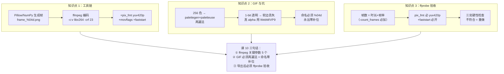

# 第 10 课：动手导出与工具链

> 所属阶段：阶段 4《视频编码与导出》｜ 水平：零基础
> 本课知识点：命令行导出工具链、GIF 透明与常见坑、输出验收
> 故事情节：最后一步——把内存里的帧序列真正变成一个能双击播放的文件，并确认它"和你想的一样"

## 🎯 本课目标

- 用 FFmpeg 把帧序列合成 MP4，用 Pillow / NumPy 生成帧序列
- 处理 GIF 调色板与抖动，说明透明 GIF 的局限与序列帧命名规范
- 用 ffprobe 校验帧率、帧数、分辨率，核对需求文档的导出要求

---

## 第一幕：起源与场景引入

> 🏛️ **起源**：2000 年 **Fabrice Bellard** 开源 FFmpeg 项目，把广播级的编解码能力带给所有人。**ffprobe** 同期诞生，是 FFmpeg 项目的姊妹工具——专门用来读流信息。两者是**检验导出结果的标配组合**。

**场景**：课 9 讲的是**原理**——文件多大由谁决定、容器与编解码器怎么分、帧间压缩为什么能压那么多。但**原理不能当饭吃**——

- **怎么真的把帧序列变成 MP4？**（ffmpeg 命令行）
- **怎么把序列帧合成 GIF？**（两遍调色板法）
- **怎么确认导出的文件"和你想的一样"？**（ffprobe 验收）

> 🎬 **场景**：本课讲"最后一公里"——**Pillow/NumPy 生成帧序列 → ffmpeg 编码 → ffprobe 验收**。脚本里每条 ffmpeg 命令都是可以**直接复制**到命令行跑的。课 10 完成后，**从 AI 输出的矢量 → 双击播放的视频**就全链通了。

---

## 第二幕：认知冲突

**冲突 1：序列帧命名不补零，视频会"跳帧"**

- ffmpeg 按字典序读图：`frame_1.png, frame_10.png, frame_11.png, frame_2.png, ...`
- 视频顺序错乱——**看起来像"画面闪烁"**
- 这就是上一批结尾提到的"AI 抖动"的真凶之一

**冲突 2：GIF 透明只有 1-bit，软边全丢**

- 抗锯齿让边缘产生半透明像素
- GIF 透明通道**只能"全透 / 不透"二选一**
- 软边 → 锯齿 / 白边

**冲突 3：跑完 ffmpeg ≠ 导出成功**

- 文件**可能缺帧**（编码失败但有输出文件）
- **可能 pix_fmt 不对**（QuickTime 打不开）
- **可能 moov 头在文件尾部**（网页播不了）
- 必须用 ffprobe 验收

> ❓ **问题**：**ffmpeg 命令到底长什么样？序列帧命名有什么坑？透明 GIF 怎么办？导出后怎么验证？**

---

## 第三幕：层层揭示

### 知识点 1：命令行导出工具链

> 关键点：FFmpeg 帧序列转视频 / **Python 侧 Pillow·NumPy 生成帧** / 关键参数与常见坑 / 版本与安装校验

#### 一句话定义

**命令行导出工具链** = **Pillow / NumPy 生成帧序列**（内存里的 RGBA 数组 → 落盘为 PNG）+ **ffmpeg 编码**（PNG 序列 → MP4/GIF）+ **ffprobe 验收**（核对结果）。**环境要求**：本脚本用 `static-ffmpeg` 在 venv 内自带 ffmpeg + ffprobe（**不污染系统**），或装到系统 PATH（`winget install Gyan.FFmpeg` / macOS `brew install ffmpeg`）。

#### 直觉建立（工厂流水线）

把导出想成**工厂流水线**：

- **原料** = Pillow/NumPy 生成的 PNG 帧序列（一张张图）
- **传送带** = 帧序列文件名（`frame_%04d.png`）
- **加工机器** = ffmpeg（H.264 编码、调色板、压缩）
- **成品** = `output.mp4` / `output.gif`
- **质检员** = ffprobe（核对称重、尺寸、时长）

> 💡 每一环都有自己的规范——命名错工人找不到原料，参数错机器产次品，没质检员你不知道出货合不合格。

#### 核心原理

**Python 侧生成帧**（Pillow）：

```python
img = Image.new("RGB", (320, 240), (245, 248, 252))
d = ImageDraw.Draw(img)
# ... 画东西 ...
img.save(frames_dir / f"frame_{i:04d}.png")   # ⚠ %04d 零补位
```

**ffmpeg 帧序列 → MP4**（**核心命令**）：

```bash
ffmpeg -y \
  -framerate 24 \                                       # 输入帧率
  -i frames/frame_%04d.png \                            # 输入：零补位帧序列
  -c:v libx264 \                                        # H.264 编码
  -pix_fmt yuv420p \                                    # 兼容性最好的像素格式
  -crf 23 \                                             # 恒定质量（18-28 常用）
  -movflags +faststart \                                # moov 头前移，边下边播
  output.mp4
```

**关键参数逐项解释**：

| 参数 | 含义 | 常见值 / 坑 |
|------|------|------------|
| `-framerate N` | **输入帧率**（先于 `-i`，告诉 ffmpeg "按 N fps 读图"）| 必须与生成帧的频率一致 |
| `-i pattern` | 输入模式；`%04d` = 4 位零补位 | **不补零 = 跳帧** |
| `-c:v libx264` | 视频编码器 = H.264 | `-c:v h264` 也行但 libx264 兼容性最好 |
| `-pix_fmt yuv420p` | 像素格式 = YUV 4:2:0 | **不加这一行 QuickTime 打不开** |
| `-crf N` | 恒定质量（0=无损，51=最差）| **18-28 常用**（23 = 默认）|
| `-movflags +faststart` | moov 头前移到文件头 | **不加这一行网页播不了**（要下完才播）|
| `-b:v N` | 目标码率（替代 `-crf`）| `2M` / `5M` / `10M` |

**ffmpeg 帧序列 → GIF**（**两遍调色板法**）：

```bash
ffmpeg -y \
  -framerate 12 \                                       # GIF 帧率（通常比视频低）
  -i frames/frame_%04d.png \
  -filter_complex "[0:v] split [a][b];[a] palettegen=max_colors=256 [p];[b][p] paletteuse=dither=bayer" \
  -loop 0 \                                             # 无限循环（0 = 永远）
  output.gif
```

**为什么两遍？** GIF 只能有 256 色——**直接转会用默认调色板，色带严重**。**两遍法**：
1. **palettegen** 扫一遍所有帧，算出**全局最优 256 色调色板**
2. **paletteuse** 用这盘调色板**配以 dither** 重新量化

→ 质量**远好于**直接转。

**环境获取**（`static-ffmpeg`，**不污染系统**）：

```bash
# 课程 venv 内（推荐）
uv pip install static-ffmpeg

# 系统级（可选）
winget install Gyan.FFmpeg    # Windows
brew install ffmpeg            # macOS
apt install ffmpeg             # Linux
```

> 💡 **static-ffmpeg** 把 ffmpeg 静态二进制装进 venv——**不带系统 PATH**，**不污染全局**。第一次运行会下载约 50MB 的二进制。

#### 示例演示

跑 `export_toolchain_demo.py`：

控制台会真实跑出：

```
[MP4] 帧序列 → H.264 MP4
  $ ffmpeg -y -framerate 24 -i frames/frame_%04d.png -c:v libx264 -pix_fmt yuv420p -crf 23 -movflags +faststart output.mp4
  -> output.mp4  7,873 B

[GIF] 帧序列 → GIF（两遍法）
  $ ffmpeg -y -framerate 12 -i frames/frame_%04d.png -filter_complex "..." -loop 0 output.gif
  -> output.gif  30,459 B
```

打开 `output.mp4` / `output.gif` 实际就能播放。

#### 常见误区

1. **"ffmpeg 太高级"**——**错**；最常用的就那 3-5 个参数（`-framerate -i -c:v -crf -pix_fmt`）
2. **"不补零 ffmpeg 会自动排"**——**错**；ffmpeg 按字典序读图，**frame_10 排在 frame_2 前面**
3. **"CRF 越低越好"**——**错**；CRF 18 以下肉眼差距极小但体积大很多；**23 是甜点**
4. **"MP4 都一样"**——**错**；`libx264` / `libx265` / `h264_nvenc` 编码器质量和速度差很多
5. **"GIF 颜色够用"**——**错**；**256 色硬限制**（课 9 已讲），必须两遍调色板法才不糊

#### 一句话记住

> **Pillow/NumPy 生成帧 → ffmpeg 编码 → 命名必须零补位**；MP4 关键参数 = `-framerate -c:v libx264 -pix_fmt yuv420p -crf 23 -movflags +faststart`。

#### 延伸阅读

- [FFmpeg documentation](https://ffmpeg.org/documentation.html)
- [H.264 encoding guide](https://trac.ffmpeg.org/wiki/Encode/H.264)
- [GIF encoding with palettegen](https://ffmpeg.org/ffmpeg-filters.html#palettegen)
- [static-ffmpeg · PyPI](https://pypi.org/project/static-ffmpeg/)

---

### 知识点 2：GIF、透明与常见坑

> 关键点：**调色板生成与抖动** / 帧率与循环 / **透明 GIF 的局限** / **序列帧命名与补零**

#### 一句话定义

**GIF 的坑集中在三处**：① **256 色硬限制**——必须用 palettegen/paletteuse 两遍法；② **1-bit 透明**——抗锯齿软边全丢，必须用 WebM/VP9 才支持真 alpha；③ **命名必须零补位**——`frame_%04d.png` 不用 `frame_%d.png`。

#### 直觉建立（蜡笔、贴纸、书页）

把 GIF 透明想成**贴纸**——要么贴上去，要么没贴上去，**没有"半贴"状态**。PNG 的 alpha 通道是**油漆透明度**——可以涂 50% 透明。

把序列帧命名想成**书页**——书的第 1 页 vs 第 10 页：
- 不补零：`1, 10, 11, 2, 3, ...` —— 像把书页打乱后塞回去
- 补零：`0001, 0002, ..., 0010, 0011, ...` —— 字典序 = 物理顺序

> 💡 这些"小细节"在传统动画工业里都有规范，但在数字生成时代成了**最容易翻车的两个坑**。

#### 核心原理

**两遍调色板法**（已讲）—— 关键补充：**dither 的选择**：

| 抖动方式 | 效果 | 适用 |
|---------|------|------|
| `bayer` | **有序抖动**，色带被**规则点阵**打散 | 通用首选 |
| `floyd_steinberg` | **误差扩散**，更连续但有方向性噪点 | 高质量 |
| `none` | **不抖动**，色带最明显 | 调色板接近原始时 |

**透明 GIF 的局限**（**已证**）：

- 透明 GIF = 调色板里的某个颜色被指定为"透明"
- **没有 alpha 通道**——**只能"这个像素透 / 这个像素不透"**
- 软边像素（α=50%）→ GIF 编码器被迫二选一 → **硬边**

脚本实测：

```
PNG 半透明像素 2,056 个（软边完整）
GIF 半透明像素     0 个（软边全部丢失）
```

**序列帧命名规范**：

| 帧数 | 推荐格式 | Python 写法 |
|------|---------|------------|
| ≤ 99 | `%02d` | `f"{i:02d}.png"` |
| ≤ 9999 | `%04d` | `f"{i:04d}.png"`（最常用）|
| > 10000 | `%06d` | `f"{i:06d}.png"` |

> 💡 **规则：位数必须覆盖最大帧号。100 帧用 %03d 就够；1000 帧用 %04d；10000 帧用 %05d。**

**FFmpeg 模式语法**：

- `%d` / `%0Nd` = 数字（左 0 补到 N 位）
- `%05d` = 5 位零补位（最大 99999 帧）
- 也支持单图通配：`*.png`（**仅当所有图匹配同一 glob 时可用**，不确定时不推荐）

#### 示例演示

跑 `export_toolchain_demo.py` 看：

- `naming_zeropad.png` —— 上排 `frame_1, frame_10, frame_11, frame_2, ...` 字典序错乱；下排 `frame_0001, frame_0002, ..., frame_0010` 正确
- `gif_transparency.png` —— 左 PNG 软边平滑；右 GIF 边缘被强行二值化
- `output.gif` —— 30 KB 实文件，可双击播放

#### 常见误区

1. **"GIF 也支持 alpha"**——**错**；**只有 1-bit 透明**（全透 / 不透）；真 alpha 用 WebM/VP9 或 APNG
2. **"不补零 ffmpeg 会自动排"**——**错**（重申）；字典序 = 字符序 = 大错特错
3. **"GIF 调色板会自动优化"**——**对一半**；直接 `-i` 转 GIF 用默认调色板 = 色带严重；**必须 palettegen + paletteuse**
4. **"GIF 比视频小"**——**不一定**；GIF 60 帧可能比同等长度 MP4 大 10×（MP4 有帧间压缩）
5. **"序列帧命名 %d 就行"**——**错**；**遇到两位数立刻翻车**；永远用 `%0Nd`

#### 一句话记住

> **GIF 256 色 → 两遍调色板法**；**GIF 1-bit 透明 → 真 alpha 用 WebM/VP9**；**序列帧命名 → 永远零补位**。

#### 延伸阅读

- [GIF · Wikipedia](https://en.wikipedia.org/wiki/GIF)（256 色 + 1-bit 透明的来龙去脉）
- [WebM · Wikipedia](https://en.wikipedia.org/wiki/WebM)
- [APNG · Wikipedia](https://en.wikipedia.org/wiki/APNG)
- ffmpeg [palettegen](https://ffmpeg.org/ffmpeg-filters.html#palettegen) / [paletteuse](https://ffmpeg.org/ffmpeg-filters.html#paletteuse)

---

### 知识点 3：输出验收

> 关键点：如何验证导出结果 / **ffprobe 查参数** / **时长与帧数校验** / **对应需求文档的导出要求**

#### 一句话定义

**导出后必须用 ffprobe 验收**——核对**分辨率 / 帧率 / 帧数 / 编码 / 像素格式 / 时长**与需求文档的导出要求。**帧数 = 时长 × 帧率**（对不上 = 丢帧/补帧）。**`pix_fmt` 必须是 `yuv420p`**（QuickTime/网页兼容）。**`+faststart`** 必须开（网页能边下边播）。

#### 直觉建立（出厂质检）

把验收想成**出厂质检**：

- **不质检** = "看起来能播就完事"——可能缺帧、可能编码错误、可能某些播放器打不开
- **用 ffprobe 质检** = 读出文件的"出厂报告"——**任何异常一目了然**

> 💡 工程上有个原则："**If you didn't verify, it didn't work**"——没验证 = 没完成。

#### 核心原理

**ffprobe 核心命令**（**一站式验收**）：

```bash
ffprobe -v error \
  -select_streams v:0 \
  -count_frames \
  -show_entries stream=width,height,r_frame_rate,nb_read_frames,codec_name,pix_fmt \
  -show_entries format=duration,size,bit_rate \
  -of default=noprint_wrappers=1 \
  output.mp4
```

**参数逐项解释**：

| 参数 | 含义 |
|------|------|
| `-v error` | 只输出错误（屏蔽 INFO 噪音）|
| `-select_streams v:0` | 只看第一个视频流（v=video, 0=第一个）|
| `-count_frames` | **数真实帧数**（而非估算）|
| `-show_entries` | 要看的字段（多个字段用 `:` 隔开）|
| `-of default=noprint_wrappers=1` | 输出格式（去掉 `[STREAM]` 等标题）|
| `format=...` | 还要看 format 层的字段（duration / size / bit_rate）|

**验收对照表**（**与需求文档导出要求一一对应**）：

| 检查项 | 期望 | 脚本实测 | 判据 |
|--------|------|----------|------|
| **分辨率** | 320×240 | 320 × 240 | 与源一致 |
| **帧率** | 24 fps | 24/1 | 写脚本时定下 |
| **帧数** | 48 | 48 | **= 时长 × 帧率**（丢帧/补帧必现）|
| **编码** | h264 | h264 | 与 codec 一致 |
| **像素格式** | yuv420p | yuv420p | **不写会被 ffprobe 默认成 yuv444p，QuickTime 打不开** |
| **时长** | 2.000000 s | 2.000000 s | 帧数 / 帧率（允许 0.001 误差）|
| **码率** | — | 31492 bps | 与 -crf 匹配 |

**`nb_read_frames` 是关键**——它**真的把整个文件解码一遍数出帧数**（`-count_frames` 强制），所以慢但准。**不带这个参数**，ffprobe 只从容器元信息读，可能与实际不符。

**需求文档的对应**（**核心连接点**）：

需求文档的导出要求（任何"必须按以下参数导出"的形式）：
- `frame: 24 fps`
- `resolution: 1920×1080`
- `codec: h264`（不是 h265）
- `pix_fmt: yuv420p`
- `duration = total_frames / fps`（不能有误差）

→ **每一个都能在 ffprobe 输出里找到对应字段**——**验收是机械的对照表工作**。

#### 示例演示

跑 `export_toolchain_demo.py` 看 `pipeline_report.png`：

- ① 流水线（生成 → 编码 → 验收）
- ② 产物（output.mp4 7.9 KB, output.gif 30 KB）
- ③ ffprobe 实测（**绿勾**标注通过项，**红叉**标注异常项）
- ④ 验收要点（帧数校验公式 / pix_fmt 必要性 / +faststart 必要性）

控制台真实输出：

```
ffprobe -v error -select_streams v:0 -count_frames ...
  width          = 320
  height         = 240
  r_frame_rate   = 24/1
  nb_read_frames = 48
  codec_name     = h264
  pix_fmt        = yuv420p
  duration       = 2.000000
  bit_rate       = 31492

帧数校验：期望 48，实测 48  ✓
分辨率校验：期望 320×240，实测 320×240  ✓
```

#### 常见误区

1. **"导出成功 = 导出完成"**——**错**；可能缺帧、可能编码错、可能兼容性问题——**必须 ffprobe 验收**
2. **"ffprobe 读取很快"**——**错**；带 `-count_frames` 必须**数完所有帧**，**几 G 视频可能跑几分钟**
3. **"不数帧也能拿帧数"**——**对**（从容器读），**但不准**（与实际可能差几帧——通常不重要的可以省）
4. **"pix_fmt 不写也无所谓"**——**错**；不写默认 yuv444p，**QuickTime / iOS / Safari 都打不开**
5. **"moov 头在文件头还是尾无所谓"**——**错**；在尾部 = **必须下完才播**，网页体验极差；**+faststart 移到头部**

#### 一句话记住

> **ffprobe -v error -select_streams v:0 -count_frames -show_entries ...** = 一行核对完；**帧数 = 时长 × 帧率** + **pix_fmt = yuv420p** + **+faststart** = 三个硬性验收点。

#### 延伸阅读

- [ffprobe documentation](https://ffmpeg.org/ffprobe.html)
- [FFmpeg wiki: Mapping](https://trac.ffmpeg.org/wiki/Map)
- [movflags · ffmpeg](https://ffmpeg.org/ffmpeg-formats.html#mov)（faststart 等）
- [libx264 encoding guide](https://trac.ffmpeg.org/wiki/Encode/H.264)

---

## 第四幕：实操验证

### 运行方式

```powershell
cd d:\projects\learning\animation-engine\00-动画与视频基础
.\playground\.venv\Scripts\python.exe .\playground\lesson-10\export_toolchain_demo.py
```

预期输出（**stderr 应该完全安静**，没有 UnicodeDecodeError 堆栈）：

```text
=== 工具发现 ===
  ffmpeg  : ...\static_ffmpeg\bin\win32\ffmpeg.exe
  ffprobe : ...\static_ffmpeg\bin\win32\ffprobe.exe

=== 知识点 1：命令行导出工具链 ===
帧序列 -> frames/ （48 张，frame_%04d.png 零补位）
命名坑 -> naming_zeropad.png

  [MP4] 帧序列 → H.264 MP4
    $ ffmpeg -y -framerate 24 -i frames/frame_%04d.png ...
    -> output.mp4  7,873 B

=== 知识点 2：GIF、透明与常见坑 ===
  [GIF] 帧序列 → GIF（两遍法）
    -> output.gif  30,459 B
透明 GIF -> gif_transparency.png
  -> PNG 半透明像素 2,056 个（软边完整）
  -> GIF 半透明像素     0 个（软边丢失）

=== 知识点 3：输出验收 ===
  $ ffprobe -v error -select_streams v:0 -count_frames ...
    width          = 320
    nb_read_frames = 48
    pix_fmt        = yuv420p
    duration       = 2.000000

  帧数校验：期望 48，实测 48  ✓
  分辨率校验：期望 320×240，实测 320×240  ✓
```

### 怎么翻看

| 文件 | 翻看要点 | 对应知识点 |
|------|----------|------------|
| `frames/frame_0047.png` | 单张帧样例 | 知识点 1 |
| `output.mp4` | **双击播放**（任何播放器）| 知识点 1 |
| `output.gif` | **双击播放**（浏览器/微信）| 知识点 2 |
| `naming_zeropad.png` | `frame_1, frame_10, frame_11, frame_2, ...` 错乱 vs 补零正确 | 知识点 2 |
| `gif_transparency.png` | PNG 软边平滑 vs GIF 硬边 | 知识点 2 |
| `pipeline_report.png` | 4 节呈现：流水线/产物/ffprobe/验收要点 | 知识点 3 |

### 动手改一改（建议都试一遍）

| 改什么 | 预期看到 | 对应知识点 |
|--------|---------|-----------|
| `generate_frames()` 里 `f"{i:04d}.png"` 改成 `f"{i:d}.png"` | 命名错乱 → ffmpeg 顺序错乱（**视频前后帧对调**）| 知识点 2 命名坑 |
| `encode_mp4()` 里 `-crf 23` 改成 `-crf 5` | **体积爆炸**（7.9 KB → 几十 KB），画质提升（但你可能看不出）| 知识点 1 crf 拐点 |
| `encode_mp4()` 里 `-crf 23` 改成 `-crf 40` | 体积**减小**，但块状伪影明显 | 知识点 1 crf 拐点 |
| `encode_mp4()` 里**删掉** `-pix_fmt yuv420p` | 仍能生成，但 `ffprobe` 看到 `yuv444p`——**QuickTime 打不开** | 知识点 1 兼容性 |
| `encode_mp4()` 里**删掉** `-movflags +faststart` | mp4 本身能播，但网页必须下完才播 | 知识点 1 网页播放 |
| `encode_gif()` 里 `max_colors=256` 改成 `max_colors=16` | GIF 体积**略小**，但**色带更明显** | 知识点 2 256 色限制 |
| `encode_gif()` 里 `dither=bayer` 改成 `dither=none` | 体积**略小**，但**色带变明显** | 知识点 2 抖动 |
| `probe_video()` 里**删掉** `-count_frames` | `nb_read_frames` 仍能读到，但**可能是估算值**（与真实值可能差几帧）| 知识点 3 数帧 |

> ✅ **回扣场景**：现在 3 个核心问题都解决了。
> - **"ffmpeg 命令长什么样？"** ——`ffmpeg -y -framerate N -i frame_%04d.png -c:v libx264 -pix_fmt yuv420p -crf 23 -movflags +faststart output.mp4`
> - **"透明 GIF 怎么办？"** ——**没有 alpha 通道**——只有 1-bit 透明，软边全丢；**真 alpha 用 WebM/VP9**
> - **"导出后怎么验证？"** ——**ffprobe -v error -select_streams v:0 -count_frames -show_entries ...** 一行核对帧数/分辨率/编码/像素格式/时长

---

## 第五幕：体系收束


> 📍 **全局定位**：**课 10 = 整门课的"出口"**——前面 9 课的所有内容，**最终都通过这一课变成一个能双击播放的文件**。

> **整门课的完整链路**（**一图回扣**）：

```
┌──────────────────────────────────────────────────────────────────┐
│  1. AI 输出（课 1-3 的需求文档）                                  │
│     ↓ 矢量节点 + z_depth + frame: 120                            │
│  2. 几何变换（课 4-6）                                            │
│     ↓ 平移 / 旋转 / 缩放 / 缓动 / 贝塞尔                          │
│  3. 光栅化（课 7）                                                │
│     ↓ 公式 → 像素 + 抗锯齿                                       │
│  4. 合成（课 8）                                                  │
│     ↓ 图层 / over / z-buffer / 极端颜色标签                      │
│  5. 编码（课 9）                                                  │
│     ↓ I/P/B 帧 + 码率 + 容器                                      │
│  6. 导出（课 10）                                                 │
│     ↓ ffmpeg 编码 + ffprobe 验收                                  │
│  7. 视频文件 ✅                                                   │
└──────────────────────────────────────────────────────────────────┘
```

> 🔗 **下一步**：10 课理论部分全部学完。**结课实战项目** = 真正把这 7 步全跑通——从一组 AI 输出的矢量节点，**端到端**生成一段可双击播放的动画视频，并完成 ffprobe 验收。**这是检验你学没学会的唯一标准**。

---

## 🐞 常见误区（课级汇总）

1. **"ffmpeg 太高级"**——**错**；最常用就 3-5 个参数
2. **"不补零 ffmpeg 会自动排"**——**错**；字典序 = 字符序 = frame_10 在 frame_2 前
3. **"CRF 越低越好"**——**错**；CRF 18 以下肉眼差距极小，体积却大很多
4. **"MP4 都一样"**——**错**；libx264 / libx265 / h264_nvenc 质量速度差很多
5. **"GIF 颜色够用"**——**错**；256 色硬限制
6. **"GIF 也支持 alpha"**——**错**；只有 1-bit 透明
7. **"GIF 调色板会自动优化"**——**对一半**；直接转用默认调色板 = 色带；必须两遍法
8. **"GIF 比视频小"**——**不一定**；GIF 可能比同等 MP4 大 10×
9. **"导出成功 = 导出完成"**——**错**；必须 ffprobe 验收
10. **"pix_fmt 不写也无所谓"**——**错**；默认 yuv444p，QuickTime 打不开
11. **"moov 头在尾部无所谓"**——**错**；+faststart 移到头部才能边下边播
12. **"ffprobe 读取很快"**——**错**；带 -count_frames 必须数完所有帧

## 一图总结



## 课后小测

**Q1**：要把 100 帧 24fps 的 PNG 序列导出为 MP4，下面哪条 ffmpeg 命令是**正确**的？

- A. `ffmpeg -i frame_%d.png -c:v libx264 output.mp4`
- B. `ffmpeg -framerate 24 -i frame_%04d.png -c:v libx264 -pix_fmt yuv420p -movflags +faststart output.mp4`
- C. `ffmpeg -i frame_%04d.png -c:v h265 output.mp4`
- D. `ffmpeg -framerate 24 -i frame_*.png output.gif`

<details><summary>答案与解析</summary>

**答案：B**。完整的关键参数都在。**A 错**（没补零、没 `-framerate`、没 `pix_fmt`、没 `+faststart`）；**C 错**（H.265 兼容性差，且缺关键参数）；**D 错**（这是 GIF 命令，且 `frame_*.png` glob 不确定——**应该用 `frame_%04d.png` 零补位**）。
> 💡 一条能跑的命令 vs 一条能正确导出视频的命令——**差距就在 4 个参数**。
</details>

**Q2**：序列帧 `frame_1.png` 到 `frame_10.png` 不补零直接喂给 ffmpeg，会怎样？

- A. 正常生成
- B. ffmpeg 报错拒绝
- C. 视频顺序错乱（`frame_10` 排在 `frame_2` 前面）→ 看起来"画面闪烁"
- D. ffmpeg 自动按数字大小排

<details><summary>答案与解析</summary>

**答案：C**。ffmpeg 按**字典序**读图，字符序 = 字符串比较 = `1, 10, 11, 2, 3, ...`。**A 错**（不会正常）；**B 错**（不报错，直接按错的顺序读）；**D 错**（ffmpeg 不做数字排序）。
> 💡 这是新手导出视频时**最常见也最难察觉**的 bug——视频能播，但画面顺序乱了，像在闪。
</details>

**Q3**：透明 GIF 的核心限制是？

- A. 不支持 alpha 通道，只有 1-bit 透明（"全透/不透"二选一）
- B. 不支持动画
- C. 不能用 dither
- D. 不支持 256 色

<details><summary>答案与解析</summary>

**答案：A**。GIF 透明通道是**索引色中的一个特殊值**——本质是"这个索引对应的像素不要画"，**没有 alpha 渐变**。**B 错**（GIF 当然支持动画，这是它的招牌）；**C 错**（GIF 完全可以用 dither）；**D 错**（GIF 硬限制是 256 色，与透明无关）。
> 💡 抗锯齿软边 = 半透明像素 → GIF 只能"硬选"一边 → **锯齿/白边**。要真 alpha 必须换 WebM/VP9。
</details>

**Q4**：ffprobe 命令里 `-count_frames` 有什么用？

- A. 加快 ffprobe 速度
- B. **真的把整个文件解码一遍数出帧数**（慢但准）
- C. 限制帧数只数前 N 帧
- D. 关闭帧数校验

<details><summary>答案与解析</summary>

**答案：B**。`-count_frames` 让 ffprobe **真正解码所有帧并数出**，结果**准**但**慢**（几 G 视频可能跑几分钟）。**A 错**（变慢不加速）；**C 错**（不是限制，是数全部）；**D 错**（不是关闭，是打开真实数帧）。
> 💡 不带 `-count_frames` 时，ffprobe 只从容器元信息读帧数——**通常对**，但**与真实可能差几帧**。严谨场景必加。
</details>

**Q5**：导出 MP4 时不写 `-movflags +faststart`，最直接的后果是？

- A. QuickTime 打不开
- B. 帧数不对
- C. **网页必须下完才播**（moov 头在文件尾部）
- D. 编码失败

<details><summary>答案与解析</summary>

**答案：C**。`+faststart` 的作用就是把 moov 头从文件尾部移到头部。**不写时**：mp4 本身能播（很多播放器会先 seek 找 moov），但**网页流式播放（边下边看）做不到**。**A 错**（QuickTime 打不开是 `pix_fmt` 问题，不是 faststart）；**B 错**（帧数与 faststart 无关）；**D 错**（不写不会编码失败，只是 moov 在尾部）。
> 💡 这是为什么"导出的 MP4 播放器能放，但上传到网页就卡在 0%"——moov 头位置问题。
</details>

**Q6**：下面哪个是**真正的**"导出完成"判断标准？

- A. ffmpeg 没报错
- B. ffmpeg 生成了文件
- C. ffprobe 核对分辨率/帧率/帧数/pix_fmt 全通过
- D. 视频能双击播放

<details><summary>答案与解析</summary>

**答案：C**。**ffprobe 验收**是唯一可靠的标准。**A 错**（ffmpeg 报错也可能生成了部分文件）；**B 错**（生成了文件 ≠ 正确——可能缺帧/pix_fmt 错/编码错）；**D 错**（"能双击播放"在本机行，**换 QuickTime / Safari / 移动端可能打不开**——例如 yuv444p）。
> 💡 工程原则："**If you didn't verify, it didn't work**"。
</details>

---

## 🚀 下一课（结课实战项目）接力提示词

> 学完 10 课后，**复制下面这段文字发给 AI**，即可进入**结课实战项目**：

```
继续学 2D 动画与视频基础。我的学习档案在 animation-engine/00-动画与视频基础/00-学习档案.md，
刚学完阶段 4《视频编码与导出》的课《动手导出与工具链》
（命令行导出工具链、GIF 透明与常见坑、输出验收），
10 课理论部分全部学完。请开始结课实战项目：把整门课的全链路
（AI 矢量节点 → 几何变换 → 光栅化 → 合成 → 编码 → 导出 → 验收）端到端跑通。
```

---

## 🧭 课程导航

⬅️ **上一课**：[课 9：视频参数与压缩原理](lesson-09-视频参数与压缩原理.md)
➡️ **结课实战项目**：从 AI 矢量节点到可双击播放的视频（即将开始）
📚 **返回目录**：[课程目录](../../02-课程目录.md)
