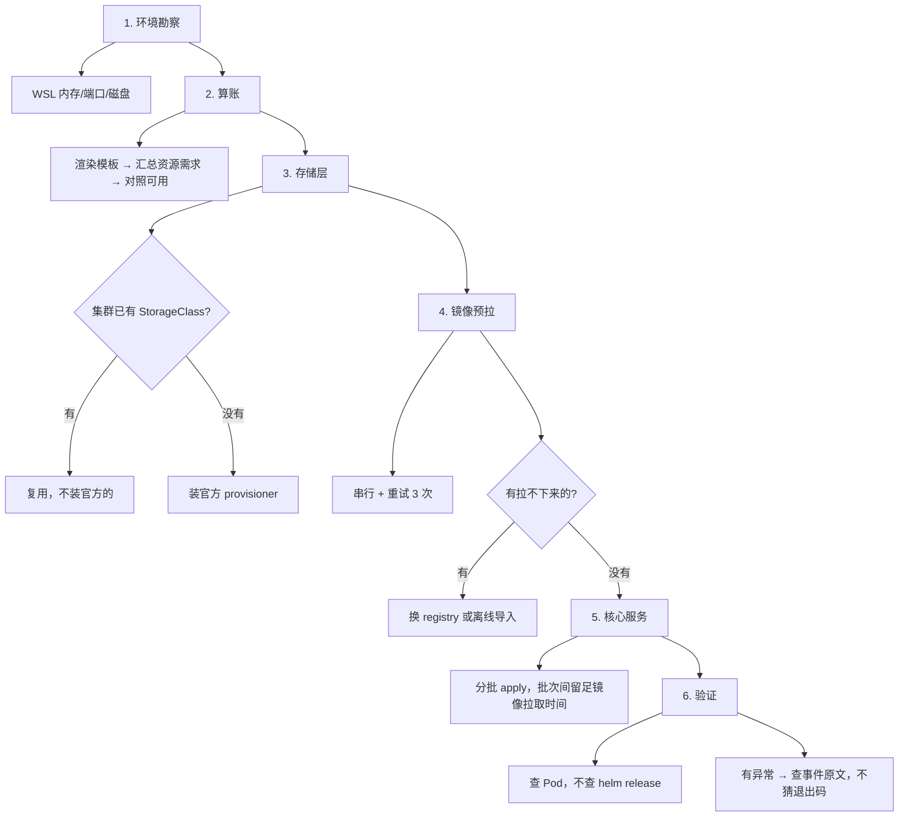

# 蓝鲸 7.2 CE 部署实战经验

> ⚠️ **本文档状态：历史快照（过时时点 2026-09-23）**
>
> 决策复盘写于 9-23，其中「Pod 131 个 / 内存峰值 37%」等为**当时快照**。9-24 八批验证后终态为 **Pod 95 Running / 12 Completed，内存 used 36G**。方法论部分仍然有效。
>
> **最新终态请看**：[25-部署验收总报告-全8批合并.md](25-部署验收总报告-全8批合并.md)（2026-09-24，实测）


> 环境：kind 三节点 K8s（1 control-plane + 2 worker）/ namespace `blueking` / 部署目录 `/root/bk72`
> 完成时间：2026-09-23
> 定位：**决策复盘**，不是操作手册。操作命令看 [09-排障速查手册](09-排障速查手册.md)，这里只讲**当时为什么这么选、选对了没有、下次怎么选**。

---

## 零、先说结论：单机跑蓝鲸 7.2 是可行的

最终状态（实测，非推算）：

```text
Pod        131 个，异常 0
PVC        14/14 Bound
节点内存   worker 37% / worker2 29% / control-plane 4%
节点 CPU   5% / 3% / 1%
```

**20 核 47G 的单机，跑完整蓝鲸 7.2 CE 完全够用。** 内存峰值只到 37%，CPU 峰值 5% —— 真正的瓶颈从来不是资源，而是**镜像拉取**和**组件依赖顺序**。

下面所有经验，都围绕这两件事展开。

---

## 一、做对的四个决策

### 1.1 复用集群现有 StorageClass，不装官方 localpv

**当时的取舍**：官方 chart 默认要装 `localpv` provisioner；kind 集群自带 `standard`（provisioner 是 `rancher.io/local-path`）。

```bash
kubectl get storageclass
# standard (default)   rancher.io/local-path   Delete   WaitForFirstConsumer
```

**选择**：不装官方的，直接复用 `standard`。

**结果**：14/14 PVC 全部 Bound，零授权问题。

**为什么这个"省事"的选择反而是对的**：官方 localpv 需要从额外 registry 拉镜像，本环境曾遇到 401 授权问题；而复用集群自带的，连镜像都不用拉。**少一个组件，就少一个失败点。**

> **可迁移的判断**：部署第三方 chart 时，先问"这个依赖集群里是不是已经有了"。存储、ingress、DNS、证书管理这几类，K8s 生态通常已有成熟实现，且和集群磨合过。能用现成的就别装新的。
>
> **但要验证兼容性**：`standard` 的 `VOLUMEBINDINGMODE` 是 `WaitForFirstConsumer`，对有状态服务是友好的（PVC 会等 Pod 调度后再绑定），这点恰好和 localpv 行为一致，所以可以平滑替换。**不是所有场景都能这么换** —— 如果 chart 依赖 localpv 的特定特性（如裸盘直通），就不能省。

### 1.2 先渲染算账，再动手部署

**当时的动作**：`base-storage.yaml.gotmpl` 渲染后，先把 8 个组件的资源申请精确汇总：

| 项 | 需求 | 可用 | 余量 |
|---|---|---|---|
| 内存 | 3.06Gi | 34Gi | 11 倍 |
| PVC | 160Gi | 705G | 充足 |

**结果**：实测部署后节点内存只用了 4%（各约 2.2Gi），与推算吻合。

**为什么值得做**：这一步几乎没有成本（渲染是部署的必经步骤，多算一下而已），但它把"担心资源不够"这个模糊焦虑变成了确定结论。**部署前心里有数，部署时才能分辨哪些异常是真问题。**

> 反过来说：如果当时没算，看到 8 个 release 全 `failed` 时，第一反应会是"是不是资源不够" —— 然后就去加资源、调 limits，把一个**超时问题**当成**资源问题**处理，越改越乱。

### 1.3 大镜像串行 + 重试，不用 `docker compose pull`

**背景**：`docker compose pull` 并发拉 45 个镜像，**且脚本内没有任何重试**，一个失败整体退出。

**选择**：改成串行逐个拉，每个最多重试 3 次（脚本见 [prepull.sh](assets/prepull.sh)）。

**结果**：16 个核心镜像救回 15 个，其中 `postgres:15.18` 和 `pgvector:pg15` 都是**第 2 次才成功** —— 证明重试确实有效。

**关键认知**：失败不是随机的，是有规律的。

```text
小镜像（14MB、154MB）          → 一次就过
大镜像（elasticsearch、fusion-collector）→ 所有 layer 都 Download complete，
                                          但在 failed to copy 组装阶段被掐断
```

> **"Download complete" 不等于镜像可用。** 这次吃过亏：日志里有 115 次 `Download complete`，实际只有 2 个镜像落盘。判断镜像是否真的拉到了，要看 `docker images`，不看日志行数。

**残留问题**：`bklite/fusion-collector` 8 次重试全败（BK-Lite 线）。它的 12 个 layer 全部下载完成，但组装阶段稳定失败。这类属于**网络中间设备的限流/中断**，重试解决不了，需要换思路（分层拉取、换 registry、或离线导入）。本轮没有攻破，诚实记录。

### 1.4 修复时补跑官方动作，不手工写数据

这条在 [排障手册](09-排障速查手册.md) 里详细讲过，这里只说**为什么它属于"做对的决策"**。

发现 `bkrepo.user` 为空时，最快的手工修法是直接 `db.user.insertOne(...)`。但那样写入的密码哈希算法、角色结构可能与官方 `init-data.js` 不一致 —— **当时能用，下次升级就崩**。

选择补跑官方 Job（镜像 `bkrepo-init:v3.3.1-beta.1`），虽然多花了时间找镜像和 env，但写进去的数据和官方**逐字节一致**。

> **可迁移的判断**：修数据问题时，优先找"官方本来打算怎么写入"。手工写是捷径，但捷径的代价是**偏离基线**，而且这种偏离往往要到很久以后才暴露。

---

## 二、做错（或做得不够好）的三个地方

诚实复盘比总结经验更有价值。这三处都付出了额外时间成本。

### 2.1 一看到 137 就判 OOM —— 险些改错地方

**当时**：redis-cluster 退出码 137，教科书说 `137 = 128 + 9 = SIGKILL`，SIGKILL 通常是 OOM killer。

**差点做的动作**：加内存 limits、调大 requests。

**被什么阻止的**：先去查了证据。

```text
容器无 limits          → 没有 OOM 的前提
节点 39G 可用          → 内存充足
无 OOM 事件            → K8s 没记录到
Events: failed liveness probe  ← 真正的死因
```

真凶是 `initialDelaySeconds=5` —— redis 需要 55 秒才起来，探针 5 秒后就开始探，直接判死。

**教训**：**退出码是结果，不是原因**。同一个 137 至少有两个来源（OOM / 探针 kill），必须靠事件原文区分。

> 更值得记的是：如果当时直接去加内存，**问题不会消失**（探针还会杀），但**排查方向会彻底跑偏** —— 会以为"资源不够"，然后一路往扩容方向走。错误的第一步比不行动更糟。

### 2.2 试了 8 个密码，才想到查用户存不存在

**当时**：`admin:blueking` 认证失败，试了 blueking / admin / bkrepo / password 等 8 个常见密码，全 401。

**正确的做法**：第一次失败就该查 `db.user.count()`。

```text
实际：user count = 0    ← 用户从来没被创建
```

**用户表是空的，任何密码都会失败。** 这是个纯逻辑问题 —— 密码对不对的前提是用户存不存在，而我把顺序搞反了。

**教训**：**认证失败先查"对象存不存在"，再查"凭据对不对"。** 前者试多少遍都白搭，后者才是真的试密码。

### 2.3 探针打印"成功"，我就信了 —— dry-run 的陷阱

**当时**：手动跑 `init_bkrepo` 探针，输出"初始化成功"。

**实际**：传了 `--dry-run true`，而代码是 `dry_run or manager.create_project(...)`。argparse 里**非空字符串即真**，所以 `"true"` 和 `"false"` 都是真，压根没调 API。

**教训**：**只要路径上有 dry-run / 开关类参数，就必须用真实副作用验证**（查数据库、查 HTTP 状态码），不能只看程序打印的字。

> 这一条和 2.1 是同一个病根：**用"看起来对"替代"验证过对"**。2.1 是相信教科书的退出码解释，2.3 是相信程序的成功输出。解法也一样 —— 找一个**独立的、不可伪造的证据源**。

---

## 三、环境层面的三个硬事实

这些不是决策，是环境的客观约束，做任何规划都要先接受它们。

### 3.1 WSL2 默认只给宿主机一半内存

64 GB 机器，WSL 默认只拿 32 GB。这是微软的默认值，不是配置错误。

```ini
# C:\Users\<用户名>\.wslconfig
[wsl2]
memory=48GB
swap=8GB
```

**必须 `wsl --shutdown`**（不是重启终端），配置仅在 VM 完整重启后生效。

### 3.2 端口 80/443 早就被占了

Lite 用 Traefik 做网关，默认要 80/443，但本机的 kind control-plane 已经占了。

**解法**：改自己的端口，别停别人的服务。

```bash
export TRAEFIK_WEB_PORT=8080
```

注意 `bootstrap.sh` **没有 `--port` 参数**，只能通过环境变量设置。

### 3.3 大流量会触发网络中间设备限流

镜像拉取失败的目标 IP 固定是 `180.111.196.17:443`（腾讯云 TCR），特征是：

```text
小流量（/v2/ 探活、小镜像）  → 正常
持续大流量（并发拉大镜像）    → failed to copy 阶段被 reset
```

这不是 registry 的问题（`/v2/` 返回 401 说明服务正常），是**中间链路的限流**。重试能救回一部分，但不能根治。

### 3.4 改 hosts 会被文件锁拦截，且可能清空原文件

配本地域名解析时踩的坑，值得单独记 —— 因为它有**数据损坏风险**。

**现象**：`Set-Content` 写 hosts 报 `being used by another process`，但**文件已被清空为 0 字节**。

```text
备份成功 (1209 字节)  ✅
Set-Content 写入      ❌ 被占用，但 hosts 已变 0 字节
```

**危险在哪**：报错让人以为是"完全没写进去"，实际是**删了旧的、没写新的**。如果不先恢复就重试，会**在空文件上追加**，原有条目全丢。

**正确的处理顺序**：

1. **先确认备份存在**（本次备份 1209 字节，完好）
2. **先从备份恢复**，再看当前大小是否正常
3. **换写入方式**，不要重试原来的

**最终解法**：改用 .NET `FileStream` 独占模式一次性原子写入。

```powershell
$fs = New-Object System.IO.FileStream($h, [System.IO.FileMode]::Append,
        [System.IO.FileAccess]::Write, [System.IO.FileShare]::None)
$fs.Write($bytes, 0, $bytes.Length)
$fs.Close()
```

`Add-Content` 也失败（每条一次 IO，被锁时部分成功部分失败，导致**只写入 5 条且顺序错乱**）。一次性写入才可靠。

> **可迁移的判断**：对系统文件做"读-改-写"时，**先备份、先验证备份可用、再动手**。报错后第一件事是**看当前文件状态**（大小、内容），不是重试。
> 另外：注释用**英文**。中文注释经 ASCII 编码写入会变成乱码（本次出现 `# ===== ?? end =====`）。

### 3.4b 判断"用户是否创建"要看 profiles_profile，不能看 auth_user

查用户是否初始化时踩的坑，差点得出错误结论。

**现象**：`bk_user_api.auth_user`（Django 标准用户表）**0 行**。

按常规经验这会判定"admin 没创建、初始化失败"。但**实际登录完全正常**。

**真实情况**：蓝鲸的用户主体不在 `auth_user`，而在 `profiles_profile`：

```sql
SELECT id, username, enabled FROM bk_user_api.profiles_profile;
-- 1  admin    1     <- 用户在这里
```

**为什么容易误判**：`auth_user` 是 Django 自带表，多数系统的用户都在里面，惯性使然会先查它。
蓝鲸 2.x/7.x 的用户体系是自建的 `profiles_profile`，`auth_user` 可能长期为空。

> **可迁移的判断**：查"某对象是否存在"时，**先确认这个系统的主体表是哪张**，而不是凭框架惯例猜。
> 佐证方式：看该表有没有业务字段（如 `profiles_profile` 有 `domain`/`category_id`/`staff_status`），
> 有业务字段的才是主体表。

**同类陷阱**：`bk_paas3_apiserver.users` 与 `bk_user_api` 也是两套独立用户体系，不能混查。

### 3.5 访问必须配 hosts，且不能只配主域名

ingress 完全靠域名分发，**不带 Host 头访问 IP 一律 404**：

```text
http://localhost/                      -> 404
http://172.26.238.136/                 -> 404
http://bkpaas.paas.example.com/        -> 200  ✅
```

`paas.example.com` 是 chart 默认虚构域名，公网不存在，只能靠 hosts。

**必须全配，不能只配主入口** —— 前端页面里写死了这些依赖：

```javascript
var LOGIN_SERVICE_URL = 'http://paas.example.com/login'   // 登录中心
var BK_APIGW_URL      = 'http://apigw.paas.example.com'
var BK_COMPONENT_API_URL = 'http://bkapi.paas.example.com'
```

只配 `bkpaas.paas.example.com` 的话，**页面能开但登录不了**。本次共配 19 条。

---

## 四、如果重来一次，我会怎么排顺序

按这次的经验，重新排的部署顺序：



**三个关键调整**：

1. **镜像预拉提前到存储层之后、核心服务之前**。这次是边部署边拉，导致 helm 超时和镜像拉取混在一起，难以分辨是谁的问题。
2. **分批 apply，批次之间留足时间**。`--timeout 600s` 撞上 2 分钟/Pod 的拉取速度，必然超时。要么加大 timeout，要么分批，后者更可控。
3. **验证阶段固定三个动作**：查 Pod（不查 release）、查事件（不猜退出码）、查数据（不猜密码）。

---

## 五、一句话记住

| 场景 | 一句话 |
|---|---|
| helm release failed | 看 Pod，不看 release；超时不算失败 |
| 退出码 137 | 先查有没有 limits 和 OOM 事件，再判 OOM |
| 容器一直重启 | 查 livenessProbe 的 initialDelaySeconds |
| 认证 401 | 先查用户存不存在，别试密码 |
| 镜像拉取失败 | "Download complete" 不算成功，看 docker images |
| 缺数据 | 补跑官方初始化，别手工 INSERT |
| 装依赖组件 | 先看集群里有没有现成的 |
| 部署前 | 先渲染算账，别凭感觉估资源 |
| 程序说"成功" | 找独立的、不可伪造的证据验证 |
