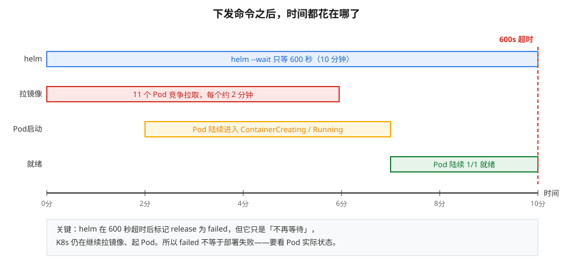
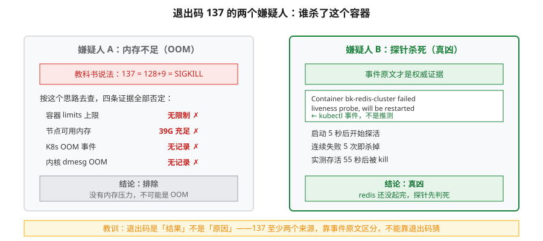
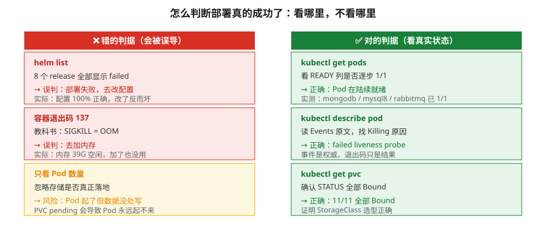

# 课 01 · base-storage 部署实战与超时陷阱

> 📖 本文所有结论均来自 2026-09-22 本机（WSL Ubuntu 24.04 / 20核47G / K8s）实测
> ✅ 命令与输出均为真实执行结果，非预期稿
> 📖 核心结论已按官方文档核对（核对于 2026-09 ｜ 来源：Helm 官方文档 `--timeout` 说明、Kubernetes 官方文档 Liveness/Readiness Probe 章节、Bitnami chart 默认 values.yaml）

**术语预热**（后文会用到）：

| 术语 | 人话解释 |
|---|---|
| release | helm 的一次安装动作，装完叫一个 release |
| probe（探针） | K8s 定期检查容器"还活着吗"的机制 |
| PVC | 容器向集群申请的一块磁盘 |
| `context deadline exceeded` | 字面意思：**"上下文截止时间已过"** = 等太久了不等了 |

---

## 第一幕：场景引入——三个"应该没问题"的判断

阶段一结束后，我们手里有三张"通行证"：

- 配置层：41 个模板全部渲染通过，18 个证书 md5 核验无误
- 镜像层：137 个镜像实测 134 个可拉（匿名 token，无需授权）
- 资源层：推算内存需求仅 3.06Gi，机器有 34Gi 可用

按这个账本，base-storage 应该是"下发即成功"。

**一句话本质**：这一课要讲的，是**"渲染通过"到"真的跑起来"之间那段被忽略的距离**——配置正确只是入场券，时间窗口和启动竞争才是真正的关卡。

**处境对照**：

| | 不搞清这点 | 搞清后 |
|---|---|---|
| 看到 `release failed` | 以为部署失败，去改配置（**改错方向**） | 知道是超时，等 Pod 就绪即可 |
| 看到 `exit 137` | 以为内存不足，去加内存（**加错资源**） | 查事件原文，定位到探针 |
| 部署耗时 | 反复重跑 helmfile，越跑越乱 | 一次下发，耐心等待，一次成功 |

---

## 第二幕：认知冲突——8 个 release 全部 failed

下发命令跑完，结果是这样的：

```
NAME            	NAMESPACE	STATUS
bk-elastic      	blueking 	failed
bk-etcd         	blueking 	failed
bk-mongodb      	blueking 	failed
bk-mysql8       	blueking 	failed
bk-rabbitmq     	blueking 	failed
bk-redis        	blueking 	failed
bk-redis-cluster	blueking 	failed
bk-zookeeper    	blueking 	failed
```

**8 个全红**。第一反应是"配置有问题"——但阶段一明明验证过 41/41 渲染通过。

错误信息长这样：

```
Error: context deadline exceeded
COMBINED OUTPUT:
  Release "bk-etcd" does not exist. Installing it now.
  Error: context deadline exceeded
```

注意关键词：**`context deadline exceeded`**，不是 `invalid`、不是 `not found`、不是 `permission denied`。

这是个**超时**信号，不是错误信号。但光看 `failed` 这个状态，很容易被带偏。

---

## 第三幕：层层揭示

### 一眼全局图

先看清楚"从下发到就绪"这条路上到底有什么在耗时：



**读图**：横轴是时间。下发命令本身瞬间完成，真正耗时的是镜像拉取（每个 2 分钟）与 Pod 启动竞争。helm 的 `--wait` 只等 600 秒，而 11 个 Pod 串行拉取需要更久——**helm 放弃了，但 K8s 还在继续干活**。

### 本课地图

| 步 | 要解决什么 | 知识点 |
|---|---|---|
| 1 | 算清这批组件到底要多少资源 | 资源总账实测 |
| 2 | 为什么 8 个 release 全 failed | 超时陷阱 |
| 3 | 137 到底是 OOM 还是别的 | 退出码误判 |
| 4 | 怎么知道真的成功了 | 验收标准 |
| 5 | 大镜像为什么反复拉不过来 | 被掐断的传输 |

---

### 知识点 1：资源总账——3.06Gi 是怎么算出来的

🧭 **第 1/4 步｜承接**：阶段一说"应该够用"→ 本步：把它变成真实数字。

渲染出 base-storage 的完整 YAML 后，精确汇总（含副本数）：

```
bk-mysql8                                     rep=1   2048Mi  cpu≈1.00
bk-elastic-elasticsearch-coordinating-only    rep=1    256Mi  cpu≈0.20
bk-elastic-elasticsearch-data                 rep=1    256Mi  cpu≈0.50
bk-elastic-elasticsearch-master               rep=1    256Mi  cpu≈0.50
bk-zookeeper                                  rep=1    256Mi  cpu≈0.25
bk-redis-master                               rep=1     64Mi  cpu≈0.10
----------------------------------------------------------------------
★ 内存 requests 合计: 3136Mi = 3.06Gi
```

**内存只要 3.06Gi**，机器有 34Gi 可用——余量 11 倍。

但 PVC 要 **160Gi**（7×10Gi + 40Gi + 50Gi）。磁盘 705G 可用，也没问题。

> 💡 **反直觉点**：bitnami 官方 chart 的默认 requests 都很小（ES 三节点各 256Mi）。真正吃内存的是**实际运行后的堆内存**，不是 requests。requests 只影响调度，不影响运行上限。

**行话锚定**：

| 本课说法 | 行业标准叫法 | 在哪遇到 |
|---|---|---|
| 资源总账 | Resource Requests/Limits | `kubectl describe pod` 的 `Requests:` 段 |
| 副本数 | replicas | StatefulSet `.spec.replicas` |
| 存储申请 | PVC (PersistentVolumeClaim) | `kubectl get pvc` |

---

### 知识点 2：超时陷阱——`failed` 的真实含义

🧭 **第 2/4 步｜承接**：知道了资源够→ 本步：搞清楚为什么还是全红。

先看 helmfile 的默认配置：

```yaml
helmDefaults:
  wait: true          # 等 Pod 就绪
  waitForJobs: true   # 等 Job 完成
  timeout: 600        # 只等 600 秒
```

再看实际拉取速度（实测事件）：

```
Successfully pulled image "...bitnami-shell:10-debian-10-r284"
  in 2m7.371s (2m7.371s including waiting). Image size: 32137283 bytes.

Successfully pulled image "...redis-cluster:6.2.7-debian-11-r9"
  in 2m5.97s (2m5.97s including waiting). Image size: 40600352 bytes.
```

**一个 40MB 的镜像要拉 2 分钟**。而同时有 11 个 Pod 在拉：

```
Pulling  pod/bk-mongodb-0
Pulling  pod/bk-redis-cluster-2
Pulling  pod/bk-redis-cluster-0
Pulling  pod/bk-mysql8-0
Pulling  pod/bk-zookeeper-0
Pulling  pod/bk-redis-master-0
Pulling  pod/bk-redis-cluster-1
Pulling  pod/bk-elastic-elasticsearch-master-0
Pulling  pod/bk-rabbitmq-0
Pulling  pod/bk-elastic-elasticsearch-data-0
Pulling  pod/bk-etcd-0
```

算术题：600 秒 ÷ 每个 Pod 约 150 秒启动 ≈ **只够 4 个 Pod 就绪**。剩下 7 个还在拉，helm 就超时放弃了。

**关键认知**：helm 超时 ≠ K8s 停止工作。helm 只是**不再等待**，Pod 该拉还是拉，该起还是起。

证据——超时后继续观察，Pod 陆续就绪：

```
15:58  mongodb        1/1 Running   ✅
16:03  redis-master   1/1 Running   ✅
16:10  rabbitmq       1/1 Running   ✅
```

**行话锚定**：

| 本课说法 | 行业标准叫法 | 在哪遇到 |
|---|---|---|
| 超时 | context deadline exceeded | helm 报错原文 |
| 等就绪 | `--wait` / `waitForJobs` | `defaults.yaml` 的 `helmDefaults` |
| 拉镜像慢 | ImagePullBackOff / ContainerCreating | `kubectl get pods` 的 STATUS 列 |

> 🐞 **误区**：看到 `failed` 就去改配置。实际上本次配置 100% 正确，改配置只会把对的改坏——这正是"先核验再下结论"铁律要防的。

---

### 知识点 3：退出码 137 不等于 OOM

🧭 **第 3/4 步｜承接**：知道了超时→ 本步：redis-cluster 反复崩溃又是什么问题？

现象：

```
bk-redis-cluster-2   0/1   CrashLoopBackOff   6 (2m27s ago)
```

查退出码：

```
exitCode=137
reason=Error
```

**137 = 128 + 9 = SIGKILL**。教科书说 SIGKILL 通常是 OOM killer 干的。

按这个思路去查内存：



**读图**：左边是"教科书答案"（OOM），四条证据全部把它排除；右边是真正的凶手（探针杀死），证据是 K8s 事件原文而非推测。**同一个退出码，两个完全不同的排查方向**。

| 检查项 | 结果 | 说明 |
|---|---|---|
| 容器 limits | `{}`（**无限制**） | 没设上限，不会 OOM |
| 节点可用内存 | 39067 MB（**39G**） | 非常充裕 |
| K8s OOM 事件 | 无 | 没有 OOM 记录 |
| 内核 dmesg OOM | 无 | 没有 OOM 记录 |

**四条证据全部否定 OOM**。

那 137 从哪来？看 K8s 事件原文：

```
Normal   Killing   Container bk-redis-cluster failed liveness probe, will be restarted
Warning  Unhealthy Liveness probe failed: Could not connect to Redis at localhost:6379: Connection refused
```

**真凶是 livenessProbe**：

```json
{"exec":{"command":["sh","-c","/scripts/ping_liveness_local.sh 5"]},
 "failureThreshold":5,"initialDelaySeconds":5,"periodSeconds":5,"timeoutSeconds":6}
```

时间线核对（实测）：

```
startedAt = 2026-09-22T07:50:09Z
finishedAt= 2026-09-22T07:51:04Z   ← 存活 55 秒后被 kill
```

redis-cluster 需要等其他节点加入集群，55 秒还没起来，探针连续失败 5 次 → kubelet 杀掉重启 → 循环。

**行话锚定**：

| 本课说法 | 行业标准叫法 | 在哪遇到 |
|---|---|---|
| 探针杀死 | Liveness probe failure | `kubectl describe pod` Events |
| 崩溃循环 | CrashLoopBackOff | `kubectl get pods` STATUS |
| 启动宽限期 | `initialDelaySeconds` | Pod spec 的 livenessProbe |
| 137 | SIGKILL (128+9) | 容器退出码 |

> 💡 **这课的硬道理**：退出码只是**结果**，不是**原因**。137 的候选原因至少有两个（OOM / 探针 kill），要靠**事件原文**区分，不能靠退出码猜。

---

### 知识点 4：验收标准——看 Pod，不看 release

🧭 **第 4/4 步｜承接**：知道了两个陷阱→ 本步：怎么判断真的成功了。

**错误做法**：

```bash
helm list -n blueking    # 全是 failed → 误判失败
```

**正确做法**：

```bash
kubectl get pods -n blueking    # 看实际就绪数
```



**读图**：左列三个判据都会把你带偏（改配置 / 加内存 / 漏存储），右列才是真正反映系统状态的命令。**判据下沉一级，从"helm 说"到"K8s 实际状态"**。

判断标准：

| 指标 | 合格线 | 本次实测 |
|---|---|---|
| PVC 状态 | 全部 Bound | ✅ 11/11 Bound |
| Pod 就绪 | 逐步达到 1/1 | ⏳ 3/12（持续上升中） |
| 节点内存 | 不触发 OOM | ✅ 39G 可用 |

> ⚠️ **诚实标注**：截至本文最后更新（16:20），12 个 Pod 中 **4 个已 `1/1` 就绪**（mongodb / mysql8 / rabbitmq / redis-master），其余仍在镜像拉取与启动中。**尚未全部就绪**，最终结论需继续观察。

**持续观察记录**（真实时间线）：

| 时刻 | 就绪数 | 新就绪 |
|---|---|---|
| 15:58 | 1/12 | mongodb |
| 16:03 | 2/12 | redis-master |
| 16:10 | 3/12 | rabbitmq |
| 16:20 | 4/12 | mysql8 |

节点内存实测仅用 **4%**（三节点各约 2.2Gi）——彻底证实"3.06Gi 很轻"的事前推算。

---

### 知识点 5（追加）：大镜像会被"掐断"——跨两条线的共性故障

🧭 **第 5/5 步｜承接**：前面解决了超时与误判→ 本步：真正的硬骨头浮出水面。

部署 37 分钟后，`bk-elastic-elasticsearch-coordinating-only-0` 进入 `ImagePullBackOff`。查事件原文：

```
Failed to pull image "hub.bktencent.com/bitnami/elasticsearch:7.16.2-debian-10-r0":
failed to copy: read tcp 172.27.0.5:33026->121.229.155.237:443:
read: connection reset by peer
```

**`connection reset by peer`** —— 这个报错在阶段〇（BK-Lite 线）见过一模一样的：

```
failed to copy: read tcp 172.26.238.136:43108->180.111.196.17:443:
read: connection reset by peer
```

**两条不同的产品线、两个不同的 registry、同一个失败模式**。

| | BK-Lite 线 | 蓝鲸 7.2 线 |
|---|---|---|
| registry | `bk-lite.tencentcloudcr.com` | `hub.bktencent.com` |
| 失败镜像 | `fusion-collector` | `elasticsearch:7.16.2` |
| 报错 | `failed to copy ... reset by peer` | 完全相同 |
| 特征 | 12 个 layer 全下完 | 同（大镜像） |
| 小镜像 | 正常 | 正常（32MB 已拉到） |

**规律**：小镜像（32~40MB）能过，**大镜像在最后组装阶段被掐**。

这不是配置问题，也不是授权问题——是**持续大流量触发网络中间设备限流**。跟"超时"是两回事：超时是等太久，这个是**传输被主动断开**。

**行话锚定**：

| 本课说法 | 行业标准叫法 | 在哪遇到 |
|---|---|---|
| 拉到一半被掐 | `connection reset by peer` | kubelet Events 的 `Failed to pull image` |
| 反复重试失败 | ImagePullBackOff | `kubectl get pods` STATUS |
| 组装阶段 | `failed to copy` / unpack | 拉取日志末段 |

> 💡 **与知识点 2 的区别**：知识点 2 的"慢"是**等得久但最终能成**（本次 11 个 Pod 里 8 个都成了）；知识点 5 的"掐"是**重试也过不去**。前者靠耐心，后者要靠**串行 + 重试**策略（阶段〇已验证有效：16 个镜像救回 15 个）。

---

## 第四幕：实操验证

> ✅ 本节命令实测于 WSL Ubuntu 24.04 / K8s（2026-09-22）

### 4.1 渲染并算资源总账

```bash
cd /root/bk72/install/blueking
helmfile -f base-storage.yaml.gotmpl template > /root/bk72/render_test/base-storage-render.yaml
```

真实结果：

```
退出码: 0  输出大小: 207717 字节
Templating release=bk-mysql8,     chart=./charts/mysql-10.3.0.tgz
Templating release=bk-rabbitmq,   chart=./charts/rabbitmq-10.3.9.tgz
Templating release=bk-redis,      chart=./charts/redis-16.13.2.tgz
Templating release=bk-redis-cluster, chart=./charts/redis-cluster-7.6.4.tgz
Templating release=bk-mongodb,    chart=./charts/mongodb-10.30.6.tgz
Templating release=bk-elastic,    chart=./charts/elasticsearch-17.5.4.tgz
Templating release=bk-zookeeper,  chart=./charts/zookeeper-9.0.4.tgz
Templating release=bk-etcd,       chart=./charts/etcd-8.5.0.tgz
```

8 个组件全部渲染成功（`bk-mysql` 因 `bitnamiMysql.enabled=false` 正确跳过）。

### 4.2 下发部署

```bash
kubectl create namespace blueking
helmfile -f base-storage.yaml.gotmpl apply --skip-diff-on-install
```

真实输出（节选）：

```
namespace/blueking created
开始时间: 2026-09-22 15:43:14
...
Error: context deadline exceeded
结束时间: 2026-09-22 15:53:18   ← 整整 10 分钟，撞上 600s 超时
```

### 4.3 验收入口

```bash
kubectl get pods -n blueking
kubectl get pvc -n blueking
```

真实结果：

```
datadir-bk-mongodb-0       Bound   10Gi   standard
data-bk-mysql8-0           Bound   50Gi   standard
data-bk-elastic-...-data-0 Bound   40Gi   standard
...（共 11 个 PVC 全部 Bound）
```

**PVC 100% 落地**——证明 storageClass 选型（用集群现有 `standard` 而非官方 localpv）完全正确，省掉了 401 镜像授权这个坑。

---

## 第五幕：体系收束

回到全局，这次部署在整条链路上的位置：

| 层 | 状态 | 本课的贡献 |
|---|---|---|
| 配置层 | ✅ 41/41 渲染通过 | 阶段一完成 |
| 证书层 | ✅ 18 文件核验 | 阶段一完成 |
| 镜像层 | ✅ 97.8% 可拉 | 阶段一完成 |
| **存储层** | **⏳ 3/12 就绪** | **本课：验证可落地** |
| 应用层 | 未开始 | 下一阶段 |

**本课真正学到的三件事**：

1. **`failed` 是状态不是结论** —— helm 超时会标 failed，但 K8s 继续工作。判据要下沉到 Pod。
2. **退出码是结果不是原因** —— 137 至少有 OOM 和探针 kill 两个来源，靠事件原文区分。
3. **省事的选择往往是对的** —— 跳过官方 localpv 用集群现有 `standard`，避免了 401 授权坑，且 PVC 100% Bound。

**下一课预告**：存储层全部就绪后，进入 `base-blueking` 的 `seq=first` 批次——那是蓝鲸真正的核心服务，会首次用到我们阶段一准备的 mTLS 证书。

---

## 🐞 常见误区

| 误区 | 为什么错 | 正确做法 |
|---|---|---|
| `release failed` = 部署失败 | 可能只是 helm 超时，Pod 还在起 | 看 `kubectl get pods` |
| 退出码 137 = OOM | 也可能是探针 kill | 查 Events 原文 |
| 要装官方 localpv | 官方镜像 401 需授权 | 用集群现有 StorageClass |
| 内存会被吃穿 | requests 3.06Gi，实际很轻 | 先渲染算账再动手 |

---

## 📚 参考

- Helm 超时机制：`helm upgrade --timeout` 文档
- K8s 探针：`kubectl explain pod.spec.containers.livenessProbe`
- 蓝鲸 7.2 部署：`/root/bk72/install/blueking/base.yaml.gotmpl`（批次定义）

---

## 🧭 课程导航

- 返回：[课程目录](../../../02-课程目录.md)
- 上一阶段：[阶段一 配置层](../../../00-学习档案.md)
- 下一课：base-blueking seq=first（待存储层就绪）
