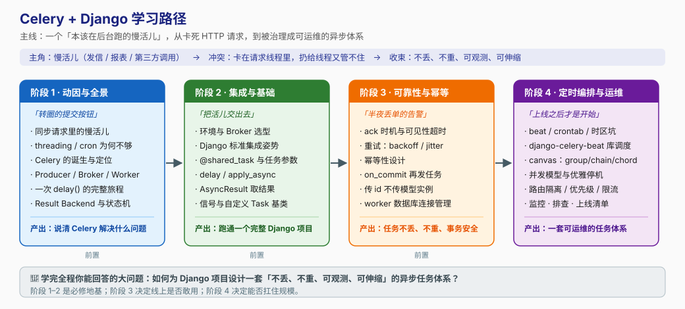

# Celery + Django 学习路径总览

> 本文件是活文档，随学习进度动态调整。

## 🎯 学习目标

- **目标类型**：**动手实操为主，兼顾概念理解与生产实战**（用户选择"全都要"）
- **目标说明**：学完能独立为 Django 项目接入 Celery，正确定义/调用/编排任务，并让它在生产环境**不丢、不重、可观测、可伸缩**；同时说得清每个关键配置背后的代价与取舍。

> 学习目标是全局基准：每课必须包含**可运行**的代码/命令，不能只讲概念。

## 故事主线

- **主角**：一个"本该在后台跑的慢活儿"（发邮件 / 生成报表 / 调第三方接口）
- **冲突**：它卡在 HTTP 请求线程里把用户请求拖死；扔给 `threading` 又管不住——进程一退任务就没了，不能重试、不能跨机器、没法监控
- **收束**：如何为 Django 项目设计一套「不丢、不重、可观测、可伸缩」的异步任务体系？

> 整个课程是这条故事线的展开，每个阶段是故事的一个"章节"。

## 学习路径图

---

## 阶段总览

### 阶段 1：异步化的动因与 Celery 全景（故事章节："转圈的提交按钮"）

- **目标**：能说清"为什么需要 Celery"，并看懂一次任务调用的完整链路。
- **学习重点**：
  - 同步请求被慢活儿拖死的真实代价（连接占用 → 超时级联）
  - `threading` / `cron` 这类土办法的能力边界
  - Producer / Broker / Worker 三大件的职责与解耦价值
  - 消息从 `delay()` 到 worker 执行的完整旅程
- **必须掌握**：画出 Celery 消息流转图；解释为什么"多开线程"不等于"任务队列"；说清 Result Backend 是可选件。
- **对应课**：[课 1 为什么需要异步任务](stages/1-异步化的动因与Celery全景/lessons/lesson-01-为什么需要异步任务.md)、[课 2 Celery 架构全景与消息流转](stages/1-异步化的动因与Celery全景/lessons/lesson-02-Celery架构全景与消息流转.md)

### 阶段 2：Django 集成与任务基础（故事章节："把活儿交出去"）

- **目标**：从零跑通一个完整的 Django + Celery 项目，会定义任务、调用任务、取回结果。
- **学习重点**：
  - Broker 选型（Redis vs RabbitMQ）的取舍依据
  - Django 官方标准集成姿势（`proj/proj/celery.py` + `__init__.py` + `autodiscover_tasks`）
  - `@shared_task` 与 `@app.task` 的选择，任务常用参数
  - `delay()` 只是语法糖，`apply_async()` 才是完整能力入口
  - 结果查询的正确用法与反模式
- **必须掌握**：独立搭建 Django + Celery 骨架；用 `apply_async(countdown=, eta=, expires=, queue=)` 精确控制投递；知道什么时候**不配** result backend。
- **对应课**：课 3 第一个 Celery + Django 项目、课 4 调用任务与取回结果

### 阶段 3：可靠性与幂等（故事章节："半夜丢单的告警"）

- **目标**：知道任务为什么会丢/会重，并掌握让任务"不丢不重"的配置与设计。
- **学习重点**：
  - ack 时机（默认 vs `acks_late`）与 Redis `visibility_timeout` 经典坑
  - 重试策略：backoff、jitter、哪些异常不该重试
  - 幂等性设计：Celery 是**至少一次**投递语义
  - **Django 特有坑**：事务未提交就发任务、传模型实例做参数、worker 数据库连接泄漏
- **必须掌握**：配置一套"长任务不丢 + 失败自动重试 + 业务幂等"的组合；用 `transaction.on_commit` 修掉最经典的脏读 bug。
- **对应课**：课 5 确认机制与重试策略、课 6 Django 事务与 ORM 的坑

### 阶段 4：定时、编排与生产运维（故事章节："上线之后才是开始"）

- **目标**：能交付一套可运维的异步任务体系——定时可靠、编排可控、部署稳、出问题能查。
- **学习重点**：
  - beat / crontab / 时区坑，django-celery-beat 动态调度
  - canvas 三件套：`group` / `chain` / `chord` 及其可靠性边界
  - 并发模型选型（prefork / threads / gevent）与优雅停机（5.5+ soft shutdown、`REMAP_SIGTERM`）
  - 路由与队列隔离：避免慢任务造成队头阻塞
  - 可观测性（Flower / events / 结构化日志）与常见故障排查
- **必须掌握**：为不同类型任务选对并发模型与队列；配置优雅停机不丢任务；给出一份上线自查清单。
- **对应课**：课 7 beat 与周期性任务、课 8 canvas 任务编排、课 9 生产部署与并发模型、课 10 监控、排查与上线清单

---

## 当前进度

- [x] 阶段 1：异步化的动因与 Celery 全景（**✅ 已完成** — 6/6 知识点，2026-08-31）
- [x] 阶段 2：Django 集成与任务基础（**✅ 已完成** — 6/6 知识点，2026-08-31）
- [x] 阶段 3：可靠性与幂等（**✅ 已完成** — 6/6 知识点，2026-08-31）
- [ ] 阶段 4：定时、编排与生产运维（**进行中** — 课 7、课 8 已完成 6/12 知识点）

> 知识点级进度见 [00-学习档案.md](00-学习档案.md)。课程目录见 [02-课程目录.md](02-课程目录.md)。

## 版本基线

> 本文涉及的版本/生态结论核查于 **2026-08**。

| 组件 | 基线版本 | 说明 |
|------|----------|------|
| Celery | **5.6.x**（当前稳定版；5.6.3 于 2026-03 发布） | 5.6.0 起不再支持 Python 3.8，最低 Python 3.9 |
| Django | 2.2 LTS 及以上（Celery 5.5+ 要求） | 与 Celery 无强绑定，注意 Celery 5.6 新增的 Django 连接池支持 |
| Broker 首选 | Redis / RabbitMQ | Redis 在 Kombu 5.4.0 后修复了长期断连问题 |
| 常用扩展 | django-celery-beat、django-celery-results、Flower | beat 库调度 / 结果入库 / 监控面板 |
