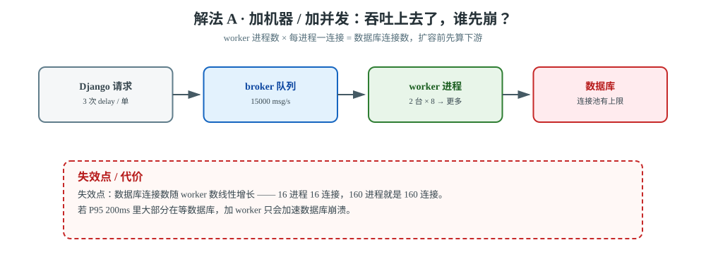
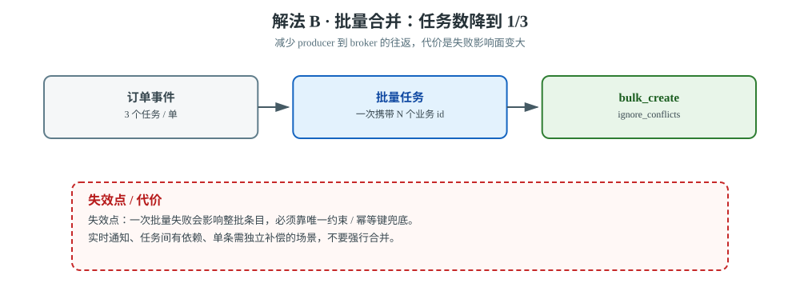
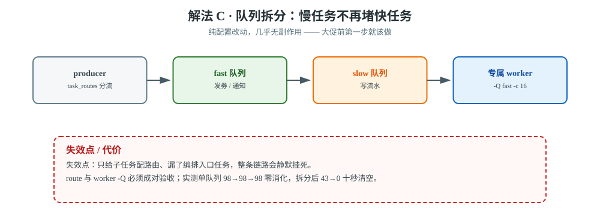
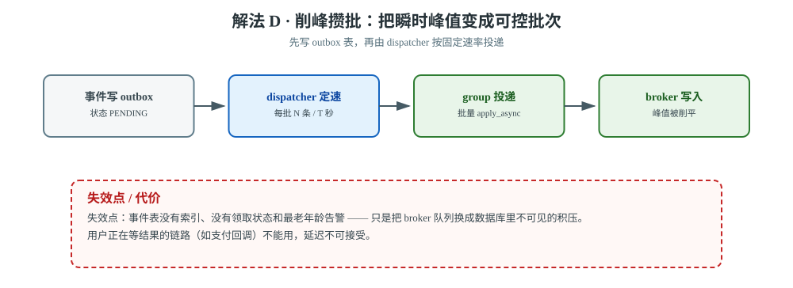
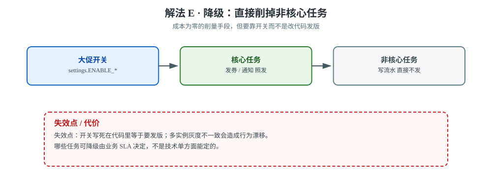
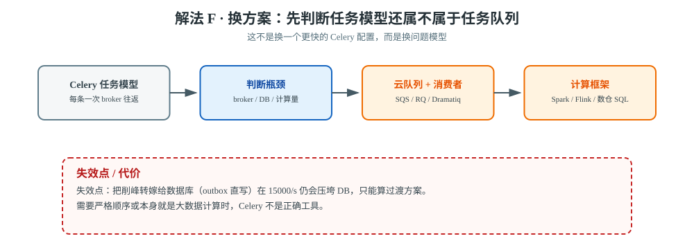

# 场景 1：流量翻 10 倍，QPS 500 → 5000（规模压力题）

**场景描述**：订单系统平时峰值 500 QPS，每个订单触发 3 个异步任务（发券、通知、写流水）。明天大促，预计峰值 **5000 QPS**，即每秒 **15000 个任务**。当前配置：2 台机器各 1 个 worker，`-c 8`，共用 `default` 队列，Redis 单实例。监控显示平时队列长度稳定在 100 以内，任务 P95 延迟 200ms。

**🔒 先自己想 30 秒**：第一反应是加机器还是加并发？——先问一句：**瓶颈到底在哪**？是 worker 算力不够、broker 扛不住，还是数据库先崩？

<details><summary>💡 提示（分层想，别只盯一层）</summary>

- **生产端**：Django 每收到一个请求就 `delay()` 三次——这三次网络往返本身是开销吗？
- **Broker 端**：Redis 单实例每秒能扛多少写入？15000/s 是什么量级？
- **消费端**：16 个进程（2 台 × 8）每秒能处理多少任务？每任务 50ms 时理论上限是多少？
- **下游**：worker 变快之后，谁先扛不住？（提示：通常是数据库）
- **粒度**：3 个任务能不能合成 1 个？

</details>

<details><summary>📖 展开解法</summary>

### 解法一览

| 解法 | 效果（下游压力 / 改动侵入性） | 代价 | 适用边界 |
|------|--------------------------|------|---------|
| **A · 加机器 / 加并发** | 下游压力：**↑↑ 线性放大** / 侵入性：低（改配置） | 线性成本；**数据库连接数暴涨**（16 进程 = 16 连接，160 进程 = 160 连接） | 任务确实 CPU/IO 密集、且下游有余量时 |
| **B · 批量合并任务** | 下游压力：↓ 写入量降到 1/3 / 侵入性：中（改任务签名） | 异步粒度变粗，单个失败影响面变大 | 任务间无依赖、可容忍短延迟 |
| **C · 队列拆分 + 专属 worker** | 下游压力：→ 基本不变 / 侵入性：**低（纯配置）** | 运维复杂度上升 | **必做**，几乎无副作用 |
| **D · 削峰攒批** | 下游压力：↓ 峰值削平 / 侵入性：高（改投递路径） | 增加延迟 | 可容忍秒级延迟的场景 |
| **E · 降级（关非核心任务）** | 下游压力：**↓↓ 直接削掉 1/3 的量** / 侵入性：低（开关） | 功能降级 | 有明确的非核心任务 |
| **F · 换 Celery 以外的方案** | 下游压力：取决于新栈 / 侵入性：**最高（换组件）** | 引入新组件 | 任务模型根本不匹配时 |

### 各解法详解

**场景级总览图**：单队列混跑时，一个慢任务能把 15000 个快任务堵死；拆分后快慢各走各的 worker。


> **读图**：左边是所有任务挤在一条 `default` 队列里，右边的快 / 慢任务被 `task_routes` 分到两条队列、各由专属 worker 消费——差别的不是算力，是"慢任务会不会挡住快任务"。

#### 解法 A · 加机器 / 加并发



> **读图**：吞吐沿箭头一路放大，但红框落在数据库——连接数随 worker 进程数线性增长，扩到 160 进程就是 160 连接。

**思路**：吞吐 = 并发数 × 单任务速度。这是最直觉的一步，但**必须先算下游**：

```python
# 16 个 worker 进程 = 16 个数据库连接（Django 每进程一连接）
# 扩到 10 台 × 16 = 160 个进程 = 160 个连接
# ⚠️ 很多人加完 worker 发现数据库先崩了
```

```python
# settings.py：用连接池/限制连接数，别让连接数随并发线性涨
DATABASES = {
    'default': {
        **BASE,
        'CONN_MAX_AGE': 60,          # 复用连接，而不是每条任务新建
        'OPTIONS': {'connect_timeout': 5},
    }
}
```

> ⚠️ **加之前先确认瓶颈**：如果 P95 延迟 200ms 里大部分在等数据库，加 worker 只会**加速数据库崩溃**。

#### 解法 B · 批量合并任务



> **读图**：三次投递被合并成一次批量写入，代价落在红框——整批失败的影响面从 1 条变成 N 条。

如果发券、通知、写流水之间没有必须独立重试的依赖，可以让一次订单事件携带一批业务 id，由一个任务批量处理，减少 producer 到 broker 的往返次数。

```python
@app.task
def write_ledger_batch(order_ids):
    # 业务写入仍需唯一约束 / 幂等键，批量不等于 exactly-once
    Ledger.objects.bulk_create(
        [Ledger(order_id=order_id) for order_id in order_ids],
        ignore_conflicts=True,
    )
```

批量大小要用失败影响面和消息体大小共同约束；一次批量失败后不能把已成功的条目再无保护地写一遍。对实时通知、任务之间有依赖或单条失败必须独立补偿的任务，不要强行合并。

#### 解法 C · 队列拆分（第一步就该做）



> **读图**：producer 后面裂成 `fast` / `slow` 两条路，各走各的 worker；红框提醒漏配编排入口路由会让整条链路静默挂死。

**思路**：大促最怕的不是算力不够，是**一个慢任务把 15000 个快任务堵死**。

```python
# settings.py
CELERY_TASK_ROUTES = {
    'orders.tasks.issue_coupon':  {'queue': 'fast'},
    'orders.tasks.send_notify':   {'queue': 'fast'},
    'orders.tasks.write_ledger':  {'queue': 'slow'},
}
```

```bash
# 快任务多给并发，慢任务单独隔离
celery -A proj worker -Q fast -c 16 --prefetch-multiplier=1
celery -A proj worker -Q slow -c 4  --prefetch-multiplier=1
```

【实测】本项目同类场景（30 秒观察窗）：
- 单队列混跑：`98 → 98 → 98`（**30 秒零消化**）
- 拆分队列后：`fast 43 → 0`（**10 秒清空**）

> 详见 [应用实战 · 02 Celery 架构全景](../应用实战/02-Celery架构全景与消息流转.md)。

> ⚠️ **编排入口也要配路由**！只给子任务配、漏了入口任务，会让整条链路静默挂死（[故障模式 1](../08-实战经验.md)）。

#### 解法 D · 削峰攒批



> **读图**：峰值先落在 outbox 表里，再由 dispatcher 定速放出去；红框提醒没有索引、领取状态与最老年龄告警时，积压只是换了个看不见的地方。

大促允许秒级延迟时，可以先把事件写入 outbox / 缓冲表，由固定速率的 dispatcher 每次取 N 条再投递；它把瞬时 broker 写入峰值变成可控批次。

```python
# 关键不是 sleep，而是可恢复的批次游标
events = list(
    OrderEvent.objects
    .filter(status='PENDING')
    .order_by('id')[:500]
)
group(write_ledger.s(event.order_id) for event in events).apply_async()
```

必须给事件表建索引、记录领取状态和最老事件年龄；否则只是把 broker 队列换成数据库里不可见的积压。

#### 解法 E · 降级（性价比最高）



> **读图**：开关把三分之一的任务直接从链路上摘掉；红框提醒开关若写死在代码里，连降级也要发版。

大促期间把"写流水"这类非核心任务直接关掉，可能直接削掉 1/3 的量，成本为零：

```python
# 用 feature flag 控制，而不是改代码发版
from django.conf import settings

def create_order(order):
    if settings.ENABLE_COUPON_TASK:
        issue_coupon.delay(order.id)
    if settings.ENABLE_LEDGER_TASK:      # 大促期间关掉
        write_ledger.delay(order.id)
```

#### 解法 F · 换用更匹配的消息 / 计算系统



> **读图**：先判断瓶颈落在 broker、数据库还是计算量，再决定是换队列还是换计算框架；红框提醒把削峰转嫁给数据库只是过渡。

当任务已经变成大规模流式处理、严格顺序消费或数据仓库计算时，继续增加 Celery worker 只会放大 broker、数据库和运维复杂度。F 不是“换一个更快的 Celery 配置”，而是先判断任务模型是否还属于任务队列问题；具体替代路线与边界见下一节。

### 非本栈替代路线（什么时候别用 Celery）

| 诉求 | Celery 的边界 | 该用什么 |
|------|--------------|---------|
| **纯延迟任务、无复杂编排、量极大** | Celery 每条任务一次 broker 往返，15000/s 时 broker 是瓶颈 | **RQ / Dramatiq**（更轻量）或直接用云队列（SQS/CMQ）+ 消费者 |
| **需要严格顺序** | Celery 只保证投递不保证顺序 | 单队列单并发，或数据库状态机 |
| **突发流量且允许秒级延迟** | 每条任务独立投递，峰值直接压到 broker | 先写数据库（outbox 表）+ 后台批量捞取，天然的削峰 |
| **任务本身是大数据计算** | Celery 是任务队列不是计算框架 | Spark / Flink / ClickHouse 侧物化视图 |

> ⚠️ 注意"先写库 + 后台捞"这条路线：**它把削峰问题从 broker 转移到了数据库**，适合写入量可控（几千 QPS 以内）的场景；真到 15000/s 仍要靠批量接口或消息队列。

### 推荐路径（递进，不是一次全上）

1. **第一步（先做，零风险）**：解法 C —— 拆队列。纯配置改动，立刻见效。
2. **第二步（性价比最高）**：解法 E —— 降级。先削掉非核心任务，可能就不用扩容了。
3. **第三步（真不够再上）**：解法 A —— 加机器。**加之前先算下游数据库连接数**。
4. **第四步（最后考虑）**：解法 B/D —— 改任务粒度。这是**侵入式改动**，要改代码 + 回归测试，大促前一周别做。

### 效果对比：怎么验证这一步真的有效

按题定制的三个观测维度（不要只看"队列长度"）：

| 维度 | 怎么看 | 期望变化 |
|------|--------|---------|
| **队列消化速率** | 连续采样 `LLEN fast` / `LLEN slow`（每 3 秒一次） | 从"零消化"变为"单调下降" |
| **快任务 P95 延迟** | 给快任务埋点，或看 `inspect active` 的任务年龄 | 慢任务进入后 P95 **不上升**（隔离生效的直接证据） |
| **下游数据库连接数** | `SELECT count(*) FROM pg_stat_activity` | 扩容后不超过连接池上限 |

【实测】本项目的对照数据正是第一个维度：单队列 `98 → 98 → 98`（零消化）vs 拆队列 `43 → 0`（10 秒清空）。

### 知识点挂钩

| 解法 | 回指课程 |
|------|---------|
| C · 队列拆分 | 课 9《生产部署与并发模型》· 路由与队列隔离；本项目[决策 1](../projects/电商订单履约系统/设计决策.md) |
| B/D · 批处理 | 课 8《canvas 任务编排》· chunks |
| A · 并发模型 | 课 9 · prefork / threads / gevent 选型 |
| E · 降级 | 课 10《监控、排查与上线清单》 |
| F · 替代路线判断 | 课 3《第一个 Celery + Django 项目》· Broker 选型 |

### 证据与核查

| 解法 | 依据 | 核查边界 |
|------|------|---------|
| A | 【官方】[Celery tasks：长短任务应路由到专属 worker](https://docs.celeryq.dev/en/stable/userguide/tasks.html)；【公认】Django 数据库连接池与下游容量需单独压测 | 并发提升不等于吞吐线性提升，数据库连接数必须现场测 |
| B | 【官方】[Celery Canvas：chunks / groups](https://docs.celeryq.dev/en/stable/userguide/canvas.html) | 批量失败影响面、消息体和幂等由应用决定 |
| C | 【官方】[Celery routing](https://docs.celeryq.dev/en/stable/userguide/routing.html)；【实测】本课程快慢队列对照 | 必须同时验证 route 和 worker `-Q` |
| D | 【公认】outbox / 批处理削峰模式 | 本文示例的批次大小不是通用默认值 |
| E | 【公认】功能开关与降级策略 | 是否可降级由业务 SLA 决定 |
| F | 【公认】任务队列、事件流、计算框架按问题模型选型 | 不把替代系统的性能数字写成 Celery 事实 |

### 什么情况下此方案不适用

- **解法 A（加机器）**：瓶颈在数据库时，加 worker 只会**加速数据库崩溃**。
- **解法 D（攒批）**：支付回调这种"用户正在等结果"的场景不能用，延迟不可接受。
- **整个场景**：任务若本身 CPU 密集（图片处理等），`-c` 超过 CPU 核数反而变慢。

### 做错会踩的坑

- 只加并发不看下游 → [故障模式 8（队列阻塞）](../08-实战经验.md)。
- 拆了队列但漏配编排入口路由 → [故障模式 1（静默挂死）](../08-实战经验.md)。
- 数据库连接打满 → 新的一类故障（连接耗尽），不在 11 条故障模式内，要现场排查。

</details>

---

➡️ **返回**：[场景解法库索引](INDEX.md) ｜ **下一场景**：[场景 2 数据量翻 100 倍](场景-02-数据量翻100倍.md)
