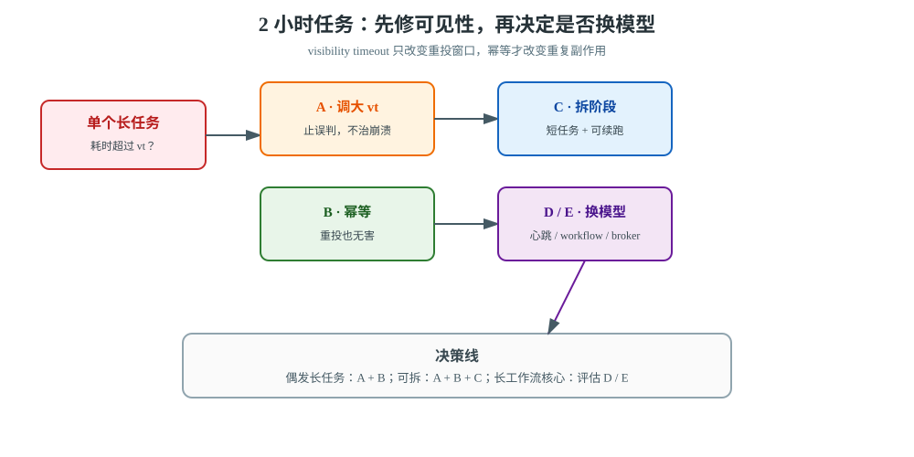
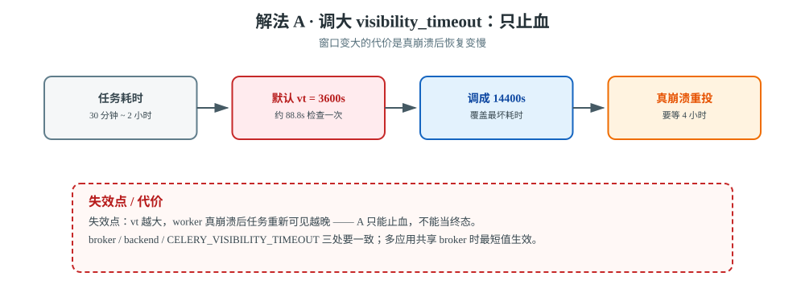
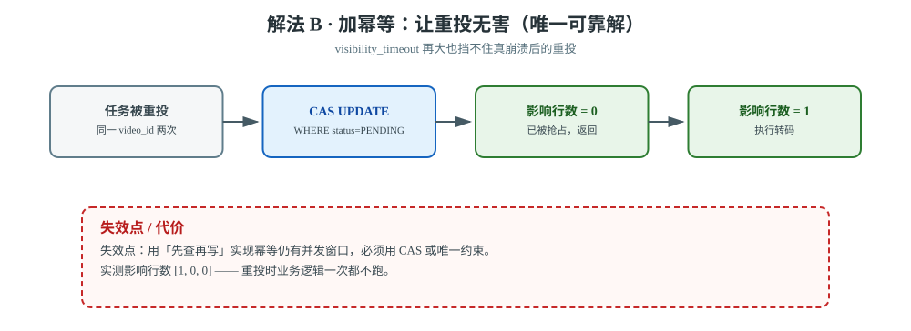
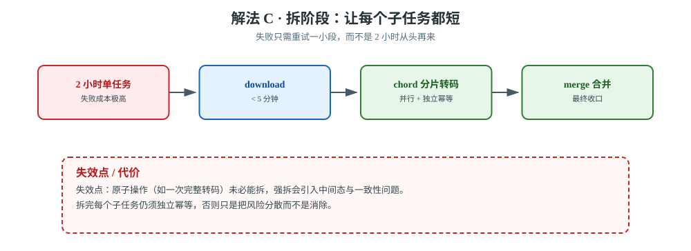
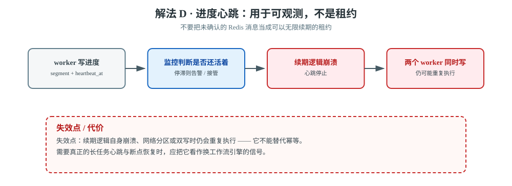
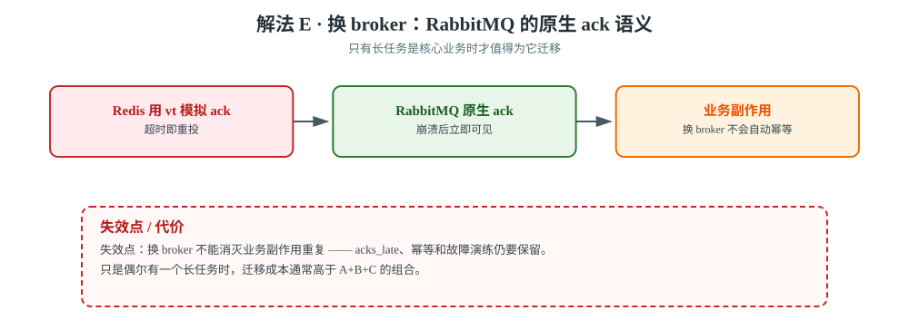

# 场景 3：一个任务要跑 2 小时（经典设计题）

**场景描述**：视频转码任务，单个任务耗时 **30 分钟 ~ 2 小时**（取决于视频大小）。当前 `visibility_timeout` 是默认 3600 秒（1 小时），Redis broker。现象：任务经常被**跑两次**，两个 worker 同时转同一个视频。有人说"把 visibility_timeout 调大到 24 小时就好了"，但你也担心调太大有副作用。

**🔒 先自己想 30 秒**：调大 visibility_timeout 是不是最优解？如果不调，有没有别的办法让任务不被重投？

<details><summary>💡 提示（先搞清楚"重投"的判定机制）</summary>

- 谁决定"这个任务超时了"？（提示：**broker**，不是 Celery）
- 多久检查一次？（提示：【实测】约 **88.8 秒** 一次）
- `visibility_timeout` 调大之后，**真正的 worker 崩溃**会怎样？（任务要等多久才重新可见？）

然后想：除了调超时，能不能让任务**根本不需要那么久**，或者**重投也无害**？

</details>

<details><summary>📖 展开解法</summary>

### 解法一览

| 解法 | 效果（重复执行 / 崩溃恢复速度） | 代价 | 适用边界 |
|------|--------------------------|------|---------|
| **A · 调大 visibility_timeout** | 重复执行：↓ 误判消失 / 恢复速度：**↓↓ 要等满 vt 才重投** | 真崩溃时任务要等很久才重新可见 | 简单，但只能止血 |
| **B · 加幂等，让重投无害** | 重复执行：**变得无害** / 恢复速度：→ 不变 | 要改代码 | **唯一真正可靠的解法** |
| **C · 拆成多阶段短任务** | 重复执行：↓ 影响面变小 / 恢复速度：**↑ 只需重跑一小段** | 编排复杂度上升 | 可拆分的长任务 |
| **D · 进度心跳 + 主动续期** | 重复执行：能**检测**但不阻止 / 恢复速度：↑ 可判断何时接管 | 实现复杂 | 兜底方案 |
| **E · 换 broker（RabbitMQ）** | 重复执行：仍需幂等 / 恢复速度：**↑↑ 崩溃后立即可见** | 引入新组件 | 长任务是核心场景时 |

### 各解法详解



> **读图指引**：A 只改变可见性窗口，B 让重投无害，C 让单次执行变短；只有当长任务成为主业务时，才沿右侧评估心跳、工作流或 broker 迁移。

#### 解法 A · 调大 visibility_timeout（止血，一行配置）



> **读图**：2 小时的耗时撞上默认 3600 秒窗口必然被误判重投；红框提醒把窗口调到 4 小时后，真崩溃也要等 4 小时才重投。

```python
# settings.py
CELERY_BROKER_TRANSPORT_OPTIONS = {'visibility_timeout': 14400}        # 4 小时
CELERY_RESULT_BACKEND_TRANSPORT_OPTIONS = {'visibility_timeout': 14400}
CELERY_VISIBILITY_TIMEOUT = 14400                                    # 三处保持一致
```

> ⚠️ **这是权衡，不是免费的**：
> `visibility_timeout` 越大，**真正的 worker 崩溃**后任务要等越久才重新可见。
> 调到 4 小时意味着：worker 挂了，这个视频要 4 小时后才有人接手。
> **所以 A 只能止血，不能作为终态** —— 终态必须靠 B（幂等）。

【实测】默认 `visibility_timeout = 3600 秒`；Redis broker 下 kombu 的重投检查周期实测约 **88.8 秒**，
因此一个跑 2 小时的任务在默认配置下**必然**会被误判重投。

#### 解法 B · 加幂等（治本，推荐）



> **读图**：重投的任务先过 CAS 这道闸门，影响行数为 0 就原路返回；红框提醒用「先查再写」实现幂等仍有竞态。

```python
@app.task
def transcode(video_id):
    # ⭐ CAS：把状态从 PENDING 改成 RUNNING，靠影响行数判断是否抢到
    updated = Video.objects.filter(id=video_id, status='PENDING').update(status='RUNNING')
    if updated == 0:
        return '已在转码或已完成，跳过'     # 重投直接无害
    try:
        do_transcode(video_id)
        Video.objects.filter(id=video_id).update(status='DONE')
    except Exception:
        Video.objects.filter(id=video_id).update(status='FAILED')
        raise
```

**这是唯一真正可靠的解法**——因为 visibility_timeout 再大，也挡不住 worker 真崩溃后的重投。

【实测】本项目关单任务连续执行 3 次 → 影响行数 `[1, 0, 0]`，库存只回滚 1 次。

#### 解法 C · 拆阶段（架构优化）



> **读图**：一个 2 小时的任务被切成下载、分片转码与合并三段；红框提醒原子操作强拆会引入中间态与一致性问题。

```python
# 2 小时 → 拆成：下载 → 分片转码 → 合并
# 每个子任务 < 5 分钟，各自独立幂等，失败只需重试一小段
job = chain(
    download.s(video_id),
    chord([transcode_segment.s(video_id, i) for i in range(n)])(merge.s(video_id)),
)
```

> ⚠️ Redis 官方文档要求 broker、result backend 和 Celery 全局的 visibility timeout 一起设置；多个应用共享 broker 时，最短值会生效。示例只展示 4 小时止血值，不能脱离最长 ETA / 任务耗时直接复制。

#### 解法 D · 进度心跳与主动续期（只作兜底，不是首选）



> **读图**：心跳只提供「还在动」的观测信号；红框处续期逻辑自身崩溃或两个 worker 同时写进度时，重复执行照样发生。

如果转码工具能报告进度，可以把 `last_heartbeat_at`、当前分片和输出文件写入数据库或 Redis，监控据此判断“任务真的在动”。但不要把一个未确认的 Redis 消息当成可以无限续期的租约：续期逻辑自身崩溃、网络分区或两个 worker 同时写进度时，仍可能重复执行。

```python
@app.task(bind=True, acks_late=True)
def transcode_with_heartbeat(self, video_id):
    for segment in segments(video_id):
        VideoProgress.objects.update_or_create(
            video_id=video_id,
            defaults={'segment': segment.number, 'heartbeat_at': now()},
        )
        transcode_segment(video_id, segment.number)
```

D 的价值是**可观测和恢复判断**，不是替代幂等；若要实现真正的长工作流心跳、租约和断点恢复，应把它当作换系统的信号。

#### 解法 E · 换 broker（RabbitMQ 作为长任务边界的调整）



> **读图**：从 Redis 用超时模拟 ack，换到 RabbitMQ 的原生确认；红框提醒换 broker 不会自动带来业务幂等。

RabbitMQ 的消费确认与连接存活语义更贴近“消息在 broker 等待确认”的模型，适合长任务是核心业务且团队已经具备 RabbitMQ 运维能力的场景。迁移后仍要保留 `acks_late`、幂等和故障演练；换 broker 不能消灭业务副作用重复。

```python
# 仅示意连接地址；凭据由运行环境注入
CELERY_BROKER_URL = 'amqp://<USER>:<PASSWORD>@rabbitmq/<VHOST>'
CELERY_TASK_ACKS_LATE = True
CELERY_TASK_REJECT_ON_WORKER_LOST = True
```

如果只是偶尔有一个长任务，E 的迁移成本通常高于 A+B+C 的组合；如果大量任务都长于 Redis visibility timeout，才值得把 broker 作为架构决策重新评估。

### 非本栈替代路线（什么时候别用 Celery）

| 诉求 | Celery 的边界 | 该用什么 |
|------|--------------|---------|
| **长任务是核心业务**（如视频转码平台） | Celery 的可见性超时模型天生不适合超长任务 | **专业工作流引擎**：Airflow / Temporal / Argo Workflows（原生支持长任务心跳与断点续跑） |
| **需要可靠的长任务心跳** | 要自己实现心跳 + 续期（解法 D，复杂） | **Temporal**：内置 heartbeat 与超时重试，长任务是一等公民 |
| **转码本身该谁做** | worker 上跑 ffmpeg，占满 CPU 影响其他任务 | **专用转码服务 / 云转码**（阿里云 MPS、AWS MediaConvert），Celery 只发任务 + 轮询回调 |
| **需要真正的 ack 语义** | Redis 用 visibility_timeout 模拟 | **RabbitMQ** 有原生 ack + 心跳，崩溃后立刻可见 |

> 💡 判断线：**长任务只是边缘场景 → 留在 Celery 加幂等；长任务是核心业务 → 上工作流引擎**。

### 推荐路径（递进）

1. **第一步（立刻止血）**：解法 A —— 把 `visibility_timeout` 调到覆盖最坏耗时。一行配置。
2. **第二步（治本，必做）**：解法 B —— 加幂等。**这是唯一可靠的解法**。
3. **第三步（架构优化）**：解法 C —— 拆阶段，让每个子任务都短且独立幂等。

### 效果对比：怎么验证这一步真的有效

| 维度 | 怎么看 | 期望变化 |
|------|--------|---------|
| **重复执行次数** | 给任务加执行计数（`Video.objects.filter(...).update(status='RUNNING')` 的影响行数） | 重投时影响行数为 **0**，业务逻辑一次都不跑 |
| **重投等待时间** | 手动 kill -9 worker，记录任务重新可见的时间 | 约等于 visibility_timeout（调大后变长，这是**已知代价**） |
| **最坏耗时覆盖** | 统计历史 P100 耗时 | `visibility_timeout` **> P100 × 1.5**，留余量 |

> ⚠️ 第二个维度是**反向指标**：调大 visibility_timeout 后它会变差。所以必须同时看第一个维度——
> **A 让重复执行变少，但让真崩溃的恢复变慢**；只有 B 能同时改善两者。

### 知识点挂钩

| 解法 | 回指课程 |
|------|---------|
| A · visibility_timeout | 课 5《确认机制与重试策略》· ack 时机与可见性超时 |
| B · 幂等 | 课 5 · 幂等性设计；本项目[决策 3](../projects/电商订单履约系统/设计决策.md) |
| C · 拆分编排 | 课 8《canvas 任务编排》· chain / chord |
| E · 换 broker | 课 3《第一个 Celery + Django 项目》· Broker 选型 |
| D · 心跳与恢复判断 | 课 10《监控、排查与上线清单》· 任务观测 |

### 证据与核查

| 解法 | 依据 | 核查边界 |
|------|------|---------|
| A | 【官方】[Celery Redis transport：visibility timeout](https://docs.celeryq.dev/en/stable/getting-started/backends-and-brokers/redis.html)；【实测】本课程默认 3600 秒、检查间隔约 88.8 秒 | `CELERY_VISIBILITY_TIMEOUT`、broker 与 backend transport options 要保持一致 |
| B | 【官方】[Celery tasks：acks_late 与幂等](https://docs.celeryq.dev/en/stable/userguide/tasks.html)；【实测】本课程 CAS 影响行数 `[1, 0, 0]` | 幂等是业务实现，不是 ack 开关自动提供 |
| C | 【官方】[Celery Canvas](https://docs.celeryq.dev/en/stable/userguide/canvas.html) | 拆分后的每个子任务仍须独立幂等和可恢复 |
| D | 【公认】进度心跳 / 外部状态账本 | 不把自定义续期实现误写成 Celery broker 保证 |
| E | 【官方】[Celery RabbitMQ transport](https://docs.celeryq.dev/en/stable/getting-started/backends-and-brokers/rabbitmq.html) | 迁移收益、确认延迟与运维能力必须现场压测 |

### 什么情况下此方案不适用

- **解法 A 单独用**：不够，只止血不治本。
- **解法 E（换 RabbitMQ）**：长任务只是边缘场景时，不值得为它引入新组件。
- **解法 C（拆分）**：转码这种原子操作未必能拆，拆了可能引入中间态问题。

### 做错会踩的坑

- 只调 visibility_timeout 不加幂等 → 崩溃时仍会重复（[故障模式 3](../08-实战经验.md)）。
- 重投 → [故障模式 11（长任务超过检查周期被重投）](../08-实战经验.md)。
- 幂等用"先查再写"（`if not exists: create`）→ 并发下仍有竞态，必须用 CAS 或唯一约束。

</details>

---

➡️ **返回**：[场景解法库索引](INDEX.md) ｜ **上一场景**：[场景 2 数据量翻 100 倍](场景-02-数据量翻100倍.md) ｜ **下一场景**：[场景 4 不重复扣款](场景-04-不重复扣款.md)
