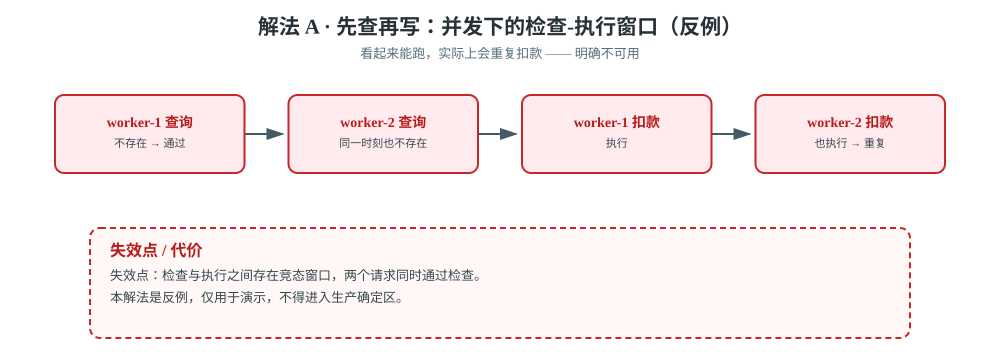
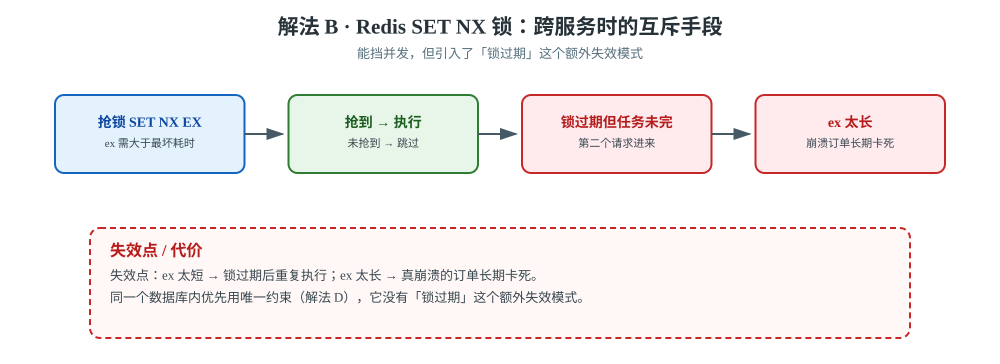
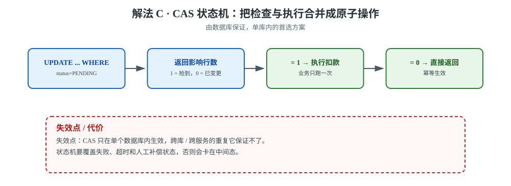
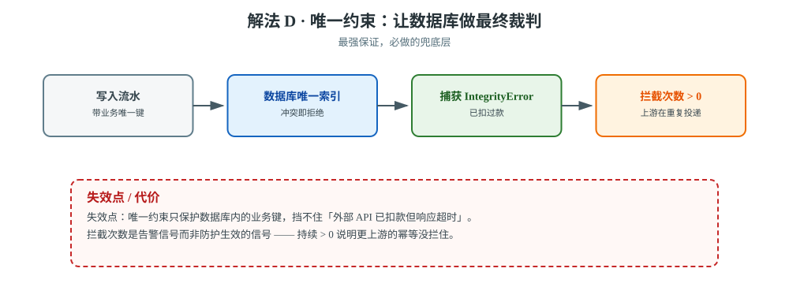
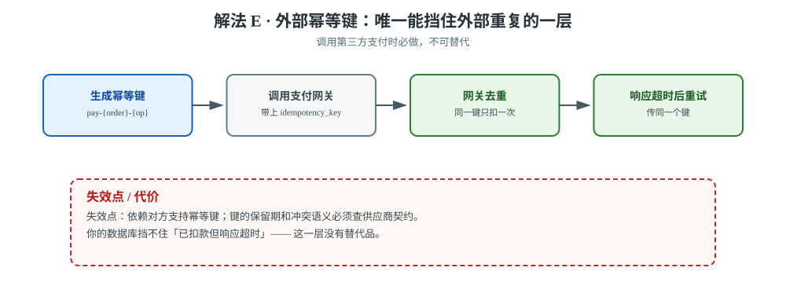

# 场景 4：必须保证不重复扣款（金融级幂等，经典设计题）

**场景描述**：支付回调触发扣款任务。要求：**同一笔订单绝对不能扣两次**。当前已加 `task_acks_late=True`（保证不丢任务），但这也意味着**可能重复投递**。团队里有人说"用 Redis 加锁"，有人说"用数据库唯一约束"，还有人说"先查再写就行"。

**🔒 先自己想 30 秒**："先查再写"（`if not exists: create`）为什么不够？——想清楚**并发下的检查-执行窗口**。

<details><summary>💡 提示（三个层次的保证，强度递增）</summary>

1. **应用层检查**（先查再写）：两个请求同时查到"不存在"，然后都去写——这就是竞态
2. **Redis 分布式锁**：能挡住，但锁本身有可靠性问题（锁过期了任务还没完？）
3. **数据库约束**（唯一索引 / CAS）：**由数据库保证**，最可靠

还有一个维度：**扣款是调用外部 API**，外部 API 本身可能超时但实际成功了——这怎么防？

</details>

<details><summary>📖 展开解法</summary>

### 解法一览

| 解法 | 效果（防并发重复 / 防外部重复） | 代价 | 适用边界 |
|------|--------------------------|------|---------|
| **A · 先查再写** | ❌ 有竞态，不可用 / ❌ | — | 仅限无并发场景（反例） |
| **B · Redis SET NX 锁** | ✅ 挡住并发 / ❌ | 锁需配 `ex`；有锁泄漏风险 | 无 DB 状态字段、跨服务时 |
| **C · CAS 条件更新** | ✅ 挡住并发（数据库保证）/ ❌ | 需要状态字段 | **首选** |
| **D · 数据库唯一约束** | ✅✅ **最强保证** / ❌ | 要加索引 | 必做的兜底 |
| **E · 外部幂等键** | ❌ / ✅ **唯一能挡住"已扣款但响应超时"的一层** | 依赖对方支持 | 调第三方支付时必做 |

### 各解法详解

**场景级总览图**：幂等保证按强度递增分三层——应用层检查、数据库约束、外部幂等键。


> **读图**：越往下保证越强、越靠近"最终裁判"：应用层检查会被并发击穿，数据库约束由引擎强制，外部幂等键是唯一能挡住第三方重复的一层。

#### 解法 A · 先查再写（❌ 反例，明确不可用）



> **读图**：两个 worker 在「检查」与「执行」之间的窗口里同时通过；整张图就是反例，红框即竞态本身。

```python
# ❌ 错：检查与执行之间有窗口
if not Charge.objects.filter(order_id=order_id).exists():
    call_charge_api(order_id, amount)      # 两个 worker 同时通过检查
    Charge.objects.create(order_id=order_id, amount=amount)
```

并发下两个 worker 都查到"不存在"，然后都去扣款。**不要因为"看起来能跑"就上线。**

#### 解法 B · Redis 锁（定位：跨服务场景）



> **读图**：抢到锁才执行；红框是锁的两个极端——`ex` 太短会重复执行，`ex` 太长会让崩溃的订单长期卡死。

```python
# 抢锁才执行；ex 必须 > 任务最坏耗时
locked = r.set(f'lock:charge:{order_id}', '1', nx=True, ex=300)
if not locked:
    return '抢锁失败，跳过'
```

> ⚠️ 锁的 `ex` 必须大于任务最坏耗时，否则锁过期后第二个请求进来；
> 而设太长又会让真崩溃的订单长期卡死（[故障模式 4（锁死锁）](../08-实战经验.md)）。
> **如果已经在一个数据库里，优先用 D（唯一约束）**——它没有"锁过期"这个额外的失效模式。

#### 解法 C · CAS 状态机（首选）



> **读图**：检查与执行被合并成一条 `UPDATE`，靠影响行数分流；红框提醒它只在单个数据库内成立。

```python
# ⭐ 用 UPDATE 的影响行数判断是否抢到，把"检查+执行"合并成一个原子操作
updated = Order.objects.filter(id=order_id, status='PENDING').update(status='CHARGING')
if updated == 0:
    return '状态已变更，跳过（幂等生效）'
```

【实测】本项目关单任务连续执行 3 次 → 影响行数 `[1, 0, 0]`，库存只回滚 1 次。

#### 解法 D · 唯一约束兜底（最强）



> **读图**：唯一索引让数据库在冲突时直接拒绝写入；红框是「拦截次数 > 0」这个告警信号——它说明更上游的幂等没拦住。

CAS 能挡住并发，但挡不住"同一个订单被不同业务路径处理"。给流水表加唯一索引，让数据库做最终裁判：

```python
try:
    with transaction.atomic():
        Charge.objects.create(order_id=order_id, amount=amount, type='PAY')
except IntegrityError:
    return '已扣过款（唯一约束拦截）'
```

#### 解法 E · 外部幂等键（这一层最关键）



> **读图**：同一个幂等键随每次重试一起发给网关；红框提醒你的数据库挡不住「已扣款但响应超时」。

**你的数据库挡不住这种情况**：请求发到支付网关、网关扣款成功、但响应超时了——你不知道到底成功没有。

```python
# 用订单号派生幂等键，保证重试时传的是同一个键
idempotency_key = f'pay-{order_id}-{op_type}'
resp = pay_client.charge(order_id, amount, idempotency_key=idempotency_key)
```

### 非本栈替代路线（什么时候别在任务里做幂等）

| 诉求 | Celery 侧的边界 | 该用什么 |
|------|----------------|---------|
| **跨多个微服务的幂等** | 各服务各有自己的库，CAS 只能在单库内生效 | **分布式事务框架**（Seata / DTM）或**事务性发件箱（outbox）** |
| **需要 exactly-once** | Celery 只有 at-least-once，设计上不做 exactly-once | 用**业务幂等**近似；或换带幂等原语的引擎（Temporal） |
| **对账补偿** | 幂等只能防"重复做"，防不住"该做的没做" | **定时对账任务**（见[场景 6](场景-06-定时不重不漏.md)）做最终一致性 |
| **扣款这种核心资金操作** | 异步任务里做资金操作，重试语义复杂 | **同步调用 + 明确结果**，或改为"先落单据 → 异步推进状态机" |

> 💡 最后一条最值得想：**资金操作最好别放在"可能被重投的异步任务"里做主体逻辑**。
> 更稳的形态是：同步创建扣款单（数据库唯一约束保证不重复）→ 异步任务只负责**推进状态机**和**查询结果**。

### 推荐路径（递进）

1. **第一步（基础）**：解法 C —— CAS 状态机，挡住并发重复。
2. **第二步（加强）**：解法 D —— 唯一约束兜底，让数据库做最终裁判。
3. **第三步（外部调用）**：解法 E —— 调第三方支付**必须**传幂等键。这一层不可替代。

### 效果对比：怎么验证这一步真的有效

| 维度 | 怎么看 | 期望变化 |
|------|--------|---------|
| **并发下的影响行数** | 同时投 N 个相同任务，记录 CAS 的 `updated` 返回值 | `[1, 0, 0, ...]`——只有第一个是 1 |
| **资金流水条数** | `SELECT count(*) FROM charge WHERE order_id=?` | **恒为 1**，无论任务重投几次 |
| **唯一约束拦截次数** | 捕获 `IntegrityError` 并计数告警 | 生产上**应该接近 0**；持续 > 0 说明上游在重复投递，要查根因 |

> ⚠️ 第三个维度是**告警信号**而非"防护生效"的信号——唯一约束在拦，说明更上游的幂等（CAS/幂等键）没拦住。

【实测】本项目第二维度实测：关单任务执行 3 次，库存回滚记录数 = 1。

### 知识点挂钩

| 解法 | 回指课程 |
|------|---------|
| C · CAS | 课 5《确认机制与重试策略》· 幂等性设计；本项目[决策 3](../projects/电商订单履约系统/设计决策.md) |
| B · Redis 锁 | 课 5 · 幂等；[故障模式 4（锁死锁）](../08-实战经验.md) |
| D · 唯一约束 | 课 6《Django 事务与 ORM 的坑》 |
| E · 外部幂等键 | 课 5 · 重试策略（外部调用） |

### 证据与核查

| 解法 | 依据 | 核查边界 |
|------|------|---------|
| A | 【反例】并发检查与写入之间存在竞态；【公认】不要把"先查再写"当幂等保证 | 仅可用于无并发、无副作用的演示，不进入生产确定区 |
| B | 【公认】Redis `SET NX EX` 是跨服务协调手段 | 锁过期、主从切换和业务耗时必须现场演练；不能替代数据库约束 |
| C | 【公认】数据库条件更新 / CAS；【实测】本课程重复执行影响行数 `[1, 0, 0]` | 状态转移需覆盖失败、超时和人工补偿状态 |
| D | 【官方】[Django constraints](https://docs.djangoproject.com/en/stable/ref/models/constraints/) | 唯一约束只保护数据库内的业务键，不能替代第三方幂等键 |
| E | 【公认】第三方 API 幂等键与结果查询 | 是否支持、键保留期和冲突语义必须查供应商契约 |

### 什么情况下此方案不适用

- **解法 A（先查再写）**：并发场景下**直接不可用**。
- **解法 B（Redis 锁）**：`ex` 设太短会失效，设太长会让崩溃的订单长期卡死。
- **任何解法**：都挡不住"外部 API 扣款成功但响应超时"，必须靠 E。

### 做错会踩的坑

- 用 A → [故障模式 3（重复执行导致重复扣款）](../08-实战经验.md)。
- 用 B 忘设 `ex` → [故障模式 4（幂等锁变成永久死锁）](../08-实战经验.md)。
- 只在 Celery 层做幂等，忘了数据库层兜底 → 换个入口（管理后台手动触发）就绕过了。

</details>

---

➡️ **返回**：[场景解法库索引](INDEX.md) ｜ **上一场景**：[场景 3 一个任务跑 2 小时](场景-03-一个任务跑2小时.md) ｜ **下一场景**：[场景 5 部署不丢任务](场景-05-部署不丢任务.md)
