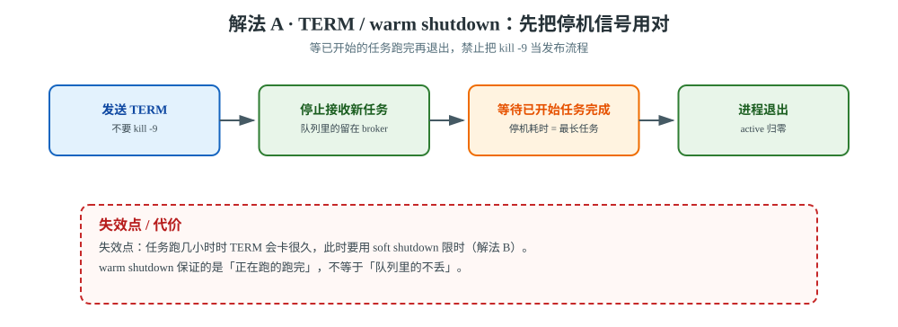
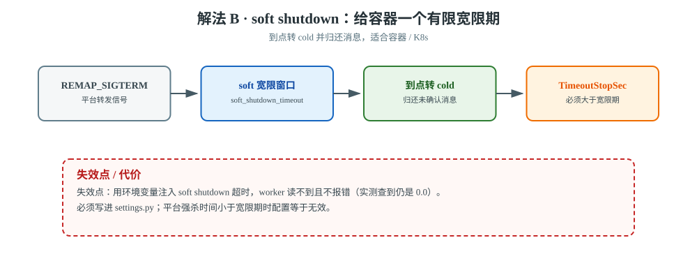
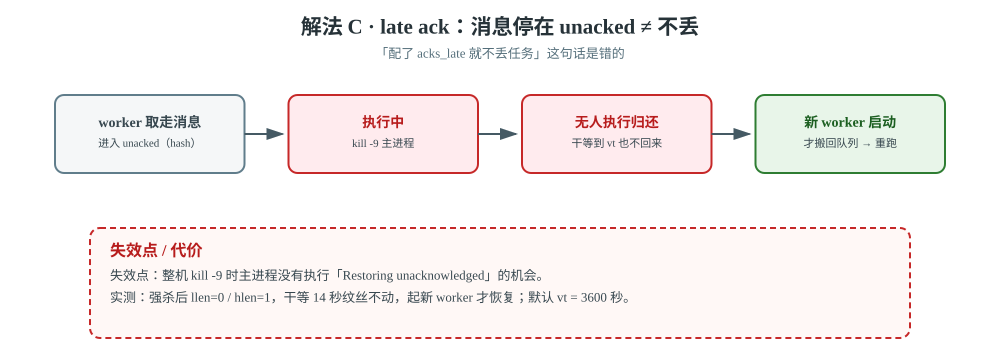
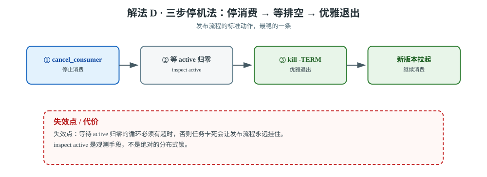
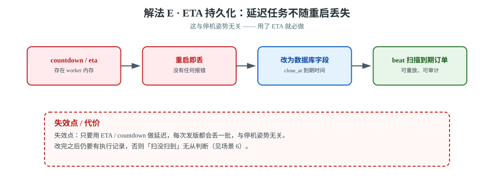

# 场景 5：部署时不能丢任务（滚动发布，经典设计题）

**场景描述**：每次发版要重启 worker。当前做法是 `kill -9` 然后拉起。现象：发版后**总有零星任务丢失**，用户投诉"我提交的单子没处理"。要求：发版时**一个任务都不丢**，且尽量不影响正在处理的任务。

**🔒 先自己想 30 秒**：`kill -9` 和 `kill -15`（TERM）在 Celery 里行为差别很大。先想清楚：**正在执行的任务**和**还在队列里没开始的任务**，分别会怎样？

<details><summary>💡 提示</summary>

- Celery 的停机有四档语义：Warm / Soft / Cold / Hard。`TERM` 是哪种？`QUIT` 是哪种？
- "优雅停机"保证的是**正在跑的任务跑完**，还是**队列里的任务不丢**？
- 如果配了 `task_acks_late=True`，正在跑但没 ack 的任务会怎样？
- **ETA/countdown 任务存在哪里？重启会丢吗？**

</details>

<details><summary>📖 展开解法</summary>

### 解法一览

| 解法 | 效果（防丢 / 停机耗时） | 代价 | 适用边界 |
|------|-------------------|------|---------|
| **A · 用 TERM（warm shutdown）** | 防丢：正在跑的任务跑完 / 停机耗时：**= 最长任务耗时** | 停机时间不可控 | **必做** |
| **B · 配 soft shutdown（5.5+）** | 防丢：限时归还消息 / 停机耗时：**有明确上界** | 要配超时值 | 长任务 / 容器场景 |
| **C · `task_acks_late=True`** | 防丢：消息在 broker 有留存（停在 `unacked`）/ 停机耗时：不影响 | 可能重复执行（要幂等） | **必做**（但见下方澄清） |
| **D · 停止消费 → 等空 → 停机** | 防丢：**最稳**，队列里的安全留在 broker / 停机耗时：流程变长 | 停机流程变长 | 推荐的标准流程 |
| **E · ETA 任务改持久化** | 防丢：延迟任务不再随重启丢失 / 停机耗时：不影响 | 要改代码 | 用了 ETA 时**必做** |

### 🔴 先澄清一个流传很广的误解

**"配了 `task_acks_late=True` 就不会丢任务" —— 这句话是错的。**

【实测】本机 12 秒长任务，配齐 `acks_late` + `reject_on_worker_lost` + soft shutdown，在第 3 秒 `kill -9` 主进程：

```
被杀时进度: 3/12 秒
broker celery 队列剩余: 0        ← 任务没回到队列
unacked（hash）: 1               ← 它停在这里
```

**原因**：`acks_late` 只保证"broker 里还留了一份"（所以它在 `unacked` 里），
但**把消息还回队列**这个动作（`Restoring N unacknowledged message(s)`）由**主进程在退出时执行**——
而 `kill -9` 恰恰不给主进程执行的机会。


> **读图**：消息被取走后停在 `unacked`（注意是 hash 不是 list），强杀主进程后没人执行归还动作；只有新 worker 存活，它才会被搬回队列重跑。

**那任务什么时候回来？** 继续实测（把 `visibility_timeout` 调到 10 秒）：

```
[1] 运行中：        队列=0  unacked=1
[3] 强杀后（进度 4/20）：队列=0  unacked=1
[4] 干等 14 秒（vt 已到期，但无 worker 存活）：队列=0  unacked=1   ← 自己不会回来
[5] 启动新 worker： 队列=1  unacked=0                              ← 回来了！
[7] 任务最终进度: 20/20   状态: SUCCESS
```

> 🎯 **两个关键结论**：
> 1. 强杀后消息停泊在 `unacked`，**干等没用**——必须有 worker 存活（新起的也算）才会被搬回队列。
> 2. 默认 `visibility_timeout = 3600 秒`。所以"发版丢任务"对用户来说就是**消失 1 小时**。

**`reject_on_worker_lost` 也救不了整机强杀**——它管的是"**子进程**崩了但主进程还活着"：

```
[ERROR/MainProcess] Task handler raised error: WorkerLostError(
    'Worker exited prematurely: signal 9 (SIGKILL) Job: 0.')
```
【实测】只 kill 子进程：主进程拉起新子进程，任务重跑，最终 12/12 完成。
但整个 worker 被 `kill -9` 时，这个机制同样没有执行机会。

完整实测过程见 [应用实战 · 09 生产部署与并发模型](../应用实战/09-生产部署与并发模型.md)。

### 各解法详解

#### 解法 A · TERM / warm shutdown（先把停机信号用对）



> **读图**：TERM 让 worker 停止接收新任务并等已开始任务跑完；红框提醒任务跑几小时时，停机也会卡几小时。

TERM 的 warm shutdown 会停止接收新任务，并等待已开始任务完成；它不能替代消息确认、幂等和队列排空。生产停机一律使用 TERM，禁止把 `kill -9` 当发布流程。

#### 解法 B · soft shutdown（给容器一个有限宽限期）



> **读图**：TERM 先进入有限宽限窗口，到点转 cold 并归还消息；红框提醒用环境变量注入会静默失效（`inspect conf` 查到 `0.0`）。

soft shutdown 在 warm 与 cold 之间增加有限时长的收尾窗口。适合容器 / K8s，但超时值必须小于平台真正的强杀时间，并且要用 `inspect conf` 验证配置已被 worker 读到。

```python
# settings.py —— Celery 5.5+
CELERY_WORKER_SOFT_SHUTDOWN_TIMEOUT = 15.0
CELERY_WORKER_ENABLE_SOFT_SHUTDOWN_ON_IDLE = True
```

```ini
# systemd
[Service]
Environment="REMAP_SIGTERM=SIGQUIT"
TimeoutStopSec=30          # 必须 > soft shutdown timeout
```

#### 解法 C · late ack + lost-worker 重投（把重复当作必然）



> **读图**：消息从队列进入 `unacked` 停泊，强杀主进程后没人执行归还；红框提醒必须有新 worker 存活，它才会被搬回队列重跑。

```python
# settings.py —— ⭐ 实测确认：写进 settings 才稳定生效
CELERY_TASK_ACKS_LATE = True
CELERY_TASK_REJECT_ON_WORKER_LOST = True
CELERY_WORKER_PREFETCH_MULTIPLIER = 1               # 长任务场景：公平分发
```

> ⚠️ **实测踩过的坑**：用环境变量注入 `CELERY_WORKER_SOFT_SHUTDOWN_TIMEOUT=15`，**worker 读不到**，
> 实测查到的仍是 `0.0`（功能没启用），且**日志中没有任何报错**——静默失效，极难察觉。
> 必须写进 `settings.py` / `celeryconfig.py`。C 只让未确认消息在 broker 中有机会重投，**不保证不重复**，必须配合场景 4 的幂等。

#### 解法 D · 三步停机法（推荐的标准流程）



> **读图**：先停消费、再等 `active` 归零、最后 TERM；红框提醒等待归零的循环没有超时，会把发布流程永久挂住。

```bash
# ① 停止消费新任务（队列里的会安全留在 broker）
celery -A proj control cancel_consumer <queue>
# ② 等正在跑的任务结束
while [ "$(celery -A proj inspect active | grep -c task_name)" -gt 0 ]; do sleep 2; done
# ③ 优雅退出
kill -TERM <worker_pid>
```

#### 解法 E · ETA 任务（最容易漏的一点）



> **读图**：延迟任务从 worker 内存搬到数据库字段，由 beat 扫描；红框提醒只要还在用 `countdown`，每次发版都会丢一批。

【官方】ETA/countdown 任务存在 **worker 内存**里，**重启即丢**。
如果你用 `countdown` 做延迟关单，每次发版都会丢一批——**这与停机姿势无关**。

```python
# ❌ 重启即丢
close_order.apply_async(args=[order_id], countdown=1800)

# ✅ 改数据库持久化 + 轮询（本项目决策 2 正是这么选的）
Order.objects.filter(id=order_id).update(close_at=now() + timedelta(minutes=30))
# 由 beat 周期性扫描 close_at <= now() 的订单
```

### 非本栈替代路线（什么时候别靠"优雅停机"兜底）

| 诉求 | Celery 侧的边界 | 该用什么 |
|------|----------------|---------|
| **绝对不能丢的延迟任务** | ETA 在 worker 内存，重启即丢 | 数据库持久化 + beat 轮询（解法 E）；或 **K8s CronJob** 调度 |
| **需要跨发版的任务编排** | worker 重启会打断正在跑的编排 | **Temporal / Argo Workflows**：状态持久化在服务端，worker 重启后继续执行 |
| **任务需要秒级精度** | beat 精度有限 + ETA 易丢 | **专业调度器**（Airflow / XXL-JOB） |
| **发版不允许停机** | 再优雅的停机也有窗口 | **蓝绿部署 / 滚动更新**：新版本 worker 先起，再逐步摘掉旧的 |

### 推荐路径（递进）

1. **第一步（配置层，必做）**：A + C —— `acks_late` + `reject_on_worker_lost`，停机一律用 `TERM`。
2. **第二步（流程层）**：D —— 三步停机法（cancel_consumer → 等空 → TERM）。
3. **第三步（长任务 / 容器）**：B —— `REMAP_SIGTERM` + soft shutdown，并确认 `TimeoutStopSec` 更大。
4. **第四步（用了 ETA 时必做）**：E —— 延迟任务改数据库持久化。

### 效果对比：怎么验证这一步真的有效

| 维度 | 怎么看 | 期望变化 |
|------|--------|---------|
| **`unacked` 残留** | 停机前后各查一次 `redis-cli -n 0 hlen unacked`（**注意是 hash 不是 list**） | 优雅停机后从 1 → **0** |
| **任务终态** | `AsyncResult(task_id).state` | 优雅停机 → `SUCCESS`；强杀 → 长时间 `STARTED` |
| **重投等待时间** | kill -9 后到任务被重新消费的时间 | 约等于 `visibility_timeout`（建议调到 10~30 分钟而非默认 1 小时） |

> ⚠️ 第一个维度是最直接的"有没有丢"判据，且**只看 `llen` 队列会误判**——强杀后队列长度就是 0，但任务冻在 `unacked` 里。

【实测】对照组：同样条件下 `kill -TERM`，任务跑完 6/6，停机后 `unacked` 与 `unacked_index` **全被清空**。

### 知识点挂钩

| 解法 | 回指课程 |
|------|---------|
| A/B · 停机语义 | 课 9《生产部署与并发模型》· 进程管理与优雅停机 |
| C · acks_late | 课 5《确认机制与重试策略》· ack 时机 |
| D · 三步停机法 | 课 9 · 消费者控制、队列排空与优雅退出 |
| E · ETA 持久化 | 课 4《调用任务与取回结果》· countdown/eta；本项目[决策 2](../projects/电商订单履约系统/设计决策.md) |

### 证据与核查

| 解法 | 依据 | 核查边界 |
|------|------|---------|
| A | 【官方】[Celery worker shutdown](https://docs.celeryq.dev/en/stable/userguide/workers.html#stopping-the-worker)；【实测】TERM 对照任务 6/6 完成 | 平台 grace period 必须覆盖真实最长任务或允许重投 |
| B | 【官方】[Celery Redis transport：soft shutdown](https://docs.celeryq.dev/en/stable/getting-started/backends-and-brokers/redis.html) | Celery 5.5+；平台强杀时间小于宽限期时配置无效 |
| C | 【官方】[Celery tasks：acks_late / reject_on_worker_lost](https://docs.celeryq.dev/en/stable/userguide/tasks.html)；【实测】整机 `kill -9` 后消息停在 unacked | `reject_on_worker_lost` 主要覆盖子进程丢失，整机强杀仍受 broker 语义影响 |
| D | 【官方】[Celery routing / worker `-Q`](https://docs.celeryq.dev/en/stable/userguide/routing.html)；【公认】先停消费再排空 | `inspect active` 是观测，不是绝对的分布式锁 |
| E | 【官方】[Celery Redis transport：ETA / countdown caveats](https://docs.celeryq.dev/en/stable/getting-started/backends-and-brokers/redis.html) | 长期延迟任务改数据库持久化，不把 worker 内存当调度存储 |

### 什么情况下此方案不适用

- **解法 A**：任务跑几小时时，TERM 会卡很久——此时要用 B（soft shutdown 限时）。
- **`task_acks_late=True`**：必须**同时**有幂等，否则崩溃重投造成重复扣款（回到[场景 4](场景-04-不重复扣款.md)）。
- **解法 D**：等待 active 归零的循环要有超时，否则任务卡死会导致发布流程永远挂住。

### 做错会踩的坑

- `kill -9` → 正在跑的任务冻结在 `unacked` 1 小时（本场景实测）。
- 配了 `acks_late` 但没幂等 → [故障模式 3（重复执行）](../08-实战经验.md)。
- 用环境变量注入 soft shutdown 超时 → 静默失效，`inspect conf` 查到 `0.0`。
- 忘记 `TimeoutStopSec` 要大于 soft shutdown 超时 → 宽限期没走完就被强杀。

</details>

---

➡️ **返回**：[场景解法库索引](INDEX.md) ｜ **上一场景**：[场景 4 不重复扣款](场景-04-不重复扣款.md) ｜ **下一场景**：[场景 6 定时不重不漏](场景-06-定时不重不漏.md)
