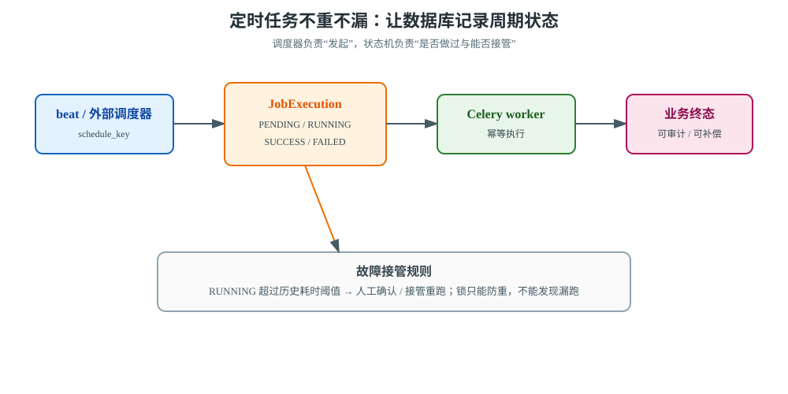
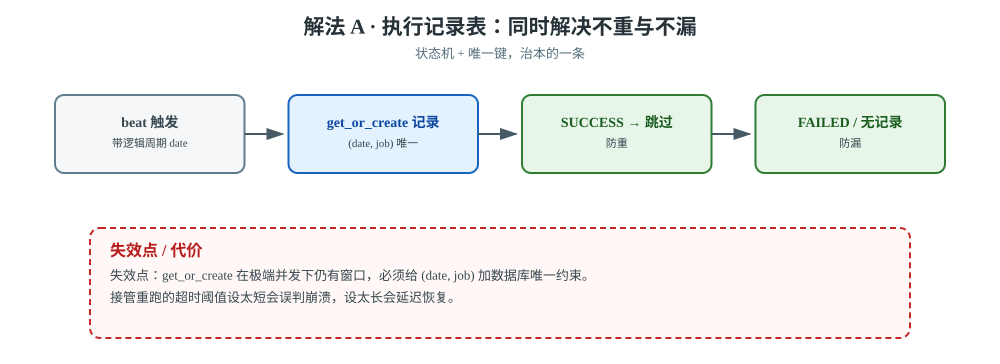
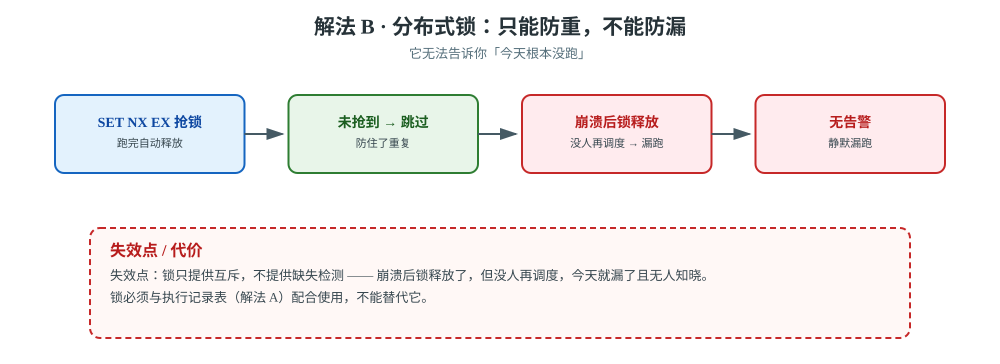
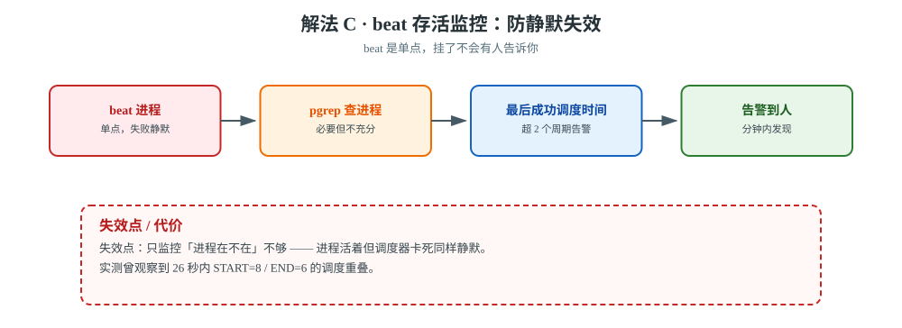
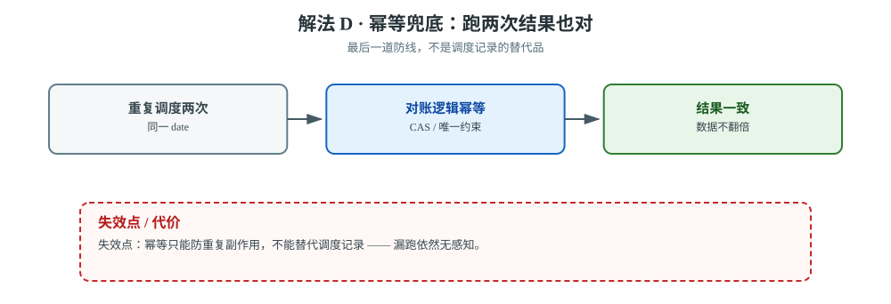
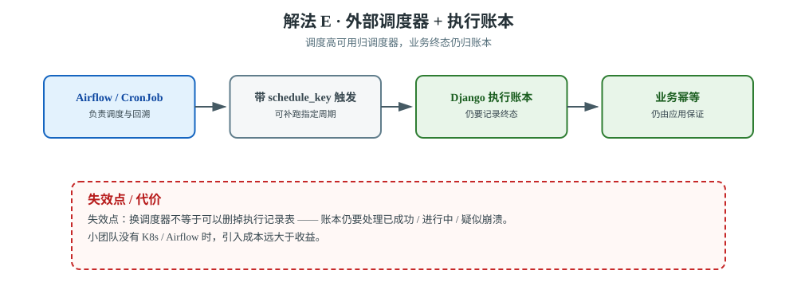

# 场景 6：定时任务必须不重不漏（对账/结算，经典设计题）

**场景描述**：每天凌晨 2 点跑全量对账，要求：**必须跑，且只能跑一次**。当前现象：有时跑到一半机器重启了，第二天才发现**对账没跑**（漏了）；有时**跑了两遍**，数据翻倍。

**🔒 先自己想 30 秒**："不重"和"不漏"是两个**相反方向**的需求——防漏要重试（可能导致重），防重要加锁（锁住崩溃的那个就漏了）。先想清楚：**你怎么知道一个周期任务是"成功了"还是"根本没跑"？**

<details><summary>💡 提示（核心矛盾：缺少执行记录）</summary>

- 谁来判断"今天跑过了没"？（提示：不能依赖 beat 的内存状态，它重启就没了）
- 任务跑一半崩溃，状态该是什么？（提示：需要"进行中"这个中间态）
- 崩溃后重启，看到"进行中"该怎么处理？

另外：**beat 自己挂了是静默的** —— 没人会告诉你"今天没调度"。

</details>

<details><summary>📖 展开解法</summary>

### 解法一览

| 解法 | 效果（防重 / 防漏） | 代价 | 适用边界 |
|------|----------------|------|---------|
| **A · 执行记录表（状态机）** | ✅ 状态机防重 / ✅ **无记录即发现漏跑** | 要建表 | **必做，治本** |
| **B · 分布式锁防重** | ✅ 挡住短窗口内并发 / ❌ **无法发现"根本没跑"** | 锁过期判定复杂 | 配合 A 使用，不能替代 |
| **C · beat 存活监控** | → 不防重 / ✅ 发现"根本没调度" | 要配监控 | **必做**（防静默失效） |
| **D · 幂等 + 可重跑** | ✅ 跑了两次结果也对 / ❌ 漏跑仍无感知 | 要改业务逻辑 | 最省心的兜底 |
| **E · 外部调度器** | ✅ 调度侧高可用 / ❌（漏不漏仍由执行账本判定） | 引入新组件 | 有基建时 |

### 各解法详解



> **读图指引**：调度器只负责产生 `schedule_key`，`JobExecution` 才记录是否成功、是否进行中以及能否接管；不要把 beat 的内存状态当最终事实。

#### 解法 A · 执行记录表（治本）



> **读图**：beat 只负责触发，`JobExecution` 才记录终态；红框提醒 `get_or_create` 之外还要有唯一约束兜底。

```python
@app.task
def daily_reconcile(date):
    rec, created = JobExecution.objects.get_or_create(
        date=date, job='reconcile',
        defaults={'status': 'RUNNING'},
    )
    if not created:
        if rec.status == 'SUCCESS':
            return '今天已成功，跳过'          # 防重
        if rec.status == 'RUNNING':
            # 进行中：判断是不是崩溃残留（如 updated_at 超过 2 小时）
            if rec.updated_at < now() - timedelta(hours=2):
                rec.status = 'RUNNING'        # 判定为崩溃，接管重跑
                rec.save()
            else:
                return '上一轮还在跑，跳过'    # 防重
    try:
        do_reconcile(date)
        rec.status = 'SUCCESS'
        rec.save()
    except Exception:
        rec.status = 'FAILED'
        rec.save()
        raise                                  # 让告警能触发
```

这张表同时解决"不重"（SUCCESS 就跳过）和"不漏"（能看到 FAILED / PENDING）。

#### 解法 B · 分布式锁（只能防重，不能防漏）



> **读图**：锁挡住了重复，却在崩溃后留下无人再调度的空档；红框处就是「防得住重、防不住漏」。

```python
locked = r.set(f'job:reconcile:{date}', '1', nx=True, ex=7200)
if not locked:
    return '另一个实例在跑，跳过'
```

> ⚠️ **锁不能替代状态表**：锁能防重，但**锁无法告诉你"今天根本没跑"**。
> 崩溃后锁释放了，但没人再调度，今天就漏了——而且没有任何告警。

#### 解法 C · beat 存活监控（防静默失效，必做）



> **读图**：监控从「进程在不在」升级到「最后成功调度时间」；红框提醒进程活着但调度器卡死同样静默。

【公认】beat 是**单点**且失败静默。至少监控两件事：

```bash
# ① beat 进程在不在
pgrep -f "celery -A proj beat" | wc -l

# ② 最后成功调度时间距今多久（超过 2 个周期就告警）
redis-cli get last_beat_schedule_at
```

> ⚠️ 只监控"进程在不在"不够——进程活着但调度器卡死的情况同样静默。
> 【实测】本项目课 7 实测中发现定时任务重叠：START=8 / END=6，说明有 2 次调度没有正常结束。

#### 解法 D · 幂等兜底



> **读图**：重复调度撞上幂等对账，结果不变；红框提醒幂等补不上「漏跑无感知」这个洞。

让对账逻辑本身幂等（跑两次结果一样），这是最后一道防线。参考[场景 4](场景-04-不重复扣款.md) 的 CAS 与唯一约束。

#### 解法 E · 外部调度器 + 执行账本



> **读图**：外部调度器负责周期与回溯，执行账本仍负责业务终态；红框提醒换调度器不等于可以删掉执行记录表。

如果任务有依赖、补跑、回溯、人工审批或多实例调度需求，可以让 Airflow / DolphinScheduler / K8s CronJob 负责“该周期是否产生”，Django 执行账本仍负责业务幂等与终态审计。换调度器不等于可以删掉执行记录表。

```python
# 外部调度器每次触发都带逻辑周期，而不是只传 now()
daily_reconcile.apply_async(
    kwargs={'schedule_key': 'reconcile:2026-09-17'},
    headers={'scheduler_run_id': '<RUN_ID>'},
    queue='slow',
)
```

外部调度器解决的是调度高可用与回溯体验；数据库状态机仍要处理“已成功、进行中、疑似崩溃、待人工确认”。

### 非本栈替代路线（什么时候别用 beat）

| 诉求 | beat 的边界 | 该用什么 |
|------|------------|---------|
| **调度必须高可用** | beat 是单点，官方也不推荐多实例（会重复调度） | **K8s CronJob**（调度由控制面保证）／ **Airflow**（有 DAG 状态与重试） |
| **需要任务依赖 / 失败重试链** | beat 只管"到点发任务"，没有依赖与回溯 | **Airflow / DolphinScheduler** |
| **需要秒级精度** | beat 精度受 tick 间隔限制，且 ETA 在内存（见[场景 5](场景-05-部署不丢任务.md)） | **XXL-JOB / 数据库轮询 + 精确时间索引** |
| **需要手动补跑 / 回溯** | beat 没有"补跑 3 天前那一轮"的概念 | **Airflow**（backfill）/ 自建执行记录表 + 管理后台触发 |

> 💡 判断线：**只有几个简单的每日任务 → beat + 执行记录表够用；有依赖关系、要回溯、要审计 → 上 Airflow**。

### 推荐路径（递进）

1. **第一步（防漏的基础）**：C —— beat 存活监控。beat 挂了是静默的。
2. **第二步（治本）**：A —— 执行记录表，同时解决不重与不漏。
3. **第三步（兜底）**：D —— 让对账本身幂等。

### 效果对比：怎么验证这一步真的有效

| 维度 | 怎么看 | 期望变化 |
|------|--------|---------|
| **漏跑发现时间** | 模拟 beat 挂掉，记录多久被告警发现 | 从"第二天人工发现" → **分钟内告警** |
| **重复执行次数** | `JobExecution` 表中同一 `date + job` 的记录数 | **恒为 1**（唯一约束 + 状态机双重保证） |
| **崩溃恢复** | 任务跑到一半 kill 掉，看下一轮是否接管 | 超过判定阈值后**自动接管重跑**，状态回到 RUNNING |

> ⚠️ 第二个维度建议直接给 `(date, job)` 加数据库唯一约束——状态机的 `get_or_create` 在极端并发下仍有窗口，
> 让数据库做最终裁判（同[场景 4](场景-04-不重复扣款.md) 的解法 D）。

### 知识点挂钩

| 解法 | 回指课程 |
|------|---------|
| A · 状态机 | 课 5《确认机制与重试策略》· 幂等；本项目[决策 2/3](../projects/电商订单履约系统/设计决策.md) |
| B · 分布式锁 | 课 5 · 幂等；[故障模式 7（定时器重叠）](../08-实战经验.md) |
| C · beat 监控 | 课 7《beat 与周期性任务》· 定时任务的可靠性 |
| E · 外部调度 | 课 7 · beat 单点问题 |

### 证据与核查

| 解法 | 依据 | 核查边界 |
|------|------|---------|
| A | 【公认】数据库执行账本 + 唯一键 + 状态机 | `get_or_create` 之外仍需唯一约束与接管阈值演练 |
| B | 【公认】分布式锁只提供互斥，不提供缺失检测 | 锁的租期、续期和崩溃恢复需结合业务耗时验证 |
| C | 【公认】beat 单点与心跳监控；【实测】本课程曾观察到 26 秒内 START=8 / END=6 的重叠 | 进程存活不等于成功调度，需监控最后一次有效调度 |
| D | 【公认】幂等业务作为最终防线；回指[场景 4](场景-04-不重复扣款.md) | 幂等只能防重复副作用，不能替代调度记录 |
| E | 【公认】外部调度器负责调度 / 回溯，应用账本负责业务终态 | 具体调度器的 HA、回填与时区语义需按产品文档核查 |

### 什么情况下此方案不适用

- **只靠 B（锁）**：防得住重，防不住漏——崩溃后锁释放了，但没人再调度，今天就漏了。
- **解法 A 的"接管重跑"超时值**：设太短会在任务正常运行时误判崩溃，设太长会延迟恢复；
  要基于任务的历史耗时分布来定。
- **解法 E**：小团队没有 K8s/Airflow 时，引入成本远大于收益。

### 做错会踩的坑

- 只加锁不记状态 → 漏跑且无感知（[故障模式 7](../08-实战经验.md)）。
- 重叠执行 → [故障模式 7（定时任务重叠执行）](../08-实战经验.md)。
- 用 `countdown` 做延迟关单，忘了重启即丢 → 见[场景 5](场景-05-部署不丢任务.md) 解法 E。

</details>

---

➡️ **返回**：[场景解法库索引](INDEX.md) ｜ **上一场景**：[场景 5 部署不丢任务](场景-05-部署不丢任务.md) ｜ **下一场景**：[场景 7 VIP 插队](场景-07-VIP插队.md)
