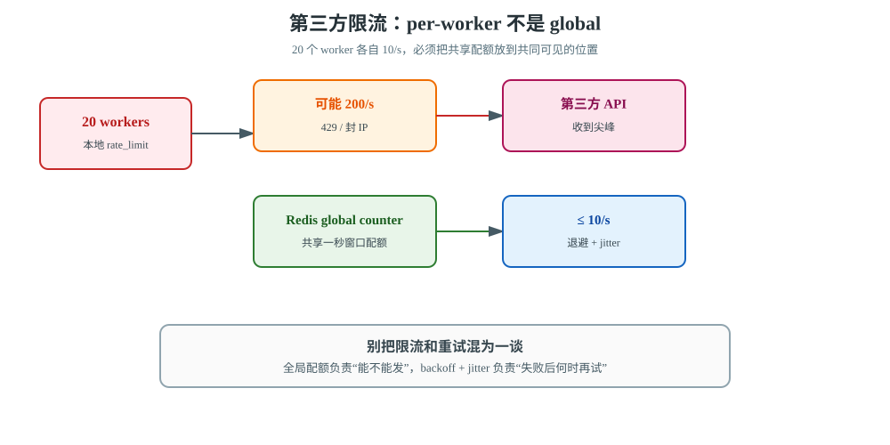
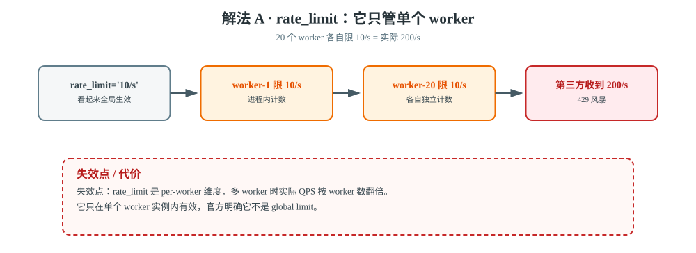
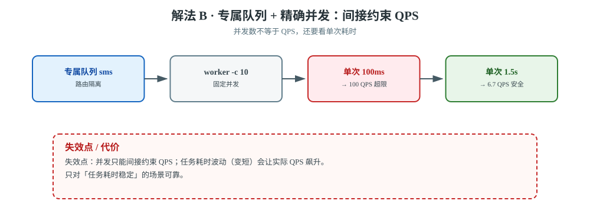
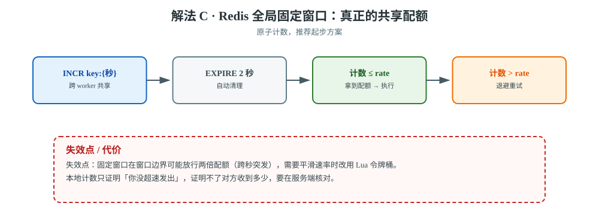
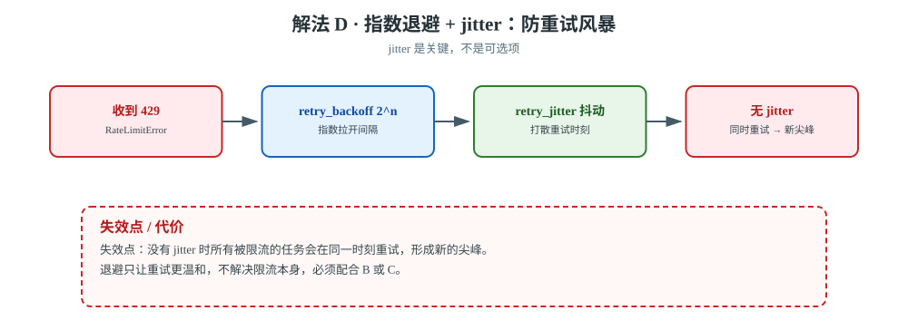
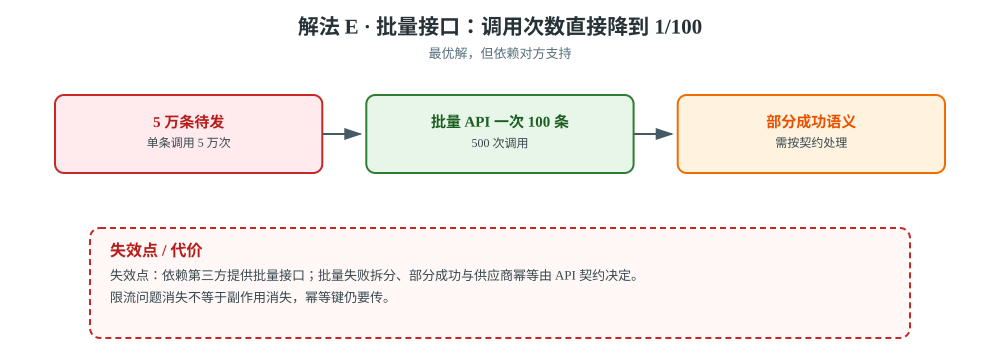

# 场景 8：第三方 API 限流（每秒最多 10 次，经典设计题）

**场景描述**：要调用第三方短信/物流 API，对方限制 **每秒最多 10 次**，超了返回 429 并且可能封 IP。当前有 5 万个待发任务，worker 有 20 个并发。现象：大量任务收到 429，重试后又 429，形成**重试风暴**。

**🔒 先自己想 30 秒**：第一反应可能是"加 `rate_limit='10/s'`"。先想清楚：**这个 rate limit 是全局的，还是每个 worker 进程各自算的？**（提示：这决定了 20 个并发下实际 QPS 是多少）

<details><summary>💡 提示</summary>

- Celery 的 `rate_limit` 是**每个 worker 实例**维度的，不是全局的。20 个并发 = 实际 QPS 可能是 200，而不是你设的 10。
- 怎么做到全局限流？让并发数就等于限流值？用外部令牌桶？用队列串行化？
- **收到 429 之后该怎么重试**？立即重试会让情况更糟。

</details>

<details><summary>📖 展开解法</summary>

### 解法一览

| 解法 | 效果（全局 QPS 约束 / 429 抑制） | 代价 | 适用边界 |
|------|--------------------------|------|---------|
| **A · `rate_limit='10/s'`** | 全局 QPS 约束：**❌ per-worker，20 worker = 200/s** / 429 抑制：❌ | 多 worker 会翻倍 | 单 worker 场景 |
| **B · 控制并发数 = 限流值** | 全局 QPS 约束：间接，取决于单次耗时 / 429 抑制：中 | 吞吐受限 | 任务耗时稳定时 |
| **C · Redis 全局固定窗口** | 全局 QPS 约束：**✅ 跨 worker 共享配额** / 429 抑制：✅ | 要写代码；窗口边界可能有突发 | **推荐起步** |
| **D · 指数退避 + jitter** | 全局 QPS 约束：❌ 不限流 / 429 抑制：**✅✅ 防重试风暴** | 拉长总耗时 | **必做** |
| **E · 批量接口** | 全局 QPS 约束：✅ 调用量降到 1/100 / 429 抑制：**✅✅** | 依赖对方支持 | 首选（如果对方有） |

### 各解法详解



> **读图指引**：上方路径展示 20 个 worker 各自限速后仍可能形成 200/s；下方路径把共享配额集中到 Redis，再用退避和 jitter 处理失败重试。

#### 解法 A · `rate_limit`（先看清楚它的维度）



> **读图**：每个 worker 各自限 10/s，20 个叠起来就是 200/s；红框处第三方直接返回 429。

```python
@app.task(rate_limit='10/s')
def send_sms(phone, content): ...
```

> ⚠️ **这是 per-worker 的**：20 个 worker 进程各自限 10/s，`rate_limit` 形同虚设。
> 它只在**单个 worker 实例**内有效。

#### 解法 B · 专属队列 + 精确并发



> **读图**：并发被固定在 10，实际 QPS 还要除以单次耗时；红框提醒耗时一旦变短就会悄悄超速。

```bash
# 给限流任务单独一个队列，并发严格等于限流值
celery -A proj worker -Q sms -c 10 --prefetch-multiplier=1
```

> ⚠️ **`-c 10` 不等于 10 QPS**，还要看单次任务耗时：
> 单次 100ms → 10 并发 = **100 QPS**（超限）；单次 1.5s → 10 并发 ≈ **6.7 QPS**（安全）。
> **所以 B 只对"任务耗时稳定"的场景可靠。**

#### 解法 C · Redis 全局固定窗口（原子计数，推荐起步）



> **读图**：配额集中到 Redis 的一个计数 key 上，所有 worker 共享；红框提醒固定窗口在跨秒处会放行双倍配额。

```python
import time
import redis

r = redis.Redis()

def acquire_slot(key, rate=10):
    """固定一秒窗口计数；返回 True 表示本窗口仍有配额"""
    now = int(time.time())
    cnt = r.incr(f'{key}:{now}')
    r.expire(f'{key}:{now}', 2)          # 2 秒后自动清理
    return cnt <= rate


@app.task(bind=True, autoretry_for=(RateLimitError,),
          retry_backoff=True, retry_jitter=True, max_retries=10)
def send_sms(self, phone, content):
    if not acquire_slot('sms_api', rate=10):
        raise RateLimitError('达到限流，稍后重试')   # 触发带退避的重试
    call_sms_api(phone, content)
```

#### 解法 D · 指数退避 + jitter（必做）



> **读图**：429 之后按指数拉开间隔，再用 jitter 打散重试时刻；红框提醒没有 jitter 会在同一时刻重试出新的尖峰。

```python
@app.task(bind=True, autoretry_for=(RateLimitError,),
          retry_backoff=True,      # 指数退避
          retry_jitter=True,       # ⭐ 关键：随机抖动
          retry_backoff_max=600,
          max_retries=10)
def send_sms(self, phone, content): ...
```

> ⚠️ **`retry_jitter=True` 是关键**——没有 jitter，所有被限流的任务会在**同一时刻**重试，形成新的尖峰。

#### 解法 E · 批量接口（最优解，如果对方有）



> **读图**：5 万条从 5 万次调用压成 500 次批量调用；红框提醒部分成功的语义要按供应商契约处理。

如果第三方提供批量 API，一次发 100 条，5 万条只需 **500 次**调用——限流问题直接消失。

### 非本栈替代路线（什么时候别在 worker 里限流）

| 诉求 | Celery 侧的边界 | 该用什么 |
|------|----------------|---------|
| **多个服务共享同一个限额** | 每个服务的 worker 各自限流，加起来仍超限 | **独立的限流服务 / API 网关**（Sentinel、Envoy rate limit、Kong）统一计数 |
| **限流规则复杂**（按用户/按接口/按时间段） | 全局限流代码要自己维护，容易出错 | **专业限流组件**（Redis-Cell 的 `CL.THROTTLE`、`django-ratelimit`、Sentinel） |
| **要削峰而不是限流** | 限流会让任务堆积在 broker，延迟不可控 | **独立消费服务 + 自己的速率控制**：从队列按固定速率捞任务 |
| **第三方有 webhook 回调** | 主动轮询/推送都浪费调用 | **改推模式**（对方回调你的接口），彻底绕开限流 |

> 💡 判断线：**限流只在你的服务内 → Celery + Redis 全局计数够用；需要平滑速率或限额被多个服务共享 → 使用 Lua / 专业限流层**。

### 推荐路径（递进）

1. **第一步（先看有没有批量接口）**：E —— 一次发 100 条，问题直接消失。
2. **第二步（并发控制）**：B —— 专属队列 + 精确并发。注意只对耗时稳定的任务可靠。
3. **第三步（真正的全局计数）**：C —— Redis 原子计数；需要平滑速率时再换 Lua 令牌桶。
4. **第四步（必做）**：D —— 指数退避 + jitter，防重试风暴。

### 效果对比：怎么验证这一步真的有效

| 维度 | 怎么看 | 期望变化 |
|------|--------|---------|
| **实际 QPS** | 在第三方侧或网关侧统计每秒请求数；本地用 `redis-cli` 看计数 key | **稳定 ≤ 10/s**，且不随 worker 数线性增长 |
| **429 响应占比** | 统计 `RateLimitError` / HTTP 429 的次数 | 从"大量"降到**接近 0** |
| **重试时间分布** | 记录每次重试的时间戳，看是否扎堆 | 有 jitter 时**均匀散开**；无 jitter 时会形成尖峰 |

> ⚠️ 第一个维度要在**服务端**看：本地计数只能证明"你没超速发出"，证明不了对方收到多少。

### 知识点挂钩

| 解法 | 回指课程 |
|------|---------|
| A · rate_limit | 课 9《生产部署与并发模型》· 并发模型 |
| C · 全局计数限流 | 课 5《确认机制与重试策略》· 重试策略（429 属可重试异常） |
| D · 退避 + jitter | 课 5 · backoff / jitter |
| B · 队列隔离 | 课 9 · 路由与队列隔离；本项目[决策 1](../projects/电商订单履约系统/设计决策.md) |
| E · 批量接口 | 课 8《canvas 任务编排》· group / chunks；课 5 · 外部调用重试 |

### 证据与核查

| 解法 | 依据 | 核查边界 |
|------|------|---------|
| A | 【官方】[Celery tasks：rate_limit](https://docs.celeryq.dev/en/stable/userguide/tasks.html#task-rate-limit) | 官方明确它是 per-worker，不是 global limit |
| B | 【官方】[Celery tasks：长短任务与专属 worker](https://docs.celeryq.dev/en/stable/userguide/tasks.html) | 并发数只能间接约束 QPS，必须结合任务耗时测量 |
| C | 【公认】Redis 原子计数 / Lua 限流模式 | 本文代码是固定窗口，不冒充平滑令牌桶；窗口边界突发需压测 |
| D | 【官方】[Celery tasks：automatic retry / backoff / jitter](https://docs.celeryq.dev/en/stable/userguide/tasks.html#automatic-retry-for-known-exceptions) | backoff 只分散重试，不替代全局配额 |
| E | 【公认】批量 API 降低调用次数 | 批量失败拆分、部分成功与供应商幂等由 API 契约决定 |

### 什么情况下此方案不适用

- **解法 A 单独用**：多 worker 下限流值按 worker 数翻倍，形同虚设。
- **解法 B**：任务耗时波动大时不可靠（耗时变短 → QPS 飙升）。
- **解法 D（退避）**：只是让重试"温和"，不解决限流本身，必须配合 B 或 C。
- **任何解法**：如果对方 429 后就封 IP，单纯退避可能不够，要先降并发。

### 做错会踩的坑

- 只加 `rate_limit` 不控 worker 数 → 限流失效 → 429 风暴。
- 重试无 jitter → 尖峰叠加 → 重试风暴（[故障模式 3](../08-实战经验.md) 的 cousin）。
- 用 `max_retries=None`（无限重试）→ 任务永远不放弃，死信队列收不到，问题被掩盖。

</details>

---

➡️ **返回**：[场景解法库索引](INDEX.md) ｜ **上一场景**：[场景 7 VIP 插队](场景-07-VIP插队.md)
