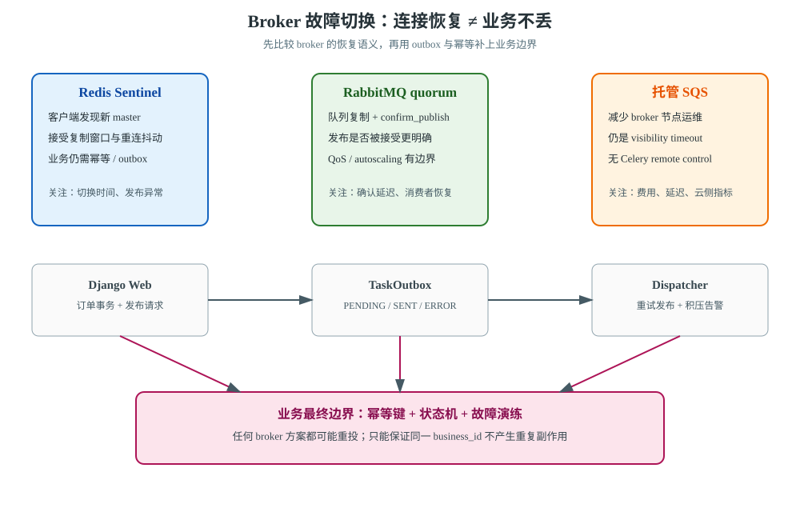
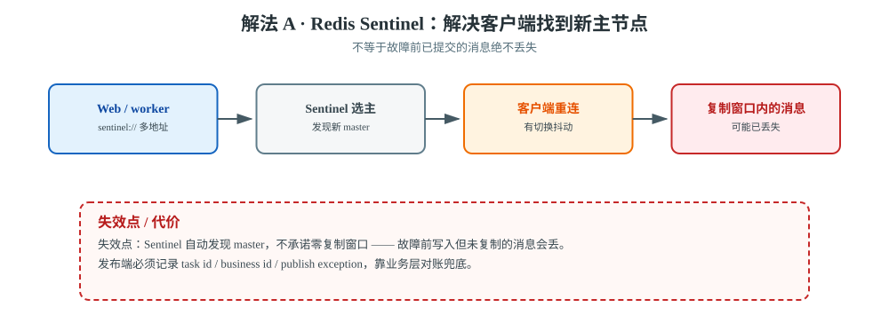
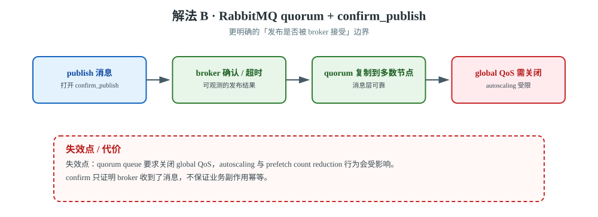
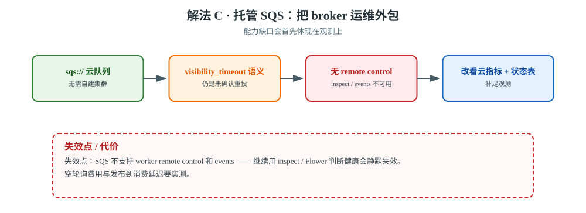
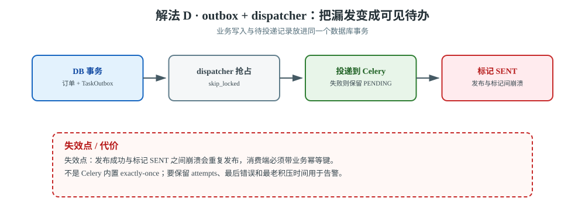

# 场景 9：Broker 故障切换与任务语义（经典设计题）

**场景描述**：订单服务有 3 个 Django Web 实例、6 个 Celery worker。当前使用单实例 Redis 作为 broker，发布高峰时 Redis 需要维护 90 秒。要求：发布期间**不能静默丢任务**，恢复时间目标是 60 秒以内；允许 at-least-once 带来的重复，但不允许重复扣款或重复发货。

**🔒 先自己想 30 秒**：你要解决的到底是"Redis 挂了还能连上"，还是"已经发布的消息一定能找回来"？这两个目标分别对应连接切换、消息持久性、发布确认和业务幂等。

<details><summary>💡 提示（先把故障窗口画出来）</summary>

- Web 进程发布消息时，Redis 正好不可写，调用方能不能感知？
- 消息已经交给 broker、但 worker 还没确认时，故障切换会不会重投？
- broker 恢复后，如何区分"消息没发出去""消息发了但没消费""消息消费了但业务提交成功"？
- RabbitMQ quorum、Redis Sentinel、SQS 都能叫"高可用"吗？它们的可观测能力和失败语义一样吗？

</details>

<details><summary>📖 展开解法</summary>

### 解法一览

| 解法 | 效果（切换恢复 / 漏发可见性） | 代价 | 适用边界 |
|------|-----------------------|------|---------|
| **A · Redis Sentinel** | 切换恢复：自动发现新 master / 漏发可见性：**❌ 复制窗口内不可见** | 仍需接受复制窗口与切换抖动；配置 broker 和 backend 的边界 | 已经使用 Redis、希望小步迁移 |
| **B · RabbitMQ quorum + 发布确认** | 切换恢复：多数派复制 / 漏发可见性：**✅ publisher confirm 可观测** | 引入 RabbitMQ；quorum 有 QoS / autoscaling 限制 | 消息可靠性是核心约束 |
| **C · 托管 SQS** | 切换恢复：由云平台保障 / 漏发可见性：✅ 云指标（但 Celery events 不可用） | 延迟、费用、无 remote control / events；仍是 visibility timeout 语义 | 团队更看重托管与弹性 |
| **D · Django outbox + 重放对账** | 切换恢复：不涉及 broker 切换 / 漏发可见性：**✅✅ 变成数据库里的可见待办** | 需要 dispatcher、幂等键和积压治理；不是 exactly-once | 绝不能漏发的业务事件 |



> **读图指引**：先沿上方三条 broker 路径比较"切换发生在哪里"，再看底部 outbox 路径：它把发布失败变成数据库里的可见待办，但仍要用业务幂等处理重复投递。

#### 解法 A · Redis Sentinel（已有 Redis 的最小改造）



> **读图**：Sentinel 解决的是「客户端找到新 master」；红框处是复制窗口——故障前已写入但没复制出去的消息仍然会丢。

Celery 官方支持直接配置多个 Sentinel 地址和 `master_name`。这解决的是**客户端找到新主节点**，不等于已经提交到故障前主节点的每条消息都绝不会丢。

```python
# settings.py：示例地址，不含真实凭据
CELERY_BROKER_URL = (
    'sentinel://redis-sentinel-a:26379;'
    'sentinel://redis-sentinel-b:26379;'
    'sentinel://redis-sentinel-c:26379'
)
CELERY_BROKER_TRANSPORT_OPTIONS = {
    'master_name': 'celery-main',
    'sentinel_kwargs': {'password': '<YOUR_SENTINEL_PASSWORD>'},
}

# 如果结果 backend 也走 Sentinel，要单独配置它的 master_name
CELERY_RESULT_BACKEND_TRANSPORT_OPTIONS = {'master_name': 'celery-main'}
```

**关键边界**：先确认 Sentinel 的故障检测、选主、客户端重连时间，再决定发布端的重试策略。发布端必须记录 task id / business id / publish exception；重试发布可能制造重复，所以任务本身仍要幂等。

**验证动作**：在非生产环境停止当前 Redis master，测量 Web 发布错误率、客户端恢复时间、恢复后队列可见消息数与重复业务写入数；不要只看"连接又通了"。

#### 解法 B · RabbitMQ quorum queue + `confirm_publish`



> **读图**：发布结果变成可观测的 confirm；红框提醒 quorum 要求关掉 global QoS，autoscaling 与 prefetch 行为会受影响。

Celery 5.6 文档给出了 quorum queue 的配置方式：队列声明 `x-queue-type=quorum`，并打开 `confirm_publish`。这是更清晰的"发布是否被 broker 接受"边界，但不自动替你保证业务副作用幂等。

```python
from kombu import Queue

CELERY_TASK_QUEUES = [
    Queue('critical', queue_arguments={'x-queue-type': 'quorum'}),
]
CELERY_BROKER_TRANSPORT_OPTIONS = {'confirm_publish': True}
CELERY_TASK_DEFAULT_QUEUE = 'critical'
```

> 版本与运维边界：quorum queue 是 Celery 5.5 起支持的能力；官方提醒它要求关闭 global QoS，因此 autoscaling 和 prefetch count reduction 等行为会受影响。迁移前要把吞吐、消费者数量和发布确认延迟压测出来。

**验证动作**：模拟单节点故障与网络隔离，观察 publisher confirm 超时、消息重新可见时间、consumer 重连时间；同时对同一个 business id 重放两次，确认数据库唯一约束或状态机只允许一次副作用。

#### 解法 C · 托管 SQS（把 broker 运维外包）



> **读图**：broker 交给云托管，但仍是 visibility timeout 语义；红框提醒 remote control 与 events 缺失，`inspect` / Flower 会静默失效。

```python
# 不把 AWS 密钥写进代码；使用 IAM role 或运行环境凭据
CELERY_BROKER_URL = 'sqs://'
CELERY_BROKER_TRANSPORT_OPTIONS = {
    'region': 'ap-southeast-1',
    'visibility_timeout': 1800,
    'wait_time_seconds': 10,
}
```

SQS 仍按 visibility timeout 处理未确认消息；Celery 官方文档还明确列出：SQS 不支持 worker remote control 和 events，因此不能把 `inspect`、`celery events` 或 Django Admin monitor 当成它的观测方案。要改用云侧指标、应用日志和业务状态表。

**验证动作**：测量长任务耗时是否小于 visibility timeout，测量空轮询费用与发布到消费延迟；对强杀 worker 做重投演练，并确认不是只在 SQS 控制台看队列深度。

#### 解法 D · Django outbox + dispatcher（业务不可漏发时的保险层）



> **读图**：业务写入与待投递记录同事务落库，dispatcher 再发布；红框处发布成功与标记 `SENT` 之间的崩溃会造成重复发布。

把订单状态和待投递事件放入同一个数据库事务。dispatcher 负责把 outbox 记录发布到 Celery，发布成功后再标记 `SENT`。发布与标记之间崩溃时会重复发布，所以消费端必须带业务幂等键。

```python
# models.py（关键字段示意）
class TaskOutbox(models.Model):
    event_key = models.CharField(max_length=120, unique=True)
    task_name = models.CharField(max_length=200)
    payload = models.JSONField()
    status = models.CharField(max_length=16, default='PENDING')
    attempts = models.PositiveIntegerField(default=0)
    last_error = models.TextField(blank=True)

# service.py
with transaction.atomic():
    order = create_order(...)
    TaskOutbox.objects.create(
        event_key=f'order-created:{order.pk}',
        task_name='orders.tasks.send_created',
        payload={'order_id': order.pk},
    )
```

dispatcher 的领取必须使用 `select_for_update(skip_locked=True)` 或等价的状态抢占；`SENT` 不能只靠进程内存判断。保留 `attempts`、最后错误、首次创建时间和业务键，才能做积压告警与人工补发。

### 非本栈替代路线（什么时候别让 Celery 负责长生命周期可靠性）

| 诉求 | Celery 侧的边界 | 替代路线 |
|------|----------------|---------|
| 需要长时间运行的工作流、人工批准、可恢复步骤 | broker HA 只解决消息层，不保存完整工作流状态 | **Temporal / Argo Workflows** |
| 需要事件日志、分区重放和多个独立消费组 | Celery 不是事件流存储 | **Kafka / Pulsar**，Celery 只处理局部异步动作 |
| 团队不想运维 broker 集群 | 自建 Sentinel / RabbitMQ 仍有运维面 | **云托管队列 + 云监控**，先接受其延迟与控制能力边界 |

### 推荐路径（递进）

1. **先定义语义**：把"发布失败、已发布未确认、已消费未提交、已提交未 ack"分别写成可观测状态。
2. **已有 Redis 且可接受小步改造**：A + D；Sentinel 缩小 broker 单点，outbox 负责不漏发，消费端幂等负责重复。
3. **消息可靠性是核心且团队能运维**：B + D；把 quorum 和 confirm 纳入故障演练，不把它当作 exactly-once。
4. **更看重托管**：C + D；用云指标补上 Celery events / remote control 的缺口。

### 效果对比：怎么验证这一步真的有效

| 维度 | 怎么看 | 期望变化 |
|------|---------|---------|
| **发布确认成功率** | publisher 记录 confirm / timeout / exception，按 broker 分组 | 故障窗口内失败可见，恢复后成功率回到基线 |
| **切换恢复时间** | 从 broker 故障注入到首条任务成功消费 | 达到约定 RTO；不把 DNS 恢复当作消费恢复 |
| **业务重复副作用** | 按 business id 统计扣款 / 发货 / 发券写入数 | 重投次数增加时仍保持每个业务键一次 |
| **待投递积压年龄** | outbox PENDING 最老记录时间 | 有明确告警阈值，能人工重放而不是靠猜 |

### 证据与核查

| 解法 | 依据 | 核查边界 |
|------|------|---------|
| A | 【官方】[Celery Redis transport](https://docs.celeryq.dev/en/stable/getting-started/backends-and-brokers/redis.html) 的 Sentinel 配置 | Sentinel 自动发现 master，不承诺零复制窗口 |
| B | 【官方】[Celery RabbitMQ transport](https://docs.celeryq.dev/en/stable/getting-started/backends-and-brokers/rabbitmq.html) 的 quorum / `confirm_publish` | 5.6 stable 文档；quorum QoS 限制需现场压测 |
| C | 【官方】[Celery SQS transport](https://docs.celeryq.dev/en/stable/getting-started/backends-and-brokers/sqs.html) 的 visibility timeout 与能力缺口 | SQS 默认 visibility timeout 与 Celery 配置须按部署确认 |
| D | 【公认】事务性 outbox + 幂等消费模式 | 不是 Celery 内置 exactly-once；需用本项目数据库和故障演练验证 |

### 知识点挂钩

| 解法 | 回指课程 |
|------|---------|
| A/B/C · Broker 选型与 HA | [课 3《第一个 Celery + Django 项目》](../stages/2-Django集成与任务基础/lessons/lesson-03-第一个Celery+Django项目.md) |
| D · 事务与幂等 | [课 5《确认机制与重试策略》](../stages/3-可靠性与幂等/lessons/lesson-05-确认机制与重试策略.md)；[课 6《Django 事务与 ORM 的坑》](../stages/3-可靠性与幂等/lessons/lesson-06-Django事务与ORM的坑.md) |
| 故障演练与观测 | [课 10《监控、排查与上线清单》](../stages/4-定时编排与生产运维/lessons/lesson-10-监控、排查与上线清单.md) |

### 什么情况下此方案不适用

- 只做 Sentinel 而没有幂等、outbox 或发布错误记录：故障后仍无法回答"到底发没发"。
- 只因为"RabbitMQ 更可靠"就迁移：如果团队没有集群、权限、备份和演练能力，可靠性可能反而下降。
- 选 SQS 后仍依赖 `inspect` / Flower 判断健康：官方能力缺口会让监控静默失效。
- 需要工作流级断点、人工审批和多年审计：应把状态放进工作流引擎，不要把 broker 当数据库。

### 做错会踩的坑

- 把 broker 可用误当成业务不重复：回到[场景 4](场景-04-不重复扣款.md)的数据库 / 外部幂等。
- 故障切换后只看 queue length，不看 publisher error、outbox age 和业务终态。
- quorum queue 迁移后仍照搬旧的 autoscaling / prefetch 结论，先读官方限制并压测。
- 强杀 worker 后用"任务没在队列里"判断丢失，回到[场景 5](场景-05-部署不丢任务.md)的 `unacked` 取证。

</details>

---

➡️ **返回**：[场景解法库索引](INDEX.md) ｜ **上一场景**：[场景 8 第三方 API 限流](场景-08-第三方限流.md) ｜ **下一场景**：[场景 10 重试耗尽后的死信与安全重放](场景-10-重试耗尽后的死信与安全重放.md)
