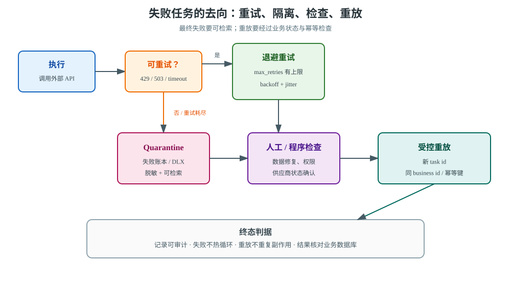
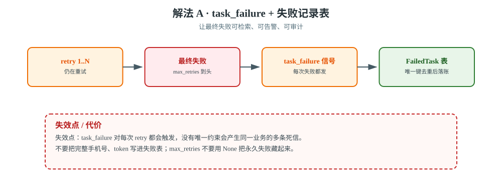
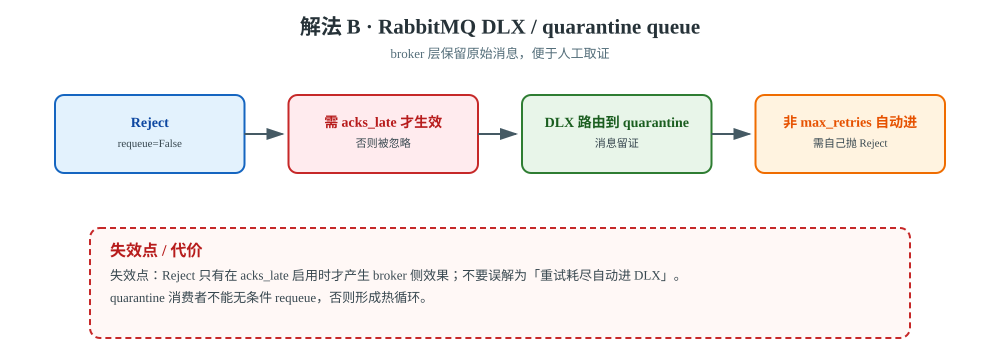
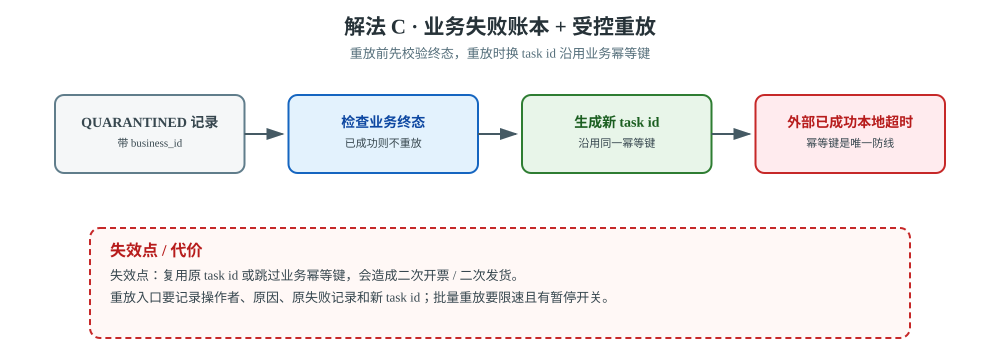
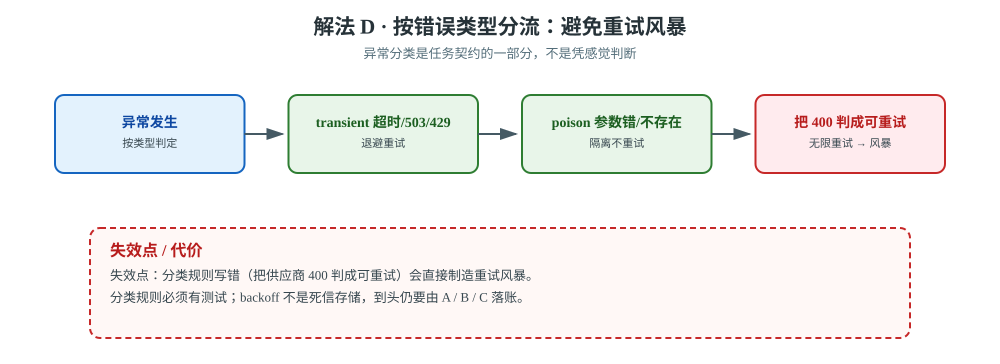

# 场景 10：重试耗尽后的死信与安全重放（经典设计题）

**场景描述**：订单导出任务调用第三方发票 API。网络超时可以重试 5 次，但参数错误、订单已删除、供应商永久拒绝不应无限重试。现在失败任务只出现在 worker 日志里，产品要求：失败要可检索、可分流、可审计；修复数据或供应商恢复后，运营可以安全重放，且不能重复开票。

**🔒 先自己想 30 秒**：所谓“死信”是任务失败后自动进入某个 Celery 队列，还是应用自己把最终失败记录下来？尤其要分清：重试中的任务、最后一次失败、主动 `Reject(requeue=False)`，它们的去向不一样。

<details><summary>💡 提示（先画状态，不要先写重放按钮）</summary>

- 什么是 transient error，什么是 poison message？两者是否应该走同一条重试路径？
- `task_failure` 记录的是每一次 retry，还是最终失败？你需要的审计主键是什么？
- broker 原生 DLX 能不能自动知道 Celery 的业务重试已经耗尽？
- 重放时是复用原 task id，还是生成新 task id？如何防止外部 API 已成功但本地超时造成二次开票？

</details>

<details><summary>📖 展开解法</summary>

### 解法一览

| 解法 | 效果（失败可见性 / 重放安全性） | 代价 | 适用边界 |
|------|--------------------------|------|---------|
| **A · `task_failure` + 失败记录表** | 失败可见性：**✅ 可检索、可告警、可审计** / 重放安全性：中（靠状态机与幂等键） | 要设计脱敏 payload 与唯一键 | 通用首选 |
| **B · RabbitMQ DLX / quarantine queue** | 失败可见性：✅ 保留原始消息 / 重放安全性：中（需 acks_late 与拓扑） | 依赖 RabbitMQ；拓扑和权限更复杂 | 已使用 RabbitMQ 且要保留原始消息 |
| **C · 业务失败账本 + 受控重放** | 失败可见性：✅ 含业务终态 / 重放安全性：**✅✅ 带校验与审批** | 需要管理命令 / 后台 / 审计流程 | 资金、发票、发货等高副作用任务 |
| **D · 按错误类型分流** | 失败可见性：✅ 分类后可查询 / 重放安全性：✅ 减少无效重放 | 需要稳定的异常分类协议 | 外部 API、数据质量问题明显的系统 |



> **读图指引**：从左到右看“执行 → 重试 → 最终失败”的状态变化；进入 quarantine 后，先人工 / 程序检查，再通过带业务幂等键的新任务重放。不要从死信队列直接批量灌回生产队列。

#### 解法 A · `task_failure` + 失败记录表（通用首选）



> **读图**：前 N 次都在重试，只有最终失败才该落账；红框提醒 `task_failure` 对每次 retry 都会发信号，必须靠唯一键去重。

Celery 提供 `task_failure` 信号。应用可以在最终失败时写入一条自己的失败记录，保存 task id、任务名、业务键、异常类别、重试次数、脱敏后的输入摘要和 traceback 摘要。失败记录要有唯一约束，避免重复信号或重复消费造成多条死信。

```python
# failure_handlers.py
from celery.signals import task_failure

@task_failure.connect
def record_task_failure(
    task_id=None, sender=None, exception=None,
    args=None, kwargs=None, einfo=None, **_extra
):
    business_id = (kwargs or {}).get('invoice_id')
    FailedTask.objects.update_or_create(
        task_id=task_id,
        defaults={
            'task_name': getattr(sender, 'name', '<unknown>'),
            'business_id': business_id,
            'error_type': type(exception).__name__,
            'error_message': str(exception)[:500],
            'payload_summary': {'invoice_id': business_id},
            'traceback_summary': str(einfo)[:4000] if einfo else '',
            'status': 'QUARANTINED',
        },
    )
```

不要把完整手机号、地址、token 或支付响应直接写进失败表；原始输入需要时存对象存储或加密字段，并设置保留期。任务配置还要有明确 `max_retries`，不要用 `None` 把永久失败隐藏成“还在努力”。

**验证动作**：投递 3 个必失败任务，确认失败记录是 3 条而不是按每次 retry 计数；检查 task id、business id、error type 和脱敏字段都能用于检索。当前课程实测正是“3 条必失败任务 → 3 条死信记录”。

#### 解法 B · RabbitMQ DLX / quarantine queue（broker 原生留证）



> **读图**：poison message 走 `Reject` 进入 quarantine；红框提醒它依赖 `acks_late` 才生效，且不是「重试耗尽自动进入」。

RabbitMQ 的 Dead Letter Exchange 可以接收被拒绝且 `requeue=False` 的消息。Celery 官方任务文档明确说明：`Reject` 只有在 `acks_late` 启用时才有 broker 侧效果，RabbitMQ 才能把消息路由到 DLX。

```python
from celery.exceptions import Reject

@app.task(bind=True, acks_late=True)
def render_invoice(self, invoice_id):
    try:
        return call_invoice_provider(invoice_id)
    except InvalidInvoice as exc:
        # poison message：不要回原队列形成热循环
        raise Reject(str(exc), requeue=False)
    except ProviderTemporaryError as exc:
        # transient error：交给 Celery 的 retry/backoff
        raise self.retry(exc=exc, countdown=30)
```

RabbitMQ 队列本身还要声明 dead-letter exchange / routing key，并给 quarantine queue 配置权限、保留期和消费方式。**不要误解为“max_retries 耗尽自动进入 DLX”**：Celery 业务 retry 的最终失败要不要进入 DLX，取决于你的异常处理与 broker 拓扑；因此 A 仍然建议保留。

**验证动作**：分别投递 poison message 与临时错误，确认前者进入 quarantine、后者按退避重试；确认 quarantine 消费者不会把同一消息无条件 requeue。

#### 解法 C · 业务失败账本 + 受控重放（高副作用任务必做）



> **读图**：重放前先查业务终态，再用**新 task id** 加**同一业务幂等键**投递；红框处「外部已成功、本地超时」只有幂等键挡得住。

死信记录只解决“失败可见”，不解决“重放是否安全”。为每个业务动作保存状态，例如 `PENDING → PROCESSING → SUCCEEDED / QUARANTINED`，重放入口先做权限、数据、供应商状态和幂等检查，再生成**新的 Celery task id**，但沿用同一个业务幂等键。

```python
def replay_invoice(failure_id, operator):
    failure = FailedTask.objects.select_for_update().get(
        id=failure_id, status='QUARANTINED'
    )
    invoice = Invoice.objects.get(id=failure.business_id)
    if invoice.status == 'SUCCEEDED':
        failure.status = 'ALREADY_DONE'
        failure.save(update_fields=['status'])
        return '业务已成功，不重放'

    failure.status = 'REPLAY_REQUESTED'
    failure.replayed_by = operator
    failure.save(update_fields=['status', 'replayed_by'])
    return issue_invoice.apply_async(
        kwargs={
            'invoice_id': invoice.id,
            'idempotency_key': f'invoice:{invoice.id}',
        },
    ).id
```

重放本身也可能在“外部调用成功、本地响应超时”后再次发生，所以供应商幂等键、数据库唯一约束和状态机仍是最终防线。管理入口要记录操作者、原因、原失败记录和新 task id；批量重放要限速并有暂停开关。

#### 解法 D · 按错误类型分流（避免重试风暴）



> **读图**：异常在入口就被分成可重试与需隔离两类；红框提醒把供应商的 400 判成可重试，会直接制造重试风暴。

把异常分类当作任务契约的一部分，而不是在每个任务里凭感觉判断：网络超时 / 503 / 429 通常可退避重试；参数校验、资源不存在、权限拒绝通常应隔离；未知异常先进入有限次数重试并告警。

```python
@app.task(
    bind=True,
    autoretry_for=(ProviderTemporaryError,),
    retry_backoff=True,
    retry_jitter=True,
    retry_backoff_max=600,
    max_retries=5,
)
def issue_invoice(self, invoice_id, idempotency_key):
    validate_invoice(invoice_id)       # InvalidInvoice 不在 autoretry_for 中
    return provider.issue(
        invoice_id=invoice_id,
        idempotency_key=idempotency_key,
        timeout=(5, 30),
    )
```

`retry_backoff` 配合 jitter 能把重试摊开，但它不是死信存储；`max_retries` 到头后仍要由 A / B / C 负责落账。分类规则还要有测试，避免把供应商返回的 400 错误错误地包装成可重试异常。

### 非本栈替代路线（什么时候不把死信做成 Celery 队列）

| 诉求 | Celery 侧的边界 | 替代路线 |
|------|----------------|---------|
| 需要多年保留事件、按 offset 重放多个消费组 | Celery result / broker 不是事件审计日志 | **Kafka / Pulsar** 的 retry topic + DLQ |
| 重放包含人工审批、补偿步骤和状态回溯 | 单个失败任务难表达长生命周期状态 | **Temporal / Airflow** 的工作流状态与人工介入 |
| 只有简单的数据库批处理 | 引入 broker、worker、DLQ 运维面过大 | **Django management command + 数据库失败账本 + Cron** |

### 推荐路径（递进）

1. **第一步**：D —— 先把可重试 / 不可重试 / 未知错误分类，给 `max_retries` 上限。
2. **第二步**：A —— 用失败表做唯一的查询、告警和审计入口；不依赖 worker 日志长期保存。
3. **第三步**：C —— 高副作用任务增加状态机、业务幂等键、人工审批与新 task id 重放。
4. **第四步**：B —— 只有在 RabbitMQ 已是核心基础设施、且确实需要 broker 原始消息留证时，再引入 DLX 拓扑。

### 效果对比：怎么验证这一步真的有效

| 维度 | 怎么看 | 期望变化 |
|------|---------|---------|
| **失败可见性** | `FailedTask` 按业务键、错误类型、状态查询 | 最终失败不再只存在 worker 日志，且一业务键一主记录 |
| **重试风暴** | 按异常类型统计 retry 次数与时间分布 | 永久错误不再无限回队；临时错误有退避和 jitter |
| **重放安全性** | 对同一个业务键执行“外部成功但本地超时”演练 | 数据库 / 外部幂等键仍只产生一次副作用 |
| **恢复效率** | 从修复问题到重放成功的时间、人工操作次数 | 可审计、可暂停、可按条件批量重放 |

### 证据与核查

| 解法 | 依据 | 核查边界 |
|------|------|---------|
| A | 【官方】[Celery signals](https://docs.celeryq.dev/en/stable/userguide/signals.html)；【实测】本课程 3 条必失败任务记录 3 条死信 | `task_failure` 的业务落账仍由应用实现 |
| B | 【官方】[Celery tasks：Reject 与 Dead Letter Exchange](https://docs.celeryq.dev/en/stable/userguide/tasks.html#reject) | `Reject` 依赖 `acks_late` 与 broker 能力；不是所有 transport 都有 DLX |
| C | 【公认】状态机 + 业务幂等键 + 人工可审计重放 | 具体字段、审批和保留期按业务合规要求确定 |
| D | 【官方】[Celery tasks：automatic retry / backoff](https://docs.celeryq.dev/en/stable/userguide/tasks.html#automatic-retry-for-known-exceptions) | 异常分类需用本业务错误码与集成测试验证 |

### 知识点挂钩

| 解法 | 回指课程 |
|------|---------|
| A/D · 重试耗尽与失败信号 | [课 5《确认机制与重试策略》](../stages/3-可靠性与幂等/lessons/lesson-05-确认机制与重试策略.md) |
| C · 事务、状态机、幂等 | [课 6《Django 事务与 ORM 的坑》](../stages/3-可靠性与幂等/lessons/lesson-06-Django事务与ORM的坑.md)；[场景 4 不重复扣款](场景-04-不重复扣款.md) |
| B · broker 侧能力与观测 | [课 3《第一个 Celery + Django 项目》](../stages/2-Django集成与任务基础/lessons/lesson-03-第一个Celery+Django项目.md)；[课 10《监控、排查与上线清单》](../stages/4-定时编排与生产运维/lessons/lesson-10-监控、排查与上线清单.md) |

### 什么情况下此方案不适用

- 只把失败任务重新 `delay()` 回原队列：没有修复数据或错误分类，会制造死循环。
- 只保留 traceback 不保留业务键：排障能看懂异常，却无法安全定位和重放业务对象。
- 把完整原始 payload 放进 Redis / 失败表：会扩大 PII 泄露与存储保留风险。
- 将“重放成功”定义为 task 状态 `SUCCESS`：必须继续核对数据库和外部系统的业务终态。

### 做错会踩的坑

- `max_retries=None` 把永久错误变成无限重试，回到[场景 8](场景-08-第三方限流.md)的重试风暴。
- 只看 queue length 不看失败表与 quarantine，回到[09-排障速查手册](../09-排障速查手册.md)的可观测性边界。
- `Reject(requeue=True)` 用错位置，形成热循环；需明确它与 `requeue=False` 的差异。
- 重放复用原 task id 或跳过业务幂等，回到[场景 4](场景-04-不重复扣款.md)的重复副作用风险。

</details>

---

➡️ **返回**：[场景解法库索引](INDEX.md) ｜ **上一场景**：[场景 9 Broker 故障切换与任务语义](场景-09-Broker故障切换与任务语义.md) ｜ **下一场景**：[场景 11 测试通过但生产路由失效](场景-11-测试通过但生产路由失效.md)
