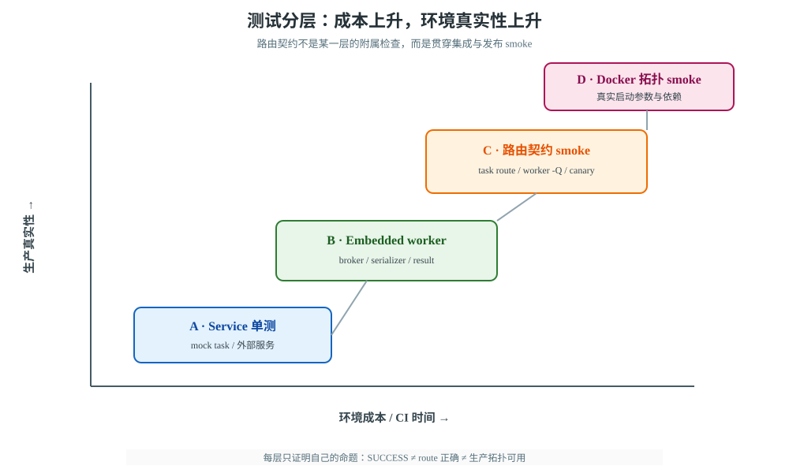
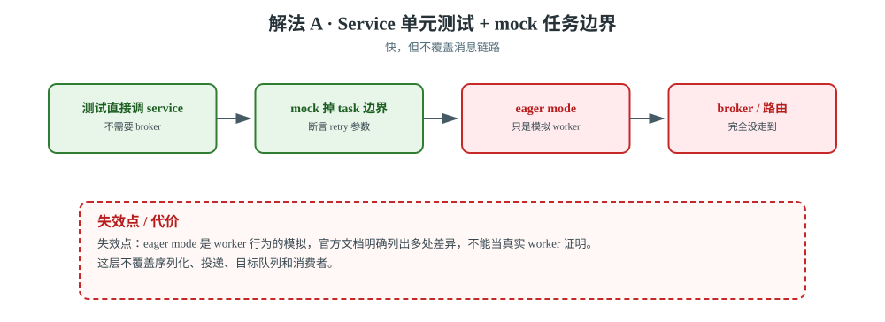
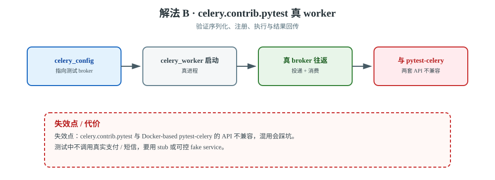
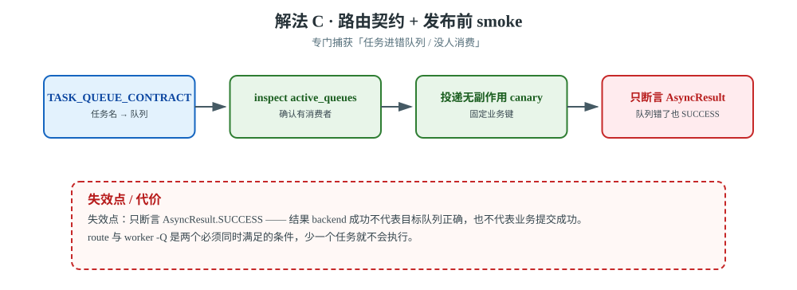
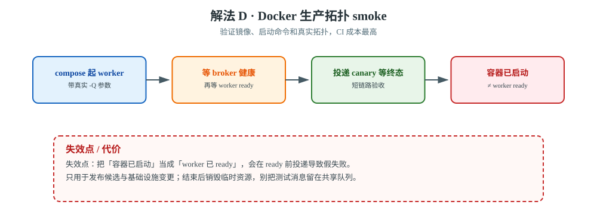

# 场景 11：测试通过但生产路由失效（经典设计题）

**场景描述**：团队的 Django 测试全绿，发布后却发现 `send_invoice` 进入了 `default` 队列，而线上 worker 只消费 `critical`；另一个任务使用 `countdown`，测试立即完成，生产却因 worker 重启而没有按预期执行。要求：测试既不把外部支付真正打出去，又要在发布前证明**任务注册、消息投递、目标队列、worker 消费与业务终态**是连通的。

**🔒 先自己想 30 秒**：`task_always_eager=True` 测到的是 worker 真实行为吗？"任务函数返回正确"能证明路由正确吗？测试的成本应该全部压在真实 broker 上，还是分层？

<details><summary>💡 提示（把"测试通过"拆成五段）</summary>

- 业务逻辑、任务包装器、序列化、broker 投递、worker 消费，分别应该在哪一层验证？
- 生产 worker 只监听 `critical`，测试是否真的检查了 `active_queues`？
- `celery.contrib.pytest` 的 embedded worker 与 Docker smoke plugin 是同一个东西吗？
- 你如何让测试失败时能回答"错在路由、worker 没启动，还是业务逻辑失败"？

</details>

<details><summary>📖 展开解法</summary>

### 解法一览

| 解法 | 效果（环境真实度 / CI 成本） | 代价 | 适用边界 |
|------|----------------------|------|---------|
| **A · Service 单元测试 + mock 任务边界** | 环境真实度：**最低（无 broker / worker）** / CI 成本：**最低** | 不覆盖 broker / worker / 路由 | 每次提交必跑 |
| **B · `celery.contrib.pytest` 真 worker 集成测试** | 环境真实度：中（真 worker + 测试 broker）/ CI 成本：中 | 依赖测试 broker，速度较慢 | 核心任务与关键回归 |
| **C · 路由契约 + smoke 测试** | 环境真实度：高（查 `active_queues` + canary）/ CI 成本：中 | 需要维护队列契约与 canary | 每次发布前必跑 |
| **D · Docker 生产拓扑 smoke** | 环境真实度：**最高（真实镜像与 -Q 拓扑）** / CI 成本：**最高** | CI 成本最高；不能代替单测 | 发布候选版本、基础设施变更 |



> **读图指引**：从下到上看成本递增、环境真实性递增；右侧的路由契约横穿 B/C/D 三层，说明"业务测试全绿"不能替代"目标队列有人消费"的验收。

#### 解法 A · 把业务逻辑移出 task，单元测试 mock 任务边界



> **读图**：测试直连 service 并把 task 边界 mock 住；红框提醒 eager 只是模拟，broker、路由与消费者完全没走到。

Celery 官方建议任务只处理序列化、消息头、重试等任务语义，实际业务逻辑放在普通函数或 service 中。这样测试不用启动 broker，也不需要打开 eager mode。

```python
# services.py
def build_invoice(invoice_id):
    invoice = Invoice.objects.get(id=invoice_id)
    return InvoiceService(invoice).build()

# tasks.py
@app.task(bind=True, autoretry_for=(ProviderTemporaryError,))
def build_invoice_task(self, invoice_id):
    return build_invoice(invoice_id)

# test_services.py
def test_build_invoice_does_not_call_provider(mocker, invoice):
    provider = mocker.patch('billing.services.InvoiceService.build')
    provider.return_value = {'number': 'demo'}
    assert build_invoice(invoice.id) == {'number': 'demo'}
```

这里测试的是业务规则和 task 边界，不声称覆盖真实消息链路。官方文档特别提醒：eager mode 只是 worker 行为的模拟，存在多处差异，不适合作为单元测试的替身。

**验证动作**：覆盖成功、参数校验、可重试异常、不可重试异常和幂等分支；对 task 本身只 mock service，断言 `retry` 的调用参数和业务键。

#### 解法 B · `celery.contrib.pytest` 启动 embedded worker



> **读图**：测试起真 worker 走一次真 broker 往返；红框提醒它与 Docker 版 `pytest-celery` 的 API 不兼容，不能混用。

```python
# conftest.py
import pytest

@pytest.fixture(scope='session')
def celery_config():
    return {
        'broker_url': 'redis://localhost:6380/15',
        'result_backend': 'redis://localhost:6380/15',
        'task_routes': {'billing.tasks.build_invoice_task': {'queue': 'critical'}},
    }

def test_task_runs_in_worker(celery_app, celery_worker):
    @celery_app.task
    def add(a, b):
        return a + b

    celery_worker.reload()
    assert add.delay(2, 3).get(timeout=10) == 5
```

这层能发现序列化、注册、worker 执行和结果 backend 的问题。测试插件默认会启动独立 worker；需要自定义监听队列时，在 `celery_worker_parameters()` 中设置 `queues`。不要把它和 Docker-based `pytest-celery` 混用：Celery 官方明确说明两套 API 不兼容。

**验证动作**：至少加入一个会跨 broker 的真实 task；显式设置 `shutdown_timeout`；测试中不调用外部支付，而是用 stub endpoint 或可控 fake service。

#### 解法 C · 路由契约 + 发布前 smoke



> **读图**：契约表、`inspect active_queues` 与 canary 三层共同证明「目标队列有人消费」；红框提醒只断言 `AsyncResult` 会被错队列骗过。

把"任务名 → 队列 → worker 消费者"当成可检查的契约，而不是散落在 settings、启动命令和文档里的约定。

```python
# celery_contract.py
TASK_QUEUE_CONTRACT = {
    'billing.tasks.build_invoice_task': 'critical',
    'orders.tasks.write_ledger': 'slow',
}

# settings.py
CELERY_TASK_ROUTES = {
    task_name: {'queue': queue}
    for task_name, queue in TASK_QUEUE_CONTRACT.items()
}
```

发布 smoke 至少做三件事：

```bash
# 1. 确认目标 worker 真的监听 critical
celery -A proj inspect active_queues --destination=worker@critical

# 2. 投递一条无副作用 canary，携带固定业务键
python manage.py publish_canary --task billing.tasks.build_invoice_task

# 3. 等待 canary 的业务终态，并记录实际 task id / queue / worker
python manage.py wait_canary --timeout 30
```

Celery 官方路由文档说明，`task_routes` 负责把任务送到命名队列，worker 还必须用 `-Q` 消费该队列；只配路由、不启动对应 worker，任务不会凭空执行。canary 不能只检查 `AsyncResult`，还要把目标队列和消费者纳入断言。

**验证动作**：故意把一条路由改错，确保 smoke 失败；故意让 worker 不监听 `critical`，确保失败信息指出"无消费者"而不是笼统超时。

#### 解法 D · Docker 生产拓扑 smoke（发布候选版本）



> **读图**：compose 先等 broker 健康、再等 worker ready，最后投 canary；红框提醒「容器已启动」不等于「worker 已 ready」。

当 Dockerfile、Compose、worker 启动参数或 broker 拓扑变化时，再启动真实拓扑做短链路验收：Web producer → broker → 专属 worker → stub service → 数据库终态。

```yaml
# compose.smoke.yml（片段）
services:
  worker-critical:
    image: ${IMAGE_TAG}
    command: celery -A proj worker -Q critical -c 1 --hostname=smoke-critical@%h
  smoke:
    image: ${IMAGE_TAG}
    command: pytest -q tests/smoke/test_task_route.py
    depends_on:
      - worker-critical
```

这层要把"容器已启动"与"worker 已 ready"分开：先等 broker 健康、再等 worker ready、最后投递 canary。测试结束后销毁临时资源，避免把测试消息留在开发或共享队列里。

### 非本栈替代路线（什么时候别引入完整 Celery 测试拓扑）

| 诉求 | Celery 侧的边界 | 替代路线 |
|------|----------------|---------|
| 只有简单定时批处理，不需要多队列 / Canvas | 真 broker + worker 测试拓扑的收益有限 | **Django management command + 数据库任务表 + Cron** |
| 需要事件流契约与多消费组 | Celery smoke 只能验证一次投递链 | **Kafka / Pulsar 的 schema / consumer contract test** |
| 需要长生命周期工作流验收 | 单个 task 的成功不能代表工作流可恢复 | **Temporal test server / workflow replay test** |

### 推荐路径（递进）

1. **每次提交**：A，业务逻辑单测 + task retry 边界 mock。
2. **核心任务回归**：B，最小真实 broker + embedded worker，验证消息链路。
3. **每次发布**：C，把任务路由、`-Q` 消费范围和 canary 终态写成契约。
4. **拓扑变更 / 发布候选**：D，用 Docker 还原启动参数和依赖，做短而真实的 smoke。

### 效果对比：怎么验证这一步真的有效

| 维度 | 怎么看 | 期望变化 |
|------|---------|---------|
| **误报 / 漏报定位能力** | 故意制造业务失败、路由错误、无 worker 三种故障 | 错误分别落在逻辑、路由、基础设施层 |
| **生产路由覆盖** | 统计契约中任务名是否都有 route、目标队列是否有消费者 | 关键任务 100% 有明确队列与消费者 |
| **测试反馈速度** | 记录 A/B/C/D 各层耗时与失败率 | 快测试挡普通回归，慢测试只覆盖高风险链路 |
| **生产前真实度** | canary 从 publish 到业务终态的时间与成功率 | 发布前能复现"错队列即超时"，而非上线后才发现 |

### 证据与核查

| 解法 | 依据 | 核查边界 |
|------|------|---------|
| A | 【官方】[Celery testing：mocking 与 eager 边界](https://docs.celeryq.dev/en/stable/userguide/testing.html) | eager 不作为真实 worker 证明 |
| B | 【官方】[Celery testing：`celery_app` / `celery_worker`](https://docs.celeryq.dev/en/stable/userguide/testing.html) | `celery.contrib.pytest` 与 Docker-based `pytest-celery` API 不兼容 |
| C | 【官方】[Celery routing](https://docs.celeryq.dev/en/stable/userguide/routing.html) | route 与 worker `-Q` 是两个必须同时满足的条件 |
| D | 【公认】发布候选版本用真实依赖做短 smoke | 不把 smoke 当完整业务回归；环境启动时间需在 CI 预算内 |

### 知识点挂钩

| 解法 | 回指课程 |
|------|---------|
| A/B · 调用、结果与测试 | [课 4《调用任务与取回结果》](../stages/2-Django集成与任务基础/lessons/lesson-04-调用任务与取回结果.md) |
| C/D · 路由、worker 与发布 | [课 9《生产部署与并发模型》](../stages/4-定时编排与生产运维/lessons/lesson-09-生产部署与并发模型.md) |
| 观测与上线验收 | [课 10《监控、排查与上线清单》](../stages/4-定时编排与生产运维/lessons/lesson-10-监控、排查与上线清单.md) |

### 什么情况下此方案不适用

- 只开 eager 就声称覆盖了 broker / worker / route：它没有经过真实消息链路。
- 只跑 embedded worker 就声称覆盖生产拓扑：它可能没有复现容器启动顺序、权限和真实 `-Q` 参数。
- smoke 直接调用真实支付、短信或物流 API：测试会产生真实副作用，应使用 stub 和业务幂等键。
- 测试只断言 `AsyncResult.SUCCESS`：结果 backend 成功不代表目标队列正确，也不代表业务提交成功。

### 做错会踩的坑

- 任务名改了但 route 契约没更新，回到[故障模式 1](../08-实战经验.md)的静默挂死。
- 只配 `task_routes` 没有 `worker -Q`，回到[场景 1](场景-01-流量翻10倍.md)的队列隔离陷阱。
- 把 `celery.contrib.pytest` 和 `pytest-celery` 当成同一套 API，按官方文档选择一套。
- 测试使用共享 Redis DB，残留消息污染下一轮测试；使用隔离 broker / DB，并在 teardown 后核对队列为空。

</details>

---

➡️ **返回**：[场景解法库索引](INDEX.md) ｜ **上一场景**：[场景 10 重试耗尽后的死信与安全重放](场景-10-重试耗尽后的死信与安全重放.md)
