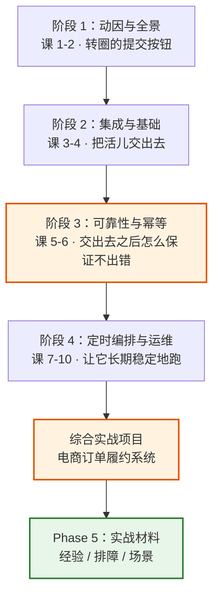
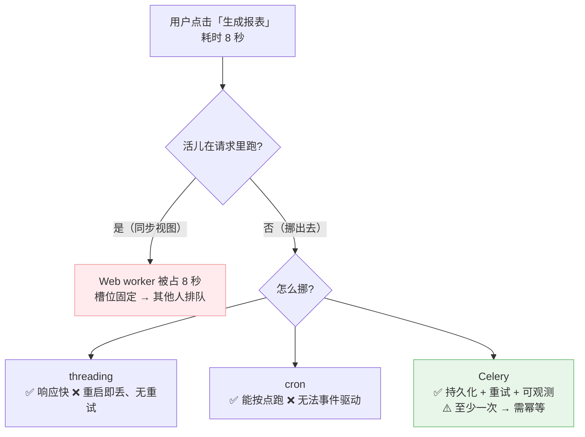
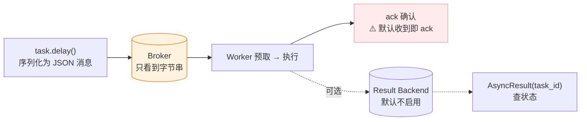
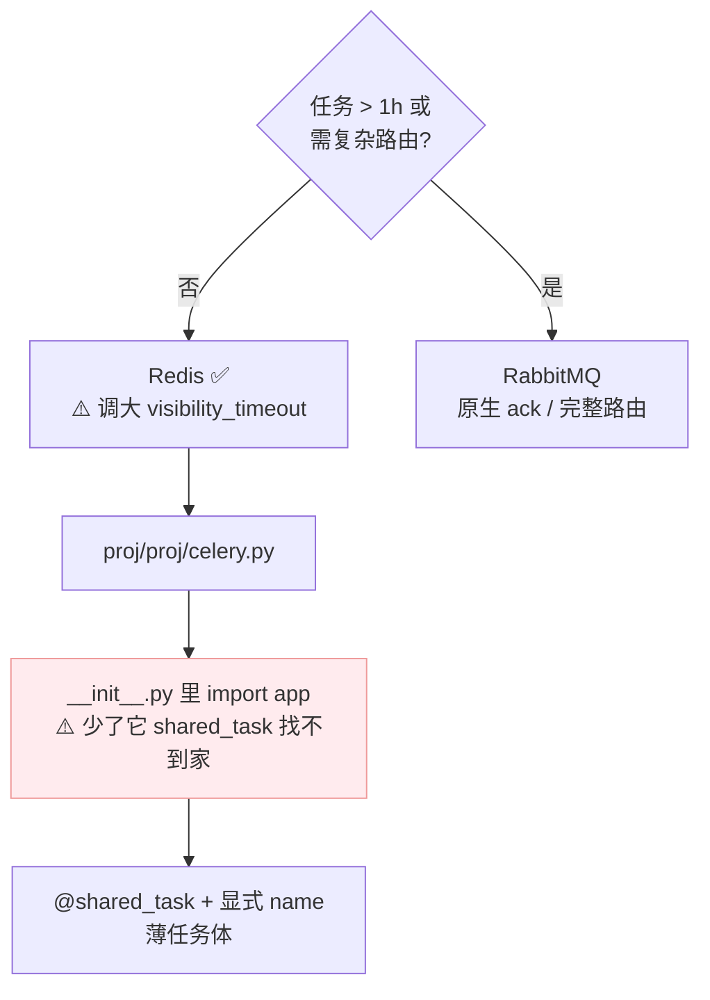
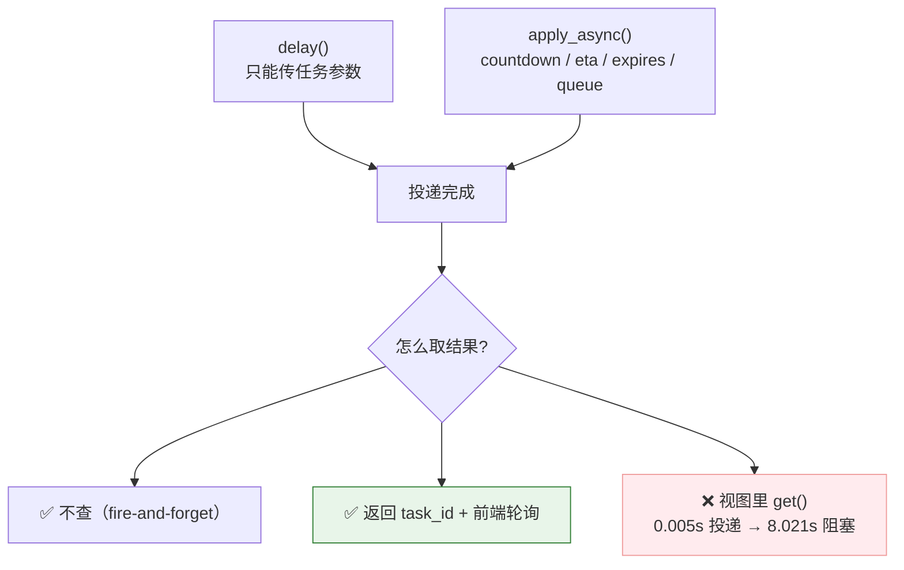
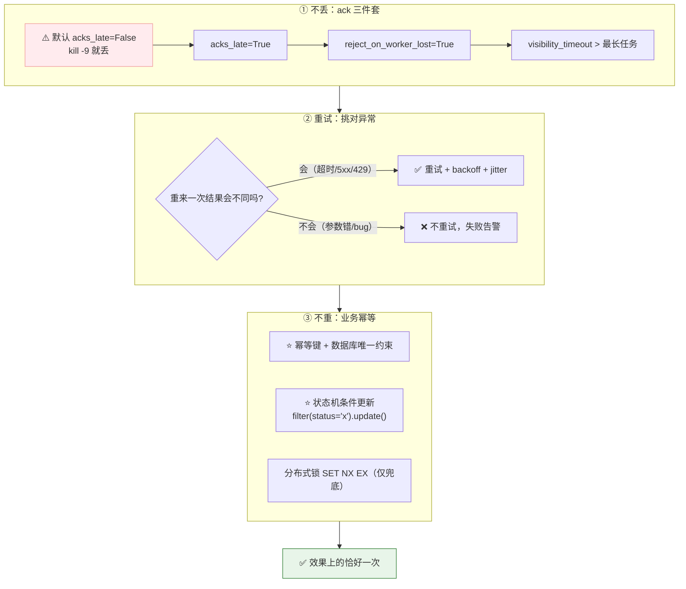
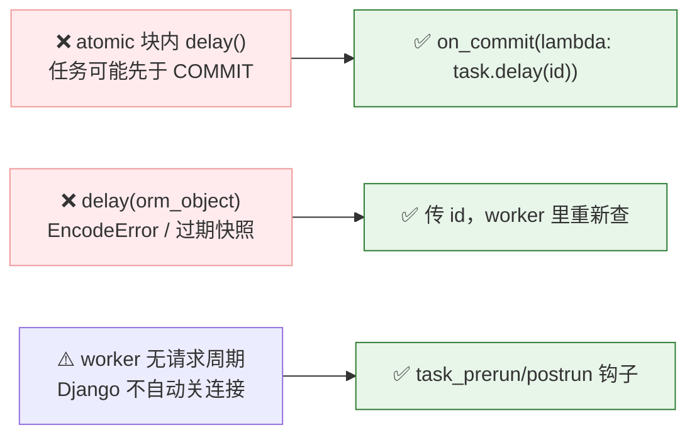
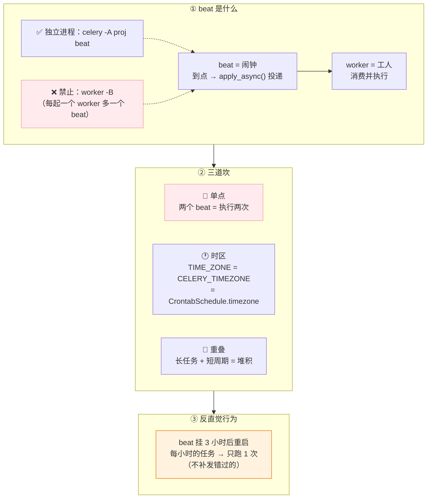
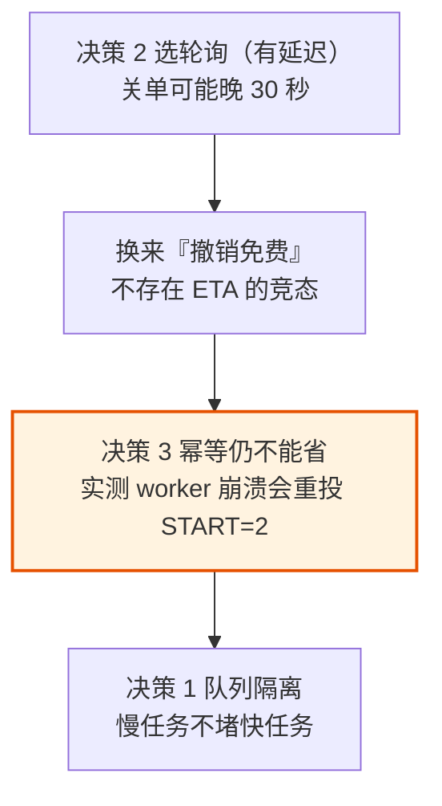

# Celery + Django 系统学习 · 课程手册

> **汇总手册** —— 4 阶段 / 10 课 / 30 知识点的完整索引与决策摘要。
> 基于 **Celery 5.6.3** + **Django 6.1**（2026 年）· 课程制 · 动手实操导向
> 收官日期：2026-09-02

**导航**：[学习档案](00-学习档案.md) ｜ [学习路径总览](01-学习路径总览.md) ｜ [课程目录](02-课程目录.md) ｜ [评审清单](00-评审清单.md)

**收尾三件套**：[08-实战经验](08-实战经验.md)（为什么会崩） ｜ [09-排障速查手册](09-排障速查手册.md)（崩了怎么止血） ｜ [10-场景解法库](10-场景解法库.md)（新需求怎么设计）

---

## 怎么读这份手册

这份手册是**索引与决策摘要**，不是讲义的替代品。它做三件事：

1. **一张图定位**：10 课每课保留「一图总结」，可用来快速回想起这课讲了什么。
2. **一组结论带回团队**：每课的「🎯 落地视角小结」是可直接汇报的结论。
3. **一条主线串起来**：四个阶段是故事的四个章节，回答同一个大问题。

**要动手细节请回原课** —— 手册不含可运行代码块、习题与完整推演。

| 你的状态 | 该翻哪份 |
|---------|---------|
| 想快速回忆某课 | 本手册对应章节的「一图总结」 |
| 要向团队汇报结论 | 本手册每课的「🎯 落地视角小结」 + 末尾「决策清单」 |
| 要动手敲命令 | [原课讲义](02-课程目录.md) |
| 线上出事了 | [09-排障速查手册.md](09-排障速查手册.md) |
| 想知道为什么会崩 | [08-实战经验.md](08-实战经验.md) |
| 新需求要设计 | [10-场景解法库.md](10-场景解法库.md) |

---

## 故事主线：一个"本该在后台跑的慢活儿"

> **🎭 主角**：一个本该在后台跑的慢活儿（发邮件 / 生成报表 / 调第三方接口）
> **💥 冲突**：它卡在 HTTP 请求线程里，把用户请求拖死
> **🎬 收束**：如何为 Django 项目设计一套「不丢、不重、可观测、可伸缩」的异步任务体系？

四个阶段是这条故事线的四个章节：

> **课 5 是整套课程的技术分水岭** —— 阶段 1-2 让你"能用"，阶段 3 才让你"敢上生产"。
> 而阶段 4 的每一件事（优雅停机、队列隔离、超时保护）**都依赖课 5 的幂等**才成立。

---

## 全局速查：最容易忘的硬数字

> 全部为本机实测（WSL2 / Python 3.12.3 / Celery 5.6.3 / Django 6.1 / Redis 7.0.15），
> 实测脚本见 [00-学习档案.md](00-学习档案.md) 与 `playground/`。

| 数字 / 阈值 | 含义 | 出处 |
|------------|------|------|
| `4 × 8 = 32` | 默认预取条数 = `prefetch_multiplier(4)` × `concurrency(CPU 核数)`。⚠️ **长任务场景要调成 1**（见下方说明） | 课 2 / 课 5 |
| `visibility_timeout = 1h` | Redis broker 默认值；**必须 > 最长任务时长** | 课 5 |
| **≈ 100 秒** | kombu 重投检查周期（源码 `10s × 10`），实测 **88.8s** | 课 5 / Phase 5 实测 |
| **70~110 秒** | 长任务触发重投的临界区间（vt=5s 时） | Phase 5 实测 |
| `prefork c=8: 12.62s` / `gevent c=8: 12.89s` / `threads c=8: 19.69s` | 同并发下三种池**几乎无差别** | 课 9 |
| `gevent c=200: 0.91s` | 提速来自**并发数**，不是协程本身 | 课 9 |
| **4.4 倍** | CPU 密集任务用 threads 比 prefork **慢** | 课 9 |
| `10 行` vs `27 行` | Flower 不开 `-E` 只有心跳；开了才有任务事件 | 课 10 |
| `300 任务 = 300 条 key` | 不设 `ignore_result` 时 result backend 的堆积量 | 课 10 |
| `10 KB` | 建议的消息体上限（传 id，不传对象） | 课 6 |
| `3 小时 → 只跑 1 次` | beat 挂掉后**不补发**错过的次数 | 课 7 |
| `prefetch_multiplier=1` | **长任务场景**必调：默认 4 会让先启动的 worker 囤货、后启动的饿死 | 课 9 |
| `REMAP_SIGTERM=SIGQUIT` | 容器环境发版不丢任务的关键（**环境变量**，写进 settings.py 无效） | 课 9 |

> ⚠️ **两个容易混淆的"知识点数"**：课程共 **30 个知识点**（10 课 × 3），
> 而实战项目的知识点地图列出的是 **22 个** —— 那是项目**实际用上的**知识点，
> 不等于课程总量（部分知识点如"cron 的边界"属于认知铺垫，不直接落地为代码）。

> ⚠️ **`prefetch_multiplier` 为什么有两个值**：默认 **4** 对**短任务**更优（减少网络往返、提高吞吐）；
> 长任务场景调成 **1**，否则一个 worker 预取 32 条会把任务全囤在自己手里，其他 worker 饿死。
> 判断标准：**任务耗时是否同量级** —— 同量级用 4，差异大用 1 并配合队列隔离。

---

## 阶段 1 · 异步化的动因与 Celery 全景

> **故事章节**："转圈的提交按钮" —— 回答**为什么需要**与**它怎么工作**。

### 课 1 · 为什么需要异步任务

**🎯 落地视角小结**
- 慢活儿的本质是**占坑**，不是"慢" —— 加机器只能推后临界点（4 个 sync worker、8 个并发请求，第 7 个要等 16 秒）。
- **响应速度与可靠性是两件正交的事**：threading 只解决前者，持久化才解决后者。
- Celery 的核心价值是**把任务变成持久化的消息** —— 所以它能被重投、被监控、被跨机消费。

**⚠️ 最容易踩的三条**
1. "加 worker 能根治慢请求" → 只推后临界点，worker 数受内存硬限制。
2. "Celery 让任务变快" → 单任务耗时不变甚至略增，优化的是**吞吐与响应**。
3. "用了 Celery 就不用管幂等" → 它是**至少一次**投递，幂等必须业务侧实现。

→ [原课讲义](stages/1-异步化的动因与Celery全景/lessons/lesson-01-为什么需要异步任务.md)

### 课 2 · Celery 架构全景与消息流转

**🎯 落地视角小结**
- **一句话读图**：左边只管塞消息，中间只管存消息，右边只管取消息 —— 三者互不认识；Result Backend 是**可选项**。
- 三条贯穿全课程的底层事实：① 任务是**消息**不是执行流 ② 默认 `acks_late=False` **会丢任务** ③ 投递语义是**至少一次**。
- `delay()` 返回的不是 Future，只是一张凭 `task_id` 查状态的**查询票**。

**⚠️ 最容易踩的三条**
1. "worker 必须和 Django 一起启动" → 不需要，broker 把两者解耦。
2. "状态 PENDING = 没执行" → 三种可能：没配 backend（最常见）/ worker 没起 / 任务名不对。**先看 worker 日志**。
3. "消息里存的是函数对象" → 存的是**函数名字符串 + 参数**，名字对不上就 `NotRegistered`。

→ [原课讲义](stages/1-异步化的动因与Celery全景/lessons/lesson-02-Celery架构全景与消息流转.md)

---

## 阶段 2 · Django 集成与任务基础

> **故事章节**："把活儿交出去" —— 从"能跑起来"到"能掌控扔出去之后发生了什么"。

### 课 3 · 第一个 Celery + Django 项目

**🎯 落地视角小结**
- Broker 选型判据：**任务 > 1h 或需精确延迟/复杂路由 → RabbitMQ**；否则 Redis 够用，但要调大 `visibility_timeout` 并在业务侧做幂等。
- 集成三步骨架里，`__init__.py` 的 `from .celery import app as celery_app` 是新手第一大坑（缺了报 `ImproperlyConfigured`）。
- **这个骨架能跑通，但还不能上生产** —— 它有三个已知隐患（会丢 / 会重 / 事务脏读），分别在课 5、课 5、课 6 拆掉。

**⚠️ 最容易踩的三条**
1. broker 与缓存共用同一个 Redis 实例 → 被 key 淘汰策略搞出 `InconsistencyError`，至少分 db。
2. 配了 `namespace='CELERY'` 却用小写配置名 → **静默退回默认值**，"明明配了 Redis 却去连 RabbitMQ"。
3. 业务逻辑全塞进任务函数 → 难测试难复用；**任务要薄**，只做调度/日志/重试/异常转译。

→ [原课讲义](stages/2-Django集成与任务基础/lessons/lesson-03-第一个Celery+Django项目.md)

### 课 4 · 调用任务与取回结果

**🎯 落地视角小结**
- 阶段 2 的核心转变：从"能把任务扔出去"到"**能掌控扔出去之后发生了什么**"。
- **头号警告：绝不在视图里 `get()`** —— 异步白做。正确姿势是返回 `task_id` + 前端轮询 `AsyncResult`。
- **ETA / countdown 任务不进队列**，它们被 worker 预取后留在**内存**里 → 队列长度监控会漏统计、重启 worker 会丢。

**⚠️ 最容易踩的三条**
1. `delay()` 里传 `countdown` → `TypeError`，投递选项必须用 `apply_async`。
2. 一边要进度条一边设 `ignore_result=True` → 自相矛盾。
3. 以为 `result_expires` 会自动生效 → 需要 **beat 在跑** `celery.backend_cleanup`，否则撑爆 Redis。

→ [原课讲义](stages/2-Django集成与任务基础/lessons/lesson-04-调用任务与取回结果.md)

---

## 阶段 3 · 可靠性与幂等

> **故事章节**："交出去之后怎么保证不出错" —— **这是整套课程的技术分水岭**。
> 阶段 1-2 让你"能用"，阶段 3 才让你"敢上生产"。

### 课 5 · 确认机制与重试策略

**🎯 落地视角小结**（这张表就是本课的全部）

| 配置 | 投递语义 | 代价 |
|------|---------|------|
| 默认（`acks_late=False`） | **最多一次** | 可能**丢**任务 |
| `acks_late` + `reject_on_worker_lost` | **至少一次** | 可能**重复**执行 |
| 上述 **+ 业务幂等** | **效果上的恰好一次** | 需要你自己设计幂等 |

- **Celery 不提供开箱即用的"恰好一次"** —— 它给你"不丢"的保证，"不重"由你的业务代码负责。
- 生产三件套：`acks_late` + `reject_on_worker_lost` + 大于最长任务时长的 `visibility_timeout`。
- **幂等优先用数据库唯一约束，别用应用层的"先查后写"** —— 后者有并发竞态。

**⚠️ 最容易踩的三条**
1. "开了 `acks_late` 就不会丢任务" → 还**必须**配 `reject_on_worker_lost=True`（默认 False）。
2. 以为 `max_retries=3` 是"总共执行 3 次" → 实际是**首次 + 3 次重试 = 4 次**。
3. `autoretry_for=(Exception,)` → 把代码 bug 也纳入重试，掩盖真问题。

> 🔬 **实测修正了一条网传说法**："countdown > visibility_timeout 就会重复执行"在本环境**未复现**
> （countdown=20 vs vt=1，差 20 倍，仍只执行 1 次，标 `⏳ 置信度：中`）。
> 真正会让长任务重投的是 kombu 的**重投检查周期 ≈ 100 秒**（源码 `10s × 10`，实测 88.8s），
> 临界区间在 **70~110 秒**。详见 [08-实战经验](08-实战经验.md) 故障模式 11。

→ [原课讲义](stages/3-可靠性与幂等/lessons/lesson-05-确认机制与重试策略.md)

### 课 6 · Django 事务与 ORM 的坑

**🎯 落地视角小结**
- **阶段 3 完成，课 3 列出的三个隐患全部清空**：会丢（课 5 ack）→ 会重（课 5 幂等）→ 事务脏读（课 6 `on_commit`）。
- `on_commit` 的**隐藏价值**：事务回滚时回调**根本不会执行**，任务也就不会发出去。
- 本课的坑都是 **"Celery + Django 组合特有"** 的 —— 纯 Celery 项目（无 ORM、无事务）永远不会遇到。

**⚠️ 最容易踩的三条**
1. "本地复现不了就没问题" → 竞态类 bug 在**生产高负载下必然触发**（本地 worker 通常空闲，等得起）。
2. "配了重试就不需要 `on_commit`" → 重试是兜底，`on_commit` 是**根因修复**。
3. "`CONN_MAX_AGE=0` 就不会泄漏" → 它的语义是"请求结束时关"，**worker 里没有请求**。

→ [原课讲义](stages/3-可靠性与幂等/lessons/lesson-06-Django事务与ORM的坑.md)

---

## 阶段 4 · 定时、编排与生产运维

> **故事章节**："让它长期稳定地跑" —— 按时跑 · 可编排 · 上生产 · 可观测。

### 课 7 · beat 与周期性任务

**🎯 落地视角小结**（四条硬结论，默认配置全都帮不了你）
1. **beat 只投递不执行** —— 与 worker 完全解耦，可独立启停。
2. **beat 必须单点** —— **无任何内置锁**，两个 beat = 执行两次。
3. **beat 不补发** —— 挂 3 小时后重启，每小时的任务**只跑 1 次**。
4. **时区三要素要对齐** —— `TIME_ZONE` / `CELERY_TIMEZONE` / `CrontabSchedule.timezone`。

**⚠️ 最容易踩的三条**
1. 生产用 `worker -B` 更省事 → **绝对禁止**，每起一个 worker 就多一个 beat，任务重复投递 N 次。
2. `beat_cron_starting_deadline=None` 理解为"不补跑" → 实际是"**总是立即补跑一次**"。
3. 用 `cache.add()` 加锁保证单点 → `LocMemCache` 是**进程内**缓存，锁不共享。

→ [原课讲义](stages/4-定时编排与生产运维/lessons/lesson-07-beat与周期性任务.md)

### 课 8 · canvas 任务编排

**🎯 落地视角小结**
1. **`s()` vs `si()`** —— 参数错位的头号原因。判断口诀：**下一步要不要用上一步的结果？要 → `s()`；不要 → `si()`**。
2. **⛔ 任务里绝不能等其他任务** —— 会死锁；要汇聚就用 chord。
3. **canvas 是轻量编排，不是工作流引擎** —— 官方原话"同步步骤很昂贵，应尽可能避免 chord"；需要"被记住、被查询、被干预"的流程请换引擎。
4. **chord 强制需要 result backend**，且 header 任务**不能**设 `ignore_result=True`。

**⚠️ 最容易踩的三条**
1. chain 中间步骤误用可变签名 → 参数被上一步结果顶掉（本课头号 bug）。
2. 以为 chord 失败会自动重试 → 硬失败时 **body 不执行**，必须绑 `errback` 兜底。
3. 重写 `after_return` 忘了 `super()` → chord body **静默不执行**，且无任何报错。

> 🔬 **本项目实跑纠正了一个错误结论**：chord 挂死时，积压在 `default` 队列的是**编排入口 `fulfill_order` 自己**
> （漏配路由），**不是** `chord_unlock`。Redis backend 有原生 chord 协调，**不产生中间任务**。
> 详见 [设计决策 · 决策 4](projects/电商订单履约系统/设计决策.md)。

→ [原课讲义](stages/4-定时编排与生产运维/lessons/lesson-08-canvas任务编排.md)

### 课 9 · 生产部署与并发模型

**🎯 落地视角小结**
1. **并发模型的收益来自"并发数"，不是"池类型"** —— 同并发下三种池几乎无差别（12.6s / 12.9s / 19.7s）；
   gevent 的价值是"让你能安全地开到几百并发"（c=200 → 0.91s），不是"协程更快"。CPU 密集用 prefork（threads 慢 **4.4 倍**）。
2. **停机有四个阶段，别只会用 `TERM`** —— warm 等任务跑完、soft 限时宽限并归还、cold 立刻砍掉；
   容器环境必须配 `REMAP_SIGTERM=SIGQUIT`（**环境变量**，写进 settings.py 无效）。
3. **队列隔离是延迟保证的来源，不是优先级** —— 路由表只管"发到哪"，**专属 worker** 才管"多久被处理"；
   `-Q fast,bulk` 是轮流取，不是 fast 优先。
4. **优雅停机不是"不重跑"，是"不丢失"** —— 两者是不同层的事，前者靠课 5 的幂等。

**⚠️ 最容易踩的三条**
1. 配了 `acks_late` 以为发版不丢任务 → 它只保证"崩溃后重入队"，不保证"正在跑的能跑完"。
2. `TimeoutStopSec` 小于 soft shutdown 超时 → 宽限期没走完就被强杀。
3. Redis 上配 `priority` 以为能插队 → 不配 `queue_order_strategy` + `prefetch=1` 就**静默失效**。

→ [原课讲义](stages/4-定时编排与生产运维/lessons/lesson-09-生产部署与并发模型.md)

### 课 10 · 监控、排查与上线清单

**🎯 落地视角小结**
1. **可观测性的地基是 `task_id`** —— Flower 不开 `-E` 就是空白页（实测 **10 行**心跳 vs **27 行**事件）；
   比 Flower 更根本的是把 `task_id` 打进每条日志，它是出事后唯一能串联全链路的钥匙。
2. **绝大多数故障都有对应的"兜底配置"** —— 卡死靠 `soft_time_limit`（实测 3.1s 自动解除）、堆积靠算消费能力账、
   泄漏靠 `--max-tasks-per-child`、结果堆积靠 `result_expires` / `ignore_result`（300 任务 = 300 条 key）。
3. **Celery 的安全模型是"信任 broker"** —— 防线只在两处：**谁能往 broker 写**（官方文档列在第一条）、
   worker 接受什么格式（`accept_content=['json']`）。Flower 默认无鉴权且有执行/关停 API（CVE-2022-30034，CVSS 8.6）。

**回扣全课程**：这 10 课其实只讲了一件事 —— **把"至少一次投递"这个承诺，变成"业务上真正不出错"**。
课 5 的幂等兜住重复执行，课 6 的 `on_commit` 兜住事务边界，课 7 的心跳兜住静默故障，课 9 的优雅停机兜住发版丢任务，
本课的超时兜住僵尸任务、清单兜住上线遗漏。**每一课的"兜底"都是同一个思路：承认系统会出错，提前配好退路。**

**⚠️ 最容易踩的三条**
1. 只监控队列长度 → 分不清"峰值"和"真堵了"，**要监控等待时长**。
2. "任务卡住会自动超时" → **默认无超时**，不配就永久卡死（实测：快任务 6 秒排不上）。
3. `from celery import SoftTimeLimitExceeded` → Celery 5.6.3 会 `ImportError`（本课实跑踩到），
   正确是 `from celery.exceptions import SoftTimeLimitExceeded`。

→ [原课讲义](stages/4-定时编排与生产运维/lessons/lesson-10-监控、排查与上线清单.md)

---

## 综合实战项目

### [电商订单履约系统](projects/电商订单履约系统/README.md)

**一句话需求**：下单后 15 分钟未支付自动关单并回滚库存，支付成功后异步走「发券 → 通知 → 对账」编排链路，
全程可观测、可排查，且任何环节崩溃都不能造成重复扣款或库存超卖。

**为什么值得做**：10 课里每课只验证**单个**知识点，但真实系统中它们**同时**起作用 ——
开了 `acks_late` 就要想清楚重试几次、选了队列隔离就得接受运维复杂度上升、做了幂等还要分清重复来自生产侧还是消费侧。
这些**交叉点**才是工程里真正咬人的地方。

| 指标 | 达成 |
|------|------|
| 知识点覆盖 | **4 阶段 / 22 个知识点**，逐个回指课时 |
| 非功能约束 | 正确性 / 错误处理 / 性能 / 可观测性 / 安全 **5 项** |
| 设计决策 | **5 个**，每个都有真实争议与翻转条件 |
| 反例对照 | **8 条**，"能跑但很糟"的版本逐条对比 |
| 验收清单 | **30 项**，`verify.sh` **6/6 通过** |

| 产物 | 内容 |
|------|------|
| [README](projects/电商订单履约系统/README.md) | 需求 + 知识点地图 + 运行方式 |
| [设计决策](projects/电商订单履约系统/设计决策.md) | 5 个真权衡点的完整论证 |
| [反例对照](projects/电商订单履约系统/反例对照.md) | "能跑但很糟"的版本 + 8 条对比 |
| [实现](projects/电商订单履约系统/实现/) | 可运行代码（中文注释，标注对应知识点） |
| [验收清单](projects/电商订单履约系统/验收清单.md) | 30 项自测 + 自动化脚本 |

### 五个设计决策（含翻转条件）

| # | 决策点 | 选择 | 放弃了什么 | 翻转条件 |
|---|--------|------|-----------|---------|
| 1 | 队列隔离 | 拆队列 + 专属 worker | 运维简单度、内存 | 任务耗时同量级 → 不拆 |
| 2 | 超时关单 | beat 轮询 | 秒级精度 | 关单窗口 < 1 分钟 → 改 ETA |
| 3 | 幂等实现 | CAS 状态机 | 极致性能 | 无状态字段可用 → 改 SET NX |
| 4 | chord 挂死的修法 | **补漏配的路由** | "让 worker 消费 default"这个诱人捷径 | 用了无原生 chord 协调的 backend → 真需要消费 default |
| 5 | 外部服务调用 | 可注入 mock | 代码最简 | 生产代码 → 依赖注入 client |

**决策之间不是孤立的**，它们咬合成一条链：

> **如果决策 2 改选 ETA**，决策 3 就从"防崩溃重投"升级为"还要防撤销竞态"，幂等的重要性进一步提高 ——
> 这也从侧面说明 **幂等是整个系统里最不该省的那一项**。

### 实跑抓出的 5 个真 bug

> 这些是"写完就跑"抓出来的，不是事后编的检查项 —— 也说明为什么验收清单不能只靠肉眼看。

1. 日志用相对路径 `logs/celery.log` 而目录不存在 → **Django 启动直接崩溃**
2. 缺 `manage.py` → 项目跑不起来
3. `CELERY_TASK_ROUTES` 漏配 `issue_coupon` → 它进 `default` 队列，**chord 永不完成**
4. chord 的**编排入口** `fulfill_order` 漏配路由 → 整个编排根本没开始，**chord 静默挂死**
5. 外部短信服务写死真实 URL → demo 开箱即挂

> 🔴 **一条值得单独记住的教训**：第 4 条最初被误判为"chord 解锁任务走 default 队列，必须让 worker 消费 default"。
> 这个修复**确实有效**，但它会**永久掩盖漏配路由的真因**。后来解出积压消息的真实任务名才发现是 `fulfill_order` 自己漏配了路由。
> **"一个修复方案有效" ≠ "对根因的判断正确"**，尤其"扩大范围兜底"型修复。

---

## 决策清单

> 带回团队用的四张结论表。

### 该不该用 Celery

| 场景 | 结论 |
|------|------|
| 慢活儿（发邮件/生成报表/调第三方 API） | ✅ 标准用法 |
| 需要重试、可观测、跨机扩展的后台任务 | ✅ 核心优势 |
| 毫秒级强实时路径 | ❌ 消息经过 broker，有额外延迟 |
| 长事务 / 人工审批流程 | ❌ 该换工作流引擎（canvas 不是引擎） |
| 纯定时任务且无需事件驱动 | ⚠️ cron 更轻；但 Celery 能补上重试与可观测 |

> 完整的"别用 Celery 的五种情况"见 [08-实战经验](08-实战经验.md) 第一节。

### 该选 Redis 还是 RabbitMQ

| 判据 | 选择 |
|------|------|
| 任务 > 1 小时 | RabbitMQ（Redis 靠 `visibility_timeout` 模拟 ack，长任务会被重复投递） |
| 需精确延迟 / 复杂路由 / 优先级 | RabbitMQ（原生支持） |
| 大多数 Web 业务（短任务 + 运维简单） | **Redis**，但必须调大 `visibility_timeout` 并在业务侧做幂等 |

### 上生产前必开的配置

| 配置 | 不配的后果 |
|------|-----------|
| `task_acks_late=True` | worker 被 kill 时**丢任务** |
| `task_reject_on_worker_lost=True` | 只开上面一条**仍然会丢**（默认 False） |
| `visibility_timeout > 最长任务时长` | 长任务被**重投**（kombu 检查周期 ≈100 秒） |
| `soft_time_limit` / `time_limit` | 卡死任务**永久占住** worker 槽位（默认无超时） |
| `transaction.on_commit` 发任务 | worker 查不到未提交的数据（**本地不复现，生产必然触发**） |
| `accept_content=['json']` | pickle 反序列化 **RCE** 风险 |
| `prefetch_multiplier=1`（长任务） | 默认 4 会让 worker 囤货，其他 worker 饿死 |
| 队列路由 + **专属 worker `-Q`** | 只配 `task_routes` 没有 worker 消费那个队列 = **任务永远没人执行** |
| broker 设密码 | Celery 的安全模型是"信任 broker"，官方把这条列在**第一位** |
| Flower 加鉴权 + 不暴露公网 | 默认无鉴权 + 有执行/关停 API（CVE-2022-30034，CVSS 8.6） |

> 完整的上线 Checklist 见 [08-实战经验](08-实战经验.md) 第四节。

### 出问题时的三条分流

| 你的状态 | 去哪 |
|---------|------|
| 崩了，要马上止血 | [09-排障速查手册](09-排障速查手册.md)（症状索引表 → 11 条条件-动作表，每条先止血后定位） |
| 想知道为什么会崩 | [08-实战经验](08-实战经验.md)（11 条故障模式，五段式 + 实测依据） |
| 新需求来了要设计 | [10-场景解法库](10-场景解法库.md)（8 个场景 × 5 个解法，**先想后看**） |

---

## 🚀 接下来可以做什么

- **避坑**：复制"给我讲讲 Celery 的实战经验、排障手册与场景解法库" —— 三份已完成：
  [08-实战经验.md](08-实战经验.md) ｜ [09-排障速查手册.md](09-排障速查手册.md) ｜ [10-场景解法库.md](10-场景解法库.md)
- **动手**：按 [实战项目 README](projects/电商订单履约系统/README.md) 跑一遍 `verify.sh`，6 项验收全过才算真会。
- **复盘**：复制"考我一下 Celery，针对 {薄弱点}"进行知识点对齐。
- **进阶**：告诉我下一步想深入的方向，我会基于当前档案调整大纲继续。

---

> 本手册由 `topic-teach` Phase 4 汇总生成（2026-09-02）。
> 完整进度与评审记录见 [00-学习档案.md](00-学习档案.md)；课时索引见 [02-课程目录.md](02-课程目录.md)。
