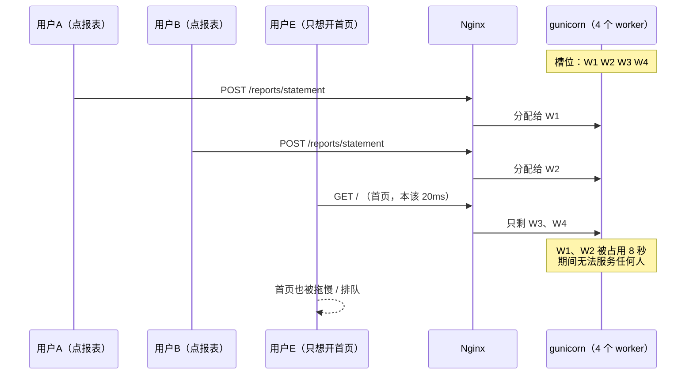
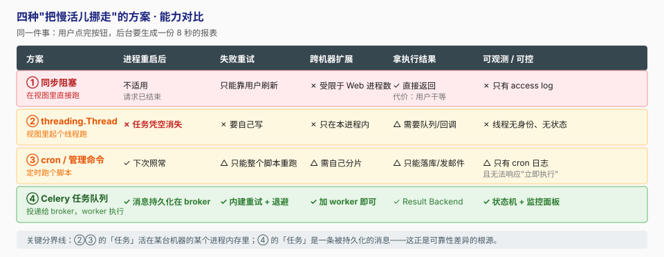
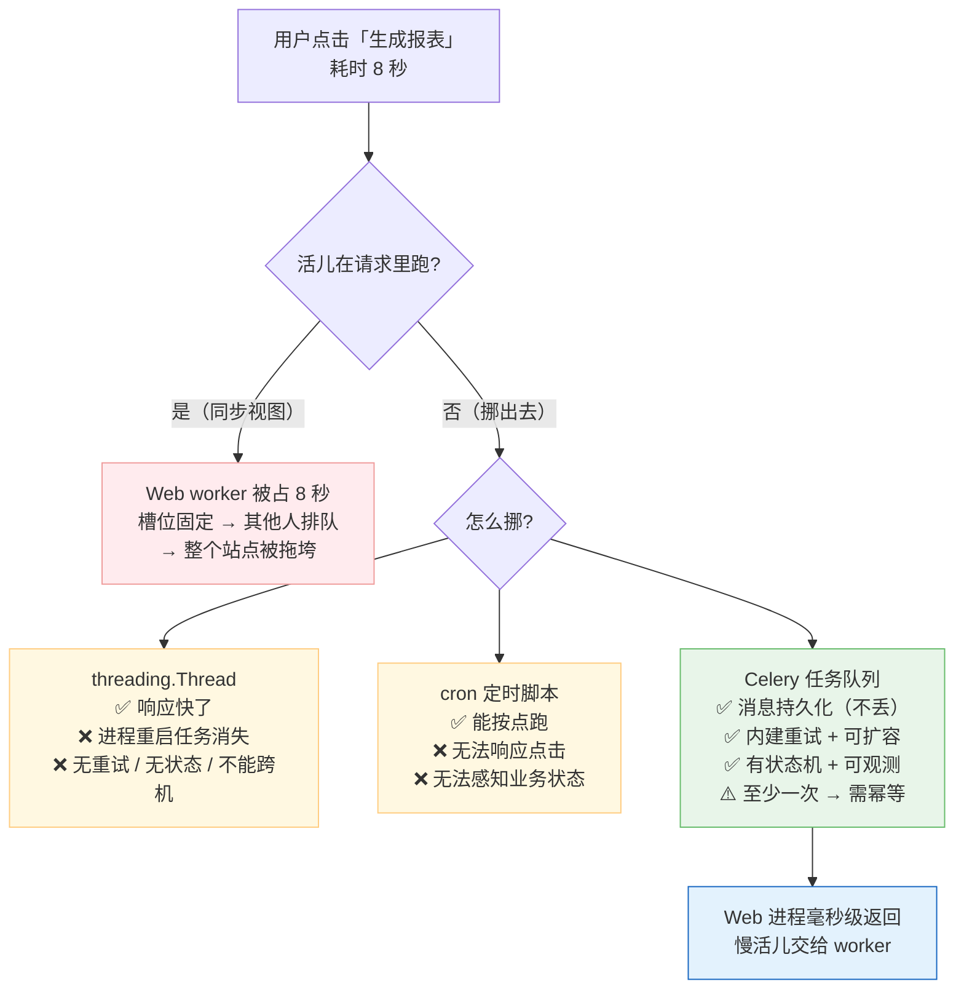

# 第 1 课：为什么需要异步任务

> 所属阶段：阶段 1《异步化的动因与 Celery 全景》｜ 水平：入门 ｜ 本课知识点：同步请求里的慢活儿、"土办法"为什么不够、Celery 的诞生与定位
> 故事情节：主角（那个"本该在后台跑的慢活儿"）第一次登场 —— 它卡在请求线程里，用户开始转圈，然后整个站点跟着一起慢

## 🎯 本课目标

- 说清慢活儿拖垮站点的**真实机理**（不是"慢"，是"占着 worker 不放"）
- 说清 `threading` / `cron` 这类土办法的能力边界（它们只解决响应速度，不解决可靠性）
- 说清 Celery 的定位与**它不解决什么**，避免把 Celery 当万能药

---

## 第一幕：起源与场景引入

> 🏛️ **起源**（核查于 2026-08）：Celery 由丹麦开发者 **Ask Solem** 于 **2009 年**创建并开源。它在 PyPI 上的首个版本描述直白地写着 *"Distributed Task Queue for Django"*——**它生来就是为了解决 Django 应用里"慢活儿卡住请求"这个痛点**。项目早期曾用过 `crunchy` 这个名字，同年改名为 celery。

🎬 **场景**：

你是公司内部运营平台的 Django 开发。运营同学在页面上点一个按钮——「生成月度对账单」。这个操作要做的事：

1. 拉取 3 万条订单记录
2. 按维度聚合计算
3. 渲染成 PDF
4. 上传到对象存储
5. 给运营发一封通知邮件

本地测试跑完 **8 秒**，你觉得"还行"，就上线了。

上线第一天，运营群炸了：

> "点了没反应……"
> "一直在转圈……"
> "页面 504 了！"
> **"首页怎么也打不开了？？"**

---

## 第二幕：认知冲突

你的第一反应很自然：**服务器不行，加机器。**

于是你加了机器、把 gunicorn 的 worker 数从 4 提到 16。慢请求还是 8 秒一个（单个请求本来就那么久），但"首页打不开"的现象确实缓解了。

可是到了月底——运营集中导出的高峰期——老毛病又来了，而且更严重：

> 一个"生成报表"的按钮，凭什么能把**整个站点**拖垮？
>
> 我明明已经起了线程去跑，"部署重启一次就再也收不到邮件"又是怎么回事？

❓ **问题：为什么加机器只能缓解不能根治？为什么"起了线程"之后任务还是丢了？**

---

## 第三幕：层层揭示

### 知识点 1：同步请求里的慢活儿

> 关键点：请求-响应周期与 worker 占用 ／ 超时级联与雪崩 ／ 用户体验与资源浪费

#### 一句话定义

同步视图中，**一个请求的生命周期 = 一个 Web worker（进程或线程）被独占的时长**。慢活儿的问题不是"慢"，是"占着坑不让别人用"。

#### 直觉建立（类比）

把 Web 服务器想成一家餐厅，worker 就是服务员：

- 餐厅有 **4 个服务员**（gunicorn `--workers 4`）
- 一桌客人点了"现炖 8 小时的老火汤"，服务员就**站在桌边干等**，全程不服务别人
- 只要有 **4 桌**同时点这道汤，整个餐厅就没人干活了——**连想点杯水的客人都没人搭理**
- 真实餐厅怎么做？服务员把单子**交给后厨**，自己立刻去服务下一桌

> 💡 **类比的边界**：餐厅里服务员最终还得回来上菜（请求必须返回结果）。异步化之后，"上菜"变成了"做好了通知你"——这不只是提速，而是**交互方式的改变**。这个改变有代价（阶段 3 会讲），别把它当成免费的。

#### 核心原理

**① Django 本身不管并发，是 WSGI server 在管。**

Django 只是个框架，真正接受连接、分发请求的是 gunicorn / uWSGI 这类 WSGI server。在最常用的 **sync worker（同步工作进程）** 模式下，**一个 worker 进程同一时刻只能处理一个请求**。

**② worker 数量是固定的，慢请求占用的是"槽位"。**



`--workers 4` 意味着**只有 4 个并发槽位**。一个 8 秒的请求占用一个槽位 8 秒，这 8 秒里这个槽位**服务不了任何其他人**。

**③ 超时级联：从"体验差"演变成"事故"。**

```
单个请求 8 秒
  ↓ 高峰期槽位被占满，请求开始排队
排队请求等到 30 秒 → Nginx proxy_read_timeout 触发 → 504
  ↓ 用户看到"失败"，本能地重复点击、刷新
又产生 3 个新的 8 秒请求 → 更多槽位被占 → 排队更长
  ↓
雪崩：连首页、健康检查都超时，负载均衡把这台机器摘掉，压力转移到其他机器
```

**注意这条链路的关键点**：从始至终 CPU 没跑满、数据库没到瓶颈、网络也没问题。**纯粹的"占坑"就足以让整个站点不可用。**

**④ 被占的不只是槽位——是整个请求上下文的资源。**

一个活着的请求会同时占着：

| 被占的资源 | 后果 |
|-----------|------|
| Web worker 进程/线程 | 并发槽位少一个（前面讲的） |
| **数据库连接** | Django 的 `CONN_MAX_AGE` 让连接在请求结束后仍留在进程的连接池里复用。慢请求意味着这条连接**长时间被这个请求独占**，连接数打满后其他 worker 会卡在"等连接"上 |
| **进程内存** | 3 万条订单聚合出来的中间对象、渲染中的 PDF，全在 worker 进程堆里。8 秒 × 4 个并发 = 峰值内存翻 4 倍 |
| **文件句柄 / 临时文件** | 生成中的 PDF 通常要落临时文件，句柄没释放前一直占着 |

> 💡 这就是为什么"慢请求"常常伴随"数据库连接池耗尽"一起出现——**连接是被慢请求占着，不是被慢查询占着**。这也是后面（课 6）要专门讲 worker 数据库连接管理的伏笔。

#### 示例演示

```python
# reports/views.py
import time
from django.http import JsonResponse

def generate_statement(request):
    started = time.time()
    time.sleep(8)                      # 模拟：拉数据 + 聚合 + 生成 PDF
    return JsonResponse({
        "url": "/media/stmt-2026-08.pdf",
        "cost": round(time.time() - started, 2),
    })
```

```bash
# 起 4 个 worker 的 gunicorn
gunicorn proj.wsgi:application --workers 4 --bind 0.0.0.0:8000 &

# 并发打 8 个请求，看每个耗时
seq 8 | xargs -P 8 -I{} curl -s -o /dev/null -w "%{time_total}\n" \
  http://127.0.0.1:8000/reports/statement/
```

预期输出（4 个槽位）：

```
8.01   8.01   8.02   8.03      ← 第一批：4 个 worker 同时处理
16.02  16.03  16.05  16.06     ← 第二批：等第一批的槽位空出来
```

> 🎯 **关键观察**：P50 从 8 秒劣化到 16 秒，**而服务器的 CPU、数据库全是空闲的**。

#### 常见误区

1. **"加机器 / 加 worker 就行"**
   加 worker 只是把临界点从"4 个并发"推到"16 个并发"，**占坑的本质没变**。而且 worker 数受内存硬限制（每个 worker 一份完整的 Django 进程），不可能无限加。月底高峰期它一定会再次被击穿。

2. **"用户愿意等 8 秒"**
   用户等的不是 8 秒，是 **8 秒 × 排队轮次**。更现实的是：Nginx / 负载均衡 / 网关普遍设了 30~60 秒超时，超过了直接 504——用户连等的资格都没有。

3. **"我用 Django 异步视图（`async def`）就好了"**
   ⚠️ 半对。异步视图提升的是"**等待 IO 时不占用线程**"的并发能力，但它**不改变"这个请求仍要 8 秒才返回"的事实**，也**解决不了"进程重启任务丢失"**。更糟的是：在 `async def` 视图里调用同步 ORM 会**阻塞整个事件循环**，反而降低吞吐。异步视图是另一个话题，和"把任务挪出请求"是两件事。

#### 一句话记住

> **慢活儿的问题不是"慢"，是"占着请求不放"。**

#### 官方文档

- Django 官方部署文档（WSGI / gunicorn）：https://docs.djangoproject.com/en/stable/howto/deployment/wsgi/gunicorn/

---

### 知识点 2："土办法"为什么不够

> 关键点：threading 只挪走执行、不保存任务 ／ cron 只能定时、无法响应事件 ／ 真正缺的是"消息持久化" ／ 动手：kill -9 复现任务丢失

#### 一句话定义

`threading` 和 `cron` 能把活儿挪出请求，但它们的"任务"只是**活在某台机器某个进程内存里的一段执行**——缺少**持久化、重试、跨机扩展、可观测**这四件事。

#### 直觉建立（类比）

| 做法 | 类比 | 问题 |
|------|------|------|
| `threading.Thread` | **口头交代给同事一句** | 他点头了，但他请假 / 离职，这事就没人记得了 |
| `cron` | **贴在墙上的排班表** | 到点谁在岗谁干；干没干、干成没干，没人知道 |
| **Celery** | **工单系统** | 单子进系统就一直存在；谁有空谁领；失败了会重新挂出来；全程有状态可查 |

> 💡 **类比的边界**：工单系统也有自己的问题——同一张单可能被两个人先后领到（**至少一次执行**）。所以 Celery 需要业务侧自己做**幂等**，这是阶段 3 的核心内容。别以为上了 Celery 就自动"只执行一次"。

#### 核心原理

四种做法的能力对比：



**这张图要抓住的唯一结论**：②③ 的"任务"是**进程内存里的执行流**，④ 的"任务"是**被持久化的消息**。这个区别决定了后面所有的可靠性差异。

拆开看三个致命缺口：

| 缺口 | threading | cron | Celery |
|------|-----------|------|--------|
| **进程重启后** | 任务凭空消失，无任何记录 | 下次照常（因为它本来就是重跑） | 消息还在 broker 里，worker 起来继续消费 |
| **失败重试** | 要自己写 try/except + 计数 + 退避 | 只能整个脚本重跑 | `autoretry_for` + 指数退避，一行配置 |
| **跨机器扩展** | 只能在本进程内 | 要自己做数据分片 | 加 worker 进程 / 加机器即可 |
| **可观测** | 线程没有身份、没有状态 | 只有 cron 日志 | 任务有 task_id + 状态机 + 监控面板 |

#### 示例演示

先写一个"看起来解决了问题"的 threading 版本：

```python
# orders/views.py
import threading
from django.http import JsonResponse

def _do_export(order_id):
    """慢活儿：导出 + 上传 + 发邮件。抛异常就什么都不会发生。"""
    ...

def export_order(request, order_id):
    threading.Thread(target=_do_export, args=(order_id,), daemon=True).start()
    return JsonResponse({"accepted": True})     # 毫秒级返回，用户不转圈了 ✅
```

请求确实快了。现在复现三个问题：

```bash
# ① 进程重启：任务直接消失，日志里什么都不留
curl -s http://127.0.0.1:8000/orders/42/export      # 投递后立刻重启
kill -9 $(pgrep -f "gunicorn.*proj" | head -1)
# → 用户永远收不到邮件，没有任何地方记录了"曾经有过这个任务"

# ② _do_export 里第三方接口超时抛异常 → 线程静默死亡
#    没有重试、没有告警、没有失败计数、没有可查询的状态

# ③ 高峰期一次来 500 个导出 → 起了 500 个线程
#    GIL 争抢 + 内存暴涨 + 数据库连接数打满，且无法分摊到其他机器
```

> 🎯 **关键观察**：threading 解决了"用户不转圈"，但**没有解决"任务一定会被完成"**。这两件事是**正交**的——响应速度问题和可靠性问题，得分开解决。

#### 常见误区

1. **"起了线程就是异步了"**
   异步只解决**响应速度**，可靠性要靠**消息持久化**。两者正交，一个不能替代另一个。

2. **"cron 能定时就够了"**
   cron 只能**按时间触发**，无法响应"用户点了按钮立刻执行"这类**事件驱动**场景；也无法感知业务状态（"今天的数据还没同步完，这个点不该跑"）。

3. **`daemon=True` 挺好用的**
   daemon 线程会**随主进程退出被直接杀掉**，正在跑的任务变成半成品。加上 `daemon=True` 恰恰是在说"这个任务不重要，可以随便丢"。

#### 一句话记住

> **线程里的任务是"记忆"，队列里的任务才是"记录"。**

---

### 知识点 3：Celery 的诞生与定位

> 关键点：诞生背景（2009 / Ask Solem / Django 血统）／ 分布式任务队列的定义 ／ 它不解决什么（能力边界）

#### 一句话定义

Celery 是一个**分布式任务队列**：你的代码把"要做什么"打包成一条**消息**投递到 broker，独立的 worker 进程（可以在任意机器上）领取并执行它。

#### 直觉建立（类比）

把"调用一个函数"换成"**寄一封信**"：

- **同步调用** = 当面把话说完，对方当场办完给你答复
- **Celery** = 把要求写在信里投进邮筒（broker），你**立刻转身去干别的**；邮递员（worker）什么时候取、谁取、取了之后办没办成，都和你的时间**解耦**了

> 💡 **类比的边界**：信寄出去，你就不知道对方办没办了。所以 Celery 额外提供了"回执"（**Result Backend**），但它是**可选件**——很多场景你只需要"寄出去就完事"。

#### 核心原理

**定位三要素：**

| 要素 | 含义 | 本课场景里的收益 |
|------|------|-----------------|
| **分布式** | producer 与 worker 可以部署在不同机器上 | 月初高峰期加 10 台 worker 机器即可扛住 |
| **任务队列** | 任务先进入队列被**持久化**，worker 按自身能力消费 | worker 挂了，消息还在；起来了继续做 |
| **框架无关** | 虽出身 Django，但不依赖任何 Web 框架 | 自 3.1 起 Django 原生支持，**不需要**额外适配库 |

**它解决什么**：

- 解耦请求与执行（Web 进程毫秒级返回）
- 可靠投递（消息持久化 + ack 机制）
- 失败重试（内建退避策略）
- 定时调度（beat 子组件）
- 任务编排（canvas：group / chain / chord）
- 水平扩展（加 worker 就完了）

**⚠️ 它不解决什么**（这条边界比"它能干什么"更重要）：

| 不是 | 说明 |
|------|------|
| ❌ 不是工作流引擎 | 长事务、人工审批、复杂补偿链路应交给专门的编排系统（Temporal / Airflow 等）。Celery 的 canvas 只适合**短小、无状态**的任务图 |
| ❌ 不保证"只执行一次" | 是**至少一次（at-least-once）**投递，幂等必须由业务侧实现 |
| ❌ 不提供强实时性 | 消息经过 broker，天然有延迟。**毫秒级响应路径不要用** |
| ❌ 不管你的任务是否线程安全 | 并发模型选错（比如 prefork 里共享全局状态），照样出事 |
| ❌ 不会让单个任务变快 | 总耗时不变甚至略增（多了序列化 + 网络往返） |

#### 🔑 关于"至少一次"，先给你一个直觉

这是 Celery 最容易被误解、也最容易在线上出事的一点，先在这里埋个种子（**完整方案在课 5**）：

想象 worker 已经执行完任务，**正准备删掉队列里的那条消息时进程被 `kill -9` 了**。消息还在队列里，于是另一个 worker 会把它再领一次——**这个任务就被执行了两次**。

类似的场景还有：worker 执行太久超过了 `visibility_timeout`，broker 以为它挂了，把消息重新投递给别人。

> 🎯 所以 Celery 的保证是"**我一定想办法把它做掉**"，而不是"**我保证只做一次**"。想让重复执行不产生副作用（比如重复扣款、重复发券），必须靠**业务侧的幂等设计**——这就是阶段 3 的核心课题。

#### 常见误区

1. **"Celery 是 Django 的一部分"**
   不是。它是完全独立的项目，只是和 Django 集成得非常好（Django 自 Celery 3.1 起被原生支持）。

2. **"用了 Celery 任务就更快"**
   **单个任务的总耗时不变，甚至略增**。Celery 优化的是**吞吐**（单位时间处理多少任务）与**响应**（Web 请求多快返回），不是单个任务的延迟。

3. **"Celery 就是个定时任务工具"**
   定时只是 `beat` 这一个子组件的能力。任务队列 + 异步执行才是它的主干。把 Celery 只当 cron 用，等于买台服务器只用来当闹钟。

#### 一句话记住

> **Celery 卖的不是"快"，是"解耦 + 可靠"。**

#### 官方文档

- Celery 官方文档首页：https://docs.celeryproject.org/en/stable/
- Celery 与 Django 集成（官方）：https://docs.celeryproject.org/en/stable/django/first-steps-with-django.html

---

## 第四幕：实操验证

> 本课目标是**先建立正确的问题认知**，所以实操分两段：段①验证"占坑"机理（需要跑），段②展示 Celery 改造后的形态（**只需看懂**，完整搭建在课 3）。

### ① 复现"占坑"：加 worker 只能缓解，不能根治

```bash
# 环境：pip install django gunicorn
# 4 个 worker = 4 个并发槽位
gunicorn proj.wsgi:application --workers 4 --bind :8000 &
seq 8 | xargs -P 8 -I{} curl -s -o /dev/null -w "%{time_total}\n" \
  http://127.0.0.1:8000/reports/statement/
```

```
8.01   8.01   8.02   8.03
16.02  16.03  16.05  16.06     ← 第二批翻倍：在等槽位
```

```bash
# 把 worker 加到 16，再打 16 个并发
gunicorn proj.wsgi:application --workers 16 --bind :8000 &
seq 16 | xargs -P 16 -I{} curl -s -o /dev/null -w "%{time_total}\n" \
  http://127.0.0.1:8000/reports/statement/
```

```
8.01  8.01  8.02  ...  8.06    ← 全部 ~8 秒，看似"解决了"
```

看起来解决了？——但请注意代价：**16 个 worker = 16 份完整的 Django 进程内存**，而并发涨到 32 时同样会崩。**你在用资源换临界点，没有改变机理。**

> ✅ **回扣场景**：这就解释了为什么运营点报表会把**首页**拖垮——不是服务器慢、不是数据库慢，而是**槽位被占光了，首页请求排不上队**。

### ② Celery 改造后的形态（预告）

```python
# reports/tasks.py   ← 慢活儿原封不动搬过来（课 3 会完整搭建项目）
from celery import shared_task

@shared_task
def generate_statement(user_id, month):
    ...   # 原来视图里那 8 秒的活儿，一行不改
```

```python
# reports/views.py   ← 视图只负责"投递"
from .tasks import generate_statement

def generate_statement_view(request, month):
    task = generate_statement.delay(request.user.id, month)
    return JsonResponse({"task_id": task.id})     # 毫秒级返回
```

| | 改造前 | 改造后 |
|---|--------|--------|
| Web 请求耗时 | 8 秒 | **~20 毫秒** |
| Web worker 占用 | 8 秒（槽位被占） | 20 毫秒（立刻释放） |
| 并发 16 个请求 | 需要 16 个 worker | **1 个 worker 足够** |
| 进程重启 | 任务丢失 | 消息在 broker 里，起来继续 |
| 第三方接口超时 | 用户看到 504 | 自动重试（课 5） |

> ✅ **回扣场景**：请求从 8 秒降到 20 毫秒，Web 进程瞬间释放去服务首页请求；那 8 秒的活儿跑到独立的 worker 进程，与 Web 完全隔离。**运营再怎么点，首页都不会卡了。**

---

## 第五幕：体系收束

> 📍 **全局定位**：这是整个课程的第一块地基。你现在应该建立了三个判断：
> 1. 慢活儿的本质是**占坑**，不是"慢" → 加机器只能推后临界点
> 2. 土办法（threading / cron）只解决**响应速度**，不解决**可靠性** → 两者正交
> 3. Celery 的核心价值是**把任务变成持久化的消息** → 解耦 + 可靠
>
> 🔗 **下一步**：那条消息到底**经过谁的手**？课 2《Celery 架构全景与消息流转》会带你走完一次 `delay()` 的完整旅程——Producer / Broker / Worker 三件套分别负责什么，以及"任务状态"这个概念是怎么来的。

---

## 🐞 常见误区（本课汇总）

1. **"加 worker / 加机器能根治慢请求"** → 只推后临界点，占坑机理没变；worker 数受内存硬限制。
2. **"起了线程就是异步了，可靠性自然就有了"** → 异步管响应，持久化管可靠，两者正交。
3. **"cron 能覆盖定时任务场景"** → cron 只能按时间触发，无法事件驱动、无法感知业务状态。
4. **"Celery 让任务变快"** → 单任务耗时不变甚至略增；优化的是吞吐与响应。
5. **"Celery 是 Django 的一部分 / 只是个定时任务工具"** → 独立项目，主干是分布式任务队列。
6. **"用了 Celery 就不用管幂等了"** → 它是**至少一次**投递，幂等必须业务侧实现（阶段 3 详解）。

## 一图总结



## 课后小测

**Q1**：站点有 4 个 gunicorn sync worker，一个视图固定耗时 8 秒。同时进来 8 个请求，第 7 个请求的耗时最接近多少？

- A. 8 秒
- B. 12 秒
- C. 16 秒
- D. 32 秒

<details><summary>答案与解析</summary>

**答案：C**。前 4 个占用全部槽位（8 秒），后 4 个必须等第一批空出来，总耗时约 16 秒。这正是"占坑"而非"慢"造成的劣化——期间 CPU 和数据库都是空闲的。

</details>

**Q2**：关于 `threading.Thread` 起后台任务，下列说法**正确**的是？

- A. 它能让 Web 请求快速返回
- B. 它能保证任务最终一定被执行
- C. 它的任务可以自动分摊到其他机器
- D. 它能自动重试失败的调用

<details><summary>答案与解析</summary>

**答案：A**。threading 只解决响应速度（用户不转圈），**不解决可靠性**：进程重启任务消失、异常静默失败、无法跨机、无失败重试、无状态可查。响应与可靠是两件正交的事。

</details>

**Q3**：关于 Celery 的定位，下列说法**错误**的是？

- A. Celery 是独立于 Django 的项目，但自 3.1 起原生支持 Django
- B. Celery 保证每个任务"有且仅执行一次"
- C. Celery 的消息经过 broker，不适合毫秒级强实时路径
- D. Celery 不会让单个任务本身变快，优化的是吞吐与响应

<details><summary>答案与解析</summary>

**答案：B**。Celery 的投递语义是**至少一次（at-least-once）**——网络抖动、worker 崩溃、`visibility_timeout` 到期都可能导致同一任务被重复执行。**幂等必须由业务侧实现**，这是阶段 3 的核心内容。A/C/D 都是正确描述。

</details>

---

## 🚀 下一批接力提示词

> 学完本批后，**复制下面这段文字发给 AI**，即可无缝进入下一批（无需重新描述上下文）：

```
继续学 Celery + Django。我的学习档案在 celery-django/00-学习档案.md，
刚学完阶段 1《异步化的动因与 Celery 全景》的课《为什么需要异步任务》知识点
「同步请求里的慢活儿」「"土办法"为什么不够」「Celery 的诞生与定位」，
请按大纲继续讲解下一批知识点（课 2《Celery 架构全景与消息流转》）。
```
