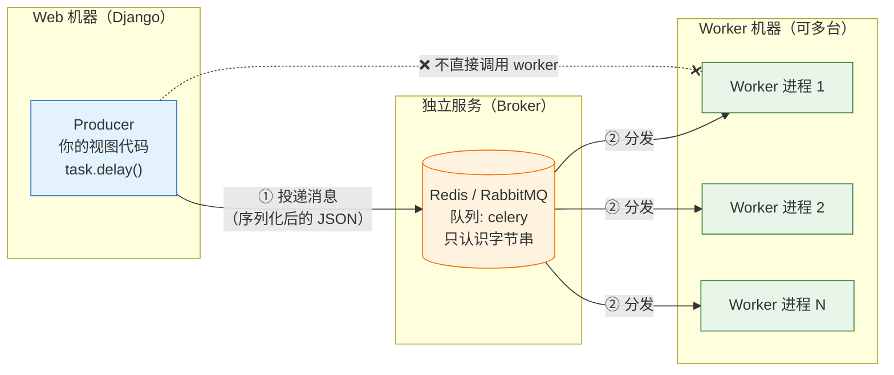
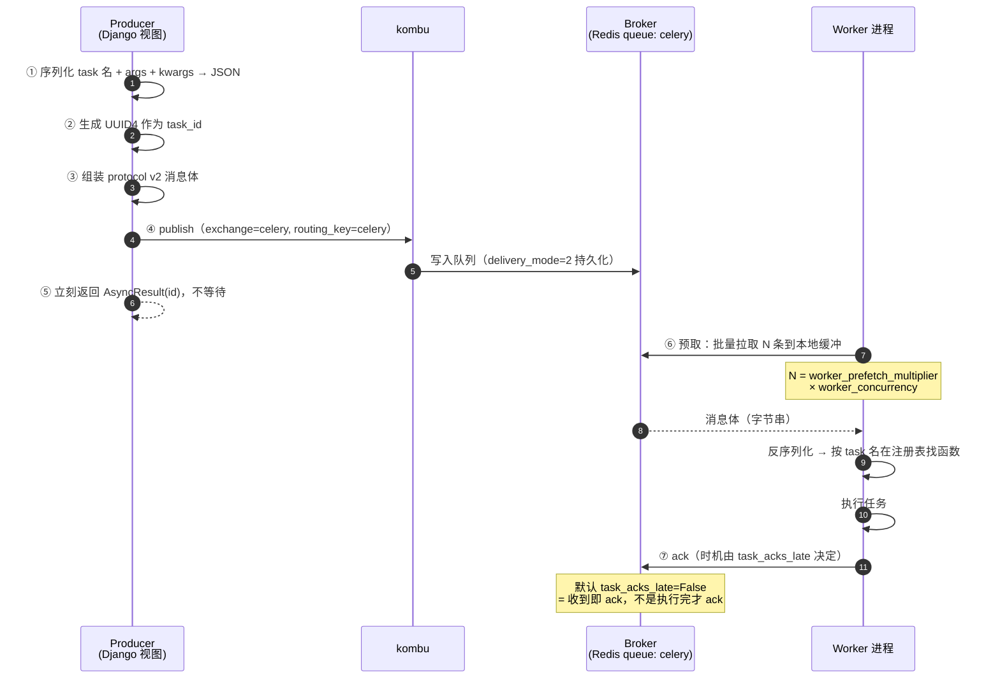
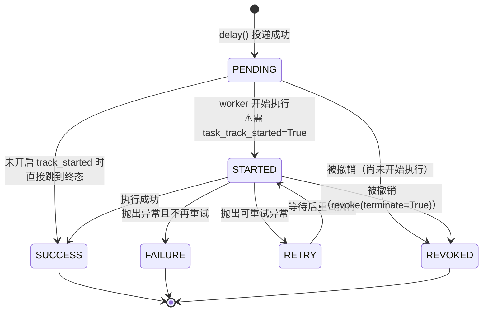
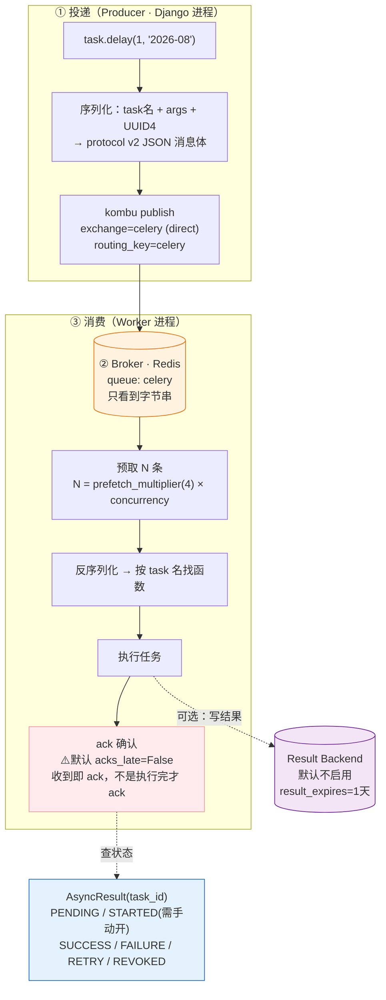

# 第 2 课：Celery 架构全景与消息流转

> 所属阶段：阶段 1《异步化的动因与 Celery 全景》｜ 水平：入门 ｜ 本课知识点：三大件 Producer / Broker / Worker、一次 delay() 的完整旅程、Result Backend 与任务状态机
> 故事情节：主角被"交出去"了 —— 但它变成了什么？存在哪里？谁取走它？取走之后又凭什么说它"做完了"？

> ℹ️ **版本基线**：本文涉及的默认值均对照 Celery 5.6 官方文档核实（**核查于 2026-08**），文中会逐条标注。

## 🎯 本课目标

- 画出 Producer / Broker / Worker 三件套的职责边界，说清"解耦"到底解开了什么
- 逐步讲出一次 `delay()` 的完整旅程（序列化 → 发布 → 预取 → 执行 → ack），并能用 `redis-cli` 直视队列里的消息
- 说清任务状态机的流转，判断什么场景**不该**配 Result Backend

---

## 第一幕：场景引入

上节课末尾，我们把课 1 的场景改造了一版——视图变成毫秒级返回，运营再怎么点首页都不卡了。代码长这样：

```python
task = generate_statement.delay(request.user.id, month)
return JsonResponse({"task_id": task.id})
```

你高高兴兴上线了。第二天，运营又找过来：

> 运营："我昨天下午点了好几次，就收到一封邮件。"
> 你："……我去查查。"

然后你发现自己**完全不知道从哪查起**：

- 运营点了 5 次，这 5 个任务现在**在哪**？
- 昨晚发版重启了 worker，当时**正在跑**的那个任务去哪了？
- 月底高峰期，我要怎么知道队列里**积压了多少**任务？

你打开代码，只有孤零零一行 `generate_statement.delay(...)`。**这条"要做的事"究竟变成了什么？**

---

## 第二幕：认知冲突

你在 Django shell 里试了试：

```python
>>> r = generate_statement.delay(1, "2026-08")
>>> r
<AsyncResult: 3f9a1c2e-7b41-4f0a-9d3e-1c8a5b2e7f10>
>>> r.status
'PENDING'
```

**`delay()` 返回了一个对象，但它不是任务本身。** 它不持有任务，它甚至不知道任务在哪台机器上。它只有一串 ID。

更诡异的是：你把 worker 全部停掉，再调一次 `delay()`——**它依然成功返回了**，没有报任何错。

❓ **问题**：
1. 那条"要做的事"到底**存在哪里**？worker 全挂了它还在吗？
2. 我怎么知道它现在是"**在排队**"还是"**正在跑**"？
3. 为什么我把 worker 杀掉之后，正在执行的任务**凭空消失**了？

---

## 第三幕：层层揭示

### 知识点 1：三大件 Producer / Broker / Worker

> 关键点：发布 / 暂存 / 消费的职责切分 ／ 解耦带来的三个"独立" ／ kombu 在其中的角色

#### 一句话定义

Celery 把一次任务调用拆成三个**互不认识**的角色：**Producer 负责投递、Broker 负责暂存与分发、Worker 负责领取并执行**——三者可以部署在不同机器上，只通过"消息"这一种语言沟通。

#### 直觉建立（类比）

把它想成**快递系统**：

| Celery | 快递系统 | 它做的事 |
|--------|---------|---------|
| **Producer**（生产者） | 寄件人（你的 Django 视图） | 打包、贴单、交给分拣中心，**然后转身就走** |
| **Broker**（消息代理） | 快递分拣中心（Redis / RabbitMQ） | **暂存**包裹、按顺序**分发**给快递员 |
| **Worker**（消费者） | 快递员（独立进程） | 主动来领件、送达、签收确认 |

**关键点**：寄件人把包裹交给分拣中心就完事了，**不关心哪个快递员送、什么时候送、送没送到**（除非他额外买了"查件服务"——那就是知识点 3 的 Result Backend）。

> 💡 **类比的边界**：快递包裹被取走后，一般不会退回来重送。而 Celery 的 broker 在"worker 没确认签收"时会**重新投递**——这正是课 1 埋下的"至少一次"语义的物理基础。

#### 核心原理



**① Producer（生产者）**
任何调用 `.delay()` / `.apply_async()` 的代码。它做的事只有一件：**把任务序列化成消息，发给 broker**。它**不执行**任务，也**不等待**结果，发完立刻返回。

**② Broker（消息代理）**
一个**独立部署**的消息中间件服务。它做两件事：**暂存消息 + 分发给消费者**。

⚠️ 要特别注意：**broker 不认识你的任务**。它眼里只有字节串，不理解"这是个生成报表的任务"，也不理解"重试 3 次"。所有语义都编码在消息的字段里，由 Celery 的两端各自解释。

**③ Worker（消费者）**
独立常驻进程（可以有很多个，可以在很多台机器上）。它主动从 broker 拉消息 → 反序列化 → 在自己的进程里执行 → 向 broker 确认（ack）。

**④ kombu 在哪？**
Celery **没有自己实现**消息协议，它用的是 [kombu](https://kombu.readthedocs.io/) 这个库。kombu 屏蔽了 Redis / RabbitMQ / SQS / Google Pub/Sub 的差异，给 Celery 提供统一的传输接口。**你平时不直接接触 kombu，但你配的 `broker_transport_options` 会直接透传给它。**

**你什么时候会撞到 kombu**（早知道能省很多排查时间）：

| 场景 | 你会看到什么 | 该怎么办 |
|------|-------------|---------|
| 配 `broker_transport_options` | 文档里说"这是 kombu 的传输选项" | 查 [kombu 文档](https://kombu.readthedocs.io/) 而不是 Celery 文档 |
| Redis key 里的 `_kombu.binding.celery` | 一个看不懂的 key | 那是 kombu 维护的队列绑定关系，**别手动删** |
| 报错 `InconsistencyError: Probably the key ('_kombu.binding.celery') has been removed` | Redis 把 key 淘汰了 | 给 Redis 关掉 key 淘汰（`maxmemory-policy noeviction`） |
| Redis 断连类问题 | 报错栈里出现 `kombu.transport.redis` | 这是 kombu 层的问题，Celery 5.5+ 依赖 Kombu 5.4.0+ 已修复长期断连 bug（核查于 2026-08） |

#### 核心洞察：解耦解开了三个"独立"

| 独立 | 含义 | 场景价值 |
|------|------|---------|
| **独立启停** | worker 挂了，Django 照样接请求、照样能投递 | 发版重启 worker 时，Web 完全无感 |
| **独立扩缩容** | 任务积压了，**加 worker 就行**，不用动 Web | 月底高峰临时扩容 10 台 worker |
| **独立部署** | worker 可以跑在专用机器上，不占 Web 的内存/CPU | 慢任务不再污染 Web 进程 |

> 🎯 这三件事**加起来**才是"异步任务队列"相比 `threading` 的真正优势——不是"不阻塞"，而是"**执行资源与请求资源彻底分家**"。

#### 示例演示

```bash
# 【实验】不起 worker，任务照样能"投递成功"

# 确认 worker 没在跑
celery -A proj inspect ping
# → Error: No nodes replied within time constraint.

# 在 Django shell 里投递
python manage.py shell <<'EOF'
from reports.tasks import generate_statement
r = generate_statement.delay(1, "2026-08")
print(r.id, r.status)
EOF
# → 3f9a1c2e-7b41-4f0a-9d3e-1c8a5b2e7f10 PENDING

# 去 Redis 看一眼
redis-cli -n 0 LLEN celery
# → (integer) 1        ← 消息已经躺在那了，只是没人消费
```

```bash
# 现在起 worker
celery -A proj worker -l INFO
# → [INFO/MainProcess] Received task: reports.tasks.generate_statement[3f9a1c2e...]
# → [INFO/ForkPoolWorker-1] Task ... succeeded in 8.02s

redis-cli -n 0 LLEN celery
# → (integer) 0
```

> 🎯 **关键观察**：worker 是不是在跑，**不影响** `delay()` 成功。这就是解耦——投递和执行是两件事。

#### 常见误区

1. **"worker 必须和 Django 同时启动"**
   不需要。broker 把两者解耦了，这正是可靠性的来源。**先投后消费**是正常模式。

2. **"broker 就是个转发器，消息不落盘"**
   错。Redis / RabbitMQ 都会持久化消息（配置得当的前提下）。这是"worker 挂了任务还在"的原因。注意：Redis 默认的 `delivery_mode=2`（持久化）依赖 Redis 本身的 RDB/AOF 配置，别把 broker 当成数据库用。

3. **"一个 Django 项目只能起一个 worker"**
   可以起任意多个，它们**共享同一个队列，谁空谁领**。扩缩容就是加/减 worker 进程。

#### 一句话记住

> **Producer 只管投递、Broker 只管暂存、Worker 只管执行——三者互不认识，全靠一条消息说话。**

#### 官方文档

- Celery 架构介绍：https://docs.celeryproject.org/en/stable/getting-started/introduction.html
- Broker 总览：https://docs.celeryproject.org/en/stable/getting-started/backends-and-brokers/index.html

---

### 知识点 2：一次 delay() 的完整旅程

> 关键点：序列化成消息体 ／ publish 到 exchange/queue ／ worker 预取与消费 ／ 执行与 ack 时机 ／ 动手：redis-cli 直视消息

#### 一句话定义

`delay()` 做的事只有一件：**把"任务名 + 参数 + 元数据"打包成一条 JSON 消息，投递到默认队列 `celery`**。之后发生的一切，与调用方再无关系。

#### 直觉建立（类比）

把"喊一声"变成"**写张工单**"：

- 你**喊一声**（同步调用）→ 对方必须当场在场，否则这事就黄了
- 你**写张工单**（消息）→ 对方什么时候来都行。工单上要写清楚：**做什么、给谁做、什么时候之前做完、做完了通知谁、做砸了怎么办**

Celery 的消息体就是这张工单，只不过用 JSON 写成。

#### 核心原理：六步旅程



> 🧭 **先澄清一个入门者必踩的坑：有三个东西都叫 `celery`**
>
> | 名字 | 角色 | 类比 | 用它做什么 |
> |------|------|------|-----------|
> | **exchange** `celery` | 交换机（AMQP 概念） | 分拣中心的**入口闸口** | 决定消息按什么规则分拣；默认类型 `direct`（精确匹配） |
> | **routing_key** `celery` | 路由键 | 包裹上的**目的地标签** | 消息携带的标签，与 binding 规则匹配后决定进哪个队列 |
> | **queue** `celery` | 队列 | 分拣中心里那个**具体的货架** | 消息最终停留的地方；`redis-cli LLEN celery` 数的就是这个 |
>
> 默认配置下三者同名，所以在 Redis 上（Redis 没有真正的 exchange 概念，kombu 用 `_kombu.binding.*` 模拟）你会觉得"反正就一个队列"。**但课 9 讲路由隔离时，你会按业务把它们拆成 `queue_report` / `queue_email` 等多个队列**——那时如果没搞清这三者，配置会写错。现在先记住：**你 `LLEN` 的那个是 queue**。

**消息体长什么样**（`task_protocol` 默认 **2**，核查于 2026-08）：

```json
{
  "task": "reports.tasks.generate_statement",
  "id": "3f9a1c2e-7b41-4f0a-9d3e-1c8a5b2e7f10",
  "args": [1, "2026-08"],
  "kwargs": {},
  "retries": 0,
  "eta": null,
  "expires": null,
  "utc": true,
  "callbacks": null,
  "errbacks": null,
  "timelimit": [null, null],
  "taskset": null,
  "group": null,
  "chord": null,
  "chain": null,
  "group_index": null,
  "parent_id": null,
  "root_id": "3f9a1c2e-7b41-4f0a-9d3e-1c8a5b2e7f10",
  "shadow": null,
  "ignore_result": false,
  "argsrepr": "(1, '2026-08')",
  "kwargsrepr": "{}",
  "origin": "gen3@web-01",
  "properties": {
    "correlation_id": "3f9a1c2e-7b41-4f0a-9d3e-1c8a5b2e7f10",
    "reply_to": "8f2b1c4d-...",
    "delivery_mode": 2,
    "delivery_tag": "3f9a1c2e-7b41-4f0a-9d3e-1c8a5b2e7f10",
    "priority": 0,
    "body_encoding": "base64",
    "content_type": "application/json",
    "content_encoding": "utf-8"
  }
}
```

**关键字段速查**（不用背，但要知道出问题该看哪个）：

| 字段 | 作用 | 你什么时候会关心它 |
|------|------|------------------|
| `task` | 任务的**全限定名** | worker 靠它找函数；名字对不上 → `NotRegistered`（课 10） |
| `id` | 任务唯一身份 | 排查问题时用它**串联全链路日志** |
| `args` / `kwargs` | 参数 | **必须能 JSON 序列化**（课 6 的坑） |
| `eta` / `expires` | 何时执行 / 何时作废 | 延迟任务、过期丢弃（课 4） |
| `retries` | 已重试次数 | 重试策略（课 5） |
| `root_id` / `parent_id` / `chain` / `chord` | 编排血缘 | chain/chord 追踪（课 8） |
| `properties.delivery_mode` | `2` = 持久化 | broker 重启后消息还在不在 |
| `properties.reply_to` | 结果回传地址 | rpc:// 后端用 |

#### ⚠️ 两个必须知道的默认值（本课重点）

**① `worker_prefetch_multiplier` 默认 = 4**（核查于 2026-08）

```
worker 一次预留的消息数 = worker_prefetch_multiplier × worker_concurrency
```

8 核机器 + 默认并发 8 → **一个 worker 会一次性把 32 条消息抓进本地缓冲区**。

副作用：
- **先启动的 worker 会"囤货"** —— 后来启动的 worker 分不到任务，导致严重的负载不均
- 长任务场景下这就是**队头阻塞**：32 条里有几条 8 分钟的大任务，后面 30 条短任务只能干等
- 短任务高吞吐场景反而适合高 prefetch（摊薄 broker 往返开销）

> 📌 详细调优在课 9《生产部署与并发模型》。这里先记住这个数字。

**② `task_acks_late` 默认 = False**（核查于 2026-08）

这是 Celery **最经典的丢任务原因**：

```
默认行为：worker 收到消息 → 立刻 ack → broker 删除消息 → 然后才开始执行
                                        ☝️ 消息已经没了
如果任务执行到一半 worker 被 kill -9 → 这条任务就永远消失了
```

> 📌 完整拆解与修复方案在课 5《确认机制与重试策略》。**本课第四幕会让你亲手复现这个现象。**

#### 示例演示：用 redis-cli 直视消息

```bash
# ① 清空队列，从干净状态开始（仅演示环境！）
redis-cli -n 0 FLUSHDB

# ② 不起 worker，投递一个任务
python manage.py shell -c "
from reports.tasks import generate_statement
print(generate_statement.delay(1, '2026-08').id)
"
# → 3f9a1c2e-7b41-4f0a-9d3e-1c8a5b2e7f10

# ③ 看 Redis 里有什么
redis-cli -n 0 KEYS '*'
# 1) "celery"                    ← 默认队列（list 类型）
# 2) "_kombu.binding.celery"     ← 队列与 exchange 的绑定关系

redis-cli -n 0 LLEN celery
# → (integer) 1

redis-cli -n 0 LRANGE celery 0 -1
```

你会看到一条被包起来的消息（外层是 kombu 的信封，内层 body 是 base64）：

```json
{
  "body": "W1sxLCAiMjAyNi0wOCJdLCB7fSwgeyJjYWxsYmFja3MiOiBudWxsLCAi...",
  "content-encoding": "utf-8",
  "content-type": "application/json",
  "headers": { "lang": "py", "task": "reports.tasks.generate_statement", "id": "3f9a1c2e-...", "root_id": "3f9a1c2e-...", "parent_id": null, "group": null, ... },
  "properties": { "body_encoding": "base64", "correlation_id": "3f9a1c2e-...", "reply_to": "...", "delivery_mode": 2, "delivery_tag": "3f9a1c2e-...", "priority": 0 }
}
```

把 body 解出来看看（这才是真正的"工单"）：

```bash
redis-cli -n 0 LRANGE celery 0 -1 | python -c "
import sys, json, base64, re
raw = sys.stdin.read().strip().split('\n')[0]
raw = re.sub(r'^\d+\)', '', raw).strip()      # 去掉 redis-cli 的行号前缀
msg = json.loads(raw)
print(json.dumps(json.loads(base64.b64decode(msg['body'])), indent=2, ensure_ascii=False))
"
```

预期输出（节选）：

```json
{
  "task": "reports.tasks.generate_statement",
  "id": "3f9a1c2e-7b41-4f0a-9d3e-1c8a5b2e7f10",
  "args": [1, "2026-08"],
  "kwargs": {},
  "retries": 0,
  "eta": null,
  "expires": null,
  "ignore_result": false,
  "root_id": "3f9a1c2e-7b41-4f0a-9d3e-1c8a5b2e7f10",
  ...
}
```

> 🎯 **关键观察**：这就是课 1 说的"**把任务变成记录**"的物理形态。它不再是你进程内存里的一段执行流，而是 Redis 里一条**可以被 `LLEN` 数出来、被 `LRANGE` 看到、被备份、被监控**的数据。关掉 Django、重启机器（只要 Redis 持久化开着），它都还在。

#### 常见误区

1. **"`delay()` 返回一个 Future / 协程"**
   不是。它返回 `AsyncResult`，本质只是"**一张凭 `task_id` 去 backend 查状态的查询票**"，背后没有任何等待或回调机制。

2. **"消息里存的是函数对象"**
   存的是**函数名字符串 + 参数**。worker 靠这个名字在自己的注册表里找函数——所以 worker **必须导入过**定义该任务的模块，否则报 `NotRegistered`。

3. **"broker 会理解我的任务语义"**
   broker 只看到字节串。重试、eta、编排这些语义**全在消息的字段里**，由 Celery 的两端各自解释。这也是为什么 Celery 对 broker 的要求很低（一个能存队列的东西就行）。

#### 一句话记住

> **`delay()` 只是往 Redis 里塞了一条 JSON——其他都是幻觉。**

#### 官方文档

- 消息协议 v2：https://docs.celeryproject.org/en/stable/internals/protocol.html
- Prefetch Limits：https://docs.celeryproject.org/en/stable/userguide/optimizing.html#prefetch-limits

---

### 知识点 3：Result Backend 与任务状态机

> 关键点：PENDING → STARTED → SUCCESS/FAILURE/RETRY ／ AsyncResult 只是张"查询票" ／ 要不要 backend 的决策依据 ／ 结果会堆积

#### 一句话定义

Result Backend 是一个**可选的**独立组件，用来持久化任务的执行状态与返回值；任务状态机则描述了任务从"已投递"到"已终结"的流转路径。

#### 直觉建立（类比）

还是快递：

- **快递单号**（`task_id`）让你能查到包裹在哪
- 但"**查件服务**"本身是个**额外付费的服务**，不是寄快递必需的
- 很多场景你寄完就不管了（比如"发个通知"、"清理临时文件"）——这时候就**别买查件服务**

> 💡 **类比的边界**：快递的"查件"是查件方主动发起的；而 Celery 的状态是 **worker 主动写进 backend** 的。**如果 backend 没配，worker 就压根不会写**——任务照样执行，只是永远查不到。

#### 核心原理

**① 任务状态机**



| 状态 | 含义 |
|------|------|
| `PENDING` | 已投递，**不知道**是在排队还是在执行（默认就这么粗） |
| `STARTED` | worker 已开始执行（**默认不产生**，见下） |
| `SUCCESS` | 执行成功，返回值已存入 backend |
| `FAILURE` | 执行抛异常且不再重试，异常信息已存入 backend |
| `RETRY` | 失败但将重试，等待下一次执行 |
| `REVOKED` | 被显式撤销 |

⚠️ **重要陷阱：`STARTED` 默认不产生！**

`task_track_started` 默认 **False**（核查于 2026-08）。这意味着**默认情况下你无法区分"在排队"和"正在跑"**：

```python
# 默认配置下，任务要么 PENDING，要么 SUCCESS/FAILURE
# 一个 10 分钟的长任务，前 9 分 59 秒状态都是 PENDING
```

长任务场景（想知道"它到底开跑了没"）必须开：

```python
# settings.py
CELERY_TASK_TRACK_STARTED = True
```

**② `AsyncResult` 到底是什么**

```python
r = generate_statement.delay(1, "2026-08")

type(r)      # celery.result.AsyncResult
r.id         # '3f9a1c2e-...'   ← 它唯一的资产
r.status     # 'PENDING'
r.ready()    # False —— 是否已到达终态
r.result     # None（还没结果）
r.successful()  # False
r.failed()      # False
```

⚠️ 它**不持有**任务本身，只持有 `task_id`。**每次读 `.status` / `.result` 都要回 backend 或 broker 查一次**（一次网络往返）。在循环里高频读 `.status` 是常见性能问题。

**③ 关键判断：要不要配 Result Backend？**

`result_backend` 默认 **不启用**（核查于 2026-08，官方文档：*Default: No result backend enabled by default*）。

| 场景 | 要不要 | 理由 |
|------|--------|------|
| 发通知、写审计日志、清理数据（**fire-and-forget**） | ❌ **不要** | 结果没人关心，配了只是给 Redis 制造垃圾 |
| 前端要轮询进度条 / 显示"生成中" | ✅ 要 | 需要查状态 |
| 需要拿到返回值（如生成的报表 URL） | ✅ 要 | 需要取结果 |
| 需要任务去重（`worker_deduplicate_successful_tasks`） | ✅ 要 | 依赖 backend 里的 SUCCESS 状态 |

**配了 backend 的三个代价**（很多人只看到好处）：

1. **额外的网络写入**：每个任务执行完都要往 backend 写一次，吞吐下降
2. **存储会膨胀**：`result_expires` 默认 **1 天**（86400 秒，核查于 2026-08）。过期清理由内建周期任务 `celery.backend_cleanup` 在**每天凌晨 4 点**执行——⚠️ **而这个任务需要 celery beat 在跑**（课 7）。**beat 没跑 = 结果永远堆积 = Redis 内存被撑爆**
3. **不配 backend 时，`status` 永远是 `PENDING`**：不是 bug，是**没人写状态**。这是新手最困惑的地方

**④ Django 项目常用选择**：`django-celery-results`（结果存进 Django 数据库表，可在 admin 里直接看）——课 7 详解。

#### 示例演示

**场景 A：不配 `result_backend`**

```python
>>> r = add.delay(2, 2)
>>> r.status
'PENDING'
>>> time.sleep(3)          # 等它执行完
>>> r.status
'PENDING'                  # ← 还是 PENDING！
>>> r.ready()
False
>>> r.get(timeout=1)
celery.exceptions.TimeoutError: The operation timed out.
```

> 🎯 但去看 worker 日志，任务明明 `succeeded in 0.01s`。这就是"**任务明明执行了，状态却一直是 PENDING**"的真相——**不是 bug，是没配 backend**。

**场景 B：配上 backend**

```python
# settings.py
CELERY_RESULT_BACKEND = 'redis://localhost:6379/1'   # 用另一个 db，与 broker 分开

>>> r = add.delay(2, 2)
>>> r.status
'PENDING'
>>> r.get(timeout=10)      # 阻塞等待结果（⚠️ 生产代码慎用，课 4 讲）
4
>>> r.status
'SUCCESS'
>>> r.result
4
>>> r.date_done
datetime.datetime(2026, 8, 31, 2, 20, 15, 123456)
>>> r.forget()             # 手动删掉 backend 里的这条结果（提前释放空间）
```

#### 常见误区

1. **"状态一直是 PENDING = 任务没执行"**
   三种完全不同的可能：① **没配 backend**（最常见）；② worker 没起或没消费这个队列；③ 任务名对不上（`NotRegistered`）。
   **排查顺序：先看 worker 日志（事实），再看状态（推断）。**

2. **"`r.get()` 很方便，我到处用"**
   `get()` 会**阻塞当前线程**，等于把异步又变回同步。在 Django 视图里调用它就是自废武功。课 4 会给正确用法。

3. **"配了 backend 就万事大吉"**
   结果会堆积，需要 beat 跑 `celery.backend_cleanup` 清理，**否则 Redis 内存会被慢慢撑爆**——这是生产环境最常见的一类"慢性事故"。

#### 一句话记住

> **Result Backend 是可选件——不配它任务照样跑，只是"查无此人"。**

#### 官方文档

- 任务状态：https://docs.celeryproject.org/en/stable/userguide/tasks.html#states
- 配置与默认值：https://docs.celeryproject.org/en/stable/userguide/configuration.html

---

## 第四幕：实操验证

> 回扣第一幕的三个问题：**任务在哪？重启后去哪了？积压多少？** 全程用 `redis-cli` 回答。

### ① 直视队列：回答"任务在哪"和"积压多少"

```bash
# 干净起步
redis-cli -n 0 FLUSHDB

# 不起 worker，投递 3 个任务
python manage.py shell <<'EOF'
from reports.tasks import generate_statement
for i in range(3):
    r = generate_statement.delay(i, "2026-08")
    print(r.id, r.status)
EOF
# 3f9a1c2e... PENDING
# 7c2d8b1a... PENDING
# b4e5f093... PENDING

redis-cli -n 0 LLEN celery
# → (integer) 3          ← 三个任务都在这儿排队

# 另开终端，实时观察队列长度
watch -n 1 'redis-cli -n 0 LLEN celery'
```

```bash
# 起 worker（concurrency=2 + prefetch=1，方便逐步观察）
celery -A proj worker --concurrency=2 --prefetch-multiplier=1 -l INFO
# [INFO] Received task: reports.tasks.generate_statement[3f9a1c2e...]
# [INFO] Received task: reports.tasks.generate_statement[7c2d8b1a...]
# [INFO] Task reports.tasks.generate_statement[3f9a1c2e...] succeeded in 8.02s
```

`watch` 窗口会看到：`3 → 1 → 0`。

> ✅ **回扣第一问 & 第三问**：`redis-cli LLEN celery` 一行命令就能回答"任务在哪""积压了多少"。**这就是把任务变成"记录"带来的第一个直接好处——可数、可查、可监控。**（课 10 会把它做成监控指标）

### ② 【关键实验】kill -9 worker，看正在跑的任务去哪了

```bash
redis-cli -n 0 FLUSHDB

# 投递 4 个任务（每个 8 秒）
python manage.py shell -c "
from reports.tasks import generate_statement
[print(generate_statement.delay(i, '2026-08').id) for i in range(4)]
"

# 起 worker（默认 prefetch=4，concurrency=2 → 一次性抓 8 条，这里抓走全部 4 条）
celery -A proj worker --concurrency=2 -l INFO &
WORKER_PID=$!

sleep 3                    # 让它跑起来、任务开始执行
redis-cli -n 0 LLEN celery
# → (integer) 0           ← 消息已被 worker 全部预取走了

kill -9 $WORKER_PID        # 强杀，不给它任何清理的机会
sleep 1

redis-cli -n 0 LLEN celery
# → (integer) 0           ← ⚠️⚠️ 队列依然是空的！任务凭空消失了
```

> ✅ **回扣第二问**：这个 `(integer) 0` 就是运营"点了 5 次只收到 1 封邮件"的真相——
> **不是没跑，是跑了但没跑完，而消息已经被确认删除了。**
>
> 根因：`task_acks_late` 默认为 `False`，worker **收到消息就立刻 ack**，broker 认为"这单已经结了"，随即删除消息。此时任务还在执行中，worker 一死就**无人知晓、无人重投**。
>
> 修复方案（`acks_late` + `reject_on_worker_lost` + 幂等三件套）在**课 5《确认机制与重试策略》**完整拆解。这里先记住这个现象——它是 Celery 生产事故排行榜第一名。

### ③ 状态机的可视化验证

```python
# settings.py 里打开
CELERY_RESULT_BACKEND = 'redis://localhost:6379/1'
CELERY_TASK_TRACK_STARTED = True      # ← 打开才能看到 STARTED

# 投一个 10 秒的长任务，然后高频采样状态
python manage.py shell <<'EOF'
import time
from reports.tasks import generate_statement
from celery.result import AsyncResult

r = generate_statement.delay(1, "2026-08")
for _ in range(30):
    print(r.status, end=" → ", flush=True)
    time.sleep(0.5)
EOF
# 预期输出：
# PENDING → PENDING → STARTED → STARTED → ... → SUCCESS → SUCCESS
```

> ✅ 把 `CELERY_TASK_TRACK_STARTED` 改回 `False` 再跑一次，你会看到 `PENDING → PENDING → ... → SUCCESS`——**中间的"正在跑"完全看不见**。长任务场景这个差别是致命的。

---

## 第五幕：体系收束

> 📍 **全局定位**：**阶段 1 到此完成。** 你现在拥有了一套完整的 Celery 心智模型：
>
> | 课 | 回答的问题 | 核心结论 |
> |----|-----------|---------|
> | 课 1 | **为什么需要** | 慢活儿的本质是"占坑"；土办法只解决响应不解决可靠 |
> | 课 2 | **它怎么工作** | 三件套靠消息解耦；`delay()` = 塞一条 JSON；状态靠可选的 backend 记录 |
>
> 三条贯穿后续全部课程的**底层事实**（请务必记住，后面每节课都会回到它们）：
> 1. **任务是"消息"，不是"执行流"** —— 所以它能被持久化、被重投、被监控
> 2. **默认 ack 太早（`task_acks_late=False`）** —— 所以默认配置会丢任务
> 3. **投递语义是"至少一次"** —— 所以幂等必须业务侧做
>
> 🔗 **下一步**：进入**阶段 2《Django 集成与任务基础》**。课 3《第一个 Celery + Django 项目》会带你从零搭出真实可用的项目骨架——Broker 怎么选、`celery.py` 为什么必须放在那个位置、任务该怎么定义。**从下一课开始，你会真正写出能跑的代码。**

---

## 🐞 常见误区（本课汇总）

1. **"worker 必须和 Django 一起启动"** → 不需要，broker 把两者解耦；先投后消费是正常模式。
2. **"broker 只是转发不持久化"** → 错，`delivery_mode=2` 是持久化的；但别把 broker 当数据库用。
3. **"`delay()` 返回 Future"** → 返回 `AsyncResult`，只是一张凭 `task_id` 查状态的"查询票"。
4. **"消息里存的是函数对象"** → 存的是**函数名字符串 + 参数**；名字对不上就 `NotRegistered`。
5. **"状态 PENDING = 没执行"** → 三种可能：没配 backend（最常见）/ worker 没起 / 任务名不对。**先看 worker 日志。**
6. **"配了 backend 就万事大吉"** → 结果会堆积，需要 beat 跑 `celery.backend_cleanup`，否则撑爆 Redis。
7. **"STARTED 状态理所当然会有"** → `task_track_started` 默认 False，长任务必须手动开。

## 一图总结



> 🎯 **一句话读图**：**左边只管塞消息，中间只管存消息，右边只管取消息——三者互不认识；底下那条虚线（Result Backend）是可选项，不配它整条链路照样能跑。**

## 课后小测

**Q1**：一台 8 核机器起一个 Celery worker，全部使用默认配置。这个 worker 会一次性向 broker 预留多少条消息？

- A. 1 条
- B. 4 条
- C. 8 条
- D. 32 条

<details><summary>答案与解析</summary>

**答案：D**。预留数 = `worker_prefetch_multiplier`（默认 **4**）× `worker_concurrency`（默认 = CPU 核数 = 8）= **32 条**。

这个默认值在长任务场景下会造成"先启动的 worker 囤货、后启动的饿死"的不均衡问题，长任务场景通常要调成 `worker_prefetch_multiplier = 1`。详细调优在课 9。

</details>

**Q2**：生产环境配置了 Celery，任务明明在 worker 日志里显示 `succeeded`，但代码里读 `r.status` 永远是 `PENDING`。**最不可能**的原因是？

- A. 没有配置 `result_backend`
- B. `celery beat` 没有启动
- C. worker 消费的队列与投递的队列不一致
- D. 任务名对不上，worker 报 `NotRegistered`

<details><summary>答案与解析</summary>

**答案：B**。`celery beat` 负责**周期性任务调度**，与"任务执行后状态查不到"无关。

- **A** 是最常见原因：没配 backend 就没人写状态（但注意 A 与题干矛盾——题干说日志显示 succeeded，若没配 backend 确实会一直 PENDING）。
- **C** 和 **D** 都会导致"你查的这个 task_id 对应的任务其实根本没被执行"，状态自然停在 PENDING。

排查口诀：**先看 worker 日志（事实），再看状态（推断）**。

</details>

**Q3**：关于 ack 时机，下列说法正确的是？

- A. 默认情况下（`task_acks_late=False`），worker 执行完任务后才向 broker 确认
- B. 默认情况下，worker 收到消息后立刻确认，此时任务可能还没开始执行
- C. worker 被 `kill -9` 后，其正在执行的任务会被 broker 自动重新投递
- D. 开启 `task_acks_late=True` 后，任务就一定能"只执行一次"

<details><summary>答案与解析</summary>

**答案：B**。`task_acks_late` 默认 **False**，即"**收到即 ack**"——broker 随即删除消息，而任务可能还在执行中。

- **A** 错，那是 `acks_late=True` 的行为。
- **C** 错，正是这个默认行为导致 `kill -9` 后任务**永久丢失**（本课第四幕实验已复现）。
- **D** 错，`acks_late=True` 把语义从"最多一次"变成"**至少一次**"，反而**更容易重复执行**——必须配套幂等设计。完整方案见课 5。

</details>

---

## 🎉 阶段 1 完成

阶段 1《异步化的动因与 Celery 全景》全部 6 个知识点已完成。建议进入阶段 2 前，先做一次阶段性自测（"考我一下 Celery 阶段 1"），巩固后再继续。

## 🚀 下一批接力提示词

> 学完本批后，**复制下面这段文字发给 AI**，即可无缝进入下一批（无需重新描述上下文）：

```
继续学 Celery + Django。我的学习档案在 celery-django/00-学习档案.md，
刚学完阶段 1《异步化的动因与 Celery 全景》全部 6 个知识点（课 1 + 课 2），
请按大纲继续讲解下一批知识点（阶段 2 课 3《第一个 Celery + Django 项目》）。
```

## 🧭 课程导航

⬅️ **上一课**：[第 1 课：为什么需要异步任务](lesson-01-为什么需要异步任务.md)

➡️ **下一课**：[第 3 课：第一个 Celery + Django 项目](../../2-Django集成与任务基础/lessons/lesson-03-第一个Celery+Django项目.md)

📚 **返回目录**：[课程目录](../../../02-课程目录.md)
