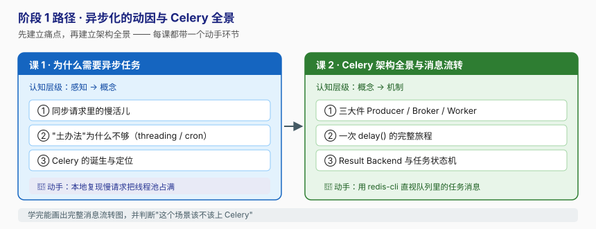

# 阶段 1：异步化的动因与 Celery 全景

> 所属课程：Celery + Django ｜ 故事章节：「转圈的提交按钮」 ｜ 上一阶段：无（本课程起点）

## 🎯 本阶段目标

- 说清**为什么**需要异步任务队列：同步请求被慢活儿拖死的代价链是什么。
- 说清为什么"多开线程""写个 cron"这类土办法**不够用**，它们的边界在哪。
- 能画出并讲通 Celery 的架构全景：一次 `delay()` 从发出到执行完，中间到底发生了什么。
- 本地动手复现一次"慢请求卡死"，并直视 broker 里的任务消息。

## 📍 学习重点

- **动机先行**：先有痛，才有工具。不理解"请求线程被占满 → 超时级联"这条链，后面所有配置都是死记硬背。
- **能力边界**：`threading` 解决的是"不阻塞当前调用"，它解决不了"任务可靠性"（进程退了就没了、不能重试、不能跨机器）。
- **三大件的心智模型**：Producer 只管发、Broker 只管存、Worker 只管干。三者可分别扩缩容，这才是解耦的价值。
- **Result Backend 是可选件**：很多人一上来就配 Redis 存结果，结果把 Redis 撑爆——先理解"要不要结果"这个决策。

## ✅ 必须掌握的知识点

| 知识点 | 所属课 | 学完应能 |
|--------|--------|----------|
| 同步请求里的慢活儿 | 课 1 | 解释"一个 5 秒的外部调用"如何逐级放大成整个站点不可用 |
| "土办法"为什么不够 | 课 1 | 列举 threading / cron 各自的 3 条硬伤 |
| Celery 的诞生与定位 | 课 1 | 说清 Celery 是什么、不是什么（它不是消息队列替代品） |
| 三大件 Producer / Broker / Worker | 课 2 | 画出三者的职责边界与消息流向 |
| 一次 delay() 的完整旅程 | 课 2 | 逐步讲出：序列化 → publish → 消费 → 执行 → ack |
| Result Backend 与任务状态机 | 课 2 | 说出 5 种核心状态，并判断什么场景不需要 backend |

## 🗺️ 本阶段路径图

## 本阶段产出

- [x] [`lessons/lesson-01-为什么需要异步任务.md`](lessons/lesson-01-为什么需要异步任务.md)
- [x] [`lessons/lesson-02-Celery架构全景与消息流转.md`](lessons/lesson-02-Celery架构全景与消息流转.md)

---

🧭 **下一阶段**：[阶段 2 · Django 集成与任务基础](../2-Django集成与任务基础/overview.md) — 理解了"为什么"，就动手把它接进 Django。
