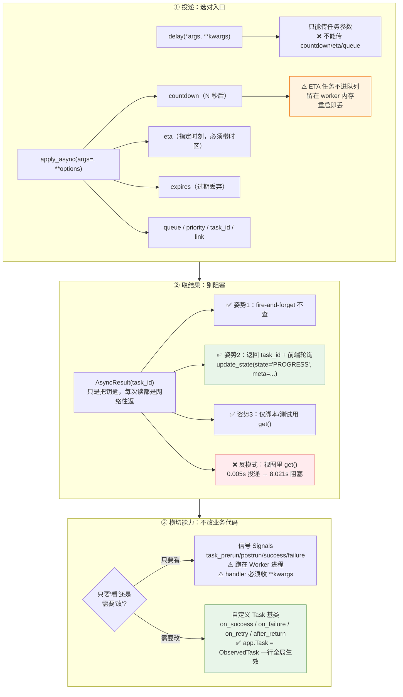

# 第 4 课：调用任务与取回结果

> 所属阶段：阶段 2《Django 集成与任务基础》｜ 水平：入门 ｜ 本课知识点：delay 与 apply_async、AsyncResult 与结果查询、任务信号与自定义 Task 基类
> 故事情节：活儿交出去了，但"什么时候干""干完没""干得怎么样"——这三个问题决定了你能否真正掌控它，而不是把它扔进黑洞

> ℹ️ **版本基线（核查于 2026-08）**：信号名与参数、`Task` 基类钩子签名均对照 Celery 5.6 官方文档核实。

## 🎯 本课目标

- 用 `apply_async` 实现延迟执行、指定队列、设置过期，并说清 `delay()` 只是语法糖
- 用 `AsyncResult` 查状态取结果，**并说清 `get()` 在生产代码里的反模式**
- 用信号 / 自定义 Task 基类，给**所有任务**统一加埋点与告警，而不用逐个改业务代码

---

## 第一幕：场景引入

课 3 跑通了项目，现在要把它接进真实业务流程。需求一来，你发现 `delay()` 一把梭不够用了：

**需求 1**：运营说"这个报表我要 30 分钟后再发，现在数据还没同步完"。
→ `delay()` 立即执行，**没法延迟**。

**需求 2**：产品要在页面上显示进度条："生成中 3/5 · 正在聚合数据"。
→ 你查 `r.status`，只有 `PENDING` 和 `SUCCESS` 两种，**看不到中间过程**。

**需求 3**：领导要看"上周任务失败率"，失败了要告警。
→ 你只能在每个任务里手写 `try/except` + 告警代码，**几十个任务要改**。

🎬 **场景**：这三个需求分别指向三件事——**精确控制投递**、**不阻塞地查询结果**、**横切地加观测能力**。它们恰好对应本课的三个知识点。

---

## 第二幕：认知冲突

你开始翻文档，然后被三个新的困惑卡住：

**困惑 1**：文档说有 `apply_async()`，参数一大堆——`countdown`、`eta`、`expires`、`queue`、`priority`、`shadow`……**每个都在解决什么问题？我该用哪个？**

**困惑 2**：你用 `r.get(timeout=30)` 拿结果，功能对了，但——

```
投递耗时 0.005s
get() 阻塞了 8.021s      ← ???
```

**请求又被卡住 8 秒了。** 那你前面做的异步化图什么？

**困惑 3**：你想在任务失败时自动告警，搜到的方案是"用信号"或"自定义 Task 基类"。**这俩有什么区别？我该用哪个？**

❓ **问题**：
1. `delay()` 和 `apply_async()` 到底是什么关系？那些投递选项各自解决什么问题？
2. 想"取结果"又不想阻塞，正确的姿势是什么？
3. 想给**所有任务**统一加埋点/告警，又不想到处改代码，怎么办？

---

## 第三幕：层层揭示

### 知识点 1：delay 与 apply_async

> 关键点：delay 是糖 ／ countdown 与 eta 的区别与陷阱 ／ expires 过期丢弃 ／ queue 指定 ／ 动手：观察 ETA 任务不进队列

#### 一句话定义

`delay()` 是 `apply_async()` 的**语法糖**，只接受任务参数；`apply_async()` 才是完整能力入口，能把"任务参数"和"投递选项"分开传。

#### 直觉建立（类比）

| 调用方式 | 类比 | 你能控制什么 |
|---------|------|-------------|
| **`delay(*args, **kwargs)`** | 寄**平信** | 写清地址内容就投，完事 |
| **`apply_async(args=, **options)`** | 寄**快递** | 什么时候送、送到哪个网点、错过就退回、加急、送完通知我 |

> 💡 **类比的边界**：快递的"指定送达时间"是真能做到的；Celery 的 `countdown` 是"**不早于**这个时间执行"——worker 忙的时候，实际执行会晚于 ETA。它是**期望时间**，不是**保证时间**。

#### 核心原理

源码层面（简化），`delay` 就是 `apply_async` 包一层：

```python
def delay(self, *args, **kwargs):
    return self.apply_async(args, kwargs)

def apply_async(self, args=None, kwargs=None, task_id=None, producer=None,
                link=None, link_error=None, shadow=None, **options):
    ...
```

**关键区别**：

```python
generate_statement.delay(1, '2026-08')
#   ↓ 等价于
generate_statement.apply_async(args=(1, '2026-08'))
```

```python
# ❌ 这样写是错的 —— delay 会把 countdown 当成"任务参数"传进函数
generate_statement.delay(1, '2026-08', countdown=60)
# → TypeError: generate_statement() got an unexpected keyword argument 'countdown'

# ✅ 正确：apply_async 把任务参数和投递选项分开
generate_statement.apply_async(args=(1, '2026-08'), countdown=60)
```

**投递选项速查表**（核查于 2026-08，对照 Celery 5.6 Task API 文档）：

| 选项 | 类型 | 作用 | 典型场景 |
|------|------|------|---------|
| `args` / `kwargs` | tuple / dict | 任务参数 | 所有场景 |
| `countdown` | float（秒） | **N 秒后**执行 | "30 分钟后提醒我" |
| `eta` | datetime | **在指定时刻**执行 | "今晚 22:00 统一发" |
| `expires` | float 或 datetime | **过期作废** | "验证码 5 分钟有效" |
| `queue` | str | 指定队列 | 快慢任务隔离（**课 9**） |
| `priority` | int 0–255 | 优先级 | ⚠️ Redis 支持有限，RabbitMQ 原生 |
| `task_id` | str | 自定义任务 id | 幂等去重（**课 5**） |
| `link` / `link_error` | signature | 成功/失败回调任务 | 编排（**课 8**） |
| `shadow` | str | 覆盖日志/监控里显示的任务名 | 同一函数不同业务标识 |
| `retry` | bool（默认 `True`） | **投递**失败是否重试 | 一般不动 |
| `retry_policy` | dict | 投递重试策略 | 一般不动 |
| `headers` | dict | 附加消息头 | 链路追踪 |

#### ⚠️ 三个必须注意的坑

**① `countdown` 与 `eta` 不能同时指定**

官方文档原文：`eta` — *"May not be specified if countdown is also supplied."*

```python
# ❌ 报错
apply_async(args=(1, '2026-08'), countdown=60, eta=datetime(...))
```

**② `eta` 必须是「带时区的 datetime」**

```python
from datetime import datetime, timedelta

# ❌ naive datetime —— 会被按 UTC 还是本地时间解释，取决于 enable_utc 配置，极易出错
generate_statement.apply_async(args=(1, '2026-08'), eta=datetime(2026, 8, 31, 22, 0))

# ✅ 显式带 UTC 时区
from datetime import timezone
generate_statement.apply_async(
    args=(1, '2026-08'),
    eta=datetime(2026, 8, 31, 22, 0, tzinfo=timezone.utc),
)

# ✅ 最省心：用 Django 的 timezone.now()，它自动带时区（USE_TZ=True 时为 UTC）
from django.utils import timezone
generate_statement.apply_async(args=(1, '2026-08'), eta=timezone.now() + timedelta(hours=2))
```

**③ `countdown` / `eta` 的时间必须小于 `visibility_timeout`**

用 Redis 且默认 1 小时 `visibility_timeout` 时，`countdown=7200`（2 小时）会导致消息在 ETA 到期前就重新可见 → **被重新投递 → 重新排期 → 无限循环放大**（课 3 Q3 已考过）。

#### 一张图看懂 countdown / eta / expires

```mermaid
gantt
    dateFormat HH:mm:ss
    axisFormat %H:%M:%S
    title 三种时间控制的语义差别（假设任务实际执行耗时 3 秒）
    section countdown=60
    投递(立刻) :done, t1, 00:00:00, 1s
    等待窗口（消息被 worker 持有） :crit, 00:00:01, 59s
    最早执行时刻 :milestone, m1, 00:01:00, 0s
    实际执行（可能因 worker 忙而后延） :active, 00:01:05, 3s

    section eta=00:10:00
    投递(立刻) :done, t2, 00:00:00, 1s
    等待窗口 :crit, 00:00:01, 9m59s
    目标时刻 :milestone, m2, 00:10:00, 0s

    section expires=300
    投递(立刻) :done, t3, 00:00:00, 1s
    有效期（5 分钟内有效） :active, 00:00:01, 300s
    超期作废 :milestone, m3, 00:05:00, 0s
```



#### 示例演示

```python
# 场景 1：30 分钟后提醒
generate_statement.apply_async(args=(1, '2026-08'), countdown=1800)

# 场景 2：今晚 22:00 统一处理（注意时区！）
from datetime import timedelta
from django.utils import timezone

run_at = timezone.now().replace(hour=22, minute=0, second=0, microsecond=0)
if run_at < timezone.now():
    run_at += timedelta(days=1)          # 今天的 22:00 已过 → 排到明天
generate_statement.apply_async(args=(1, '2026-08'), eta=run_at)

# 场景 3：5 分钟有效的验证码，过期就别发了
send_sms_code.apply_async(args=(phone, code), expires=300)

# 场景 4：慢任务投到专用队列（课 9 详解路由隔离）
generate_statement.apply_async(args=(1, '2026-08'), queue='reports')
```

#### 常见误区

1. **`delay()` 里传 `countdown`** → `TypeError`。要投递选项就得用 `apply_async`。
2. **`eta` 用 naive datetime** → 时区错乱，任务在"神秘时刻"执行（这个坑在课 7 讲 beat 时会再遇到一次）。
3. **以为 `countdown` 是"精确 N 秒后执行"** → 是"**不早于**"。实际执行时间 = max(ETA, worker 有空的时间)。
4. **用队列长度判断所有积压** → ❌ **ETA 任务不进队列**！见下方实操。

#### 一句话记住

> **`delay()` 是平信，`apply_async()` 是快递；想控制"何时 / 何地 / 何时作废"，就得用后者。**

#### 官方文档

- Calling Tasks：https://docs.celeryproject.org/en/stable/userguide/calling.html
- Task API：https://docs.celeryproject.org/en/stable/reference/celery.app.task.html

---

### 知识点 2：AsyncResult 与结果查询

> 关键点：state / ready / get ／ `get()` 阻塞的反模式 ／ forget 与 result_expires ／ ignore_result 的适用场景 ／ 动手：前端轮询进度条

#### 一句话定义

`AsyncResult` 是"**凭 `task_id` 查询结果**"的查询句柄——它本身**不持有任何数据**，每次读属性都是一次对 backend 的**网络往返**。

#### 直觉建立（类比）

还是快递单号：

- 单号**不是包裹**，只是一把钥匙
- 每次"查件"都要**跑一趟查询系统**（一次网络往返）
- 你没买查件服务（没配 backend）→ 永远查不到

> 💡 **类比的边界**：快递查询是"你去问"；Celery 的状态是 **worker "写"进 backend** 的。**没人写 = 永远 PENDING**（课 2 已讲过）。

#### 核心原理

**① API 速查**

| API | 作用 | 触发网络往返 |
|-----|------|-------------|
| `r.id` | task_id | ❌ 本地 |
| `r.state` / `r.status` | 当前状态 | ✅ 每次都查 |
| `r.ready()` | 是否已到终态 | ✅ |
| `r.successful()` / `r.failed()` | 是否成功 / 失败 | ✅ |
| `r.result` | 返回值（失败时是异常实例） | ✅ |
| `r.info` | 结果或异常的原始信息 | ✅ |
| `r.traceback` | 失败堆栈 | ✅ |
| `r.date_done` | 完成时间 | ✅ |
| `r.get(timeout=, propagate=, interval=)` | **阻塞**等待结果 | ✅（轮询） |
| `r.forget()` | 从 backend 立即删除这条结果 | ✅ |

**② ⚠️ `get()` 的反模式（本课最重要的警告）**

```python
# ❌ 反模式：在视图里 get() —— 等于把异步又变回同步
def generate_statement_view(request, month):
    r = generate_statement.delay(request.user.id, month)
    result = r.get(timeout=30)        # ⚠️ 这个请求又被卡住 8 秒了
    return JsonResponse(result)
```

> 🎯 **诊断**：在 Django 视图里调 `get()`，**异步化就白做了**——请求依然被占着，Web worker 槽位依然被占。**这和课 1 讲的"占坑"是同一个问题，只是换了个地方占。**

**③ 正确的三种姿势**

```python
# 姿势 1（推荐，覆盖大多数场景）：fire-and-forget，压根不查
def generate_statement_view(request, month):
    generate_statement.delay(request.user.id, month)
    return JsonResponse({"accepted": True})        # 毫秒级返回
# 结果去哪了？任务内部自己落库 / 发通知，调用方不关心

# 姿势 2：返回 task_id，前端轮询（需要进度条时用这个）
def generate_statement_view(request, month):
    r = generate_statement.delay(request.user.id, month)
    return JsonResponse({"task_id": r.id})

def task_status_view(request, task_id):
    r = AsyncResult(task_id)
    return JsonResponse({
        "state": r.state,
        "result": r.result if r.ready() else None,
    })

# 姿势 3：只在「离线脚本 / 管理命令 / 测试」里用 get()
# 比如一次性批处理脚本，天然就是同步流程，get() 没问题
```

**④ `get(propagate=True)` 会重新抛出异常**（默认就是 `True`）

```python
r = add.delay(1, 'x')          # 任务里 1 + 'x' 会抛 TypeError
r.get()                         # → 直接抛出 TypeError
r.get(propagate=False)          # → 返回异常实例本身，不抛出
```

**⑤ ⭐ `task_id` 是可序列化的字符串——前端轮询方案为什么能成立**

这是"返回 task_id + 前端轮询"整个方案的**前提**，但文档从不明说，很多人心里没底：

```python
# 请求 A（可能落在 web-01）：投递
r = generate_report.delay(1, '2026-08')
return JsonResponse({'task_id': r.id})      # r.id 就是一个普通 str

# 请求 B（几秒后，可能落在 web-02）：查询
r = AsyncResult('3f9a1c2e-7b41-4f0a-9d3e-1c8a5b2e7f10')     # 凭字符串重建句柄
print(r.state)
```

**要点**：

| 问题 | 答案 |
|------|------|
| `task_id` 是什么？ | 一个普通的 **UUID 字符串**（如 `3f9a1c2e-...`），可存库、可放 URL、可进日志 |
| 能在**别的进程**重建吗？ | ✅ 能。任何能连到 backend 的进程都可以 |
| 能在**另一台机器**上重建吗？ | ✅ 能——只要它连的是同一个 result backend |
| 需要传 app 吗？ | 不传时默认用 `current_app`（Django 里就是 `proj.celery.app`）。**显式写 `app.AsyncResult(task_id)` 更稳妥**，尤其在脚本/命令行里没有 app context 时 |
| 状态存在哪？ | 在 **backend**（Redis / DB），**不在** `AsyncResult` 对象里 |

```python
# 稳妥写法（脚本 / 管理命令里推荐）
from proj.celery import app
r = app.AsyncResult('3f9a1c2e-...')
print(r.state)
```

> 🎯 **这就是为什么"投递返回 id → 前端轮询 → 任意 Web 实例查状态"能成立**：状态存在共享的 backend 里，`task_id` 只是打开它的钥匙，而钥匙可以被复制到任何地方。**也正因如此，`task_id` 千万不要用自增/可猜测的值**（它会出现在 URL 里）。

**⑥ `result_expires` 与 `forget()`**（回扣课 2）

- `result_expires` 默认 **1 天**（86400 秒）
- 过期清理由内建周期任务 `celery.backend_cleanup` 在**每天凌晨 4 点**执行，**需要 beat 在跑**
- `r.forget()` 可以**立即**删掉这条结果，适合"取完就扔"的场景

**⑦ 什么时候用 `ignore_result=True`**

```python
@shared_task(name='reports.generate_statement', ignore_result=True)
def generate_statement(user_id, month): ...
```

| 场景 | 是否设 `ignore_result=True` |
|------|---------------------------|
| 发通知、清理、写审计日志（**fire-and-forget**） | ✅ 设——省一次 backend 写入，不占存储 |
| 要显示进度条 / 要拿返回值 | ❌ 别设——设了就查不到了 |

⚠️ **别一边想要进度条，一边设 `ignore_result=True`** —— 这是自相矛盾。

想"**存错误但不存成功结果**"（省钱又保留失败信息）：

```python
CELERY_TASK_IGNORE_RESULT = True
CELERY_TASK_STORE_ERRORS_EVEN_IF_IGNORED = True      # 失败信息仍然入库
```

#### 示例演示：前端进度条（回扣第一幕需求 2）

**第一步：任务内部主动上报进度**

```python
# reports/tasks.py
import time

from celery import shared_task


@shared_task(bind=True, name='reports.generate_report')
def generate_report(self, user_id, month):
    steps = ['拉数据', '聚合', '渲染', '上传', '通知']
    for i, step in enumerate(steps, 1):
        # ⚠️ PROGRESS 是自定义状态，不是内置状态
        self.update_state(
            state='PROGRESS',
            meta={'current': i, 'total': len(steps), 'step': step},
        )
        time.sleep(1.5)                     # 模拟每步耗时
    return {'url': f'/media/report-{month}.pdf'}
```

**第二步：查询接口**

```python
# reports/views.py
from celery.result import AsyncResult
from django.http import JsonResponse


def report_status(request, task_id):
    r = AsyncResult(task_id)
    if r.state == 'PENDING':
        resp = {'state': '排队中', 'current': 0, 'total': 5}
    elif r.state == 'PROGRESS':
        resp = {'state': r.info.get('step'),
                'current': r.info.get('current'),
                'total': r.info.get('total')}
    elif r.state == 'SUCCESS':
        resp = {'state': '完成', 'url': r.result['url'], 'current': 5, 'total': 5}
    else:                                    # FAILURE
        resp = {'state': '失败', 'error': str(r.info)}
    return JsonResponse(resp)
```

**第三步：前端轮询**

```javascript
async function poll(taskId) {
  while (true) {
    const r = await fetch(`/reports/status/${taskId}/`).then(x => x.json());
    updateProgress(r.current, r.total, r.state);
    if (r.state === '完成' || r.state === '失败') break;
    await new Promise(res => setTimeout(res, 2000));    // 2 秒一次
  }
}
```

> ⚠️ **两个注意点**：
> 1. **`PROGRESS` 是自定义状态**——Celery 允许任意状态名，它们照样写进 backend，只是 Flower 等工具的默认展示不认识。
> 2. **轮询别太频繁**——每次轮询都打一次 backend。1 秒 × 100 个用户 = 100 QPS 的 Redis 读。建议 **2–3 秒**；对实时性要求高的改用 WebSocket 推送。

#### 常见误区

1. **在视图里 `get()`** → 异步白做（本课头号警告）
2. **在循环里高频读 `r.state`** → 每次都是一次网络往返，容易把 backend 打满
3. **一边要进度条一边设 `ignore_result=True`** → 自相矛盾
4. **以为 `result_expires` 会自动生效** → ⚠️ **需要 beat 在跑** `celery.backend_cleanup`，否则结果永远堆积直到撑爆 Redis

#### 一句话记住

> **`AsyncResult` 只是把钥匙，不是包裹；`get()` 是"搬个凳子坐在传达室等"，99% 的生产场景不该这么做。**

#### 官方文档

- AsyncResult API：https://docs.celeryproject.org/en/stable/reference/celery.result.html

---

### 知识点 3：任务信号与自定义 Task 基类

> 关键点：task_prerun / task_postrun / task_failure 信号 ／ on_success / on_failure / after_return 钩子 ／ 用基类统一埋点与告警 ／ 信号 vs 基类怎么选

#### 一句话定义

Celery 提供两套挂载"横切关注点"的机制：**信号**（全局、解耦、只能观察）和**自定义 Task 基类**（可继承、能拿到 `self`、能改变行为）。它们让你**不改业务代码**就给所有任务加上埋点、日志、告警。

#### 直觉建立（类比）

- **信号 = 大楼的广播系统**：谁都能装个喇叭监听；装上就听全楼所有事件；但**你不能在广播里改变事件本身**
- **自定义 Task 基类 = 给某类岗位定制的工装**：只有穿这套工装的人（继承该基类的任务）才有；工装上可以缝自己的口袋（加方法、加属性、改行为）

> 💡 **类比的边界**：广播是"**通知**"，工装是"**能力**"。信号**无法**修改返回值或拦截执行流程（它只是通知）；基类**可以**（通过重写 `after_return` 等钩子，甚至重写 `__call__`）。

#### 核心原理

**① 信号（Signals）**

Celery 的信号基于与 `django.core.dispatch` **相同的实现**。任务相关信号（核查于 2026-08）：

| 信号 | 触发时机 | 运行在 | 主要参数 |
|------|---------|--------|---------|
| `before_task_publish` | 消息发布**前** | **Producer 进程** | body, headers, properties, routing_key, exchange（**可修改**） |
| `after_task_publish` | 消息已发到 broker | **Producer 进程** | headers, body, exchange, routing_key |
| `task_prerun` | 任务执行**前** | **Worker 进程** | task_id, task, args, kwargs |
| `task_postrun` | 任务执行**后**（无论成败） | **Worker 进程** | task_id, task, args, kwargs, retval, **state** |
| `task_success` | 任务**成功** | Worker 进程 | result |
| `task_failure` | 任务**失败** | Worker 进程 | task_id, exception, args, kwargs, traceback, einfo |
| `task_retry` | 任务**将重试** | Worker 进程 | request, reason, einfo |
| `task_revoked` | 任务**被撤销** | Worker 进程 | request, terminated, signum, expired |

> ⚠️ **两个关键区分**：
> 1. **进程归属**：`*_task_publish` 跑在 **Web / Producer 进程**；`task_*` 跑在 **Worker 进程**。要埋点，两边都得部署代码，别只在 Web 侧连了信号却期待它触发。
> 2. **`task_postrun` vs `task_success`**：postrun **每次执行后都触发**（含失败，用 `state` 参数区分）；success **只在成功时**触发。

**用法**：

```python
# proj/proj/signals.py（记得在 AppConfig.ready() 里 import 它）
import logging

from celery.signals import task_failure, task_postrun, task_prerun

logger = logging.getLogger(__name__)


@task_prerun.connect
def on_task_prerun(task_id, task, args, kwargs, **kwargs_):
    # ⚠️ 官方明确建议：handler 一律接受 **kwargs，
    #    这样 Celery 新版本新增参数时不会破坏你的代码
    logger.info('[prerun] task=%s id=%s', task.name, task_id)


@task_failure.connect
def on_task_failure(task_id, exception, args, kwargs, traceback, einfo, **kwargs_):
    logger.error('[failure] task_id=%s exc=%s', task_id, exception)
    # alert_to_ops(task_id, exception)


@task_postrun.connect
def on_task_postrun(task_id, task, args, kwargs, retval, state, **kwargs_):
    logger.info('[postrun] task=%s state=%s', task.name, state)
    # metrics.observe(task.name, state)
```

**按任务名过滤**（`sender` = 任务名）：

```python
@task_failure.connect(sender='reports.generate_statement')
def on_report_failure(sender=None, **kwargs):
    logger.error('报表任务失败了：%s', kwargs.get('task_id'))
```

**② 自定义 Task 基类**

钩子签名（核查于 2026-08，对照 `celery.app.task.Task` API 文档）：

```python
# proj/proj/task_base.py   ← ⚠️ 注意：放独立模块，不要放 celery.py（见下方循环导入问题）
import logging

from celery import Task

logger = logging.getLogger(__name__)


class BaseTaskWithLogging(Task):
    """自定义任务基类：统一埋点、日志、告警。"""

    def on_success(self, retval, task_id, args, kwargs):
        """任务成功时调用。"""
        logger.info('[success] task_id=%s retval=%s', task_id, retval)

    def on_failure(self, exc, task_id, args, kwargs, einfo):
        """任务失败时调用。"""
        logger.error('[failure] task_id=%s exc=%s', task_id, exc, exc_info=exc)
        # alert_to_ops(task_id, exc)

    def on_retry(self, exc, task_id, args, kwargs, einfo):
        """任务将重试时调用。"""
        logger.warning('[retry] task_id=%s exc=%s', task_id, exc)

    def after_return(self, status, retval, task_id, args, kwargs, einfo):
        """无论成败，最终都会调用（适合收尾清理）。"""
        logger.info('[done] task_id=%s status=%s', task_id, status)
```

**使用**：

```python
from proj.task_base import BaseTaskWithLogging

@shared_task(base=BaseTaskWithLogging, name='reports.generate_statement')
def generate_statement(user_id, month):
    ...
```

#### ⚠️ 循环导入问题（新手必踩）

`tasks.py` 要 `from proj.celery import BaseTaskWithLogging`，而 `celery.py` 的 `autodiscover_tasks()` 又要导入 `tasks.py`——**循环了**。

**三种解法**：

```python
# ✅ 解法 1（推荐且最省心）：一行让所有任务生效，压根不用改 @shared_task
# proj/proj/celery.py
from proj.task_base import ObservedTask

app = Celery('proj')
...
app.Task = ObservedTask          # ← 所有任务的默认基类
```

```python
# ✅ 解法 2：基类放独立模块（不 import celery app，只 import celery.Task）
# proj/proj/task_base.py
from celery import Task
class ObservedTask(Task): ...

# reports/tasks.py
from proj.task_base import ObservedTask      # 无循环
```

```python
# ✅ 解法 3：函数内部延迟导入（不推荐，太啰嗦）
@shared_task(name='reports.generate_statement')
def generate_statement(user_id, month):
    from proj.task_base import ObservedTask
    ...
```

> 🎯 **强烈推荐解法 1**：`app.Task = ObservedTask` 一行，**几十个任务一行不改**，且完全绕开循环导入。

#### ③ 信号 vs 基类：怎么选

| | 信号（Signals） | 自定义 Task 基类 |
|---|----------------|-----------------|
| 作用范围 | **全局**（所有任务） | 可全局（`app.Task=`）也可按任务（`base=`） |
| 能否拿到 `self` | ❌ | ✅ |
| 能否改变行为 | ❌ 只能监听 | ✅ 可重写方法 |
| 能否按任务名过滤 | ✅ `sender='任务名'` | ✅ 只给需要的任务加 `base=` |
| 典型用途 | **全局监控、指标上报、跨切面告警** | **统一重试策略、统一日志格式、统一资源管理** |

**决策建议**：

- 只要"**观察**"（日志、指标、告警）→ **用信号**（更解耦）
- 需要"**改变行为**"（统一重试、统一清理资源、包一层计时）→ **用基类**

#### ④ 一个生产可用的组合（直接搬走）

```python
# proj/proj/task_base.py
import logging
import time

from celery import Task

logger = logging.getLogger(__name__)


class ObservedTask(Task):
    """带统一耗时统计与失败告警的任务基类。"""

    def __call__(self, *args, **kwargs):
        """包住任务执行，自动记录耗时。"""
        start = time.monotonic()
        try:
            return super().__call__(*args, **kwargs)
        finally:
            cost = time.monotonic() - start
            logger.info('task=%s id=%s cost=%.2fs',
                        self.name, self.request.id, cost)
            # metrics.observe(self.name, cost)

    def on_failure(self, exc, task_id, args, kwargs, einfo):
        logger.error('task=%s id=%s FAILED exc=%s',
                     self.name, task_id, exc, exc_info=exc)
        # alert_to_ops(self.name, task_id, exc)
```

```python
# proj/proj/celery.py
import os

from celery import Celery
from proj.task_base import ObservedTask

os.environ.setdefault('DJANGO_SETTINGS_MODULE', 'proj.settings')

app = Celery('proj')
app.config_from_object('django.conf:settings', namespace='CELERY')
app.autodiscover_tasks()

app.Task = ObservedTask          # ← 一行，所有任务自动获得耗时统计 + 失败告警
```

> 🎯 **这一小段代码的价值**：**几十个任务，一行不改，全部获得"耗时统计 + 失败告警"**。这就是横切关注点的正确处理方式——不要在每个任务里手写 `try/except`。

#### 常见误区

1. **在 Web 进程里连 `task_success` 却期待它触发** → 它跑在 **Worker 进程**。Web 侧连了收不到（除非开了 `CELERY_TASK_ALWAYS_EAGER`）。
2. **signal handler 不写 `**kwargs`** → Celery 升级加参数后你的 handler 直接崩。**官方文档明确要求接受任意关键字参数。**
3. **把基类定义在 `celery.py` 里又在 `tasks.py` 里 import** → 循环导入。放独立模块，或用 `app.Task =`。
4. **以为 `task_postrun` 只在成功时触发** → 它是"每次执行后"都触发（带 `state` 参数）；只在成功时用 `task_success`。
5. **在 signal handler 里做重活**（发 HTTP、写库）→ handler 是**同步**执行的，会拖慢 worker。重活应该投递新任务。

#### 一句话记住

> **信号用来"看"，基类用来"改"；`app.Task = 基类` 是给所有任务统一加能力的最省一行。**

#### 官方文档

- Signals：https://docs.celeryproject.org/en/stable/userguide/signals.html
- Task API（含基类钩子）：https://docs.celeryproject.org/en/stable/reference/celery.app.task.html

---

## 第四幕：实操验证

> 逐条回扣第一幕的三个需求。建议跟着跑，特别是 ① 和 ④——它们的**反直觉**正是考点。

### ① 验证 countdown：一个反直觉的现象

```bash
redis-cli -n 0 FLUSHDB

python manage.py shell -c "
from reports.tasks import generate_statement
generate_statement.apply_async(args=(1, '2026-08'), countdown=60)
print('投递完成')
"

# 立刻看队列长度
redis-cli -n 0 LLEN celery
# → (integer) 0          ← ⚠️ 队列是空的！
```

> 🎯 **这是本课最反直觉的观察**：带 `countdown` 的任务**不进队列**。它被 worker 预取后**留在 worker 内存里等到点**。

**三个必须知道的后果**：

| 后果 | 说明 |
|------|------|
| **队列长度漏统计** | 你监控 `LLEN celery` 会**漏掉所有 ETA 任务**，看到的积压数是不准的 |
| **重启 worker 会丢 ETA 任务** | 它们只在内存里，没落回 broker |
| **大量 ETA 任务会撑爆内存** | Celery 5.6 新增 `worker_eta_task_limit` 专门应对此问题（核查于 2026-08） |

```bash
# 起 worker，60 秒后你会看到它执行
celery -A proj worker -l INFO
# ... 等待 ...
# [INFO/MainProcess] Received task: reports.generate_statement[...]
```

### ② 验证 expires 真的会丢弃

```bash
python manage.py shell -c "
from reports.tasks import generate_statement
generate_statement.apply_async(args=(1, '2026-08'), expires=5)
"
# ⚠️ 此时不要起 worker

sleep 10
celery -A proj worker -l INFO
# → worker 收到消息，但直接丢弃，日志里不会出现 "Received task"
```

> ✅ **回扣第一幕需求 1**：这就是"验证码 5 分钟有效"的实现——超时的任务不会被执行，也不会补发。

### ③ 端到端跑通进度条（回扣需求 2）

```bash
# 终端 1：起 worker
celery -A proj worker -l INFO
```

```bash
# 终端 2：投递并轮询
python manage.py shell <<'EOF'
import time

from celery.result import AsyncResult
from reports.tasks import generate_report

r = generate_report.delay(1, '2026-08')
while not r.ready():
    print(r.state, r.info if r.info else '')
    time.sleep(1)
print('FINAL:', r.state, r.result)
EOF
```

预期输出：

```
PENDING
PROGRESS {'current': 1, 'total': 5, 'step': '拉数据'}
PROGRESS {'current': 2, 'total': 5, 'step': '聚合'}
PROGRESS {'current': 3, 'total': 5, 'step': '渲染'}
PROGRESS {'current': 4, 'total': 5, 'step': '上传'}
PROGRESS {'current': 5, 'total': 5, 'step': '通知'}
FINAL: SUCCESS {'url': '/media/report-2026-08.pdf'}
```

> ✅ **回扣第一幕需求 2**：这就是产品要的"生成中 3/5 · 正在聚合数据"。

### ④ 亲手感受 `get()` 的反模式

```bash
python manage.py shell -c "
import time
from reports.tasks import generate_statement

t = time.time()
r = generate_statement.delay(1, '2026-08')
print('投递耗时 %.3fs' % (time.time() - t))

t = time.time()
r.get(timeout=30)
print('get() 阻塞了 %.3fs' % (time.time() - t))
"
```

```
投递耗时 0.005s
get() 阻塞了 8.021s          ← ⚠️ 就是这里，异步白做了
```

> ✅ **回扣第二幕困惑 2**：这个 8.021 秒就是课 1 讲的"占坑"——**你在视图里 `get()`，等于把异步化的收益原样退回去。** 记住这两个数字的对比：`0.005s` vs `8.021s`。

### ⑤ 验证统一埋点生效（回扣需求 3）

在 `celery.py` 里加上 `app.Task = ObservedTask`，重启 worker，然后：

```bash
# 成功场景
python manage.py shell -c "
from reports.tasks import generate_statement
generate_statement.delay(1, '2026-08')
"
```

worker 日志：
```
[INFO/ForkPoolWorker-1] task=reports.generate_statement id=3f9a1c2e... cost=8.02s
```

```python
# 失败场景：临时把 _do_generate 改成抛异常
def _do_generate(user_id, month):
    raise ValueError('模拟失败')
```

```
[ERROR/ForkPoolWorker-1] task=reports.generate_statement id=b4e5f093... FAILED exc=模拟失败
```

> ✅ **回扣第一幕需求 3**：**几十个任务一行没改，全部有了耗时统计 + 失败告警。** 领导要的失败率，把这里的数据接进指标系统就有了（课 10 详解）。

---

## 第五幕：体系收束

> 📍 **全局定位：阶段 2 完成。** 你现在的能力清单：
>
> | 课 | 能力 |
> |----|------|
> | 课 3 | 选 broker、搭骨架、定义任务 |
> | **课 4** | **精确控制投递、不阻塞地查结果、统一加横切能力** |
>
> **阶段 2 的核心转变**：从"能把任务扔出去"进阶到"**能掌控扔出去之后发生了什么**"。
>
> 🔗 **下一步**：进入**阶段 3《可靠性与幂等》**。课 5《确认机制与重试策略》会亲手拆掉课 2 就埋下的那个雷——**为什么 `kill -9` 之后任务会凭空消失**，以及修复它的完整三件套。
>
> ⚠️ **阶段 2 结束时，你的项目仍有三个隐患**（它们都是默认配置留下的）：
>
> | 隐患 | 默认配置 | 修复在 |
> |------|---------|--------|
> | ① 任务**会丢** | `acks_late=False` | **课 5** |
> | ② 任务**会重** | 至少一次投递 | **课 5** |
> | ③ 事务**脏读** | 无 `on_commit` | **课 6** |
>
> **能跑通 ≠ 能上生产。阶段 3 就是来解决这件事的。**

---

## 🐞 常见误区（本课汇总）

1. **`delay()` 里传 `countdown`** → `TypeError`，要投递选项必须用 `apply_async`
2. **`eta` 用 naive datetime** → 时区错乱，任务在"神秘时刻"执行
3. **以为 `countdown` 是精确时间** → 是"不早于"，worker 忙时会延后
4. **用队列长度判断所有积压** → ❌ ETA 任务在 **worker 内存**里，不进队列
5. **在视图里 `get()`** → 异步白做（本课头号警告）
6. **循环里高频读 `r.state`** → 每次一次网络往返，会打满 backend
7. **一边要进度条一边设 `ignore_result=True`** → 自相矛盾
8. **以为 `result_expires` 会自动生效** → 需要 **beat 在跑** `celery.backend_cleanup`
9. **在 Web 进程连 `task_success`** → 它跑在 Worker 进程
10. **signal handler 不写 `**kwargs`** → Celery 加参数后 handler 直接崩
11. **基类定义在 `celery.py` 里又被 `tasks.py` import** → 循环导入
12. **以为 `task_postrun` 只在成功时触发** → 它每次都触发，成功请用 `task_success`
13. **在 signal handler 里做重活** → handler 同步执行，会拖慢 worker

## 一图总结



## 课后小测

**Q1**：你在 Django 视图里写了 `generate_statement.apply_async(args=(1, '2026-08'), countdown=1800)`，投递成功后立刻执行 `redis-cli LLEN celery`，返回 `0`。**最合理的解释是？**

- A. 任务投递失败了
- B. 消息被 `expires` 丢弃了
- C. 带 `countdown`/`eta` 的任务被 worker 预取后留在内存里等到点，不会立即进入队列
- D. 需要开启 `CELERY_TASK_TRACK_STARTED` 才能看到队列里的消息

<details><summary>答案与解析</summary>

**答案：C**。这是本课最反直觉的一个点：**ETA / countdown 任务不进队列**。

worker 会预取这些消息，然后**把它们留在自己的内存里**排到定时执行的时刻。三个重要后果：

1. **`LLEN celery` 无法反映 ETA 任务的积压量** —— 你监控队列长度会漏统计
2. **重启 worker 会丢 ETA 任务** —— 它们只在内存里，没落回 broker
3. **大量 ETA 任务会撑爆 worker 内存** —— Celery 5.6 新增 `worker_eta_task_limit` 应对

- A 错，投递是成功的（`apply_async` 没抛异常）。
- B 错，没设 `expires`。
- D 错，`task_track_started` 只影响 `STARTED` 状态是否产生，与消息在不在队列无关。

</details>

**Q2**：你想给项目里**所有**任务统一加"耗时统计 + 失败告警"，且不想逐个修改任务定义。下列做法**最恰当**的是？

- A. 在每个任务函数里手写 `try/except` 和计时代码
- B. 定义自定义 Task 基类并在 `celery.py` 里设 `app.Task = ObservedTask`
- C. 在 Web 进程中连接 `task_success` 和 `task_failure` 信号
- D. 给每个 `@shared_task` 都加上 `base=ObservedTask` 参数

<details><summary>答案与解析</summary>

**答案：B**。

```python
app = Celery('proj')
...
app.Task = ObservedTask          # 一行，所有任务生效
```

这是**全局生效 + 零改动 + 无循环导入**的最优解。

- A 违反 DRY，几十个任务要改几十处，且容易漏。
- C 错在**进程归属**：`task_success` / `task_failure` 跑在 **Worker 进程**，在 Web 进程里连了收不到。而且信号只能"观察"，要包一层计时（改变行为）得在基类里重写 `__call__`。
- D 能工作，但要改每一个任务定义；而且基类如果定义在 `celery.py` 里，从 `tasks.py` import 会造成**循环导入**（需放到独立模块）。

</details>

**Q3**：关于 `AsyncResult.get()`，下列说法正确的是？

- A. 在 Django 视图里调用 `get()` 是获取任务结果的推荐方式
- B. `get()` 在任务未完成时立即返回 `None`
- C. `get()` 会阻塞当前线程直到任务完成或超时，在生产视图里调用等于把异步变回同步
- D. 设置 `ignore_result=True` 后，`get()` 仍能正常返回结果

<details><summary>答案与解析</summary>

**答案：C**。这是本课最重要的警告。

`get()` 会**阻塞当前线程**轮询 backend 直到任务完成或 `timeout` 超时。在 Django 视图里调用它，请求依然被占着、Web worker 槽位依然被占——**异步化的收益被原样退回**（课 4 ④ 实测：投递 0.005s，get() 阻塞 8.021s）。

正确姿势：
- **fire-and-forget**：压根不查，任务内部自己落库/发通知
- **返回 `task_id` + 前端轮询**：需要进度条时用这个
- **只在离线脚本/测试里用 `get()`**

- B 错，`get()` 是阻塞等待，不是立即返回；立即返回的是读 `r.result`（未完成时是 `None`）。
- D 错，`ignore_result=True` 意味着 worker 压根不往 backend 写结果，`get()` 永远等不到。

</details>

---

## 🎉 阶段 2 完成

阶段 2《Django 集成与任务基础》全部 6 个知识点已完成（课 3 + 课 4）。建议进入阶段 3 前先做一次阶段自测（"考我一下 Celery 阶段 2"）。

## 🚀 下一批接力提示词

> 学完本批后，**复制下面这段文字发给 AI**，即可无缝进入下一批（无需重新描述上下文）：

```
继续学 Celery + Django。我的学习档案在 celery-django/00-学习档案.md，
刚学完阶段 2《Django 集成与任务基础》全部 6 个知识点（课 3 + 课 4），
请按大纲继续讲解下一批知识点（阶段 3 课 5《确认机制与重试策略》）。
```

## 🧭 课程导航

⬅️ **上一课**：[第 3 课：第一个 Celery + Django 项目](lesson-03-第一个Celery+Django项目.md)

➡️ **下一课**：[第 5 课：确认机制与重试策略](../../3-可靠性与幂等/lessons/lesson-05-确认机制与重试策略.md)

📚 **返回目录**：[课程目录](../../02-课程目录.md)
