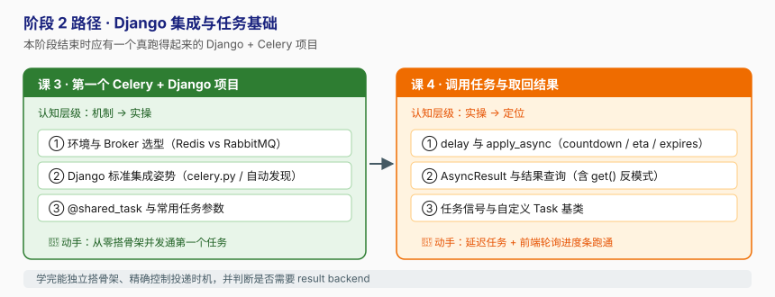

# 阶段 2：Django 集成与任务基础

> 所属课程：Celery + Django ｜ 故事章节：「把活儿交出去」 ｜ 上一阶段：[阶段 1 · 异步化的动因与 Celery 全景](../1-异步化的动因与Celery全景/overview.md)

## 🎯 本阶段目标

- 从零搭建一个**能跑起来**的 Django + Celery 项目，理解每一行集成代码的用意（而不是复制粘贴）。
- 会定义任务（`@shared_task`）、会调用任务（`delay` / `apply_async`）、会取回结果（`AsyncResult`）。
- 知道任务常用参数各自解决什么问题：`bind`、`max_retries`、`soft_time_limit`、`countdown`、`eta`、`expires`。
- 能判断"这个任务需不需要结果"，并给出理由。

## 📍 学习重点

- **为什么是 `proj/proj/celery.py` 这个位置**：这是 Celery 官方文档为 Django 定制的标准布局，目的是让 app 实例在 Django 启动时就被导入，`@shared_task` 才能找到它。
- **`shared_task` vs `app.task`**：一个解耦（可复用、避免循环导入），一个绑定。写可复用的 Django app 时选前者。
- **`delay()` 只是糖**：它把所有高级能力（`eta`、`expires`、`queue`、`retry_policy`）都藏起来了，真实项目里基本都在用 `apply_async()`。
- **结果后端是负担**：`get()` 会阻塞，且每条结果都要写 Redis 并配 TTL。多数"发后不管"任务应配 `ignore_result=True`。

## ✅ 必须掌握的知识点

| 知识点 | 所属课 | 学完应能 |
|--------|--------|----------|
| 环境与 Broker 选型 | 课 3 | 根据团队现状在 Redis / RabbitMQ 之间做出有依据的选择 |
| Django 标准集成姿势 | 课 3 | 不看文档从零搭出 celery.py + `__init__.py` + autodiscover |
| @shared_task 与常用任务参数 | 课 3 | 给任务正确配 `bind` / `name` / `max_retries` / 超时 |
| delay 与 apply_async | 课 4 | 用 `apply_async` 实现延迟执行、指定队列、设置过期 |
| AsyncResult 与结果查询 | 课 4 | 用 `AsyncResult` 查状态取结果，并说出 `get()` 的反模式 |
| 任务信号与自定义 Task 基类 | 课 4 | 用自定义基类统一收集所有任务的成功/失败钩子 |

## 🗺️ 本阶段路径图

## 本阶段产出

- [x] [`lessons/lesson-03-第一个Celery+Django项目.md`](lessons/lesson-03-第一个Celery+Django项目.md)
- [x] [`lessons/lesson-04-调用任务与取回结果.md`](lessons/lesson-04-调用任务与取回结果.md)

---

🧭 **下一阶段**：[阶段 3 · 可靠性与幂等](../3-可靠性与幂等/overview.md) — 跑通只是开始，接下来面对"半夜丢单"。
