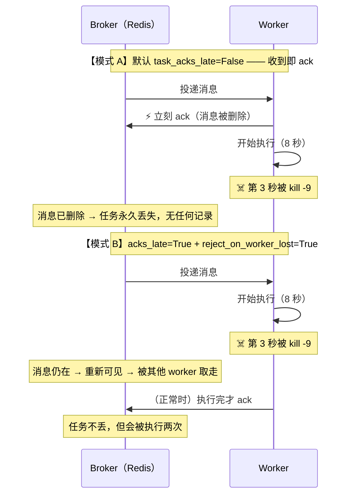
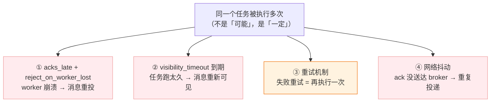
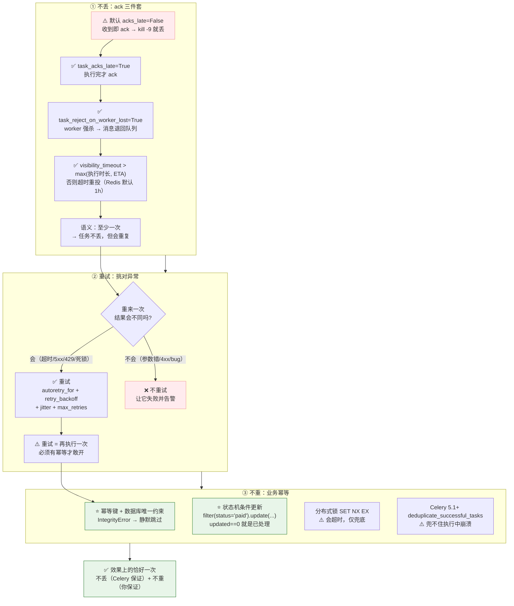

# 第 5 课：确认机制与重试策略

> 所属阶段：阶段 3《可靠性与幂等》｜ 水平：入门 ｜ 本课知识点：ack 时机与可见性超时、重试策略、幂等性设计
> 故事情节：半夜告警 —— 任务凭空消失了，而另一些任务被执行了两次。Celery 是"至少一次"投递，这句话的分量现在才真正体会到

> ℹ️ **版本基线（核查于 2026-08）**：本文所有默认值对照 Celery 5.6 官方 `Configuration` 与 `Tasks` 文档核实。

## 🎯 本课目标

- 解释 ack 的默认时机、`acks_late` 的收益与代价，并配出**不丢任务**的完整三件套
- 用 `autoretry_for` + `retry_backoff` + `jitter` 配出合理重试，**并判断哪些异常不该重试**
- 为"扣款 / 发券"这类任务设计幂等，理解**没有幂等的重试就是制造事故**

---

## 第一幕：场景引入

课 2 第四幕你亲手做过那个实验——`kill -9` worker 之后，`redis-cli LLEN celery` 返回 `0`，任务**凭空消失**了。当时我说"修复方案在课 5"。现在它真的发生在生产上：

> **凌晨 3:00**，运维按流程发版重启 worker。此时有 5 个"生成对账单"任务正在执行（每个 8 秒）。
>
> **上午 9:30**，运营反馈：**昨天深夜提交的 5 个报表，一个都没生成。**

你去查：

```bash
redis-cli -n 0 LLEN celery
# → (integer) 0            队列空的，什么都没留下
```

```log
[INFO/MainProcess] Received task: reports.generate_statement[a1b2c3d4-...]     ← 收到了
# 然后……什么都没有了。没有 succeeded，也没有 failed。
```

**任务收到了，但从未完成，而且不留痕迹。**

---

## 第二幕：认知冲突

你翻文档找到了 `task_acks_late`，改成 `True`，重启，再测一次——任务不丢了 ✅。

但第二天，新的投诉来了：

> 用户："我收到两封一模一样的对账单邮件。"
> 客服："有 3 个用户反馈被重复扣款了。"

你陷入了**两难**：

| 配置 | 丢任务？ | 重复执行？ |
|------|---------|-----------|
| 默认（`acks_late=False`） | ❌ **会丢** | ✅ 不会重 |
| `acks_late=True` | ✅ 不丢 | ❌ **会重** |

❓ **问题**：
1. ack 到底应该在什么时候发生？**为什么默认是"收到即 ack"这种明显会丢任务的设计？**
2. 开了 `acks_late` 之后，重复执行是从哪来的？
3. 怎么才能做到**既不丢也不重**？

---

## 第三幕：层层揭示

### 知识点 1：ack 时机与可见性超时

> 关键点：默认"收到即 ack"的隐患 ／ acks_late + reject_on_worker_lost 三件套 ／ Redis visibility_timeout 必须大于 ETA 与执行时长 ／ 动手：kill -9 对照实验

#### 一句话定义

**ack（acknowledge）** 是 worker 告诉 broker"这条消息我处理完了，你可以删了"的确认信号。**ack 发生在什么时候，决定了任务丢失与重复执行之间的取舍。**

#### 直觉建立（类比）

还是快递签收：

| 模式 | 类比 | 后果 |
|------|------|------|
| **默认（`acks_late=False`）** | 快递员**从网点取件时**就签字 | 包裹一离开网点责任就转移了。快递员半路出车祸 → 网点说"已签收，不关我事" → **丢件** |
| **`acks_late=True`** | **送到收件人手上**才签字 | 快递员半路出车祸 → 包裹退回网点重新派送 → **可能送两次**（如果已经送到了、但签字前出车祸） |

> 💡 **类比的边界**：真实快递不会"送到了又重送"，因为收件人是同一个、看一眼就知道。而 Celery 的重复执行**会产生真实副作用**（重复扣款、重复发券）。这就是知识点 3 存在的理由。

#### 核心原理

**① 两种 ack 时机的对比**



**② 四个相关配置**（核查于 2026-08）

| 配置 | 默认值 | 作用 |
|------|--------|------|
| `task_acks_late` | **False** | `True` = 执行完才 ack（而非收到即 ack） |
| `task_reject_on_worker_lost` | **False** | `True` = worker 进程异常退出时**把消息退回队列**。**只在 `acks_late=True` 时有意义** |
| `task_acks_on_failure` | **True** | 任务**失败**时是否仍 ack（不 ack 会导致失败任务被无限重投） |
| `task_acks_on_timeout` | **True** | 任务**超时**时是否仍 ack |

> ⚠️ **Celery 6.0 的变化**（提前知道免得踩坑）：原先合并的 `task_acks_on_failure_or_timeout` **已废弃**，拆成了 `task_acks_on_failure` 和 `task_acks_on_timeout` 两个独立配置（核查于 2026-08）。**现在写代码请用后两者。**

**③ ⭐ 关键理解：`acks_late` + `reject_on_worker_lost` 才是完整组合**

这是本课第一个高频踩坑点——**很多人只开 `acks_late=True` 就以为万事大吉**：

```python
# ❌ 不完整：只开 acks_late
CELERY_TASK_ACKS_LATE = True
# 问题：worker 被 kill -9 时，Celery 默认会把"worker 异常退出"也当成 ack，
#       消息照样被确认掉 → 任务还是丢了
```

```python
# ✅ 完整三件套
CELERY_TASK_ACKS_LATE = True              # ① 执行完才 ack
CELERY_TASK_REJECT_ON_WORKER_LOST = True  # ② worker 异常退出 → 消息退回队列
CELERY_WORKER_PREFETCH_MULTIPLIER = 1     # ③ 长任务场景：别囤货（课 9 详解）
```

**为什么需要 ③？** 回扣课 2：`worker_prefetch_multiplier` 默认 4，8 核机器一个 worker 会一次性抓 32 条消息进本地缓冲。这些消息**在 worker 本地**，broker 认为它们"已投递"。worker 一死，这些消息即使配了 `reject_on_worker_lost`，恢复起来也更麻烦（Celery 只在 worker 正常关闭时才可靠地 restore）。**长任务场景把 prefetch 调成 1，让 worker 手上只持有"正在跑的"那些。**

> ⚠️ **取值边界：`prefetch_multiplier=1` 不是普适推荐，别无脑抄**（这与课 2 说的"默认 4 也有道理"并不矛盾，区别在场景）：
>
> | 场景 | 建议值 | 理由 |
> |------|--------|------|
> | **长任务 / 任务耗时差异大**（报表、导出、视频处理） | **1** | 避免"先启动的 worker 囤货、后来的饿死"；崩溃时损失面小 |
> | **海量短任务**（毫秒~秒级，耗时均匀） | **4**（默认） | 高 prefetch 能摊薄 broker 往返开销，吞吐更高 |
> | **混合队列** | 拆队列（课 9） | 让长任务和短任务各走各的队列，分别配 prefetch |
>
> 🎯 **本课第四幕那份"完整配置"是按"长任务"场景给的**（对应第一幕的 8 秒报表任务）。如果你的任务都是毫秒级的，把这一项改回默认值即可——**前两项（`acks_late` + `reject_on_worker_lost`）才是普适必配的。**

⚠️ 官方文档对 `reject_on_worker_lost` 的原文警告：

> *"Enabling this can cause message loops; make sure you know what you're doing."*

**可能导致消息循环**：任务失败 → 消息重投 → 再失败 → 再重投 → ……所以必须配合**重试上限**（知识点 2）和**幂等**（知识点 3）。

**④ Redis 的 `visibility_timeout`（第二个雷，与 ack 正交）**

这是**独立于 ack 之外的另一套机制**，但表现得很像"ack 的替代品"，所以必须单独讲：

```
Redis 没有真正的 consumer ack。它用 visibility_timeout 模拟：

worker 取出消息 → 消息被"隐藏" visibility_timeout 秒（默认 3600 = 1 小时）
                  ↓
    这段时间内 worker 没有 ack
                  ↓
    broker 认为 worker 挂了 → 消息重新可见 → 被别的 worker 取走 → 重复执行
```

**两个致命后果**：

| 场景 | 后果 |
|------|------|
| **任务执行时长 > `visibility_timeout`** | 任务还在跑，消息就重新可见 → **另一个 worker 并发执行同一个任务** |
| **`countdown` / `eta` 的时间 > `visibility_timeout`** | 消息在 ETA 到期前就重新可见 → 重新投递 → 重新排期 → **无限循环放大** |

**配置方法**：

```python
# settings.py
CELERY_BROKER_TRANSPORT_OPTIONS = {
    'visibility_timeout': 43200,        # 12 小时（单位：秒）
}
```

> 🎯 **记住这个不等式**：
>
> **`visibility_timeout` > max(最长任务执行时长, 最长的 countdown / eta)**
>
> 举例：你的报表任务最长跑 30 分钟，最长 `countdown` 是 2 小时 → `visibility_timeout` 至少设 **3 小时**（留余量）。

⚠️ 但官方文档同时警告：*"this is not recommended as it may have negative impact on the reliability"*——把 `visibility_timeout` 设得特别长，会导致"worker **真**挂了之后，消息要等很久才重新可见"。

> 📌 **正确的做法**：**Broker 不是数据库。** 如果需要排很久以后的任务，应该用**数据库支持的周期任务**（`django-celery-beat`，课 7），而不是超长的 ETA。

#### 示例演示：kill -9 对照实验（回扣课 2）

**实验 A：默认配置**

```bash
redis-cli -n 0 FLUSHDB
python manage.py shell -c "
from reports.tasks import generate_statement
[print(generate_statement.delay(i, '2026-08').id) for i in range(4)]
"

celery -A proj worker --concurrency=2 -l INFO &
WORKER_PID=$!
sleep 3
kill -9 $WORKER_PID
sleep 1

redis-cli -n 0 LLEN celery
# → (integer) 0          ← ⚠️ 任务凭空消失
```

**实验 B：完整三件套**

```python
# settings.py
CELERY_TASK_ACKS_LATE = True
CELERY_TASK_REJECT_ON_WORKER_LOST = True
CELERY_WORKER_PREFETCH_MULTIPLIER = 1
```

```bash
redis-cli -n 0 FLUSHDB
python manage.py shell -c "
from reports.tasks import generate_statement
[print(generate_statement.delay(i, '2026-08').id) for i in range(4)]
"

celery -A proj worker --concurrency=2 -l INFO &
WORKER_PID=$!
sleep 3
kill -9 $WORKER_PID
sleep 1

redis-cli -n 0 LLEN celery
# → (integer) 2          ← ✅ 被 kill 时正在执行的 2 条消息回到了队列
```

重启 worker，你会看到关键日志：

```log
[WARNING/MainProcess] Restoring 2 unacknowledged message(s)
[INFO/MainProcess] Received task: reports.generate_statement[a1b2c3d4-...]
```

> 🎯 **`Restoring 2 unacknowledged message(s)` 就是 `reject_on_worker_lost` 生效的铁证。** 任务不丢了——**但它会被再执行一次**。这就引出了知识点 3。

#### 常见误区

1. **"开了 `acks_late` 就不会丢任务"** → 还需要 `reject_on_worker_lost=True`。只开前者，worker 被强杀时消息照样被确认掉。
2. **"Redis 的 `visibility_timeout` 就是 ack 超时"** → **两者正交**。即使配了 `acks_late=True`，任务跑太久照样会被 `visibility_timeout` 判定为超时并重复投递。
3. **"把 `visibility_timeout` 设成很大就安全了"** → 官方明确不推荐；worker 真挂了要等很久才恢复。需要长延迟请用 beat。
4. **"任务失败会自动重投"** → ❌ `task_acks_on_failure` 默认 `True`，失败的任务**已经 ack 了**，不会自动重投。想让它重来，得靠**重试机制**（知识点 2）。

#### 一句话记住

> **默认配置是"最多一次"（可能丢）；`acks_late` 之后变成"至少一次"（可能重）——Celery 不提供开箱即用的"恰好一次"，除非你自己做幂等。**

#### 官方文档

- Configuration and defaults：https://docs.celeryproject.org/en/stable/userguide/configuration.html
- Redis caveats（visibility timeout）：https://docs.celeryproject.org/en/stable/getting-started/backends-and-brokers/redis.html

---

### 知识点 2：重试策略

> 关键点：autoretry_for 与 retry_backoff ／ jitter 防重试风暴 ／ max_retries 与 Retry 异常 ／ 哪些异常不该重试（最重要）／ throws

#### 一句话定义

Celery 提供**声明式**（`autoretry_for`）和**命令式**（`self.retry()`）两种重试方式；一套好的重试策略必须回答三个问题：**哪些异常重试、重试几次、间隔多久**。

#### 直觉建立（类比）

客服打电话联系不上你：

- **立刻重拨 20 次** = 骚扰（**重试风暴**，把本就吃紧的下游打垮）
- **等 1 分钟、再等 2 分钟、再等 4 分钟** = **指数退避**（给下游恢复的时间）
- **全公司 100 个客服都在第 60 秒重拨** = **惊群（thundering herd）** → 加**随机抖动（jitter）**打散

> 💡 **类比的边界**：打电话联系不上，重试是零成本的。但任务重试**有真实副作用**——如果任务不幂等，重试 3 次等于执行 4 次（首次 + 3 次重试），扣款就是扣 4 次。

#### 核心原理

**① 声明式重试：`autoretry_for`**

```python
import requests
from celery import shared_task


@shared_task(
    bind=True,
    name='notifications.send_email',
    autoretry_for=(requests.exceptions.RequestException,),   # 只对这些异常重试
    max_retries=5,
    retry_backoff=True,          # 指数退避：1s, 2s, 4s, 8s, 16s…
    retry_backoff_max=600,       # 退避上限 10 分钟
    retry_jitter=True,           # 随机抖动（默认值就是 True）
)
def send_email(self, to, subject):
    ...
```

**参数速查**（核查于 2026-08）：

| 参数 | 默认值 | 说明 |
|------|--------|------|
| `autoretry_for` | `()` —— **默认不重试任何异常** | 触发自动重试的异常类型元组 |
| `dont_autoretry_for` | `()`（**5.3.0+**） | 排除某些异常（即使它匹配了 `autoretry_for`） |
| `max_retries` | **3** | 最大重试次数；`None` = 无限重试 |
| `default_retry_delay` | **180**（3 分钟） | 未开退避时的固定重试间隔 |
| `retry_backoff` | **False** | `True` → 1/2/4/8s…；数字 N → N/2N/4N/8N… |
| `retry_backoff_max` | **600**（10 分钟） | 退避延迟的上限 |
| `retry_jitter` | **True** | **全抖动**：实际延迟 = `random.uniform(0, 计算出的延迟)` |
| `retry_kwargs` | `{}` | 传给内部 `retry()` 的额外参数 |

**退避延迟到底怎么算**（官方算法）：

```python
import random

def backoff_delay(attempt, base=1, cap=600, jitter=True):
    delay = min(cap, base * (2 ** attempt))
    if jitter:
        delay = random.uniform(0, delay)      # ⚠️ 全抖动！不是"±10%"
    return delay

for attempt in range(8):
    raw = min(600, 1 * (2 ** attempt))
    print(f'第 {attempt + 1} 次重试: 理论延迟={raw:>3}s')
```

```
第 1 次重试: 理论延迟=  1s
第 2 次重试: 理论延迟=  2s
第 3 次重试: 理论延迟=  4s
第 4 次重试: 理论延迟=  8s
第 5 次重试: 理论延迟= 16s
第 6 次重试: 理论延迟= 32s
...
```

⚠️ **`retry_jitter=True` 是"全抖动"（full jitter）**：实际延迟在 `[0, 理论延迟]` 之间均匀随机，**可能接近 0**。

- ✅ 优点：最大化打散，防惊群效果最好
- ⚠️ 代价：你**无法保证"至少等 N 秒"**

如果你需要"最短等待时间有保障"（比如第三方限流要求至少间隔 30 秒），应该**关掉 jitter** 并自己控制：

```python
@shared_task(autoretry_for=(RequestException,), max_retries=5,
             retry_backoff=30,        # 30s, 60s, 120s, 240s…
             retry_jitter=False)      # 关掉抖动，保证下限
def call_api(self, ...): ...
```

**② 命令式重试：`self.retry()`**

需要**根据响应内容决定**是否重试时用它（典型场景：HTTP 429 要读 `Retry-After` 头）：

```python
import requests
from celery import shared_task


@shared_task(bind=True, name='notifications.send_email', max_retries=5)
def send_email(self, to, subject):
    try:
        resp = requests.post(MAIL_API, json={...}, timeout=10)

        if resp.status_code == 429:                       # 限流
            retry_after = int(resp.headers.get('Retry-After', 60))
            raise self.retry(countdown=retry_after)       # 按服务端要求等

        if resp.status_code >= 500:                       # 服务端错误，可重试
            raise self.retry(countdown=60)

        resp.raise_for_status()                           # 4xx（除 429）不重试

    except requests.exceptions.Timeout as exc:
        # 手动实现指数退避（retry_backoff 只对 autoretry_for 生效）
        raise self.retry(exc=exc, countdown=2 ** self.request.retries)

    return {'ok': True}
```

⚠️ **三条铁律**：

1. **`self.retry()` 必须 `raise`** —— `self.retry(...)` 只是**构造**了一个 `Retry` 异常对象，不 `raise` 就不会重试
2. **必须 `bind=True`** —— 否则没有 `self`
3. **不要在 `try/except` 里吞掉它** —— 见下方经典错误

```python
# ❌ 经典错误：吞掉了异常，autoretry_for 完全失效
@shared_task(bind=True, autoretry_for=(RequestException,))
def send_email(self, to):
    try:
        do_send(to)
    except Exception as exc:
        logger.error('发送失败: %s', exc)
        # 没 raise → Celery 认为任务"正常完成"了 → 不会重试
```

**③ ⭐ 哪些异常不该重试（本课最重要的判断）**

这一节的判断力，比会写配置重要得多：

| 分类 | 例子 | 重试？ | 理由 |
|------|------|--------|------|
| **瞬时故障（transient）** | 网络超时、连接重置、5xx、限流 429、数据库死锁 | ✅ **该重试** | 等一会儿情况可能就变了 |
| **确定性失败（deterministic）** | 参数类型错误、数据不存在、JSON 解析失败、4xx（除 429） | ❌ **别重试** | 重试 N 次结果完全一样，纯浪费 |
| **业务规则拒绝** | 余额不足、权限不足、状态不允许 | ❌ 别重试 | 需要人工介入，重试只会刷日志 |
| **代码 bug** | `KeyError`、`AttributeError`、写错的字段名 | ❌ 别重试 | 重试只会产生 N 份相同的错误日志 |

> 🎯 **判断口诀**：**"如果重来一次，结果会不一样吗？"**
> **会** → 重试；**不会** → 让它失败并告警。

⚠️ **绝对不要写 `autoretry_for=(Exception,)`** —— 这会把代码 bug 也纳入重试。一个 `KeyError` 重试 3 次 = 4 份错误日志，还把队列堵住，真正的瞬时故障反而排不上队。

**④ `throws`：把"预期内的失败"降级**

```python
@shared_task(name='orders.get_order', throws=(OrderNotFound,))
def get_order(order_id):
    ...
```

声明在 `throws` 里的异常：

- 仍会被记为 **FAILURE**（写进 result backend）
- 但 worker **不会**按 ERROR 级别记日志，**不打印 traceback**（按 INFO 记录）

> 适合"业务上预期会发生的失败"（比如查不到记录），避免污染错误日志和告警渠道。

#### 示例演示：观察完整的重试过程

```python
# reports/tasks.py
from celery import shared_task


class TransientError(Exception):
    """模拟瞬时故障（如第三方接口超时）。"""


@shared_task(
    bind=True,
    name='reports.flaky_task',
    autoretry_for=(TransientError,),
    max_retries=5,
    retry_backoff=True,
    retry_jitter=False,          # 关掉抖动，方便观察理论延迟
)
def flaky_task(self, n):
    attempt = self.request.retries + 1
    print(f'第 {attempt} 次执行 (retries={self.request.retries})')
    if attempt < 4:              # 前 3 次都失败
        raise TransientError('模拟第三方接口超时')
    return f'第 {attempt} 次成功'
```

```bash
celery -A proj worker -l INFO

python manage.py shell -c "
from reports.tasks import flaky_task
print(flaky_task.delay(1).get(timeout=60))
"
```

worker 日志（时间跨度约 1+2+4 = 7 秒）：

```log
[INFO/ForkPoolWorker-1] 第 1 次执行 (retries=0)
[WARNING/ForkPoolWorker-1] Task reports.flaky_task[a1b2...] retry: Retry in 1s: TransientError(模拟第三方接口超时)
[INFO/ForkPoolWorker-2] 第 2 次执行 (retries=1)
[WARNING/ForkPoolWorker-2] Task reports.flaky_task[a1b2...] retry: Retry in 2s: TransientError(模拟第三方接口超时)
[INFO/ForkPoolWorker-3] 第 3 次执行 (retries=2)
[WARNING/ForkPoolWorker-3] Task reports.flaky_task[a1b2...] retry: Retry in 4s: TransientError(模拟第三方接口超时)
[INFO/ForkPoolWorker-4] 第 4 次执行 (retries=3)
[INFO/ForkPoolWorker-4] Task reports.flaky_task[a1b2...] succeeded in 0.01s: '第 4 次成功'
```

> 🎯 **注意 `max_retries=5` 但只重试了 3 次** —— 因为第 4 次执行就成功了。**`max_retries` 是上限，不是"必须重试这么多次"。**

#### 常见误区

1. **`self.retry()` 不 raise** → 只是构造了异常对象，不会重试
2. **`autoretry_for=(Exception,)`** → 把代码 bug 也纳入重试
3. **在 `except` 里吞掉异常** → `autoretry_for` 完全失效
4. **以为 `max_retries=3` 是"总共执行 3 次"** → 是"**最多重试 3 次**"，总共可能执行 **4 次**（首次 + 3 次重试）
5. **以为 `retry_jitter` 是"小幅度抖动"** → 是**全抖动**，实际延迟可能是 0.3 秒
6. **对 4xx 错误重试** → 参数错误重试一万次也是参数错误

#### 一句话记住

> **只重试"重来一次结果可能不同"的异常；退避 + 抖动 + 上限，一个都不能少。**

#### 官方文档

- Tasks（重试相关属性）：https://docs.celeryproject.org/en/stable/userguide/tasks.html

---

### 知识点 3：幂等性设计

> 关键点：至少一次投递语义 ／ 业务幂等键 + 唯一约束 ／ 状态机条件更新 ／ 分布式锁的坑 ／ worker_deduplicate_successful_tasks 的边界

#### 一句话定义

**幂等（Idempotent）** = 同一个任务执行一次和执行 N 次，产生的**业务结果完全相同**。它是"敢开 `acks_late`、敢配重试"的**前提**。

#### 直觉建立（类比）

电梯按钮：

- 你按一次"18 楼" → 电梯去 18 楼
- 你不放心又按了 5 次 → 电梯**还是只去一次 18 楼**（不会跑 5 趟）
- 这就是幂等：**重复的请求不产生额外效果**

**SQL 层面的对照**：

```sql
UPDATE account SET balance = balance - 100;   -- ❌ 不幂等：执行 2 次减 200
UPDATE account SET balance = 900;             -- ✅ 幂等：执行 2 次还是 900
```

> 💡 **类比的边界**：电梯按钮的幂等是硬件"免费送的"。**Celery 不会免费给你幂等**——它是至少一次投递，重复执行一定会发生，幂等必须**由你设计**。

#### 核心原理

**① 为什么必须有幂等：重复执行的四个来源**



> 🎯 **请先接受这个事实**：**重复执行不是"可能"，是"一定"。** 只要系统跑得够久、任务够多，它就必然发生。
> 设计的目标不是"**消除重复**"（做不到），而是"**让重复变得无害**"。

**② 四种幂等设计模式**（从简单到复杂）

| 模式 | 做法 | 适用 | 可靠性 |
|------|------|------|--------|
| **① 天然幂等** | 把"增量操作"改造成"赋值/条件操作" | 状态更新 | ⭐⭐⭐⭐⭐ |
| **② 幂等键 + 数据库唯一约束** | 业务唯一键 + `UniqueConstraint` | 创建类操作（发券、记账） | ⭐⭐⭐⭐⭐ |
| **③ 状态机条件更新** | `filter(前置状态).update(目标状态)` | 有明确状态的业务 | ⭐⭐⭐⭐ |
| **④ 分布式锁** | Redis `SET NX EX` | 上述都兜不住时的兜底 | ⭐⭐（有超时问题） |

---

**模式①：天然幂等（最优，优先争取）**

```python
from django.db.models import F

# ❌ 不幂等：每次执行都减 100
def charge(user_id, amount):
    Profile.objects.filter(user_id=user_id).update(balance=F('balance') - amount)

# ⚠️ 改成"基于订单扣款"，但还不够 —— 执行两次仍会减两次
def charge(order_id):
    order = Order.objects.get(id=order_id)
    Profile.objects.filter(user_id=order.user_id).update(
        balance=F('balance') - order.amount,
    )
    order.status = 'charged'
    order.save()
```

> 🎯 光把"增量"改"赋值"还不够——上面这个 `charge` 执行两次仍会扣两次。**真正的幂等要靠下面两种模式的状态位/唯一约束。**

---

**模式②：幂等键 + 唯一约束（最常用、最可靠）** ⭐

```python
# coupons/models.py
from django.db import models


class CouponGrant(models.Model):
    user = models.ForeignKey('auth.User', on_delete=models.CASCADE)
    campaign_id = models.CharField(max_length=64)
    granted_at = models.DateTimeField(auto_now_add=True)

    class Meta:
        constraints = [
            # ⭐ 唯一约束：同一用户 + 同一活动，只能发一张券
            models.UniqueConstraint(
                fields=['user', 'campaign_id'],
                name='uniq_user_campaign_grant',
            )
        ]
```

```python
# coupons/tasks.py
import logging

from celery import shared_task
from django.db import IntegrityError, transaction

logger = logging.getLogger(__name__)


@shared_task(bind=True, name='coupons.grant', max_retries=3)
def grant_coupon(self, user_id, campaign_id):
    try:
        with transaction.atomic():
            # 唯一约束保证：并发下也只会有一个成功
            CouponGrant.objects.create(user_id=user_id, campaign_id=campaign_id)
            _do_grant(user_id)                    # 真正的发券动作
    except IntegrityError:
        # 唯一约束冲突 = 已经发过了 → 静默跳过，不算失败
        logger.info('[grant] 已发放过，跳过 user=%s campaign=%s', user_id, campaign_id)
        return {'skipped': True}
    return {'granted': True}


def _do_grant(user_id):
    ...     # 真正的发券逻辑（普通函数，可单独测试）
```

> 🎯 **这是最推荐的模式**：把幂等的保证**下推给数据库的唯一约束**，而不是靠应用层的"先查后写"。**数据库约束是并发安全的，应用层的 if 判断不是。**

---

**模式③：状态机条件更新（注意原子性）**

```python
import logging

from celery import shared_task

logger = logging.getLogger(__name__)


@shared_task(bind=True, name='orders.ship')
def ship_order(self, order_id):
    # ✅ 一条原子 SQL：只有当前状态是 paid 时才更新
    updated = Order.objects.filter(
        id=order_id,
        status='paid',                    # ← 前置状态
    ).update(status='shipped')

    if updated == 0:
        # 没更新到 = 订单不存在，或状态不是 paid（已经发货过了）
        logger.info('[ship] 跳过：订单 %s 不处于 paid 状态', order_id)
        return {'skipped': True}

    _do_ship(order_id)                    # 真正的发货动作
    return {'shipped': True}
```

> 🎯 **关键点**：`filter(status='paid').update(status='shipped')` 是**一条原子 SQL**（条件更新），`updated == 0` 就说明"已经处理过了"。
>
> **千万不要写成这样**：
> ```python
> # ❌ 有并发竞态：两个任务可能同时通过检查
> order = Order.objects.get(id=order_id)
> if order.status == 'paid':
>     order.status = 'shipped'
>     order.save()
> ```

---

**模式④：分布式锁（兜底方案，注意三个坑）**

```python
import logging

from celery import shared_task
from django.conf import settings
import redis

logger = logging.getLogger(__name__)
rdb = redis.Redis.from_url(settings.REDIS_URL)


@shared_task(bind=True, name='reports.generate_statement')
def generate_statement(self, user_id, month):
    lock_key = f'lock:statement:{user_id}:{month}'
    # SET NX EX：不存在才设置 + 30 秒自动过期（防死锁）
    acquired = rdb.set(lock_key, self.request.id, nx=True, ex=30)
    if not acquired:
        logger.info('[statement] 已有任务在执行，跳过')
        return {'skipped': True}

    try:
        return _do_generate(user_id, month)
    finally:
        # ⚠️ 别无脑 del —— 可能删掉别人（超时后续任者）的锁
        # 用 Lua 脚本保证"只删自己的锁"（GET + DEL 原子化）
        rdb.eval(
            "if redis.call('get', KEYS[1]) == ARGV[1] then "
            "return redis.call('del', KEYS[1]) else return 0 end",
            1, lock_key, self.request.id,
        )
```

> ⚠️ **分布式锁的三个坑**：
> 1. **必须设过期时间**（`ex=30`），否则任务异常退出时锁永不释放 → 死锁
> 2. **释放时要校验持有者**，否则可能删掉"超时后续任者"的锁
> 3. **锁超时了但任务还没跑完** → 仍可能并发执行
>
> **结论：锁是兜底，不是银弹。** 能用唯一约束/条件更新解决的，别用锁。

---

**③ Celery 自带的一个去重能力（5.1+）**

```python
CELERY_WORKER_DEDUPLICATE_SUCCESSFUL_TASKS = True
```

`worker_deduplicate_successful_tasks`（核查于 2026-08，**5.1 引入，默认 `False`**）：

> 每次执行任务前，worker 检查"这个 `task_id` 在 result backend 里**是否已经是 SUCCESS 状态**"。如果是 → **跳过执行**。

⚠️ **三个前提条件**（缺一不可）：

| 前提 | 说明 |
|------|------|
| ① 必须开 `task_acks_late=True` | 只在延迟确认模式下有意义 |
| ② 必须配**持久化**的 result backend | RPC backend 无效（非持久化） |
| ③ 消息必须是被 broker **重新投递（redelivered）**的 | 只对重投的消息做检查 |

> 🎯 **它能解决什么**：worker 崩溃后消息重投，而这个任务其实**已经成功执行过了** → 跳过，避免重复。
>
> **它不能解决什么**：任务**执行到一半**崩溃（此时 backend 里没有 SUCCESS 记录）→ 照样重复执行。
>
> **所以：业务侧幂等仍然不可替代。** 这个配置是"减少重复"的优化，不是"消除重复"的保证。

**④ 幂等设计自查清单**

写完任何一个有副作用的任务，拿这五条自查：

- [ ] 这个任务执行两次，会不会产生**两份业务记录**？（发两封邮件、扣两次款）
- [ ] 我用的幂等保证是**数据库约束**，还是**应用层 if 检查**？（前者并发安全）
- [ ] 如果是"先查后写"，有没有**并发竞态**？（改成条件更新或唯一约束）
- [ ] 任务里的**外部副作用**（调第三方 API、发短信）是否也带了幂等键？
- [ ] 用了分布式锁的话，有没有处理**锁超时**和**误删别人的锁**？

#### 示例演示：验证幂等真的生效

```bash
python manage.py shell <<'EOF'
from coupons.tasks import grant_coupon

# 连续投递 3 次同一个任务（模拟重复投递 / 重试）
for i in range(3):
    r = grant_coupon.delay(1, 'campaign-2026-08')
    print(r.get(timeout=10))
EOF
```

```
{'granted': True}      ← 第一次：真正发券
{'skipped': True}      ← 第二次：唯一约束冲突，跳过
{'skipped': True}      ← 第三次：跳过
```

```bash
python manage.py shell -c "
from coupons.models import CouponGrant
print(CouponGrant.objects.filter(user_id=1, campaign_id='campaign-2026-08').count())
"
# → 1        ← 只发了一张券
```

> ✅ **回扣第二幕困惑 2**：用户收到两封邮件的问题，就是这么解决的。

#### 常见误区

1. **"先查后写"就算幂等了** → 有并发竞态，两个任务可能同时通过检查。**必须靠数据库约束或条件更新。**
2. **"用了分布式锁就绝对安全"** → 锁超时后任务还在跑，照样并发。**锁是兜底，不是银弹。**
3. **"开了 `worker_deduplicate_successful_tasks` 就不用做业务幂等了"** → 它只在"任务已成功完成后又被重投"时有效；**执行中崩溃的场景完全兜不住**，且依赖持久化 backend。
4. **"我的任务是发通知，重复发一次无所谓"** → 对用户体验不是无所谓；而且这个"无所谓"的习惯会蔓延到扣款任务上。

#### 一句话记住

> **重试和 `acks_late` 都依赖幂等——没有幂等的重试，就是把一次事故变成四次事故。**

#### 官方文档

- Worker 配置（`worker_deduplicate_successful_tasks`）：https://docs.celeryproject.org/en/stable/userguide/configuration.html

---

## 第四幕：实操验证

> 回扣第一幕的"凌晨丢任务"事故，以及第二幕的"重复扣款"投诉。给出一套**可直接落地**的完整配置。

### ① 可靠性配置（可直接复制进 settings.py）

```python
# proj/proj/settings.py

# ===== ① 可靠性三件套（保证「不丢」）=====
# ①② 是普适必配，任何场景都建议开
CELERY_TASK_ACKS_LATE = True              # 执行完才 ack（不再"收到即 ack"）
CELERY_TASK_REJECT_ON_WORKER_LOST = True  # worker 被强杀 → 消息退回队列
# ③ 按场景取值：长任务/耗时差异大 → 1；海量毫秒级短任务 → 保持默认 4
CELERY_WORKER_PREFETCH_MULTIPLIER = 1     # 本例为 8 秒的报表任务，故设 1

# ===== ② 可见性超时（必须 > 最长任务时长 & 最长 ETA）=====
CELERY_BROKER_TRANSPORT_OPTIONS = {
    'visibility_timeout': 43200,          # 12 小时
}

# ===== ③ 去重（可选，Celery 5.1+）=====
CELERY_WORKER_DEDUPLICATE_SUCCESSFUL_TASKS = True

# ===== ④ 结果后端（去重能力依赖它）=====
CELERY_RESULT_BACKEND = 'redis://localhost:6379/1'
CELERY_TASK_TRACK_STARTED = True
```

### ② 三种配置下 kill -9 的结果对照

| 配置 | `kill -9` 后 `LLEN celery` | 任务去向 | 语义 |
|------|---------------------------|---------|------|
| **默认**（`acks_late=False`） | `0` | ❌ **永久丢失** | 最多一次 |
| **只开 `acks_late`** | `0` | ❌ **仍然丢失**（漏了 `reject_on_worker_lost`） | 不完整 |
| **完整三件套** | `2` | ✅ 退回队列，重启后重新执行 | 至少一次 |

```bash
# 完整三件套下的关键日志（重启 worker 时）
celery -A proj worker -l INFO
# [WARNING/MainProcess] Restoring 2 unacknowledged message(s)
# [INFO/MainProcess] Received task: reports.generate_statement[a1b2c3d4-...]
```

> ✅ **回扣第一幕**：那 5 个"没生成的报表"现在会自己回来。**代价是它们会被执行两次** —— 所以必须做幂等。

### ③ 幂等改造 + 验证

（用知识点 3 模式② 的 `grant_coupon`）

```bash
python manage.py shell -c "
from coupons.tasks import grant_coupon
print(grant_coupon.delay(1, 'c1').get(timeout=10))    # {'granted': True}
print(grant_coupon.delay(1, 'c1').get(timeout=10))    # {'skipped': True}
print(grant_coupon.delay(1, 'c1').get(timeout=10))    # {'skipped': True}
"
# 数据库记录数 = 1
```

> ✅ **回扣第二幕困惑 2 —— "既不丢也不重"的完整答案**：
>
> | 保证 | 由谁提供 |
> |------|---------|
> | **不丢** | `acks_late` + `reject_on_worker_lost` + 合理的 `visibility_timeout` |
> | **不重** | **业务侧幂等**（唯一约束 / 条件更新） |
>
> **两者缺一不可，而且"不重"这一半 Celery 帮不了你。**

### ④ 观察重试的退避节奏

（用知识点 2 的 `flaky_task`，看 `Retry in 1s / 2s / 4s` 的日志）

---

## 第五幕：体系收束

> 📍 **全局定位：这是整套课程的技术分水岭。** 你现在掌握了 Celery 最核心的一组取舍：
>
> | 配置 | 投递语义 | 代价 |
> |------|---------|------|
> | 默认（`acks_late=False`） | **最多一次**（at-most-once） | 可能**丢**任务 |
> | `acks_late` + `reject_on_worker_lost` | **至少一次**（at-least-once） | 可能**重复**执行 |
> | 上述 **+ 业务幂等** | **效果上的恰好一次** | 需要你自己设计幂等 |
>
> 🎯 **这张表就是本课的全部。** Celery **不提供**开箱即用的"恰好一次"——它给你"不丢"的保证，"不重"由你的业务代码负责。
>
> **三条可以立刻用上的结论**：
> 1. **生产必配**：`acks_late` + `reject_on_worker_lost` + 大于最长任务时长的 `visibility_timeout`
> 2. **重试要挑异常**：只重试"重来一次结果可能不同"的
> 3. **有副作用的任务必须幂等**：优先用数据库唯一约束，别用应用层的 if 判断
>
> 🔗 **下一步**：课 6《Django 事务与 ORM 的坑》—— 修掉课 3 列出的第三个隐患：**事务未提交就发任务**，以及 worker 里的数据库连接管理。这是 **Celery + Django 组合特有**的一类坑（纯 Celery 项目不会遇到），也是实际项目里最常被忽略的。

---

## 🐞 常见误区（本课汇总）

1. **"开了 `acks_late` 就不会丢任务"** → 还需要 `reject_on_worker_lost=True`
2. **"`visibility_timeout` 就是 ack 超时"** → 两者**正交**，都可能导致重复
3. **"`visibility_timeout` 设越大越安全"** → 官方不推荐；长延迟请用 beat
4. **"任务失败会自动重投"** → `acks_on_failure` 默认 True，失败任务**已 ack**，不会重投
5. **`self.retry()` 不 raise** → 不会重试
6. **`autoretry_for=(Exception,)`** → 把代码 bug 也纳入重试
7. **在 `except` 里吞掉异常** → `autoretry_for` 完全失效
8. **以为 `max_retries=3` 是"总共执行 3 次"** → 实际是**首次 + 3 次重试 = 4 次**
9. **以为 `retry_jitter` 是小幅度抖动** → 是**全抖动**，可能接近 0
10. **"先查后写"算幂等** → 有并发竞态，必须靠约束/条件更新
11. **"分布式锁绝对安全"** → 会超时；锁是兜底不是银弹
12. **"开了 `deduplicate_successful_tasks` 就不必做幂等"** → 它兜不住"执行中崩溃"

## 一图总结



## 课后小测

**Q1**：你配置了 `CELERY_TASK_ACKS_LATE = True`，但没有开 `task_reject_on_worker_lost`。worker 在执行任务时被 `kill -9`。**最可能发生什么？**

- A. 消息退回队列，任务会被重新执行
- B. 消息被确认掉，任务丢失
- C. 任务状态变成 `FAILURE`
- D. 消息一直留在队列里直到 `visibility_timeout` 到期后重投

<details><summary>答案与解析</summary>

**答案：B**。这是本课第一个高频踩坑点。

`task_reject_on_worker_lost` 默认 **False**，意味着**即使开了 `acks_late`，Celery 在 worker 进程异常退出时仍会把消息确认掉**。两个配置必须配套：

```python
CELERY_TASK_ACKS_LATE = True              # ①
CELERY_TASK_REJECT_ON_WORKER_LOST = True  # ② 少了这个，① 的效果大打折扣
```

- A 是"两个都开了"的结果，会看到日志 `Restoring N unacknowledged message(s)`。
- C 错，进程被强杀根本没机会写状态。
- D 描述的是 Redis `visibility_timeout` 的行为，但那要求任务**执行时长超过** `visibility_timeout`（默认 1 小时），而 `kill -9` 是立刻发生的。

</details>

**Q2**：关于重试策略，下列说法正确的是？

- A. `max_retries=3` 表示这个任务最多会被执行 3 次
- B. `retry_jitter=True` 会在理论退避延迟的基础上做小幅随机浮动（如 ±10%）
- C. 对 `ValueError`（参数类型错误）配置 `autoretry_for` 是合理的，能提升任务成功率
- D. `retry_backoff=True` 时，重试延迟按 1s、2s、4s、8s… 增长，直到 `retry_backoff_max`（默认 600s）

<details><summary>答案与解析</summary>

**答案：D**。

- **A 错**：`max_retries=3` 表示**最多重试 3 次**，加上首次执行，**总共可能执行 4 次**。
- **B 错**：`retry_jitter=True` 是**全抖动（full jitter）**——实际延迟是 `random.uniform(0, 理论延迟)`，**可能接近 0**，不是小幅浮动。
- **C 错**：`ValueError` 是**确定性失败**，重试 N 次结果完全一样，纯属浪费队列资源并污染日志。**只重试"重来一次结果可能不同"的异常**（超时、5xx、429、死锁）。
- **D 正确**：官方算法为 `delay = min(retry_backoff_max, base * 2**attempt)`，`retry_backoff_max` 默认 **600**（10 分钟）。

</details>

**Q3**：你要给一个"发放优惠券"的任务做幂等，下列做法**最可靠**的是？

- A. 任务开头先 `CouponGrant.objects.filter(...).exists()` 查一下，不存在才发
- B. 给 `CouponGrant` 加 `UniqueConstraint(user, campaign_id)`，捕获 `IntegrityError` 后静默返回
- C. 用 Redis 分布式锁 `SET NX EX 30` 包住整个任务
- D. 开启 `CELERY_WORKER_DEDUPLICATE_SUCCESSFUL_TASKS = True`

<details><summary>答案与解析</summary>

**答案：B**。把幂等的保证**下推给数据库的唯一约束**，是并发安全的。

- **A 错**：典型的"先查后写"竞态——两个并发任务可能**同时**通过 `exists()` 检查，然后都执行发券。
- **C 不够可靠**：分布式锁是**兜底**方案，有三个坑（必须设过期时间防死锁、释放时校验持有者防误删、**锁超时后任务仍在跑仍会并发**）。能用唯一约束解决的，别用锁。
- **D 错**：它有三个前提（需 `acks_late`、需**持久化** result backend、只对 broker **重投**的消息生效），**且兜不住"执行中崩溃"**——此时 backend 里没有 SUCCESS 记录，重投后照样重复执行。**它是"减少重复"的优化，不是"消除重复"的保证。**

推荐写法：

```python
try:
    with transaction.atomic():
        CouponGrant.objects.create(user_id=user_id, campaign_id=campaign_id)
        _do_grant(user_id)
except IntegrityError:
    logger.info('已发放过，跳过')
    return {'skipped': True}
```

</details>

---

## 🚀 下一批接力提示词

> 学完本批后，**复制下面这段文字发给 AI**，即可无缝进入下一批（无需重新描述上下文）：

```
继续学 Celery + Django。我的学习档案在 celery-django/00-学习档案.md，
刚学完阶段 3《可靠性与幂等》的课《确认机制与重试策略》知识点
「ack 时机与可见性超时」「重试策略」「幂等性设计」，
请按大纲继续讲解下一批知识点（课 6《Django 事务与 ORM 的坑》）。
```

## 🧭 课程导航

⬅️ **上一课**：[第 4 课：调用任务与取回结果](../../2-Django集成与任务基础/lessons/lesson-04-调用任务与取回结果.md)

➡️ **下一课**：[第 6 课：Django 事务与 ORM 的坑](lesson-06-Django事务与ORM的坑.md)

📚 **返回目录**：[课程目录](../../02-课程目录.md)
