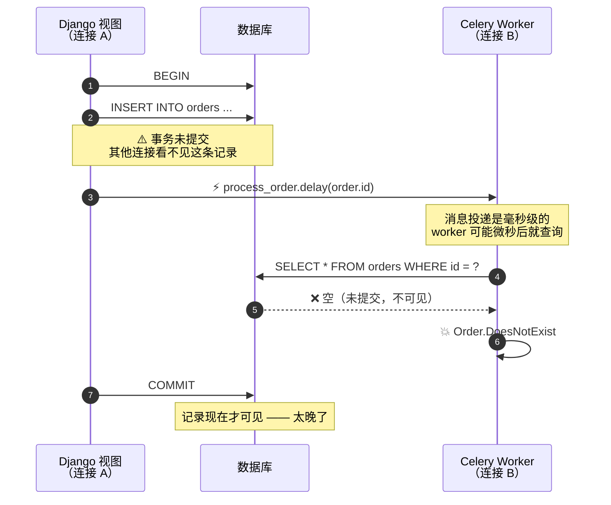
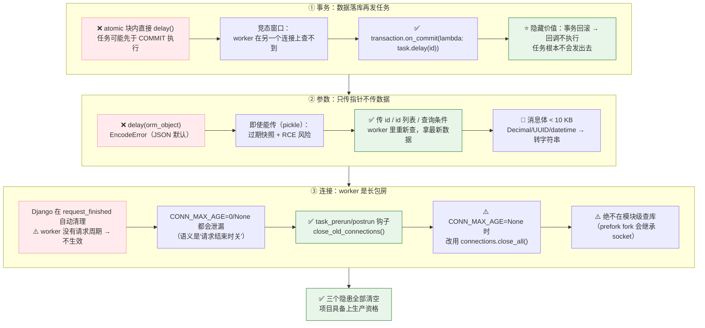

# 第 6 课：Django 事务与 ORM 的坑

> 所属阶段：阶段 3《可靠性与幂等》｜ 水平：入门 ｜ 本课知识点：事务提交后再发任务、任务参数序列化、worker 里的数据库连接管理
> 故事情节：三个"代码看着完全对，但线上就是不对"的 bug —— 它们都是 Celery 与 Django 组合**特有**的坑，纯 Celery 项目遇不到

> ℹ️ **版本基线（核查于 2026-08）**：Django 行为描述对照 Django 5.1 官方 `databases` 与 `transactions` 文档核实；Celery 侧结论对照 Celery 5.6 文档。

## 🎯 本课目标

- 用 `transaction.on_commit()` 消灭"任务查不到刚创建的数据"这类**竞态**故障
- 说清为什么任务参数**只能传 id 不传对象**，以及 pickle 的安全红线
- 理解 Django 的自动连接管理**为什么在 worker 里失效**，并补上清理钩子

---

## 第一幕：场景引入

项目上线一个月，你收到三个"看着完全不可能"的 bug 报告：

**Bug 1（偶发，只在生产）**：
```log
[ERROR] Task orders.process_order[3f9a1c2e] raised unexpected:
        Order.DoesNotExist: Order matching query does not exist.
```
你手动查数据库——**记录明明在那儿**。而且**本地开发环境 100% 复现不了**。

**Bug 2（必现，一上线就炸）**：
```log
kombu.exceptions.EncodeError: Object of type Order is not JSON serializable
```
你传了个 ORM 对象进去。本地用 `CELERY_TASK_ALWAYS_EAGER=True` 测试时明明是好的。

**Bug 3（慢性，一周后爆发）**：

> DBA："你们的 worker 占了 **800 个数据库连接**，把配额吃光了，其他服务都连不上。"

🎬 **场景**：这三个 bug 的共同点是——**每一行的代码单独看都对**。它们错在"Django 的请求周期"与"Celery 的长驻进程"这两套**不同的运行模型**之间的错位。

---

## 第二幕：认知冲突

**Bug 1 最诡异**。你加了日志：

```python
@transaction.atomic
def create_order(request):
    order = Order.objects.create(user_id=1, amount=100)
    logger.info('创建订单 %s', order.id)          # ✅ 打印出来了
    process_order.delay(order.id)
    return JsonResponse({'id': order.id})
```

```python
@shared_task(name='orders.process')
def process_order(order_id):
    logger.info('处理订单 %s', order_id)           # ✅ 打印出来了，id 是对的
    order = Order.objects.get(id=order_id)         # 💥 这里 DoesNotExist
```

**视图里刚创建的数据，任务里就是查不到。** 你甚至怀疑是不是用了不同的数据库。

**Bug 3 你也不理解**：*"Django 不是会自动管理数据库连接吗？每个请求结束就关掉了呀。"*

❓ **问题**：
1. 为什么"创建完就发任务"，任务却查不到刚创建的数据？
2. 为什么 ORM 对象不能当参数传？
3. 为什么 Django 的自动连接管理在 worker 里**失效了**？

---

## 第三幕：层层揭示

### 知识点 1：事务提交后再发任务（on_commit）

> 关键点：竞态窗口是怎么产生的 ／ on_commit 的三种行为 ／ 事务回滚时回调不执行（隐藏价值）／ 什么时候不需要

#### 一句话定义

`transaction.on_commit()` 注册一个回调，**在当前事务成功提交之后才执行**；用它把"发任务"这个动作，推迟到数据真正落库之后。

#### 直觉建立（类比）

你在 Word 里写文档：

- 你正在写第 3 章（**事务内，还没点保存**）
- 你扭头对同事说："去看一下我刚写的第 3 章"（**发任务**）
- 同事打开看：**空白** —— 因为你还没保存
- 正确做法：**等保存完再通知他**（`on_commit`）

> 💡 **类比的边界**：Word 没保存，文件就真的不存在。而数据库事务未提交时，那条记录**在数据库里是存在的**，只是**对其他连接不可见**——对你自己的连接可见。
>
> **这正是这个 bug 诡异的地方**：你在 Django 视图里 `Order.objects.get(id=...)` 查得到（同一个连接），worker 里查不到（另一个连接）。

#### 核心原理

**① 竞态窗口是怎么产生的**

```python
# ❌ 经典 bug
from django.db import transaction

@transaction.atomic
def create_order(request):
    order = Order.objects.create(...)          # 还在事务里，未提交
    process_order.delay(order.id)              # ⚡ 立刻发任务
    return JsonResponse({'id': order.id})
    # ⚠️ 函数返回时，事务才提交
```



**关键点**：
- **任务投递是毫秒级的**，worker 可能立刻就开始执行
- **事务要等视图函数返回才提交**

**为什么本地复现不了？**

| 环境 | worker 状态 | 结果 |
|------|------------|------|
| **本地开发** | 通常空闲或压根没起 → 消息在队列里等着 | 等 worker 取到消息时事务早提交了 → ✅ 正常 |
| **生产高负载** | worker 空闲待命、broker 速度极快 | worker 几乎立刻执行 → ❌ 必然触发 |

> 🎯 **这不是概率问题，是竞态问题——负载越高、worker 越空闲，越容易触发。** 本地不复现不代表没问题。

**② 解法：`transaction.on_commit()`**

```python
from django.db import transaction


@transaction.atomic
def create_order(request):
    order = Order.objects.create(...)
    # ✅ 注册一个"提交后才执行"的回调
    transaction.on_commit(lambda: process_order.delay(order.id))
    return JsonResponse({'id': order.id})
```

**行为差异（关键）**：

| 场景 | `on_commit` 的行为 |
|------|-------------------|
| **当前在 `atomic` 块内** | 回调推迟到**事务成功提交后**执行 |
| **当前不在事务中**（autocommit 模式） | 回调**立即执行**（等价于直接调用） |
| **事务回滚了** | 回调**不会执行** |

> 🎯 **第三行是这个解法的隐藏价值**：事务回滚时任务**根本不会被发出去**。
> 用"先提交、再发任务"的手写写法做不到这点——你没法在回滚分支里正确撤销已投递的消息。

**③ 三种等价写法**

```python
# 写法 1：lambda（最简洁，适合单行）
transaction.on_commit(lambda: process_order.delay(order.id))

# 写法 2：具名函数（推荐，可读性好、便于单测）
def _enqueue(order_id):
    process_order.delay(order_id)

transaction.on_commit(lambda: _enqueue(order.id))

# 写法 3：用 atomic() 上下文管理器（不用装饰器时）
def create_order(request):
    with transaction.atomic():
        order = Order.objects.create(...)
        transaction.on_commit(lambda: process_order.delay(order.id))
    return JsonResponse({'id': order.id})
```

**④ 五个注意点**

| 注意点 | 说明 |
|--------|------|
| **别在回调里做耗时操作** | 它是在**请求线程**里同步执行的（提交后立即），会延长请求耗时 |
| **别在回调里又开事务改数据** | 容易造成意外的嵌套；需要的话改成投递另一个任务 |
| **回调抛异常** | 事务**已经提交了**，无法回滚；异常会冒泡到请求，导致 500 |
| **嵌套 `atomic`** | 回调在**最外层**事务提交后才执行 |
| **`select_for_update` 的行锁** | 锁在事务提交时释放；`on_commit` 执行时锁已释放 ✅（这是好事） |

**⑤ 什么时候"不需要"`on_commit`**

- 任务**不查**刚创建的数据（比如只发个通知、只写审计日志）
- 任务自己有重试 + 幂等兜底

> 🎯 **但我的建议是：凡是"先写库、再发任务"，无脑加 `on_commit`。** 成本是几个字符，收益是消灭一整类偶发故障。

#### 示例演示：复现与修复

```python
# ===== 复现：不带 on_commit，并把窗口放大 =====
import time
from django.db import transaction


@transaction.atomic
def create_order_bad(request):
    order = Order.objects.create(user_id=1, amount=100)
    process_order.delay(order.id)          # ❌ 竞态
    time.sleep(0.5)                        # 放大窗口：给 worker 时间先查
    return JsonResponse({'id': order.id})
```

```log
[ERROR/ForkPoolWorker-1] Task orders.process_order[3f9a1c2e] raised unexpected:
Order.DoesNotExist('Order matching query does not exist.')
```

```python
# ===== 修复：加 on_commit =====
@transaction.atomic
def create_order_good(request):
    order = Order.objects.create(user_id=1, amount=100)
    transaction.on_commit(lambda: process_order.delay(order.id))   # ✅
    time.sleep(0.5)
    return JsonResponse({'id': order.id})
```

```log
[INFO/ForkPoolWorker-1] Task orders.process_order[7c2d8b1a] succeeded in 0.02s: {'ok': True}
```

#### 常见误区

1. **"本地测没问题就没问题"** → 这是竞态，本地 worker 通常不空闲所以碰不上
2. **"任务里加个 `time.sleep(1)` 就行了"** → 治标不治本，只是缩小窗口；高负载时窗口又回来了
3. **"任务里改用 `get_or_create`"** → 把业务语义搞乱了，还可能创建出重复数据
4. **"我配了重试就不需要 `on_commit` 了"** → 重试是**兜底**，`on_commit` 是**根因修复**，两个都要

#### 一句话记住

> **凡是"先写库再发任务"，一律用 `transaction.on_commit` —— 数据没落库，任务就别出门。**

#### 官方文档

- Django `transaction.on_commit`：https://docs.djangoproject.com/en/stable/topics/db/transactions/#django.db.transaction.on_commit

---

### 知识点 2：任务参数序列化（传 id 不传对象）

> 关键点：JSON 序列化的边界 ／ 传对象 = 过期快照 ／ 消息体大小的经验阈值 ／ pickle 的安全红线 ／ _datetime/Decimal/UUID 的坑

#### 一句话定义

任务参数会被**序列化成消息体**存进 broker，所以只能传**可 JSON 序列化的基本类型**；ORM 对象既不可序列化，又是一份"**数据快照**"——正确的做法是**传 id，让 worker 自己去查**。

#### 直觉建立（类比）

你给同事发消息："帮我处理一下这个客户"：

| 方式 | 类比 | 问题 |
|------|------|------|
| **传对象** | 把客户的**纸质档案复印件**塞进信封 | 信封很厚；而且客户信息变了，你手里这份是**过期的** |
| **传 id** | 只写"客户编号 8848" | 信封很薄；同事查到的一定是**最新状态** |

> 💡 **类比的边界**：纸质复印件在"档案绝不会变"的场景下反而更快（省一次查询）。所以**确实存在例外**——见下方"什么时候可以传值"。

#### 核心原理

**① 传对象会发生什么**

```python
order = Order.objects.get(id=1)
process_order.delay(order)          # ❌ 传对象
```

| 序列化器配置 | 结果 |
|-------------|------|
| **JSON**（默认：`task_serializer='json'`、`accept_content=['json']`） | ❌ **`EncodeError: Object of type Order is not JSON serializable`** |
| **pickle**（需手动开启，且**不推荐**） | ⚠️ 能"成功"，但传过去的是一份**过期快照**，且**有严重安全风险** |

> ✅ **好消息**：从 Celery 4.0 起默认序列化器就是 `json`，`accept_content` 默认 `{'json'}`。所以现在传对象会**直接报错**——这是"好错误"，在开发期就暴露了。

**② 为什么"能传"也不该传：三个理由**

| 理由 | 说明 |
|------|------|
| **① 数据会过期** | 消息可能在队列里待几分钟甚至几小时（堆积时）。worker 拿到的是**投递那一刻的快照**；任务基于旧数据做决策 = 数据不一致 |
| **② 消息体会膨胀** | 一个大对象（含关联字段）被完整塞进消息体 → broker 内存压力 + 网络开销。broker 是**内存型**存储，这个代价很实在 |
| **③ 关系语义丢失** | ORM 对象的外键、多对多懒加载能力在序列化后消失，容易产生意外查询或字段缺失 |

**③ 正确写法**

```python
# ✅ 传 id（推荐）
@shared_task(name='orders.process')
def process_order(order_id: int):
    order = Order.objects.get(id=order_id)      # worker 里重新查，拿到最新数据
    ...

process_order.delay(order.id)
```

```python
# ✅ 传 id 列表（批量场景）
@shared_task(name='orders.batch_process')
def batch_process(order_ids: list[int]):
    orders = Order.objects.filter(id__in=order_ids)
    ...

batch_process.delay(
    list(Order.objects.filter(status='paid').values_list('id', flat=True))
)
```

```python
# ✅✅ 更好：只传"查询条件"，让 worker 自己查（消息体最小）
@shared_task(name='orders.batch_process_by_cond')
def batch_process_by_cond(status: str, date_from: str):
    orders = Order.objects.filter(status=status, created_at__date__gte=date_from)
    ...

batch_process_by_cond.delay('paid', '2026-08-01')
```

**④ 参数类型白名单**

| 类型 | 能否传 | 处理方式 |
|------|--------|---------|
| `int` / `float` / `str` / `bool` / `None` | ✅ | 首选 |
| `list` / `dict`（元素为上述类型） | ✅ | 注意别太大 |
| `datetime` / `date` | ⚠️ | JSON 会转成字符串；**建议主动传 ISO 字符串**避免时区歧义 |
| `Decimal` | ❌ | JSON 不支持 → 转 `str` |
| `UUID` | ❌ | 转 `str` |
| **ORM Model 实例** | ❌ | **传 `pk`** |
| `QuerySet` | ❌ | 传 id 列表 |
| 自定义类实例 | ❌ | 转成 dict |

> ⚠️ **`datetime` 的隐藏坑**：即使能传，也要注意**时区**。建议：
> ```python
> send_report.delay(obj.created_at.isoformat())      # 传 ISO 字符串
> # worker 侧
> created = datetime.fromisoformat(created_iso)      # 明确解析
> ```
> 这个时区坑在课 7 讲 beat 调度时会再次出现。

**⑤ 消息体大小的经验阈值**

```python
# ❌ 把 3 万个订单对象塞进消息
batch_process.delay(list(Order.objects.all()))       # 消息体可能几十 MB

# ✅ 传 id 列表
batch_process.delay(list(Order.objects.values_list('id', flat=True)))

# ✅✅ 传查询条件（最小）
batch_process_by_cond.delay('paid', '2026-08-01')
```

> 🎯 **经验阈值：单条消息 < 10 KB。**
> 理由：① broker（尤其 Redis）是内存型存储；② 消息体在 kombu 里会再被 **base64 编码，膨胀约 33%**（课 2 直视消息体时见过）；③ 大消息会拖慢整个队列的吞吐。

**⑥ 🔒 pickle 的安全红线**

```python
# ❌ 绝对不要在生产这么做
CELERY_TASK_SERIALIZER = 'pickle'
CELERY_ACCEPT_CONTENT = ['pickle', 'json']
```

⚠️ **为什么危险**：pickle 在反序列化时会**执行**对象构造逻辑。**任何能往你的 broker 写消息的攻击者，都能在你的 worker 上执行任意代码（RCE）。** 这是 Celery 官方文档明确列为安全风险的做法。

> 🔒 **安全基线**（课 3 已配，这里再强调一次）：
> ```python
> CELERY_TASK_SERIALIZER = 'json'
> CELERY_RESULT_SERIALIZER = 'json'
> CELERY_ACCEPT_CONTENT = ['json']          # 只接受 json，拒绝 pickle
> ```

**⑦ 什么时候"可以"传值而不是传 id**

| 场景 | 判断 |
|------|------|
| 数据**确定不变**（如配置常量、已生成的报表 URL） | ✅ 可以传值 |
| 数据小、且**能容忍过期**（如展示用的昵称） | ✅ 可以传值，省一次查询 |
| 数据会被任务**修改**，或用于业务判断 | ❌ **必须传 id**，让 worker 查最新值 |
| 数据量大 | ❌ 传 id 或查询条件 |

#### 示例演示

```python
# ① 传对象 → 报错（且在投递端就报，开发期即暴露）
python manage.py shell -c "
from orders.models import Order
from orders.tasks import process_order
process_order.delay(Order.objects.first())
"
```
```python
kombu.exceptions.EncodeError: Object of type Order is not JSON serializable
```

```python
# ② 传 id → 正常
python manage.py shell -c "
from orders.tasks import process_order
print(process_order.delay(1).get(timeout=10))
"
# {'order_id': 1, 'amount': 100, 'status': 'paid'}
```

```python
# ③ 传 Decimal / UUID → 同样报错
python manage.py shell -c "
from orders.tasks import calc
calc.delay(Decimal('99.99'))
"
# kombu.exceptions.EncodeError: Object of type Decimal is not JSON serializable
```

> 🎯 **注意报错位置**：`EncodeError` 发生在**投递端**（`delay()` 调用时），不是 worker 端。这意味着这类错误**在你开发时就一定会撞见**，不会拖到生产。

#### 常见误区

1. **"我配了 pickle 所以能传对象"** → 安全红线，别在生产用
2. **"传对象快，省一次数据库查询"** → 换来的是数据不一致风险，不值得
3. **"Decimal / UUID 应该没问题吧"** → JSON 不支持，会报错
4. **"批量任务就把 QuerySet 传进去"** → 传 id 列表或查询条件

#### 一句话记住

> **消息里只装"指针"（id / 查询条件），不装"数据"（对象 / 大列表）。**

---

### 知识点 3：worker 里的数据库连接管理

> 关键点：Django 的自动连接管理在 worker 里失效（无请求周期）／ CONN_MAX_AGE=0 也会泄漏 ／ close_old_connections vs close_all ／ "gone away" 故障 ／ fork 前别查库

#### 一句话定义

Django 在**请求边界**自动管理数据库连接的开关；而 **Celery worker 是长驻进程、没有请求周期**，这套自动化**不生效**，必须自己补上清理钩子。

#### 直觉建立（类比）

| 进程类型 | 类比 | 连接管理 |
|---------|------|---------|
| **Web 进程** | 酒店**前台**，每个客人办完就结账退房 | `request_finished` → 自动关连接 ✅ |
| **Worker 进程** | 长包房客，一住几个月 | **没人来打扫** ❌ |

结果：房间里堆满垃圾（空闲连接），最终整层楼住满（`too many connections`）。

> 💡 **类比的边界**：长包房不打扫本来是**性能优势**（省去反复开房的开销）。问题在于：① "房间"（连接）数量有限；② 长时间不打扫会"管道老化"（连接被 DB 服务端踢掉）。

#### 核心原理

**① Django 官方是怎么说的**（核查于 2026-08，Django 5.1 `ref/databases.html` 原文）：

> *"If a connection is created in a long-running process, outside of Django's request-response cycle, the connection will remain open until explicitly closed, or timeout occurs. You can use `django.db.close_old_connections()` to close all old or unusable connections."*

**这就是问题的官方定义。** 三个关键词：**long-running process**、**outside of request-response cycle**、**until explicitly closed**。

**② 为什么 worker 里会出问题**


**③ 两种不同的故障表现**

| 症状 | 根因 | 典型报错 |
|------|------|---------|
| **连接数耗尽** | worker 进程数 × 并发数 > DB 的 `max_connections` | `OperationalError: too many connections` |
| **连接被踢掉（stale）** | 连接空闲太久，被 DB 服务端 / 防火墙 / 负载均衡关掉，但 worker 还以为它有效 | `MySQL server has gone away`<br/>`SSL connection has been closed unexpectedly`<br/>`server closed the connection unexpectedly` |

**④ 关键配置：`CONN_MAX_AGE`**（核查于 2026-08）

| 值 | Django 的语义 | 在 worker 里的实际表现 |
|----|--------------|----------------------|
| **0**（默认） | **请求结束时**关闭 | worker 里没有"请求结束"事件 → **不关**，连接一直开着 ⚠️ |
| **N**（正整数秒） | 超过 N 秒的连接**在检查时**关闭 | worker 里没人触发检查 → **形同虚设** ⚠️ |
| **None** | 永久保持 | 最危险：连接永不释放 |

> 🎯 **最容易误解的一点**：`CONN_MAX_AGE=0` 的语义是"**请求结束时**关闭"，**不是"用完就关"**。worker 里不存在请求结束这个事件，所以 **0 也会泄漏**。

**⑤ 解法：显式加清理钩子（推荐）**

```python
# proj/proj/celery.py（或专门的 signals.py，确保被 import）
from celery.signals import task_postrun, task_prerun
from django.db import close_old_connections


@task_prerun.connect
def on_task_prerun(**kwargs):
    """任务执行前：关掉已过期 / 已不可用的连接。
    防止复用到被 DB 踢掉的 stale 连接。"""
    close_old_connections()


@task_postrun.connect
def on_task_postrun(**kwargs):
    """任务执行后：关掉过期 / 不可用的连接，释放资源。"""
    close_old_connections()
```

**两个 API 怎么选**：

| API | 行为 | 适用场景 |
|-----|------|---------|
| `close_old_connections()` | 只关闭**超过 `CONN_MAX_AGE` 或已不可用**的连接 | **温和**，保留热连接 —— 常规推荐 |
| `connections.close_all()` | **无条件**关闭所有连接 | 激进，每个任务后都重连；适合任务稀疏、DB 前面有 pgbouncer（建连便宜）的场景 |

> ⚠️ **重要陷阱**：**`CONN_MAX_AGE=None` 时 `close_old_connections()` 什么都不关**（没有连接算"旧"）。这时必须改用 `connections.close_all()`。

**⑥ 补充：`CONN_HEALTH_CHECKS`**（**Django 4.1+**，默认 `False`）

```python
DATABASES = {
    'default': {
        'ENGINE': 'django.db.backends.postgresql',
        'NAME': 'app',
        'CONN_MAX_AGE': 600,
        'CONN_HEALTH_CHECKS': True,      # 复用连接前先做健康检查
    }
}
```

- **作用**：复用持久连接前发一次轻量校验查询，失败则自动重连（比如 DB 重启后）
- ⚠️ **限制**：Django 官方文档明确说健康检查 *"performed only once per request and only if the database is being accessed during the handling of the request"*——**worker 里没有 request，所以它帮不上忙**。它保护的是 Web 侧，worker 侧仍要靠显式钩子。

**⑦ 关于 Celery 自带的 Django fixup**

Celery 确实内置了 `DjangoWorkerFixup`（`celery/fixups/django.py`），会在 worker 初始化和任务后做连接处理。历史上它每个任务后关闭**所有**连接（由此产生了 issue #4116：不尊重 Django 的 `CONN_MAX_AGE`），后来改为尊重 Django 设置，行为还受 `CELERY_DB_REUSE_MAX` 影响。

> ⏳ **置信度：中** —— 这是基于 Celery 源码与相关 issue 的推断，具体行为随版本变化，且**不能覆盖所有场景**（如 prefork 子进程、gevent 池）。
>
> 🎯 **结论：推荐显式加钩子，把行为固定下来。** 成本两行代码，收益是确定的，且不依赖版本行为。

**⑧ 另一个坑：prefork 与 fork 后的连接**

```python
# ❌ 危险：在模块级（import 时）执行数据库查询
# reports/tasks.py
from orders.models import Category

CATEGORY_CACHE = list(Category.objects.all())      # ← import 时就建立了 DB 连接


@shared_task(name='reports.generate')
def generate(...):
    ...
```

**问题**：Celery 的 prefork 池会 **fork 子进程**。如果 fork 前父进程已经建立了 DB 连接，**所有子进程会继承同一个 socket** → 多个进程同时用一条连接 → 数据错乱 / 连接报错。

> 🎯 **规则**：**绝不在模块级（import 时）执行数据库查询。** 所有查询都放进函数体内（运行时才执行）。

**⑨ 怎么确认钩子真的生效了（自检方法）**

加了钩子之后，你需要一个**确定性**的验证手段，而不是"跑一段时间看看连接数涨不涨"。

```python
# 方法 1：在任务里直接观察连接状态（最直观）
from django.db import connections


@shared_task(bind=True, name='reports.debug_conn')
def debug_conn(self):
    before = len(connections.all(initialized_only=True))
    Order.objects.count()                      # 触发建连
    during = len(connections.all(initialized_only=True))
    return {'before': before, 'after_query': during,
            'pid': os.getpid(), 'task_id': self.request.id}
```

```python
# 方法 2：断言钩子确实被调用（推荐，一步到位）
# proj/proj/signals.py
import logging

from celery.signals import task_postrun
from django.db import close_old_connections, connections

logger = logging.getLogger(__name__)


@task_postrun.connect
def on_task_postrun(**kwargs):
    n_before = len(connections.all(initialized_only=True))
    close_old_connections()
    n_after = len(connections.all(initialized_only=True))
    if n_before != n_after:
        logger.info('[db-cleanup] 关闭了 %s 条连接 (task=%s)',
                    n_before - n_after, kwargs.get('task_id'))
```

> 跑一批任务后看日志里有没有 `[db-cleanup]` 输出——**有输出 = 钩子在干活，且真的关掉了连接。**

```python
# 方法 3：临时断言（测试里用）
def test_connections_are_cleaned_up():
    from django.db import connections
    result = some_task.delay()
    result.get(timeout=10)
    # CONN_MAX_AGE=0 且不清理时，这里会 > 0
    assert len(connections.all(initialized_only=True)) == 0
```

> 🎯 **推荐组合**：日常用**方法 2**（日志里能看到实际关闭了几个连接，既是清理也是埋点）；上线前用**方法 3** 固化成一条断言测试。

#### 示例演示：观察连接数变化

```bash
# ① 起 worker 前，记录基线
psql -c "SELECT count(*) FROM pg_stat_activity WHERE datname='app';"
# → 5

# ② 连投 200 个会查库的任务
python manage.py shell -c "
from reports.tasks import generate_statement
[generate_statement.delay(i, '2026-08') for i in range(200)]
"

# ③ 任务全跑完后立刻再查
psql -c "SELECT count(*) FROM pg_stat_activity WHERE datname='app';"
# → 37       ← 涨了 32 个（≈ 并发 8 × 4 个 worker），且不会自己降回去
```

```bash
# ④ 加上 task_postrun 钩子后重测
psql -c "SELECT count(*) FROM pg_stat_activity WHERE datname='app';"
# → 9        ← 回落到接近基线
```

MySQL 用户可以用：

```sql
SHOW PROCESSLIST;
-- 或
SELECT count(*) FROM information_schema.processlist WHERE db = 'app';
```

#### 常见误区

1. **"`CONN_MAX_AGE=0` 就不用管了"** → 它的语义是"请求结束时关"，worker 里没请求
2. **"Django 会自动管理连接"** → 只在请求周期里自动；worker 是长驻进程
3. **"`CONN_HEALTH_CHECKS=True` 能保护 worker"** → 它 per-request 生效，worker 里没有 request
4. **"Celery 自带 fixup，不用加钩子"** → 行为随版本变化，显式加更稳妥
5. **"在模块级缓存点配置数据没问题"** → prefork fork 时子进程会继承连接，出问题

#### 一句话记住

> **worker 是"长包房"，没人来打扫——要么自己加 `task_postrun` 钩子，要么等 DBA 找上门。**

#### 官方文档

- Django 数据库连接管理：https://docs.djangoproject.com/en/stable/ref/databases/#connection-management
- Django 事务：https://docs.djangoproject.com/en/stable/topics/db/transactions/

---

## 第四幕：实操验证

### ① 复现并修复脏读 bug

```bash
# 视图里加 time.sleep 放大窗口（见知识点 1 示例）
# 修复前：worker 日志 → Order.DoesNotExist
# 修复后：worker 日志 → succeeded
```

### ② 验证序列化错误在开发期就暴露

```bash
python manage.py shell -c "
from orders.tasks import process_order
from orders.models import Order
process_order.delay(Order.objects.first())
"
# kombu.exceptions.EncodeError   ← 投递端就报错，不会拖到生产
```

### ③ 观察连接数变化

（见知识点 3 的 `pg_stat_activity` / `SHOW PROCESSLIST` 对比）

### ④ ⭐ 一个"好任务"的完整模板（整合课 3–课 6 全部结论）

```python
# reports/tasks.py
import logging

from celery import shared_task
from django.db import close_old_connections

logger = logging.getLogger(__name__)


@shared_task(
    bind=True,
    name='reports.generate_statement',      # 课 3：显式命名
    # ---- 课 5：可靠性 ----
    acks_late=True,                          # 执行完才 ack
    autoretry_for=(TransientError,),         # 只重试瞬时故障
    max_retries=3,
    retry_backoff=True,
    # ---- 课 3：超时 ----
    soft_time_limit=300,
    time_limit=360,
)
def generate_statement(self, order_id: int, month: str):
    """生成对账单。

    参数：只传 id / str（课 6），不传 ORM 对象。
    """
    logger.info('[%s] 开始 order_id=%s month=%s',
                self.request.id, order_id, month)
    try:
        return _do_generate(order_id, month)      # 业务逻辑抽离（课 3）
    except TransientError:
        raise                                      # 交给 autoretry_for
    finally:
        close_old_connections()                    # 课 6：兜底清理连接
```

```python
# reports/views.py
from django.db import transaction


@transaction.atomic
def create_order(request):
    order = Order.objects.create(...)
    # 课 6：提交后才发任务
    transaction.on_commit(lambda: generate_statement.delay(order.id, '2026-08'))
    return JsonResponse({'id': order.id})
```

> ✅ **回扣第一幕的三个 bug，现在全部有了答案**：
>
> | Bug | 根因 | 修复 |
> |-----|------|------|
> | ① `DoesNotExist`（偶发） | 事务未提交就发任务，worker 在另一个连接上查不到 | `transaction.on_commit` |
> | ② `EncodeError`（必现） | 传了不可 JSON 序列化的 ORM 对象 | 传 id |
> | ③ 连接数暴涨 | worker 是长驻进程，Django 的请求级自动清理不生效 | `task_postrun` 钩子 + 合理 `CONN_MAX_AGE` |

---

## 第五幕：体系收束

> 📍 **全局定位：阶段 3 完成 —— 课 3 列出的三个隐患全部清空。**
>
> | 隐患 | 状态 | 修复方案 |
> |------|------|---------|
> | ① 任务**会丢** | ✅ 已清 | 课 5：`acks_late` + `reject_on_worker_lost` + 合理 `visibility_timeout` |
> | ② 任务**会重** | ✅ 已清 | 课 5：业务幂等（唯一约束 / 条件更新） |
> | ③ 事务**脏读** | ✅ 已清 | 课 6：`transaction.on_commit` |
>
> **到这一课为止，你的 Celery + Django 项目已经具备"能上生产"的资格**——不丢、不重、事务安全、连接可控。
>
> 还有一件事值得单独强调：**本课的坑都是"Celery + Django 组合特有"的**。纯 Celery 项目（没有 ORM、没有事务）永远不会遇到。这正是为什么值得专门花一课来讲它们。
>
> 🔗 **下一步**：进入**阶段 4《定时、编排与生产运维》**。课 7《beat 与周期性任务》—— 让任务"按时跑"，并躲开时区、单点、任务重叠这三个经典坑。

---

## 🐞 常见误区（本课汇总）

1. **"本地复现不了就没问题"** → 竞态类 bug 在高负载下必然触发
2. **"任务里加 sleep 就能解决脏读"** → 治标不治本
3. **"配了重试就不需要 `on_commit`"** → 重试是兜底，`on_commit` 是根因修复
4. **"传对象快，省一次查询"** → 换来数据不一致
5. **"配了 pickle 就能传对象"** → 安全红线（RCE 风险）
6. **"Decimal / UUID 能传"** → JSON 不支持，转 `str`
7. **"批量任务传 QuerySet"** → 传 id 列表或查询条件
8. **"`CONN_MAX_AGE=0` 就不会泄漏"** → 它的语义是"请求结束时关"，worker 里没请求
9. **"Django 自动管理连接"** → 只在请求周期里自动
10. **"`CONN_HEALTH_CHECKS=True` 能保护 worker"** → per-request 生效，worker 里无 request
11. **"Celery 自带 fixup 不用加钩子"** → 行为随版本变化，显式加更稳
12. **"模块级缓存点数据没事"** → prefork fork 会继承连接

## 一图总结



## 课后小测

**Q1**：你在 `transaction.atomic` 块内创建了一条订单记录，然后立刻 `process_order.delay(order.id)`。任务里 `Order.objects.get(id=order_id)` 偶发抛 `DoesNotExist`。**根本原因与最佳修复是？**

- A. broker 丢消息了，需要开启 `task_acks_late`
- B. 任务在事务提交前就执行了，未提交的数据对其他连接不可见；应改用 `transaction.on_commit` 发任务
- C. worker 连错了数据库；应检查 `DATABASES` 配置
- D. 任务执行太快，应加大 `default_retry_delay` 让任务慢一点

<details><summary>答案与解析</summary>

**答案：B**。这是经典的竞态问题。

- **投递是毫秒级的**，worker 可能立刻执行；而**事务要等视图函数返回才提交**。worker 用的是**另一个数据库连接**，看不到未提交的数据。
- **为什么本地不复现**：本地 worker 通常空闲或没起，消息在队列里等到事务早已提交才被执行。**生产高负载下 worker 随时待命，必然触发**——这是竞态，不是概率。

修复：

```python
@transaction.atomic
def create_order(request):
    order = Order.objects.create(...)
    transaction.on_commit(lambda: process_order.delay(order.id))   # ✅
```

**额外收益**：事务回滚时回调**不会执行**，任务根本不会发出去。

- A 错，消息没丢（worker 确实收到了、也执行了）。
- C 错，配置没问题。
- D 错，调延迟只是缩小窗口，治标不治本。

</details>

**Q2**：关于任务参数与序列化，下列说法**错误**的是？

- A. Celery 4.0 起默认序列化器是 `json`，`accept_content` 默认只接受 `json`，所以传 ORM 对象会直接报 `EncodeError`
- B. 即使配置了 pickle 让传对象"能工作"，传过去的也是一份投递时刻的数据快照，可能已经过期
- C. `Decimal`、`UUID`、`datetime` 都能被 JSON 直接序列化，可以放心传
- D. 生产环境配置 `CELERY_ACCEPT_CONTENT = ['pickle']` 存在远程代码执行（RCE）风险

<details><summary>答案与解析</summary>

**答案：C**。

- **`Decimal` 和 `UUID` 不能被 JSON 序列化**，会报 `EncodeError`，必须先转成 `str`。
- **`datetime` 虽然能被转成字符串，但存在时区歧义**——建议主动用 `.isoformat()` 传字符串，worker 侧用 `datetime.fromisoformat()` 明确解析。

- A、B、D 都是正确描述。D 尤其重要：pickle 反序列化时会执行构造逻辑，任何能往 broker 写消息的攻击者都能在 worker 上执行任意代码。**安全基线是 `CELERY_ACCEPT_CONTENT = ['json']`。**

</details>

**Q3**：你的 Celery worker 运行一段时间后，DBA 反馈数据库连接数持续攀升不回落。你已经确认 `DATABASES['default']['CONN_MAX_AGE'] = 0`。**最合理的解释与修复是？**

- A. `CONN_MAX_AGE=0` 在 worker 里无效，应改成一个正整数（如 600）并加上 `task_postrun` 清理钩子
- B. `CONN_MAX_AGE=0` 已经是最安全的配置了，问题出在数据库端，应调大 `max_connections`
- C. 开启 `CONN_HEALTH_CHECKS = True` 即可自动解决 worker 的连接泄漏
- D. 把 worker 的并发数调小就能解决

<details><summary>答案与解析</summary>

**答案：A**。

**核心误解**：`CONN_MAX_AGE=0` 的语义是"**请求结束时**关闭连接"，**不是"用完就关"**。**Celery worker 没有请求周期**，所以这个自动清理根本不会被触发。

Django 官方文档（5.1）原文：

> *"If a connection is created in a long-running process, outside of Django's request-response cycle, the connection will remain open until explicitly closed, or timeout occurs. You can use `django.db.close_old_connections()` to close all old or unusable connections."*

修复：

```python
@task_postrun.connect
def on_task_postrun(**kwargs):
    close_old_connections()
```

- **B 错**：`CONN_MAX_AGE=0` 在 worker 里并不能保护你。
- **C 错**：`CONN_HEALTH_CHECKS`（Django 4.1+）的健康检查是 **per-request** 的，worker 里没有 request，帮不上忙。它保护的是 Web 侧。
- **D 错**：调小并发只是延缓，连接仍会累积（每个进程都持有一条不释放的连接）。

⚠️ 补充：如果 `CONN_MAX_AGE=None`，`close_old_connections()` 什么都不关（没有连接算"旧"），此时必须改用 `connections.close_all()`。

</details>

---

## 🎉 阶段 3 完成

阶段 3《可靠性与幂等》全部 6 个知识点已完成（课 5 + 课 6）。**课 3 列出的三个隐患至此全部清空。**

建议进入阶段 4 前做一次阶段自测（"考我一下 Celery 阶段 3"）。

## 🚀 下一批接力提示词

> 学完本批后，**复制下面这段文字发给 AI**，即可无缝进入下一批（无需重新描述上下文）：

```
继续学 Celery + Django。我的学习档案在 celery-django/00-学习档案.md，
刚学完阶段 3《可靠性与幂等》全部 6 个知识点（课 5 + 课 6），
请按大纲继续讲解下一批知识点（阶段 4 课 7《beat 与周期性任务》）。
```

## 🧭 课程导航

⬅️ **上一课**：[第 5 课：确认机制与重试策略](lesson-05-确认机制与重试策略.md)

➡️ **下一课**：[第 7 课：beat 与周期性任务](../../4-定时编排与生产运维/lessons/lesson-07-beat与周期性任务.md)

📚 **返回目录**：[课程目录](../../../02-课程目录.md)
