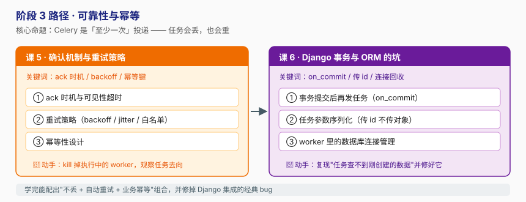

# 阶段 3：可靠性与幂等

> 所属课程：Celery + Django ｜ 故事章节：「半夜丢单的告警」 ｜ 上一阶段：[阶段 2 · Django 集成与任务基础](../2-Django集成与任务基础/overview.md)

## 🎯 本阶段目标

- 理解 Celery 的投递语义是**至少一次（at-least-once）**，并知道这个事实带来的一切后果。
- 掌握 ack 时机（`acks_late`）、可见性超时、重试策略三件套，能配出"长任务不丢"的组合。
- 能为任务设计幂等（重复执行结果一致），这是"敢重试"的前提。
- 修掉 Django 集成中最经典的几个坑：事务未提交就发任务、传模型实例、worker 连接泄漏。

## 📍 学习重点

- **ack 默认很早**：Redis/RabbitMQ 传输下，worker 收到消息就 ack 了，任务执行到一半被 kill → 消息已经没了。这是"任务凭空消失"的头号原因。
- **`visibility_timeout` 必须大于 ETA**：用 `countdown` 排一个 1 小时后的任务，Redis 默认 1 小时的可见性超时一到，消息会被别的 worker 重新投递 → 任务重复执行。
- **重试不是万能药**：对"参数错误"这类确定性失败重试 N 次只会污染队列；要区分可重试异常与不可重试异常。
- **幂等与重试是配套**：没有幂等，重试就是制造事故。
- **`transaction.on_commit` 是必修课**：`atomic` 块里发任务，worker 可能先于事务提交读到数据库 → 查无此数据。

## ✅ 必须掌握的知识点

| 知识点 | 所属课 | 学完应能 |
|--------|--------|----------|
| ack 时机与可见性超时 | 课 5 | 解释 `acks_late` 的收益与代价，并配好 `visibility_timeout` |
| 重试策略 | 课 5 | 用 `autoretry_for` + `retry_backoff` + `jitter` 配出合理重试 |
| 幂等性设计 | 课 5 | 为"扣款/发券"类任务设计幂等键与去重 |
| 事务提交后再发任务 | 课 6 | 用 `transaction.on_commit` 修掉脏读 bug |
| 任务参数序列化 | 课 6 | 坚持"传 id 不传对象"，说清 JSON 序列化边界 |
| worker 数据库连接管理 | 课 6 | 配置 `CONN_MAX_AGE` 与 `close_old_connections` 防泄漏 |

## 🗺️ 本阶段路径图

## 本阶段产出

- [x] [`lessons/lesson-05-确认机制与重试策略.md`](lessons/lesson-05-确认机制与重试策略.md)
- [x] [`lessons/lesson-06-Django事务与ORM的坑.md`](lessons/lesson-06-Django事务与ORM的坑.md)

---

🧭 **下一阶段**：[阶段 4 · 定时、编排与生产运维](../4-定时编排与生产运维/overview.md) — 任务可靠了，接下来让它按时跑、可编排、上生产。
