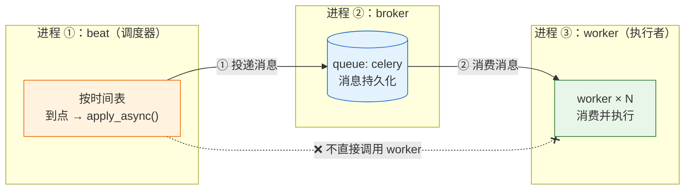
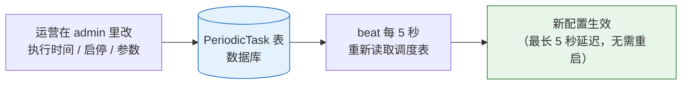
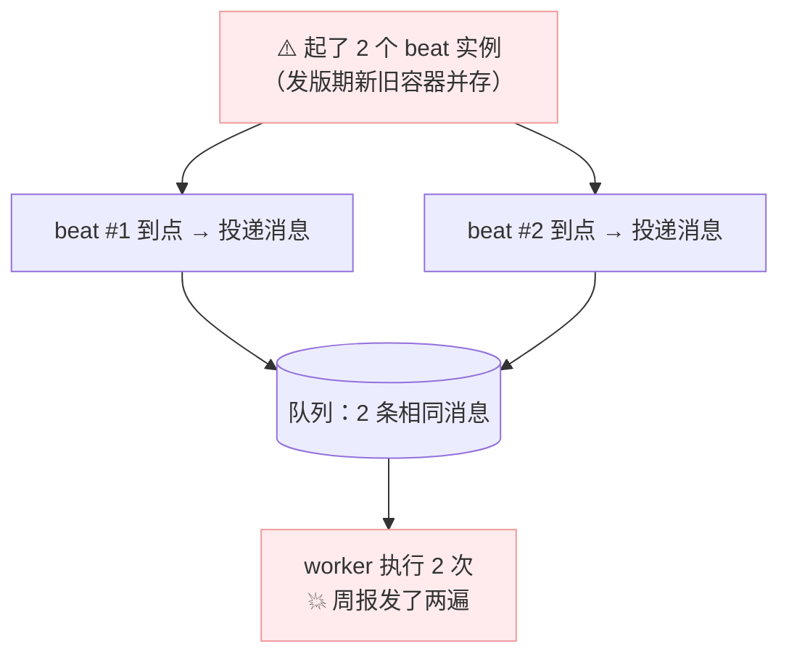
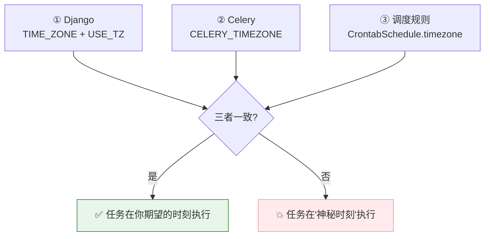
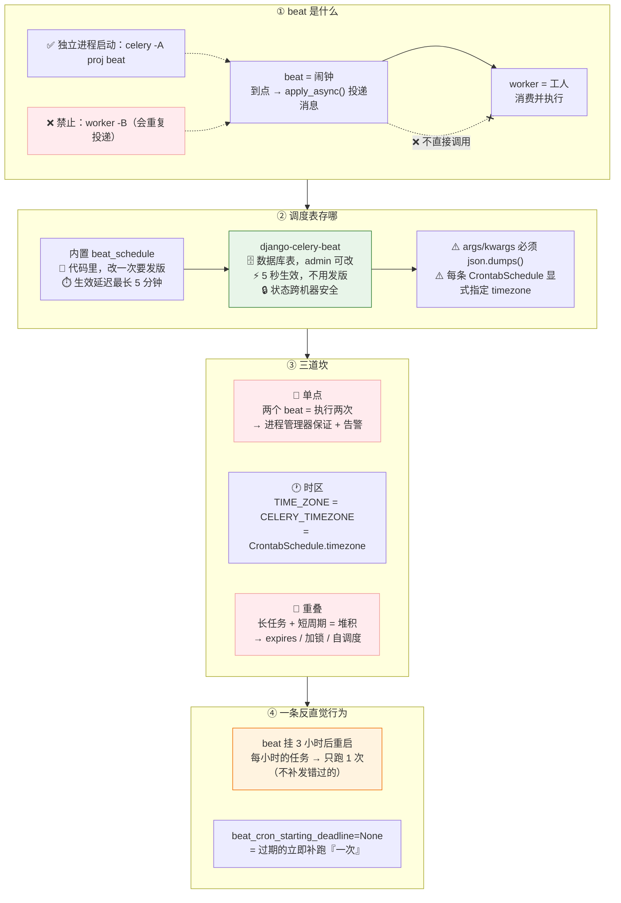

# 第 7 课：beat 与周期性任务

> 所属阶段：阶段 4《定时、编排与生产运维》｜ 水平：入门 ｜ 本课知识点：beat 调度器与 crontab 表达式、django-celery-beat 数据库调度、定时任务的可靠性（单点 / 时区 / 重叠）
> 故事情节：任务能跑了、也不丢不重了。现在要让它们"按时跑"——而"按时"这件事，比看上去难得多

> ℹ️ **版本基线（核查于 2026-08）**：调度器行为对照 Celery 5.6 官方文档；django-celery-beat **2.9.0**（2026-02 发布）。

## 🎯 本课目标

- 理解 beat **只投递不执行**，能独立启停 beat 与 worker 并解释它们的解耦关系
- 用 `django-celery-beat` 把调度表搬进数据库，实现**运行时改配置、5 秒生效**
- 处理定时任务的**三道坎**：beat 单点、时区对齐、任务防重叠

---

## 第一幕：场景引入

阶段 3 结束，你的异步任务体系已经"不丢、不重、事务安全"。现在产品提了新需求：

| 需求 | 频率 |
|------|------|
| 全量数据同步 | 每天凌晨 2:00 |
| 给管理层发周报 | 每周一 09:00 |
| 生成月度对账单 | 每月 1 号 00:00 |
| 清理过期临时文件 | 每 5 分钟 |

你的第一反应可能是：**用服务器 crontab + Django 管理命令不就行了？**

但你已经学过课 1——cron 有三个硬伤：① 无法感知业务状态（"今天数据还没同步完"）；② 没有统一的日志与告警；③ 异常处理要自己写。

🎬 **场景**：于是你用 Celery 的 `beat` 配好了定时任务，**任务确实按时跑了** ✅。然后你遇到了三个新问题……

---

## 第二幕：认知冲突

上线第一周，三个问题接连出现：

**问题 1（发版后）**：
> 管理层："这周的周报我收到**两份**。"

你查了半天才发现——发版时新旧容器短暂并存，**起了两个 beat**，定时任务被投递了两次。

**问题 2（从第一天就有）**：
> 你配的是"每天早上 8 点发通知"，但用户说他们**凌晨 0 点**就收到了。

你反复检查 `crontab(hour=8, minute=0)`，代码明明是对的。

**问题 3（某次数据量暴增后）**：
> 队列积压了 3000 条任务，DBA 又来找你了。

某个同步任务本来 20 分钟跑完，数据量涨了之后要 2 小时，但它**每 1 小时触发一次** —— 新的还没跑完，旧的又来了。

❓ **问题**：
1. beat 到底"执行"任务吗？为什么会有两个进程的概念？
2. 时区该怎么配？为什么"8 点"变成了"0 点"？
3. 怎么保证 beat 只有一个、任务不重叠、重启后不重复发？

---

## 第三幕：层层揭示

### 知识点 1：beat 调度器与 crontab 表达式

> 关键点：beat 只投递不执行（与 worker 解耦）／ 三种调度方式 ／ crontab 参数与三个易错点 ／ solar ／ beat_max_loop_interval 的调度器差异

#### 一句话定义

**beat 是一个独立的调度进程，它只做一件事：按时间表把任务消息投递到 broker。** 它**不执行任务**——执行任务的仍然是 worker。

#### 直觉建立（类比）

| 组件 | 类比 | 职责 |
|------|------|------|
| **beat** | **闹钟** | 到点了响一下，把工单贴上墙 |
| **broker** | **工单墙** | 存着待办的工单 |
| **worker** | **工人** | 看到工单就干活 |

**关键推论**：

- **闹钟坏了** → 没人贴单 → 工人闲着，但工人本身没坏
- **工人不在** → 闹钟照常响、单子照常贴 → 工人回来后按墙上的单子做

> 💡 **类比的边界**：闹钟响了没人干活，闹钟不会"记着"待会儿再响一次。同理——**beat 投递了但 worker 全挂，任务就排在队列里等着**（因为消息是持久化的，课 2）。这是**正确**的行为。

#### 核心原理

**① 三个进程的关系**



> 🎯 **beat 和 worker 互相不知道对方存在。** 两个重要结论：
>
> | 故障 | 后果 |
> |------|------|
> | **beat 挂了** | 只是不再产生新任务；**已在跑的任务不受影响** |
> | **worker 挂了** | beat 照常投递，消息堆在队列；**worker 恢复后自动补上** |

**② 三种调度方式**

```python
# settings.py（配合 namespace='CELERY'，键名要加 CELERY_ 前缀）
from celery.schedules import crontab, solar, timedelta

CELERY_BEAT_SCHEDULE = {
    # ① 固定间隔
    'sync-every-30-seconds': {
        'task': 'data.sync',
        'schedule': 30.0,                        # 每 30 秒（数字 = 秒）
    },
    'sync-every-5-minutes': {
        'task': 'data.sync',
        'schedule': timedelta(minutes=5),        # 每 5 分钟
        'args': ('incremental',),                # 可选：位置参数
        'kwargs': {},                            # 可选：关键字参数
        'options': {'queue': 'slow', 'expires': 300},   # 可选：apply_async 选项
    },

    # ② crontab（cron 风格，最常用）
    'daily-sync-at-2am': {
        'task': 'data.full_sync',
        'schedule': crontab(hour=2, minute=0),              # 每天 02:00
    },
    'weekly-report': {
        'task': 'reports.weekly',
        'schedule': crontab(hour=9, minute=0, day_of_week=1),    # 每周一 09:00
    },
    'monthly-statement': {
        'task': 'reports.monthly',
        'schedule': crontab(hour=0, minute=0, day_of_month='1'), # 每月 1 号 00:00
    },

    # ③ solar（日出日落，需 celery[solar] bundle）
    'lights-off-at-sunset': {
        'task': 'iot.lights_off',
        'schedule': solar('sunset', 31.2304, 121.4737),     # 上海经纬度
    },
}
```

**③ crontab 参数详解**（核查于 2026-08）

| 参数 | 取值范围 | 说明 |
|------|---------|------|
| `minute` | 0–59 | 分钟 |
| `hour` | 0–23 | 小时 |
| `day_of_week` | **0–6，周日 = 0** | 星期。**支持 `mon-fri` 这类缩写** |
| `day_of_month` | 1–31 | 日 |
| `month_of_year` | 1–12 | 月 |

⚠️ **三个易错点**：

| 易错点 | 说明 |
|--------|------|
| **周日 = 0，不是 1** | `day_of_week=1` 是**周一**。很多人的直觉是"1 = 周日"，正好搞反 |
| **`day_of_week='*/2'` 不是"每两天"** | 是"**星期数能被 2 整除的那些天**"，即周二、周四、周六 |
| **`crontab()` 不传参数 = 每分钟** | 所有字段默认 `'*'`，配错会瞬间刷爆队列 |

**④ 常用写法速查**

```python
crontab(minute='*/15')                              # 每 15 分钟
crontab(hour='*/3')                                 # 每 3 小时（0,3,6,…,21）
crontab(hour='0,8-17/2')                            # 0 点 + 8~17 点每 2 小时
crontab(minute='1,13,30-45,50-59/2')                # 复杂组合
crontab(hour=9, minute=0, day_of_week='mon-fri')    # 工作日 09:00
crontab(day_of_month='1', hour=0, minute=0)         # 每月 1 号 00:00
crontab(month_of_year='1,4,7,10', day_of_month='1') # 每季度首月 1 号
```

**⑤ solar（日出日落）**

```python
from celery.schedules import solar

# 需要额外安装 bundle：pip install "celery[solar]"（依赖 ephem 库）
solar('sunset', 31.2304, 121.4737)      # 上海日落
solar('sunrise', 39.9042, 116.4074)     # 北京日出

# 支持的事件：
#   dawn_astronomical / dawn_nautical / dawn_civil
#   sunrise / solar_noon / sunset
#   dusk_civil / dusk_nautical / dusk_astronomical
```

> 适合"路灯开关、定时拍照"这类需要跟随自然光照的场景。

**⑥ ⭐ beat 的调度循环：`beat_max_loop_interval`**（核查于 2026-08）

| 调度器 | 实际检查间隔 |
|--------|-------------|
| 默认 `PersistentScheduler` | **300 秒（5 分钟）** |
| **django-celery-beat 的 `DatabaseScheduler`** | **5 秒** |

> ⚠️ 配置项本身默认值写的是 `0`，含义是"**取调度器自己的默认值**"，不是"不限制"。
>
> 🎯 **这个差异直接影响你的体感**：
> - 用默认调度器 → 改了 `beat_schedule` 后**最长可能要等 5 分钟**才生效
> - 用 django-celery-beat → 只需 5 秒（因为它要能感知数据库的外部修改）

**⑦ 怎么启动 beat**

```bash
# ✅ 方式 1：独立进程（生产推荐）
celery -A proj beat -l INFO

# ⚠️ 方式 2：嵌入 worker（--beat / -B）—— 仅开发环境
celery -A proj worker -B -l INFO
```

> ⚠️ **生产绝对不要用 `-B`**，两个原因：
> 1. **你每起一个 worker 就多一个 beat** → 定时任务被重复投递 N 次（就是第二幕的"周报发两份"）
> 2. beat 与 worker 生命周期绑定，无法独立扩缩容

#### 示例演示：观察 beat 与 worker 的协作

```bash
# 终端 1
celery -A proj beat -l INFO
```
```log
[INFO] beat: Starting...
[INFO] Scheduler: Sending due task daily-sync-at-2am (data.full_sync)
[INFO] Scheduler: Sending due task sync-every-5-minutes (data.sync)
```

```bash
# 终端 2
celery -A proj worker -l INFO
```
```log
[INFO/MainProcess] Received task: data.full_sync[3f9a1c2e-...]
[INFO/ForkPoolWorker-1] Task data.full_sync[3f9a1c2e-...] succeeded in 12.34s
```

> 🎯 **注意两边日志的措辞差异**：beat 侧是 `Sending due task`，worker 侧是 `Received task`。
> **排查口诀：只有 `Sending` 没有 `Received` → 消息堆在队列里了（worker 不够 / 挂了 / 消费的是别的队列）。**

```bash
# 验证：故意停掉 worker，只留 beat
# beat 侧照常 "Sending due task"
redis-cli -n 0 LLEN celery
# → (integer) 5      ← 消息堆在队列里，worker 恢复后会补上
```

#### 常见误区

1. **"beat 负责执行任务"** → 它只投递，执行靠 worker
2. **"生产用 `worker -B` 更省事"** → 会导致重复投递，**绝对禁止**
3. **`day_of_week=1` 以为是周日** → 是**周一**（周日 = 0）
4. **以为改了 schedule 会立即生效** → 默认调度器最长等 5 分钟

#### 一句话记住

> **beat 只是个闹钟，它把单子贴上墙就完事——干活的永远是 worker。**

#### 官方文档

- Periodic Tasks：https://docs.celeryproject.org/en/stable/userguide/periodic-tasks.html
- `celery.schedules` API：https://docs.celeryproject.org/en/stable/reference/celery.schedules.html

---

### 知识点 2：django-celery-beat 数据库调度

> 关键点：为什么需要它 ／ 安装与 DatabaseScheduler 配置 ／ 五个模型 ／ args 必须是 JSON 字符串 ／ 时区警告 ／ 与 django-celery-results 配套

#### 一句话定义

`django-celery-beat` 把调度表从**代码里的静态配置**搬到**数据库表**，让你可以**运行时增删改**定时任务，并在 Django admin 里直接管理。

#### 直觉建立（类比）

| 方案 | 类比 | 改配置的代价 |
|------|------|-------------|
| 内置 `beat_schedule` | **刻在石头上的课表** | 改一次要发版 + 重启 beat |
| **django-celery-beat** | **在线协作文档里的课表** | 随手改，**5 秒生效** |

> 💡 **类比的边界**：在线文档谁都能改，改错了立刻生效（包括改错）。所以生产环境要**给 admin 加权限控制**——不是谁都该有改定时任务的权限。

#### 核心原理

**① 安装与配置**

```bash
pip install django-celery-beat        # 2.9.0（2026-02 发布，核查于 2026-08）
```

```python
# settings.py
INSTALLED_APPS = [
    ...,
    'django_celery_beat',
]

# ⭐ 关键：指定使用数据库调度器
CELERY_BEAT_SCHEDULER = 'django_celery_beat.schedulers:DatabaseScheduler'
```

```bash
python manage.py migrate              # 建表
celery -A proj beat -l INFO           # 启动命令不变，但读的是数据库
```

> ⚠️ **只装包不配 `CELERY_BEAT_SCHEDULER` 是不生效的** —— beat 仍然读代码里的 `beat_schedule`。

**② 五个核心模型**

| 模型 | 作用 | 类比 |
|------|------|------|
| **`PeriodicTask`** | 一条定时任务（名字 + 任务 + 调度 + 参数） | 课程表上的一行 |
| `IntervalSchedule` | 固定间隔（`every` + `period`） | "每 5 分钟" |
| **`CrontabSchedule`** | cron 表达式 | "每周一 09:00" |
| `SolarSchedule` | 日出日落（event + 经纬度） | "日落时" |
| `ClockedSchedule` | **一次性**的特定时刻 | "2026-09-01 10:00 执行一次" |

**③ 代码里创建定时任务**

```python
import json

from django_celery_beat.models import CrontabSchedule, PeriodicTask

# ① 先创建（或复用）调度规则
schedule, created = CrontabSchedule.objects.get_or_create(
    minute='0',
    hour='9',
    day_of_week='1',                  # 周一
    day_of_month='*',
    month_of_year='*',
    timezone='Asia/Shanghai',         # ⭐ 每条调度自带时区
)

# ② 再创建任务
PeriodicTask.objects.update_or_create(
    name='每周一发送管理周报',                    # 唯一标识（用 update_or_create 的查询键）
    defaults={
        'crontab': schedule,
        'task': 'reports.weekly',                # ⚠️ 任务名字符串，不是函数对象
        'args': json.dumps([]),                  # ⚠️ 必须是 JSON 字符串
        'kwargs': json.dumps({'dept': 'all'}),   # ⚠️ 必须是 JSON 字符串
        'enabled': True,
        'expires': 3600,                         # 可选：1 小时后作废
        'one_off': False,                        # 可选：True = 只跑一次后自动禁用
    },
)
```

⚠️ **头号错误：`args` / `kwargs` 必须是 JSON 字符串**

```python
'args': [1, 2]                    # ❌ 存进去的类型不对，执行时报错
'args': json.dumps([1, 2])        # ✅
'kwargs': json.dumps({'a': 1})    # ✅
```

**④ admin 管理（核心价值）**



> 🎯 这就是 `beat_max_loop_interval = 5 秒` 的价值：**数据库里改了，5 秒内自动生效，不用重启 beat，不用发版。**

**⑤ ⚠️ 官方的时区警告**（django-celery-beat README 原文，核查于 2026-08）：

> *"Important Warning about Time Zones: If you change the Django `TIME_ZONE` setting your periodic task schedule will still be based on the old timezone."*

**含义**：`CrontabSchedule` 有**自己的** `timezone` 字段。改 Django 的 `TIME_ZONE` **不会**自动更新已存在的调度规则——**老任务仍按老时区跑**。

✅ **正确做法**：
1. 创建 `CrontabSchedule` 时**显式指定** `timezone`
2. 改了全局时区后，**逐条检查并更新**已有的 `CrontabSchedule.timezone`

**⑥ 杀手级用例：让用户自定义推送时间**

```python
import json

from django_celery_beat.models import CrontabSchedule, PeriodicTask


def update_user_report_schedule(user, hour: int, minute: int):
    """用户自定义"每天几点收报表" —— 用静态 beat_schedule 做不到这件事。"""
    schedule, _ = CrontabSchedule.objects.get_or_create(
        minute=str(minute),
        hour=str(hour),
        day_of_week='*',
        day_of_month='*',
        month_of_year='*',
        timezone='Asia/Shanghai',
    )
    PeriodicTask.objects.update_or_create(
        name=f'user-report-{user.id}',
        defaults={
            'crontab': schedule,
            'task': 'reports.daily_for_user',
            'kwargs': json.dumps({'user_id': user.id}),
        },
    )
```

> 🎯 **这是选 django-celery-beat 的核心理由**：调度规则变成**业务数据**，可以被用户配置、被代码动态生成。

**⑦ 与 `django-celery-results` 配套**

| 包 | 作用 | 配置 |
|----|------|------|
| `django-celery-beat` | 调度表存数据库 | `CELERY_BEAT_SCHEDULER = '...DatabaseScheduler'` |
| `django-celery-results` | **结果**存数据库 | `CELERY_RESULT_BACKEND = 'django-db'` |

```python
INSTALLED_APPS += ['django_celery_results']
CELERY_RESULT_BACKEND = 'django-db'
```

> 两者组合后，**定时任务的执行历史也能在 admin 里查**（课 10 讲监控时会用到）。
> ⚠️ 注意：结果入库会持续写表，需要定期清理（课 2 讲过 `result_expires`，用 DB 后端时靠 `celery.backend_cleanup` 这个 beat 任务清理——**而它自己也需要 beat 在跑**）。

#### 示例演示：体验"改完 5 秒生效"

```bash
# ① 装包 + 迁移
pip install django-celery-beat
python manage.py migrate

# ② 起 beat（此时数据库还没有任务）
celery -A proj beat -l INFO
# [INFO] beat: Starting...
# [INFO] Writing entries...
# （没有 Sending due task —— 因为数据库里还没有任务）

# ③ 不重启 beat，在 shell 里创建一条每分钟的任务
python manage.py shell <<'EOF'
import json
from django_celery_beat.models import CrontabSchedule, PeriodicTask

schedule, _ = CrontabSchedule.objects.get_or_create(
    minute='*', hour='*', day_of_week='*', day_of_month='*', month_of_year='*',
    timezone='Asia/Shanghai',
)
PeriodicTask.objects.update_or_create(
    name='每分钟心跳',
    defaults={'crontab': schedule, 'task': 'reports.heartbeat',
              'kwargs': json.dumps({})},
)
print('已创建')
EOF

# ④ 5 秒内，正在运行的 beat 日志出现（注意：没有重启！）
# [INFO] Scheduler: Sending due task 每分钟心跳 (reports.heartbeat)
```

> 🎯 **关键观察**：**全程没有重启 beat**，新任务就生效了。这就是数据库调度的价值。
> 用静态 `beat_schedule` 的话，你得改代码 → 发版 → 重启 beat，且**默认调度器最长还有 5 分钟延迟**。

#### 常见误区

1. **"装了包就生效"** → 必须配 `CELERY_BEAT_SCHEDULER = '...DatabaseScheduler'`
2. **`args` 直接传 list** → 必须是 `json.dumps()` 后的字符串
3. **"改了 `TIME_ZONE` 所有任务就跟着变"** → 已存在的 `CrontabSchedule` 有自己的 `timezone` 字段，**不会自动更新**
4. **"可以同时用 `beat_schedule` 和数据库"** → 用了 DatabaseScheduler 后，代码里的 `beat_schedule` **不再生效**（beat 只读数据库）
5. **"结果存 DB 就一劳永逸"** → 会持续写表，需要 `celery.backend_cleanup` 清理，而它依赖 beat

#### 一句话记住

> **django-celery-beat 把"课表"从石头搬到数据库——改完 5 秒生效，不用发版，还能让用户在界面上自己配。**

#### 官方文档

- Celery 文档 · Database-backed Periodic Tasks：https://docs.celeryproject.org/en/stable/userguide/periodic-tasks.html#beat-custom-schedulers
- django-celery-beat：https://django-celery-beat.readthedocs.io/

---

### 知识点 3：定时任务的可靠性（单点 / 时区 / 重叠）

> 关键点：beat 必须单点（无任何内置锁）／ beat 不补发错过的任务 ／ 时区三要素 ／ 任务重叠与三种解法

#### 一句话定义

定时任务的可靠性有三道坎——**beat 必须单点**、**时区必须一致**、**任务不能重叠**；每一道都有对应的处理手法，而且**没有一道是默认配置能帮你做好的**。

---

#### 坎一：beat 必须只有一个（单点）



⚠️ **beat 没有任何内置的分布式锁。** 两个 beat 同时跑，定时任务就会**每次触发两次**。这类重复最常发生在"**发版期间新旧实例并存**"时，非常隐蔽。

**保证单点的四种方案**：

| 方案 | 做法 | 适用 |
|------|------|------|
| **① 进程管理器保证**（推荐） | systemd / supervisor / k8s `replicas: 1` | 绝大多数场景 |
| **② 调度文件锁** | 默认 `PersistentScheduler` 用 `celerybeat-schedule` 文件，第二个 beat 会检测到 | **仅默认调度器** |
| **③ 分布式锁** | 用 Redis 锁包住 beat 启动（第三方库如 `celery-singleton`，或自己写） | 多机高可用场景 |
| **④ k8s CronJob** | 不用常驻 beat，改用 k8s CronJob 定时触发 | 云原生环境 |

> 🎯 **最实用的做法**：用 systemd / supervisor / k8s 保证只有一个 beat 进程，**并加监控告警**——beat 进程数 **> 1 或 = 0 都要告警**。
>
> ⚠️ 注意：方案 ② 对 **DatabaseScheduler 不适用**（它不依赖本地文件锁）。用 django-celery-beat 时，单点只能靠 ① 或 ③。

---

#### 坎二：beat **不补发**错过的任务

这是一个**必须知道**的行为（核查于 2026-08）：

> **beat 挂了 3 小时后重启，每小时触发的任务只会执行 1 次，不是 3 次。**

**原因**：beat 基于 `last_run_at` 判断任务是否 overdue，**不是按"错过了几个间隔"来补**。

相关配置（核查于 2026-08）：

| 配置 | 默认值 | 说明 |
|------|--------|------|
| `beat_cron_starting_deadline` | **`None`**（**5.3+**） | beat 能"回看"多少秒来判断 cron 任务是否该跑。`None` = **过期的 cron 任务总是立即执行（一次）** |

```python
# 如果希望"过期超过 10 分钟就不补跑了"
CELERY_BEAT_CRON_STARTING_DEADLINE = 600
# ⚠️ 官方警告：设置超过 3600（1 小时）highly discouraged
```

> 🎯 **记住这个语义**：`None` 不是"不补跑"，而是"**总是立即补跑一次**"。

⚠️ **另一个相关风险：状态存哪**

| 调度器 | `last_run_at` 存哪 | 换机器重启的后果 |
|--------|-------------------|-----------------|
| 默认 `PersistentScheduler` | **本地文件** `celerybeat-schedule` | 换机器 = 无历史 → **可能重复触发** |
| **DatabaseScheduler** | **数据库表** | 跨机器安全 ✅ |

> 🎯 **这是选 django-celery-beat 的第二个理由**：状态持久化在数据库，beat 换机器重启不会重复触发。

---

#### 坎三：时区（三要素必须一致）



**完整配置**：

```python
# settings.py

# ① Django 侧
TIME_ZONE = 'Asia/Shanghai'
USE_TZ = True

# ② Celery 侧 —— ⚠️ 必须显式设！默认是 'UTC'
CELERY_TIMEZONE = 'Asia/Shanghai'
CELERY_ENABLE_UTC = True        # 内部时间戳统一用 UTC 存储（默认就是 True）
```

> 🎯 **最常见的翻车现场**（就是第二幕的"8 点变 0 点"）：
> ```python
> TIME_ZONE = 'Asia/Shanghai'     # ✅ Django 设了中国时区
> # ❌ 忘了设 CELERY_TIMEZONE → Celery 用默认的 UTC
>
> crontab(hour=8, minute=0)
> # → 在 UTC 08:00 执行 = 北京时间 16:00
> ```
> 若反过来配 `hour=0`，就会在**北京时间早上 8 点**执行——**正好差 8 小时**，看起来就像"配 0 点却在 8 点跑"。

**验证时区配对了没**（别靠猜）：

```python
# 在 Django shell 里（确保 Celery app 已加载配置）
from proj.celery import app
from celery.schedules import crontab

print(app.conf.timezone)        # → 应该是 'Asia/Shanghai'，不是 'UTC'
print(app.now())                # → 当前时间（带时区信息）

s = crontab(hour=8, minute=0)
print(s.remaining_estimate(s.now()))
# → 距下次 08:00 还有多久；拿它和你的预期比对
```

> 🎯 **DST（夏令时）提醒**：如果业务在有时区切换的地区（如 `America/New_York`），`crontab(hour=2, minute=30)` 在切换日可能**执行两次或被跳过**。
> **对时间精度要求高的任务，用 UTC 排期最稳**（`CELERY_TIMEZONE = 'UTC'` + 按 UTC 写小时）。

---

#### 坎四：任务重叠（长任务 + 短周期）

```python
# ⚠️ 危险：任务要跑 2 小时，但每 1 小时触发一次
CELERY_BEAT_SCHEDULE = {
    'heavy-sync': {
        'task': 'data.heavy_sync',
        'schedule': crontab(minute=0),      # 每小时
    },
}
# → 第 1 个还没跑完，第 2 个已经投递 → 堆积 → 队列爆炸
```

**三种解法**：

| 解法 | 做法 | 特点 |
|------|------|------|
| **① 加 `expires`**（最简单） | `{'expires': 3600}` | 消息超过 1 小时就作废，避免**无限**堆积 |
| **② 业务侧加锁**（最可靠） | 任务开头抢 Redis 锁，抢不到就跳过 | 与课 5 的幂等/分布式锁同一套路 |
| **③ 改成"自调度"** | 任务结束时自己 `apply_async(countdown=...)` 排下一次 | 保证上一次跑完才排下一次 |

**解法②的推荐写法**（用 Django 的 `cache.add()`，比裸 Redis 更可移植）：

```python
import logging

from celery import shared_task
from django.core.cache import cache

logger = logging.getLogger(__name__)


@shared_task(bind=True, name='data.heavy_sync')
def heavy_sync(self):
    lock_key = 'lock:heavy_sync'
    # ⭐ cache.add = SET NX EX，原子操作；timeout 保证 worker 崩溃时锁也会释放
    acquired = cache.add(lock_key, self.request.id, timeout=7200)    # 2 小时

    if not acquired:
        logger.info('[heavy_sync] 上一次还没跑完，跳过本次')
        return {'skipped': True}

    try:
        return _do_heavy_sync()
    finally:
        cache.delete(lock_key)
```

> ⚠️ **一个致命前提**：`cache.add()` 的原子性**取决于缓存后端**。
> - ✅ **Redis / Memcached 后端**：跨进程原子，可用
> - ❌ **默认的 `LocMemCache`**：**每个进程一份缓存，锁不共享，形同虚设！**
>
> **生产环境务必把 Django 的 `CACHES` 配成 Redis**，否则这把锁只在单个进程内有效。

**解法③：自调度**（适合"必须串行、且间隔不严格"的场景）

```python
@shared_task(bind=True, name='data.heavy_sync')
def heavy_sync(self):
    try:
        _do_heavy_sync()
    finally:
        # 跑完（无论成败）后，自己排 1 小时后的下一次
        heavy_sync.apply_async(countdown=3600)
```

> 🎯 优点：**天然不会重叠**。缺点：依赖任务本身跑起来，如果任务失败了没走到 `finally`，链条就断了（需要在 `on_failure` 里补排，或配合监控告警）。

#### ⑤ beat 挂了是**静默**的 —— 怎么做存活监控

这是本课最容易被忽略、但上线后一定会后悔没做的一件事：

> **beat 挂掉之后：不再投递任务，不报错，不打日志，队列平静如水。**
> 从监控面板上看，一切正常——只是"该跑的任务再也没跑过"。

**三层监控，从粗到细**：

| 层级 | 做法 | 能发现什么 | 局限 |
|------|------|-----------|------|
| **① 进程级** | `pgrep -c -f "celery -A proj beat"` / systemd `Restart=always` / k8s `replicas: 1` + livenessProbe | 进程没了 | beat 进程在但**卡死**时无效 |
| **② 心跳任务**（推荐 ⭐） | 配一个每分钟的任务写时间戳，外部检查"最新心跳是否超过 N 分钟" | 进程没了 / 卡死 / **broker 断了** | 需要多配一个任务 |
| **③ 执行结果** | 查 `PeriodicTask.last_run_at`（django-celery-beat）或 `celery.backend_cleanup` 的效果 | 任务到底跑没跑 | 见课 10 |

**② 心跳任务的完整实现**（推荐直接搬）：

```python
# ops/tasks.py
import logging

from celery import shared_task
from django.core.cache import cache

logger = logging.getLogger(__name__)

BEAT_HEARTBEAT_KEY = 'monitor:beat:heartbeat'


@shared_task(name='ops.beat_heartbeat', ignore_result=True)
def beat_heartbeat():
    """beat 存活心跳：每分钟被 beat 触发一次，写入当前时间戳。"""
    from django.utils import timezone
    cache.set(BEAT_HEARTBEAT_KEY, timezone.now().isoformat(), timeout=None)
```

```python
# settings.py
CELERY_BEAT_SCHEDULE = {
    'beat-heartbeat-every-minute': {
        'task': 'ops.beat_heartbeat',
        'schedule': 60.0,                 # 每 60 秒
        'options': {'expires': 50},       # ⭐ 关键：避免堆积（见下）
    },
    ...
}
```

```python
# 监控侧（可被 Prometheus / 定时任务 / 健康检查接口调用）
from datetime import timedelta

from django.core.cache import cache
from django.utils import timezone


def is_beat_alive(max_silence_seconds: int = 300) -> bool:
    """beat 是否存活：最后一次心跳距今是否在阈值内。"""
    last = cache.get(BEAT_HEARTBEAT_KEY)
    if not last:
        return False
    last_dt = timezone.datetime.fromisoformat(last)
    return (timezone.now() - last_dt) < timedelta(seconds=max_silence_seconds)
```

> ⚠️ **为什么 `options` 里要加 `expires: 50`？**
> 心跳任务每分钟一次，如果 worker 全挂了，**心跳消息会不断堆积在队列里**，worker 恢复后会一次性补跑几百条——没有意义还占资源。设 `expires=50`（小于 60 秒周期）后，超期的心跳会被自动丢弃，**它只反映"最近一次投递"，正是我们想要的语义**。

> 🎯 **告警规则建议**：
> - `is_beat_alive(300) == False` 持续 5 分钟 → **P1 告警**（beat 挂了或 broker 断了）
> - beat 进程数 `!= 1` → **P1 告警**（0 = 任务停摆；≥2 = 重复投递）

**快速版（不想写代码的临时检查）**：

```bash
# ① beat 进程在不在
pgrep -af "celery.*beat" | wc -l        # 期望：1

# ② 最近是否在投递（看日志尾部）
tail -50 /var/log/celery/beat.log | grep "Sending due task"

# ③ django-celery-beat 下查 last_run_at
python manage.py shell -c "
from django.utils import timezone
from django_celery_beat.models import PeriodicTask
now = timezone.now()
for t in PeriodicTask.objects.filter(enabled=True):
    age = (now - t.last_run_at).total_seconds() if t.last_run_at else None
    print(f'{t.name}: last_run={t.last_run_at} age={age}s count={t.total_run_count}')
"
```

#### 定时任务的可靠性检查清单

- [ ] beat 是否**只有一个**进程在跑？（进程管理器保证 + 存活/数量告警）
- [ ] 是否用了 **DatabaseScheduler**？（状态持久化在数据库，换机器不重复触发）
- [ ] `CELERY_TIMEZONE` 是否与 `TIME_ZONE` **一致**？
- [ ] 每条 `CrontabSchedule` 的 `timezone` 字段是否**显式指定**？
- [ ] 长任务是否配了 `expires` 或**加锁防重叠**？
- [ ] 用 `cache.add()` 加锁时，`CACHES` 后端是否是 **Redis**（而非 LocMemCache）？
- [ ] beat 进程是否有**存活监控**（挂了要能告警）？
- [ ] 关键定时任务是否有**执行结果监控**（课 10）？

#### 示例演示

**① 验证时区（最容易翻车的一环）**

```bash
python manage.py shell <<'EOF'
from django.conf import settings
from proj.celery import app
from celery.schedules import crontab

print('Django TIME_ZONE :', settings.TIME_ZONE)
print('Celery timezone  :', app.conf.timezone)
print('enable_utc       :', app.conf.enable_utc)
print('now              :', app.now())

s = crontab(hour=8, minute=0)
print('距下次 08:00 还有:', s.remaining_estimate(s.now()))
EOF
```

```
Django TIME_ZONE : Asia/Shanghai
Celery timezone  : Asia/Shanghai       ← ✅ 一致
enable_utc       : True
now              : 2026-08-31 11:50:00.123456+08:00
距下次 08:00 还有: 20:10:00            ← 距明天早上 8 点，符合预期
```

**② 复现"两个 beat 导致重复投递"**

```bash
celery -A proj beat -l INFO &
celery -A proj beat -l INFO &        # ⚠️ 故意起第二个

# → 两条 "Sending due task" 日志
# → worker 侧收到 2 条相同消息，任务执行 2 次
```

> ✅ **回扣第二幕问题 1**："周报发两份"就是这么来的。**发版时务必确认旧 beat 进程已退出。**

**③ 验证"beat 不补发"**

```bash
# 配一个每分钟的任务，跑一次后 kill beat
celery -A proj beat -l INFO &
BEAT_PID=$!
sleep 70
kill $BEAT_PID                        # 正常停止

sleep 180                             # 停 3 分钟（本该跑 3 次）

celery -A proj beat -l INFO           # 重启
# → 日志里只有 1 次 "Sending due task"，不是 3 次
```

#### 常见误区

1. **"beat 挂了会把错过的都补上"** → **不会**，只会在重启后立即跑**一次**
2. **"改了 `TIME_ZONE` 定时就对了"** → 已存在的 `CrontabSchedule.timezone` 不会自动更新；且必须同步改 `CELERY_TIMEZONE`
3. **"beat 自己会防止重复"** → 没有任何内置锁，两个 beat = 执行两次
4. **"任务跑不完没关系，队列会帮我排着"** → 会无限堆积，必须加 `expires` 或锁
5. **"`cache.add()` 加锁就够了"** → 默认 `LocMemCache` 是**进程内**缓存，锁不共享；必须配 Redis 后端

#### 一句话记住

> **beat 要单点、时区要对齐、长任务要防重叠——这三件事 Celery 一个都不会替你做。**

---

## 第四幕：实操验证

### ① 从零配通一个定时任务（`beat_schedule` 版）

```python
# settings.py
from celery.schedules import crontab, timedelta

CELERY_TIMEZONE = 'Asia/Shanghai'
CELERY_BEAT_SCHEDULE = {
    'heartbeat-every-minute': {
        'task': 'reports.heartbeat',
        'schedule': crontab(minute='*'),
    },
    'daily-cleanup': {
        'task': 'ops.cleanup',
        'schedule': crontab(hour=3, minute=0),
        'options': {'expires': 3600},          # ⭐ 长任务防堆积
    },
}
```

```bash
celery -A proj beat -l INFO &
celery -A proj worker -l INFO &
# 观察两边的日志：beat 说 Sending，worker 说 Received
```

### ② 迁移到 django-celery-beat，体验"改完 5 秒生效"

（见知识点 2 的示例演示——**全程不重启 beat**）

### ③ 复现三个经典坑

| 坑 | 复现方式 | 观察 |
|----|---------|------|
| **重复投递** | 起两个 beat | 两条 `Sending due task`，任务执行 2 次 |
| **时区错** | 只设 `TIME_ZONE` 不设 `CELERY_TIMEZONE` | `crontab(hour=8)` 在 UTC 08:00 执行（北京 16:00） |
| **任务重叠** | 配一个 `sleep(300)` 的任务 + `crontab(minute='*')` | 队列长度持续上涨，永不清零 |

---

## 第五幕：体系收束

> 📍 **全局定位**：阶段 4 的第一块拼图完成。你现在的能力版图：
>
> | 阶段 | 解决什么 | 状态 |
> |------|---------|------|
> | 1 动因与全景 | 为什么需要、怎么工作 | ✅ |
> | 2 集成与基础 | 怎么搭、怎么调用 | ✅ |
> | 3 可靠性与幂等 | 不丢、不重、事务安全 | ✅ |
> | **4 定时、编排与运维** | **按时跑 · 可编排 · 上生产 · 可观测** | **🔄 3/12** |
>
> **本课的四条硬结论**（都是默认配置帮不了你的）：
> 1. **beat 只投递不执行** —— 它与 worker 完全解耦，可独立启停
> 2. **beat 必须单点** —— 无任何内置锁，两个 beat = 执行两次
> 3. **beat 不补发** —— 挂了 3 小时只补跑 1 次，不是 3 次
> 4. **时区三要素要对齐** —— `TIME_ZONE` / `CELERY_TIMEZONE` / `CrontabSchedule.timezone`
>
> 🔗 **下一步**：课 8《canvas 任务编排》—— 把多个任务编排成工作流（并行、串行、barrier 汇聚），**以及最重要的：什么时候不该用 Celery 做编排。**

---

## 🐞 常见误区（本课汇总）

1. **"beat 负责执行任务"** → 只投递，执行靠 worker
2. **"生产用 `worker -B` 更省事"** → 会重复投递，绝对禁止
3. **`day_of_week=1` 以为是周日** → 是**周一**（周日 = 0）
4. **以为改了 schedule 立即生效** → 默认调度器最长等 5 分钟
5. **"装了 django-celery-beat 就生效"** → 必须配 `CELERY_BEAT_SCHEDULER`
6. **`args` / `kwargs` 直接传 list/dict** → 必须 `json.dumps()`
7. **"改了 `TIME_ZONE` 所有任务跟着变"** → `CrontabSchedule.timezone` 不会自动更新
8. **"可以和 `beat_schedule` 同时用"** → 用了 DatabaseScheduler 后代码配置失效
9. **"beat 挂了会补发错过的"** → 只补跑 1 次
10. **`beat_cron_starting_deadline=None` 理解为"不补跑"** → 实际是"**总是立即补跑一次**"
11. **"`cache.add()` 加锁就够了"** → `LocMemCache` 是进程内缓存，锁不共享
12. **"任务跑不完队列会帮我排着"** → 会无限堆积，需 `expires` 或锁

## 一图总结



## 课后小测

**Q1**：关于 Celery beat，下列说法正确的是？

- A. beat 负责执行定时任务，worker 负责接收调度指令
- B. beat 只负责按时间表把消息投递到 broker，执行仍由 worker 完成
- C. 生产环境推荐用 `celery -A proj worker -B` 把 beat 嵌入 worker，省一个进程
- D. beat 挂了 3 小时后重启，每小时触发的任务会补跑 3 次

<details><summary>答案与解析</summary>

**答案：B**。

- **A 错**：beat **只投递不执行**。它与 worker 完全解耦——beat 挂了不影响已在跑的任务，worker 挂了消息会堆在队列里等恢复。
- **C 错**：**生产绝对禁止 `worker -B`**。每起一个 worker 就多一个 beat，定时任务会被重复投递 N 次。
- **D 错**：**beat 不补发**。它基于 `last_run_at` 判断是否 overdue，不是按错过的间隔数补。挂 3 小时后重启，每小时的任务**只跑 1 次**。

相关配置：`beat_cron_starting_deadline` 默认 `None`（5.3+），含义是"**过期的 cron 任务总是立即补跑一次**"。

</details>

**Q2**：你配了 `crontab(hour=8, minute=0)` 想让任务在**北京时间早上 8 点**执行，结果任务在**下午 4 点**执行。最可能的原因是？

- A. `day_of_week` 配错了
- B. 只设了 Django 的 `TIME_ZONE = 'Asia/Shanghai'`，没有设 `CELERY_TIMEZONE`，Celery 用了默认的 UTC
- C. beat 和 worker 的时区不一致
- D. `crontab` 的 hour 参数取值范围是 1–24 而不是 0–23

<details><summary>答案与解析</summary>

**答案：B**。这是最常见的时区翻车场景。

Celery 的 `timezone` 配置**默认是 `UTC`**，独立于 Django 的 `TIME_ZONE`。只改 Django 侧，Celery 仍按 UTC 解释 `crontab(hour=8)` → UTC 08:00 = 北京时间 16:00，**正好差 8 小时**。

正确配置：

```python
TIME_ZONE = 'Asia/Shanghai'
USE_TZ = True
CELERY_TIMEZONE = 'Asia/Shanghai'      # ⭐ 必须显式设置
CELERY_ENABLE_UTC = True
```

另外，如果用 django-celery-beat，**每条 `CrontabSchedule` 还有自己的 `timezone` 字段**——官方明确警告：改 `TIME_ZONE` 不会自动更新已存在的调度规则。

- D 错：`hour` 的取值就是 0–23。

</details>

**Q3**：你要给一个"每 1 小时触发、但可能跑 2 小时"的同步任务防重叠，用 `cache.add(lock_key, ...)` 加锁。**下列哪个前提如果不满足，锁会完全失效？**

- A. `cache.add()` 的 timeout 必须大于任务的执行时长
- B. Django 的 `CACHES` 后端必须是 Redis / Memcached，而不能用默认的 `LocMemCache`
- C. 必须开启 `CELERY_TASK_ACKS_LATE`
- D. 必须给任务配置 `autoretry_for`

<details><summary>答案与解析</summary>

**答案：B**。这是本课最容易被忽略的致命前提。

**`LocMemCache` 是进程内缓存——每个进程一份，锁根本不共享。** 用它加锁，两个 worker 进程各拿各的"锁"，都会认为自己抢到了，锁形同虚设。

`cache.add()` 映射到底层是 `SET key value NX EX`（Redis），**原子性是后端提供的**。所以：

```python
CACHES = {
    'default': {
        'BACKEND': 'django.core.cache.backends.redis.RedisCache',
        'LOCATION': 'redis://127.0.0.1:6379/2',
    }
}
```

- **A 也值得注意**（timeout 应大于任务时长，否则任务没跑完锁就自动释放了），但它是"配置得当"问题；**B 是"完全失效"问题**——题目问的是后者。
- C、D 与防重叠无关（它们分别是可靠性和重试的配置）。

</details>

---

## 🚀 下一批接力提示词

> 学完本批后，**复制下面这段文字发给 AI**，即可无缝进入下一批（无需重新描述上下文）：

```
继续学 Celery + Django。我的学习档案在 celery-django/00-学习档案.md，
刚学完阶段 4《定时、编排与生产运维》的课《beat 与周期性任务》知识点
「beat 调度器与 crontab 表达式」「django-celery-beat 数据库调度」「定时任务的可靠性」，
请按大纲继续讲解下一批知识点（课 8《canvas 任务编排》）。
```

## 🧭 课程导航

⬅️ **上一课**：[第 6 课：Django 事务与 ORM 的坑](../../3-可靠性与幂等/lessons/lesson-06-Django事务与ORM的坑.md)

➡️ **下一课**：[第 8 课：canvas 任务编排](lesson-08-canvas任务编排.md)

📚 **返回目录**：[课程目录](../../../02-课程目录.md)
