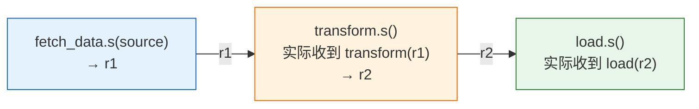
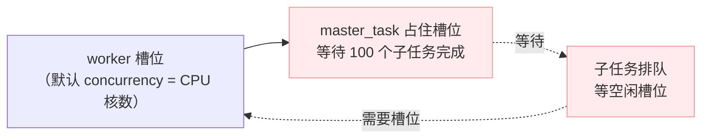
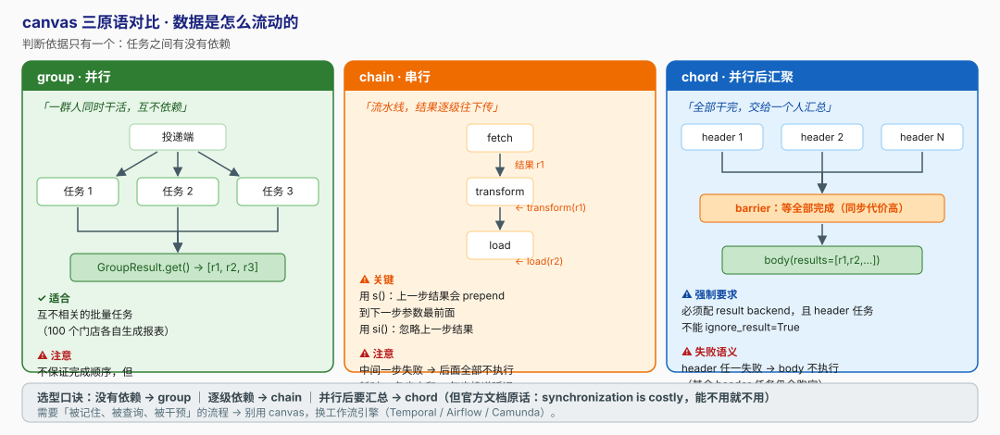

# 第 8 课：canvas 任务编排

> 所属阶段：阶段 4《定时、编排与生产运维》｜ 水平：入门 ｜ 本课知识点：signature 与不可变签名、group / chain / chord、编排的可靠性边界
> 故事情节：单个任务不够用了 —— 100 个门店的报表要并行生成，还要全部生成完再汇总。而"等全部完成"这件事，比看上去贵得多

> ℹ️ **版本基线（核查于 2026-08）**：chord 语义与默认值对照 Celery 5.6 官方 `userguide/canvas.html` 核实。

## 🎯 本课目标

- 说清 `s()` 与 `si()` 的差别，能修掉"参数错位"这个 canvas 头号 bug
- 按"任务之间有没有依赖"在 `group` / `chain` / `chord` 之间正确选型
- 知道 canvas 的可靠性边界在哪，**以及什么时候该换工作流引擎**

---

## 第一幕：场景引入

产品提了新需求：**批量生成报表**。

```
给 100 个门店各生成一份对账单（并行，互不依赖）
        ↓
全部生成完之后，汇总成一张总表并发送邮件
        ↓
中间任何一步失败，要能感知并处理
```

你的第一个念头：

```python
@shared_task(name='reports.batch')
def batch_generate(store_ids):
    results = []
    for sid in store_ids:
        results.append(generate_report.delay(sid).get(timeout=60))   # 一个个取结果
    return merge(results)
```

**然后你就把课 4 讲的东西全忘了。**

🎬 **场景**：`get()` 是反模式（课 4 测过：投递 0.005s vs 阻塞 8.021s）。而在**任务内部** `get()` 更糟——它会**死锁**。这一课就是来讲清楚：任务之间该怎么协作，以及 Celery 的编排能力**边界**在哪。

---

## 第二幕：认知冲突

你试着改了几版，每版都有新问题：

**版本 1：循环 `get()`** → worker 卡死
```
所有 worker 槽位都被 master_task 占着等子任务
子任务永远排不到槽位
→ 💀 死锁
```

**版本 2：改用 `chain`** → 参数错位
```python
fetch.s(source) | transform.s() | load.s()
```
`transform` 收到的不是你以为的参数——**前一步的返回值被塞到了第一个位置**。

**版本 3：改用 `chord`** → 回调偶尔不执行
```python
chord([...])(merge_reports.s())
```
本地测试好好的，上线后偶尔 **body 不执行，而且没有任何报错**。

❓ **问题**：
1. 任务之间怎么传参？为什么我的参数被"顶掉"了？
2. `group` / `chain` / `chord` 各自解决什么问题？
3. chord 的回调为什么不执行？**编排到底能承担多少可靠性责任？**

---

## 第三幕：层层揭示

### 知识点 1：signature 与不可变签名

> 关键点：signature 是"可传递的任务调用" ／ ⭐ s() 会接收上一步结果、si() 不会 ／ signature 的常用方法 ／ 为什么需要这个概念

#### 一句话定义

**signature（签名）** 是"**一个还没有被调用的任务调用**"——它把任务名、参数、执行选项打包成一个**可传递、可组合、可序列化**的对象。`s()` 创建**可变**签名，`si()` 创建**不可变**签名。

#### 直觉建立（类比）

- **signature** = **一张填好的快递单**（收件人、地址、物品都写好了，但还没寄出）
- **可变签名 `s()`** = 快递单上留了个空位写"**待补充**"——前一步的结果会被塞进这个空位
- **不可变签名 `si()`** = 快递单**已封口**，谁也别想再往里塞东西

> 💡 **类比的边界**：快递单封口后就改不了了。而 signature 是**可复用**的——同一张签名可以被投递多次、可以同时放进多个 group（每次投递都是一次独立的执行）。

#### 核心原理

**① 三种创建方式**

```python
from celery import signature
from reports.tasks import add

# 方式 1：Task.s() / Task.si()（最常用）
add.s(2, 2)                       # 可变签名
add.si(2, 2)                      # 不可变签名

# 方式 2：signature() 函数（用任务名字符串，适合动态场景）
signature('reports.add', args=(2, 2))
signature('reports.add', args=(2, 2), immutable=True)

# 方式 3：把执行选项也写进去
add.s(2, 2).set(countdown=10, queue='slow')
```

**② ⭐ 可变 vs 不可变（本课头号 bug 的源头）**

```python
from reports.tasks import add, mul

# 可变签名 s()：前一步的结果会被 **prepend** 到参数列表最前面
(add.s(2, 2) | mul.s(10))         # → mul(4, 10) = 40        （4 = add(2,2) 的结果）

# 不可变签名 si()：忽略前一步的结果，只用自己写死的参数
(add.s(2, 2) | mul.si(3, 5))      # → mul(3, 5) = 15         （4 被丢弃）
```

> 🎯 **判断口诀**：**"下一步要不要用上一步的结果？"**
>
> **要 → `s()`；不要 → `si()`。**
>
> ⚠️ **最常见的 bug**：本意是"前一步做完，再跑一个**固定参数**的任务"，却用了 `s()`，结果参数被前一步的返回值顶掉——任务报"参数数量不对"，或者**更糟：用了错误的值但没报错**。

```python
# ❌ 经典参数错位
(add.s(2, 2) | send_email.s('a@b.com'))
# send_email 实际收到：send_email(4, 'a@b.com')
#                                ☝️ 上一步的返回值混进来了！
# 如果 send_email 的签名是 (to, subject) → 报缺参数，或直接把 4 当 to 用

# ✅ 正确
(add.s(2, 2) | send_email.si('a@b.com', '报表已生成'))
```

**③ signature 的常用方法**

| 方法 | 作用 |
|------|------|
| `.delay()` / `.apply_async()` | 投递执行 |
| `.set(**options)` | 设置执行选项（`countdown` / `eta` / `queue` / `expires`…） |
| `.on_error(sig)` | 绑定 **errback**（失败时执行） |
| `.link(sig)` | 绑定 **callback**（成功时执行） |
| `.clone(args, kwargs)` | 复制并覆盖参数（复用签名时用） |
| `.freeze()` / `.apply()` | 本地同步执行（测试用） |

```python
# 链式设置选项
sig = add.s(2, 2).set(countdown=60).set(queue='slow')
sig.apply_async()

# 绑定错误处理
add.s(2, 2).on_error(log_error.s()).apply_async()
```

**④ 为什么需要 signature 这个概念？**

因为 **编排需要"把任务调用当成数据来传递"**：

```python
# 没有 signature：只能"立刻调用"
add.delay(2, 2)                   # 立即投递，没有中间态

# 有了 signature："先构造，后决定怎么用"
sig = add.s(2, 2)                 # ① 构造
job_queue.append(sig)             # ② 存进列表
group(*job_queue).apply_async()   # ③ 之后批量执行
```

> 🎯 一句话：**signature 让"任务调用"变成了可以放进列表、可以被组合的"值"——这是 canvas 整套编排的地基。**

#### 示例演示

```python
python manage.py shell <<'EOF'
from reports.tasks import add, mul, send_email

# ① 可变签名：前一步结果 prepend
print((add.s(2, 2) | mul.s(10)).apply_async().get(timeout=20))      # → 40

# ② 不可变签名：参数固定
print((add.s(2, 2) | mul.si(3, 5)).apply_async().get(timeout=20))   # → 15

# ③ 参数错位的经典 bug（本意是固定参数，用了 s()）
(add.s(2, 2) | send_email.s('a@b.com')).apply_async()
# worker 日志：
# TypeError: send_email() missing 1 required positional argument: 'subject'
# （因为实际调用是 send_email(4, 'a@b.com')）
EOF
```

> ✅ **回扣第二幕困惑 2**："参数错位"就是这么来的——**用了 `s()` 但本意是 `si()`**。

#### 常见误区

1. **`s()` 和 `si()` 随便用** → 参数错位（本课头号 bug）
2. **以为 signature 只能用于 chain** → 它也是 group / chord 的构成单元
3. **在任务里 `.get()` 另一个签名** → 死锁风险（知识点 3 会讲）

#### 一句话记住

> **`s()` 会接收上一步结果，`si()` 不会——参数错位十有八九是选错了这个。**

#### 官方文档

- Canvas：https://docs.celeryproject.org/en/stable/userguide/canvas.html

---

### 知识点 2：group / chain / chord

> 关键点：group 并行 ／ chain 串行（结果传递）／ chord 汇聚（barrier）／ map / starmap / chunks ／ chord 强制需要 backend

#### 一句话定义

canvas 提供三种**组合原语**：`group`（并行且互不依赖）、`chain`（串行且结果逐级传递）、`chord`（并行后汇聚，带**屏障 / barrier** 语义）。

#### 直觉建立（类比）

| 原语 | 类比 | 依赖特征 |
|------|------|---------|
| **`group`** | **一群人同时干活**，各自独立，谁先干完谁先走 | 无依赖 |
| **`chain`** | **流水线**：A 干完交给 B，B 干完交给 C | 逐级依赖 |
| **`chord`** | **一群人同时干活，全部干完后交给一个人汇总** | 并行 + 汇聚 |

> 💡 **类比的边界**：真实流水线有缓冲区，可以攒货。Celery 的 chain **没有缓冲**——**每一步都是一次新的消息投递**，有延迟、有失败可能，中间断掉后面就全没了。

#### 核心原理

**① `group`：并行**

```python
from celery import group
from reports.tasks import generate_report

job = group(generate_report.s(store_id) for store_id in store_ids)
result = job.apply_async()

result.ready()        # 全部子任务是否都到终态
result.get()          # → [r1, r2, r3, ...]（按投递顺序）
result.successful()   # 是否全部成功
```

`GroupResult` 的常用 API：

| API | 作用 |
|-----|------|
| `.ready()` | 全部子任务是否都到终态 |
| `.get()` / `.join()` | 阻塞等待，返回结果列表 |
| `.successful()` / `.failed()` | 是否全部成功 / 是否有失败 |
| `.save()` / `.restore()` | 把 group 状态存进 backend（便于跨进程恢复） |
| `.forget()` | 清理结果，释放 backend 空间 |

> ⚠️ **`group` 不保证完成顺序**——子任务可能在不同机器、不同时刻完成。**但 `get()` 返回的结果列表是按投递顺序排列的**（Celery 会按 index 组装）。
>
> ⚠️ group 本身**不强制**要求 result backend，但**要拿 `GroupResult.get()` 就必须有**。而 `chord` 是**强制**需要的（见下）。

**② `chain`：串行**

```python
from celery import chain
from reports.tasks import fetch_data, transform, load

# 写法 1：| 操作符（推荐，可读性最好）
job = fetch_data.s(source) | transform.s() | load.s()

# 写法 2：chain() 函数
job = chain(fetch_data.s(source), transform.s(), load.s())

job.apply_async()
```



⚠️ **chain 的两个隐藏行为**：

| 行为 | 说明 |
|------|------|
| **逐步投递** | 第一步立即执行，**后续步骤由前一步"链接"触发**，不是预先全部投递 |
| **失败即中断** | 中间某步失败 → **后面的步骤全部不会执行** |
| **耗时累加** | 总耗时 = 各步之和 + **每步的消息投递延迟** |

**③ `chord`：并行 + 汇聚（barrier）**

```python
from celery import chord
from reports.tasks import generate_report, merge_reports

job = chord(
    [generate_report.s(store_id) for store_id in store_ids],   # header：并行部分
    merge_reports.s(),                                          # body：汇聚回调
)
result = job.apply_async()
result.get()          # → merge_reports 的返回值
```

> 🎯 **`chord()` 返回的 task_id 是 body 的 id**——所以你可以拿它阻塞等待最终结果（但**只在脚本/测试里这么做**，生产代码里别 `get()`）。

⚠️ **chord 的强制要求**（核查于 2026-08，官方 canvas 文档原文）：

> *"Tasks used within a chord must not ignore their results. In practice this means that you **must enable a `result_backend`** in order to use chords. Additionally, if `task_ignore_result` is set to `True` in your configuration, be sure that the individual tasks to be used within the chord are defined with **`ignore_result=False`**."*

```python
# ❌ 这样 chord 永远不会完成
@shared_task(name='reports.generate_report', ignore_result=True)
def generate_report(store_id): ...

# ✅ 必须存结果
@shared_task(name='reports.generate_report', ignore_result=False)
def generate_report(store_id): ...
```

**④ `map` / `starmap` / `chunks`**

```python
from reports.tasks import add, generate_report

# map：对序列每个元素调用任务，返回 GroupResult
add.map([(1, 1), (2, 2), (3, 3)])          # → add(1,1), add(2,2), add(3,3)

# starmap：参数已展开
add.starmap([(1, 1), (2, 2)])

# chunks：把大列表切成小块，每块一个任务
items = list(range(1000))
generate_report.chunks(items, 100)          # → 10 个任务，每个处理 100 个
```

> 🎯 **`chunks` 的价值**：1000 个独立小任务 = 1000 条消息（序列化 + 网络往返 + ack，开销巨大）。切成 10 块后**只有 10 条消息**，吞吐能提升一个数量级。
> **典型场景**：批量处理大量小对象（发短信、写日志、更新小记录）。

**怎么量化这个收益（别只听我说，自己测）**

两个**可直接测量**的指标：**消息数**（队列长度峰值）和**端到端耗时**。

```bash
# ===== 方案 A：1000 个小任务逐个投递 =====
redis-cli -n 0 FLUSHDB
python manage.py shell -c "
import time
from celery import group
from reports.tasks import process_item

t = time.time()
r = group(process_item.s(i) for i in range(1000)).apply_async()
r.get(timeout=600)
print('逐个投递: %.2fs' % (time.time() - t))
"
# 同时另开终端观察队列峰值：
watch -n 0.5 'redis-cli -n 0 LLEN celery'
```

```bash
# ===== 方案 B：chunks，每块 100 个 =====
redis-cli -n 0 FLUSHDB
python manage.py shell -c "
import time
from reports.tasks import process_chunk

t = time.time()
r = process_chunk.chunks(list(range(1000)), 100).apply_async()
r.get(timeout=600)
print('chunks   : %.2fs' % (time.time() - t))
"
```

| 指标 | 方案 A（逐个投递） | 方案 B（chunks×100） |
|------|------------------|---------------------|
| **消息数**（队列长度峰值） | ~1000 条 | **~10 条** |
| **端到端耗时** | 慢一个量级 | 快一个量级 |

> ⏳ **数值说明**：上表的耗时为**示意量级**，实际数字取决于你的任务耗时、worker 并发数、broker 性能与网络。**但"消息数"是确定性的**——它就是 1000 vs 10，用 `LLEN celery` 可以直接测出来。
>
> 🎯 **决策建议**：如果你的任务是**毫秒级**且数量上千，改用 `chunks` 的收益最大；如果任务本身就要跑几秒，**消息开销占比很小，改不改差别不大**——**先测再改，别盲目优化**。

#### 示例演示：跑通三种编排

```python
python manage.py shell <<'EOF'
from celery import chain, chord, group
from reports.tasks import add, mul, tsum

# ① group：并行
g = group(add.s(i, i) for i in range(5))
print(g.apply_async().get(timeout=30))            # → [0, 2, 4, 6, 8]

# ② chain：串行
c = (add.s(2, 2) | mul.s(10) | add.s(1))
print(c.apply_async().get(timeout=30))            # → 41   ((2+2)*10 + 1)

# ③ chord：并行后汇聚
ch = chord([add.s(i, i) for i in range(5)])(tsum.s())
print(ch.get(timeout=30))                         # → 20   (0+2+4+6+8)
EOF
```

#### 常见误区

1. **用 `group` 然后逐个 `.get()`** → 应该对 `GroupResult` 整体 `get()`
2. **chain 中间步骤用 `s()` 但本意是固定参数** → 参数错位（知识点 1）
3. **以为 chord 不需要 backend** → **强制需要**，且 header 任务不能 `ignore_result=True`
4. **在任务内部等待编排结果** → 死锁（知识点 3）

#### 一句话记住

> **group 并行、chain 串行、chord 并行后汇聚——选哪个只取决于"任务之间有没有依赖"。**

---

### 知识点 3：编排的可靠性边界

> 关键点：⛔ 任务里绝不能等其他任务（死锁）／ chord 失败语义（body 不执行 + 其余照跑 + 只报第一个）／ errback ／ chord_unlock 轮询 vs 计数器 ／ 官方文档的性能警告 ／ 何时换工作流引擎

#### 一句话定义

Celery 的 canvas 是**任务级**的轻量编排，**不是**工作流引擎。它的可靠性边界由**三不**界定：**不保证补偿、不承担长事务、不允许任务内等待任务**。

---

#### ⛔ 铁律：任务里绝对不能等待其他任务

```python
# ❌ 反模式：在任务里 get() 另一个任务的结果
@shared_task(name='reports.master')
def master_task(store_ids):
    results = [generate_report.delay(sid).get(timeout=60) for sid in store_ids]
    return merge(results)
```



> 💀 **死锁**：所有槽位都被 `master_task` 占着等子任务，而子任务永远等不到槽位。
> 这就是官方文档说的 **"never have a task wait for other tasks"**。
>
> 即使槽位够多没死锁，`get()` 也会把**并行退化成串行**，槽位被白白占用——**异步化的收益全没了**（课 4 的 0.005s vs 8.021s）。

✅ **正确做法**：用 `chord`——它就是为这个场景设计的。

---

#### chord 的失败语义（核查于 2026-08，官方 canvas 文档）

```python
c = chord([add.s(4, 4), raising_task.s(), add.s(8, 8)])
result = c()
result.get()
# celery.exceptions.ChordError: Dependency 97de6f3f-... raised ValueError(...)
```

官方原文的三个关键点：

| 行为 | 说明 |
|------|------|
| **① body 不执行** | header 中有任务失败 → **回调不会执行**，chord 结果变为 `ChordError` |
| **② 其余任务照常跑** | 官方原文：*"the rest of the tasks will still execute"* —— 失败的那个**不影响**其他 header 任务继续执行 |
| **③ 只报第一个失败的** | 官方原文：*"the ChordError only shows the task that failed first (in time): it doesn't respect the ordering of the header group"* |

**软失败 vs 硬失败**：

| 类型 | 行为 |
|------|------|
| **软失败** | 任务抛异常但**还有重试次数** → Celery 自动重试，**chord 继续等待** |
| **硬失败** | 重试次数耗尽（或抛 `Ignore`）→ **chord 失败，body 不执行** |

> 🎯 所以课 5 配的 `autoretry_for` 在这里是**有帮助的**：它把很多软失败消化掉了，chord 只会在"真的救不回来"时才失败。

---

#### 错误处理：errback

```python
import logging

from celery import chord, shared_task, signature

logger = logging.getLogger(__name__)


@shared_task(name='jobs.on_chord_error')
def on_chord_error(request, exc, traceback, job_id):
    """chord 失败时调用。⚠️ 签名固定为 (request, exc, traceback)。"""
    logger.error('[chord] job=%s failed: %s', job_id, exc)
    Job.objects.filter(pk=job_id).update(status='error')


def run_job(job_id, store_ids):
    header = [generate_report.s(sid) for sid in store_ids]
    body = merge_reports.s(job_id)

    # ⭐ errback 绑在 **body** 上（不是 header）
    body.on_error(signature(
        'jobs.on_chord_error',
        kwargs={'job_id': job_id},
        immutable=True,          # 避免 chord 的结果被 prepend
    ))

    chord(header)(body).apply_async()
```

也可用 `link_error`：

```python
callback = merge_reports.s(job_id)
callback.link_error(error_handler_sig)
chord(header)(callback).apply_async()
```

⚠️ 相关配置 `task_allow_error_cb_on_chord_header` 默认 **`False`**（核查于 2026-08）：

| 值 | 行为 |
|----|------|
| `False`（默认） | 只有 **body** 的错误会触发 errback；header 任务失败**不会单独触发** |
| `True` | header 中**每个**失败的任务也会触发 errback（可能产生 N 次调用） |

> 🎯 默认 `False` 是合理的——你通常只想知道"**这个 chord 挂了**"，而不是"第 37 个子任务挂了"。

---

#### chord 的实现机制与性能代价

**两种实现**（核查于 2026-08，官方 canvas 文档）：

| result backend | 机制 | 开销 |
|---------------|------|------|
| **Redis / Memcached / DynamoDB** | **计数器**：每个 header 任务完成 +1，达到 N 时触发 body | **高效** ✅ |
| **其他 backend**（含 `django-db`） | **`celery.chord_unlock` 轮询任务**：每隔 `result_chord_retry_interval` 检查一次 `group.ready()` | **开销大** ⚠️ |

官方原文：

> *"This is used by all result backends except Redis, Memcached and DynamoDB: they increment a counter after each task in the header, then applies the callback when the counter exceeds the number of tasks in the set. **The Redis, Memcached and DynamoDB approach is a much better solution.**"*

相关配置（核查于 2026-08）：

| 配置 | 默认值 | 说明 |
|------|--------|------|
| `result_chord_retry_interval` | **1.0 秒** | `chord_unlock` 的轮询间隔 |
| `result_chord_join_timeout` | **3.0 秒** | 收集 header 结果的超时 |

> 🎯 **实践建议**：**要用 chord，就把 result backend 配成 Redis。**
> 用 `django-db` 作 backend 的 chord 会每秒多跑一个轮询任务；历史上还出过 `chord_unlock` 无限循环的问题（celery issue #6029，已在 5.3 修复）。

---

#### 🔴 官方的性能警告（"什么时候不该用"的直接依据）

官方 canvas 文档在讲完 chord 后**原话**：

> *"This is obviously a very contrived example, the overhead of messaging and synchronization makes this a lot slower than its Python counterpart: `sum(i + i for i in range(100))`*
>
> ***The synchronization step is costly, so you should avoid using chords as much as possible.***"

> 🎯 **请把这句官方文档的原话记住**：**同步步骤很昂贵，应尽可能避免使用 chord。**
>
> 这不是"chord 有 bug"，而是**屏障同步本身就昂贵**——它要求所有并行分支都完成才能继续，**任何一个慢分支都会拖住整体**（木桶效应）。

---

#### ⚠️ Redis backend + `after_return` 的隐藏坑

官方 canvas 文档的 Important Notes 原文：

> *"If you are using chords with the Redis result backend and also overriding the `Task.after_return()` method, you need to make sure to call the super method **or else the chord callback will not be applied**."*

```python
class ObservedTask(Task):
    def after_return(self, *args, **kwargs):
        do_something()
        super().after_return(*args, **kwargs)      # ⭐ 必须调用！
```

> 🎯 **如果你在课 4 里自定义了 Task 基类并重写了 `after_return`，这里一定要记得 `super()`**——否则 **chord 的 body 永远不会执行，而且没有任何报错**。这就是第二幕"回调偶尔不执行"的真相之一。

---

#### 什么时候不该用 Celery 编排

| 场景 | 该用什么 |
|------|---------|
| **长事务**（跨小时/天，需要人工介入） | 工作流引擎（Temporal / Airflow / Camunda） |
| **需要补偿（Saga）**：失败后回滚已完成的步骤 | 工作流引擎，或手动设计补偿任务 |
| **有审批 / 人工节点** | 工作流引擎 |
| **需要查询"这个流程跑到哪一步了"** | 工作流引擎（**Celery 没有"流程实例"的概念**） |
| **低频、需要严格审计的业务流程** | 工作流引擎 |
| **大量小任务的并行 + 汇总** | ✅ **chord 合适**（但要意识到同步代价） |
| **简单的 A → B → C 串行** | ✅ **chain 合适** |
| **互不相关的批量任务** | ✅ **group 合适** |

> 🎯 **一句话判断标准**：
> **"这个流程需要『被记住、被查询、被干预』吗？"**
>
> - **需要** → 工作流引擎
> - **不需要**（跑完就完）→ Celery canvas

#### 编排的可靠性检查清单

- [ ] chord 的 header 任务**没有** `ignore_result=True`？
- [ ] 是否配了 result backend，且**优先 Redis**（避免 `chord_unlock` 轮询）？
- [ ] 是否在任务内部 `.get()` 其他任务？（**绝对禁止**）
- [ ] chord 是否绑定了 **errback**？（header 失败时 body 不执行，必须有兜底）
- [ ] 若自定义 Task 基类并重写了 `after_return`，**是否调用了 `super()`**？
- [ ] chain 中间步骤是否误用了可变签名 `s()`？（参数错位）
- [ ] 这个流程是否需要"被记住、被查询、被干预"？（是 → 换工作流引擎）
- [ ] 能否用 `chunks` 减少消息数量？（大量小任务场景）

#### 示例演示

**① 验证 chord 的失败语义**

```python
python manage.py shell <<'EOF'
from celery import chord
from reports.tasks import add, raising_task

c = chord([add.s(4, 4), raising_task.s(), add.s(8, 8)])
r = c()
try:
    print(r.get(timeout=30))
except Exception as exc:
    print(type(exc).__name__, ':', exc)
EOF
# ChordError : Dependency 97de6f3f-... raised ValueError(...)
```

去看 worker 日志，你会看到 **`add.s(8, 8)` 仍然执行了**（其余 header 任务照常跑完），但 **body 没有执行**。

**② 验证 errback 生效**

配好 `on_error` 后再跑一次，worker 日志出现：

```log
[ERROR] [chord] job=42 failed: ChordError(...)
```

#### 常见误区

1. **在任务里 `get()` 其他任务** → 死锁
2. **chord 的 header 任务设了 `ignore_result=True`** → chord 永远等不到结果
3. **用 `django-db` 作 backend 跑大量 chord** → `chord_unlock` 每秒轮询，开销大
4. **重写 `after_return` 忘了 `super()`** → chord body 静默不执行（无报错！）
5. **以为 chord 失败会自动重试** → body 不执行，必须绑 errback
6. **用 Celery 编排长事务 / 需要人工审批的流程** → 该换工作流引擎
7. **以为 chord 很便宜，到处用** → 官方文档明确说同步步骤很昂贵

#### 一句话记住

> **canvas 是"跑完就完"的轻量编排；需要"被记住、被查询、被干预"的流程，请交给工作流引擎。**

#### 官方文档

- Canvas（含 chord 的重要说明）：https://docs.celeryproject.org/en/stable/userguide/canvas.html

---

## 第四幕：实操验证

### ① 完整示例：批量报表 + 汇总（整合本课全部结论）

```python
# reports/tasks.py
import logging

from celery import shared_task

logger = logging.getLogger(__name__)


@shared_task(
    bind=True,
    name='reports.generate_report',
    # ⚠️ chord 要求：绝不能 ignore_result=True
    ignore_result=False,
    acks_late=True,
    autoretry_for=(TransientError,),
    max_retries=3,
    retry_backoff=True,
    soft_time_limit=300,
    time_limit=360,
)
def generate_report(self, store_id: int):
    """生成单个门店的报表（header 任务）。返回可 JSON 序列化的结果。"""
    logger.info('[%s] 生成门店 %s 的报表', self.request.id, store_id)
    return _do_generate(store_id)          # 返回 {'store_id': ..., 'url': ...}


@shared_task(bind=True, name='reports.merge_reports')
def merge_reports(self, results: list, job_id: int):
    """chord 的 body：接收所有 header 结果的列表。"""
    logger.info('[%s] 汇总 %s 份报表', self.request.id, len(results))
    _do_merge(results, job_id)
    Job.objects.filter(pk=job_id).update(status='finished')
    return {'job_id': job_id, 'count': len(results)}


@shared_task(name='reports.on_chord_error')
def on_chord_error(request, exc, traceback, job_id):
    """chord 失败兜底：header 有任务失败时，body 不会执行，靠这里收尾。"""
    logger.error('[chord] job=%s failed: %s', job_id, exc)
    Job.objects.filter(pk=job_id).update(status='error')
```

```python
# reports/services.py（调用侧）
from celery import chord, signature


def start_batch_job(job_id: int, store_ids: list[int]):
    # ① 大量小任务 → 用 chunks 减少消息数（本例是直接并行，故不用）
    header = [generate_report.s(sid) for sid in store_ids]

    # ② body + errback（errback 必须绑在 body 上）
    body = merge_reports.s(job_id)
    body.on_error(signature(
        'reports.on_chord_error',
        kwargs={'job_id': job_id},
        immutable=True,                 # ⭐ 防止 chord 结果被 prepend
    ))

    # ③ 投递；返回的 id 是 body 的 id
    result = chord(header)(body).apply_async()

    Job.objects.filter(pk=job_id).update(celery_task_id=str(result.id))
    return result.id
```

> ✅ **回扣第一幕场景**：100 个门店并行生成 → 全部完成后汇总 → 失败有兜底。**全程没有任何任务在等待其他任务。**

### ② 复现参数错位

（见知识点 1 示例演示的 ③）

### ③ 复现 chord 失败 + errback

（见知识点 3 示例演示）

---

## 第五幕：体系收束

> 📍 **全局定位**：阶段 4 的第二块拼图完成。你的能力版图：
>
> | 阶段 | 解决什么 | 状态 |
> |------|---------|------|
> | 1 动因与全景 | 为什么需要、怎么工作 | ✅ 6/6 |
> | 2 集成与基础 | 怎么搭、怎么调用 | ✅ 6/6 |
> | 3 可靠性与幂等 | 不丢、不重、事务安全 | ✅ 6/6 |
> | **4 定时、编排与运维** | **按时跑 · 可编排 · 上生产 · 可观测** | **🔄 6/12** |
>
> **本课的三条硬结论**：
> 1. **`s()` vs `si()`** —— 参数错位的头号原因，判断标准是"下一步要不要用上一步的结果"
> 2. **⛔ 任务里绝不能等其他任务** —— 会死锁；要汇聚就用 chord
> 3. **canvas 是轻量编排，不是工作流引擎** —— 官方原话"同步步骤很昂贵，应尽可能避免 chord"；需要"被记住、被查询、被干预"的流程请换引擎
>
> 🔗 **下一步**：课 9《生产部署与并发模型》—— 阶段 4 里**最贴近上线**的一课。并发模型怎么选（prefork / threads / gevent）、怎么用 systemd 托管、**怎么做到"发版不丢任务"的优雅停机**，以及怎么用队列隔离避免慢任务堵死快任务。

---

## 🐞 常见误区（本课汇总）

1. **`s()` 和 `si()` 随便用** → 参数错位（本课头号 bug）
2. **用 `group` 然后逐个 `.get()`** → 应对 `GroupResult` 整体 `get()`
3. **chain 中间步骤误用可变签名** → 参数被上一步结果顶掉
4. **以为 chord 不需要 backend** → **强制需要**，且 header 不能 `ignore_result=True`
5. **在任务内部 `.get()` 其他任务** → **死锁**
6. **chord 的 header 任务设了 `ignore_result=True`** → chord 永远等不到结果
7. **用 `django-db` 作 backend 跑大量 chord** → `chord_unlock` 轮询开销
8. **重写 `after_return` 忘了 `super()`** → chord body 静默不执行
9. **以为 chord 失败会自动重试** → body 不执行，必须绑 errback
10. **用 Celery 编排长事务 / 人工审批流程** → 该换工作流引擎
11. **以为 chord 很便宜** → 官方明确警告同步步骤昂贵
12. **1000 个小任务逐个投递** → 应该用 `chunks` 减少消息数

## 一图总结



## 课后小测

**Q1**：你写了 `(fetch.s(source) | send_email.s('a@b.com', '报表已生成'))`，运行时报 `TypeError: send_email() takes 2 positional arguments but 3 were given`。**最可能的原因与修复是？**

- A. `fetch` 任务返回了错误类型；应在 `fetch` 里做类型检查
- B. `send_email.s()` 是可变签名，前一步的返回值被 prepend 到参数最前面；应改用 `send_email.si()`
- C. chain 不支持两个以上的任务；应改用 chord
- D. 需要用 `chain()` 函数而不是 `|` 操作符

<details><summary>答案与解析</summary>

**答案：B**。这是 canvas 的头号 bug。

**可变签名 `s()`** 会把前一步的结果 **prepend** 到参数列表最前面，所以实际调用是：

```python
send_email(<fetch 的返回值>, 'a@b.com', '报表已生成')     # 3 个参数
```

**修复**：本意是"前一步做完，再跑一个**固定参数**的任务" → 用**不可变签名**：

```python
(fetch.s(source) | send_email.si('a@b.com', '报表已生成'))
```

**判断口诀**：**下一步要不要用上一步的结果？要 → `s()`；不要 → `si()`。**

- C 错，chain 支持任意多步。
- A、D 都不是原因。

</details>

**Q2**：关于 chord，下列说法**正确**的是？

- A. chord 不需要 result backend，只要 broker 能通信就行
- B. header 中某个任务失败后，body 仍会执行，只是拿到的结果列表缺少那一项
- C. chord 的 header 任务不能设 `ignore_result=True`，且必须配置 result backend
- D. `chord()` 返回的是 header group 的 GroupResult

<details><summary>答案与解析</summary>

**答案：C**。官方 canvas 文档原文：

> *"Tasks used within a chord must not ignore their results. In practice this means that you **must enable a `result_backend`** in order to use chords. Additionally, if `task_ignore_result` is set to `True`, be sure that the individual tasks to be used within the chord are defined with **`ignore_result=False`**."*

- **A 错**：chord **强制**需要 result backend（它靠收集所有 header 结果来判断是否该触发 body）。
- **B 错**：header 中任一任务**硬失败**（重试耗尽）→ **body 不会执行**，chord 结果变为 `ChordError`。其余 header 任务仍会跑完，但汇总不会发生——所以**必须绑 errback 兜底**。
- **D 错**：`chord()` 返回的是 **body 的 task_id**（可以拿它等待最终结果）。

</details>

**Q3**：你在生产环境用了 chord，`result_backend` 配的是 `django-db`（Django 数据库），并且自定义了 Task 基类重写了 `after_return()`。上线后发现 **chord 的 body 经常不执行，且没有任何报错**。最可能的两个原因是？

- A. `django-db` backend 下 chord 靠 `celery.chord_unlock` 每秒轮询，开销大；且重写 `after_return` 忘记调用 `super()` 会导致 callback 不被应用
- B. chord 在 `django-db` backend 下完全不支持，必须换成 Redis broker
- C. 需要把 `task_ignore_result` 设为 `True` 才能让 chord 工作
- D. 需要开启 `task_allow_error_cb_on_chord_header = True` 才能触发 body

<details><summary>答案与解析</summary>

**答案：A**。这道题综合了本课两个最隐蔽的坑：

**① Redis vs 其他 backend 的实现差异**——官方原文：

> *"This is used by all result backends except Redis, Memcached and DynamoDB: they increment a counter after each task in the header... The Redis, Memcached and DynamoDB approach is a much better solution."*

`django-db` 走的是 `celery.chord_unlock` **轮询**路径（默认每 `result_chord_retry_interval=1.0` 秒检查一次），开销大且历史上出过无限循环问题（issue #6029，5.3 已修）。**要用 chord，优先把 result backend 配成 Redis。**

**② `after_return` 的 super 陷阱**——官方 Important Notes 原文：

> *"If you are using chords with the Redis result backend and also overriding the `Task.after_return()` method, you need to make sure to call the super method **or else the chord callback will not be applied**."*

课 4 里我们自定义过 `ObservedTask` 基类，如果重写了 `after_return` 却没调 `super()`，chord 的 body 会**静默地永远不会执行**——没有任何报错，极难排查。

- **B 错**：不是"完全不支持"，只是实现低效。而且这里说的是 **result backend**，不是 broker（broke 用 Redis 不代表 result backend 也是 Redis）。
- **C 正好说反**：`ignore_result=True` 会让 chord 永远等不到结果。
- **D 错**：那个配置只影响 errback 的触发范围，与 body 是否执行无关。

</details>

---

## 🚀 下一批接力提示词

> 学完本批后，**复制下面这段文字发给 AI**，即可无缝进入下一批（无需重新描述上下文）：

```
继续学 Celery + Django。我的学习档案在 celery-django/00-学习档案.md，
刚学完阶段 4《定时、编排与生产运维》的课《canvas 任务编排》知识点
「signature 与不可变签名」「group / chain / chord」「编排的可靠性边界」，
请按大纲继续讲解下一批知识点（课 9《生产部署与并发模型》）。
```

## 🧭 课程导航

⬅️ **上一课**：[第 7 课：beat 与周期性任务](lesson-07-beat与周期性任务.md)

➡️ **下一课**：[第 9 课：生产部署与并发模型](lesson-09-生产部署与并发模型.md)

📚 **返回目录**：[课程目录](../../02-课程目录.md)
