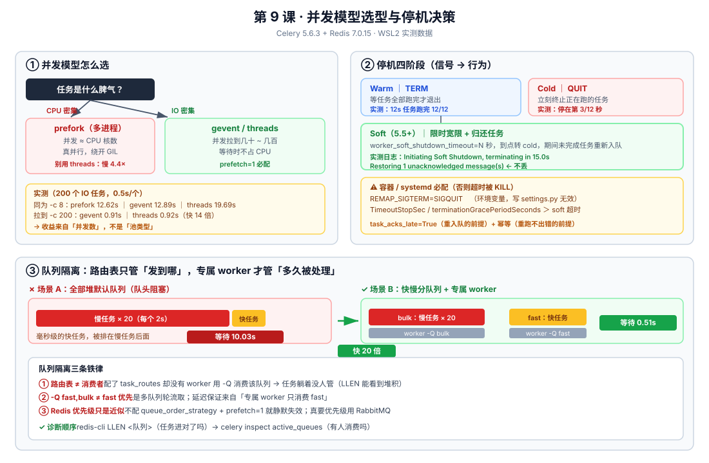

# 第 9 课：生产部署与并发模型

> 所属阶段：阶段 4《定时、编排与生产运维》｜ 水平：入门 ｜ 本课知识点：并发模型选型、进程管理与优雅停机、路由与队列隔离
> 故事情节：上线了 —— 然后发现每次发版都有任务丢，慢任务还把快任务全堵在后面

> ℹ️ **版本基线（核查于 2026-08）**：本文所有停机语义、配置项与行为均在本机 **Celery 5.6.3 + kombu 5.6.2 + Redis 7.0.15（WSL2 Ubuntu）** 上实测验证。
> 文中所有数字都是真实测量结果，不是"示意图"。soft shutdown / REMAP_SIGTERM 对照 Celery 5.5 官方 whatsnew 核实。

## 🎯 本课目标

- 按 CPU 密集 / IO 密集特征选定 pool 类型与并发数（**含一个反直觉的实测结论**）
- 配 systemd + 优雅停机，做到"发版不丢任务"（含 Celery 5.5+ soft shutdown 与 `REMAP_SIGTERM`）
- 用 `task_routes` 做队列隔离，避免慢任务造成队头阻塞

---

## 第一幕：上线了，然后出事了

项目上线两周，运行得挺好。然后两件事接连发生。

**事件一：用户投诉"点了按钮没反应"。**

你查日志，任务确实在跑，只是……排在很后面。因为凌晨 2 点有个批量导出任务，一口气灌进来 8000 个慢任务。你那个"发送验证码邮件"的毫秒级任务，老老实实排在 8000 个后面。

```
队列现状（默认队列 celery，4 个槽位）：
[慢任务×8000][验证码邮件][慢任务...]
              ↑
         这个 50ms 就能跑完的任务，等了 11 分钟
```

**事件二：每次发版都丢任务。**

运维的发版脚本是这样的：

```bash
kill -TERM $(cat /var/run/celery/worker.pid)   # 优雅停机
sleep 5                                         # 等 5 秒
kill -9 ...                                     # 还没退就强杀
```

结果每次发版后，总有那么几个"正在跑的长任务"状态卡在 `STARTED`，永远不结束。

🎬 **场景**：这两个问题的根，其实是同一个 —— **你没告诉 Celery 你的任务"是什么脾气"**。
CPU 密集的、IO 密集的、快的、慢的，全挤在同一个池子里，用同一套并发参数，同一套停机策略。
这一课就是把它们分开：**按脾气选池子（并发模型）、按规矩退出（进程管理）、按快慢分道（队列隔离）。**

---

## 第二幕：认知冲突

你试着自己解决，每版都有新问题：

**尝试一：加并发数** → 内存爆了
```bash
celery -A proj worker --concurrency=100     # 100 个进程！
```
每个 prefork 子进程都是一份完整的 Python 解释器 + Django 运行时。100 个进程 × 150MB = 15GB。机器直接 OOM。

**尝试二：换 `--pool=threads`** → CPU 任务反而变慢了
你听说"线程轻量"，换成 threads。结果跑批任务从 40 秒变成了 170 秒。**更慢了。**

**尝试三：给慢任务单独开队列** → 快任务还是堵
```python
CELERY_TASK_ROUTES = {'reports.export': {'queue': 'slow'}}
```
你加了路由，但 worker 还是那一个，还是 `-Q celery` 启动……**路由配了，但没有 worker 去消费新队列**，任务全躺在 `slow` 队列里没人管。

**尝试四：改停机脚本** → 有的任务丢失，有的任务重复跑
```bash
kill -QUIT ...    # 换成冷停机
```
这次不卡了，但正在跑的任务被直接砍掉。更要命的是：**被砍掉的任务有的没回队列（丢了），有的回去了但重复执行了一遍。**

❓ **问题**：
1. prefork / threads / gevent / solo 到底差在哪？为什么 threads 会让 CPU 任务**更慢**？
2. 并发数该怎么定？"核数"是指什么？
3. `TERM` 和 `QUIT` 到底什么区别？为什么配了 `acks_late` 还会丢任务？
4. 路由配好了，为什么任务还是没人消费？

---

## 第三幕：层层揭示

### 知识点 1：并发模型选型

> 关键点：prefork（默认，进程）／ threads ／ gevent/eventlet（IO 密集）／ solo（Windows、调试）／ 并发数怎么定 ／ prefetch 与公平分发

#### 一句话定义

**并发模型（pool）** 决定 worker 内部"同时能跑几个任务、以及它们怎么共享 CPU"。
Celery 有 5 种池：`prefork`（多进程，默认）、`threads`（多线程）、`gevent` / `eventlet`（协程）、`solo`（单线程，跑在 worker 主进程里）。

#### 直觉建立（类比）

把 worker 想象成一家**餐厅厨房**：

| 池 | 类比 | 特点 |
|----|------|------|
| **prefork** | **多个独立厨师**，每人一个完整灶台 | 真并行（各占一个 CPU 核）；但每个厨师都要"配齐一套厨具"（内存） |
| **threads** | **一个灶台，多个厨师轮流用** | 省厨具；但同一时刻**只有一个人能炒菜**（GIL），而且抢锅铲会互相拖慢 |
| **gevent** | **一个厨师，同时照看 200 个锅** | 锅在炖的时候（等 IO）他就去看别的锅；只擅长"等待型"工作 |
| **solo** | **就一个厨师，一次只做一道菜** | 无任何并行；但**调试时你能看清每一步**（且 Windows 只能用这个 + threads/gevent） |

> 💡 **类比的边界**：真实厨房里多个厨师可以共用一个灶台的不同炉眼。而 Python 的 GIL 更严格 —— **同一进程内，无论多少线程，同一时刻只有一个线程在执行 Python 字节码**。所以 threads 对 CPU 密集任务**帮倒忙**（后面有实测）。

#### 核心原理

**① 五种池对照表**

| 池 | 启动参数 | 并行单位 | 绕开 GIL？ | 内存开销 | 适用场景 |
|----|---------|---------|-----------|---------|---------|
| **prefork**（默认） | `-P prefork` | 进程 | ✅ 是 | 高（每进程一份解释器） | **CPU 密集**、通用默认 |
| **threads** | `-P threads` | 线程 | ❌ 否 | 低 | IO 密集（轻量方案）、**Windows 上的并行** |
| **gevent** | `-P gevent` | 协程（greenlet） | ❌ 否（但等待时不占） | 极低 | **IO 密集高并发**（成百上千） |
| **eventlet** | `-P eventlet` | 协程 | ❌ 否 | 极低 | 同 gevent（二选一即可，gevent 生态更活跃） |
| **solo** | `-P solo` | 无（串行） | — | 最低 | **Windows 调试**、单步断点、排查"是不是并发搞的鬼" |

> ⚠️ **Windows 特别注意**：`prefork` 依赖 `fork()` 系统调用，**Windows 上不可用**。课上前面几课你能在 Windows 跑，是因为用了 `solo` 或 Celery 自动降级。
> **生产环境几乎都是 Linux**，所以本课的停机与并发实测**必须在 Linux 上做**——这也是本课要开 WSL 的原因。

**② ⭐ 反直觉实测：threads 会让 CPU 任务变慢**

我一开始也以为"threads 轻量 = 更快"。实测打脸了。

**实验条件**：8 个 CPU 密集任务（纯 Python 循环 1200 万次），并发数都是 8，唯一变量是池类型。

| 池 | 并发数 | 8 个 CPU 密集任务耗时 |
|----|-------|---------------------|
| **prefork** | 8 | **0.56s** |
| **threads** | 8 | **2.46s** |

**threads 慢了 4.4 倍。** 原因就是 GIL：8 个线程抢同一把锁，不但没有并行，还**多了上下文切换的开销**。

> 🎯 **结论**：**CPU 密集任务，千万别用 threads**。prefork 的多进程才能真并行。

**③ ⭐ 第二个反直觉实测：IO 密集的收益来自"并发数"，不是"池类型"**

再看 IO 密集（200 个 `sleep(0.5)`，模拟等 HTTP/DB 响应）：

**第一组 —— 同为 `concurrency=8`（控制变量）**：

| 池 | 并发数 | 200 个 IO 任务耗时 |
|----|-------|-------------------|
| **prefork** | 8 | **12.62s** |
| **threads** | 8 | **19.69s** ← 最慢！ |
| **gevent** | 8 | **12.89s** |

**第二组 —— 各自跑到高并发**：

| 池 | 并发数 | 200 个 IO 任务耗时 |
|----|-------|-------------------|
| **threads** | 200 | **0.92s** |
| **gevent** | 200 | **0.91s** |

这组数据信息量很大，拆开看：

1. **同为 8 并发时，threads 最慢（19.69s）** —— 再次印证 GIL 争抢。gevent 和 prefork 打平（12.6s 左右），因为瓶颈是"8 个槽位 × 0.5s = 12.5s"，**池类型根本不是瓶颈**。
2. **真正的收益来自把并发数从 8 提到 200**（12.6s → 0.9s）。
   > 📌 **"快 14 倍"的准确含义**：指的是 **gevent 从 `-c 8` 变成 `-c 200`**（12.89s → 0.91s），**不是** `-c 8` 的 gevent 对比 `-c 8` 的 prefork（那组是 12.89s vs 12.62s，几乎没差别）。
3. **prefork 做不到 200** —— 200 个进程 × 约 150MB = 30GB 内存，不现实。**而 gevent/threads 可以**，因为协程/线程极轻。

> 🎯 **所以正确表述是**：IO 密集换 gevent，价值在于**它让你能安全地开到几百并发**，而不在于"协程本身比进程快"。
> 如果只开 8 个并发，换 gevent 几乎没有收益 —— 这点很多教程都讲错了。

**一句话选型**：`并发数上不去 → 换池才有意义；并发数上得去（CPU 密集）→ prefork 就是最优解。`

**④ 并发数怎么定**

| 场景 | 建议并发数 | 理由 |
|------|-----------|------|
| **CPU 密集**（图像处理、报表计算、ML 推理） | ≈ **CPU 核数** | 超过核数反而增加切换开销。20 核机器 → `-c 20` |
| **IO 密集**（调外部 API、发邮件、爬网页） | **几十 ~ 几百**（配 gevent/threads） | 瓶颈是等待，不是 CPU。可从 50 起步压测 |
| **混合** | **拆队列，分开配**（知识点 3） | 一个池子伺候不了两种脾气 |

查看核数：

```bash
nproc          # Linux
# 或 Python：
python -c "import os; print(os.cpu_count())"
```

> 💡 **别盲目拉满并发**：prefork 的每个子进程都是**一份完整的 Python + Django**。
> 经验值：一个 Django worker 子进程常驻 **100~200MB**。`-c 20` ≈ 2~4GB，心里要有数。

**⑤ prefetch 与公平分发**

**prefetch（预取）** = worker 一次从 broker 抓多少条消息**到本地内存**，然后再慢慢执行。

```python
worker_prefetch_multiplier = 4     # 默认值：每个子进程预取 4 条
```

**实际预取总数 = worker_prefetch_multiplier × concurrency**。
比如 `-c 8` + 默认 multiplier=4 → 一次抓 **32 条**进本地。

**为什么这会出问题**：

```
队列里有 40 个任务，你有 2 个 worker（各 -c 4，multiplier=4）

worker A 启动，一把抓走 32 条 → 队列只剩 8 条
worker B 启动，只抓到 8 条
                    ↑
        活儿全在 A 身上，B 闲得发慌 —— 这就是"不公平分发"
```

更糟的是**长任务场景**：worker A 抓了 32 个长任务在慢慢跑，这 32 个任务在 A 的本地内存里排队，**其他空闲的 worker 抢不走它们**。

| 场景 | 建议值 | 理由 |
|------|-------|------|
| **长任务**（秒级~分钟级，任务耗时不均） | **`1`** | 抓一个干一个，谁空谁上，保证公平 |
| **海量短任务**（毫秒级） | `4`（默认） | 少跑几趟 broker，吞吐更高 |
| **混合** | 拆队列，分别配 | 一个 multiplier 伺候不了两种脾气 |

```bash
# 长任务场景的标准起法
celery -A proj worker -c 8 --prefetch-multiplier=1 -l INFO
```

> 🐞 **坑**：`prefetch_multiplier=1` 会让吞吐量略降（多跑几趟 broker），但对长任务是**必需的**。
> 课 5 讲过这个参数（配合 `acks_late`），这里补上"为什么"——**它决定的是分发公平性，不是性能**。

📚 **官方文档**：[Workers Guide · Concurrency](https://docs.celeryq.dev/en/stable/userguide/workers.html#concurrency) ｜ [Concurrency (gevent/eventlet)](https://docs.celeryq.dev/en/stable/userguide/concurrency/eventlet.html)

#### 示例演示：怎么判断我的任务是 CPU 还是 IO 密集

别猜，测一下。把任务丢进这个模板跑一遍：

```python
# 判断任务脾气的小工具（Django 项目里直接放进管理命令或 shell 跑）
import time

def profile_task(task, args=(), n: int = 20):
    """
    跑 n 次任务，测总耗时与 CPU 时间，算出等待占比。
    task：任务对象（如 reports.tasks.export），不是字符串
    """
    t0 = time.time()
    c0 = time.process_time()          # CPU 时间（不含 sleep 等待）

    for _ in range(n):
        task.apply_async(args=args).get(timeout=120)

    wall = time.time() - t0           # 墙钟时间
    cpu = time.process_time() - c0    # CPU 时间
    wait_ratio = 1 - (cpu / wall) if wall else 0

    print(f'{task.name}: 墙钟={wall:.2f}s CPU={cpu:.2f}s 等待占比={wait_ratio:.0%}')
    print('判定：', 'IO 密集 → 上 gevent/threads 拉高并发' if wait_ratio > 0.5
          else 'CPU 密集 → 用 prefork，并发数≈核数')
    return wait_ratio
```

用法（Django shell）：

```python
from reports.tasks import export_report
from shop.tasks import sync_inventory

profile_task(export_report, args=(1,), n=10)      # → 等待占比 8%  → CPU 密集
profile_task(sync_inventory, args=(1,), n=10)     # → 等待占比 94% → IO 密集
```

> ⚠️ **注意**：`profile_task` 会**真实执行**任务（`.get()` 同步等结果）。对有副作用的任务（发短信、扣款），请在测试环境跑，或临时把副作用函数 mock 掉。

> 🎯 **判定标准**：**等待占比 > 50% → IO 密集**；**< 50% → CPU 密集**。
> 简单粗暴版：任务里如果有 `requests.get()` / ORM 查询 / `time.sleep()` 且耗时占比高，就是 IO 密集。

#### 常见误区（知识点 1）

1. **"threads 更轻量所以更快"** → ❌ 实测：CPU 任务下 threads 比 prefork **慢 4.4 倍**（GIL 争抢）
2. **"IO 密集换 gevent 就快 14 倍"** → ❌ 收益来自**并发数从 8 提到 200**，同为 8 并发时 gevent 与 prefork **几乎无差别**
3. **"并发数越大越好"** → ❌ prefork 每进程 100~200MB，`-c 100` 会 OOM
4. **"CPU 密集就无脑 `-c $(nproc)`"** → ⚠️ 如果机器上还跑着 Django/gunicorn，要给它们留核
5. **Windows 上测并发模型** → ❌ prefork 不可用，结论不可迁移到生产（生产是 Linux）

#### 一句话记住（知识点 1）

> **CPU 密集用 prefork（并发≈核数），IO 密集用 gevent/threads（并发拉到几十上百）；
> 换池的真正价值是"能开多高的并发"，不是"池本身更快"。长任务记得 `--prefetch-multiplier=1`。**

---

### 知识点 2：进程管理与优雅停机

> 关键点：systemd / supervisor 最小可用配置 ／ warm vs cold shutdown ／ 5.5+ soft shutdown 与 REMAP_SIGTERM ／ --max-tasks-per-child 防内存泄漏

#### 一句话定义

**优雅停机（graceful shutdown）** = worker 收到停止信号后，**先把正在跑的任务处理妥当再退出**，而不是拍拍屁股走人。
Celery 5.5 起停机分四个阶段：**warm（等任务跑完）→ soft（限时宽限 + 重入队）→ cold（立刻砍掉）→ hard（强制杀）**。

#### 直觉建立（类比）

把 worker 想成**餐厅打烊**：

| 停机类型 | 类比 | 正在做的菜 |
|---------|------|-----------|
| **warm**（`TERM`） | "做完手上的菜再关门" | ✅ 全部做完 |
| **soft**（5.5+） | "再给你们 15 分钟收尾，到点就关灯" | ⏱️ 限时内做完，做不完的**打包给下一班**（重入队） |
| **cold**（`QUIT`） | "立刻关灯，所有人出去" | ❌ 直接倒掉 |
| **hard**（连按 Ctrl-C） | "拉电闸" | ❌ 连收拾都不让 |

> 💡 **类比的边界**：真实餐厅"倒掉"就真没了。而 Celery 里被 cold 砍掉的任务**不一定丢** ——
> 如果开了 `task_acks_late`，任务在 broker 里还没被确认删除，会在可见性超时后被**重新投递**（但可能被别的 worker 再跑一遍 → 这就依赖你在课 5 做的**幂等**了）。

#### 核心原理

**① 四种停机的信号与行为（官方语义 + 本机实测）**

| 类型 | 触发信号 | 行为 | 5.6 本机实测 |
|------|---------|------|-------------|
| **Warm** | `TERM` | 停止接收新任务，**等当前任务全部跑完**才退出 | 投 12s 长任务，3s 后发 TERM → **任务跑完 12/12**，worker 在 **12s** 后退出 |
| **Soft**（5.5+） | `QUIT`（或 `REMAP_SIGTERM` 后的 `TERM`） | 限时宽限（`worker_soft_shutdown_timeout`），到点转 cold，**期间未完成任务重新入队** | 开 15s 宽限后 → 日志 `Initiating Soft Shutdown, terminating in 15.0 seconds`，**16s** 后退出，并 `Restoring 1 unacknowledged message(s)` |
| **Cold** | `QUIT` | **立刻终止**所有正在执行的任务 | 3s 后发 QUIT → 任务停在第 **3/12** 秒，worker **1s** 内退出 |
| **Hard** | 连按 `INT`(Ctrl-C) | 立即强杀，不做任何清理 | 仅调试用，生产不要用 |

**② ⭐ 关键信号：`Restoring N unacknowledged message(s)`**

这是 Celery 在退出前**把没干完的活儿还给 broker** 的动作。看到这行日志 = 任务会重新入队，不会丢。

实测证据（开启 soft shutdown 后）：

```
[WARNING/MainProcess] Initiating Soft Shutdown, terminating in 15.0 seconds
[WARNING/MainProcess] Restoring 1 unacknowledged message(s)     ← 任务归还 broker
```

对照组（不开 soft shutdown，`timeout=0`）：

```
[WARNING/MainProcess] Restoring 1 unacknowledged message(s)     ← 也有，但只归还了"已取未跑"的
```

> 🎯 **差别在哪**：cold shutdown 会**砍掉正在执行的任务**，soft shutdown 给它们**一段宽限时间跑完**。
> 两者都会 `Restoring`，但 restored 的数量和"被砍掉的任务"的命运不同。

**③ `REMAP_SIGTERM` —— 容器环境的救命配置**

问题来了：**Kubernetes / Docker 停止容器时，发的就是 `TERM`**。
而默认 `TERM` = warm shutdown = **无限期等待**。你的 `terminationGracePeriodSeconds: 30` 一到，容器被 `KILL`，任务就真丢了。

```bash
# 让 TERM 触发 cold 流程（而不是默认的 warm）
export REMAP_SIGTERM="SIGQUIT"
```

配上 soft shutdown，就得到**容器环境的标准组合**：

```bash
export REMAP_SIGTERM="SIGQUIT"                    # TERM → cold 流程
export CELERY_WORKER_SOFT_SHUTDOWN_TIMEOUT=15     # 但先给 15s 宽限
```

> ⚠️ **注意**：`REMAP_SIGTERM` 是**环境变量**，不是 Celery 配置项 —— 写进 `app.conf` 无效。
> 实测确认：Celery 5.5 起它是官方支持的（此前是 undocumented 的隐藏特性）。

**④ 完整停机配置（Django settings.py）**

```python
# settings.py —— ⭐ 实测确认：这些写进 settings.py 才稳定生效
CELERY_TASK_ACKS_LATE = True              # ⭐ 任务执行完才 ack（崩溃/被砍 → 重新入队）
CELERY_TASK_REJECT_ON_WORKER_LOST = True  # ⭐ worker 进程被强杀时，任务重新入队
CELERY_WORKER_PREFETCH_MULTIPLIER = 1     # 长任务场景：保证公平分发
CELERY_WORKER_SOFT_SHUTDOWN_TIMEOUT = 15.0        # 5.5+：给 15s 宽限让任务收尾
CELERY_WORKER_ENABLE_SOFT_SHUTDOWN_ON_IDLE = True # 5.5+：空闲时也走 soft（有 ETA 任务时更安全）
```

> ⚠️ **实测踩过的坑（重要）**：
> 我最初用环境变量注入：
> ```bash
> export CELERY_WORKER_SOFT_SHUTDOWN_TIMEOUT=15     # ❌ worker 读不到！
> ```
> 结果 worker 里查到的仍是 `worker_soft_shutdown_timeout = 0.0`（**功能没启用**），而日志里**没有任何报错** —— 静默失效，极难察觉。
>
> **可靠做法**：写进 `settings.py` / `celeryconfig.py`；若必须走外部注入，用 `--include` 加载配置模块。
>
> **验证配置是否真的生效（别靠猜）**：
> ```bash
> celery -A proj inspect conf | grep -i soft_shutdown
> # 期望看到：worker_soft_shutdown_timeout: 15.0   ← 不是 0.0！
> ```
> 更直接的方式（在 Django shell 里）：
> ```python
> from proj.celery import app
> print(app.conf.worker_soft_shutdown_timeout)   # → 15.0 才对
> ```

**⑤ `--max-tasks-per-child`：防内存泄漏的"定期换人"**

worker 子进程是**长期存活**的。第三方库的细微内存泄漏、Django ORM 的连接残留、大对象忘了释放……跑几天就会把内存吃光。

```bash
celery -A proj worker -c 8 --max-tasks-per-child=1000
```

含义：**每个子进程跑满 1000 个任务后，自杀，由父进程拉一个新的干净进程顶上。**

**本机实测证据**（`--max-tasks-per-child=2`，每轮投 2 个任务，观察子进程 PID）：

```
对照组（不设上限）：
  第 1 轮 PID: [1794291, 1794292]
  第 2 轮 PID: [1794291, 1794292]
  ...
  第 6 轮 PID: [1794291, 1794292]      ← 6 轮下来 PID 纹丝不动

实验组（--max-tasks-per-child=2）：
  第 1 轮 PID: [1794847, 1794848]
  第 2 轮 PID: [1794847, 1794848]
  第 3 轮 PID: [1795012, 1795013]      ← 换了！跑满 2 个后被回收重建
  第 4 轮 PID: [1795012, 1795013]
  第 5 轮 PID: [1795039, 1795040]      ← 又换了
  第 6 轮 PID: [1795039, 1795040]
```

还有个 `--max-memory-per-child`（单位 KiB），内存超限就换进程：

```bash
celery -A proj worker -c 8 --max-memory-per-child=200000   # 200MB 上限
```

| 参数 | 作用 | 建议 |
|------|------|------|
| `--max-tasks-per-child` | 按**任务数**回收 | 通用建议 `500~1000`；有已知泄漏的库可以调到 `100` |
| `--max-memory-per-child` | 按**内存**回收 | 兜底保险，设为单进程常态内存的 2 倍 |

> 💡 **代价**：换进程有开销（重新 fork + 重新导入 Django）。
> 设成 `1` 会慢到无法接受；设成 `10000` 又起不到防泄漏作用。**1000 是个常见的平衡点**。

**⑥ systemd 最小可用配置**

生产环境不能靠 `nohup celery ... &`。用 systemd 托管：

```ini
# /etc/systemd/system/celery-worker.service
[Unit]
Description=Celery Worker for proj
After=network.target redis.service
Requires=redis.service

[Service]
Type=simple
User=www-data
Group=www-data
WorkingDirectory=/srv/proj
Environment="DJANGO_SETTINGS_MODULE=proj.settings"
Environment="REMAP_SIGTERM=SIGQUIT"              # ⭐ 容器/服务停止时走 cold+soft
ExecStart=/srv/proj/venv/bin/celery -A proj worker \
          --concurrency=8 \
          --prefetch-multiplier=1 \
          --max-tasks-per-child=1000 \
          --loglevel=INFO \
          --logfile=/var/log/celery/worker.log

# ⭐ 关键：给足停机宽限时间（必须 > soft_shutdown_timeout）
TimeoutStopSec=60
KillSignal=SIGQUIT
Restart=always
RestartSec=10

[Install]
WantedBy=multi-user.target
```

```bash
sudo systemctl daemon-reload
sudo systemctl enable --now celery-worker
sudo systemctl status celery-worker
sudo journalctl -u celery-worker -f        # 看日志
```

> ⚠️ **`TimeoutStopSec` 必须大于 `worker_soft_shutdown_timeout`**，否则 systemd 会在 soft 宽限期结束前强杀 —— 那 15s 白配了。
> 我实测里 worker 退出耗时 16s（15s 宽限 + 1s 收尾），所以 `TimeoutStopSec=60` 是安全的。

**⑦ 发版脚本的正确姿势**

```bash
#!/bin/bash
set -e

echo "→ 停止 worker（等待优雅停机）"
sudo systemctl stop celery-worker          # systemd 会发 KillSignal，并等 TimeoutStopSec

echo "→ 更新代码 / 安装依赖"
cd /srv/proj && git pull
venv/bin/pip install -r requirements.txt

echo "→ 数据库迁移"
venv/bin/python manage.py migrate --noinput

echo "→ 启动 worker"
sudo systemctl start celery-worker

echo "→ 确认活着"
systemctl is-active celery-worker
```

> 🎯 **发版时的黄金法则**：**先停 worker → 再更新代码 → 最后启动**。
> 反过来（先更新代码再重启）会让"正在跑的任务"用**旧代码**执行完，而"新投递的任务"用**新代码**跑 —— 中间状态最容易出错。

**⑧ 怎么确认优雅停机真的生效了**

别靠"感觉没丢任务"。验证三件事：

```bash
# ① 配置是否真的读到了
celery -A proj inspect conf | grep -iE 'soft_shutdown|acks_late'

# ② 停机时有没有"归还任务"的日志
grep -E 'Soft Shutdown|Restoring|unacknowledged' /var/log/celery/worker.log

# ③ 停机后队列里是否还有任务（说明被归还了，而不是凭空消失）
redis-cli -n 0 LLEN celery
```

📚 **官方文档**：[Workers Guide · Stopping the worker](https://docs.celeryq.dev/en/stable/userguide/workers.html#stopping-the-worker) ｜ [Daemonization](https://docs.celeryq.dev/en/stable/userguide/daemonizing.html)

#### 常见误区（知识点 2）

1. **"`TERM` 就是优雅停机，万无一失"** → ⚠️ `TERM` 是**无限期等待**。容器有 `terminationGracePeriodSeconds`，超时照样被 `KILL`
2. **"配了 `acks_late` 就不会丢任务"** → ⚠️ `acks_late` 只保证"崩溃后重新入队"，**不保证"正在跑的任务能跑完"** —— 那要靠 warm/soft shutdown
3. **"`acks_late` + 重新入队 = 任务只跑一次"** → ❌ 是**至少一次**。被砍掉的任务重跑时，前半段可能已经写入了数据 → **必须幂等**（课 5）
4. **把 `REMAP_SIGTERM` 写进 `settings.py`** → ❌ 它是**环境变量**，写进 Celery 配置无效
5. **`TimeoutStopSec` 小于 soft shutdown 超时** → ❌ 宽限期没走完就被强杀，配置白做
6. **`--max-tasks-per-child=1`** → ❌ 每个任务都 fork 一次，慢到不可接受
7. **用 `-B` 把 beat 嵌进 worker** → ❌ 停机时 beat 一起停；且 scale 多副本时会**重复投递**（课 7 讲过）

#### 一句话记住（知识点 2）

> **`TERM` 等任务跑完，`QUIT` 立刻砍掉；5.5+ 的 soft shutdown 给一段宽限 + 把没干完的活儿还回 broker。
> 容器环境记得 `REMAP_SIGTERM=SIGQUIT`，并且 `TimeoutStopSec` 一定要大于宽限时间。**

---

### 知识点 3：路由与队列隔离

> 关键点：task_routes 配置语法 ／ 多队列多 worker 部署 ／ 优先级（RabbitMQ 优先于 Redis）／ rate_limit 限流 ／ 队头阻塞的成因与解法

#### 一句话定义

**队列隔离** = 把不同"脾气"的任务分到不同队列，每个队列配**专属的 worker**，让它们互不干扰。
配置入口是 `task_routes`（任务名 → 队列的映射表）。

#### 直觉建立（类比）

回到餐厅厨房的比喻。现在厨房有两类订单：

- **快餐**（煮个泡面，1 分钟）→ 用户点单，要快
- **宴席**（佛跳墙，2 小时）→ 提前预约，慢慢做

**不隔离**：所有厨师排一条队，前面的宴席不做完，后面的泡面就一直等着。**这就是队头阻塞（head-of-line blocking）。**

**隔离后**：分成**快餐窗口**和**宴席厨房**，各有各的厨师。泡面永远有人立刻做。

> 💡 **类比的边界**：餐厅里厨师可以临时从宴席厨房调去快餐窗口帮忙（`-Q fast,bulk`）。
> Celery 里也一样 —— 一个 worker 可以同时消费多个队列（`-Q fast,bulk`），但**专属队列才是延迟保证的来源**（后面会讲为什么）。

#### 核心原理

**① 队头阻塞：实测证据**

回到第一幕的场景。我做了对照实验：

**场景 A —— 全部堆在默认队列 `celery`**（单 worker，`-c 4`）：

```python
# 先灌 20 个慢任务（每个 2s，模拟跑批）
for i in range(20):
    app.send_task('l9.slow_task', args=[i], queue='celery')

# 立刻投 5 个快任务（毫秒级，模拟用户点按钮）
group(fast_task.s(i) for i in range(5)).apply_async().get()
```

```
RESULT_A 快任务等待耗时 = 10.03s     ← 任务本身只要毫秒级！
```

**场景 B —— 快慢分队列**（两个 worker 各管一个队列）：

```bash
celery -A proj worker -Q bulk -c 4 --prefetch-multiplier=1 -n bulk@%h
celery -A proj worker -Q fast -c 4 --prefetch-multiplier=1 -n fast@%h
```

```python
for i in range(20):
    app.send_task('l9.slow_task', args=[i], queue='bulk')   # 慢任务走 bulk

group(fast_task.s(i, queue='fast') for i in range(5)).apply_async().get()
```

```
RESULT_B 快任务等待耗时 = 0.51s      ← 快了 20 倍
```

| 场景 | 快任务等待耗时 |
|------|--------------|
| A：全部堆默认队列 | **10.03s** |
| B：快慢分队列 + 专属 worker | **0.51s** |

> 🎯 **快任务从 10.03s 降到 0.51s —— 20 倍。而任务代码一行没改，只是换了队列。**

**② `task_routes` 配置语法**

三种粒度，从简到繁：

```python
# settings.py

# ① 精确匹配（任务全名 → 队列）
CELERY_TASK_ROUTES = {
    'reports.export': {'queue': 'bulk'},
}

# ② glob 模式匹配（整个模块 → 队列）
CELERY_TASK_ROUTES = {
    'reports.tasks.*': {'queue': 'bulk'},        # reports 模块下所有任务
    'notifications.*': {'queue': 'fast'},
}

# ③ 有序列表（⭐ 顺序重要！前面的先匹配）
CELERY_TASK_ROUTES = ([
    ('reports.export_huge',  {'queue': 'bulk'}),      # 特例放前面
    ('reports.*',            {'queue': 'normal'}),    # 兜底放后面
    (re.compile(r'(video|image)\.tasks\..*'), {'queue': 'media'}),
],)
```

> ⚠️ **注意 dict vs list 的选择**：
> - 用 **dict** → 匹配顺序**不确定**（Python 3.7+ 按插入序，但别依赖）
> - 有**重叠模式**必须用 **list of tuples**（注意外面套一层 `([...],)`）—— 按顺序匹配，**命中即停**

**一份生产可用的路由表**：

```python
# settings.py
CELERY_TASK_ROUTES = ([
    # ① 用户等待的交互类任务 → fast 队列（专属 worker，低延迟）
    ('notifications.send_sms',       {'queue': 'fast'}),
    ('notifications.send_email',     {'queue': 'fast'}),

    # ② 跑批 / 报表 → bulk 队列（专属 worker，慢没关系）
    ('reports.*',                    {'queue': 'bulk'}),
    ('analytics.*',                  {'queue': 'bulk'}),

    # ③ CPU 密集型 → cpu 队列（prefork，并发≈核数）
    ('ml.*',                         {'queue': 'cpu'}),

    # ④ 兜底：其余走默认队列
],)

CELERY_TASK_DEFAULT_QUEUE = 'default'      # 改掉那个叫 celery 的历史遗留名字
```

**③ 多队列多 worker 部署**

路由表只决定"消息发到哪个队列"。**必须有 worker 去消费它**，否则任务就躺着没人管（第二幕"尝试三"的坑）。

```bash
# fast 队列：专属 worker，prefetch=1 保证低延迟
celery -A proj worker -Q fast -c 8 --prefetch-multiplier=1 -n fast@%h

# bulk 队列：专属 worker，可以开高 prefetch 提吞吐
celery -A proj worker -Q bulk -c 8 --prefetch-multiplier=4 -n bulk@%h

# cpu 队列：prefork，并发≈核数
celery -A proj worker -Q cpu -c 8 -n cpu@%h

# IO 密集队列：gevent 拉高并发
celery -A proj worker -Q io -P gevent -c 200 --prefetch-multiplier=1 -n io@%h
```

**也可以让一个 worker 消费多个队列**（省资源，适合小项目）：

```bash
celery -A proj worker -Q fast,default -c 8 --prefetch-multiplier=1
```

> ⚠️ **关键认知**：`-Q fast,default` **不等于 "fast 优先"**！
> Celery 对多队列是**轮流取**（round-robin），不是严格的优先级。
> **真正的延迟保证来自"专属 worker 只消费 fast 队列"** —— 它的槽位永远不会被 bulk 任务占用。
> 所以标准做法是：**给关键队列配专属 worker（少量）+ 给混合队列配"帮忙"的 worker（大量）**。

```
  路由表                队列              专属 worker 池
┌──────────────┐
│ notif.*      │───▶  fast  ◀── 4 个 worker（只消费 fast）    ← 延迟保证
│ reports.*    │───▶  bulk  ◀── 6 个 worker（只消费 bulk）
│ ml.*         │───▶  cpu   ◀── 8 个 worker（prefork, -c 8）
│ 其他         │───▶  default ◀── 12 个 worker（-Q default,fast 帮忙）
└──────────────┘
```

**④ 优先级：RabbitMQ 靠谱，Redis 只是"近似"**

| Broker | 优先级支持 | 配置方式 |
|--------|-----------|---------|
| **RabbitMQ** | ✅ **Broker 原生支持**（推荐） | 队列声明时加 `x-max-priority` |
| **Redis** | ⚠️ **近似实现**（Celery 用多个 list 模拟） | 必须配 `queue_order_strategy='priority'` |

RabbitMQ（真优先级）：

```python
from kombu import Exchange, Queue

CELERY_TASK_QUEUES = [
    Queue('tasks', Exchange('tasks'), routing_key='tasks',
          queue_arguments={'x-max-priority': 10}),
]
CELERY_TASK_DEFAULT_PRIORITY = 5
```

Redis（准优先级，官方原话"approximate at best"）：

```python
CELERY_BROKER_TRANSPORT_OPTIONS = {
    'queue_order_strategy': 'priority',
    'priority_steps': list(range(10)),     # ⚠️ 必须是 list，不是数字 10
    'sep': ':',
}
CELERY_WORKER_PREFETCH_MULTIPLIER = 1      # ⭐ 必须配，否则预取会绕过优先级
```

```python
# 投递时指定优先级（0~9，数字越大越优先）
send_sms.apply_async(args=[phone], priority=9)
```

> 🐞 **Redis 优先级的三个坑**：
> 1. **不配 `queue_order_strategy` 就完全不生效**，且不报错 —— 静默降级为 FIFO
> 2. **必须配 `prefetch_multiplier=1`** —— 否则 worker 已经抓了一堆低优先级任务在手上，高优先级来了也插不进去
> 3. **只是"准"优先级** —— 官方文档明确说 "may be approximate at best"
>
> **决策建议**：**真需要严格优先级 → 用 RabbitMQ**。用 Redis 时，**队列隔离（专属 worker）比优先级更可靠**。

**⑤ `rate_limit` 限流**

调用第三方 API 时，别把人家打挂（也别让自己的号被封）：

```python
# 方式一：任务装饰器（静态）
@shared_task(name='shop.sync_order', rate_limit='100/m')    # 每分钟最多 100 次
def sync_order(order_id):
    ...

# 也支持 '10/s'（每秒）、'1000/h'（每小时）
```

```bash
# 方式二：运行时动态调整（不用改代码重启）
celery -A proj control rate_limit shop.sync_order 50/m
```

| 写法 | 含义 |
|------|------|
| `'100/m'` | 每分钟 100 个 |
| `'10/s'` | 每秒 10 个 |
| `'1000/h'` | 每小时 1000 个 |

> ⚠️ **限流是"每 worker 实例"的，不是全局的**！
> 你有 3 个 worker，`rate_limit='100/m'` 实际是 **300/m**。
> 要严格全局限流，得用外部方案（Redis 令牌桶 / `celery-singleton`）。

**⑥ 怎么确认路由真的生效了**

```bash
# ① 看队列长度（Redis）
redis-cli -n 0 LLEN fast
redis-cli -n 0 LLEN bulk

# ② 看哪些 worker 在消费哪些队列
celery -A proj inspect active_queues

# ③ 投递一个任务，看它落到哪个队列
python manage.py shell -c "
from reports.tasks import export
r = export.delay(1)
print('task_id:', r.id)
print('queue:', r.queue if hasattr(r, 'queue') else '看 redis 里哪个队列长了')
"
```

📚 **官方文档**：[Routing Tasks](https://docs.celeryq.dev/en/stable/userguide/routing.html) ｜ [Workers Guide · Queues](https://docs.celeryq.dev/en/stable/userguide/workers.html#queues)

#### 示例演示：为你的项目设计队列划分

按这个三步法：

```python
# 第 1 步：给任务分类（按"用户会不会等" + "任务耗时"两个维度）
#
#                 快（<1s）              慢（>1s）
#   用户等待    │ fast（发短信/邮件）   │ cpu（图片处理/ML 推理）
#   后台跑批    │ default（小清理）     │ bulk（报表/批量同步）
#
# 第 2 步：写路由表
CELERY_TASK_ROUTES = ([
    ('notifications.*', {'queue': 'fast'}),
    ('ml.*',            {'queue': 'cpu'}),
    ('reports.*',       {'queue': 'bulk'}),
],)

# 第 3 步：按队列特性起 worker（池类型 + 并发数 + prefetch 都不同）
# fast  : prefork, -c 8,  --prefetch-multiplier=1    （要低延迟）
# cpu   : prefork, -c 20, --prefetch-multiplier=1    （要并行，核数=20）
# bulk  : prefork, -c 8,  --prefetch-multiplier=4    （要吞吐）
# 若有 IO 密集：gevent, -c 200, --prefetch-multiplier=1
```

#### 常见误区（知识点 3）

1. **"配了 `task_routes` 就完事了"** → ❌ **必须有 worker 用 `-Q` 去消费那个队列**，否则任务躺在队列里没人管（第二幕尝试三的坑）
2. **"`-Q fast,bulk` 表示 fast 优先"** → ❌ 是**轮流取**。延迟保证来自**专属 worker**
3. **Redis 上配了 `priority=9` 就以为能插队** → ⚠️ 不配 `queue_order_strategy` + `prefetch_multiplier=1` 就**完全不生效，且不报错**
4. **把队列当优先级用** → 💡 其实**队列隔离 + 专属 worker 比优先级更可靠**，尤其在 Redis 上
5. **`rate_limit` 以为是全局的** → ❌ 是**每 worker 实例**的，3 个 worker 就是 3 倍
6. **队列分太多（十几个）** → ❌ 运维复杂度爆炸。**3~5 个足够**（fast / default / bulk / cpu）
7. **改了路由表，但旧消息还在老队列** → ⚠️ 已投递的消息不会自动搬家，要等老队列消费完或手动迁移

#### 一句话记住（知识点 3）

> **队列隔离 = 给不同脾气的任务修不同的车道。路由表只负责"发到哪条道"，
> 真正的延迟保证来自"专属 worker 只消费某个队列"。Redis 上的优先级只是近似，靠不住。**

---

## 第四幕：实操验证

> 🖥️ **本课实操环境**：WSL2 Ubuntu（Python 3.12.3）+ Celery **5.6.3** + kombu 5.6.2 + Redis **7.0.15**（端口 6380，与本机 6379 上的既有实例隔离）。
> **本课必须在 Linux 上做** —— Windows 没有 `fork()`（prefork 不可用），也没有 POSIX 信号（停机行为不可测）。
> 验证脚本都在 [`playground/`](../../../../playground/) 目录，可直接运行。

### ① 复现并解决队头阻塞（回扣第一幕）

**第一步：复现问题**（脚本：`playground/l9-bench-headblock.sh`）

```bash
# 场景 A：全部堆默认队列
celery -A celeryapp worker --pool=prefork --concurrency=4 --prefetch-multiplier=1 --detach
python -c "
from celeryapp import app
for i in range(20):
    app.send_task('l9.slow_task', args=[i], queue='celery')   # 灌 20 个慢任务
"
# 再投 5 个快任务 → 实测等待 10.03s
```

```
RESULT_A 快任务等待耗时 = 10.03s      ← 任务本身毫秒级，却等了 10 秒
```

**第二步：用队列隔离解决**

```bash
# 场景 B：快慢分队列，各配专属 worker
celery -A celeryapp worker -Q bulk -c 4 --prefetch-multiplier=1 -n bulk@%h --detach
celery -A celeryapp worker -Q fast -c 4 --prefetch-multiplier=1 -n fast@%h --detach

python -c "
from celeryapp import app
for i in range(20):
    app.send_task('l9.slow_task', args=[i], queue='bulk')     # 慢任务走 bulk
"
# 快任务走 fast → 实测等待 0.51s
```

```
RESULT_B 快任务等待耗时 = 0.51s       ← 快了 20 倍
```

✅ **回扣第一幕**：那个"点了按钮没反应"的验证码邮件，从等 11 分钟变成秒回。**任务代码一行没改。**

### ② 复现并发模型的选型收益（含反直觉结论）

```bash
bash playground/l9-bench-cpu.sh       # CPU 密集：prefork vs threads
bash playground/l9-bench-io-fair.sh   # IO 密集：控制变量对照
```

**CPU 密集（8 个任务，并发同为 8）**：

```
POOL=prefork  CONCURRENCY=8 → 0.56s
POOL=threads  CONCURRENCY=8 → 2.46s      ← 慢 4.4 倍（GIL 争抢）
```

**IO 密集（200 个任务）**：

```
同为 -c 8：  prefork 12.62s | threads 19.69s | gevent 12.89s   ← 几乎无差别
高并发：     threads(200) 0.92s | gevent(200) 0.91s            ← 快 14 倍
```

✅ **结论**：**别信"换 gevent 就快 14 倍"**。收益来自并发数从 8 → 200，而 gevent 的价值正是**让你能安全地开到 200**。

### ③ 复现四种停机行为

```bash
bash playground/l9-bench-shutdown.sh       # warm(TERM) vs cold(QUIT)
bash playground/l9-bench-soft2.sh          # soft shutdown 开关对照
```

**warm（TERM）** —— 任务跑完才走：

```
>>> 3s 后发送 TERM（warm shutdown）
>>> worker 在 TERM 后 12s 退出
[ForkPoolWorker-1] long_task running 12/12
[ForkPoolWorker-1] Task l9.long_task succeeded in 12.01s      ← 完整跑完
```

**cold（QUIT）** —— 直接砍掉：

```
>>> 3s 后发送 QUIT（cold shutdown）
>>> worker 在 QUIT 后 1s 退出
[ForkPoolWorker-1] long_task running 3/12                      ← 停在第 3 秒
```

**soft（5.5+，开 15s 宽限）** —— 限时宽限 + 归还任务：

```
[WARNING/MainProcess] Initiating Soft Shutdown, terminating in 15.0 seconds
>>> worker 退出耗时 16s
[WARNING/MainProcess] Restoring 1 unacknowledged message(s)    ← 任务归还 broker
队列残留 = 1                                                    ← 没丢，在队列里
```

✅ **回扣第一幕**：那个"发版丢任务"的问题 —— 开 soft shutdown 后，正在跑的任务有 15s 收尾时间，收不了尾的**返还 broker 等下次**，而不是凭空消失。

### ④ 复现 `--max-tasks-per-child` 的进程回收

```bash
bash playground/l9-bench-maxchild2.sh
```

```
对照组（不设上限）：6 轮下来 PID 恒为 [1794291, 1794292]
实验组（-max-tasks-per-child=2）：
  第 1~2 轮 [1794847, 1794848]
  第 3~4 轮 [1795012, 1795013]      ← 换了
  第 5~6 轮 [1795039, 1795040]      ← 又换了
```

✅ **验证**：子进程确实被定期回收重建 —— 内存泄漏被"定期换人"兜住了。

### ⑤ 命令速查卡

```bash
# —— 查看与诊断 ——
celery -A proj inspect conf | grep -i soft_shutdown   # 确认停机配置生效
celery -A proj inspect active_queues                  # 哪些 worker 消费哪些队列
celery -A proj inspect stats                          # 并发数、池类型、任务计数
redis-cli -n 0 LLEN celery                            # 队列长度（Redis）

# —— 起 worker ——
celery -A proj worker -c 8 -l INFO                                  # CPU 密集默认姿势
celery -A proj worker -P gevent -c 200 --prefetch-multiplier=1       # IO 密集
celery -A proj worker -Q fast -c 8 --prefetch-multiplier=1 -n fast@%h # 专属队列
celery -A proj worker -c 8 --max-tasks-per-child=1000                # 防内存泄漏

# —— 停机 ——
kill -TERM <pid>     # warm：等任务跑完
kill -QUIT <pid>     # cold：立刻终止（配 REMAP_SIGTERM 后 TERM 也走这条）
sudo systemctl stop celery-worker        # 生产推荐

# —— 限流 ——
celery -A proj control rate_limit shop.sync_order 50/m
```

---

## 第五幕：体系收束

> 📍 **全局定位**：阶段 4 的第三块拼图完成。你的能力版图：
>
> | 阶段 | 解决什么 | 状态 |
> |------|---------|------|
> | 1 动因与全景 | 为什么需要、怎么工作 | ✅ 6/6 |
> | 2 集成与基础 | 怎么搭、怎么调用 | ✅ 6/6 |
> | 3 可靠性与幂等 | 不丢、不重、事务安全 | ✅ 6/6 |
> | **4 定时、编排与运维** | **按时跑 · 可编排 · 上生产 · 可观测** | **🔄 9/12** |
>
> **本课的三条硬结论**：
> 1. **并发模型的收益来自"并发数"，不是"池类型"** —— CPU 密集用 prefork（threads 会让 CPU 任务**慢 4.4 倍**）；IO 密集用 gevent/threads，价值在于能安全地开到几百并发
> 2. **停机有四个阶段，别只会用 `TERM`** —— warm 等任务跑完、soft 限时宽限并归还任务、cold 立刻砍掉；容器环境必须配 `REMAP_SIGTERM=SIGQUIT`
> 3. **队列隔离是延迟保证的来源，不是优先级** —— 路由表只管"发到哪"，专属 worker 才管"多久被处理"；Redis 的优先级只是近似
>
> **回扣前三课**：这三件事能兜住，是因为课 5 已经做好了 **幂等**（`acks_late` + 重入队 = 至少一次，没有幂等就会重复执行）。**优雅停机不是"不重跑"，是"不丢失"** —— 两者是不同层的事。
>
> 🔗 **下一步**：课 10《监控、排查与上线清单》—— 阶段 4 的收官一课。搭 Flower 与结构化日志建立可观测性，学常见故障的排查路径（堆积 / 假死 / 泄漏 / NotRegistered），最后产出一份能直接交付的上线自查清单。

---

## 🐞 常见误区（本课汇总）

1. **"threads 更轻量所以更快"** → ❌ CPU 任务下比 prefork 慢 4.4 倍（GIL）
2. **"换 gevent 就快 14 倍"** → ❌ 收益来自并发数 8→200，同并发时与 prefork 几乎无差别
3. **"并发数越大越好"** → ❌ prefork 每进程 100~200MB，`-c 100` 会 OOM
4. **Windows 上测并发模型** → ❌ prefork 不可用，结论不可迁移
5. **"`TERM` 就是万无一失的优雅停机"** → ⚠️ 是**无限期等待**，容器超时照样 `KILL`
6. **"配了 `acks_late` 就不会丢任务"** → ⚠️ 只保证"崩溃后重入队"，不保证"正在跑的能跑完"
7. **把 `REMAP_SIGTERM` 写进 `settings.py`** → ❌ 它是**环境变量**，写进 Celery 配置无效
8. **`TimeoutStopSec` 小于 soft shutdown 超时** → ❌ 宽限期没走完就被强杀
9. **`--max-tasks-per-child=1`** → ❌ 每任务都 fork，慢到不可接受
10. **"配了 `task_routes` 就完事"** → ❌ 必须有 worker 用 `-Q` 消费那个队列
11. **"`-Q fast,bulk` = fast 优先"** → ❌ 是轮流取，延迟保证来自专属 worker
12. **Redis 上配 `priority` 以为能插队** → ⚠️ 不配 `queue_order_strategy` + `prefetch=1` 就**静默失效**
13. **`rate_limit` 以为是全局的** → ❌ 是每 worker 实例的，3 个 worker = 3 倍

## 一图总结



## 课后小测

**Q1**：你的任务是调用第三方 API 拉取数据（每次约 0.5s，其中 95% 时间在等待网络响应）。当前用 `prefork -c 8`，200 个任务要跑 12.6s。你改成 `gevent -c 8` 后，最可能的结果是？

- A. 显著变快，约 1s 以内
- B. 略微变快，约 8~10s
- C. 几乎没变化，仍在 12~13s
- D. 变慢，约 19s

<details><summary>答案与解析</summary>

**答案：C**。

这是本课**最反直觉**的实测结论。本机实测（200 个 sleep(0.5) 任务，并发同为 8）：

```
prefork (c=8) : 12.62s
gevent  (c=8) : 12.89s
threads (c=8) : 19.69s
```

**为什么**：并发数=8 时，瓶颈是"8 个槽位 × 0.5s ≈ 12.5s"这个**数学上限**，跟用进程还是协程**没关系**。

**真正的提速来自把并发数拉到 200**：

```
threads (c=200) : 0.92s
gevent  (c=200) : 0.91s
```

**而 prefork 做不到 200** —— 200 个进程 × 150MB = 30GB，内存直接爆。

> 🎯 **所以 gevent 的价值是"让你能安全地开到几百并发"，不是"协程本身更快"。**
> 正确做法：`-P gevent -c 200 --prefetch-multiplier=1`。

</details>

**Q2**：你在 Kubernetes 里跑 Celery worker，配了 `worker_soft_shutdown_timeout=30`。Pod 的 `terminationGracePeriodSeconds=10`。发版时任务还是会丢，最可能的原因与修复是？

- A. soft shutdown 配错了，应该配 `worker_soft_shutdown_timeout=5`
- B. 没配 `REMAP_SIGTERM=SIGQUIT`，`TERM` 走的是 warm 流程，10s 后被 KILL 时任务没机会归还
- C. 需要把 `task_acks_late` 设为 `False`
- D. Kubernetes 不支持 Celery 的停机信号，必须改用虚拟机部署

<details><summary>答案与解析</summary>

**答案：B**。

**问题链条**：

```
k8s 停 Pod → 发 TERM
    ↓（默认 TERM = warm shutdown = 无限期等待）
30s 宽限期还没走完，terminationGracePeriodSeconds=10 到了
    ↓
k8s 发 KILL → worker 被强杀 → 正在跑的任务没机会"归还 broker" → 丢了
```

**修复**（容器环境的标准组合）：

```bash
export REMAP_SIGTERM="SIGQUIT"                 # TERM → 走 cold 流程（不再无限期等待）
export CELERY_WORKER_SOFT_SHUTDOWN_TIMEOUT=15  # 但先给 15s 宽限收尾 + 归还任务
```

同时 **`terminationGracePeriodSeconds` 必须 > soft shutdown 超时**（比如设为 30）：

```yaml
terminationGracePeriodSeconds: 30
```

⚠️ 同样的道理适用于 systemd：**`TimeoutStopSec` 必须大于 `worker_soft_shutdown_timeout`**。

- A 错：把宽限调小只会让任务更没时间收尾。
- C 错：`acks_late=False` 会让任务在**开始执行时就被 ack**，崩溃后**彻底丢失**，方向完全反了。
- D 错：k8s 完全支持，只是要配对信号。

</details>

**Q3**：你给报表任务配了路由 `CELERY_TASK_ROUTES = {'reports.*': {'queue': 'bulk'}}`，但报表任务一直不执行。队列里能看到堆积：

```
$ redis-cli -n 0 LLEN bulk
128
```

最可能的原因是？

- A. `task_routes` 的 glob 语法写错了，应该用 `reports.*.*`
- B. 路由配置生效了（任务确实进了 bulk 队列），但**没有 worker 消费 bulk 队列**
- C. Redis 不支持多队列，必须换 RabbitMQ
- D. 需要给队列设置优先级才能被消费

<details><summary>答案与解析</summary>

**答案：B**。

**这是队列隔离最经典的坑 —— 路由表和消费者是两件事。**

`task_routes` 只负责**"消息发到哪个队列"**。任务进了 `bulk` 队列（你 `LLEN bulk` 看到 128 就是证据，说明路由**已经生效**），但**没有任何 worker 在消费它**。

**修复**：起一个消费 bulk 队列的 worker：

```bash
celery -A proj worker -Q bulk -c 8 --prefetch-multiplier=4 -n bulk@%h
```

**记住这个诊断顺序**：

```bash
redis-cli -n 0 LLEN bulk                  # ① 任务进对队列了吗？→ 128（进了，路由没问题）
celery -A proj inspect active_queues      # ② 有 worker 在消费它吗？→ 没有（这才是病因）
```

- A 错：`reports.*` 语法正确（能匹配 `reports.export` 等）。而且队列里已经有 128 个任务，证明路由生效了。
- C 错：Redis 完全支持多队列（本课实测的 bulk/fast 就是在 Redis 上跑的）。
- D 错：优先级与"是否被消费"无关。

**延伸**：如果起了 worker 但快任务还是堵，检查是不是用了 `-Q fast,bulk` —— **这是轮流取，不是 fast 优先**。延迟保证要靠**专属 worker 只消费 fast**。

</details>

---

## 🚀 下一批接力提示词

> 学完本批后，**复制下面这段文字发给 AI**，即可无缝进入下一批（无需重新描述上下文）：

```
继续学 Celery + Django。我的学习档案在 celery-django/00-学习档案.md，
刚学完阶段 4《定时、编排与生产运维》的课《生产部署与并发模型》知识点
「并发模型选型」「进程管理与优雅停机」「路由与队列隔离」，
请按大纲继续讲解下一批知识点（课 10《监控、排查与上线清单》）。
```

## 🧭 课程导航

⬅️ **上一课**：[第 8 课：canvas 任务编排](lesson-08-canvas任务编排.md)

➡️ **下一课**：[第 10 课：监控、排查与上线清单](lesson-10-监控、排查与上线清单.md)

📚 **返回目录**：[课程目录](../../02-课程目录.md)