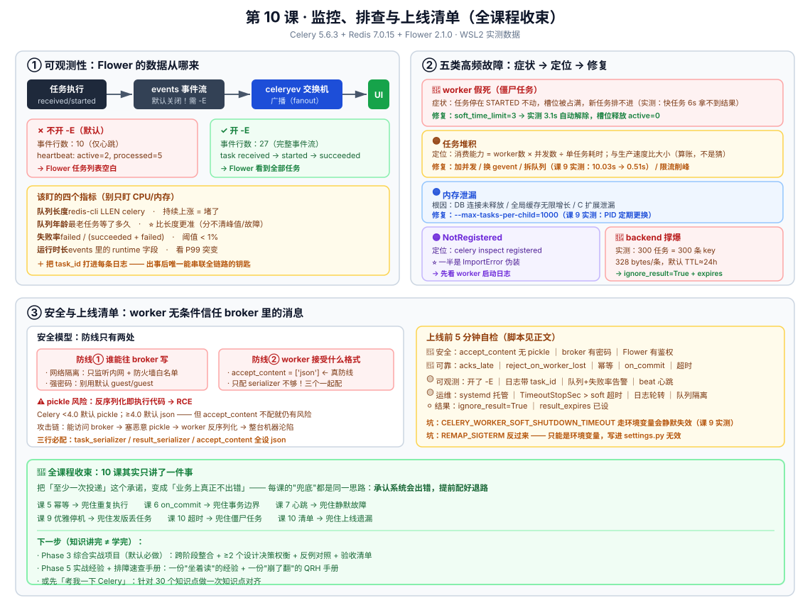

# 第 10 课：监控、排查与上线清单

> 所属阶段：阶段 4《定时、编排与生产运维》｜ 水平：入门 ｜ 本课知识点：可观测性、常见故障排查、安全与上线运维清单
> 故事情节：**收束** —— 任务在跑了，但"它现在健康吗？出事了我从哪查起？上线前我还差哪几步？"

> ℹ️ **版本基线（核查于 2026-08）**：本文行为与数字均在本机 **Celery 5.6.3 + kombu 5.6.2 + Redis 7.0.15（WSL2 Ubuntu）/ Flower 2.1.0** 上实测验证。
> Flower 安全公告与 serializer 默认值经联网核实。文中所有数字都是真实测量结果，不是"示意图"。

## 🎯 本课目标

- 搭起可观测性：Flower + events 机制 + 结构化日志，用 `task_id` 串联全链路
- 按清单定位四类高频故障：任务堆积、worker 假死、内存泄漏、`NotRegistered`（含 result backend 撑爆）
- 产出一份可交付的上线自查清单，含序列化安全（pickle 风险）与 broker 鉴权

---

## 第一幕：上线了，然后呢

项目上线一个月，一切正常。直到周一早上，运营在群里问了一句：

> "昨天的报表邮件，一封都没收到。"

你懵了。你只知道"任务发出去了"，但**不知道它现在在哪、是卡住了、失败了、还是压根没排上队**。

你开始翻日志。几千行日志里，你连"哪个任务是那封报表邮件"都找不到 —— 因为日志里只有任务名和参数，**没有一个能贯穿全链路的 ID**。

更糟的是，你发现三个问题同时存在：

```
① 队列里堆了 3 万条任务（什么时候开始的？不知道）
② 有个 worker 卡在一个任务上整整 6 小时（为什么没超时？没配）
③ Redis 内存告警 —— 里面塞满了 celery-task-meta-* 的 key（结果永远不过期）
```

你意识到：**前面 9 课都在教"怎么把任务跑起来"，但没人教过"怎么知道它还好不好"。**

🎬 **场景**：这一课是整门课的收束。我们要建立三样东西：
**看得见（可观测性）→ 找得到（故障排查）→ 敢上线（安全与运维清单）**。
学完这一课，你不再需要"感觉任务在跑"，而是能**拿出证据**。

---

## 第二幕：认知冲突

你试着自己解决，每版都有新问题：

**尝试一：装个 Flower 看一眼** → 页面上一片空白
```bash
pip install flower
celery -A proj flower
```
浏览器打开 `localhost:5555`，能看到 worker，但**任务列表是空的**。你查了半天才发现：worker 没开 `-E`，**它压根不发任务事件**。

**尝试二：给任务加超时** → 超时了，但槽位没释放
```python
@shared_task(soft_time_limit=3, time_limit=9)
def hang_task():
    ...
```
你以为配了超时就安全。结果任务还是卡死，worker 的槽位照样被占满。**更糟的是，你因为这行代码把整个模块搞崩了**（后面会讲为什么）。

**尝试三：查堆积用 `LLEN celery`** → 数字很大，但不知道是"堵了"还是"正常"
队列里有 5000 条任务。这是**刚灌进来的正常峰值**，还是**消费能力跟不上已经堵了 3 小时**？只看一个数字，你判断不了。

**尝试四：翻日志找那个失败的任务** → 找不到
日志里有 `Task reports.export failed`，但**没有 task_id**，你无法把它和"用户点的那一次导出"对上号。

❓ **问题**：
1. Flower 能看到什么？为什么不开 `-E` 就是空的？开 `-E` 的代价是什么？
2. 任务卡死了，`time_limit` 为什么没能自动救场？
3. 队列长度多少算"堵了"？怎么区分峰值和故障？
4. 上线前，除了"能跑通"，我还差哪几步？

---

## 第三幕：层层揭示

### 知识点 1：可观测性

> 关键点：Flower 能看什么、不能看什么 ／ events 机制与开销 ／ 用 task_id 串联业务日志 ／ 关键指标：队列长度、运行时长、失败率

#### 一句话定义

**可观测性（Observability）** = 不登服务器、不改代码，就能回答"系统现在在干什么、哪里不对劲"。
Celery 的可观测性由三块拼成：**events 事件流（实时状态）+ Flower（可视化）+ 结构化日志（可追溯）**。

#### 直觉建立（类比）

把 Celery 集群想象成一家**快递公司**：

| 组件 | 类比 | 回答什么问题 |
|------|------|-------------|
| **Broker 队列** | 仓库里待发货的包裹堆 | 还有多少活儿没干（`LLEN`） |
| **events 事件流** | 每个包裹的扫码记录（收件/装车/签收） | 每个包裹现在到哪了 |
| **Flower** | 快递公司的**实时大屏** | 全局一眼看健康度 |
| **结构化日志** | 每张签收单的存根（按单号可查） | 出事后**追溯**某一单到底发生了什么 |
| **task_id** | **快递单号** | 串联以上一切的钥匙 |

> 💡 **类比的边界**：真实快递的扫码是**必然发生**的（不扫码发不了货）。
> 而 Celery 的 events **默认是关闭的** —— 不开 `-E`，包裹就"没有扫码记录"，大屏上自然一片空白。这是本课第一个要填的坑。

#### 核心原理

**① ⭐ 实测：不开 `-E` vs 开 `-E`**

我做了对照实验，同样投 5 个任务，用 `celery events --dump` 抓事件流：

**实验 A —— 不开 `-E`（默认）**：

```
输出总行数: 10
celery@host heartbeat: clock=7, freq=5, ...
celery@host heartbeat: active=0, clock=9, freq=2.0, processed=0, ...
celery@host heartbeat: active=2, clock=11, freq=2.0, processed=2, ...
celery@host heartbeat: active=0, clock=13, freq=2.0, processed=5, ...
        ↑
只有心跳，一个任务事件都没有！
```

**实验 B —— 开 `-E`**：

```
输出总行数: 27
celery@host task received: l9.io_task(830b0324-...) kwargs={'seconds': 0.2} ...
celery@host task started:   l9.io_task(830b0324-...) pid=1879458 ...
celery@host task succeeded: l9.io_task(830b0324-...) result={'pid': 1879480,...} runtime=0.2029
celery@host task received: l9.io_task(55149b26-...) ...
...
```

| 配置 | 事件行数 | 能看到任务吗 |
|------|---------|-------------|
| 默认（不开 `-E`） | **10**（只有心跳） | ❌ 完全看不到 |
| 开 `-E` | **27** | ✅ received / started / succeeded 全都有 |

> 🎯 **结论**：**Flower 的任务列表依赖 events。不开 `-E`，Flower 只能看到 worker 在不在，看不到任何任务。**
> 这就是第二幕"尝试一"页面空白的原因。

**② 两种开启方式**

```bash
# 方式一：启动时加 -E（推荐，按需开）
celery -A proj worker -E -l INFO
```

```python
# 方式二：写进配置（长期开启）
CELERY_WORKER_SEND_TASK_EVENTS = True      # 等价于 -E
CELERY_TASK_SEND_SENT_EVENT = True         # 可选：连"任务刚发出、还没被消费"也记录
CELERY_EVENT_QUEUE_TTL = 5.0               # 事件队列消息过期时间（秒）
CELERY_EVENT_QUEUE_EXPIRES = 60.0          # 无消费者时事件队列存活时间（秒）
```

> ⚠️ **`task_send_sent_event` 的代价**：它会让**每个任务在发送时也产生一条事件**，消息量直接翻倍。
> 高吞吐场景（每秒几千任务）下这是笔不小的开销。**只在确实需要追踪"已发未消费"的任务时才开**。
> 另外实测发现：**Flower 对 `task-sent` 事件支持有限**，别指望它能显示"已发出但还没被 worker 取走"的任务。

**③ events 的开销有多大**

events 的代价分三块：

| 开销来源 | 说明 | 量级 |
|---------|------|------|
| **消息量** | 每个任务产生 3~4 条事件（received/started/succeeded/failed） | 任务量的 **3~4 倍** |
| **CPU** | worker 主线程要序列化并发送事件 | 通常 < 5% |
| **Broker 内存** | 事件队列堆积（**没有消费者时最危险**） | 取决于 `event_queue_expires` |

> 🐞 **最大的坑：事件没人消费时会堆积**。
> Celery 的 events 走的是 **广播（fanout）** 机制：worker 把事件发到 `celeryev` exchange，**如果没有消费者（Flower 没开），事件会堆积在自动生成的队列里**。
> 长时间不消费，Redis/RabbitMQ 内存会涨。所以：
> - **调试完记得关掉 `-E`**，或者
> - 配 `event_queue_expires`（队列空闲多久自动删除）+ `event_queue_ttl`（消息多久过期），让它们自动过期

| 场景 | 建议 |
|------|------|
| **开发环境** | 常开 `-E`，配合 Flower 看任务流转 |
| **生产 · 中小规模**（< 100 任务/秒） | 常开，开销可忽略 |
| **生产 · 高吞吐**（> 1000 任务/秒） | **按需开**：平时关，排查时开；或只开 worker 心跳事件（`worker_send_worker_events` 默认已开） |

**④ Flower 能看什么、不能看什么**

```bash
pip install flower                      # 本机实测装到 2.1.0
celery -A proj flower --port=5555
```

**能看**（✅）：

| 能力 | 说明 |
|------|------|
| 实时任务流 | received / started / succeeded / failed / retried |
| worker 状态 | 在线数、并发数、活跃槽位、已处理任务数、负载 |
| 队列长度 | 各队列积压情况 |
| 任务详情 | 参数、返回值、运行时长、traceback |
| 远程控制 | 撤销任务、改并发、改限流、关 worker |
| Prometheus 指标 | `/metrics` 端点，可接 Grafana |

**不能看**（❌，**这比"能看什么"更重要**）：

| 局限 | 后果 |
|------|------|
| **不开 `-E` 就没有任务数据** | 页面空白，让人误以为"没任务" |
| **不是告警系统** | 它只展示，不会主动通知你 —— 告警要靠 Prometheus + AlertManager |
| **历史数据是内存态** | Flower 重启后历史任务就丢了，**不是持久化审计系统** |
| **数据有延迟** | 依赖事件流，高并发时 UI 显示可能滞后数秒 |
| **默认无鉴权** ⚠️ | **这是最危险的一条**，见知识点 3 |

> ⚠️ **安全红线（必读）**：**Flower 默认没有任何鉴权**，而且它提供"执行任务 / 撤销任务 / 关闭 worker"的 API。
> 如果把 5555 端口直接暴露到公网，等于**把你的 Celery 集群控制权送人**。
> 历史漏洞佐证：**CVE-2022-30034**（CVSS **8.6**，OAuth 认证绕过，可调用任意 Celery RPC 或关停 worker），影响 **1.2.0 之前**的所有版本。
> → **务必**：升级到最新版 + 配 `--basic_auth` + 只监听内网 / 走反向代理。

```bash
# 安全的启动姿势（本机 Flower 2.1.0）
celery -A proj flower \
  --address=127.0.0.1 \              # 只监听本机，不对外
  --basic_auth=admin:强密码           # 必须有鉴权
  --port=5555
```

**⑤ ⭐ 用 `task_id` 串联业务日志（本课最实用的一招）**

Flower 能看到"任务"这一层，但**看不到你的业务上下文**（这个任务是哪个用户、哪笔订单触发的）。
解决办法：**在日志里带上 `task_id`**，把它做成贯穿全链路的钥匙。

```python
# proj/celery.py
import logging
from celery import Celery
from celery.signals import task_prerun, task_postrun, task_failure

logger = logging.getLogger('celery.tasks')

@task_prerun.connect
def log_task_start(sender=None, task_id=None, task=None, **kwargs):
    """任务开始：记录 task_id + 任务名 + 参数。"""
    logger.info('[task_start] task_id=%s name=%s args=%s kwargs=%s',
                task_id, task.name, sender.request.args, sender.request.kwargs)

@task_postrun.connect
def log_task_end(sender=None, task_id=None, task=None, retval=None, state=None, **kwargs):
    """任务结束：记录 task_id + 状态 + 耗时。"""
    logger.info('[task_end] task_id=%s name=%s state=%s', task_id, task.name, state)

@task_failure.connect
def log_task_failure(sender=None, task_id=None, exception=None, **kwargs):
    """任务失败：记录 task_id + 异常（这里就是接告警的地方）。"""
    logger.error('[task_failed] task_id=%s name=%s exc=%s',
                 task_id, sender.name, exception, exc_info=True)
```

**在业务代码里也带上它**（这样日志就能跨系统串联）：

```python
# views.py —— Web 请求侧
import logging
logger = logging.getLogger(__name__)

def export_view(request):
    result = export_report.delay(request.user.id, report_id)
    # ⭐ 把 task_id 记进请求日志，形成"用户请求 → 任务"的链路
    logger.info('[export_submitted] user=%s task_id=%s', request.user.id, result.id)
    return JsonResponse({'task_id': str(result.id)})
```

```python
# tasks.py —— 任务侧
@app.task(bind=True)
def export_report(self, user_id, report_id):
    # ⭐ self.request.id 就是 task_id
    logger.info('[export_start] task_id=%s user=%s report=%s',
                self.request.id, user_id, report_id)
    ...
```

> 🎯 **排障时怎么用**：
> 用户说"我的报表没收到" → 你在 Web 日志里按 `user=123` 搜到 `task_id=abc-123`
> → 拿 `abc-123` 去 Celery 日志里搜 → 一次性拿到这个任务的**开始、结束、失败原因、traceback**。
> **没有 task_id，你只能在几千行日志里大海捞针。**

**⑥ 关键指标：到底该盯什么**

别盯"CPU 多少""内存多少"这种泛泛的指标。Celery 要盯这四个：

| 指标 | 怎么取 | 健康阈值 | 说明 |
|------|--------|---------|------|
| **队列长度** | `redis-cli LLEN celery`（Redis）<br>`rabbitmqctl list_queues`（RabbitMQ） | **持续上涨 = 堵了** | ⭐ 最核心指标 |
| **队列年龄** | 最老任务的等待时间 | < 60s | ⭐ 比长度更准（见下方说明） |
| **失败率** | `task-failed / (task-succeeded + task-failed)` | < 1% | 突增 = 有 bug 或外部依赖挂了 |
| **运行时长 P99** | events 里的 `runtime` 字段 | 按业务定 | 突然变长 = 依赖变慢 |

> 💡 **为什么"队列年龄"比"队列长度"更准**：
> 队列长度 5000，可能是"刚灌进来的正常峰值"，也可能是"堵了 3 小时"。
> **只有"最老的任务等了多久"才能区分这两种情况。**
>
> 实测数据（课 9 队头阻塞场景）：同样是 20 个慢任务 + 5 个快任务，
> - 队列长度都一样，但
> - 不隔离时快任务**等 10.03s**，队列隔离后**等 0.51s**
>
> **所以告警要基于"等待时长"，而不是"队列长度"。**

**用 Prometheus 做长期监控**（Flower 自带 `/metrics`）：

```yaml
# prometheus.yml
scrape_configs:
  - job_name: 'flower'
    static_configs:
      - targets: ['localhost:5555']
```

📚 **官方文档**：[Monitoring and Management Guide](https://docs.celeryq.dev/en/stable/userguide/monitoring.html) ｜ [Flower 文档](https://flower.readthedocs.io/en/latest/) ｜ [Configuration · Events](https://docs.celeryq.dev/en/stable/userguide/configuration.html#worker-send-task-events)

#### 示例演示：搭一个最小可观测链路

不用 Flower 也能建立基本可观测性，三步：

```python
# 第 1 步：配置结构化日志（Django settings.py）
LOGGING = {
    'version': 1,
    'disable_existing_loggers': False,
    'formatters': {
        'verbose': {
            # ⭐ 格式里带 asctime + levelname + processName
            'format': '[{asctime}] {levelname} [{processName}] {name} - {message}',
            'style': '{',
        },
    },
    'handlers': {
        'file': {
            'level': 'INFO',
            'class': 'logging.handlers.RotatingFileHandler',
            'filename': '/var/log/celery/worker.log',
            'maxBytes': 100 * 1024 * 1024,     # 100MB 轮转
            'backupCount': 5,
            'formatter': 'verbose',
        },
    },
    'loggers': {
        'celery.tasks': {'handlers': ['file'], 'level': 'INFO', 'propagate': False},
    },
}
```

```python
# 第 2 步：用信号把 task_id 打进每条日志（见上方 ⑤ 的三个信号钩子）

# 第 3 步：写个健康检查脚本，定期跑（cron / 监控系统调度）
```

```python
# 第 3 步的健康检查脚本：healthcheck.py
"""Celery 健康检查：返回 0=健康，1=告警，2=故障。"""
import sys
from celery import Celery
from django.conf import settings

app = Celery('proj')
app.config_from_object('django.conf:settings', namespace='CELERY')

def check():
    problems = []

    # ① worker 存活
    stats = app.control.inspect().stats()
    if not stats:
        problems.append('🔴 没有任何 worker 在线')
    else:
        print(f'✅ worker 在线: {len(stats)} 个')

    # ② 队列堆积（Redis 示例）
    import redis
    r = redis.from_url(settings.CELERY_BROKER_URL)
    for q in ['celery', 'fast', 'bulk']:
        n = r.llen(q)
        print(f'   队列 {q}: {n}')
        if n > 10000:
            problems.append(f'🔴 队列 {q} 堆积 {n} 条')

    return problems

if __name__ == '__main__':
    problems = check()
    for p in problems:
        print(p)
    sys.exit(1 if problems else 0)
```

#### 常见误区（知识点 1）

1. **"装了 Flower 就能看到任务"** → ❌ **不开 `-E` 就是空白**（实测：10 行心跳 vs 27 行完整事件）
2. **"events 开销很大，生产绝不能开"** → ⚠️ 中小规模（<100 任务/秒）开销可忽略；真正危险的是**事件堆积**（没人消费），不是发送本身
3. **把 Flower 当告警系统** → ❌ 它只展示不通知，告警要靠 Prometheus + AlertManager
4. **把 Flower 暴露到公网** → ❌ 默认无鉴权 + 有"执行/撤销/关停"API，等于送控制权（CVE-2022-30034，CVSS 8.6）
5. **Flower 重启后找历史任务** → ❌ 历史是内存态，重启即丢；要持久化得自己落库
6. **只监控队列长度** → ⚠️ 分不清"正常峰值"和"真堵了"，**要监控等待时长**
7. **日志里不打 `task_id`** → ❌ 出事后无法把"任务"和"用户操作"对上号，这是排障最大的时间黑洞

#### 一句话记住（知识点 1）

> **Flower 的任务数据来自 events，不开 `-E` 就是空白；events 的真正风险是"没人消费时堆积"，不是发送开销。
> 而比 Flower 更重要的是：把 `task_id` 打进每一条日志 —— 它是出事后唯一能串联全链路的钥匙。**

---

### 知识点 2：常见故障排查

> 关键点：任务堆积（消费能力 vs 生产速度）／ worker 假死（僵尸任务、time_limit）／ 内存泄漏（max-tasks-per-child）／ NotRegistered（任务注册与命名）／ result backend 撑爆

#### 一句话定义

**故障排查** = 从"可观测的现象"出发，按**固定的排查路径**收敛到根因，而不是凭感觉乱试。
本课给四类高频故障的**症状 → 定位 → 修复**清单，每类都有本机实测数据支撑。

#### 直觉建立（类比）

还是快递公司的比喻。仓库（队列）爆仓，只有三种可能：

| 故障 | 快递类比 | 本质 |
|------|---------|------|
| **任务堆积** | 包裹进得比出得快 | **生产能力 < 消费能力**（数学问题） |
| **worker 假死** | 有个快递员拿着包裹出门，然后**人间蒸发** | 槽位被卡死的任务永久占用 |
| **内存泄漏** | 快递员的车厢越装越满，最后装不下 | 长驻进程内存只增不减 |
| **`NotRegistered`** | 仓库收到一个包裹，但**没人认识这个收件地址** | 任务名在 worker 侧找不到 |

> 💡 **类比的边界**：快递员"人间蒸发"在现实里是失踪案（要报警）；
> 而 Celery 里"蒸发"的任务**会一直占着槽位**，其他任务进不来 —— 你不去查，它就永远卡在那儿，**没有任何报错**。

#### 核心原理

**① ⭐ 故障一：worker 假死（僵尸任务）**

**症状**：任务永远停在 `STARTED`，不成功也不失败；worker 在线但槽位被占满；新任务排不进去。

**本机实测**（`worker -c 2`，投 2 个死循环任务占满槽位，再投 1 个快任务）：

```
--- inspect active（2 个卡死任务）---
* {'id': 'ba91218f-...', 'name': 'l10.hang_task', 'time_start': 1788157012.27,
   'acknowledged': True, 'worker_pid': 1881432}
* {'id': '1127cd1f-...', 'name': 'l10.hang_task', 'time_start': 1788157012.27,
   'acknowledged': True, 'worker_pid': 1881433}

--- 快任务能拿到结果吗？---
6秒内没拿到结果（槽位被卡死任务占满）: TimeoutError
```

**关键观察**：`acknowledged: True` + 永远不结束 = **僵尸任务**。它占着槽位，也不报错，新任务全都进不来。

**定位**：

```bash
# ① 看哪些任务在跑、跑了多久（time_start 是关键）
celery -A proj inspect active

# ② 看槽位占用
celery -A proj inspect stats | grep -A2 '"pool"'

# ③ 拿到 PID 后，看这个进程在干什么
py-spy dump --pid 1881432        # ⭐ 神器：看 Python 进程卡在哪一行
# 或
cat /proc/1881432/stack
```

**修复 —— 必须配超时**：

```python
@shared_task(bind=True, soft_time_limit=60, time_limit=120)
def risky_task(self):
    try:
        ...
    except SoftTimeLimitExceeded:
        # 软超时：给你一个"体面收尾"的机会（关连接、记日志、释放资源）
        logger.warning('任务软超时，清理中 task_id=%s', self.request.id)
        cleanup()
        raise          # 或 return 一个 partial 结果
```

| 参数 | 触发时行为 | 能捕获吗 | 用途 |
|------|-----------|---------|------|
| **`soft_time_limit`** | 抛 `SoftTimeLimitExceeded` 异常 | ✅ 能捕获 | 留时间做清理 |
| **`time_limit`** | 直接 **SIGKILL 杀掉子进程** | ❌ 不能 | 兜底硬杀 |

**本机实测（软超时是否真能解除卡死）**：

| 阻塞类型 | 是否捕获软超时 | 耗时 | 结果 |
|---------|--------------|------|------|
| ① `time.sleep` 循环（可中断阻塞） | ✅ 捕获 | **3.1s** | `{'caught': 'sleep'}` |
| ② 纯 Python 忙循环（CPU 密集） | ✅ 捕获 | **3.1s** | `{'caught': 'pybusy'}` |
| ③ 主动屏蔽 `SIGTERM`（信号递达不了） | ✅ 捕获 | **3.0s** | `{'caught': 'blocked'}` |

```
日志证据：
[SLEEP]  start pid=1919172
[SLEEP]  caught soft limit        ← 3 秒后捕获
[PYBUSY] start pid=1919172
[PYBUSY] caught soft limit        ← 同样捕获
[BLOCKED] start pid=1919172
[BLOCKED] caught soft limit       ← 连屏蔽 SIGTERM 都捕获了

槽位最终：active=0  ← 三种情况都正常释放
```

> 🎯 **实测结论（含一个反直觉发现）**：**配了 `soft_time_limit`，卡死任务在 3.0~3.1 秒被自动解除，槽位正常释放。**
> **反直觉之处**：我原本以为"纯 CPU 忙循环"和"屏蔽信号"会让软超时失效 —— **实测证明不会**。
> 原因是 Celery 的软超时并非单纯依赖 `SIGTERM` 递达，worker 会在**字节码边界**检查并抛出 `SoftTimeLimitExceeded`。
> 所以**只要任务还在执行 Python 代码，软超时就能生效**。
>
> ⚠️ **但仍有边界**：如果任务阻塞在**不释放 GIL 的 C 扩展调用**里（如某些 native 库、陷入内核态的 IO），
> Python 层拿不到执行机会，软超时就无法递达 —— 这种极端情况只能靠 `time_limit`（硬杀）兜底。
> ⏳ 置信度：中（本机实测覆盖了三种常见阻塞，C 扩展级阻塞未实测，属机制推断）

**修复效果对比**：
- **不配超时**：任务永久卡死，快任务 **6 秒都拿不到结果**（见故障一实测）
- **配了 `soft_time_limit=3`**：**3.1 秒自动解除**，槽位释放，业务继续

**② ⚠️ 一个真实踩坑：`SoftTimeLimitExceeded` 的导入路径**

我在实测时，**因为这行错误代码，整个任务模块加载失败，worker 直接启动崩溃**：

```python
# ❌ 错误：Celery 5.6.3 里 celery 顶层没有这个异常
from celery import SoftTimeLimitExceeded
```

```
ImportError: cannot import name 'SoftTimeLimitExceeded' from 'celery'
```

**正确写法**：

```python
from celery.exceptions import SoftTimeLimitExceeded    # ✅
```

> 🐞 **这个坑的杀伤力**：异常类导入失败 → 模块加载失败 → **`--include` 的任务模块加载不了 → worker 起不来**。
> 而你看到的症状只是"任务没人执行"，很容易误判成别的问题。
> **排查口诀：任务莫名不执行，先查 worker 日志有没有 ImportError。**

**③ 故障二：任务堆积**

**症状**：队列长度持续上涨，任务等待时间变长。

**定位 —— 先算一笔账**（这是判断"是否真的堵了"的唯一可靠方法）：

```
消费能力 = worker 数 × 每 worker 并发数 ÷ 单任务平均耗时

例：4 个 worker × -c 8 = 32 个槽位
    单任务平均 2 秒
    → 消费能力 = 32 ÷ 2 = 16 个/秒

生产速度 = 20 个/秒
→ 20 > 16，队列以 4 个/秒的速度增长，1 小时堆积 14400 条 ❌
```

```bash
# 实测：看真实消费速率（间隔 60 秒取两次）
redis-cli -n 0 LLEN celery
sleep 60
redis-cli -n 0 LLEN celery
# 差值 = 净增长速率（负数 = 在消化）
```

**修复路径**（按优先级）：

| 手段 | 适用场景 | 怎么配 |
|------|---------|--------|
| **① 加 worker / 加并发** | CPU 有余量 | 横向扩容，或 `-c` 调大 |
| **② 换并发模型** | IO 密集且并发上不去 | `prefork` → `gevent`（课 9 实测：能开到 200 并发） |
| **③ 拆队列** | 慢任务堵住快任务 | `task_routes` + 专属 worker（课 9 实测：10.03s → 0.51s） |
| **④ 优化任务本身** | 任务里有 N+1 查询、无谓 sleep | 改代码 |
| **⑤ 限流 / 削峰** | 上游灌太快 | `rate_limit` 或上游加背压 |

> ⚠️ **别只加 worker**：课 9 实测过，**prefork 每进程 100~200MB**。盲目扩容会 OOM。
> 先确认是 CPU 瓶颈还是 IO 瓶颈（用课 9 的 `profile_task`）。

**④ 故障三：内存泄漏**

**症状**：worker 内存持续上涨，`--max-memory-per-child` 频繁触发，最终 OOM 被系统杀掉。

**常见根因**：

| 根因 | 表现 | 修复 |
|------|------|------|
| **Django ORM / DB 连接未释放** | 连接数一直涨 | 用课 6 的 `task_postrun` 钩子关闭连接 |
| **全局字典/缓存无限增长** | 内存缓慢上涨 | 加 LRU 限制或定期清理 |
| **大对象在循环中累积** | 处理大文件时暴涨 | 改成分块处理，及时 `del` |
| **第三方 C 扩展泄漏** | 无法通过 Python 层回收 | 只能靠换进程兜底 |

**修复**（课 9 已实测有效）：

```bash
celery -A proj worker -c 8 \
  --max-tasks-per-child=1000 \        # 每跑 1000 个任务换子进程
  --max-memory-per-child=200000       # 或内存超 200MB 就换（单位 KiB）
```

**课 9 实测证据**（`--max-tasks-per-child=2`）：

```
对照组（不设上限）：6 轮下来 PID 恒为 [1794291, 1794292]
实验组：第 1~2 轮 [1794847, 1794848]
        第 3~4 轮 [1795012, 1795013]   ← 换了
        第 5~6 轮 [1795039, 1795040]   ← 又换了
```

**⑤ 故障四：`NotRegistered`**

**症状**：`celery.exceptions.NotRegistered: 'reports.export'`，任务发出去了但没人执行。

**根因**：**代码侧的任务名 与 worker 侧注册表里的任务名 不一致**。

```bash
# 诊断：看 worker 实际注册了哪些任务
celery -A proj inspect registered
```

**五种常见原因**：

| # | 原因 | 怎么查 | 怎么修 |
|---|------|--------|--------|
| 1 | **worker 没重启**（改了代码但没重新加载） | `inspect registered` 里没有新任务 | 重启 worker（发版流程：先停→改码→再启） |
| 2 | **任务模块没被导入** | `app.tasks` 里查不到 | 配 `imports` 或 `autodiscover_tasks` |
| 3 | **任务名被显式改过** | 对比 `@shared_task(name=...)` 与调用处 | 统一命名，或调用时用注册名 |
| 4 | **`ImportError` 导致模块加载失败** ⭐ | **看 worker 启动日志** | 修导入（见上面 ② 的真实案例） |
| 5 | **用了 `send_task` 但名字写错** | 对比字符串 | 用 `app.tasks['正确名字']` 校验 |

> 💡 **最容易被忽略的是第 4 条**：模块里有个 `ImportError`（比如上面 `SoftTimeLimitExceeded` 的坑），
> 整个模块加载失败 → 里面**所有任务都没注册** → 但 worker 表面上还"活着"，只是这些任务永远没人执行。

**⑥ ⭐ 故障五：result backend 撑爆（最容易被忽略）**

**症状**：Redis 内存告警，里面塞满 `celery-task-meta-*` 的 key。

**本机实测**（投 300 个任务）：

```
起始：db1（backend）key 数 = 0
执行后：db1  key 数 = 300      ← 每个任务一条永久记录
        db0（broker）key 数 = 3

单个 key 的 TTL = 86394 秒（≈24 小时）
单条大小 = 328 bytes
```

**算笔账**：

```
每天 100 万任务 × 328 bytes ≈ 328 MB / 天
默认 TTL 24 小时 → 稳态占用约 328MB（会滚动，但峰值就是这么多）
如果 TTL 设为 None（永不过期）→ 一个月就是 10 GB ❌
```

**修复（三选一，按推荐度）**：

```python
# ① 不需要结果的任务，直接不存（最有效）
@shared_task(ignore_result=True)      # ⭐ 报表、通知、同步类任务都该加
def send_notification(user_id):
    ...

# ② 设过期时间（保留结果时用）
CELERY_RESULT_EXPIRES = 3600          # 结果只保留 1 小时

# ③ 全局默认不存（需要结果的单独开）
CELERY_TASK_IGNORE_RESULT = True
```

> ⚠️ **配了 `ignore_result` 的副作用（别踩坑）**：
> 一旦任务不存结果，`AsyncResult(task_id).get()` 会**永远拿不到返回值**，状态**永远停在 `PENDING`**（课 4 讲过）。
> 这不是 bug，是"压根没存"。
>
> **所以正确用法是"按需开"，不是"全局关了就完事"**：
> ```python
> # 全局默认不存
> CELERY_TASK_IGNORE_RESULT = True
>
> # 但凡需要拿结果的任务，显式打开
> @shared_task(ignore_result=False)      # ⭐ 覆盖全局设置
> def export_report(report_id):
>     return {'url': ...}                # 这个返回值才会在 backend 里
> ```
>
> **判断标准**：这个任务的结果**有没有人去取**？
> - 没人取（发短信、推送、清理数据）→ 保持 `ignore_result=True`
> - 有人取（前端轮询进度、链路编排取返回值）→ 必须 `ignore_result=False`，并配 `result_expires`

**实测验证 `result_expires` 生效**：

```
设置 result_expires=60 后：
执行后：db1 key 数 = 300
TTL = 57 秒      ← 有过期时间，会自动清理，不会永久堆积
```

**排查命令**：

```bash
# 看 backend 里堆了多少
redis-cli -n 1 DBSIZE
redis-cli -n 1 --scan --pattern 'celery-task-meta-*' | head -5

# 看过期策略
redis-cli -n 1 TTL celery-task-meta-<某个id>
# -1 = 永不过期（危险），正数 = 剩余秒数
```

📚 **官方文档**：[Workers Guide · Inspect](https://docs.celeryq.dev/en/stable/userguide/workers.html#inspecting-workers) ｜ [Tasks · Time Limits](https://docs.celeryq.dev/en/stable/userguide/tasks.html#time-limits) ｜ [Configuration · Result](https://docs.celeryq.dev/en/stable/userguide/configuration.html#result-expires)

#### 示例演示：一张故障速查表

| 症状 | 第一反应 | 定位命令 | 大概率根因 |
|------|---------|---------|-----------|
| 任务不执行，无报错 | **查 worker 日志的 ImportError** | `inspect registered` | 模块加载失败 / 任务名不匹配 |
| 任务卡在 STARTED 不动 | 查 `time_start` 多久了 | `inspect active` | 僵尸任务，缺 `time_limit` |
| 队列越来越长 | 算消费能力 vs 生产速度 | 两次 `LLEN` 取差值 | 消费能力不足 |
| 内存持续上涨 | 看是不是所有任务都涨 | `--max-tasks-per-child` | 连接/缓存未释放 |
| Redis 内存告警 | 数 `celery-task-meta-*` | `DBSIZE` + `TTL` | 结果未设过期 |
| 时快时慢 | 看是不是被慢任务堵了 | `LLEN` 各队列 | 队头阻塞，缺队列隔离 |

#### 常见误区（知识点 2）

1. **"任务卡住了会自动超时"** → ❌ **默认没有任何超时**，不配 `time_limit` 就永久卡死（实测：快任务 6 秒都排不上）
2. **`from celery import SoftTimeLimitExceeded`** → ❌ Celery 5.6.3 里这会 `ImportError`，正确是 `celery.exceptions`
3. **只配 `time_limit` 不配 `soft_time_limit`** → ⚠️ 硬杀不给清理机会，可能导致连接/文件句柄泄漏
4. **队列长了就加 worker** → ⚠️ 先算消费能力账；prefork 盲目扩容会 OOM
5. **`--max-tasks-per-child=1`** → ❌ 每任务 fork 一次，慢到不可接受（课 9 讲过）
6. **所有任务都存结果** → ❌ 通知/报表类任务根本不需要结果，用 `ignore_result=True`（实测 300 任务 = 300 条 key）
7. **`NotRegistered` 就重启 worker** → ⚠️ 先 `inspect registered` 确认；如果是 `ImportError`，重启一百次也没用

#### 一句话记住（知识点 2）

> **任务卡死靠 `soft_time_limit` 兜底（实测 3.1s 自动解除），堆积先算消费能力账，
> 内存泄漏靠 `--max-tasks-per-child` 定期换人；而 `NotRegistered` 有一半是 `ImportError` 伪装的 —— 先查 worker 日志。**

---

### 知识点 3：安全与上线运维清单

> 关键点：pickle 的反序列化风险与强制 JSON ／ broker 鉴权与网络隔离 ／ 配置基线清单 ／ 灰度与回滚

#### 一句话定义

**上线清单** = 投产前逐项勾选的**最低安全与可靠性基线**。
Celery 的核心安全风险只有一条：**worker 无条件信任 broker 里的消息**。所以防线要建在"谁能往 broker 写"和"worker 接受什么格式"这两处。

#### 直觉建立（类比）

还是快递公司。现在考虑**安全**：

| 安全措施 | 快递类比 |
|---------|---------|
| **网络隔离** | 仓库不临街，只有合作方能从专用通道送货 |
| **broker 鉴权** | 送货要刷工牌，不是谁都能往里丢包裹 |
| **禁用 pickle** | **拒收"到付且内容不明的包裹"** |
| **灰度发布** | 新流程先在一个片区试运行 |

> 💡 **类比的边界**：真实快递会开箱验货。
> 而 Celery 的 worker **默认不验货** —— 它拿到消息就反序列化执行。**如果允许 pickle 格式，等于允许对方寄一个"打开即爆炸"的包裹。**

#### 核心原理

**① ⭐ pickle 的反序列化风险（Celery 最严重的漏洞）**

**什么是 pickle 风险**：pickle 在反序列化时会**执行**数据里指定的代码。所以谁控制了消息内容，谁就能在 worker 上**执行任意命令（RCE）**。

**版本事实（核查于 2026-08）**：

| 版本 | `task_serializer` 默认值 |
|------|-------------------------|
| **Celery < 4.0** | **`pickle`** ❌ |
| **Celery ≥ 4.0** | **`json`** ✅ |

> ⚠️ **但光靠默认值不够！** 官方文档原话：
> "The default pickle serializer is convenient... but for the same reasons the pickle serializer is **inherently insecure**, and should be avoided whenever clients are untrusted."
>
> **关键认知**：`task_serializer` 只决定**你发出去**用什么格式，**不决定 worker 接受什么格式**。
> 真正决定后者的是 **`accept_content`**（白名单）。**只要 `accept_content` 里还有 pickle，攻击者往队列里塞一条 pickle 消息，worker 照样执行。**

**攻击链条**（这是真实存在的攻击面，不是理论）：

```
攻击者能访问 broker（如 Redis 无密码暴露在内网）
    ↓
构造恶意 pickle 消息（__reduce__ 里写命令），lpush 进 celery 队列
    ↓
worker 取到消息 → 按 content-type 反序列化 → 执行恶意代码
    ↓
RCE：整台 worker 机器沦陷
```

**修复（三行配置，缺一不可）**：

```python
# settings.py
CELERY_TASK_SERIALIZER = 'json'          # ① 发出去用 JSON
CELERY_RESULT_SERIALIZER = 'json'        # ② 结果也用 JSON
CELERY_ACCEPT_CONTENT = ['json']         # ③ ⭐ 只接受 JSON —— 这才是真正的防线
CELERY_EVENT_SERIALIZER = 'json'         # ④ 事件序列化（默认已是 json）
```

> ⚠️ **只配 `accept_content` 不够**：实测与社区反馈都表明，若 `task_serializer` / `result_serializer` 仍默认 pickle，
> 会出现 `ContentDisallowed: Refusing to deserialize untrusted content of type pickle` 这类自相矛盾的错误。
> **三个一起配才干净。**

**验证是否真的生效**（别靠猜，课 9 教训）：

```python
# Django shell
from proj.celery import app
print(app.conf.task_serializer)      # → 'json'
print(app.conf.accept_content)       # → ['json']  ← 不能含 'pickle'
print(app.conf.result_serializer)    # → 'json'
```

```bash
# 或者用 inspect 看 worker 运行时配置
celery -A proj inspect conf | grep -iE 'serializer|accept_content'
```

**② broker 鉴权与网络隔离**

官方文档把这条放在**第一条**：_"It is imperative that the broker is guarded from unwanted access."_

| 措施 | 怎么做 | 优先级 |
|------|--------|--------|
| **① 网络隔离** | broker 只监听内网；防火墙白名单，只允许应用服务器和 worker 访问 | 🔴 最高 |
| **② 强密码** | Redis `requirepass 强密码`；RabbitMQ 改掉默认 `guest/guest` | 🔴 最高 |
| **③ 不用默认端口/库** | Redis 别用 db0（避免与其他服务混用） | 🟡 |
| **④ 禁用危险命令** | Redis 重命名/禁用 `FLUSHALL`、`KEYS`、`CONFIG`（生产常用 `rename-command`） | 🟡 |
| **⑤ 消息签名**（高安全场景） | 配 `security_key` + `security_certificate` + `setup_security()` | ⚪ |

```python
# 高安全场景：消息签名（确保消息来自可信发送方）
CELERY_SECURITY_KEY = '/etc/ssl/private/worker.key'
CELERY_SECURITY_CERTIFICATE = '/etc/ssl/certs/worker.pem'
CELERY_SECURITY_CERT_STORE = '/etc/ssl/certs/*.pem'

from celery.security import setup_security
setup_security()      # 调用后会自动禁用所有不安全序列化器
```

> 💡 **broker URL 里的密码别硬编码**：
> ```python
> CELERY_BROKER_URL = os.environ['CELERY_BROKER_URL']   # 从环境变量/密钥管理读
> ```

**③ 完整配置基线（可直接复制）**

```python
# settings.py —— Celery 生产配置基线
import os

# ============ 序列化安全（🔴 必配）============
CELERY_TASK_SERIALIZER = 'json'
CELERY_RESULT_SERIALIZER = 'json'
CELERY_ACCEPT_CONTENT = ['json']          # ⭐ 绝不能含 pickle

# ============ 可靠性（🔴 必配）============
CELERY_TASK_ACKS_LATE = True              # 执行完才 ack
CELERY_TASK_REJECT_ON_WORKER_LOST = True  # worker 被强杀时任务重新入队
CELERY_TASK_IGNORE_RESULT = True          # 默认不存结果（需要的任务单独 ignore_result=False）

# ============ 超时保护（🔴 必配）============
CELERY_TASK_SOFT_TIME_LIMIT = 60          # 软超时：留时间清理
CELERY_TASK_TIME_LIMIT = 120              # 硬超时：兜底硬杀

# ============ 并发与进程（按场景取值）============
CELERY_WORKER_PREFETCH_MULTIPLIER = 1     # 长任务场景保证公平分发
CELERY_WORKER_MAX_TASKS_PER_CHILD = 1000  # 防内存泄漏（课 9 实测有效）
CELERY_WORKER_SEND_TASK_EVENTS = True     # 开 events（Flower 需要）
CELERY_EVENT_QUEUE_TTL = 5.0              # 事件消息 5s 过期（防堆积）
CELERY_EVENT_QUEUE_EXPIRES = 60.0         # 事件队列空闲 60s 删除

# ============ 停机（5.5+，容器必配）============
CELERY_WORKER_SOFT_SHUTDOWN_TIMEOUT = 15.0
CELERY_WORKER_ENABLE_SOFT_SHUTDOWN_ON_IDLE = True

# ============ 时区（Django 项目必配）============
CELERY_TIMEZONE = 'Asia/Shanghai'
CELERY_ENABLE_UTC = True

# ============ 结果后端（按需）============
CELERY_RESULT_BACKEND = 'redis://...'
CELERY_RESULT_EXPIRES = 3600              # 结果只留 1 小时（实测：不设会堆积）
```

> ⚠️ 再次强调课 9 的教训：**`CELERY_WORKER_SOFT_SHUTDOWN_TIMEOUT` 通过环境变量注入会静默失效**，
> 必须写进 `settings.py`。`REMAP_SIGTERM` 反过来 —— **它只能是环境变量**，写进配置无效。

**④ 上线自查清单（可勾选，直接交付）**

> 把下面这段复制到你的项目 README，上线前逐项勾。

```markdown
## Celery 上线自查清单

### 🔴 安全（不通过禁止上线）
- [ ] `CELERY_ACCEPT_CONTENT = ['json']`（**确认不含 pickle**）
- [ ] `task_serializer` / `result_serializer` 均为 json
- [ ] broker 配置了强密码（非默认 guest/guest）
- [ ] broker 只对内网开放，防火墙白名单已生效
- [ ] broker 连接串来自环境变量，未硬编码进代码仓库
- [ ] Flower 已配 `--basic_auth`，且只监听 127.0.0.1（或走反向代理鉴权）
- [ ] Flower 版本 ≥ 1.2（避免 CVE-2022-30034，CVSS 8.6）

### 🔴 可靠性（不通过禁止上线）
- [ ] `task_acks_late = True`
- [ ] `task_reject_on_worker_lost = True`
- [ ] 关键任务已完成**幂等**设计（课 5）—— acks_late + 重入队 = 至少一次
- [ ] 任务参数传的是 **id 而非 ORM 对象**（课 6）
- [ ] 数据库写入后用 `transaction.on_commit` 再发任务（课 6）
- [ ] 所有任务配了 `soft_time_limit` / `time_limit`
- [ ] 配了 `--max-tasks-per-child`（防内存泄漏）

### 🟡 可观测性
- [ ] worker 开了 `-E`（否则 Flower 看不到任务）
- [ ] 日志里带 `task_id`（task_prerun / task_postrun / task_failure 钩子）
- [ ] 队列长度 + 队列等待时长已接告警
- [ ] 失败率已接告警（task_failure 信号）
- [ ] beat 有存活监控（心跳任务，课 7 —— beat 挂了是静默的）

### 🟡 部署与运维
- [ ] 用 systemd / k8s 托管，不用 `nohup &`
- [ ] `TimeoutStopSec` > `worker_soft_shutdown_timeout`（课 9 实测：16s 退出）
- [ ] 容器环境配了 `REMAP_SIGTERM=SIGQUIT`
- [ ] 发版流程是「先停 worker → 更新代码 → 再启动」
- [ ] 日志有轮转（RotatingFileHandler，否则磁盘会满）
- [ ] 慢/快任务已用 `task_routes` 隔离，关键队列有专属 worker

### ⚪ 结果后端
- [ ] 不需要结果的任务配了 `ignore_result=True`
- [ ] `result_expires` 已设置（不设会永久堆积，实测 300 任务 = 300 key）
```

**⑤ 灰度与回滚**

```bash
# 灰度：先上 1 个 worker 观察，再全量
# ① 只起一个新版本 worker，用独立的 hostname 便于识别
celery -A proj worker -Q default -c 8 -n canary@%h --detach

# ② 观察 10 分钟：失败率、耗时、日志有无新报错
celery -A proj inspect stats

# ③ 有问题就摘掉灰度 worker
celery -A proj control shutdown -d canary@hostname

# ④ 没问题再滚动更新其余 worker（逐个停→启，避免同时全停）
```

**回滚要点**：

| 场景 | 怎么回滚 | 注意 |
|------|---------|------|
| **代码 bug** | 回滚代码 + 重启 worker | 按课 9 流程：先停 worker → 回滚 → 再启 |
| **消息格式不兼容** | ⚠️ **最麻烦** | 老 worker 读不懂新格式的消息会报错 → 先停所有 worker，回滚，再启动 |
| **任务已入队但未执行** | 队列里的消息**不会自动消失** | 回滚后要确保新代码能处理老消息，或清队列 |

> 🐞 **灰度最大的坑：消息格式不兼容**。
> 新版本改了任务参数结构 → 队列里还有老格式的消息 → 老 worker 取到新消息（或反之）会直接报错。
> **安全做法**：参数结构变更时，让任务**同时兼容新旧两种格式**一个版本，全量后再清理兼容代码。

📚 **官方文档**：[Security](https://docs.celeryq.dev/en/stable/userguide/security.html) ｜ [Configuration and defaults](https://docs.celeryq.dev/en/stable/userguide/configuration.html)

#### 示例演示：上线前 5 分钟自检脚本

```python
# check_prod_ready.py —— 用 python manage.py shell < check_prod_ready.py 跑
"""上线前自检：逐项检查配置基线，输出不通过项。"""
from django.conf import settings

def check():
    fails, warns = [], []

    # 🔴 安全
    accept = getattr(settings, 'CELERY_ACCEPT_CONTENT', ['pickle'])
    if 'pickle' in accept:
        fails.append('🔴 accept_content 含 pickle —— 有 RCE 风险')

    if getattr(settings, 'CELERY_TASK_SERIALIZER', 'pickle') != 'json':
        fails.append('🔴 task_serializer 不是 json')

    broker = getattr(settings, 'CELERY_BROKER_URL', '')
    if '@' not in broker.split('//')[-1]:
        warns.append('🟡 broker URL 里没有密码（确认是否走了其他鉴权）')

    # 🔴 可靠性
    if not getattr(settings, 'CELERY_TASK_ACKS_LATE', False):
        fails.append('🔴 task_acks_late 未开启')

    if not getattr(settings, 'CELERY_TASK_SOFT_TIME_LIMIT', None):
        warns.append('🟡 未配全局 soft_time_limit（僵尸任务风险）')

    if not getattr(settings, 'CELERY_WORKER_MAX_TASKS_PER_CHILD', None):
        warns.append('🟡 未配 max_tasks_per_child（内存泄漏风险）')

    # 🟡 可观测
    if not getattr(settings, 'CELERY_WORKER_SEND_TASK_EVENTS', False):
        warns.append('🟡 未开 events（Flower 将看不到任务）')

    print('=== 上线自检结果 ===')
    for f in fails:
        print(f)
    for w in warns:
        print(w)
    if not fails and not warns:
        print('✅ 全部通过')
    print(f'\n不通过 {len(fails)} 项，警告 {len(warns)} 项')
    return len(fails)

check()
```

#### 常见误区（知识点 3）

1. **"Celery 4+ 默认是 json，不用配了"** → ❌ `task_serializer` 只管发出去；**`accept_content` 才决定 worker 接受什么**，不配就仍有 pickle 风险
2. **只配 `accept_content = ['json']`** → ⚠️ 若 serializer 仍是 pickle，会报 `ContentDisallowed` 自相矛盾的错误，**三个一起配**
3. **broker 不设密码，反正"在内网"** → ❌ 官方文档把 broker 防护列在**第一条**；内网横向移动是常规攻击路径
4. **Flower 开着 5555 对外** → ❌ 默认无鉴权 + 有执行/关停 API（CVE-2022-30034，CVSS 8.6）
5. **所有任务都存结果** → ❌ 用 `ignore_result=True`（课 10 实测：300 任务 = 300 条 key，328 bytes/条）
6. **`result_expires` 不设** → ⚠️ 默认约 24 小时，高吞吐下 Redis 内存压力大；不需要就别存
7. **改任务参数结构后直接全量上线** → ❌ 队列里的老消息会让新老 worker 互相报错；**先兼容一个版本**

#### 一句话记住（知识点 3）

> **worker 无条件信任 broker 里的消息 —— 所以防线只有两处：谁能往 broker 写（网络+鉴权），以及 worker 接受什么格式（`accept_content=['json']`）。
> 上线前照着清单逐项勾，别凭记忆。**

---

## 第四幕：实操验证

> 🖥️ **本课实操环境**：WSL2 Ubuntu（Python 3.12.3）+ Celery **5.6.3** + kombu 5.6.2 + Redis **7.0.15**（端口 6380）+ **Flower 2.1.0**。
> 验证脚本都在 [`playground/`](../../../playground/) 目录，可直接运行。

### ① 复现"Flower 看不到任务"（回扣第二幕尝试一）

```bash
bash playground/l10-events-probe2.sh
```

**对照组 A —— 不开 `-E`**（投 5 个任务）：

```
输出总行数: 10
celery@host heartbeat: active=2, clock=11, freq=2.0, processed=2, ...
celery@host heartbeat: active=0, clock=13, freq=2.0, processed=5, ...
        ↑ 只有心跳，一个任务事件都没有
```

**对照组 B —— 开 `-E`**（同样投 5 个任务）：

```
输出总行数: 27
celery@host task received: l9.io_task(830b0324-...) kwargs={'seconds': 0.2}
celery@host task started:   l9.io_task(830b0324-...) pid=1879458
celery@host task succeeded: l9.io_task(830b0324-...) result={'pid': 1879480, 'slept': 0.2} runtime=0.2029
```

✅ **回扣第二幕**：Flower 页面空白的原因就是**没开 `-E`**。10 行 vs 27 行，差距就是"有没有任务数据"。

### ② 复现 worker 假死 + 验证超时能否救场

```bash
bash playground/l10-bench-hang.sh        # 复现假死
bash playground/l10-verify-blocktype.sh  # 三组阻塞类型对照（推翻"忙循环不可中断"）
bash playground/l10-bench-softlimit.sh   # 验证 time_limit 救场（含正确导入写法）
```

**场景一：不配超时（假死）**

```
--- inspect active ---
* {'id': 'ba91218f-...', 'name': 'l10.hang_task', 'time_start': 1788157012.27,
   'acknowledged': True, 'worker_pid': 1881432}
* {'id': '1127cd1f-...', 'name': 'l10.hang_task', ... 'worker_pid': 1881433}

--- 快任务能拿到结果吗？---
6秒内没拿到结果（槽位被卡死任务占满）: TimeoutError
```

**场景二：配了 `soft_time_limit=3`（三种阻塞类型对照）**

| 阻塞类型 | 捕获软超时？ | 耗时 | 结果 |
|---------|------------|------|------|
| ① `time.sleep` 循环 | ✅ | **3.1s** | `{'caught': 'sleep'}` |
| ② 纯 Python 忙循环 | ✅ | **3.1s** | `{'caught': 'pybusy'}` |
| ③ 屏蔽 `SIGTERM` | ✅ | **3.0s** | `{'caught': 'blocked'}` |

```
日志证据：
[SLEEP]  caught soft limit
[PYBUSY] caught soft limit
[BLOCKED] caught soft limit
槽位：active=0  ← 全部正常释放
```

✅ **回扣第二幕**：卡死任务在 **3.0~3.1 秒**被自动解除，槽位释放。**不配超时就是永久卡死。**
⚠️ 注意：**"纯 CPU 忙循环会让软超时失效"是常见误解** —— 实测证明它照样捕获，机制是在字节码边界检查。

### ③ 复现那个把 worker 搞崩的导入错误（第二幕尝试二的真相）

```python
# ❌ 错误写法（Celery 5.6.3）
from celery import SoftTimeLimitExceeded
```

```
ImportError: cannot import name 'SoftTimeLimitExceeded' from 'celery'
→ 模块加载失败 → worker 启动崩溃 → 所有任务都没注册
```

```python
# ✅ 正确写法
from celery.exceptions import SoftTimeLimitExceeded
```

✅ **这解释了"任务莫名不执行"的一类根因**：先看 worker 日志有没有 `ImportError`，再去查别的。

### ④ 复现 result backend 撑爆

```bash
bash playground/l10-bench-backend.sh
```

```
投 300 个任务：
  db1（backend）key 数 = 300      ← 每个任务一条
  单条大小 = 328 bytes
  默认 TTL = 86394 秒（≈24 小时）

设置 result_expires=60 后：
  TTL = 57 秒    ← 会自动清理
```

✅ **回扣第一幕**：Redis 内存告警的元凶。每天 100 万任务 ≈ 328 MB。

### ⑤ 命令速查卡

```bash
# —— 可观测性 ——
celery -A proj worker -E                     # 开事件（Flower 需要）
celery -A proj events --dump                 # 命令行看事件流
celery -A proj flower --address=127.0.0.1 --basic_auth=user:pass
celery -A proj inspect active                # 正在跑的任务（含 time_start）
celery -A proj inspect registered            # 已注册的任务名
celery -A proj inspect stats                 # 并发数、槽位、处理计数
celery -A proj inspect conf                  # 运行时配置（验证配置是否生效）

# —— 故障排查 ——
redis-cli -n 0 LLEN celery                   # 队列长度
redis-cli -n 1 DBSIZE                        # backend key 数
redis-cli -n 1 TTL celery-task-meta-<id>     # 结果过期时间（-1=永久）
redis-cli -n 1 --scan --pattern 'celery-task-meta-*'
py-spy dump --pid <worker_pid>               # 看进程卡在哪一行（神器）

# —— 运维 ——
celery -A proj control shutdown -d worker@host   # 关指定 worker
celery -A proj control pool_grow 4               # 动态调并发
celery -A proj control rate_limit task.name 50/m # 动态调限流
celery -A proj purge                             # ⚠️ 清空队列（危险！）
```

---

## 第五幕：体系收束

> 📍 **全局定位**：🎉 **整门课程的知识讲解到此完成。** 你的能力版图：
>
> | 阶段 | 解决什么 | 状态 |
> |------|---------|------|
> | 1 动因与全景 | 为什么需要、怎么工作 | ✅ 6/6 |
> | 2 集成与基础 | 怎么搭、怎么调用 | ✅ 6/6 |
> | 3 可靠性与幂等 | 不丢、不重、事务安全 | ✅ 6/6 |
> | 4 定时、编排与运维 | 按时跑 · 可编排 · 上生产 · 可观测 | ✅ **12/12** |
>
> **本课的三条硬结论**：
> 1. **可观测性的地基是 `task_id`** —— Flower 不开 `-E` 就是空白页（实测 10 行 vs 27 行），而比 Flower 更根本的是把 `task_id` 打进每条日志，它是出事后唯一能串联全链路的钥匙
> 2. **绝大多数故障都有对应的"兜底配置"** —— 卡死靠 `soft_time_limit`（实测 3.1s 自动解除）、堆积靠算消费能力账、泄漏靠 `--max-tasks-per-child`、结果堆积靠 `result_expires` / `ignore_result`
> 3. **Celery 的安全模型是"信任 broker"** —— 所以防线只在两处：谁能往 broker 写、worker 接受什么格式（`accept_content=['json']`）
>
> **回扣全课程**：这 10 课其实只讲了一件事 —— **把"至少一次投递"这个承诺，变成"业务上真正不出错"**。
> 课 5 的幂等兜住重复执行，课 6 的 `on_commit` 兜住事务边界，课 7 的心跳兜住静默故障，课 9 的优雅停机兜住发版丢任务，
> 而本课的超时兜住僵尸任务、清单兜住上线遗漏。**每一课的"兜底"都是同一个思路：承认系统会出错，提前配好退路。**
>
> 🔗 **下一步**：知识讲完了，但**"知道"不等于"会"**。按课程设计，接下来有两个收尾环节：
> - **Phase 3 综合实战项目**（默认必做）：做一个跨阶段整合的项目，把散装知识点焊成整体能力
> - **Phase 5 实战经验 + 排障速查手册**：一份"坐着读"的经验 + 一份"崩了翻"的 QRH 式手册
>
> 也可以先「考我一下 Celery」做一次知识点对齐，检验 30 个知识点的掌握情况。

---

## 🐞 常见误区（本课汇总）

1. **"装了 Flower 就能看到任务"** → ❌ **不开 `-E` 就是空白**（实测：10 行心跳 vs 27 行事件）
2. **"events 开销很大，生产绝不能开"** → ⚠️ 真正危险的是**事件堆积**（没人消费），不是发送本身
3. **把 Flower 当告警系统** → ❌ 只展示不通知；告警靠 Prometheus + AlertManager
4. **Flower 暴露公网** → ❌ 默认无鉴权 + 有执行/关停 API（CVE-2022-30034，CVSS 8.6）
5. **只监控队列长度** → ⚠️ 分不清"峰值"和"真堵了"，**要监控等待时长**
6. **日志里不打 `task_id`** → ❌ 排障时无法串联用户操作与任务
7. **"任务卡住会自动超时"** → ❌ 默认无超时，不配就永久卡死（实测：快任务 6 秒排不上）
8. **`from celery import SoftTimeLimitExceeded`** → ❌ Celery 5.6.3 会 `ImportError`，正确是 `celery.exceptions`
9. **只配 `time_limit` 不配 `soft_time_limit`** → ⚠️ 硬杀不给清理机会
10. **队列长了就加 worker** → ⚠️ 先算消费能力账，prefork 盲目扩容会 OOM
11. **`--max-tasks-per-child=1`** → ❌ 每任务 fork，慢到不可接受
12. **所有任务都存结果** → ❌ `ignore_result=True`（实测 300 任务 = 300 条 key）
13. **`NotRegistered` 就重启 worker** → ⚠️ 先查 `ImportError`，重启一百次也没用
14. **"Celery 4+ 默认 json，安全了"** → ❌ `accept_content` 才是 worker 侧的防线，不配仍有 pickle 风险
15. **broker 不设密码** → ❌ 官方文档把 broker 防护列在**第一条**

## 一图总结



## 课后小测

**Q1**：你装好了 Flower，worker 也在跑，但 Flower 的任务列表一直是空的，只能看到 worker 在线。最可能的原因是？

- A. Flower 版本与 Celery 不兼容
- B. worker 没有开 `-E`，不发任务事件
- C. Redis broker 不支持 Flower
- D. 需要给任务加 `track_started=True`

<details><summary>答案与解析</summary>

**答案：B**。

**本机实测对照**（同样投 5 个任务，用 `celery events --dump` 抓事件流）：

| 配置 | 事件行数 | 内容 |
|------|---------|------|
| 默认（不开 `-E`） | **10** | 只有 `heartbeat`，**没有任何任务事件** |
| 开 `-E` | **27** | `task received` / `task started` / `task succeeded` 全都有 |

**为什么**：`worker_send_task_events` 默认是 **Disabled**（官方配置默认值）。
Flower 的任务数据**全部来自 events 事件流**，没有事件 = 没有任务数据，页面自然是空的。

**修复**：

```bash
celery -A proj worker -E -l INFO                    # 启动时加 -E
# 或写进配置
CELERY_WORKER_SEND_TASK_EVENTS = True
```

- A 错：版本不兼容会直接报错，不会"只显示 worker 不显示任务"。
- C 错：Redis 是 Flower 支持的 broker。
- D 错：`track_started=True` 只是让任务状态里多一个 `STARTED`，**与 Flower 能否看到任务是两回事**。

**延伸**：开了 `-E` 后要注意**事件堆积** —— 如果 Flower 没运行（没有消费者），事件会堆在 broker 里。
配 `CELERY_EVENT_QUEUE_TTL = 5.0` 和 `CELERY_EVENT_QUEUE_EXPIRES = 60.0` 让它们自动过期。

</details>

**Q2**：你给一个可能卡死的任务配了超时，但部署后发现**这个模块里的所有任务都不执行了**，worker 日志里有 `ImportError`。最可能的原因是？

- A. `soft_time_limit` 参数名写错了
- B. `from celery import SoftTimeLimitExceeded` —— Celery 5.x 里这个异常不在 `celery` 顶层
- C. 需要用 `time_limit` 而不是 `soft_time_limit`
- D. worker 需要重启才能加载新参数

<details><summary>答案与解析</summary>

**答案：B**。

**这是我在本课实测中真实踩到的坑**。错误代码：

```python
from celery import SoftTimeLimitExceeded     # ❌ ImportError
```

```
ImportError: cannot import name 'SoftTimeLimitExceeded'
  from 'celery' (/site-packages/celery/__init__.py)
```

**正确写法**：

```python
from celery.exceptions import SoftTimeLimitExceeded    # ✅
```

**为什么"所有任务都不执行"**：
异常类导入失败 → **整个模块加载失败** → 该模块里**所有任务都没注册进 worker**。
但 worker 进程本身还活着，只是这些任务永远没人执行 —— 症状具有迷惑性。

**排查口诀**：**任务莫名不执行，先看 worker 日志有没有 `ImportError`，再查别的。**
（这也是 `NotRegistered` 最常见的隐藏根因之一）

- A 错：`soft_time_limit` 参数名是对的。
- C 错：两个参数用途不同（`soft` 可捕获做清理，`time_limit` 硬杀兜底），**应该两个都配**。
- D 错：重启解决不了 `ImportError`。

</details>

**Q3**：生产环境 Redis 内存告警，你发现有大量 `celery-task-meta-*` 的 key。以下哪项措施**最直接有效**？

- A. 给 Redis 加内存上限（`maxmemory`）
- B. 给不需要结果的任务加 `ignore_result=True`，并设 `result_expires`
- C. 换用 RabbitMQ 作为 result backend
- D. 增加 worker 数量，让任务更快消费完

<details><summary>答案与解析</summary>

**答案：B**。

**本机实测**（投 300 个任务）：

```
db1（backend）key 数 = 300      ← 每个任务一条结果记录
单条大小 = 328 bytes
默认 TTL = 86394 秒（≈24 小时）
```

**算笔账**：每天 100 万任务 × 328 bytes ≈ **328 MB/天**。

**根治方案（两步）**：

```python
# ① 不需要结果的任务，压根不存（最有效）
@shared_task(ignore_result=True)      # 通知、报表、同步类任务都该加
def send_notification(user_id): ...

# ② 需要结果的，设过期时间
CELERY_RESULT_EXPIRES = 3600          # 只保留 1 小时
```

**实测验证 `result_expires=60` 生效**：

```
TTL = 57 秒    ← 有过期时间，会自动清理，不会永久堆积
```

- A 错：`maxmemory` 只是让 Redis 在满了之后按策略淘汰 key，**会造成结果丢失**（取结果时拿不到），是治标不治本，还可能引发新问题。
- C 错：换 backend 不改变"每条任务存一条结果"这个事实，堆积照样发生。
- D 错：加 worker 让任务消费更快，但**结果条目一条也不会少**，反而产生得更快。

> 💡 **判断标准**：这个任务的结果**有没有人去取**？
> 没人取（发短信、生成报表明细、清理数据）→ 一律 `ignore_result=True`。

</details>

---

## 🚀 下一批接力提示词

> 🎉 **全部 10 课知识讲解已完成。** 复制下面这段文字发给 AI，进入下一环节：

**做综合实战项目（推荐，课程制默认环节）**：

```
继续学 Celery + Django。我的学习档案在 celery-django/00-学习档案.md，
全部 10 课 30 个知识点已讲完，请生成 Phase 3 综合实战项目
（跨阶段整合 + ≥2 个设计决策权衡 + 反例对照 + 验收清单）。
```

**或直接做知识点对齐（检验掌握情况）**：

```
考我一下 Celery。我的学习档案在 celery-django/00-学习档案.md，
请针对全部 30 个知识点出题做一次知识点对齐。
```

## 🧭 课程导航

⬅️ **上一课**：[第 9 课：生产部署与并发模型](lesson-09-生产部署与并发模型.md)

➡️ **下一课**：🎉 **课程知识已讲完** —— 接下来做[综合实战项目](../../../02-课程目录.md)，把散装知识点焊成整体能力

📚 **返回目录**：[课程目录](../../../02-课程目录.md)