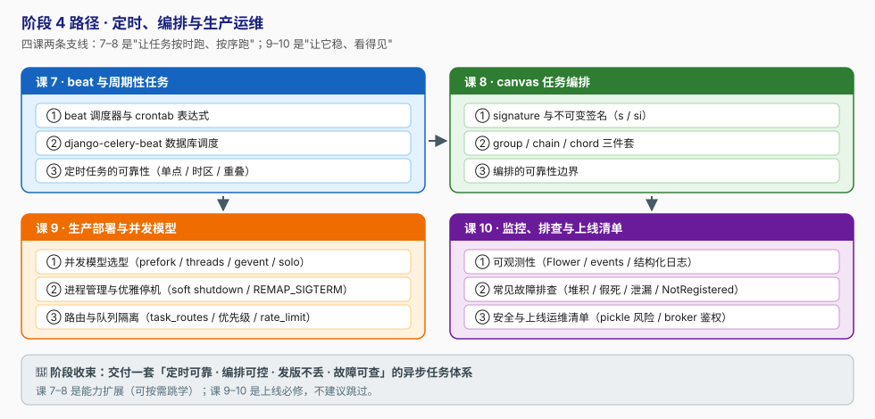

# 阶段 4：定时、编排与生产运维

> 所属课程：Celery + Django ｜ 故事章节：「上线之后才是开始」 ｜ 上一阶段：[阶段 3 · 可靠性与幂等](../3-可靠性与幂等/overview.md)

## 🎯 本阶段目标

- 用 beat / django-celery-beat 实现周期性任务，并躲开时区、单点、任务重叠三个经典坑。
- 用 canvas 把多个任务编排成工作流（并行、串行、barrier 汇聚），并知道**什么时候不该用**编排。
- 为不同类型任务选对并发模型与进程管理方案，配置优雅停机做到"发版不丢任务"。
- 建立可观测性（Flower / 事件 / 结构化日志），掌握常见故障的排查路径，产出一份上线自查清单。

## 📍 学习重点

- **beat 只是个"定时器"，不是守护者**：它只负责按时投递，任务本身仍走普通队列；beat 挂了定时任务就停了，且它**不补发**错过的任务。
- **时区坑**：`USE_TZ=True` + `timezone` 配置 + crontab 的 `nowfun`，三者不一致会让任务在"神秘时刻"执行。
- **canvas 是"任务级"编排，不是工作流引擎**：chord 依赖屏障语义、失败传播复杂，长事务编排应交给专门的编排系统。
- **并发模型决定吞吐上限**：CPU 密集用 prefork（进程数≈核数），IO 密集用 gevent/threads，Windows 用 solo。
- **优雅停机是部署必修课**：`TERM` 默认是 warm shutdown（等任务跑完），`QUIT` 是 cold shutdown（立刻终止）。Celery 5.5+ 新增 soft shutdown，专门解决"停机期间未完成任务要重新入队"的问题。

## ✅ 必须掌握的知识点

| 知识点 | 所属课 | 学完应能 |
|--------|--------|----------|
| beat 调度器与 crontab 表达式 | 课 7 | 写对 crontab / solar 调度，并解释时区配置三要素 |
| django-celery-beat 数据库调度 | 课 7 | 用 PeriodicTask 模型动态增删改定时任务 |
| 定时任务的可靠性 | 课 7 | 处理 beat 单点、重启遗漏、任务重叠三类问题 |
| signature 与不可变签名 | 课 8 | 说清 `s()` 与 `si()` 的参数传递差异 |
| group / chain / chord | 课 8 | 按场景选出正确的编排原语 |
| 编排的可靠性边界 | 课 8 | 判断某场景该用 canvas 还是外部编排系统 |
| 并发模型选型 | 课 9 | 按 CPU/IO 密集特征选定 pool 与并发数 |
| 进程管理与优雅停机 | 课 9 | 配 systemd + soft shutdown，做到发版不丢任务 |
| 路由与队列隔离 | 课 9 | 用 `task_routes` 隔离快慢任务，避免队头阻塞 |
| 可观测性 | 课 10 | 搭 Flower + 结构化日志，用 task_id 串联全链路 |
| 常见故障排查 | 课 10 | 按清单定位堆积 / 假死 / 泄漏 / NotRegistered |
| 安全与上线运维清单 | 课 10 | 产出一份可交付的上线自查清单（含 pickle 风险） |

## 🗺️ 本阶段路径图

## 本阶段产出

- [x] [`lessons/lesson-07-beat与周期性任务.md`](lessons/lesson-07-beat与周期性任务.md)
- [x] [`lessons/lesson-08-canvas任务编排.md`](lessons/lesson-08-canvas任务编排.md)
- [x] [`lessons/lesson-09-生产部署与并发模型.md`](lessons/lesson-09-生产部署与并发模型.md)
- [x] [`lessons/lesson-10-监控、排查与上线清单.md`](lessons/lesson-10-监控、排查与上线清单.md)

---

🧭 **下一阶段**：全部阶段完成后生成 `final-课程手册.md`，或用「考我一下 Celery」进入知识点对齐。
